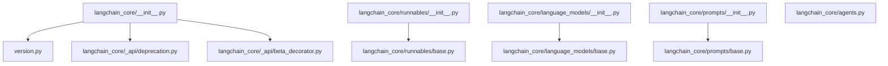
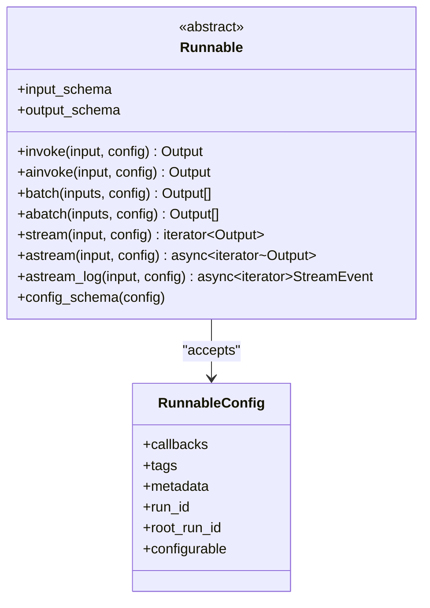
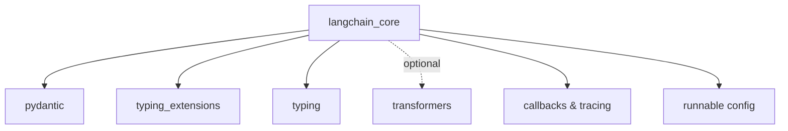

# API Reference

<cite>
**Referenced Files in This Document**
- [__init__.py](file://libs/core/langchain_core/__init__.py)
- [version.py](file://libs/core/langchain_core/version.py)
- [deprecation.py](file://libs/core/langchain_core/_api/deprecation.py)
- [beta_decorator.py](file://libs/core/langchain_core/_api/beta_decorator.py)
- [runnables/__init__.py](file://libs/core/langchain_core/runnables/__init__.py)
- [runnables/base.py](file://libs/core/langchain_core/runnables/base.py)
- [language_models/__init__.py](file://libs/core/langchain_core/language_models/__init__.py)
- [language_models/base.py](file://libs/core/langchain_core/language_models/base.py)
- [prompts/__init__.py](file://libs/core/langchain_core/prompts/__init__.py)
- [prompts/base.py](file://libs/core/langchain_core/prompts/base.py)
- [agents.py](file://libs/core/langchain_core/agents.py)
</cite>

## Table of Contents
1. [Introduction](#introduction)
2. [Project Structure](#project-structure)
3. [Core Components](#core-components)
4. [Architecture Overview](#architecture-overview)
5. [Detailed Component Analysis](#detailed-component-analysis)
6. [Dependency Analysis](#dependency-analysis)
7. [Performance Considerations](#performance-considerations)
8. [Troubleshooting Guide](#troubleshooting-guide)
9. [Conclusion](#conclusion)
10. [Appendices](#appendices)

## Introduction
This API reference documents the public interfaces of the LangChain core library. It focuses on the foundational abstractions that underpin the broader LangChain ecosystem:
- Runnables: The universal invocation protocol enabling synchronous, asynchronous, batch, and streaming operations.
- Language Models: Abstractions for both legacy string-based LLMs and modern chat models.
- Prompts: Templates and utilities for constructing model inputs.
- Agents: Legacy schemas for agent actions, steps, and finishes.

It also covers API versioning, deprecation and beta signaling, and provides guidance for migrating deprecated features.

## Project Structure
The core package exposes a concise public API surface with lazy dynamic imports to keep startup fast and minimize dependencies. Version information is centralized, and deprecation/beta utilities are provided for internal and external consumers.

**Diagram sources**
- [__init__.py](file://libs/core/langchain_core/__init__.py#L1-L21)
- [version.py](file://libs/core/langchain_core/version.py#L1-L4)
- [deprecation.py](file://libs/core/langchain_core/_api/deprecation.py#L1-L604)
- [beta_decorator.py](file://libs/core/langchain_core/_api/beta_decorator.py#L1-L254)
- [runnables/__init__.py](file://libs/core/langchain_core/runnables/__init__.py#L1-L137)
- [runnables/base.py](file://libs/core/langchain_core/runnables/base.py#L1-L200)
- [language_models/__init__.py](file://libs/core/langchain_core/language_models/__init__.py#L1-L117)
- [language_models/base.py](file://libs/core/langchain_core/language_models/base.py#L1-L200)
- [prompts/__init__.py](file://libs/core/langchain_core/prompts/__init__.py#L1-L102)
- [prompts/base.py](file://libs/core/langchain_core/prompts/base.py#L1-L200)
- [agents.py](file://libs/core/langchain_core/agents.py#L1-L257)

**Section sources**
- [__init__.py](file://libs/core/langchain_core/__init__.py#L1-L21)
- [version.py](file://libs/core/langchain_core/version.py#L1-L4)
- [runnables/__init__.py](file://libs/core/langchain_core/runnables/__init__.py#L1-L137)
- [language_models/__init__.py](file://libs/core/langchain_core/language_models/__init__.py#L1-L117)
- [prompts/__init__.py](file://libs/core/langchain_core/prompts/__init__.py#L1-L102)
- [agents.py](file://libs/core/langchain_core/agents.py#L1-L257)

## Core Components
This section summarizes the primary public modules and their responsibilities.

- Runnables
  - Purpose: Universal invocation protocol supporting sync/async/batch/streaming, with composition primitives (sequence, parallel, branching, routing, fallbacks).
  - Key exports: Runnable, RunnableSequence, RunnableParallel, RunnableBranch, RouterRunnable, RunnableWithFallbacks, RunnableWithMessageHistory, RunnableLambda, RunnableMap, RunnablePassthrough, RunnableAssign, RunnablePick, RunnableConfig, ConfigurableField family, AddableDict, chain, and helpers.
  - Dynamic imports: Lazy resolution via a mapping to minimize import overhead.

- Language Models
  - Purpose: Abstractions for both legacy LLMs (string-in/string-out) and modern chat models (message-in/message-out).
  - Key exports: BaseLanguageModel, BaseChatModel, LLM, BaseLLM, SimpleChatModel, Fake models, ModelProfile, ModelProfileRegistry, LangSmithParams, tokenization utilities, and compatibility helpers.

- Prompts
  - Purpose: Prompt templates and utilities for building inputs to language models.
  - Key exports: BasePromptTemplate, PromptTemplate, ChatPromptTemplate, FewShotPromptTemplate, StringPromptTemplate, DictPromptTemplate, and loaders/formatters.

- Agents (Legacy)
  - Purpose: Legacy schemas for agent actions, observations, and final returns.
  - Key exports: AgentAction, AgentActionMessageLog, AgentStep, AgentFinish, and conversion helpers.

**Section sources**
- [runnables/__init__.py](file://libs/core/langchain_core/runnables/__init__.py#L1-L137)
- [language_models/__init__.py](file://libs/core/langchain_core/language_models/__init__.py#L1-L117)
- [prompts/__init__.py](file://libs/core/langchain_core/prompts/__init__.py#L1-L102)
- [agents.py](file://libs/core/langchain_core/agents.py#L1-L257)

## Architecture Overview
The Runnables protocol forms the backbone of the system. It enables composition and interoperability across language models, prompts, and downstream components. The diagram below illustrates the central role of Runnable and its relationship to configuration and tracing.

**Diagram sources**
- [runnables/base.py](file://libs/core/langchain_core/runnables/base.py#L124-L200)

**Section sources**
- [runnables/base.py](file://libs/core/langchain_core/runnables/base.py#L124-L200)

## Detailed Component Analysis

### Runnables API
Public classes and functions exposed by the runnables module.

- Runnable
  - Description: Abstract base for all runnable units. Provides invoke/ainvoke, batch/abatch, stream/astream, and astream_log.
  - Key methods: invoke, ainvoke, batch, abatch, stream, astream, astream_log, input_schema, output_schema, config_schema.
  - Notes: Supports composition via | (sequence) and dict literals (parallel). Accepts optional RunnableConfig.

- RunnableSequence
  - Description: Composes runnables sequentially.
  - Usage pattern: runnable_a | runnable_b | runnable_c.

- RunnableParallel
  - Description: Runs multiple runnables concurrently on the same input.
  - Usage pattern: {"key": runnable} or {k: v for k, v in ...}.

- RunnableBranch
  - Description: Selects a branch based on a predicate.

- RouterRunnable
  - Description: Routes input to a specific runnable based on RouterInput.

- RunnableWithFallbacks
  - Description: Provides fallbacks when a runnable fails.

- RunnableWithMessageHistory
  - Description: Wraps a runnable with message history support.

- RunnableLambda, RunnableMap, RunnablePassthrough, RunnableAssign, RunnablePick
  - Description: Utility primitives for transforming, passing through, or selecting parts of inputs.

- RunnableConfig and helpers
  - Description: Configuration object and helpers (ensure_config, get_config_list, patch_config, run_in_executor).

- ConfigurableField family
  - Description: Mechanism to make runnables configurable at runtime.

- AddableDict
  - Description: Mutable dict-like container suitable for accumulating results.

- chain
  - Description: Convenience function for creating sequences.

- Dynamic imports
  - Description: Lazy import mapping ensures only requested symbols are loaded.

Example usage patterns (conceptual):
- Build a pipeline: RunnableLambda(...) | RunnableParallel({...}) | RunnableLambda(...)
- Configure retries and callbacks via RunnableConfig
- Make a runnable configurable using ConfigurableField

**Section sources**
- [runnables/__init__.py](file://libs/core/langchain_core/runnables/__init__.py#L1-L137)
- [runnables/base.py](file://libs/core/langchain_core/runnables/base.py#L124-L200)

### Language Models API
Public classes and functions exposed by the language models module.

- BaseLanguageModel
  - Description: Abstract base for language models. Inherits from RunnableSerializable and supports caching, verbosity, callbacks, tags, metadata, and custom token encoding.
  - Key fields: cache, verbose, callbacks, tags, metadata, custom_get_token_ids.
  - Key methods: generate, agenerate, invoke, ainvoke, stream, astream, and related async variants.
  - Notes: Input/Output types are aliased to concrete types for better schema inference.

- BaseChatModel
  - Description: Chat model abstraction for message-based inputs/outputs.

- LLM and BaseLLM
  - Description: Legacy string-in/string-out model abstractions.

- SimpleChatModel
  - Description: Minimal chat model implementation for quick prototyping.

- Fake models
  - Description: In-memory models for testing and demos.

- ModelProfile and ModelProfileRegistry
  - Description: Utilities for profiling and registry of model capabilities.

- LangSmithParams
  - Description: Typed parameters for tracing with LangSmith.

- Tokenization utilities
  - get_tokenizer: Provides a cached GPT-2 tokenizer; raises ImportError if transformers is not installed.
  - _get_token_ids_default_method: Fallback tokenization with warnings.

Example usage patterns (conceptual):
- Instantiate a chat model and call invoke/ainvoke with messages
- Wrap a runnable with caching and custom callbacks
- Use SimpleChatModel for demos and tests

**Section sources**
- [language_models/__init__.py](file://libs/core/langchain_core/language_models/__init__.py#L1-L117)
- [language_models/base.py](file://libs/core/langchain_core/language_models/base.py#L1-L200)

### Prompts API
Public classes and functions exposed by the prompts module.

- BasePromptTemplate
  - Description: Abstract base for prompt templates returning a PromptValue.
  - Key fields: input_variables, optional_variables, input_types, output_parser, partial_variables, metadata, tags.
  - Key methods: format_prompt, aformat_prompt, get_input_schema, and validation helpers.
  - Notes: Validates variable names and overlaps; supports partial variables and typed inputs.

- PromptTemplate
  - Description: String-based prompt template.

- ChatPromptTemplate
  - Description: Message-based prompt template.

- FewShotPromptTemplate and FewShotChatMessagePromptTemplate
  - Description: Few-shot examples templates.

- StringPromptTemplate and DictPromptTemplate
  - Description: Specialized string and dict templates.

- Loading and formatting utilities
  - load_prompt: Load a prompt from serialized form.
  - jinja2_formatter, validate_jinja2, check_valid_template, get_template_variables: Template helpers.

Example usage patterns (conceptual):
- Define a prompt with input variables and optional variables
- Use ChatPromptTemplate for multi-message prompts
- Apply FewShot examples to guide model behavior

**Section sources**
- [prompts/__init__.py](file://libs/core/langchain_core/prompts/__init__.py#L1-L102)
- [prompts/base.py](file://libs/core/langchain_core/prompts/base.py#L1-L200)

### Agents API (Legacy)
Public classes and functions exposed by the agents module.

- AgentAction
  - Description: Represents a tool invocation request with tool name, tool_input, and log.
  - Fields: tool, tool_input, log, type.
  - Methods: messages property to reconstruct AI messages.

- AgentActionMessageLog
  - Description: Similar to AgentAction but includes a message log for chat models.

- AgentStep
  - Description: Result of executing an AgentAction.
  - Fields: action, observation.
  - Methods: messages property to reconstruct observation messages.

- AgentFinish
  - Description: Final return value when an agent stops.
  - Fields: return_values, log, type.
  - Methods: is_lc_serializable, get_lc_namespace, messages property.

- Conversion helpers
  - _convert_agent_action_to_messages
  - _convert_agent_observation_to_messages
  - _create_function_message

Notes:
- The module warns that new agents should be built using the langchain library.
- These schemas are maintained for backwards compatibility.

Example usage patterns (conceptual):
- Serialize/deserialize agent actions and finishes
- Convert agent outputs to messages for downstream consumption

**Section sources**
- [agents.py](file://libs/core/langchain_core/agents.py#L1-L257)

## Dependency Analysis
The core package maintains a lean dependency profile. It relies on:
- Pydantic for data validation and serialization
- Typing extensions and typing for generic type hints
- Optional transformers for tokenization
- Internal utilities for callbacks, tracing, and configuration

**Diagram sources**
- [runnables/base.py](file://libs/core/langchain_core/runnables/base.py#L40-L100)
- [language_models/base.py](file://libs/core/langchain_core/language_models/base.py#L18-L40)

**Section sources**
- [runnables/base.py](file://libs/core/langchain_core/runnables/base.py#L40-L100)
- [language_models/base.py](file://libs/core/langchain_core/language_models/base.py#L18-L40)

## Performance Considerations
- Batch execution: Prefer batch/abatch for throughput when processing multiple inputs.
- Streaming: Use stream/astream and astream_log for low-latency, real-time UX.
- Async-first: Native async implementations can reduce overhead compared to thread-pool offloading.
- Caching: Enable caching judiciously; note that caching is not supported for streaming methods.
- Tokenization: Using a model-specific tokenizer yields accurate token counts; fallback GPT-2 tokenizer warns about potential inaccuracies.

[No sources needed since this section provides general guidance]

## Troubleshooting Guide
- Deprecation warnings
  - Use the provided deprecation utilities to emit or suppress standardized deprecation warnings.
  - Surface or suppress warnings globally during development or CI.

- Beta warnings
  - Beta features emit beta warnings; use suppression utilities when necessary.

- Versioning
  - The package version is centrally defined and surfaced via __version__.

- Common issues
  - Missing prompt variables: Ensure all required input variables are supplied; the system raises explicit errors with guidance.
  - Tokenizer availability: If transformers is not installed, tokenization will raise ImportError; install transformers to enable token counting.

**Section sources**
- [deprecation.py](file://libs/core/langchain_core/_api/deprecation.py#L538-L554)
- [beta_decorator.py](file://libs/core/langchain_core/_api/beta_decorator.py#L248-L254)
- [version.py](file://libs/core/langchain_core/version.py#L1-L4)
- [prompts/base.py](file://libs/core/langchain_core/prompts/base.py#L159-L200)
- [language_models/base.py](file://libs/core/langchain_core/language_models/base.py#L66-L112)

## Conclusion
The langchain-core package defines the foundational abstractions that power the LangChain ecosystem. Its Runnables protocol enables composable, production-grade programs with robust support for sync, async, batch, and streaming. The language model and prompt abstractions provide a consistent interface across providers, while the agents module preserves legacy schemas for compatibility. Centralized versioning and robust deprecation/beta utilities help maintain stability and communicate changes to users.

[No sources needed since this section summarizes without analyzing specific files]

## Appendices

### API Versioning and Compatibility
- Version
  - The package version is defined centrally and exposed as __version__.
  - Consumers can rely on this for compatibility checks.

- Deprecation and Beta
  - Deprecation decorator and warning utilities provide standardized messaging and migration guidance.
  - Beta decorator annotates experimental features and surfaces warnings.

- Migration guidance
  - Prefer newer patterns (e.g., building agents in the langchain library) and follow deprecation timelines.
  - Replace deprecated parameters and imports as indicated by warnings.

**Section sources**
- [version.py](file://libs/core/langchain_core/version.py#L1-L4)
- [deprecation.py](file://libs/core/langchain_core/_api/deprecation.py#L89-L170)
- [beta_decorator.py](file://libs/core/langchain_core/_api/beta_decorator.py#L32-L70)
- [agents.py](file://libs/core/langchain_core/agents.py#L1-L27)

### Configuration Options and Environment Variables
- RunnableConfig
  - Supports callbacks, tags, metadata, run_id, root_run_id, and configurable sub-keys.
  - Helpers: ensure_config, get_config_list, patch_config, run_in_executor.

- Language Model configuration
  - cache: Enable/disable caching or provide a cache instance.
  - verbose: Global or per-instance verbosity.
  - callbacks, tags, metadata: Tracing and observability hooks.
  - custom_get_token_ids: Override tokenization strategy.

- Prompt configuration
  - input_types: Specify expected types for input variables.
  - partial_variables: Pre-populate template variables.
  - output_parser: Post-process model outputs.

**Section sources**
- [runnables/base.py](file://libs/core/langchain_core/runnables/base.py#L50-L83)
- [language_models/base.py](file://libs/core/langchain_core/language_models/base.py#L140-L170)
- [prompts/base.py](file://libs/core/langchain_core/prompts/base.py#L44-L76)

### Cross-References
- Runnables
  - Related: RunnableSequence, RunnableParallel, RunnableBranch, RouterRunnable, RunnableWithFallbacks, RunnableWithMessageHistory, RunnableLambda, RunnableMap, RunnablePassthrough, RunnableAssign, RunnablePick, RunnableConfig, ConfigurableField family, AddableDict, chain.

- Language Models
  - Related: BaseChatModel, LLM, BaseLLM, SimpleChatModel, Fake models, ModelProfile, ModelProfileRegistry, LangSmithParams, tokenization utilities.

- Prompts
  - Related: PromptTemplate, ChatPromptTemplate, FewShotPromptTemplate, StringPromptTemplate, DictPromptTemplate, load_prompt, formatting utilities.

- Agents (Legacy)
  - Related: AgentAction, AgentActionMessageLog, AgentStep, AgentFinish, conversion helpers.

**Section sources**
- [runnables/__init__.py](file://libs/core/langchain_core/runnables/__init__.py#L63-L93)
- [language_models/__init__.py](file://libs/core/langchain_core/language_models/__init__.py#L63-L83)
- [prompts/__init__.py](file://libs/core/langchain_core/prompts/__init__.py#L44-L66)
- [agents.py](file://libs/core/langchain_core/agents.py#L44-L189)