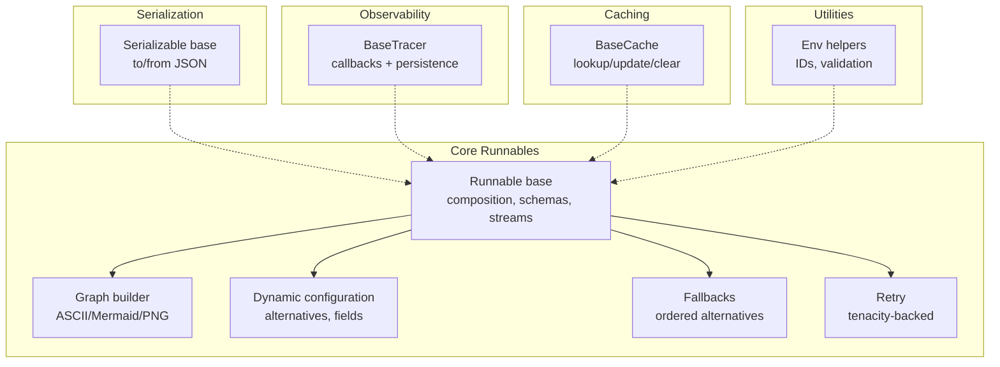
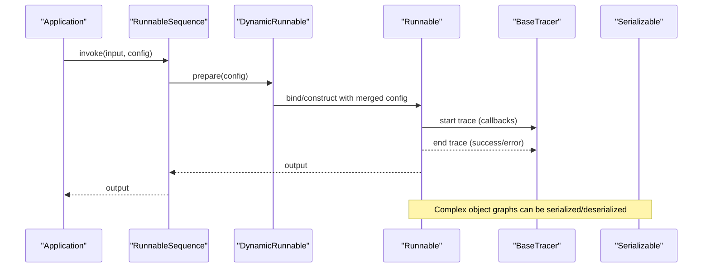
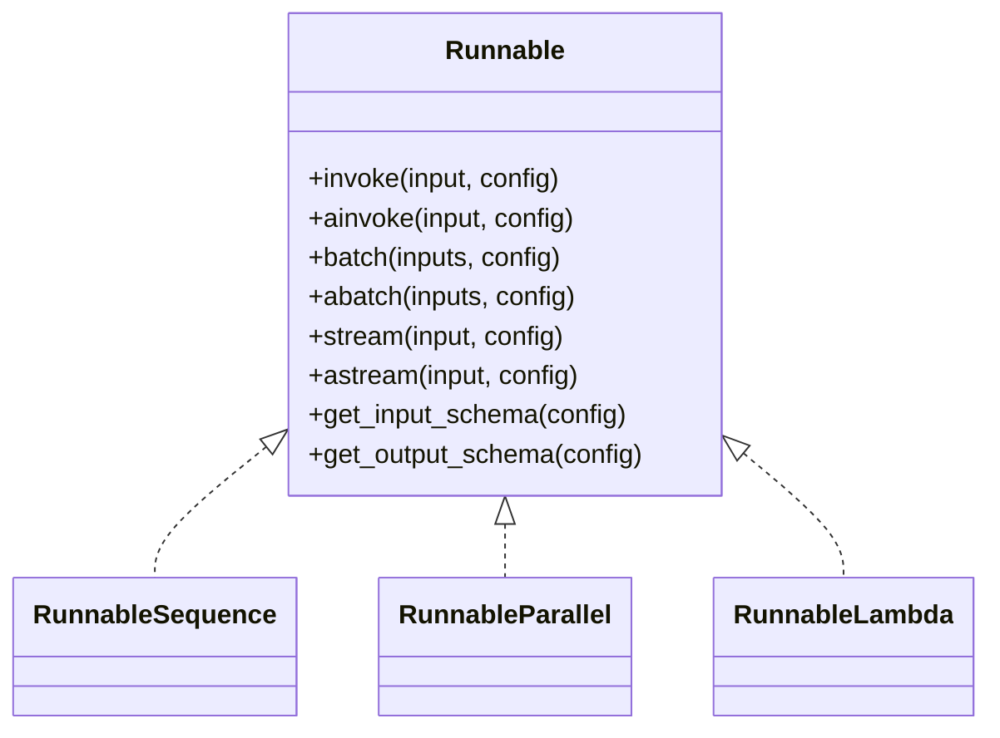
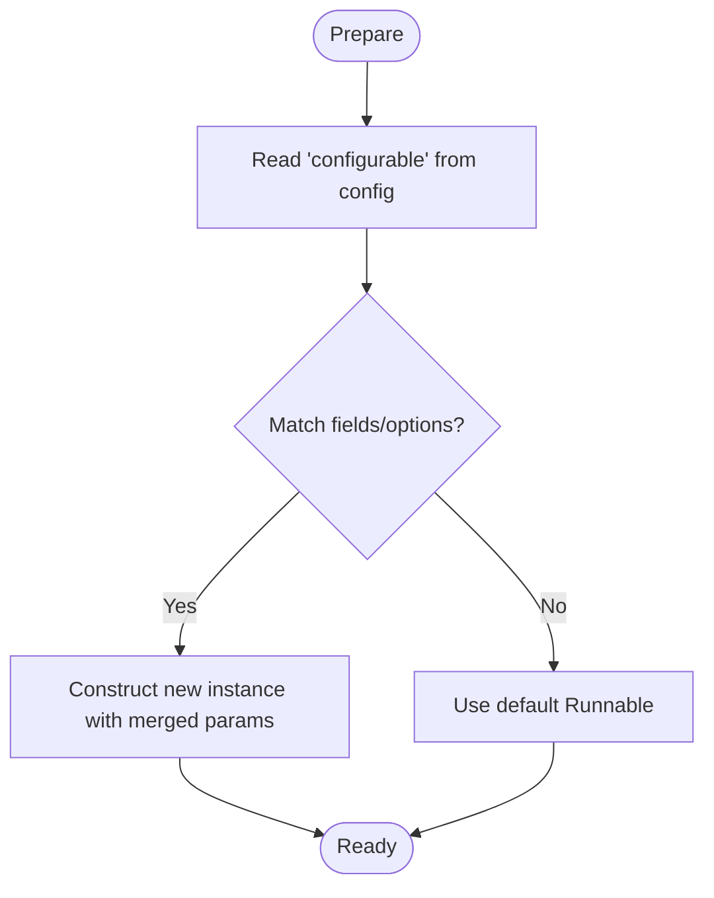
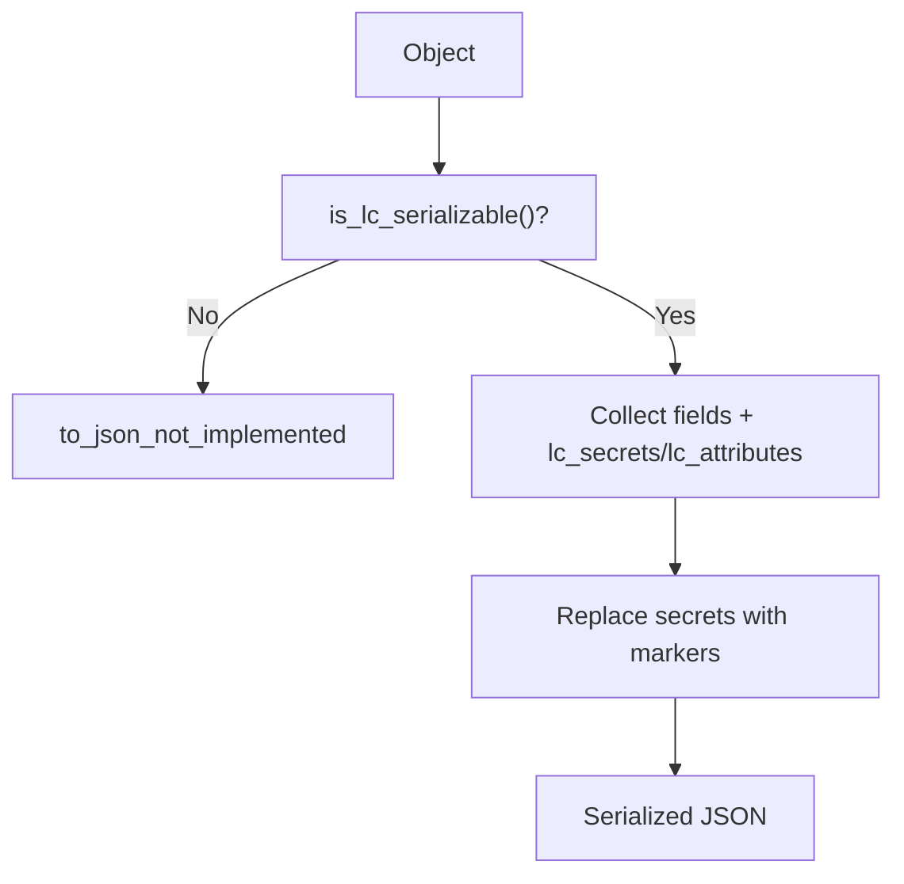
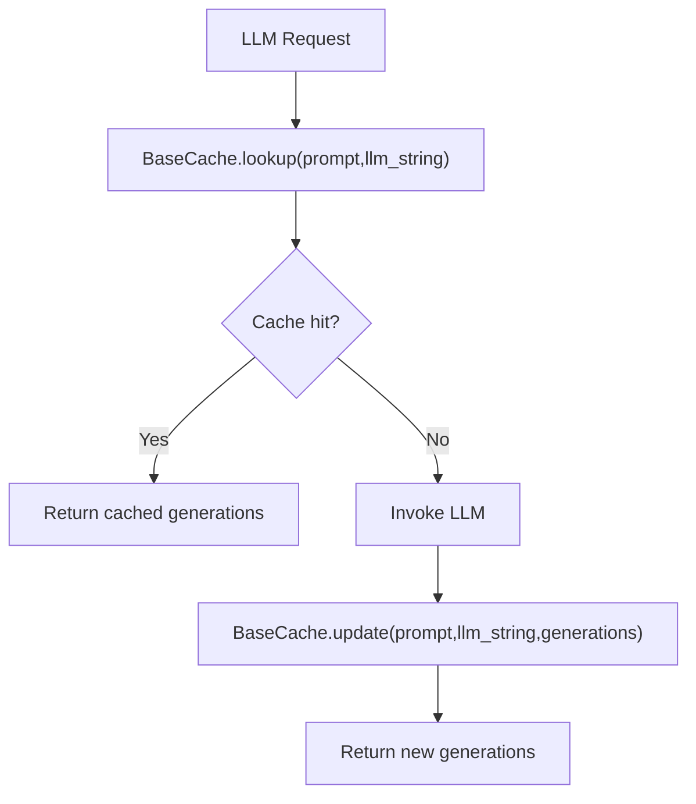
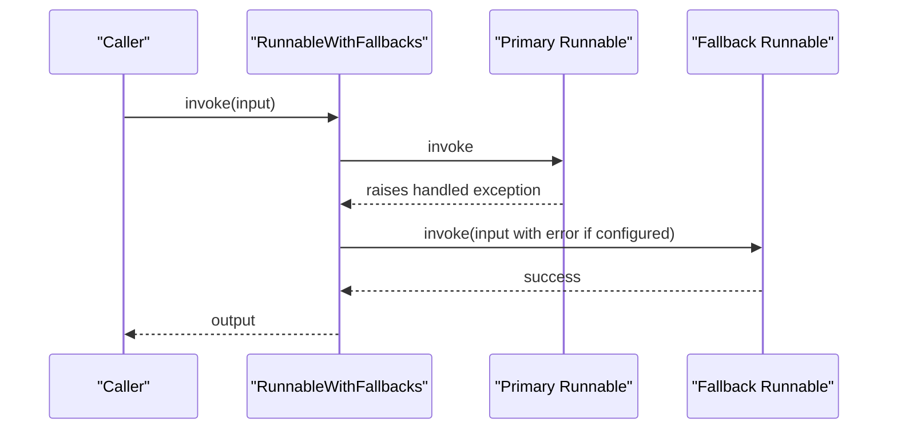
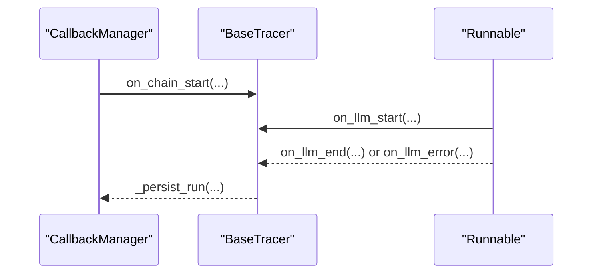
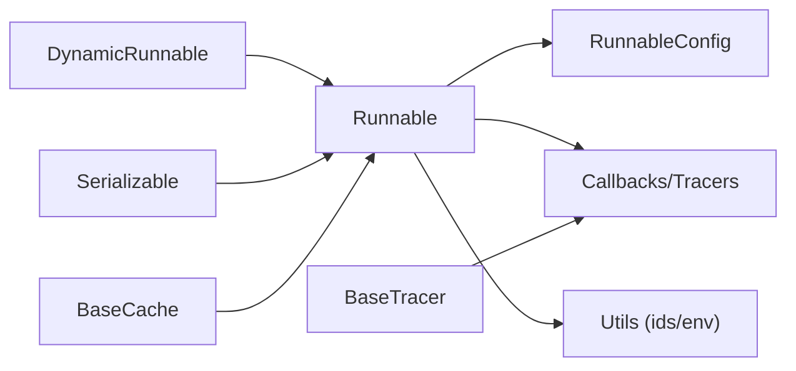

# Advanced Topics

<cite>
**Referenced Files in This Document**
- [base.py](file://libs/core/langchain_core/runnables/base.py)
- [__init__.py](file://libs/core/langchain_core/runnables/__init__.py)
- [serializable.py](file://libs/core/langchain_core/load/serializable.py)
- [configurable.py](file://libs/core/langchain_core/runnables/configurable.py)
- [graph.py](file://libs/core/langchain_core/runnables/graph.py)
- [base.py](file://libs/core/langchain_core/tracers/base.py)
- [fallbacks.py](file://libs/core/langchain_core/runnables/fallbacks.py)
- [retry.py](file://libs/core/langchain_core/runnables/retry.py)
- [caches.py](file://libs/core/langchain_core/caches.py)
- [utils.py](file://libs/core/langchain_core/utils/utils.py)
</cite>

## Table of Contents
1. [Introduction](#introduction)
2. [Project Structure](#project-structure)
3. [Core Components](#core-components)
4. [Architecture Overview](#architecture-overview)
5. [Detailed Component Analysis](#detailed-component-analysis)
6. [Dependency Analysis](#dependency-analysis)
7. [Performance Considerations](#performance-considerations)
8. [Troubleshooting Guide](#troubleshooting-guide)
9. [Conclusion](#conclusion)
10. [Appendices](#appendices)

## Introduction
This document provides advanced coverage of LangChain’s core abstractions and expert-level usage patterns. It focuses on:
- Extending core Runnables and building custom components
- Implementing dynamic configuration and alternatives
- Advanced LCEL features: composition, branching, conditional execution, and complex graphs
- Serialization/deserialization of complex object graphs and versioning strategies
- Caching and fallback/retry mechanisms for reliability and performance
- Monitoring and tracing for observability
- Debugging and production troubleshooting
- Contributing to the ecosystem and implementing cutting-edge patterns

## Project Structure
LangChain’s advanced features are centered around the core Runnables module and supporting subsystems:
- Runnables: base primitives, composition, branching, parallelism, and streaming
- Configuration: dynamic configuration and alternatives
- Tracing and monitoring: base tracer interfaces and streaming events
- Serialization: object graph serialization/deserialization
- Caching: optional caching layer for LLMs
- Utilities: environment helpers, ID generation, and validation



**Diagram sources**
- [base.py](file://libs/core/langchain_core/runnables/base.py#L124-L256)
- [graph.py](file://libs/core/langchain_core/runnables/graph.py#L252-L300)
- [configurable.py](file://libs/core/langchain_core/runnables/configurable.py#L49-L140)
- [serializable.py](file://libs/core/langchain_core/load/serializable.py#L88-L196)
- [base.py](file://libs/core/langchain_core/tracers/base.py#L33-L51)
- [caches.py](file://libs/core/langchain_core/caches.py#L32-L100)
- [utils.py](file://libs/core/langchain_core/utils/utils.py#L509-L522)

**Section sources**
- [__init__.py](file://libs/core/langchain_core/runnables/__init__.py#L1-L93)

## Core Components
- Runnable: The foundational unit supporting invoke/ainvoke, batch/abatch, stream/astream, and astream_log. It exposes input/output schemas and supports composition via | and parallel composition via dicts.
- Dynamic configuration: RunnableConfigurableFields and RunnableConfigurableAlternatives enable runtime selection of model variants and parameter sets.
- Fallbacks and retry: RunnableWithFallbacks and RunnableRetry provide robustness against transient failures.
- Graph: Graph captures the structure of Runnables, enabling visualization and introspection.
- Serializable: Base class for serializing complex object graphs with versioning and secret handling.
- Tracers: BaseTracer and AsyncBaseTracer define the tracing contract for LLM/tool/chain runs.
- Caches: BaseCache and InMemoryCache provide optional caching for LLM calls.

**Section sources**
- [base.py](file://libs/core/langchain_core/runnables/base.py#L124-L256)
- [configurable.py](file://libs/core/langchain_core/runnables/configurable.py#L49-L140)
- [fallbacks.py](file://libs/core/langchain_core/runnables/fallbacks.py#L36-L108)
- [retry.py](file://libs/core/langchain_core/runnables/retry.py#L48-L150)
- [graph.py](file://libs/core/langchain_core/runnables/graph.py#L252-L300)
- [serializable.py](file://libs/core/langchain_core/load/serializable.py#L88-L196)
- [base.py](file://libs/core/langchain_core/tracers/base.py#L33-L51)
- [caches.py](file://libs/core/langchain_core/caches.py#L32-L100)

## Architecture Overview
The advanced LCEL architecture composes Runnables into declarative pipelines with dynamic configuration, fallbacks, and observability. Serialization enables persistence and distribution of complex graphs. Caching reduces latency and cost. Tracing provides end-to-end visibility.



**Diagram sources**
- [base.py](file://libs/core/langchain_core/runnables/base.py#L124-L256)
- [configurable.py](file://libs/core/langchain_core/runnables/configurable.py#L120-L140)
- [base.py](file://libs/core/langchain_core/tracers/base.py#L33-L51)
- [serializable.py](file://libs/core/langchain_core/load/serializable.py#L196-L272)

## Detailed Component Analysis

### Custom Runnables and LCEL Composition
- Extend Runnable by subclassing and overriding invoke/ainvoke, batch/abatch, stream/astream, and optionally astream_log.
- Use get_input_schema/get_output_schema to expose Pydantic-based validation.
- Compose with | for sequential chaining and dict literals for parallel composition.
- Pick and assign for selective output shaping.



**Diagram sources**
- [base.py](file://libs/core/langchain_core/runnables/base.py#L124-L256)

**Section sources**
- [base.py](file://libs/core/langchain_core/runnables/base.py#L124-L256)

### Dynamic Configuration and Alternatives
- RunnableConfigurableFields: Adds runtime-configurable fields to a Runnable, merging user-provided values into a new instance.
- RunnableConfigurableAlternatives: Chooses among multiple alternatives based on a ConfigurableField, with optional key prefixing for nested configs.



**Diagram sources**
- [configurable.py](file://libs/core/langchain_core/runnables/configurable.py#L420-L460)

**Section sources**
- [configurable.py](file://libs/core/langchain_core/runnables/configurable.py#L318-L460)

### Advanced LCEL Patterns
- Conditional execution: Use RouterRunnable and RunnableBranch for routing based on conditions.
- Parallel composition: Combine Runnables in a dict to run concurrently.
- Streaming and logging: Use astream and astream_log for incremental feedback and diagnostics.
- Graph visualization: Use Graph to render ASCII/Mermaid/PNG views of pipelines.

```mermaid
sequenceDiagram
participant App as "App"
participant Par as "RunnableParallel"
participant A as "Runnable A"
participant B as "Runnable B"
App->>Par : invoke(input)
Par->>A : concurrently process
Par->>B : concurrently process
A-->>Par : chunk A
B-->>Par : chunk B
Par-->>App : merged stream
```

**Diagram sources**
- [base.py](file://libs/core/langchain_core/runnables/base.py#L618-L658)
- [graph.py](file://libs/core/langchain_core/runnables/graph.py#L507-L524)

**Section sources**
- [base.py](file://libs/core/langchain_core/runnables/base.py#L618-L658)
- [graph.py](file://libs/core/langchain_core/runnables/graph.py#L507-L524)

### Serialization and Versioning
- Serializable provides to_json and to_json_not_implemented, capturing lc version, id, and kwargs.
- Secrets are replaced with special markers during serialization.
- Deserialization requires allowed objects and namespaces; versioning is explicit via lc field.



**Diagram sources**
- [serializable.py](file://libs/core/langchain_core/load/serializable.py#L196-L272)

**Section sources**
- [serializable.py](file://libs/core/langchain_core/load/serializable.py#L88-L196)
- [serializable.py](file://libs/core/langchain_core/load/serializable.py#L196-L272)

### Caching Strategies
- BaseCache defines lookup/update/clear with async variants.
- InMemoryCache provides bounded in-memory caching with FIFO eviction.
- Recommended for repeated prompts and deterministic model invocations.



**Diagram sources**
- [caches.py](file://libs/core/langchain_core/caches.py#L32-L100)
- [caches.py](file://libs/core/langchain_core/caches.py#L155-L213)

**Section sources**
- [caches.py](file://libs/core/langchain_core/caches.py#L32-L100)
- [caches.py](file://libs/core/langchain_core/caches.py#L155-L213)

### Fallbacks and Retry
- RunnableWithFallbacks tries runnables in order on failure, optionally forwarding the last error to subsequent steps.
- RunnableRetry uses tenacity for exponential backoff with jitter and configurable stop conditions.



**Diagram sources**
- [fallbacks.py](file://libs/core/langchain_core/runnables/fallbacks.py#L166-L214)
- [retry.py](file://libs/core/langchain_core/runnables/retry.py#L179-L201)

**Section sources**
- [fallbacks.py](file://libs/core/langchain_core/runnables/fallbacks.py#L36-L108)
- [retry.py](file://libs/core/langchain_core/runnables/retry.py#L48-L150)

### Monitoring and Tracing
- BaseTracer and AsyncBaseTracer define hooks for LLM/tool/chain lifecycle events.
- Integrates with callback managers and supports persistence of runs.



**Diagram sources**
- [base.py](file://libs/core/langchain_core/tracers/base.py#L33-L51)
- [base.py](file://libs/core/langchain_core/tracers/base.py#L241-L341)

**Section sources**
- [base.py](file://libs/core/langchain_core/tracers/base.py#L33-L51)
- [base.py](file://libs/core/langchain_core/tracers/base.py#L241-L341)

### Utilities for Production
- Environment helpers: from_env/secret_from_env for safe configuration loading.
- ID utilities: ensure_id for consistent run identifiers.
- Validation: xor_args for mutually exclusive arguments.

**Section sources**
- [utils.py](file://libs/core/langchain_core/utils/utils.py#L334-L421)
- [utils.py](file://libs/core/langchain_core/utils/utils.py#L509-L522)

## Dependency Analysis
Key dependencies and coupling:
- Runnables depend on configuration, callbacks, and tracing utilities.
- Dynamic configuration composes with defaults and merges user-provided values.
- Serialization depends on Pydantic models and namespace resolution.
- Tracing integrates with callback managers and run lifecycles.
- Caching is orthogonal and can decorate any Runnable.



**Diagram sources**
- [base.py](file://libs/core/langchain_core/runnables/base.py#L124-L256)
- [configurable.py](file://libs/core/langchain_core/runnables/configurable.py#L120-L140)
- [serializable.py](file://libs/core/langchain_core/load/serializable.py#L88-L196)
- [base.py](file://libs/core/langchain_core/tracers/base.py#L33-L51)
- [caches.py](file://libs/core/langchain_core/caches.py#L32-L100)
- [utils.py](file://libs/core/langchain_core/utils/utils.py#L509-L522)

**Section sources**
- [base.py](file://libs/core/langchain_core/runnables/base.py#L124-L256)
- [configurable.py](file://libs/core/langchain_core/runnables/configurable.py#L120-L140)
- [serializable.py](file://libs/core/langchain_core/load/serializable.py#L88-L196)
- [base.py](file://libs/core/langchain_core/tracers/base.py#L33-L51)
- [caches.py](file://libs/core/langchain_core/caches.py#L32-L100)
- [utils.py](file://libs/core/langchain_core/utils/utils.py#L509-L522)

## Performance Considerations
- Concurrency and batching: Prefer batch/abatch for throughput; use gather_with_concurrency for async limits.
- Memory management: Use streaming (astream/astream_log) to reduce memory footprint; avoid materializing large intermediate results.
- Caching: Enable BaseCache for repeated prompts; tune maxsize and eviction policies.
- Retry/backoff: Use RunnableRetry with exponential jitter to smooth transient failures.
- Graph trimming: Use Graph.trim_first_node/trim_last_node to simplify visualization and reduce overhead.
- Environment configuration: Load secrets and IDs via from_env/secret_from_env to avoid repeated parsing.

[No sources needed since this section provides general guidance]

## Troubleshooting Guide
- Debugging: Set global debug flag or attach callbacks to inspect intermediate results.
- Tracing: Implement BaseTracer to persist runs and correlate errors; use astream_log for incremental diagnostics.
- Fallbacks: Verify exception types and ensure fallbacks accept the same input schema.
- Serialization: Confirm allowed_objects and valid_namespaces; check lc version compatibility.
- Caching: Validate keys (prompt + llm_string) and ensure deterministic generation.

**Section sources**
- [base.py](file://libs/core/langchain_core/runnables/base.py#L232-L255)
- [base.py](file://libs/core/langchain_core/tracers/base.py#L33-L51)
- [fallbacks.py](file://libs/core/langchain_core/runnables/fallbacks.py#L166-L214)
- [serializable.py](file://libs/core/langchain_core/load/serializable.py#L196-L272)
- [caches.py](file://libs/core/langchain_core/caches.py#L32-L100)

## Conclusion
LangChain’s advanced Runnables enable robust, scalable, and observable LLM applications. By combining dynamic configuration, fallbacks, retry, caching, and serialization, teams can build production-grade systems with strong reliability and maintainability. Observability through tracing and graph visualization supports debugging and performance tuning at scale.

[No sources needed since this section summarizes without analyzing specific files]

## Appendices
- Practical examples: Use RunnableLambda for custom logic, RunnableParallel for fan-out, and Graph to visualize pipelines.
- Contributing: Follow LangChain’s contribution guide to propose new Runnables, tracers, or caching backends.

[No sources needed since this section provides general guidance]