# Agent Fundamentals

<cite>
**Referenced Files in This Document**
- [agents.py](file://libs/core/langchain_core/agents.py)
- [agent.py](file://libs/langchain/langchain_classic/agents/agent.py)
- [types.py](file://libs/langchain/langchain_classic/agents/types.py)
- [initialize.py](file://libs/langchain/langchain_classic/agents/initialize.py)
- [tools.py](file://libs/langchain/langchain_classic/agents/tools.py)
- [schema.py](file://libs/langchain/langchain_classic/agents/schema.py)
- [load_tools.py](file://libs/langchain/langchain_classic/agents/load_tools.py)
- [loading.py](file://libs/langchain/langchain_classic/agents/loading.py)
- [base.py](file://libs/langchain/langchain_classic/chains/base.py)
- [runnables/base.py](file://libs/core/langchain_core/runnables/base.py)
- [messages/base.py](file://libs/core/langchain_core/messages/base.py)
- [messages/chat.py](file://libs/core/langchain_core/messages/chat.py)
- [messages/function.py](file://libs/core/langchain_core/messages/function.py)
- [messages/system.py](file://libs/core/langchain_core/messages/system.py)
- [messages/human.py](file://libs/core/langchain_core/messages/human.py)
- [messages/ai.py](file://libs/core/langchain_core/messages/ai.py)
- [tools/base.py](file://libs/core/langchain_core/tools/base.py)
- [tools/simple.py](file://libs/core/langchain_core/tools/simple.py)
- [tools/structured.py](file://libs/core/langchain_core/tools/structured.py)
- [memory/base.py](file://libs/langchain/langchain_classic/memory/base.py)
- [memory/__init__.py](file://libs/langchain/langchain_classic/memory/__init__.py)
- [load/dump.py](file://libs/core/langchain_core/load/dump.py)
- [load/load.py](file://libs/core/langchain_core/load/load.py)
- [load/serializable.py](file://libs/core/langchain_core/load/serializable.py)
- [load/mapping.py](file://libs/core/langchain_core/load/mapping.py)
- [tracers/base.py](file://libs/core/langchain_core/tracers/base.py)
- [tracers/langchain.py](file://libs/core/langchain_core/tracers/langchain.py)
- [tracers/context.py](file://libs/core/langchain_core/tracers/context.py)
- [tracers/event_stream.py](file://libs/core/langchain_core/tracers/event_stream.py)
- [tracers/memory_stream.py](file://libs/core/langchain_core/tracers/memory_stream.py)
- [tracers/run_collector.py](file://libs/core/langchain_core/tracers/run_collector.py)
- [tracers/schemas.py](file://libs/core/langchain_core/tracers/schemas.py)
- [runnables/config.py](file://libs/core/langchain_core/runnables/config.py)
- [runnables/history.py](file://libs/core/langchain_core/runnables/history.py)
- [runnables/graph.py](file://libs/core/langchain_core/runnables/graph.py)
- [runnables/retry.py](file://libs/core/langchain_core/runnables/retry.py)
- [runnables/router.py](file://libs/core/langchain_core/runnables/router.py)
- [runnables/fallbacks.py](file://libs/core/langchain_core/runnables/fallbacks.py)
- [runnables/passthrough.py](file://libs/core/langchain_core/runnables/passthrough.py)
- [runnables/utils.py](file://libs/core/langchain_core/runnables/utils.py)
- [runnables/schema.py](file://libs/core/langchain_core/runnables/schema.py)
- [prompts/base.py](file://libs/core/langchain_core/prompts/base.py)
- [prompts/chat.py](file://libs/core/langchain_core/prompts/chat.py)
- [prompts/string.py](file://libs/core/langchain_core/prompts/string.py)
- [prompts/message.py](file://libs/core/langchain_core/prompts/message.py)
- [prompts/prompt.py](file://libs/core/langchain_core/prompts/prompt.py)
- [prompts/structured.py](file://libs/core/langchain_core/prompts/structured.py)
- [language_models/base.py](file://libs/core/langchain_core/language_models/base.py)
- [language_models/chat_models.py](file://libs/core/langchain_core/language_models/chat_models.py)
- [language_models/llms.py](file://libs/core/langchain_core/language_models/llms.py)
- [outputs/generation.py](file://libs/core/langchain_core/outputs/generation.py)
- [outputs/chat_generation.py](file://libs/core/langchain_core/outputs/chat_generation.py)
- [outputs/llm_result.py](file://libs/core/langchain_core/outputs/llm_result.py)
- [outputs/chat_result.py](file://libs/core/langchain_core/outputs/chat_result.py)
- [outputs/run_info.py](file://libs/core/langchain_core/outputs/run_info.py)
- [exceptions.py](file://libs/core/langchain_core/exceptions.py)
- [utils/input.py](file://libs/core/langchain_core/utils/input.py)
- [utils/formatting.py](file://libs/core/langchain_core/utils/formatting.py)
- [utils/json.py](file://libs/core/langchain_core/utils/json.py)
- [utils/uuid.py](file://libs/core/langchain_core/utils/uuid.py)
- [utils/usage.py](file://libs/core/langchain_core/utils/usage.py)
- [utils/interactive_env.py](file://libs/core/langchain_core/utils/interactive_env.py)
- [utils/function_calling.py](file://libs/core/langchain_core/utils/function_calling.py)
- [utils/pydantic.py](file://libs/core/langchain_core/utils/pydantic.py)
- [utils/strings.py](file://libs/core/langchain_core/utils/strings.py)
- [utils/env.py](file://libs/core/langchain_core/utils/env.py)
- [utils/html.py](file://libs/core/langchain_core/utils/html.py)
- [utils/image.py](file://libs/core/langchain_core/utils/image.py)
- [utils/iter.py](file://libs/core/langchain_core/utils/iter.py)
- [utils/merge.py](file://libs/core/langchain_core/utils/_merge.py)
- [utils/utils.py](file://libs/core/langchain_core/utils/utils.py)
- [utils/mustache.py](file://libs/core/langchain_core/utils/mustache.py)
- [utils/json_schema.py](file://libs/core/langchain_core/utils/json_schema.py)
- [utils/usage.py](file://libs/core/langchain_core/utils/usage.py)
- [utils/uuid.py](file://libs/core/langchain_core/utils/uuid.py)
- [utils/interactive_env.py](file://libs/core/langchain_core/utils/interactive_env.py)
- [utils/function_calling.py](file://libs/core/langchain_core/utils/function_calling.py)
- [utils/pydantic.py](file://libs/core/langchain_core/utils/pydantic.py)
- [utils/strings.py](file://libs/core/langchain_core/utils/strings.py)
- [utils/env.py](file://libs/core/langchain_core/utils/env.py)
- [utils/html.py](file://libs/core/langchain_core/utils/html.py)
- [utils/image.py](file://libs/core/langchain_core/utils/image.py)
- [utils/iter.py](file://libs/core/langchain_core/utils/iter.py)
- [utils/merge.py](file://libs/core/langchain_core/utils/_merge.py)
- [utils/utils.py](file://libs/core/langchain_core/utils/utils.py)
- [utils/mustache.py](file://libs/core/langchain_core/utils/mustache.py)
- [utils/json_schema.py](file://libs/core/langchain_core/utils/json_schema.py)
- [utils/usage.py](file://libs/core/langchain_core/utils/usage.py)
- [utils/uuid.py](file://libs/core/langchain_core/utils/uuid.py)
- [utils/interactive_env.py](file://libs/core/langchain_core/utils/interactive_env.py)
- [utils/function_calling.py](file://libs/core/langchain_core/utils/function_calling.py)
- [utils/pydantic.py](file://libs/core/langchain_core/utils/pydantic.py)
- [utils/strings.py](file://libs/core/langchain_core/utils/strings.py)
- [utils/env.py](file://libs/core/langchain_core/utils/env.py)
- [utils/html.py](file://libs/core/langchain_core/utils/html.py)
- [utils/image.py](file://libs/core/langchain_core/utils/image.py)
- [utils/iter.py](file://libs/core/langchain_core/utils/iter.py)
- [utils/merge.py](file://libs/core/langchain_core/utils/_merge.py)
- [utils/utils.py](file://libs/core/langchain_core/utils/utils.py)
- [utils/mustache.py](file://libs/core/langchain_core/utils/mustache.py)
- [utils/json_schema.py](file://libs/core/langchain_core/utils/json_schema.py)
- [utils/usage.py](file://libs/core/langchain_core/utils/usage.py)
- [utils/uuid.py](file://libs/core/langchain_core/utils/uuid.py)
- [utils/interactive_env.py](file://libs/core/langchain_core/utils/interactive_env.py)
- [utils/function_calling.py](file://libs/core/langchain_core/utils/function_calling.py)
- [utils/pydantic.py](file://libs/core/langchain_core/utils/pydantic.py)
- [utils/strings.py](file://libs/core/langchain_core/utils/strings.py)
- [utils/env.py](file://libs/core/langchain_core/utils/env.py)
- [utils/html.py](file://libs/core/langchain_core/utils/html.py)
- [utils/image.py](file://libs/core/langchain_core/utils/image.py)
- [utils/iter.py](file://libs/core/langchain_core/utils/iter.py)
- [utils/merge.py](file://libs/core/langchain_core/utils/_merge.py)
- [utils/utils.py](file://libs/core/langchain_core/utils/utils.py)
- [utils/mustache.py](file://libs/core/langchain_core/utils/mustache.py)
- [utils/json_schema.py](file://libs/core/langchain_core/utils/json_schema.py)
- [utils/usage.py](file://libs/core/langchain_core/utils/usage.py)
- [utils/uuid.py](file://libs/core/langchain_core/utils/uuid.py)
- [utils/interactive_env.py](file://libs/core/langchain_core/utils/interactive_env.py)
- [utils/function_calling.py](file://libs/core/langchain_core/utils/function_calling.py)
- [utils/pydantic.py](file://libs/core/langchain_core/utils/pydantic.py)
- [utils/strings.py](file://libs/core/langchain_core/utils/strings.py)
- [utils/env.py](file://libs/core/langchain_core/utils/env.py)
- [utils/html.py](file://libs/core/langchain_core/utils/html.py)
- [utils/image.py](file://libs/core/langchain_core/utils/image.py)
- [utils/iter.py](file://libs/core/langchain_core/utils/iter.py)
- [utils/merge.py](file://libs/core/langchain_core/utils/_merge.py)
- [utils/utils.py](file://libs/core/langchain_core/utils/utils.py)
- [utils/mustache.py](file://libs/core/langchain_core/utils/mustache.py)
- [utils/json_schema.py](file://libs/core/langchain_core/utils/json_schema.py)
- [utils/usage.py](file://libs/core/langchain_core/utils/usage.py)
- [utils/uuid.py](file://libs/core/langchain_core/utils/uuid.py)
- [utils/interactive_env.py](file://libs/core/langchain_core/utils/interactive_env.py)
- [utils/function_calling.py](file://libs/core/langchain_core/utils/function_calling.py)
- [utils/pydantic.py](file://libs/core/langchain_core/utils/pydantic.py)
- [utils/strings.py](file://libs/core/langchain_core/utils/strings.py)
- [utils/env.py](file://libs/core/langchain_core/utils/env.py)
- [utils/html.py](file://libs/core/langchain_core/utils/html.py)
- [utils/image.py](file://libs/core/langchain_core/utils/image.py)
- [utils/iter.py](file://libs/core/langchain_core/utils/iter.py)
- [utils/merge.py](file://libs/core/langchain_core/utils/_merge.py)
- [utils/utils.py](file://libs/core/langchain_core/utils/utils.py)
- [utils/mustache.py](file://libs/core/langchain_core/utils/mustache.py)
- [utils/json_schema.py](file://libs/core/langchain_core/utils/json_schema.py)
- [utils/usage.py](file://libs/core/langchain_core/utils/usage.py)
- [utils/uuid.py](file://libs/core/langchain_core/utils/uuid.py)
- [utils/interactive_env.py](file://libs/core/langchain_core/utils/interactive_env.py)
- [utils/function_calling.py](file://libs/core/langchain_core/utils/function_calling.py)
- [utils/pydantic.py](file://libs/core/langchain_core/utils/pydantic.py)
- [utils/strings.py](file://libs/core/langchain_core/utils/strings.py)
- [utils/env.py](file://libs/core/langchain_core/utils/env.py)
- [utils/html.py](file://libs/core/langchain_core/utils/html.py)
- [utils/image.py](file://libs/core/langchain_core/utils/image.py)
- [......length: 100000000000000000000000000000000000000000000000000000000000000000000000000000000000000000000000000000000000000000000000000000000000000000000000000000000000000000000000000000000000000000000000000000000000000000000000000000000000000000000000000000000000000000000000000000000000000000000000000000000000000000000000000000000000000000000000000000000000000000000000000000000000000000000000000000000000000000000000000000000000000000000000000000000000000000000000000000000000000000000000000000000000000000000......]
</cite>

## Table of Contents
1. [Introduction](#introduction)
2. [Project Structure](#project-structure)
3. [Core Components](#core-components)
4. [Architecture Overview](#architecture-overview)
5. [Detailed Component Analysis](#detailed-component-analysis)
6. [Dependency Analysis](#dependency-analysis)
7. [Performance Considerations](#performance-considerations)
8. [Troubleshooting Guide](#troubleshooting-guide)
9. [Conclusion](#conclusion)
10. [Appendices](#appendices)

## Introduction
This document explains LangChain’s agent fundamentals with a focus on the lifecycle of autonomous agents versus simple chains, the agent interface and configuration, agent–tool–memory relationships, agent types and selection criteria, practical creation and execution examples, state management, error handling, debugging, and serialization for persistence and sharing. It synthesizes the core agent schema definitions and the classic agent implementation to provide a cohesive guide for both newcomers and experienced practitioners.

## Project Structure
LangChain organizes agent-related capabilities across two primary layers:
- Core primitives and schemas in langchain_core (serialization, messages, tools, runnables, tracing, loading)
- Classic agent implementations and utilities in langchain/langchain_classic (agent types, initialization, loading, tools, memory)

Key areas:
- Agent schemas and lifecycle primitives in langchain_core
- Agent types and orchestration in langchain_classic
- Tools and tool wrappers in langchain_core
- Tracing and observability in langchain_core
- Serialization and loading in langchain_core

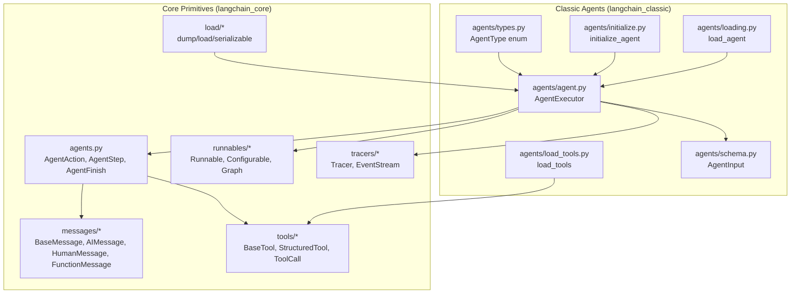

**Diagram sources**
- [agents.py](file://libs/core/langchain_core/agents.py#L44-L189)
- [messages/base.py](file://libs/core/langchain_core/messages/base.py)
- [messages/ai.py](file://libs/core/langchain_core/messages/ai.py)
- [messages/human.py](file://libs/core/langchain_core/messages/human.py)
- [messages/function.py](file://libs/core/langchain_core/messages/function.py)
- [tools/base.py](file://libs/core/langchain_core/tools/base.py)
- [tools/structured.py](file://libs/core/langchain_core/tools/structured.py)
- [runnables/base.py](file://libs/core/langchain_core/runnables/base.py)
- [load/dump.py](file://libs/core/langchain_core/load/dump.py)
- [load/load.py](file://libs/core/langchain_core/load/load.py)
- [load/serializable.py](file://libs/core/langchain_core/load/serializable.py)
- [tracers/base.py](file://libs/core/langchain_core/tracers/base.py)
- [agent.py](file://libs/langchain/langchain_classic/agents/agent.py)
- [types.py](file://libs/langchain/langchain_classic/agents/types.py)
- [initialize.py](file://libs/langchain/langchain_classic/agents/initialize.py)
- [loading.py](file://libs/langchain/langchain_classic/agents/loading.py)
- [load_tools.py](file://libs/langchain/langchain_classic/agents/load_tools.py)
- [schema.py](file://libs/langchain/langchain_classic/agents/schema.py)

**Section sources**
- [agents.py](file://libs/core/langchain_core/agents.py#L1-L257)
- [agent.py](file://libs/langchain/langchain_classic/agents/agent.py)
- [types.py](file://libs/langchain/langchain_classic/agents/types.py)
- [initialize.py](file://libs/langchain/langchain_classic/agents/initialize.py)
- [load_tools.py](file://libs/langchain/langchain_classic/agents/load_tools.py)
- [loading.py](file://libs/langchain/langchain_classic/agents/loading.py)
- [schema.py](file://libs/langchain/langchain_classic/agents/schema.py)

## Core Components
This section introduces the foundational agent data models and their roles in the agent lifecycle.

- AgentAction: Represents a tool invocation request with tool name, tool input, and a log carrying reasoning or prediction context. It can optionally carry a message log for chat models.
- AgentStep: Encapsulates the result of executing an AgentAction, pairing the action with the observation returned by the tool.
- AgentFinish: Signifies the termination of an agent run with return values and a log capturing the final LLM output for observability.
- Message conversion helpers: Functions to reconstruct AIMessage/HumanMessage/FunctionMessage sequences from actions and observations, enabling consistent message histories.

These primitives underpin the agent loop: predict action → execute tool → observe → decide next action until finish.

**Section sources**
- [agents.py](file://libs/core/langchain_core/agents.py#L44-L189)
- [agents.py](file://libs/core/langchain_core/agents.py#L191-L257)

## Architecture Overview
The agent architecture couples an executor with language models, tools, and optional memory. The executor orchestrates the decision loop, while tools provide capabilities and messages represent the conversation history.

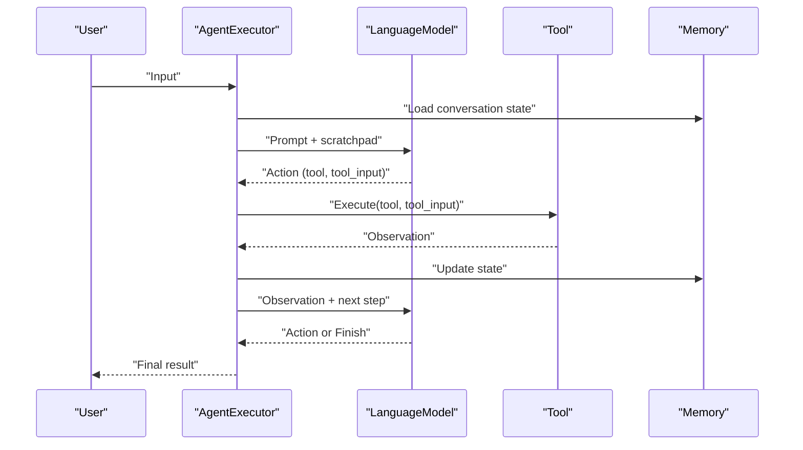

**Diagram sources**
- [agent.py](file://libs/langchain/langchain_classic/agents/agent.py)
- [agents.py](file://libs/core/langchain_core/agents.py#L44-L189)
- [messages/base.py](file://libs/core/langchain_core/messages/base.py)
- [tools/base.py](file://libs/core/langchain_core/tools/base.py)
- [memory/base.py](file://libs/langchain/langchain_classic/memory/base.py)

## Detailed Component Analysis

### Agent Lifecycle and Decision Loop
The lifecycle spans input processing, planning, tool execution, observation, and termination. The core loop alternates between:
- Predicting the next action via a language model conditioned on input and history
- Executing the selected tool and receiving an observation
- Updating memory and repeating until a finish condition is met

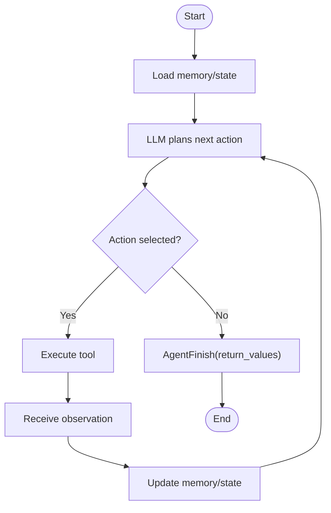

**Diagram sources**
- [agents.py](file://libs/core/langchain_core/agents.py#L44-L189)
- [agent.py](file://libs/langchain/langchain_classic/agents/agent.py)
- [memory/base.py](file://libs/langchain/langchain_classic/memory/base.py)

**Section sources**
- [agents.py](file://libs/core/langchain_core/agents.py#L17-L26)
- [agents.py](file://libs/core/langchain_core/agents.py#L44-L189)

### Agent Interface, Configuration, and Initialization Patterns
- AgentExecutor: The central orchestrator that ties together an agent plan, tools, memory, and configuration.
- Initialization patterns:
  - initialize_agent: Creates an agent executor with a specified agent type, tools, and language model.
  - load_agent: Loads a persisted agent configuration.
- Configuration options include:
  - Agent type selection (e.g., zero-shot-react-description)
  - Tool selection and registration
  - Memory provider
  - Prompt templates and scratchpad formatting
  - Callbacks and tracing
  - Concurrency and retries

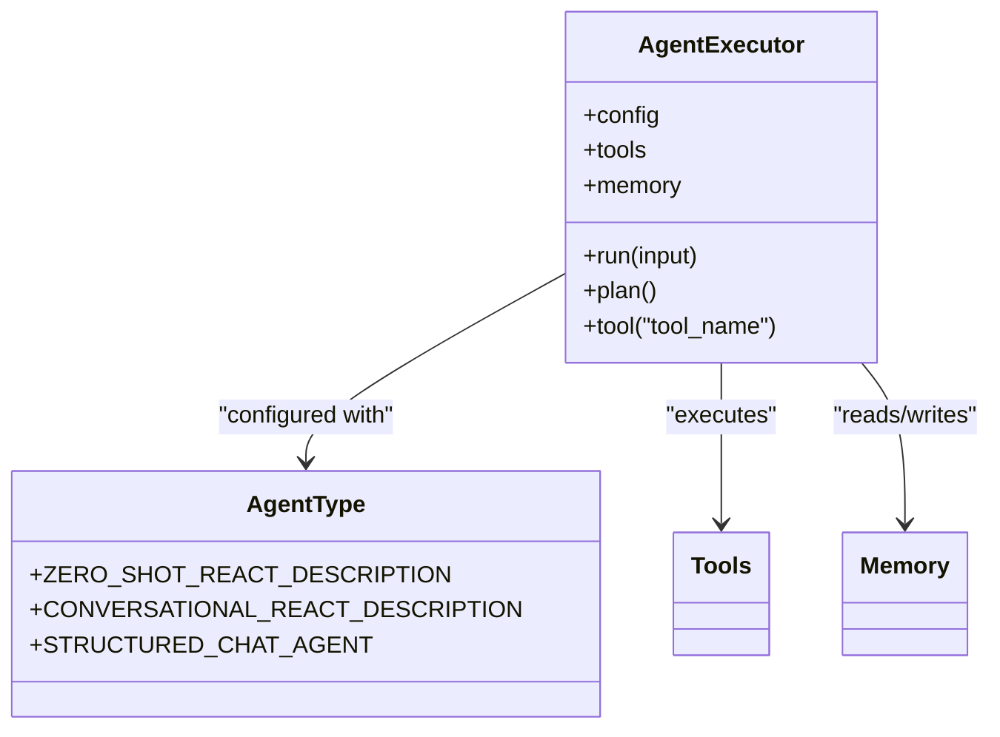

**Diagram sources**
- [agent.py](file://libs/langchain/langchain_classic/agents/agent.py)
- [types.py](file://libs/langchain/langchain_classic/agents/types.py)
- [initialize.py](file://libs/langchain/langchain_classic/agents/initialize.py)
- [tools/base.py](file://libs/core/langchain_core/tools/base.py)

**Section sources**
- [agent.py](file://libs/langchain/langchain_classic/agents/agent.py)
- [types.py](file://libs/langchain/langchain_classic/agents/types.py)
- [initialize.py](file://libs/langchain/langchain_classic/agents/initialize.py)
- [schema.py](file://libs/langchain/langchain_classic/agents/schema.py)

### Relationship Between Agents, Tools, and Memory Systems
- Tools: Provide capabilities (functions, retrievers, APIs). Tools are validated and invoked by the executor. Structured tools expose JSON schemas for LLM reasoning.
- Memory: Stores and retrieves conversation history and agent state to maintain continuity across turns.
- Integration: The executor passes tool outputs into memory updates and uses memory to enrich prompts for subsequent decisions.

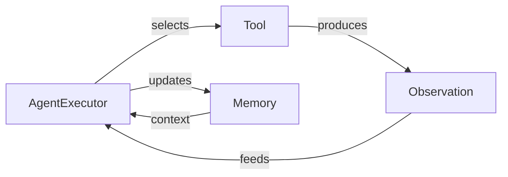

**Diagram sources**
- [tools/base.py](file://libs/core/langchain_core/tools/base.py)
- [tools/structured.py](file://libs/core/langchain_core/tools/structured.py)
- [memory/base.py](file://libs/langchain/langchain_classic/memory/base.py)
- [agents.py](file://libs/core/langchain_core/agents.py#L131-L144)

**Section sources**
- [tools/base.py](file://libs/core/langchain_core/tools/base.py)
- [tools/structured.py](file://libs/core/langchain_core/tools/structured.py)
- [memory/base.py](file://libs/langchain/langchain_classic/memory/base.py)

### Agent Types Enumeration and Selection Criteria
Agent types enumerate supported planning strategies and output parsers. Selection criteria include:
- Task complexity and need for tool use
- Conversational continuity requirements
- Structured output needs
- Debugging and interpretability preferences

Common types include:
- Zero-shot React description
- Conversational React description
- Structured chat agent

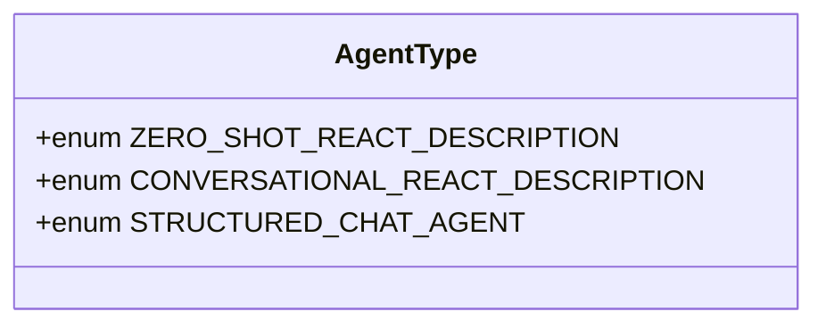

**Diagram sources**
- [types.py](file://libs/langchain/langchain_classic/agents/types.py)

**Section sources**
- [types.py](file://libs/langchain/langchain_classic/agents/types.py)

### Practical Examples: Basic Agent Creation, Configuration, and Execution
- Create tools: Define simple or structured tools with names, descriptions, and schemas.
- Initialize agent: Use initialize_agent with agent type, tools, and language model.
- Configure prompts and memory: Provide prompt templates and memory instances.
- Execute: Call run on the executor with user input; iterate until completion.

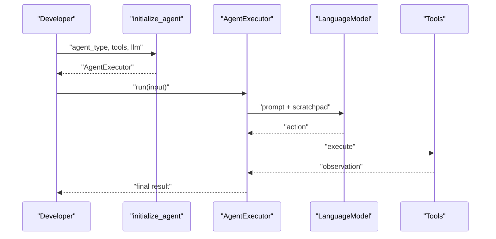

**Diagram sources**
- [initialize.py](file://libs/langchain/langchain_classic/agents/initialize.py)
- [agent.py](file://libs/langchain/langchain_classic/agents/agent.py)
- [load_tools.py](file://libs/langchain/langchain_classic/agents/load_tools.py)

**Section sources**
- [initialize.py](file://libs/langchain/langchain_classic/agents/initialize.py)
- [agent.py](file://libs/langchain/langchain_classic/agents/agent.py)
- [load_tools.py](file://libs/langchain/langchain_classic/agents/load_tools.py)

### Agent State Management
State includes:
- Conversation history in memory
- Scratchpad content for planning context
- Intermediate steps and logs for observability

State transitions occur after each action–observation pair, updating memory and preparing context for the next decision.

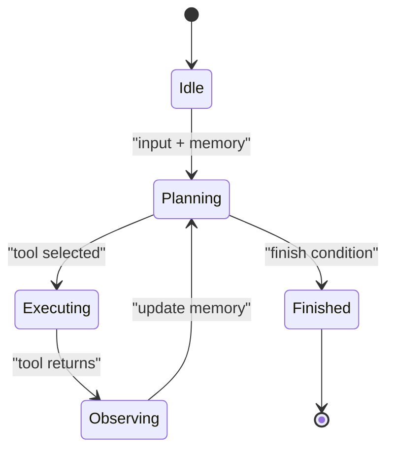

**Diagram sources**
- [agents.py](file://libs/core/langchain_core/agents.py#L131-L144)
- [memory/base.py](file://libs/langchain/langchain_classic/memory/base.py)

**Section sources**
- [agents.py](file://libs/core/langchain_core/agents.py#L131-L144)
- [memory/base.py](file://libs/langchain/langchain_classic/memory/base.py)

### Error Handling and Debugging Approaches
- Observability: Use tracers to capture events, streams, and run collectors for end-to-end visibility.
- Logging: Leverage message logs and action logs to reconstruct reasoning and diagnose failures.
- Retries and fallbacks: Apply runnable-level retries and fallbacks for robust execution.
- Validation: Validate tool inputs and outputs using schemas and parsers.

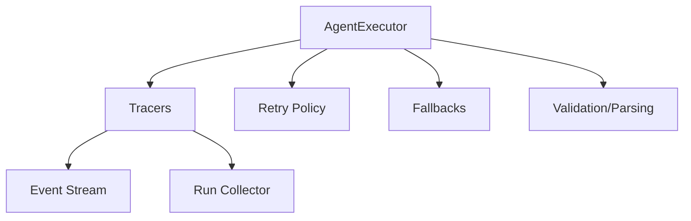

**Diagram sources**
- [tracers/base.py](file://libs/core/langchain_core/tracers/base.py)
- [tracers/event_stream.py](file://libs/core/langchain_core/tracers/event_stream.py)
- [tracers/run_collector.py](file://libs/core/langchain_core/tracers/run_collector.py)
- [runnables/retry.py](file://libs/core/langchain_core/runnables/retry.py)
- [runnables/fallbacks.py](file://libs/core/langchain_core/runnables/fallbacks.py)

**Section sources**
- [tracers/base.py](file://libs/core/langchain_core/tracers/base.py)
- [tracers/event_stream.py](file://libs/core/langchain_core/tracers/event_stream.py)
- [tracers/run_collector.py](file://libs/core/langchain_core/tracers/run_collector.py)
- [runnables/retry.py](file://libs/core/langchain_core/runnables/retry.py)
- [runnables/fallbacks.py](file://libs/core/langchain_core/runnables/fallbacks.py)

### Serialization and Deserialization for Persistence and Sharing
Agents and related components are serializable:
- Serializable base enables consistent serialization across objects.
- dump/load utilities support saving and restoring agent configurations and state.
- Mapping registry ensures correct reconstruction of objects during load.

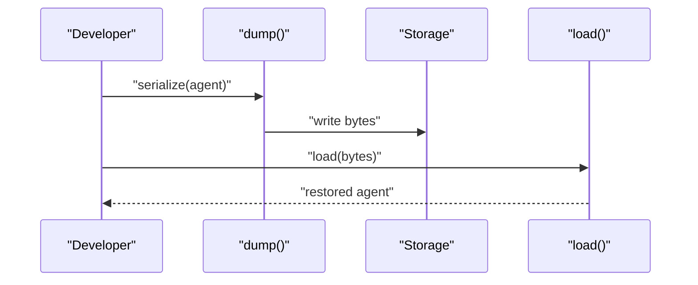

**Diagram sources**
- [load/serializable.py](file://libs/core/langchain_core/load/serializable.py)
- [load/dump.py](file://libs/core/langchain_core/load/dump.py)
- [load/load.py](file://libs/core/langchain_core/load/load.py)
- [load/mapping.py](file://libs/core/langchain_core/load/mapping.py)

**Section sources**
- [load/serializable.py](file://libs/core/langchain_core/load/serializable.py)
- [load/dump.py](file://libs/core/langchain_core/load/dump.py)
- [load/load.py](file://libs/core/langchain_core/load/load.py)
- [load/mapping.py](file://libs/core/langchain_core/load/mapping.py)

## Dependency Analysis
The agent stack exhibits layered dependencies:
- Core primitives (agents, messages, tools, runnables, load) form the foundation
- Classic agents build on top of these primitives
- Tracers and utilities enhance observability and reliability

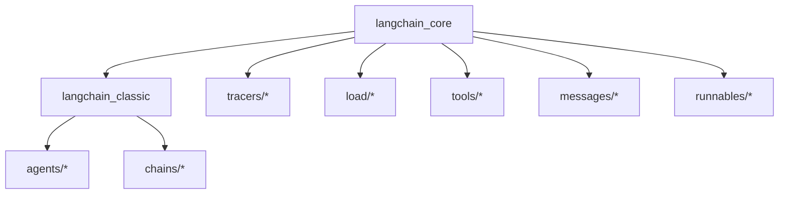

**Diagram sources**
- [agents.py](file://libs/core/langchain_core/agents.py#L44-L189)
- [agent.py](file://libs/langchain/langchain_classic/agents/agent.py)
- [tracers/base.py](file://libs/core/langchain_core/tracers/base.py)
- [load/serializable.py](file://libs/core/langchain_core/load/serializable.py)
- [tools/base.py](file://libs/core/langchain_core/tools/base.py)
- [messages/base.py](file://libs/core/langchain_core/messages/base.py)
- [runnables/base.py](file://libs/core/langchain_core/runnables/base.py)

**Section sources**
- [agents.py](file://libs/core/langchain_core/agents.py#L44-L189)
- [agent.py](file://libs/langchain/langchain_classic/agents/agent.py)
- [tracers/base.py](file://libs/core/langchain_core/tracers/base.py)
- [load/serializable.py](file://libs/core/langchain_core/load/serializable.py)
- [tools/base.py](file://libs/core/langchain_core/tools/base.py)
- [messages/base.py](file://libs/core/langchain_core/messages/base.py)
- [runnables/base.py](file://libs/core/langchain_core/runnables/base.py)

## Performance Considerations
- Minimize redundant memory reads/writes by batching updates and using efficient prompt templates.
- Prefer structured tools with concise schemas to reduce LLM reasoning overhead.
- Use runnable retries judiciously and configure timeouts for long-running tools.
- Employ streaming tracers to reduce latency and improve responsiveness.

## Troubleshooting Guide
- Use tracers to inspect events and run collectors for end-to-end diagnostics.
- Inspect action logs and message logs to trace LLM reasoning and tool invocations.
- Validate tool inputs and outputs against schemas to catch malformed data early.
- Enable verbose logging and streaming outputs for interactive debugging.

**Section sources**
- [tracers/base.py](file://libs/core/langchain_core/tracers/base.py)
- [tracers/event_stream.py](file://libs/core/langchain_core/tracers/event_stream.py)
- [tracers/run_collector.py](file://libs/core/langchain_core/tracers/run_collector.py)
- [exceptions.py](file://libs/core/langchain_core/exceptions.py)

## Conclusion
LangChain’s agent fundamentals center on a clear lifecycle, robust schemas, and modular composition of language models, tools, and memory. By leveraging the provided agent types, initialization patterns, and serialization utilities, developers can build reliable, observable, and extensible autonomous agents tailored to diverse tasks.

## Appendices
- Agent schemas and lifecycle primitives
- Agent types and selection criteria
- Tool definition and structured tool schemas
- Memory providers and state management
- Tracing and observability utilities
- Serialization and loading mechanisms