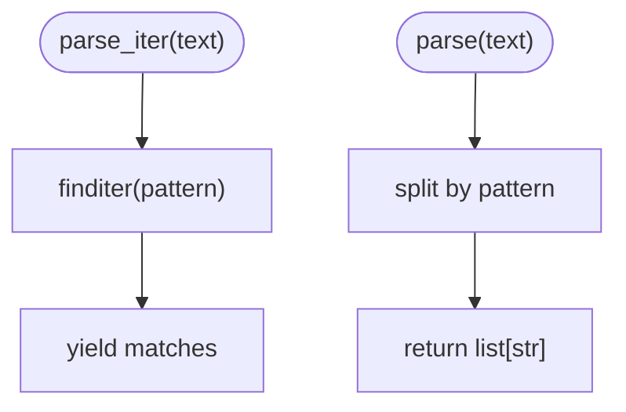

# Agent Output Parsing

<cite>
**Referenced Files in This Document**
- [__init__.py](file://libs/core/langchain_core/output_parsers/__init__.py)
- [base.py](file://libs/core/langchain_core/output_parsers/base.py)
- [json.py](file://libs/core/langchain_core/output_parsers/json.py)
- [xml.py](file://libs/core/langchain_core/output_parsers/xml.py)
- [pydantic.py](file://libs/core/langchain_core/output_parsers/pydantic.py)
- [openai_tools.py](file://libs/core/langchain_core/output_parsers/openai_tools.py)
- [string.py](file://libs/core/langchain_core/output_parsers/string.py)
- [list.py](file://libs/core/langchain_core/output_parsers/list.py)
- [transform.py](file://libs/core/langchain_core/output_parsers/transform.py)
- [format_instructions.py](file://libs/core/langchain_core/output_parsers/format_instructions.py)
- [json_utils.py](file://libs/core/langchain_core/utils/json.py)
- [pydantic_utils.py](file://libs/core/langchain_core/utils/pydantic.py)
</cite>

## Table of Contents
1. [Introduction](#introduction)
2. [Project Structure](#project-structure)
3. [Core Components](#core-components)
4. [Architecture Overview](#architecture-overview)
5. [Detailed Component Analysis](#detailed-component-analysis)
6. [Dependency Analysis](#dependency-analysis)
7. [Performance Considerations](#performance-considerations)
8. [Troubleshooting Guide](#troubleshooting-guide)
9. [Conclusion](#conclusion)

## Introduction
This document explains agent output parsing systems in the repository, focusing on how structured information is extracted from agent responses. It covers the roles of output parsers, the available parser types (JSON, XML, tool-based, list, string), parsing strategies for different agent types and output formats, error handling and recovery for malformed outputs, validation and schema enforcement, result transformation patterns, and integration with different output formats. It also clarifies the relationship between parsers and agent types.

## Project Structure
The output parsing subsystem resides under the core library’s output parsers package. It defines base abstractions, streaming-aware transforms, and concrete parsers for common structured formats and tool-calling scenarios.

**Diagram sources**
- [base.py](file://libs/core/langchain_core/output_parsers/base.py#L30-L349)
- [transform.py](file://libs/core/langchain_core/output_parsers/transform.py#L28-L176)
- [string.py](file://libs/core/langchain_core/output_parsers/string.py#L8-L64)
- [list.py](file://libs/core/langchain_core/output_parsers/list.py#L43-L250)
- [json.py](file://libs/core/langchain_core/output_parsers/json.py#L31-L140)
- [pydantic.py](file://libs/core/langchain_core/output_parsers/pydantic.py#L19-L140)
- [xml.py](file://libs/core/langchain_core/output_parsers/xml.py#L151-L301)
- [openai_tools.py](file://libs/core/langchain_core/output_parsers/openai_tools.py#L140-L375)
- [format_instructions.py](file://libs/core/langchain_core/output_parsers/format_instructions.py#L3-L17)

**Section sources**
- [__init__.py](file://libs/core/langchain_core/output_parsers/__init__.py#L1-L102)

## Core Components
- Base abstractions define the contract for parsing language model outputs and integrate with the runnable pipeline for synchronous and asynchronous invocation.
- Streaming-aware transforms enable incremental parsing and diffing for partial results.
- Concrete parsers target specific output formats and agent patterns:
  - JSON: robust parsing with optional Pydantic validation and partial JSON support.
  - XML: streaming-safe parsing with optional secure parser selection.
  - Tools: parsing OpenAI-style tool calls and converting to typed tool calls or Pydantic models.
  - Lists: parsing comma-separated, markdown, and numbered lists.
  - String: extracting plain text from model outputs.
- Utilities support JSON parsing, partial JSON recovery, and Pydantic compatibility helpers.

**Section sources**
- [base.py](file://libs/core/langchain_core/output_parsers/base.py#L30-L349)
- [transform.py](file://libs/core/langchain_core/output_parsers/transform.py#L28-L176)
- [json.py](file://libs/core/langchain_core/output_parsers/json.py#L31-L140)
- [xml.py](file://libs/core/langchain_core/output_parsers/xml.py#L151-L301)
- [openai_tools.py](file://libs/core/langchain_core/output_parsers/openai_tools.py#L140-L375)
- [list.py](file://libs/core/langchain_core/output_parsers/list.py#L43-L250)
- [string.py](file://libs/core/langchain_core/output_parsers/string.py#L8-L64)
- [json_utils.py](file://libs/core/langchain_core/utils/json.py#L58-L229)
- [pydantic_utils.py](file://libs/core/langchain_core/utils/pydantic.py#L78-L126)

## Architecture Overview
The parsing architecture separates concerns between:
- Base interfaces: unified parsing contracts for single and streaming inputs.
- Transform layer: streaming-friendly parsing with partial-result accumulation and optional diffing.
- Format-specific parsers: specialized logic per output format with validation and schema enforcement.
- Agent integration: parsers are attached to runnable chains to post-process model outputs.

**Diagram sources**
- [base.py](file://libs/core/langchain_core/output_parsers/base.py#L136-L349)
- [transform.py](file://libs/core/langchain_core/output_parsers/transform.py#L28-L176)
- [json.py](file://libs/core/langchain_core/output_parsers/json.py#L31-L140)
- [pydantic.py](file://libs/core/langchain_core/output_parsers/pydantic.py#L19-L140)
- [xml.py](file://libs/core/langchain_core/output_parsers/xml.py#L151-L301)
- [openai_tools.py](file://libs/core/langchain_core/output_parsers/openai_tools.py#L140-L375)
- [string.py](file://libs/core/langchain_core/output_parsers/string.py#L8-L64)
- [list.py](file://libs/core/langchain_core/output_parsers/list.py#L43-L250)

## Detailed Component Analysis

### JSON Output Parsing
- Purpose: Convert raw LLM text into structured JSON, optionally validating against a Pydantic model.
- Strategies:
  - Full JSON parsing with strict error reporting.
  - Partial JSON parsing for streaming scenarios, yielding progressively complete objects.
  - Optional Pydantic validation for schema enforcement and type safety.
- Integration: Works with both single-shot and streaming generations; integrates with format instructions for schema guidance.
- Error handling: Raises structured exceptions on invalid JSON; supports graceful handling of partial results.

**Diagram sources**
- [json.py](file://libs/core/langchain_core/output_parsers/json.py#L61-L102)
- [json_utils.py](file://libs/core/langchain_core/utils/json.py#L142-L192)

**Section sources**
- [json.py](file://libs/core/langchain_core/output_parsers/json.py#L31-L140)
- [format_instructions.py](file://libs/core/langchain_core/output_parsers/format_instructions.py#L3-L17)
- [json_utils.py](file://libs/core/langchain_core/utils/json.py#L142-L229)

### XML Output Parsing
- Purpose: Convert raw LLM text into a structured dictionary, supporting streaming-safe parsing.
- Strategies:
  - Streaming XML parsing via pull parser with safe defaults.
  - Optional secure parser selection to mitigate XML vulnerabilities.
  - Extraction of XML from fenced blocks and cleanup of encoding declarations.
- Error handling: Raises structured exceptions on malformed XML; handles incomplete chunks gracefully during streaming.

**Diagram sources**
- [xml.py](file://libs/core/langchain_core/output_parsers/xml.py#L206-L281)

**Section sources**
- [xml.py](file://libs/core/langchain_core/output_parsers/xml.py#L151-L301)

### Tool Output Parsing (OpenAI-style)
- Purpose: Parse tool-call-like outputs into typed tool calls or Pydantic models.
- Strategies:
  - Parse raw tool call arguments as JSON, with support for partial JSON and strict modes.
  - Filter by tool name and return either full tool calls or just arguments.
  - Convert to Pydantic models using provided tool schemas.
- Error handling: Aggregates errors across multiple tool calls; logs helpful hints for truncated outputs.

**Diagram sources**
- [openai_tools.py](file://libs/core/langchain_core/output_parsers/openai_tools.py#L166-L222)
- [json_utils.py](file://libs/core/langchain_core/utils/json.py#L58-L137)

**Section sources**
- [openai_tools.py](file://libs/core/langchain_core/output_parsers/openai_tools.py#L140-L375)
- [json_utils.py](file://libs/core/langchain_core/utils/json.py#L58-L137)

### Pydantic Output Parsing
- Purpose: Enforce schema compliance using Pydantic models and provide strongly-typed outputs.
- Strategies:
  - Build on JSON parsing; validate parsed objects against Pydantic models.
  - Support both v1 and v2 model APIs with appropriate validation paths.
  - Provide format instructions with JSON schema for LLM guidance.
- Error handling: Converts validation errors into structured parser exceptions with context.

**Diagram sources**
- [pydantic.py](file://libs/core/langchain_core/output_parsers/pydantic.py#L19-L140)
- [json.py](file://libs/core/langchain_core/output_parsers/json.py#L31-L140)

**Section sources**
- [pydantic.py](file://libs/core/langchain_core/output_parsers/pydantic.py#L19-L140)
- [pydantic_utils.py](file://libs/core/langchain_core/utils/pydantic.py#L78-L126)

### List Output Parsing
- Purpose: Parse various list formats (comma-separated, markdown, numbered) into arrays of strings.
- Strategies:
  - Streaming-aware parsing with incremental completion detection.
  - Pattern-based extraction for numbered and markdown lists.
- Error handling: Gracefully handles incomplete lists during streaming; yields complete items as they form.

**Diagram sources**
- [list.py](file://libs/core/langchain_core/output_parsers/list.py#L213-L245)

**Section sources**
- [list.py](file://libs/core/langchain_core/output_parsers/list.py#L43-L250)

### String Output Parsing
- Purpose: Extract plain text from model outputs for downstream processing.
- Strategies:
  - Identity transform for text; supports streaming chunks.
- Integration: Simplest parser, often used as a terminal stage in chains.

**Section sources**
- [string.py](file://libs/core/langchain_core/output_parsers/string.py#L8-L64)

## Dependency Analysis
- Base classes unify parsing contracts and integrate with the runnable pipeline for invocation and streaming.
- Transform layer depends on base classes and adds streaming semantics with partial-result accumulation and optional diffing.
- Format-specific parsers depend on shared utilities for JSON parsing and Pydantic compatibility.
- Tool parsers depend on message structures and JSON utilities for argument parsing.

**Diagram sources**
- [base.py](file://libs/core/langchain_core/output_parsers/base.py#L30-L349)
- [transform.py](file://libs/core/langchain_core/output_parsers/transform.py#L28-L176)
- [json.py](file://libs/core/langchain_core/output_parsers/json.py#L31-L140)
- [pydantic.py](file://libs/core/langchain_core/output_parsers/pydantic.py#L19-L140)
- [xml.py](file://libs/core/langchain_core/output_parsers/xml.py#L151-L301)
- [openai_tools.py](file://libs/core/langchain_core/output_parsers/openai_tools.py#L140-L375)
- [json_utils.py](file://libs/core/langchain_core/utils/json.py#L58-L229)
- [pydantic_utils.py](file://libs/core/langchain_core/utils/pydantic.py#L78-L126)

**Section sources**
- [__init__.py](file://libs/core/langchain_core/output_parsers/__init__.py#L72-L101)

## Performance Considerations
- Streaming-first design: cumulative and transform parsers minimize latency by yielding partial results as soon as they are valid.
- Minimal allocations: streaming parsers accumulate minimal buffers and yield only complete segments.
- Safe XML parsing: prefer the secure defusedxml parser by default to avoid vulnerability-related overhead and failures.
- Validation cost: Pydantic validation adds correctness but may increase latency; consider disabling for high-throughput, low-risk scenarios.

## Troubleshooting Guide
Common issues and remedies:
- Malformed JSON:
  - Symptom: exceptions raised during parsing.
  - Remedy: enable partial JSON parsing for streaming; ensure format instructions guide the model to produce valid JSON; validate schema expectations externally.
- Truncated tool call arguments:
  - Symptom: validation errors when max tokens is reached.
  - Remedy: increase max tokens or shorten prompts; consider streaming with partial handling.
- Malformed XML:
  - Symptom: parse errors during XML parsing.
  - Remedy: ensure fenced blocks are well-formed; use the secure parser; strip encoding declarations before parsing.
- Schema mismatch:
  - Symptom: Pydantic validation errors.
  - Remedy: adjust model schema or prompt instructions; use format instructions to constrain outputs.

**Section sources**
- [json.py](file://libs/core/langchain_core/output_parsers/json.py#L79-L92)
- [xml.py](file://libs/core/langchain_core/output_parsers/xml.py#L244-L251)
- [openai_tools.py](file://libs/core/langchain_core/output_parsers/openai_tools.py#L298-L303)
- [pydantic.py](file://libs/core/langchain_core/output_parsers/pydantic.py#L34-L44)

## Conclusion
Agent output parsing systems provide a cohesive framework for transforming raw model outputs into structured, validated forms. By leveraging base abstractions, streaming-aware transforms, and format-specific parsers, applications can reliably extract JSON, XML, tool calls, lists, and plain text. Proper use of format instructions, schema enforcement, and partial-result handling ensures robustness across diverse agent types and output formats.