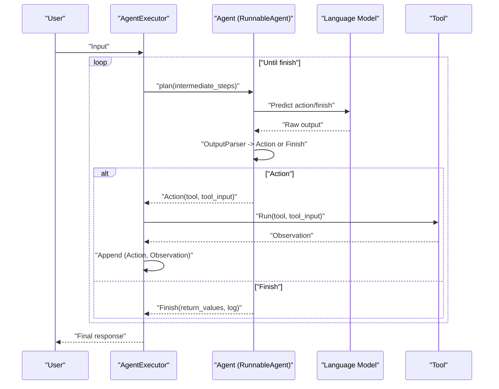
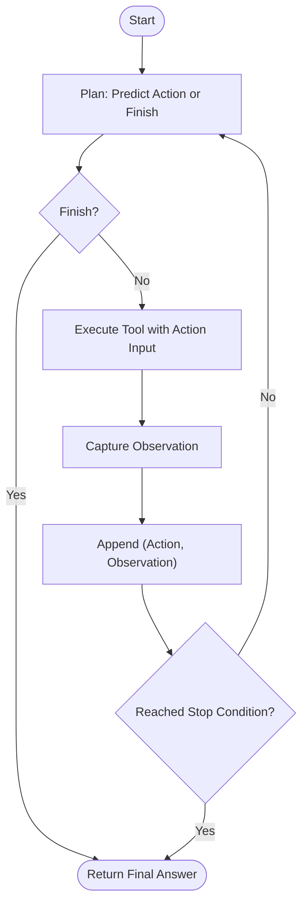
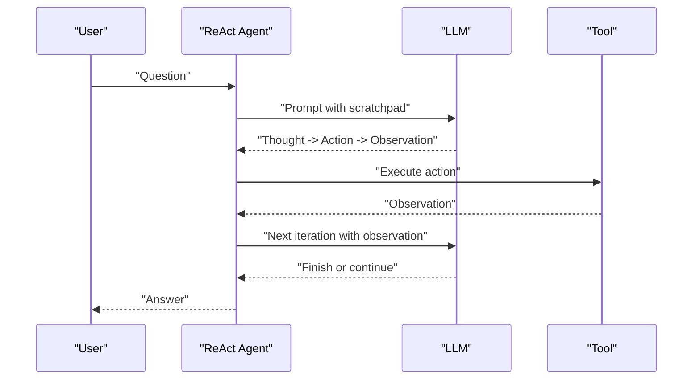
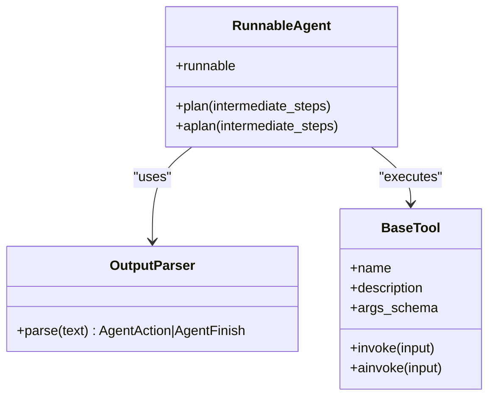
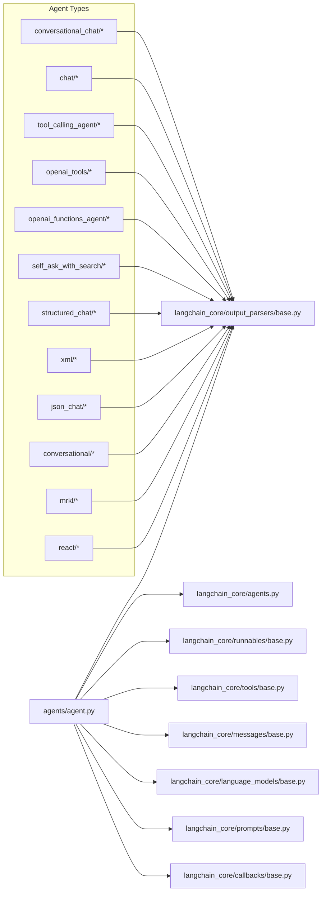

# Agents and Agent Types

<cite>
**Referenced Files in This Document**
- [agents/__init__.py](file://libs/langchain/langchain_classic/agents/__init__.py)
- [agents/agent.py](file://libs/langchain/langchain_classic/agents/agent.py)
- [agents/agent_types.py](file://libs/langchain/langchain_classic/agents/agent_types.py)
- [agents/types.py](file://libs/langchain/langchain_classic/agents/types.py)
- [agents/schema.py](file://libs/langchain/langchain_classic/agents/schema.py)
- [agents/tools.py](file://libs/langchain/langchain_classic/agents/tools.py)
- [agents/format_scratchpad/log.py](file://libs/langchain/langchain_classic/agents/format_scratchpad/log.py)
- [agents/format_scratchpad/tools.py](file://libs/langchain/langchain_classic/agents/format_scratchpad/tools.py)
- [agents/format_scratchpad/openai_functions.py](file://libs/langchain/langchain_classic/agents/format_scratchpad/openai_functions.py)
- [agents/format_scratchpad/openai_tools.py](file://libs/langchain/langchain_classic/agents/format_scratchpad/openai_tools.py)
- [agents/format_scratchpad/xml.py](file://libs/langchain/langchain_classic/agents/format_scratchpad/xml.py)
- [agents/output_parsers/tools.py](file://libs/langchain/langchain_classic/agents/output_parsers/tools.py)
- [agents/output_parsers/react_single_input.py](file://libs/langchain/langchain_classic/agents/output_parsers/react_single_input.py)
- [agents/output_parsers/react_json_single_input.py](file://libs/langchain/langchain_classic/agents/output_parsers/react_json_single_input.py)
- [agents/output_parsers/self_ask.py](file://libs/langchain/langchain_classic/agents/output_parsers/self_ask.py)
- [agents/output_parsers/json.py](file://libs/langchain/langchain_classic/agents/output_parsers/json.py)
- [agents/output_parsers/xml.py](file://libs/langchain/langchain_classic/agents/output_parsers/xml.py)
- [agents/mrkl/base.py](file://libs/langchain/langchain_classic/agents/mrkl/base.py)
- [agents/mrkl/prompt.py](file://libs/langchain/langchain_classic/agents/mrkl/prompt.py)
- [agents/react/agent.py](file://libs/langchain/langchain_classic/agents/react/agent.py)
- [agents/react/base.py](file://libs/langchain/langchain_classic/agents/react/base.py)
- [agents/react/output_parser.py](file://libs/langchain/langchain_classic/agents/react/output_parser.py)
- [agents/conversational/base.py](file://libs/langchain/langchain_classic/agents/conversational/base.py)
- [agents/conversational/prompt.py](file://libs/langchain/langchain_classic/agents/conversational/prompt.py)
- [agents/conversational/output_parser.py](file://libs/langchain/langchain_classic/agents/conversational/output_parser.py)
- [agents/json_chat/base.py](file://libs/langchain/langchain_classic/agents/json_chat/base.py)
- [agents/json_chat/prompt.py](file://libs/langchain/langchain_classic/agents/json_chat/prompt.py)
- [agents/xml/base.py](file://libs/langchain/langchain_classic/agents/xml/base.py)
- [agents/xml/prompt.py](file://libs/langchain/langchain_classic/agents/xml/prompt.py)
- [agents/structured_chat/base.py](file://libs/langchain/langchain_classic/agents/structured_chat/base.py)
- [agents/structured_chat/prompt.py](file://libs/langchain/langchain_classic/agents/structured_chat/prompt.py)
- [agents/structured_chat/output_parser.py](file://libs/langchain/langchain_classic/agents/structured_chat/output_parser.py)
- [agents/self_ask_with_search/base.py](file://libs/langchain/langchain_classic/agents/self_ask_with_search/base.py)
- [agents/self_ask_with_search/prompt.py](file://libs/langchain/langchain_classic/agents/self_ask_with_search/prompt.py)
- [agents/self_ask_with_search/output_parser.py](file://libs/langchain/langchain_classic/agents/self_ask_with_search/output_parser.py)
- [agents/openai_functions_agent/base.py](file://libs/langchain/langchain_classic/agents/openai_functions_agent/base.py)
- [agents/openai_tools/base.py](file://libs/langchain/langchain_classic/agents/openai_tools/base.py)
- [agents/tool_calling_agent/base.py](file://libs/langchain/langchain_classic/agents/tool_calling_agent/base.py)
- [agents/chat/base.py](file://libs/langchain/langchain_classic/agents/chat/base.py)
- [agents/chat/prompt.py](file://libs/langchain/langchain_classic/agents/chat/prompt.py)
- [agents/chat/output_parser.py](file://libs/langchain/langchain_classic/agents/chat/output_parser.py)
- [agents/conversational_chat/base.py](file://libs/langchain/langchain_classic/agents/conversational_chat/base.py)
- [agents/conversational_chat/prompt.py](file://libs/langchain/langchain_classic/agents/conversational_chat/prompt.py)
- [agents/conversational_chat/output_parser.py](file://libs/langchain/langchain_classic/agents/conversational_chat/output_parser.py)
- [agents/load_tools.py](file://libs/langchain/langchain_classic/agents/load_tools.py)
- [agents/loading.py](file://libs/langchain/langchain_classic/agents/loading.py)
- [agents/initialize.py](file://libs/langchain/langchain_classic/agents/initialize.py)
- [agents/utils.py](file://libs/langchain/langchain_classic/agents/utils.py)
- [agents/agent_iterator.py](file://libs/langchain/langchain_classic/agents/agent_iterator.py)
- [langchain_core/agents.py](file://libs/core/langchain_core/agents.py)
- [langchain_core/runnables/base.py](file://libs/core/langchain_core/runnables/base.py)
- [langchain_core/tools/base.py](file://libs/core/langchain_core/tools/base.py)
- [langchain_core/output_parsers/base.py](file://libs/core/langchain_core/output_parsers/base.py)
- [langchain_core/messages/base.py](file://libs/core/langchain_core/messages/base.py)
- [langchain_core/language_models/base.py](file://libs/core/langchain_core/language_models/base.py)
- [langchain_core/prompts/base.py](file://libs/core/langchain_core/prompts/base.py)
- [langchain_core/callbacks/base.py](file://libs/core/langchain_core/callbacks/base.py)
</cite>

## Table of Contents
1. [Introduction](#introduction)
2. [Project Structure](#project-structure)
3. [Core Components](#core-components)
4. [Architecture Overview](#architecture-overview)
5. [Detailed Component Analysis](#detailed-component-analysis)
6. [Dependency Analysis](#dependency-analysis)
7. [Performance Considerations](#performance-considerations)
8. [Troubleshooting Guide](#troubleshooting-guide)
9. [Conclusion](#conclusion)
10. [Appendices](#appendices)

## Introduction
This document explains LangChain’s agent framework: how agents differ from simple chains, the agent lifecycle, agent types (ReAct, MRKL, Conversational, JSON Chat, XML, Self-Ask with Search, Structured Chat, OpenAI Functions/Tools, Tool Calling, Chat variants), tool integration and multi-tool coordination, output parsers, and practical guidance for building, configuring, evaluating, monitoring, and scaling agents.

Agents use language models to autonomously decide which actions to take and in what order, selecting and executing tools to achieve goals. In contrast, chains apply fixed sequences of operations. Agents iterate: predict action, execute tool, observe, and repeat until a stopping condition.

## Project Structure
LangChain organizes agent capabilities under a dedicated agents package with submodules for each agent type, output parsers, scratchpad formatting helpers, and foundational abstractions.

```mermaid
graph TB
subgraph "Agents Package"
A_init["agents/__init__.py"]
A_agent["agents/agent.py"]
A_types["agents/agent_types.py"]
A_schema["agents/schema.py"]
A_tools["agents/tools.py"]
A_iter["agents/agent_iterator.py"]
A_fmt["agents/format_scratchpad/*"]
A_ops["agents/output_parsers/*"]
A_mrkl["agents/mrkl/*"]
A_react["agents/react/*"]
A_conv["agents/conversational/*"]
A_json["agents/json_chat/*"]
A_xml["agents/xml/*"]
A_struct["agents/structured_chat/*"]
A_selfask["agents/self_ask_with_search/*"]
A_openf["agents/openai_functions_agent/*"]
A_opent["agents/openai_tools/*"]
A_toolcall["agents/tool_calling_agent/*"]
A_chat["agents/chat/*"]
A_convchat["agents/conversational_chat/*"]
end
subgraph "Core Abstractions"
C_agents["langchain_core/agents.py"]
C_run["langchain_core/runnables/base.py"]
C_tools["langchain_core/tools/base.py"]
C_out["langchain_core/output_parsers/base.py"]
C_msgs["langchain_core/messages/base.py"]
C_lm["langchain_core/language_models/base.py"]
C_prompts["langchain_core/prompts/base.py"]
C_cb["langchain_core/callbacks/base.py"]
end
A_init --> A_agent
A_agent --> C_agents
A_agent --> C_run
A_agent --> C_tools
A_agent --> C_out
A_agent --> C_msgs
A_agent --> C_lm
A_agent --> C_prompts
A_agent --> C_cb
A_mrkl --> A_ops
A_react --> A_ops
A_conv --> A_ops
A_json --> A_ops
A_xml --> A_ops
A_struct --> A_ops
A_selfask --> A_ops
A_openf --> A_ops
A_opent --> A_ops
A_toolcall --> A_ops
A_chat --> A_ops
A_convchat --> A_ops
```

**Diagram sources**
- [agents/__init__.py](file://libs/langchain/langchain_classic/agents/__init__.py#L1-L165)
- [agents/agent.py](file://libs/langchain/langchain_classic/agents/agent.py#L1-L800)
- [langchain_core/agents.py](file://libs/core/langchain_core/agents.py#L1-L257)
- [langchain_core/runnables/base.py](file://libs/core/langchain_core/runnables/base.py)
- [langchain_core/tools/base.py](file://libs/core/langchain_core/tools/base.py)
- [langchain_core/output_parsers/base.py](file://libs/core/langchain_core/output_parsers/base.py)
- [langchain_core/messages/base.py](file://libs/core/langchain_core/messages/base.py)
- [langchain_core/language_models/base.py](file://libs/core/langchain_core/language_models/base.py)
- [langchain_core/prompts/base.py](file://libs/core/langchain_core/prompts/base.py)
- [langchain_core/callbacks/base.py](file://libs/core/langchain_core/callbacks/base.py)

**Section sources**
- [agents/__init__.py](file://libs/langchain/langchain_classic/agents/__init__.py#L1-L165)

## Core Components
- Agent abstractions and lifecycle
  - Single-action and multi-action agent bases define planning interfaces and early-stopping behavior.
  - Runnable-powered agents accept a Runnable that emits AgentAction or AgentFinish.
- Agent action/observation/finish schema
  - Core data structures represent agent decisions and outcomes, enabling serialization and message reconstruction.
- Output parsers
  - Parsers convert LLM output into structured actions or final answers per agent type.
- Tools and tool selection
  - Tools are integrated via tool registries and validated against allowed tool sets.
- Prompts and scratchpad formatting
  - Prompt templates and scratchpad formatters assemble agent context across iterations.

**Section sources**
- [agents/agent.py](file://libs/langchain/langchain_classic/agents/agent.py#L55-L359)
- [langchain_core/agents.py](file://libs/core/langchain_core/agents.py#L44-L257)
- [agents/output_parsers/tools.py](file://libs/langchain/langchain_classic/agents/output_parsers/tools.py)
- [agents/format_scratchpad/tools.py](file://libs/langchain/langchain_classic/agents/format_scratchpad/tools.py)
- [agents/format_scratchpad/log.py](file://libs/langchain/langchain_classic/agents/format_scratchpad/log.py)

## Architecture Overview
The agent lifecycle is iterative:
1. Input arrives and is combined with prior steps.
2. An agent Runnable or chain predicts an action (tool and input) or finishes.
3. The selected tool is executed; the observation is recorded.
4. The loop repeats until a finish condition is met.

**Diagram sources**
- [agents/agent.py](file://libs/langchain/langchain_classic/agents/agent.py#L389-L607)
- [langchain_core/agents.py](file://libs/core/langchain_core/agents.py#L131-L189)
- [agents/output_parsers/tools.py](file://libs/langchain/langchain_classic/agents/output_parsers/tools.py)

## Detailed Component Analysis

### Agent Lifecycle and Control Flow
- Planning
  - Single-action agents return one action or finish per iteration.
  - Multi-action agents can return multiple actions in one turn.
  - Runnable-based agents delegate planning to a configured Runnable and optionally stream tokens.
- Execution
  - Actions are dispatched to tools; observations are captured and appended to the step history.
- Stopping
  - Early stopping supports “force” method returning a standardized finish message when limits are hit.
- Serialization and persistence
  - Agents expose save methods for YAML/JSON, capturing type metadata.

**Diagram sources**
- [agents/agent.py](file://libs/langchain/langchain_classic/agents/agent.py#L55-L359)
- [langchain_core/agents.py](file://libs/core/langchain_core/agents.py#L131-L189)

**Section sources**
- [agents/agent.py](file://libs/langchain/langchain_classic/agents/agent.py#L55-L359)
- [agents/agent_iterator.py](file://libs/langchain/langchain_classic/agents/agent_iterator.py)

### Agent Types and Implementation Patterns

#### ReAct Agent
- Purpose: Thought-action-observation loop with explicit reasoning traces.
- Pattern:
  - Uses a ReAct prompt template and a ReAct output parser.
  - Scratchpad formatting appends thoughts, actions, and observations.
- Typical use cases: Reasoning-heavy tasks, search-assisted QA, planning.

**Diagram sources**
- [agents/react/agent.py](file://libs/langchain/langchain_classic/agents/react/agent.py)
- [agents/react/output_parser.py](file://libs/langchain/langchain_classic/agents/react/output_parser.py)
- [agents/format_scratchpad/tools.py](file://libs/langchain/langchain_classic/agents/format_scratchpad/tools.py)

**Section sources**
- [agents/react/agent.py](file://libs/langchain/langchain_classic/agents/react/agent.py)
- [agents/react/output_parser.py](file://libs/langchain/langchain_classic/agents/react/output_parser.py)
- [agents/format_scratchpad/tools.py](file://libs/langchain/langchain_classic/agents/format_scratchpad/tools.py)

#### MRKL Agent (Zero-shot)
- Purpose: Zero-shot tool-use with concise prompting and tool output parsing.
- Pattern:
  - MRKL prompt template lists available tools.
  - Output parser extracts tool name and arguments.
- Typical use cases: Quick tool orchestration without heavy reasoning scaffolding.

**Section sources**
- [agents/mrkl/base.py](file://libs/langchain/langchain_classic/agents/mrkl/base.py)
- [agents/mrkl/prompt.py](file://libs/langchain/langchain_classic/agents/mrkl/prompt.py)
- [agents/output_parsers/tools.py](file://libs/langchain/langchain_classic/agents/output_parsers/tools.py)

#### Conversational Agent
- Purpose: Maintains conversational context across turns.
- Pattern:
  - Uses a conversational prompt and output parser.
  - Integrates with memory to persist chat history.
- Typical use cases: Chatbots, assistants requiring long-term context.

**Section sources**
- [agents/conversational/base.py](file://libs/langchain/langchain_classic/agents/conversational/base.py)
- [agents/conversational/prompt.py](file://libs/langchain/langchain_classic/agents/conversational/prompt.py)
- [agents/conversational/output_parser.py](file://libs/langchain/langchain_classic/agents/conversational/output_parser.py)

#### JSON Chat Agent
- Purpose: Agents that produce structured JSON outputs aligned with tool/function schemas.
- Pattern:
  - Uses a JSON-focused prompt and output parser.
  - Often paired with tool-calling or function-calling LLMs.
- Typical use cases: API-driven automation, structured data extraction.

**Section sources**
- [agents/json_chat/base.py](file://libs/langchain/langchain_classic/agents/json_chat/base.py)
- [agents/json_chat/prompt.py](file://libs/langchain/langchain_classic/agents/json_chat/prompt.py)
- [agents/output_parsers/json.py](file://libs/langchain/langchain_classic/agents/output_parsers/json.py)

#### XML Agent
- Purpose: Outputs formatted XML for tool invocation or structured responses.
- Pattern:
  - XML prompt and output parser enforce structured markup.
- Typical use cases: Legacy integrations, strict schema environments.

**Section sources**
- [agents/xml/base.py](file://libs/langchain/langchain_classic/agents/xml/base.py)
- [agents/xml/prompt.py](file://libs/langchain/langchain_classic/agents/xml/prompt.py)
- [agents/output_parsers/xml.py](file://libs/langchain/langchain_classic/agents/output_parsers/xml.py)

#### Self-Ask with Search Agent
- Purpose: Chain-of-thought prompting to decompose questions into sub-queries and retrieve evidence.
- Pattern:
  - Uses a specialized prompt and output parser to alternate between “Ask” and “Search.”
- Typical use cases: Fact-checking, research assistance.

**Section sources**
- [agents/self_ask_with_search/base.py](file://libs/langchain/langchain_classic/agents/self_ask_with_search/base.py)
- [agents/self_ask_with_search/prompt.py](file://libs/langchain/langchain_classic/agents/self_ask_with_search/prompt.py)
- [agents/self_ask_with_search/output_parser.py](file://libs/langchain/langchain_classic/agents/self_ask_with_search/output_parser.py)

#### Structured Chat Agent
- Purpose: Chat-style agents constrained to structured tool/function calls.
- Pattern:
  - Structured prompt and output parser guide tool selection and argument formatting.
- Typical use cases: Enterprise systems requiring auditable tool usage.

**Section sources**
- [agents/structured_chat/base.py](file://libs/langchain/langchain_classic/agents/structured_chat/base.py)
- [agents/structured_chat/prompt.py](file://libs/langchain/langchain_classic/agents/structured_chat/prompt.py)
- [agents/structured_chat/output_parser.py](file://libs/langchain/langchain_classic/agents/structured_chat/output_parser.py)

#### OpenAI Functions Agent
- Purpose: Leverages OpenAI function calling to select and execute tools.
- Pattern:
  - Uses function schemas and an output parser tuned to function/tool calls.
- Typical use cases: Integrations with OpenAI-compatible APIs.

**Section sources**
- [agents/openai_functions_agent/base.py](file://libs/langchain/langchain_classic/agents/openai_functions_agent/base.py)

#### OpenAI Tools Agent
- Purpose: Direct tool-calling mode with OpenAI models.
- Pattern:
  - Uses tool schemas and a tool-specific output parser.
- Typical use cases: Tool-first workflows with OpenAI tool calling.

**Section sources**
- [agents/openai_tools/base.py](file://libs/langchain/langchain_classic/agents/openai_tools/base.py)

#### Tool Calling Agent
- Purpose: Generic tool-calling agent pattern compatible with function/tool schemas.
- Pattern:
  - Emphasizes robust tool selection and argument parsing.
- Typical use cases: Multi-provider tool orchestration.

**Section sources**
- [agents/tool_calling_agent/base.py](file://libs/langchain/langchain_classic/agents/tool_calling_agent/base.py)

#### Chat and Conversational Chat Agents
- Purpose: Lightweight chat agents with optional conversational memory.
- Pattern:
  - Chat prompt and output parser tailored for short-form exchanges.
- Typical use cases: Simple Q&A, lightweight assistants.

**Section sources**
- [agents/chat/base.py](file://libs/langchain/langchain_classic/agents/chat/base.py)
- [agents/chat/prompt.py](file://libs/langchain/langchain_classic/agents/chat/prompt.py)
- [agents/chat/output_parser.py](file://libs/langchain/langchain_classic/agents/chat/output_parser.py)
- [agents/conversational_chat/base.py](file://libs/langchain/langchain_classic/agents/conversational_chat/base.py)
- [agents/conversational_chat/prompt.py](file://libs/langchain/langchain_classic/agents/conversational_chat/prompt.py)
- [agents/conversational_chat/output_parser.py](file://libs/langchain/langchain_classic/agents/conversational_chat/output_parser.py)

### Tool Integration and Multi-Tool Coordination
- Tool registry and selection
  - Tools are validated against allowed tool sets; invalid tools are rejected.
  - Tool inputs are sanitized and passed to tool runnables.
- Multi-tool coordination
  - Multi-action agents can propose several actions per iteration.
  - Output parsers must handle lists of actions and finalize when appropriate.
- Tool calling protocols
  - Function/tool schemas define tool signatures; parsers must extract tool names and arguments reliably.

**Diagram sources**
- [langchain_core/tools/base.py](file://libs/core/langchain_core/tools/base.py)
- [agents/agent.py](file://libs/langchain/langchain_classic/agents/agent.py#L389-L607)
- [agents/output_parsers/tools.py](file://libs/langchain/langchain_classic/agents/output_parsers/tools.py)

**Section sources**
- [agents/tools.py](file://libs/langchain/langchain_classic/agents/tools.py)
- [agents/output_parsers/tools.py](file://libs/langchain/langchain_classic/agents/output_parsers/tools.py)
- [agents/format_scratchpad/tools.py](file://libs/langchain/langchain_classic/agents/format_scratchpad/tools.py)

### Output Parsers and Response Structuring
- Role
  - Convert raw LLM output into structured actions or final answers.
  - Enforce schema compliance for tool/function calls and multi-tool scenarios.
- Types
  - Tools parser: extracts tool name and arguments.
  - ReAct parsers: parse thought-action-observation sequences.
  - Self-Ask parser: alternates between ask/search steps.
  - JSON/XML parsers: enforce structured output formats.
- Integration
  - Parsers are coupled with agent prompts and scratchpad formatters to maintain coherent context.

**Section sources**
- [agents/output_parsers/tools.py](file://libs/langchain/langchain_classic/agents/output_parsers/tools.py)
- [agents/output_parsers/react_single_input.py](file://libs/langchain/langchain_classic/agents/output_parsers/react_single_input.py)
- [agents/output_parsers/react_json_single_input.py](file://libs/langchain/langchain_classic/agents/output_parsers/react_json_single_input.py)
- [agents/output_parsers/self_ask.py](file://libs/langchain/langchain_classic/agents/output_parsers/self_ask.py)
- [agents/output_parsers/json.py](file://libs/langchain/langchain_classic/agents/output_parsers/json.py)
- [agents/output_parsers/xml.py](file://libs/langchain/langchain_classic/agents/output_parsers/xml.py)

### Practical Examples and Guidance

- Building a custom agent
  - Define a Runnable that accepts intermediate steps and returns an action or finish.
  - Wire an output parser to interpret the model’s raw output.
  - Integrate tools and configure allowed tool sets.
  - Persist and load agents using the provided save/load utilities.

- Configuring agent memory
  - Use conversational prompts and memory-backed chat histories.
  - Manage message logs and ensure prompt templates include memory context.

- Handling agent failures
  - Implement robust output parsing with error handling.
  - Use early stopping and iteration/time limits to prevent infinite loops.
  - Capture logs and observations for debugging.

- Evaluation, monitoring, and performance
  - Instrument callbacks to capture run metrics and token usage.
  - Monitor tool latency and failure rates.
  - Optimize prompts and reduce token overhead to improve throughput.

- Choosing the right agent type
  - ReAct: when explicit reasoning and iteration are needed.
  - MRKL: quick tool orchestration with minimal scaffolding.
  - Conversational/Chat: lightweight chat experiences with or without memory.
  - JSON/XML: when structured output is mandated.
  - Self-Ask with Search: fact-checking and research.
  - Structured Chat: enterprise-grade tool usage with auditability.
  - OpenAI Functions/Tools/Tool Calling: when leveraging provider-native function/tool calling.

- Scaling agent deployments
  - Use streaming runnables to enable real-time feedback.
  - Batch tool calls where possible; avoid unnecessary round-trips.
  - Cache frequent prompts and tool schemas; monitor rate limits.

**Section sources**
- [agents/initialize.py](file://libs/langchain/langchain_classic/agents/initialize.py)
- [agents/loading.py](file://libs/langchain/langchain_classic/agents/loading.py)
- [agents/load_tools.py](file://libs/langchain/langchain_classic/agents/load_tools.py)
- [agents/utils.py](file://libs/langchain/langchain_classic/agents/utils.py)
- [langchain_core/callbacks/base.py](file://libs/core/langchain_core/callbacks/base.py)

## Dependency Analysis
Agents depend on core abstractions for tools, runnables, prompts, messages, and output parsing. Each agent type composes a specific prompt and output parser while sharing the same execution loop.

**Diagram sources**
- [agents/agent.py](file://libs/langchain/langchain_classic/agents/agent.py#L1-L800)
- [langchain_core/agents.py](file://libs/core/langchain_core/agents.py#L1-L257)
- [langchain_core/runnables/base.py](file://libs/core/langchain_core/runnables/base.py)
- [langchain_core/tools/base.py](file://libs/core/langchain_core/tools/base.py)
- [langchain_core/output_parsers/base.py](file://libs/core/langchain_core/output_parsers/base.py)
- [langchain_core/messages/base.py](file://libs/core/langchain_core/messages/base.py)
- [langchain_core/language_models/base.py](file://libs/core/langchain_core/language_models/base.py)
- [langchain_core/prompts/base.py](file://libs/core/langchain_core/prompts/base.py)
- [langchain_core/callbacks/base.py](file://libs/core/langchain_core/callbacks/base.py)

**Section sources**
- [agents/agent.py](file://libs/langchain/langchain_classic/agents/agent.py#L1-L800)
- [agents/__init__.py](file://libs/langchain/langchain_classic/agents/__init__.py#L1-L165)

## Performance Considerations
- Streaming runnables
  - Enable streaming to access tokens incrementally and reduce perceived latency.
- Prompt and schema reuse
  - Cache and reuse prompts and tool schemas to minimize overhead.
- Tool batching
  - Combine compatible tool calls to reduce round-trips.
- Early stopping and limits
  - Configure iteration and time limits to prevent runaway executions.
- Observability
  - Use callbacks to track token usage, latency, and error rates.

[No sources needed since this section provides general guidance]

## Troubleshooting Guide
- Common issues
  - Parsing errors: ensure output parsers match the agent’s prompt format.
  - Tool failures: validate tool schemas and inputs; implement retries and fallbacks.
  - Infinite loops: set iteration/time limits and enforce early stopping.
  - Memory bloat: trim chat histories and prune obsolete context.
- Debugging aids
  - Inspect logs and observations appended during iterations.
  - Use callback managers to capture detailed run metrics.

**Section sources**
- [agents/agent.py](file://libs/langchain/langchain_classic/agents/agent.py#L110-L137)
- [agents/output_parsers/tools.py](file://libs/langchain/langchain_classic/agents/output_parsers/tools.py)
- [langchain_core/callbacks/base.py](file://libs/core/langchain_core/callbacks/base.py)

## Conclusion
LangChain’s agent framework provides a flexible, extensible foundation for autonomous decision-making. By composing prompts, output parsers, and tools, developers can build agents ranging from lightweight chat assistants to sophisticated reasoning orchestrators. Proper configuration of memory, observability, and tool coordination ensures reliable, scalable deployments.

[No sources needed since this section summarizes without analyzing specific files]

## Appendices

### Appendix A: Agent Type Reference
- ReAct: Thought-action-observation loop with explicit reasoning.
- MRKL: Zero-shot tool selection with concise prompting.
- Conversational: Chat with persistent memory.
- JSON Chat: Structured JSON outputs.
- XML: Structured XML outputs.
- Self-Ask with Search: Decomposition into ask/search steps.
- Structured Chat: Audit-friendly tool/function calls.
- OpenAI Functions/Tools/Tool Calling: Provider-native function/tool calling.

**Section sources**
- [agents/react/agent.py](file://libs/langchain/langchain_classic/agents/react/agent.py)
- [agents/mrkl/base.py](file://libs/langchain/langchain_classic/agents/mrkl/base.py)
- [agents/conversational/base.py](file://libs/langchain/langchain_classic/agents/conversational/base.py)
- [agents/json_chat/base.py](file://libs/langchain/langchain_classic/agents/json_chat/base.py)
- [agents/xml/base.py](file://libs/langchain/langchain_classic/agents/xml/base.py)
- [agents/self_ask_with_search/base.py](file://libs/langchain/langchain_classic/agents/self_ask_with_search/base.py)
- [agents/structured_chat/base.py](file://libs/langchain/langchain_classic/agents/structured_chat/base.py)
- [agents/openai_functions_agent/base.py](file://libs/langchain/langchain_classic/agents/openai_functions_agent/base.py)
- [agents/openai_tools/base.py](file://libs/langchain/langchain_classic/agents/openai_tools/base.py)
- [agents/tool_calling_agent/base.py](file://libs/langchain/langchain_classic/agents/tool_calling_agent/base.py)