# Conversational Agent

<cite>
**Referenced Files in This Document**
- [memory/__init__.py](file://libs/langchain/langchain_classic/memory/__init__.py)
- [chains/conversation/base.py](file://libs/langchain/langchain_classic/chains/conversation/base.py)
- [chains/conversation/memory.py](file://libs/langchain/langchain_classic/chains/conversation/memory.py)
- [memory/buffer.py](file://libs/langchain/langchain_classic/memory/buffer.py)
- [memory/buffer_window.py](file://libs/langchain/langchain_classic/memory/buffer_window.py)
- [memory/summary.py](file://libs/langchain/langchain_classic/memory/summary.py)
- [memory/token_buffer.py](file://libs/langchain/langchain_classic/memory/token_buffer.py)
- [memory/chat_memory.py](file://libs/langchain/langchain_classic/memory/chat_memory.py)
- [memory/utils.py](file://libs/langchain/langchain_classic/memory/utils.py)
- [memory/prompt.py](file://libs/langchain/langchain_classic/memory/prompt.py)
- [memory/combined.py](file://libs/langchain/langchain_classic/memory/combined.py)
- [memory/entity.py](file://libs/langchain/langchain_classic/memory/entity.py)
- [memory/vectorstore.py](file://libs/langchain/langchain_classic/memory/vectorstore.py)
- [memory/zep_memory.py](file://libs/langchain/langchain_classic/memory/zep_memory.py)
- [memory/chat_message_histories/in_memory.py](file://libs/langchain/langchain_classic/memory/chat_message_histories/in_memory.py)
- [memory/chat_message_histories/file.py](file://libs/langchain/langchain_classic/memory/chat_message_histories/file.py)
- [memory/chat_message_histories/redis.py](file://libs/langchain/langchain_classic/memory/chat_message_histories/redis.py)
- [memory/chat_message_histories/sql.py](file://libs/langchain/langchain_classic/memory/chat_message_histories/sql.py)
- [memory/chat_message_histories/postgres.py](file://libs/langchain/langchain_classic/memory/chat_message_histories/postgres.py)
- [memory/chat_message_histories/mongodb.py](file://libs/langchain/langchain_classic/memory/chat_message_histories/mongodb.py)
- [memory/chat_message_histories/cosmos_db.py](file://libs/langchain/langchain_classic/memory/chat_message_histories/cosmos_db.py)
- [memory/chat_message_histories/dynamodb.py](file://libs/langchain/langchain_classic/memory/chat_message_histories/dynamodb.py)
- [memory/chat_message_histories/elasticsearch.py](file://libs/langchain/langchain_classic/memory/chat_message_histories/elasticsearch.py)
- [memory/chat_message_histories/firestore.py](file://libs/langchain/langchain_classic/memory/chat_message_histories/firestore.py)
- [memory/chat_message_histories/astradb.py](file://libs/langchain/langchain_classic/memory/chat_message_histories/astradb.py)
- [memory/chat_message_histories/cassandra.py](file://libs/langchain/langchain_classic/memory/chat_message_histories/cassandra.py)
- [memory/chat_message_histories/neo4j.py](file://libs/langchain/langchain_classic/memory/chat_message_histories/neo4j.py)
- [memory/chat_message_histories/momento.py](file://libs/langchain/langchain_classic/memory/chat_message_histories/momento.py)
- [memory/chat_message_histories/upstash_redis.py](file://libs/langchain/langchain_classic/memory/chat_message_histories/upstash_redis.py)
- [memory/chat_message_histories/singlestoredb.py](file://libs/langchain/langchain_classic/memory/chat_message_histories/singlestoredb.py)
- [memory/chat_message_histories/streamlit.py](file://libs/langchain/langchain_classic/memory/chat_message_histories/streamlit.py)
- [memory/chat_message_histories/xata.py](file://libs/langchain/langchain_classic/memory/chat_message_histories/xata.py)
- [memory/chat_message_histories/zep.py](file://libs/langchain/langchain_classic/memory/chat_message_histories/zep.py)
- [memory/summary_buffer.py](file://libs/langchain/langchain_classic/memory/summary_buffer.py)
- [memory/simple.py](file://libs/langchain/langchain_classic/memory/simple.py)
- [memory/readonly.py](file://libs/langchain/langchain_classic/memory/readonly.py)
- [memory/kg.py](file://libs/langchain/langchain_classic/memory/kg.py)
- [memory/vectorstore_token_buffer_memory.py](file://libs/langchain/langchain_classic/memory/vectorstore_token_buffer_memory.py)
- [memory/motorhead_memory.py](file://libs/langchain/langchain_classic/memory/motorhead_memory.py)
- [memory/zep_memory.py](file://libs/langchain/langchain_classic/memory/zep_memory.py)
- [base_memory.py](file://libs/langchain/langchain_classic/base_memory.py)
- [chains/conversation/prompt.py](file://libs/langchain/langchain_classic/chains/conversation/prompt.py)
- [chains/conversation/__init__.py](file://libs/langchain/langchain_classic/chains/conversation/__init__.py)
- [agents/conversational/base.py](file://libs/langchain/langchain_classic/agents/conversational/base.py)
- [agents/conversational/output_parser.py](file://libs/langchain/langchain_classic/agents/conversational/output_parser.py)
- [agents/conversational/prompt.py](file://libs/langchain/langchain_classic/agents/conversational/prompt.py)
- [agents/conversational_chat/base.py](file://libs/langchain/langchain_classic/agents/conversational_chat/base.py)
- [agents/conversational_chat/output_parser.py](file://libs/langchain/langchain_classic/agents/conversational_chat/output_parser.py)
- [agents/conversational_chat/prompt.py](file://libs/langchain/langchain_classic/agents/conversational_chat/prompt.py)
- [chains/conversational_retrieval/base.py](file://libs/langchain/langchain_classic/chains/conversational_retrieval/base.py)
- [chains/conversational_retrieval/prompts.py](file://libs/langchain/langchain_classic/chains/conversational_retrieval/prompts.py)
- [chains/conversational_retrieval/__init__.py](file://libs/langchain/langchain_classic/chains/conversational_retrieval/__init__.py)
- [agents/agent_toolkits/conversational_retrieval/tool.py](file://libs/langchain/langchain_classic/agents/agent_toolkits/conversational_retrieval/tool.py)
- [agents/agent_toolkits/conversational_retrieval/openai_functions.py](file://libs/langchain/langchain_classic/agents/agent_toolkits/conversational_retrieval/openai_functions.py)
- [agents/agent_toolkits/conversational_retrieval/__init__.py](file://libs/langchain/langchain_classic/agents/agent_toolkits/conversational_retrieval/__init__.py)
- [runnables/history.py](file://libs/core/langchain_core/runnables/history.py)
- [chat_history.py](file://libs/core/langchain_core/chat_history.py)
- [messages/chat.py](file://libs/core/langchain_core/messages/chat.py)
- [prompts/chat.py](file://libs/core/langchain_core/prompts/chat.py)
- [prompts/base.py](file://libs/core/langchain_core/prompts/base.py)
- [outputs/chat_result.py](file://libs/core/langchain_core/outputs/chat_result.py)
- [language_models/chat_models.py](file://libs/core/langchain_core/language_models/chat_models.py)
- [tracers/memory_stream.py](file://libs/core/langchain_core/tracers/memory_stream.py)
</cite>

## Table of Contents
1. [Introduction](#introduction)
2. [Project Structure](#project-structure)
3. [Core Components](#core-components)
4. [Architecture Overview](#architecture-overview)
5. [Detailed Component Analysis](#detailed-component-analysis)
6. [Dependency Analysis](#dependency-analysis)
7. [Performance Considerations](#performance-considerations)
8. [Troubleshooting Guide](#troubleshooting-guide)
9. [Conclusion](#conclusion)
10. [Appendices](#appendices)

## Introduction
This document explains how conversational agents maintain context across multiple turns of dialogue, how memory integrates with conversation flows, and how to engineer prompts for coherent conversation. It covers memory integration patterns, conversation history preservation, prompt engineering, follow-up handling, context switching, summarization, state management, memory optimization, long conversation strategies, and integrations with external memory systems. Practical examples are included for customer service, personal assistants, and interactive applications.

## Project Structure
LangChain organizes conversational capabilities across three main areas:
- Memory: in-memory and external chat histories, token-aware buffers, summarization, and specialized memories (entities, KG, vectorstore-backed).
- Chains: conversation chains and conversational retrieval chains that wrap LLMs with memory and prompts.
- Agents: conversational agents and conversational retrieval agent toolkits.

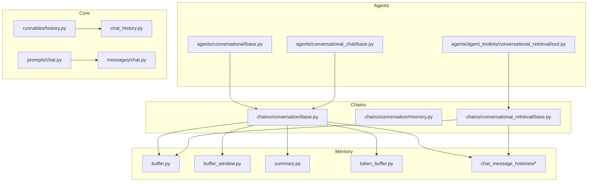

**Diagram sources**
- [chains/conversation/base.py](file://libs/langchain/langchain_classic/chains/conversation/base.py#L1-L150)
- [chains/conversation/memory.py](file://libs/langchain/langchain_classic/chains/conversation/memory.py#L1-L46)
- [chains/conversational_retrieval/base.py](file://libs/langchain/langchain_classic/chains/conversational_retrieval/base.py)
- [agents/conversational/base.py](file://libs/langchain/langchain_classic/agents/conversational/base.py)
- [agents/conversational_chat/base.py](file://libs/langchain/langchain_classic/agents/conversational_chat/base.py)
- [agents/agent_toolkits/conversational_retrieval/tool.py](file://libs/langchain/langchain_classic/agents/agent_toolkits/conversational_retrieval/tool.py)
- [memory/buffer.py](file://libs/langchain/langchain_classic/memory/buffer.py#L1-L174)
- [memory/buffer_window.py](file://libs/langchain/langchain_classic/memory/buffer_window.py#L1-L60)
- [memory/summary.py](file://libs/langchain/langchain_classic/memory/summary.py#L1-L169)
- [memory/token_buffer.py](file://libs/langchain/langchain_classic/memory/token_buffer.py#L1-L72)
- [memory/chat_message_histories/in_memory.py](file://libs/langchain/langchain_classic/memory/chat_message_histories/in_memory.py)
- [runnables/history.py](file://libs/core/langchain_core/runnables/history.py)
- [chat_history.py](file://libs/core/langchain_core/chat_history.py)
- [messages/chat.py](file://libs/core/langchain_core/messages/chat.py)
- [prompts/chat.py](file://libs/core/langchain_core/prompts/chat.py)

**Section sources**
- [chains/conversation/__init__.py](file://libs/langchain/langchain_classic/chains/conversation/__init__.py#L1-L2)
- [memory/__init__.py](file://libs/langchain/langchain_classic/memory/__init__.py#L1-L127)

## Core Components
- ConversationChain (classic): wraps an LLM with memory and a default prompt; deprecated in favor of modern history-aware runnables.
- Memory types:
  - Buffer: stores full history as strings or messages.
  - Buffer window: keeps only the last k turns.
  - Token buffer: prunes oldest messages until token budget is satisfied.
  - Summary: continuously updates a summary of the conversation.
  - Combined: aggregates multiple memory sources.
  - Entity/KG/vectorstore: extract and store entities or retrieve relevant segments.
- Chat message histories: in-memory, file, Redis, SQL variants, and cloud providers.
- Prompts: conversation prompts and summarization prompts.
- Runnables with message history: modern, recommended pattern for managing conversation state.

Key responsibilities:
- Preserve conversation history across turns.
- Control context size via token limits or windowing.
- Summarize long sessions to reduce context cost.
- Provide structured prompts that instruct the model to maintain coherence and role consistency.

**Section sources**
- [chains/conversation/base.py](file://libs/langchain/langchain_classic/chains/conversation/base.py#L14-L150)
- [memory/buffer.py](file://libs/langchain/langchain_classic/memory/buffer.py#L13-L174)
- [memory/buffer_window.py](file://libs/langchain/langchain_classic/memory/buffer_window.py#L10-L60)
- [memory/token_buffer.py](file://libs/langchain/langchain_classic/memory/token_buffer.py#L11-L72)
- [memory/summary.py](file://libs/langchain/langchain_classic/memory/summary.py#L19-L169)
- [memory/combined.py](file://libs/langchain/langchain_classic/memory/combined.py)
- [memory/entity.py](file://libs/langchain/langchain_classic/memory/entity.py)
- [memory/kg.py](file://libs/langchain/langchain_classic/memory/kg.py)
- [memory/vectorstore.py](file://libs/langchain/langchain_classic/memory/vectorstore.py)
- [memory/vectorstore_token_buffer_memory.py](file://libs/langchain/langchain_classic/memory/vectorstore_token_buffer_memory.py)
- [memory/chat_message_histories/in_memory.py](file://libs/langchain/langchain_classic/memory/chat_message_histories/in_memory.py)
- [memory/chat_message_histories/redis.py](file://libs/langchain/langchain_classic/memory/chat_message_histories/redis.py)
- [memory/chat_message_histories/sql.py](file://libs/langchain/langchain_classic/memory/chat_message_histories/sql.py)
- [memory/chat_message_histories/postgres.py](file://libs/langchain/langchain_classic/memory/chat_message_histories/postgres.py)
- [memory/chat_message_histories/mongodb.py](file://libs/langchain/langchain_classic/memory/chat_message_histories/mongodb.py)
- [memory/chat_message_histories/cosmos_db.py](file://libs/langchain/langchain_classic/memory/chat_message_histories/cosmos_db.py)
- [memory/chat_message_histories/dynamodb.py](file://libs/langchain/langchain_classic/memory/chat_message_histories/dynamodb.py)
- [memory/chat_message_histories/elasticsearch.py](file://libs/langchain/langchain_classic/memory/chat_message_histories/elasticsearch.py)
- [memory/chat_message_histories/firestore.py](file://libs/langchain/langchain_classic/memory/chat_message_histories/firestore.py)
- [memory/chat_message_histories/astradb.py](file://libs/langchain/langchain_classic/memory/chat_message_histories/astradb.py)
- [memory/chat_message_histories/cassandra.py](file://libs/langchain/langchain_classic/memory/chat_message_histories/cassandra.py)
- [memory/chat_message_histories/neo4j.py](file://libs/langchain/langchain_classic/memory/chat_message_histories/neo4j.py)
- [memory/chat_message_histories/momento.py](file://libs/langchain/langchain_classic/memory/chat_message_histories/momento.py)
- [memory/chat_message_histories/upstash_redis.py](file://libs/langchain/langchain_classic/memory/chat_message_histories/upstash_redis.py)
- [memory/chat_message_histories/singlestoredb.py](file://libs/langchain/langchain_classic/memory/chat_message_histories/singlestoredb.py)
- [memory/chat_message_histories/streamlit.py](file://libs/langchain/langchain_classic/memory/chat_message_histories/streamlit.py)
- [memory/chat_message_histories/xata.py](file://libs/langchain/langchain_classic/memory/chat_message_histories/xata.py)
- [memory/chat_message_histories/zep.py](file://libs/langchain/langchain_classic/memory/chat_message_histories/zep.py)
- [memory/prompt.py](file://libs/langchain/langchain_classic/memory/prompt.py)
- [chains/conversation/prompt.py](file://libs/langchain/langchain_classic/chains/conversation/prompt.py)

## Architecture Overview
The modern conversational architecture separates memory from chains and delegates conversation state to a history-aware runnable with explicit session scoping.

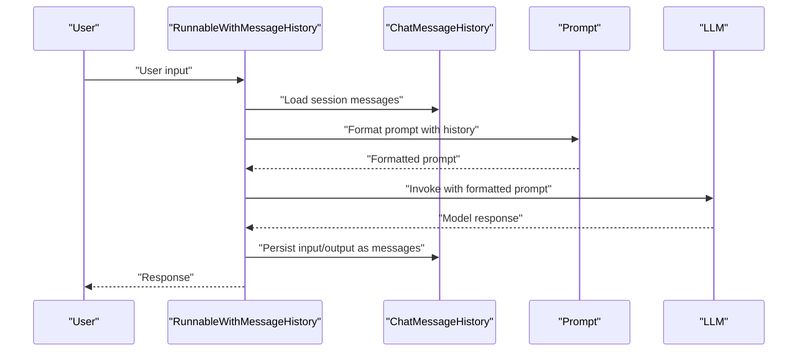

**Diagram sources**
- [runnables/history.py](file://libs/core/langchain_core/runnables/history.py)
- [chat_history.py](file://libs/core/langchain_core/chat_history.py)
- [prompts/chat.py](file://libs/core/langchain_core/prompts/chat.py)
- [messages/chat.py](file://libs/core/langchain_core/messages/chat.py)
- [language_models/chat_models.py](file://libs/core/langchain_core/language_models/chat_models.py)

## Detailed Component Analysis

### Memory Types and Integration Patterns
- Buffer memory: stores entire conversation history as strings or messages. Useful for small to medium sessions where full context is beneficial.
- Buffer window: maintains only the last k turns, reducing context size and latency.
- Token buffer: prunes oldest messages until the token count fits the model’s context window.
- Summary memory: continuously updates a concise summary and can be injected as a system message to keep the model grounded in high-level context.
- Combined memory: aggregates multiple memory sources (e.g., buffer + summary + entities).
- Chat message histories: persist sessions in various backends (in-memory, file, Redis, SQL, cloud databases).

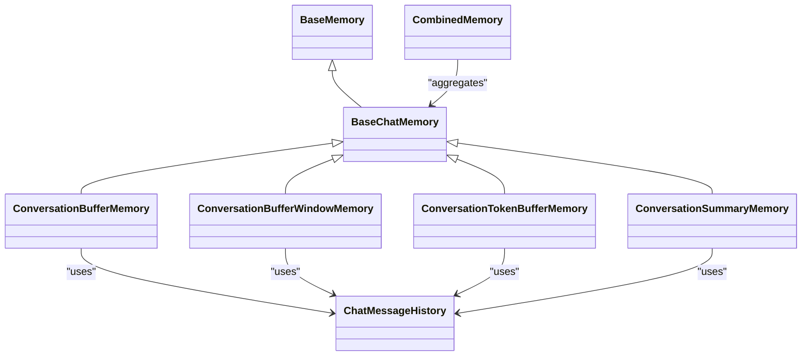

**Diagram sources**
- [memory/buffer.py](file://libs/langchain/langchain_classic/memory/buffer.py#L21-L174)
- [memory/buffer_window.py](file://libs/langchain/langchain_classic/memory/buffer_window.py#L18-L60)
- [memory/token_buffer.py](file://libs/langchain/langchain_classic/memory/token_buffer.py#L19-L72)
- [memory/summary.py](file://libs/langchain/langchain_classic/memory/summary.py#L91-L169)
- [memory/combined.py](file://libs/langchain/langchain_classic/memory/combined.py)
- [memory/chat_memory.py](file://libs/langchain/langchain_classic/memory/chat_memory.py)

**Section sources**
- [memory/buffer.py](file://libs/langchain/langchain_classic/memory/buffer.py#L13-L174)
- [memory/buffer_window.py](file://libs/langchain/langchain_classic/memory/buffer_window.py#L10-L60)
- [memory/token_buffer.py](file://libs/langchain/langchain_classic/memory/token_buffer.py#L11-L72)
- [memory/summary.py](file://libs/langchain/langchain_classic/memory/summary.py#L19-L169)
- [memory/combined.py](file://libs/langchain/langchain_classic/memory/combined.py)
- [memory/chat_memory.py](file://libs/langchain/langchain_classic/memory/chat_memory.py)

### Prompt Engineering for Coherent Conversation
- Use a system message to define the model’s role and behavior.
- Include a dedicated history variable in the prompt template and ensure it aligns with memory keys.
- Keep instructions explicit about handling follow-ups, context switching, and summarization.
- For long conversations, inject a concise summary alongside recent turns.

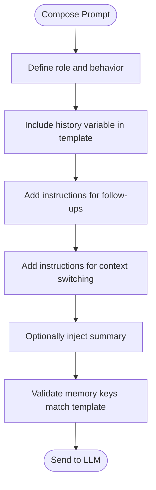

**Diagram sources**
- [chains/conversation/prompt.py](file://libs/langchain/langchain_classic/chains/conversation/prompt.py)
- [memory/prompt.py](file://libs/langchain/langchain_classic/memory/prompt.py)
- [prompts/chat.py](file://libs/core/langchain_core/prompts/chat.py)
- [prompts/base.py](file://libs/core/langchain_core/prompts/base.py)

**Section sources**
- [chains/conversation/prompt.py](file://libs/langchain/langchain_classic/chains/conversation/prompt.py)
- [memory/prompt.py](file://libs/langchain/langchain_classic/memory/prompt.py)
- [prompts/chat.py](file://libs/core/langchain_core/prompts/chat.py)
- [prompts/base.py](file://libs/core/langchain_core/prompts/base.py)

### Conversation State Management and Long Conversations
- Session scoping: use a session identifier to isolate conversation threads.
- Token pruning: remove oldest turns when exceeding model context.
- Summarization: periodically compress long histories into a summary message.
- Hybrid strategies: combine buffer window with summary for robustness.

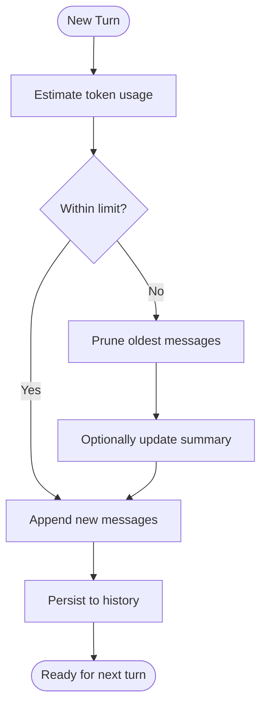

**Diagram sources**
- [memory/token_buffer.py](file://libs/langchain/langchain_classic/memory/token_buffer.py#L61-L72)
- [memory/summary.py](file://libs/langchain/langchain_classic/memory/summary.py#L157-L163)
- [memory/buffer_window.py](file://libs/langchain/langchain_classic/memory/buffer_window.py#L39-L49)

**Section sources**
- [memory/token_buffer.py](file://libs/langchain/langchain_classic/memory/token_buffer.py#L11-L72)
- [memory/summary.py](file://libs/langchain/langchain_classic/memory/summary.py#L19-L169)
- [memory/buffer_window.py](file://libs/langchain/langchain_classic/memory/buffer_window.py#L10-L60)

### Handling Follow-Up Questions, Context Switching, and Summarization
- Follow-ups: ensure the prompt template includes a mechanism to reference prior context and resolve pronouns.
- Context switching: use explicit markers or summaries to reset focus when topics change.
- Summarization: maintain a rolling summary that the model can cite for global grounding.

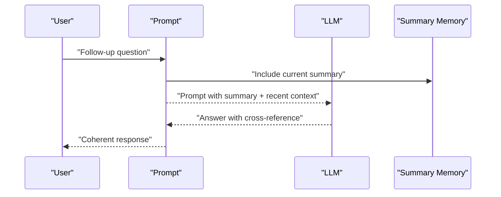

**Diagram sources**
- [memory/summary.py](file://libs/langchain/langchain_classic/memory/summary.py#L91-L169)
- [chains/conversation/prompt.py](file://libs/langchain/langchain_classic/chains/conversation/prompt.py)

**Section sources**
- [memory/summary.py](file://libs/langchain/langchain_classic/memory/summary.py#L19-L169)
- [chains/conversation/prompt.py](file://libs/langchain/langchain_classic/chains/conversation/prompt.py)

### Integrations with External Memory Systems
- In-memory: fast, ephemeral sessions.
- File: durable per-file histories.
- Redis/Upstash Redis: scalable, distributed histories.
- SQL/Postgres/MongoDB/CosmosDB/DynamoDB/Elasticsearch/Firestore/AstraDB/Cassandra/Neo4j/Momento/SingleStoreDB/Xata/Zep: enterprise-grade persistence and querying.

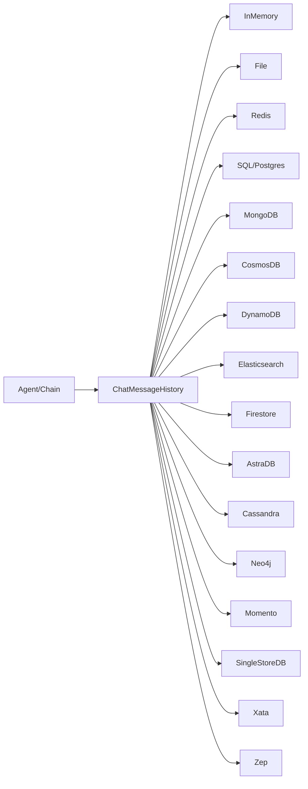

**Diagram sources**
- [memory/chat_message_histories/in_memory.py](file://libs/langchain/langchain_classic/memory/chat_message_histories/in_memory.py)
- [memory/chat_message_histories/file.py](file://libs/langchain/langchain_classic/memory/chat_message_histories/file.py)
- [memory/chat_message_histories/redis.py](file://libs/langchain/langchain_classic/memory/chat_message_histories/redis.py)
- [memory/chat_message_histories/sql.py](file://libs/langchain/langchain_classic/memory/chat_message_histories/sql.py)
- [memory/chat_message_histories/postgres.py](file://libs/langchain/langchain_classic/memory/chat_message_histories/postgres.py)
- [memory/chat_message_histories/mongodb.py](file://libs/langchain/langchain_classic/memory/chat_message_histories/mongodb.py)
- [memory/chat_message_histories/cosmos_db.py](file://libs/langchain/langchain_classic/memory/chat_message_histories/cosmos_db.py)
- [memory/chat_message_histories/dynamodb.py](file://libs/langchain/langchain_classic/memory/chat_message_histories/dynamodb.py)
- [memory/chat_message_histories/elasticsearch.py](file://libs/langchain/langchain_classic/memory/chat_message_histories/elasticsearch.py)
- [memory/chat_message_histories/firestore.py](file://libs/langchain/langchain_classic/memory/chat_message_histories/firestore.py)
- [memory/chat_message_histories/astradb.py](file://libs/langchain/langchain_classic/memory/chat_message_histories/astradb.py)
- [memory/chat_message_histories/cassandra.py](file://libs/langchain/langchain_classic/memory/chat_message_histories/cassandra.py)
- [memory/chat_message_histories/neo4j.py](file://libs/langchain/langchain_classic/memory/chat_message_histories/neo4j.py)
- [memory/chat_message_histories/momento.py](file://libs/langchain/langchain_classic/memory/chat_message_histories/momento.py)
- [memory/chat_message_histories/singlestoredb.py](file://libs/langchain/langchain_classic/memory/chat_message_histories/singlestoredb.py)
- [memory/chat_message_histories/xata.py](file://libs/langchain/langchain_classic/memory/chat_message_histories/xata.py)
- [memory/chat_message_histories/zep.py](file://libs/langchain/langchain_classic/memory/chat_message_histories/zep.py)

**Section sources**
- [memory/chat_message_histories/in_memory.py](file://libs/langchain/langchain_classic/memory/chat_message_histories/in_memory.py)
- [memory/chat_message_histories/file.py](file://libs/langchain/langchain_classic/memory/chat_message_histories/file.py)
- [memory/chat_message_histories/redis.py](file://libs/langchain/langchain_classic/memory/chat_message_histories/redis.py)
- [memory/chat_message_histories/sql.py](file://libs/langchain/langchain_classic/memory/chat_message_histories/sql.py)
- [memory/chat_message_histories/postgres.py](file://libs/langchain/langchain_classic/memory/chat_message_histories/postgres.py)
- [memory/chat_message_histories/mongodb.py](file://libs/langchain/langchain_classic/memory/chat_message_histories/mongodb.py)
- [memory/chat_message_histories/cosmos_db.py](file://libs/langchain/langchain_classic/memory/chat_message_histories/cosmos_db.py)
- [memory/chat_message_histories/dynamodb.py](file://libs/langchain/langchain_classic/memory/chat_message_histories/dynamodb.py)
- [memory/chat_message_histories/elasticsearch.py](file://libs/langchain/langchain_classic/memory/chat_message_histories/elasticsearch.py)
- [memory/chat_message_histories/firestore.py](file://libs/langchain/langchain_classic/memory/chat_message_histories/firestore.py)
- [memory/chat_message_histories/astradb.py](file://libs/langchain/langchain_classic/memory/chat_message_histories/astradb.py)
- [memory/chat_message_histories/cassandra.py](file://libs/langchain/langchain_classic/memory/chat_message_histories/cassandra.py)
- [memory/chat_message_histories/neo4j.py](file://libs/langchain/langchain_classic/memory/chat_message_histories/neo4j.py)
- [memory/chat_message_histories/momento.py](file://libs/langchain/langchain_classic/memory/chat_message_histories/momento.py)
- [memory/chat_message_histories/singlestoredb.py](file://libs/langchain/langchain_classic/memory/chat_message_histories/singlestoredb.py)
- [memory/chat_message_histories/xata.py](file://libs/langchain/langchain_classic/memory/chat_message_histories/xata.py)
- [memory/chat_message_histories/zep.py](file://libs/langchain/langchain_classic/memory/chat_message_histories/zep.py)

### Practical Examples

#### Customer Service Agent
- Use a buffer window to keep recent exchanges and a summary to capture case details.
- Prompt should enforce escalation rules and tone guidelines.
- Persist sessions in SQL or Postgres for auditability.

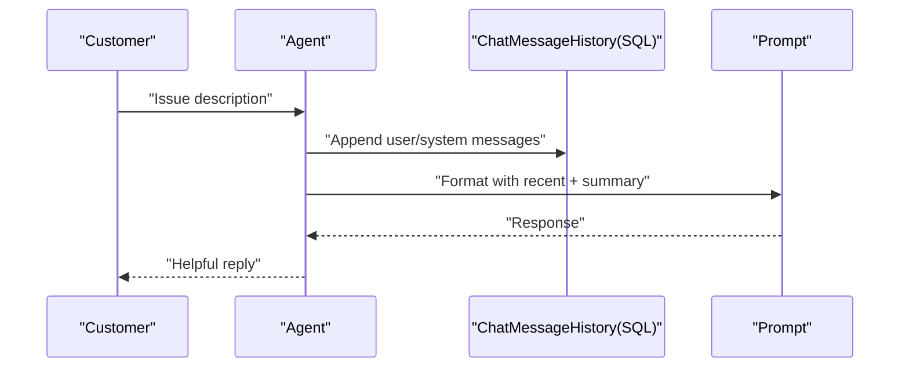

**Diagram sources**
- [memory/buffer_window.py](file://libs/langchain/langchain_classic/memory/buffer_window.py#L18-L60)
- [memory/summary.py](file://libs/langchain/langchain_classic/memory/summary.py#L91-L169)
- [memory/chat_message_histories/postgres.py](file://libs/langchain/langchain_classic/memory/chat_message_histories/postgres.py)

#### Personal Assistant
- Combine a token buffer with a summary for long daily conversations.
- Use entity memory to track tasks, people, and deadlines.
- Persist in Redis for fast multi-session access.

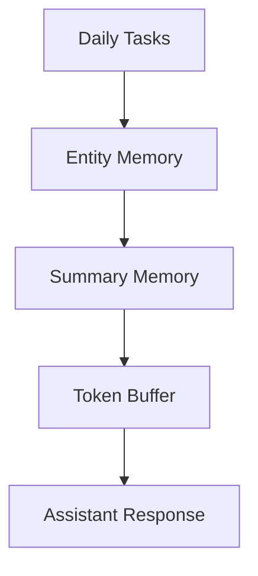

**Diagram sources**
- [memory/entity.py](file://libs/langchain/langchain_classic/memory/entity.py)
- [memory/summary.py](file://libs/langchain/langchain_classic/memory/summary.py#L91-L169)
- [memory/token_buffer.py](file://libs/langchain/langchain_classic/memory/token_buffer.py#L19-L72)
- [memory/chat_message_histories/redis.py](file://libs/langchain/langchain_classic/memory/chat_message_histories/redis.py)

#### Interactive Application (Chatbot)
- Use RunnableWithMessageHistory with in-memory or file histories for prototyping.
- Scale to Redis or cloud storages for production.
- Add a retrieval-augmented component for knowledge grounding.

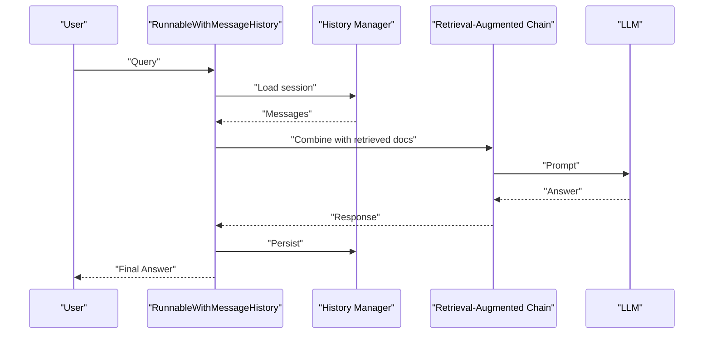

**Diagram sources**
- [runnables/history.py](file://libs/core/langchain_core/runnables/history.py)
- [chains/conversational_retrieval/base.py](file://libs/langchain/langchain_classic/chains/conversational_retrieval/base.py)
- [agents/agent_toolkits/conversational_retrieval/tool.py](file://libs/langchain/langchain_classic/agents/agent_toolkits/conversational_retrieval/tool.py)

**Section sources**
- [chains/conversation/base.py](file://libs/langchain/langchain_classic/chains/conversation/base.py#L14-L150)
- [chains/conversational_retrieval/base.py](file://libs/langchain/langchain_classic/chains/conversational_retrieval/base.py)
- [agents/agent_toolkits/conversational_retrieval/tool.py](file://libs/langchain/langchain_classic/agents/agent_toolkits/conversational_retrieval/tool.py)

## Dependency Analysis
- Memory depends on chat message histories for persistence and on language models for token counting (in token buffer).
- Chains depend on memory and prompts; conversational retrieval chains add a retriever component.
- Agents depend on chains and toolkits; conversational retrieval agents integrate retrieval with conversation.

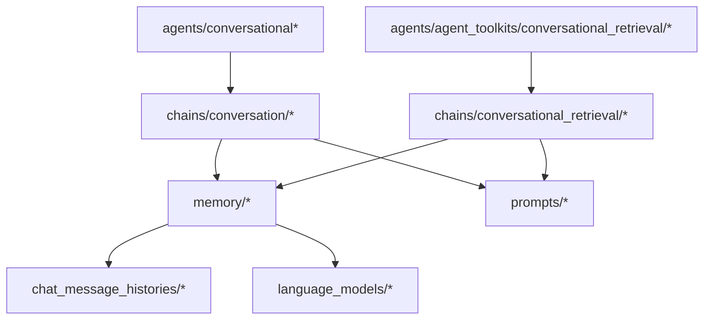

**Diagram sources**
- [memory/buffer.py](file://libs/langchain/langchain_classic/memory/buffer.py#L1-L174)
- [memory/token_buffer.py](file://libs/langchain/langchain_classic/memory/token_buffer.py#L1-L72)
- [memory/chat_message_histories/in_memory.py](file://libs/langchain/langchain_classic/memory/chat_message_histories/in_memory.py)
- [chains/conversation/base.py](file://libs/langchain/langchain_classic/chains/conversation/base.py#L1-L150)
- [chains/conversational_retrieval/base.py](file://libs/langchain/langchain_classic/chains/conversational_retrieval/base.py)
- [agents/conversational/base.py](file://libs/langchain/langchain_classic/agents/conversational/base.py)
- [agents/agent_toolkits/conversational_retrieval/tool.py](file://libs/langchain/langchain_classic/agents/agent_toolkits/conversational_retrieval/tool.py)

**Section sources**
- [memory/__init__.py](file://libs/langchain/langchain_classic/memory/__init__.py#L1-L127)
- [chains/conversation/memory.py](file://libs/langchain/langchain_classic/chains/conversation/memory.py#L1-L46)
- [chains/conversation/base.py](file://libs/langchain/langchain_classic/chains/conversation/base.py#L1-L150)
- [chains/conversational_retrieval/base.py](file://libs/langchain/langchain_classic/chains/conversational_retrieval/base.py)
- [agents/conversational/base.py](file://libs/langchain/langchain_classic/agents/conversational/base.py)
- [agents/agent_toolkits/conversational_retrieval/tool.py](file://libs/langchain/langchain_classic/agents/agent_toolkits/conversational_retrieval/tool.py)

## Performance Considerations
- Prefer token-buffer or window-based memory for long sessions to cap context size.
- Use summaries to compress repeated information and reduce token usage.
- Choose appropriate chat message history backends for scale (Redis, SQL, cloud databases).
- Monitor token usage via the language model’s token counting utilities.
- Batch and stream responses where supported by the runtime.

[No sources needed since this section provides general guidance]

## Troubleshooting Guide
- Validation errors: ensure memory keys and prompt input variables match; mismatch leads to validation failures.
- Token overflow: switch to token buffer or summary memory; adjust model context window.
- Persistence issues: verify backend credentials and connection strings for external histories.
- Streaming and tracing: use memory tracers to observe state transitions and debug performance.

**Section sources**
- [chains/conversation/base.py](file://libs/langchain/langchain_classic/chains/conversation/base.py#L129-L149)
- [memory/token_buffer.py](file://libs/langchain/langchain_classic/memory/token_buffer.py#L61-L72)
- [tracers/memory_stream.py](file://libs/core/langchain_core/tracers/memory_stream.py)

## Conclusion
LangChain provides a comprehensive toolkit for building conversational agents with robust memory, prompt engineering, and scalable persistence. By combining buffer/window/token-based memories, summaries, and modern history-aware runnables, developers can create agents that handle follow-ups, context switching, and long conversations effectively. Integrations with diverse chat message history backends enable production-grade deployments across customer service, personal assistance, and interactive applications.

## Appendices
- Migration note: ConversationChain is deprecated in favor of RunnableWithMessageHistory for improved flexibility and performance.
- Prompt templates: ensure memory variables are present and properly validated against prompt input variables.

**Section sources**
- [chains/conversation/base.py](file://libs/langchain/langchain_classic/chains/conversation/base.py#L14-L104)
- [prompts/base.py](file://libs/core/langchain_core/prompts/base.py)