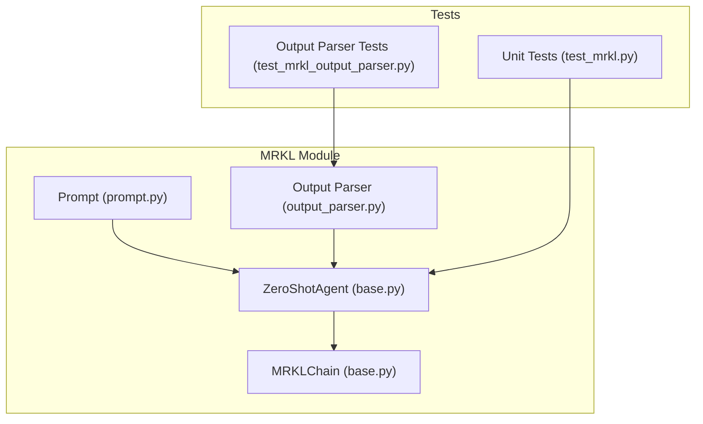
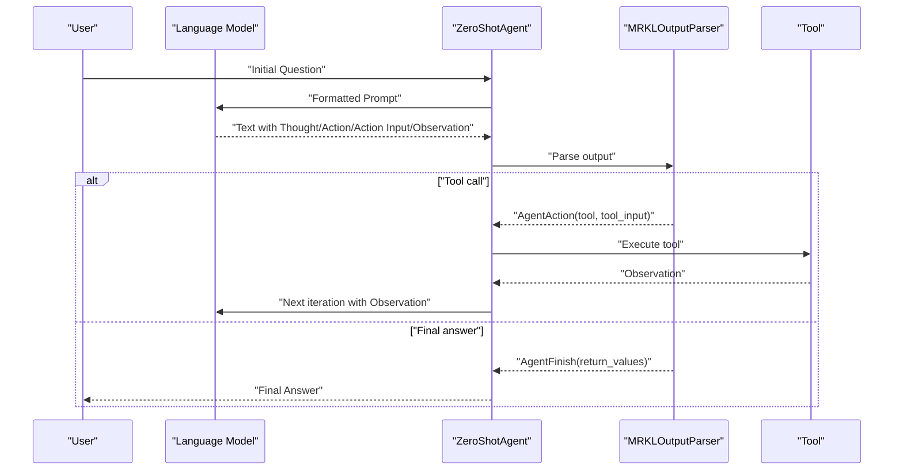
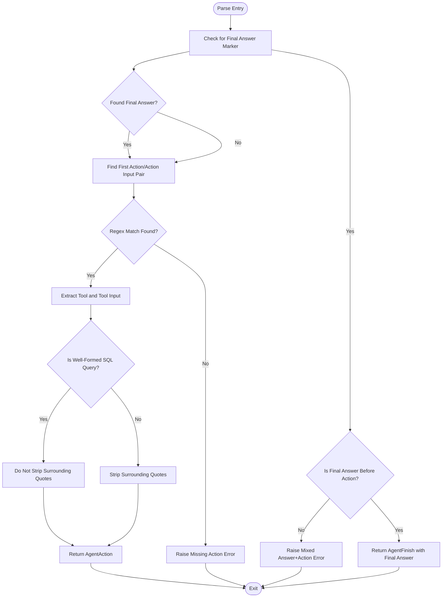
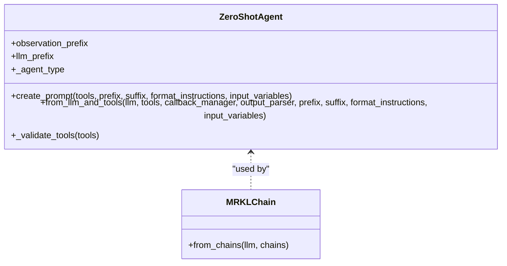
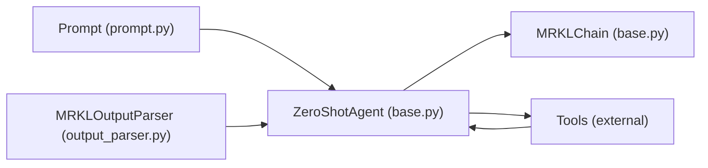

# MRKL Agent

<cite>
**Referenced Files in This Document**
- [base.py](file://libs/langchain/langchain_classic/agents/mrkl/base.py)
- [output_parser.py](file://libs/langchain/langchain_classic/agents/mrkl/output_parser.py)
- [prompt.py](file://libs/langchain/langchain_classic/agents/mrkl/prompt.py)
- [__init__.py](file://libs/langchain/langchain_classic/agents/mrkl/__init__.py)
- [test_mrkl.py](file://libs/langchain/tests/unit_tests/agents/test_mrkl.py)
- [test_mrkl_output_parser.py](file://libs/langchain/tests/unit_tests/agents/test_mrkl_output_parser.py)
</cite>

## Table of Contents
1. [Introduction](#introduction)
2. [Project Structure](#project-structure)
3. [Core Components](#core-components)
4. [Architecture Overview](#architecture-overview)
5. [Detailed Component Analysis](#detailed-component-analysis)
6. [Dependency Analysis](#dependency-analysis)
7. [Performance Considerations](#performance-considerations)
8. [Troubleshooting Guide](#troubleshooting-guide)
9. [Conclusion](#conclusion)
10. [Appendices](#appendices)

## Introduction
This document explains the MRKL (Modular Reasoning, Knowledge and Language) agent implementation in the classic LangChain stack. The MRKL agent decomposes complex tasks into small, manageable steps by alternating between reasoning (Thought), tool use (Action/Action Input), and observation feedback (Observation), culminating in a final answer. It provides:
- A structured prompt format guiding the model to produce Thought/Action/Action Input/Observation loops
- An output parser that extracts tool calls and arguments, or a final answer
- A simple executor pattern to orchestrate multi-step reasoning with external tools

Note: The MRKL implementation in this repository resides under the classic LangChain package and is marked as deprecated. It remains useful for understanding the foundational MRKL pattern and for legacy integrations.

## Project Structure
The MRKL agent implementation is organized into three primary modules plus tests:
- Prompt definition: defines the prefix, format instructions, and suffix used to guide the model
- Output parser: parses the model’s text output into either a tool call (AgentAction) or a final answer (AgentFinish)
- Agent executor: constructs the agent and orchestrates multi-step reasoning with tools

**Diagram sources**
- [prompt.py](file://libs/langchain/langchain_classic/agents/mrkl/prompt.py#L1-L16)
- [output_parser.py](file://libs/langchain/langchain_classic/agents/mrkl/output_parser.py#L21-L102)
- [base.py](file://libs/langchain/langchain_classic/agents/mrkl/base.py#L45-L217)
- [test_mrkl.py](file://libs/langchain/tests/unit_tests/agents/test_mrkl.py#L1-L165)
- [test_mrkl_output_parser.py](file://libs/langchain/tests/unit_tests/agents/test_mrkl_output_parser.py#L1-L82)

**Section sources**
- [__init__.py](file://libs/langchain/langchain_classic/agents/mrkl/__init__.py#L1-L2)
- [prompt.py](file://libs/langchain/langchain_classic/agents/mrkl/prompt.py#L1-L16)
- [output_parser.py](file://libs/langchain/langchain_classic/agents/mrkl/output_parser.py#L21-L102)
- [base.py](file://libs/langchain/langchain_classic/agents/mrkl/base.py#L45-L217)
- [test_mrkl.py](file://libs/langchain/tests/unit_tests/agents/test_mrkl.py#L1-L165)
- [test_mrkl_output_parser.py](file://libs/langchain/tests/unit_tests/agents/test_mrkl_output_parser.py#L1-L82)

## Core Components
- Prompt template: Provides the instruction prefix, tool list, format instructions, and the loop structure ending with a final answer
- Output parser: Extracts Thought/Action/Action Input/Observation sequences and determines whether to continue or finish
- Agent executor: Builds the agent with a language model and tools, and runs multi-step reasoning

Key responsibilities:
- Prompt assembly: Renders tool descriptions and names into the prompt and injects format instructions and scratchpad placeholders
- Parsing: Validates and extracts tool calls or final answers; raises explicit errors for malformed outputs
- Execution: Bridges the model, tools, and loop control to support iterative reasoning

**Section sources**
- [prompt.py](file://libs/langchain/langchain_classic/agents/mrkl/prompt.py#L1-L16)
- [output_parser.py](file://libs/langchain/langchain_classic/agents/mrkl/output_parser.py#L31-L97)
- [base.py](file://libs/langchain/langchain_classic/agents/mrkl/base.py#L82-L159)

## Architecture Overview
The MRKL agent follows a simple, deterministic loop:
- The prompt instructs the model to think, choose a tool, supply an input, and observe the result
- The output parser interprets the model’s response and either returns a tool call or a final answer
- The executor repeats the loop until a final answer is produced

**Diagram sources**
- [prompt.py](file://libs/langchain/langchain_classic/agents/mrkl/prompt.py#L1-L16)
- [output_parser.py](file://libs/langchain/langchain_classic/agents/mrkl/output_parser.py#L31-L97)
- [base.py](file://libs/langchain/langchain_classic/agents/mrkl/base.py#L114-L159)

## Detailed Component Analysis

### Prompt Template
The prompt defines:
- Prefix introducing available tools
- Tool list rendered from tool descriptions
- Format instructions detailing the Thought/Action/Action Input/Observation loop and final answer
- Suffix with placeholders for the input question and scratchpad

Behavior highlights:
- Tool names are injected into the format instructions
- The suffix includes a scratchpad placeholder to accumulate iterations
- The prompt is constructed as a single template and can be parameterized with input variables

Practical usage:
- Supply a list of tools with clear names and descriptions
- Ensure the LLM receives the formatted prompt with the scratchpad filled

**Section sources**
- [prompt.py](file://libs/langchain/langchain_classic/agents/mrkl/prompt.py#L1-L16)
- [base.py](file://libs/langchain/langchain_classic/agents/mrkl/base.py#L82-L111)

### Output Parser
The parser enforces a strict format and supports two outcomes:
- Continue reasoning: returns an AgentAction with tool name and input
- Finish: returns an AgentFinish with the final answer

Parsing rules:
- Detects presence of a final answer marker
- Uses a regular expression to extract the first Action/Action Input pair
- Handles whitespace and newline variations robustly
- Special-case handling for SQL-like queries to preserve surrounding quotes
- Rejects ambiguous outputs that mix a final answer with a parsable action

Error handling:
- Throws explicit exceptions when Action or Action Input is missing
- Provides contextual hints to the model via observation fields
- Prevents mixed final-answer-and-action outputs

**Diagram sources**
- [output_parser.py](file://libs/langchain/langchain_classic/agents/mrkl/output_parser.py#L31-L97)

**Section sources**
- [output_parser.py](file://libs/langchain/langchain_classic/agents/mrkl/output_parser.py#L31-L97)

### Agent Executor
The ZeroShotAgent composes:
- A language model chain with the assembled prompt
- Allowed tool names for validation
- An output parser instance

Construction:
- Validates tools (non-empty and each has a description)
- Renders tool descriptions and names into the prompt
- Creates an LLM chain and returns a configured agent

The MRKLChain helper builds an agent from a list of chain configurations by converting each configuration into a Tool and delegating to ZeroShotAgent.from_llm_and_tools.

**Diagram sources**
- [base.py](file://libs/langchain/langchain_classic/agents/mrkl/base.py#L45-L217)

**Section sources**
- [base.py](file://libs/langchain/langchain_classic/agents/mrkl/base.py#L45-L217)

## Dependency Analysis
The MRKL agent depends on:
- Prompt template for structure and instructions
- Output parser for deterministic extraction
- Agent executor for orchestration
- Tools for external actions

**Diagram sources**
- [prompt.py](file://libs/langchain/langchain_classic/agents/mrkl/prompt.py#L1-L16)
- [output_parser.py](file://libs/langchain/langchain_classic/agents/mrkl/output_parser.py#L21-L102)
- [base.py](file://libs/langchain/langchain_classic/agents/mrkl/base.py#L114-L159)

**Section sources**
- [base.py](file://libs/langchain/langchain_classic/agents/mrkl/base.py#L114-L159)
- [output_parser.py](file://libs/langchain/langchain_classic/agents/mrkl/output_parser.py#L21-L102)
- [prompt.py](file://libs/langchain/langchain_classic/agents/mrkl/prompt.py#L1-L16)

## Performance Considerations
- Prompt construction cost: Rendering tool descriptions scales with the number of tools; keep tool lists concise and descriptive
- Regex parsing: The parser uses a single regex to extract actions; ensure tool names and keywords are unambiguous to avoid backtracking
- Loop overhead: Each iteration adds a model call and tool execution; limit max iterations and tool branching to reduce latency
- Caching: Consider caching observations for repeated tool inputs to avoid redundant calls
- Token limits: Monitor prompt and scratchpad sizes; truncate or compress as needed to fit model context windows

[No sources needed since this section provides general guidance]

## Troubleshooting Guide
Common issues and resolutions:
- Missing Action or Action Input: The parser raises explicit errors with contextual hints; ensure the model follows the Thought/Action/Action Input/Observation/Final Answer pattern
- Mixed final answer and action: The parser rejects outputs that contain both; rewrite the model output so it is either a final answer or a tool call
- Tool name mismatch: Ensure the model uses one of the allowed tool names provided in the prompt
- SQL query handling: The parser preserves surrounding quotes for SQL-like queries; verify query correctness externally

Validation references:
- Tests demonstrate expected behavior for whitespace, newlines, SQL queries, and final answers
- Output parser tests verify error messages and ordering constraints

**Section sources**
- [test_mrkl.py](file://libs/langchain/tests/unit_tests/agents/test_mrkl.py#L22-L143)
- [test_mrkl_output_parser.py](file://libs/langchain/tests/unit_tests/agents/test_mrkl_output_parser.py#L14-L82)
- [output_parser.py](file://libs/langchain/langchain_classic/agents/mrkl/output_parser.py#L76-L97)

## Conclusion
The MRKL agent provides a clear, structured framework for multi-step reasoning with tools. Its prompt-driven loop and strict output parsing enable reliable orchestration of complex tasks across multiple sources. While deprecated in favor of newer agent designs, it remains a solid foundation for modular reasoning and can be adapted for specialized workflows requiring explicit step-by-step control.

[No sources needed since this section summarizes without analyzing specific files]

## Appendices

### Practical Examples
Below are representative scenarios illustrating how the MRKL agent can be applied. These examples describe typical workflows without reproducing code.

- Research synthesis
  - Task: Compare findings across multiple sources
  - Steps: Think about the query, select a retrieval tool, input a search string, observe results, and decide whether to refine the query or synthesize a final answer
  - Notes: Use a tool that returns structured or summarized results to minimize downstream parsing

- Data synthesis
  - Task: Aggregate statistics from a database
  - Steps: Plan the aggregation, call a query tool with a SQL-like input, observe the result, and produce a final summary
  - Notes: The parser preserves SQL-like inputs; ensure the query is well-formed and returns tabular data

- Multi-source information gathering
  - Task: Compile facts from web search and local tools
  - Steps: Iterate Thought/Action/Action Input/Observation to gather evidence from multiple sources, then finalize with a synthesized answer
  - Notes: Keep tool names and descriptions consistent to improve prompt readability and parsing reliability

[No sources needed since this section provides general guidance]