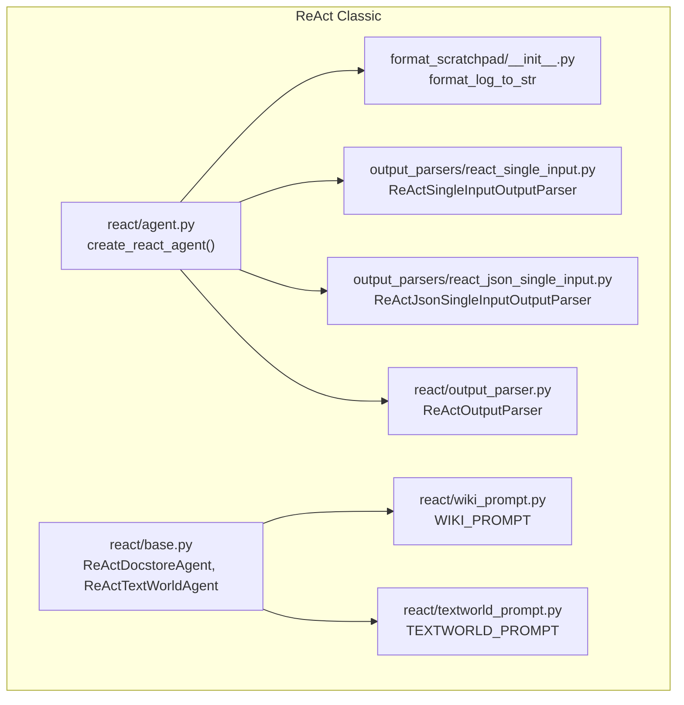
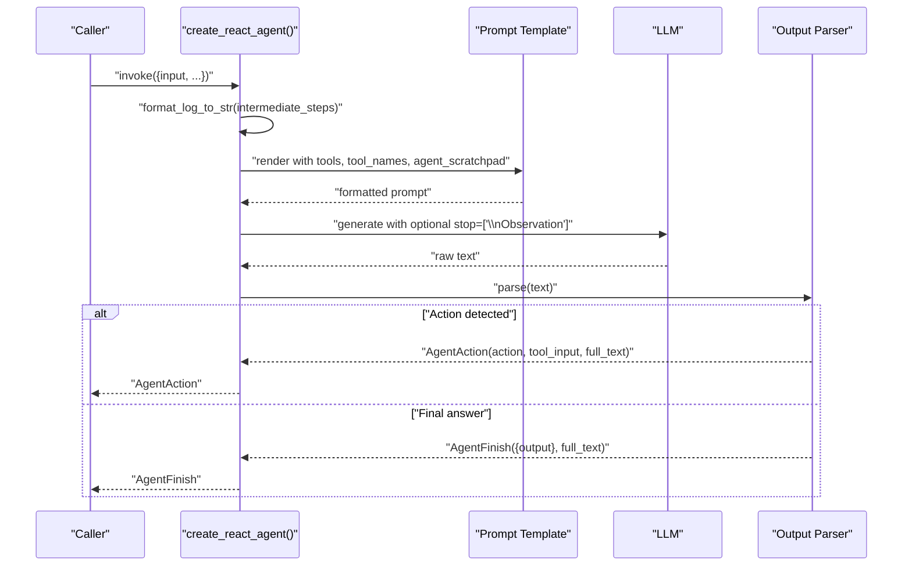
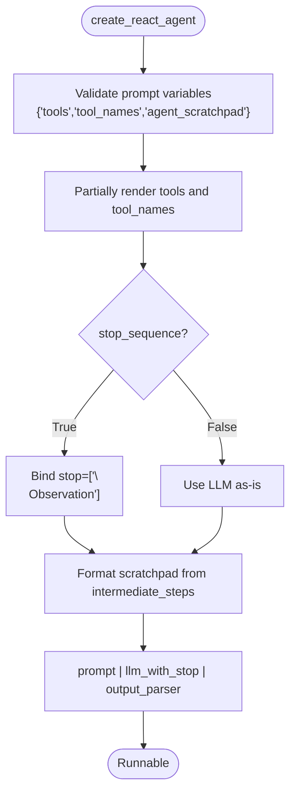
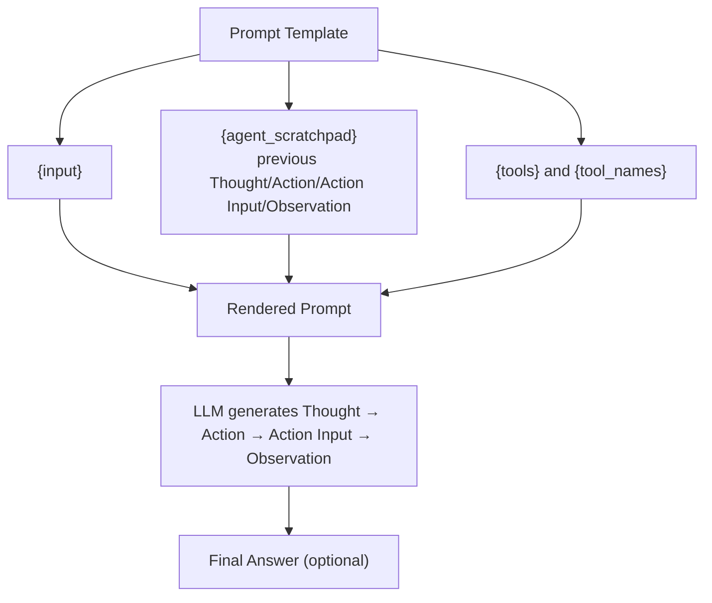
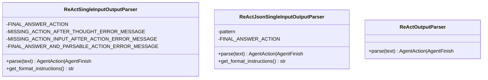
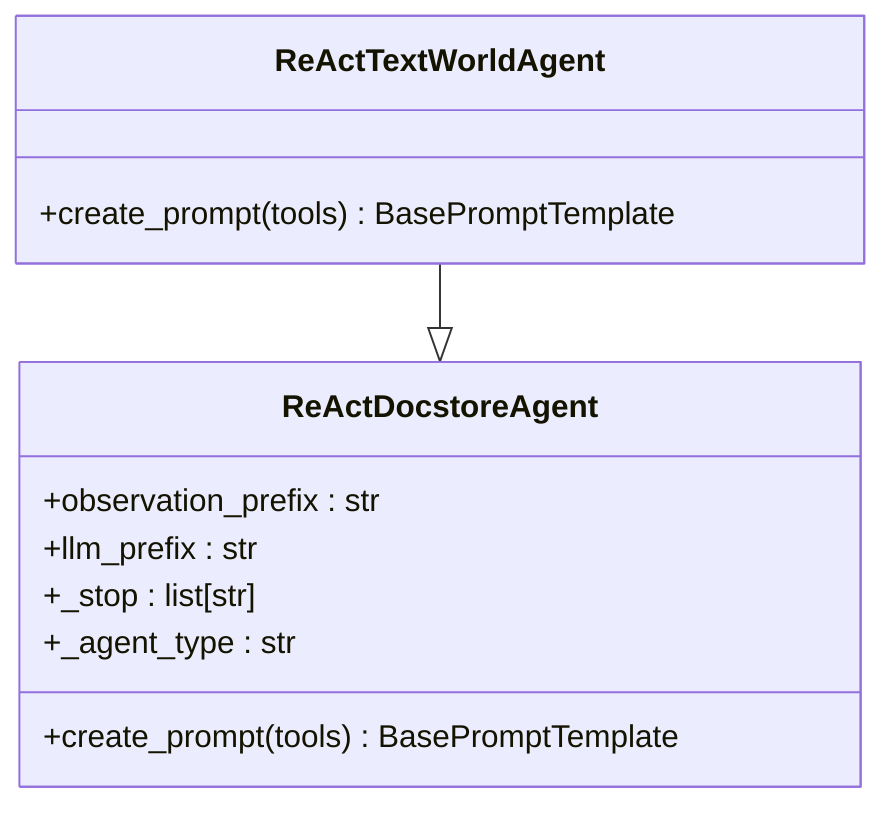
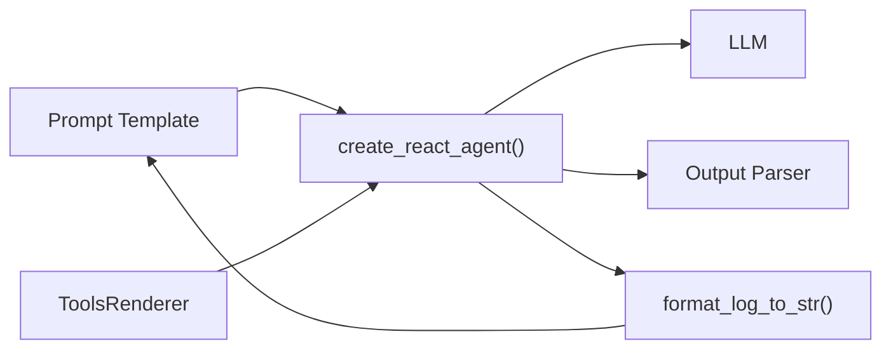

# ReAct Agent

<cite>
**Referenced Files in This Document**
- [react/__init__.py](file://libs/langchain/langchain_classic/agents/react/__init__.py)
- [react/agent.py](file://libs/langchain/langchain_classic/agents/react/agent.py)
- [react/base.py](file://libs/langchain/langchain_classic/agents/react/base.py)
- [react/output_parser.py](file://libs/langchain/langchain_classic/agents/react/output_parser.py)
- [react/wiki_prompt.py](file://libs/langchain/langchain_classic/agents/react/wiki_prompt.py)
- [react/textworld_prompt.py](file://libs/langchain/langchain_classic/agents/react/textworld_prompt.py)
- [output_parsers/react_single_input.py](file://libs/langchain/langchain_classic/agents/output_parsers/react_single_input.py)
- [output_parsers/react_json_single_input.py](file://libs/langchain/langchain_classic/agents/output_parsers/react_json_single_input.py)
- [format_scratchpad/__init__.py](file://libs/langchain/langchain_classic/agents/format_scratchpad/__init__.py)
</cite>

## Table of Contents
1. [Introduction](#introduction)
2. [Project Structure](#project-structure)
3. [Core Components](#core-components)
4. [Architecture Overview](#architecture-overview)
5. [Detailed Component Analysis](#detailed-component-analysis)
6. [Dependency Analysis](#dependency-analysis)
7. [Performance Considerations](#performance-considerations)
8. [Troubleshooting Guide](#troubleshooting-guide)
9. [Conclusion](#conclusion)
10. [Appendices](#appendices)

## Introduction
This document explains the ReAct (Reasoning and Acting) agent implementation in the classic LangChain agent stack. ReAct alternates between a reasoning trace (“Thought”) and an action execution (“Action” with “Action Input”), followed by an observation (“Observation”). The agent’s prompt template encodes this loop, and the output parser extracts either a tool action or a final answer. The implementation supports both tool-driven execution and direct answering modes, integrates with various language models, and provides guidance for prompt engineering, tool selection, and edge-case handling.

## Project Structure
The ReAct implementation is organized under the classic agents package with dedicated modules for the agent factory, prompt templates, output parsing, and scratchpad formatting.

**Diagram sources**
- [react/agent.py](file://libs/langchain/langchain_classic/agents/react/agent.py#L16-L148)
- [react/base.py](file://libs/langchain/langchain_classic/agents/react/base.py#L36-L190)
- [react/output_parser.py](file://libs/langchain/langchain_classic/agents/react/output_parser.py#L10-L35)
- [react/wiki_prompt.py](file://libs/langchain/langchain_classic/agents/react/wiki_prompt.py#L68-L71)
- [react/textworld_prompt.py](file://libs/langchain/langchain_classic/agents/react/textworld_prompt.py#L49-L52)
- [output_parsers/react_single_input.py](file://libs/langchain/langchain_classic/agents/output_parsers/react_single_input.py#L22-L102)
- [output_parsers/react_json_single_input.py](file://libs/langchain/langchain_classic/agents/output_parsers/react_json_single_input.py#L15-L87)
- [format_scratchpad/__init__.py](file://libs/langchain/langchain_classic/agents/format_scratchpad/__init__.py#L9-L27)

**Section sources**
- [react/__init__.py](file://libs/langchain/langchain_classic/agents/react/__init__.py#L1-L2)
- [react/agent.py](file://libs/langchain/langchain_classic/agents/react/agent.py#L16-L148)
- [react/base.py](file://libs/langchain/langchain_classic/agents/react/base.py#L36-L190)
- [react/output_parser.py](file://libs/langchain/langchain_classic/agents/react/output_parser.py#L10-L35)
- [react/wiki_prompt.py](file://libs/langchain/langchain_classic/agents/react/wiki_prompt.py#L68-L71)
- [react/textworld_prompt.py](file://libs/langchain/langchain_classic/agents/react/textworld_prompt.py#L49-L52)
- [output_parsers/react_single_input.py](file://libs/langchain/langchain_classic/agents/output_parsers/react_single_input.py#L22-L102)
- [output_parsers/react_json_single_input.py](file://libs/langchain/langchain_classic/agents/output_parsers/react_json_single_input.py#L15-L87)
- [format_scratchpad/__init__.py](file://libs/langchain/langchain_classic/agents/format_scratchpad/__init__.py#L9-L27)

## Core Components
- ReAct agent factory: Creates a runnable pipeline that binds a prompt, LLM, and output parser, and injects a formatted scratchpad of prior steps.
- Prompt templates: Provide the explicit Thought/Action/Action Input/Observation loop and optional Final Answer signaling.
- Output parsers: Extract either an AgentAction (tool invocation) or AgentFinish (final answer), with strict format validation.
- Scratchpad formatting: Converts prior (action, observation) tuples into a string suitable for inclusion in the prompt.

Key responsibilities:
- Prompt orchestration: Ensures required variables are present and renders tool descriptions and names.
- Stop sequence binding: Optionally instructs the LLM to stop at “Observation:” to reduce hallucinations.
- Parsing: Validates ReAct format and raises informative errors when the LLM output is malformed.

**Section sources**
- [react/agent.py](file://libs/langchain/langchain_classic/agents/react/agent.py#L16-L148)
- [react/wiki_prompt.py](file://libs/langchain/langchain_classic/agents/react/wiki_prompt.py#L68-L71)
- [react/textworld_prompt.py](file://libs/langchain/langchain_classic/agents/react/textworld_prompt.py#L49-L52)
- [output_parsers/react_single_input.py](file://libs/langchain/langchain_classic/agents/output_parsers/react_single_input.py#L22-L102)
- [output_parsers/react_json_single_input.py](file://libs/langchain/langchain_classic/agents/output_parsers/react_json_single_input.py#L15-L87)
- [format_scratchpad/__init__.py](file://libs/langchain/langchain_classic/agents/format_scratchpad/__init__.py#L9-L27)

## Architecture Overview
The ReAct agent composes a prompt, an LLM, and an output parser into a single runnable. The scratchpad is continuously updated with prior steps to maintain context for the next reasoning and action cycle.

**Diagram sources**
- [react/agent.py](file://libs/langchain/langchain_classic/agents/react/agent.py#L130-L147)
- [format_scratchpad/__init__.py](file://libs/langchain/langchain_classic/agents/format_scratchpad/__init__.py#L9-L27)
- [output_parsers/react_single_input.py](file://libs/langchain/langchain_classic/agents/output_parsers/react_single_input.py#L53-L97)

## Detailed Component Analysis

### ReAct Agent Factory
The factory constructs a pipeline that:
- Validates required prompt variables.
- Partially renders tools and tool names.
- Optionally binds stop sequences to the LLM.
- Formats the scratchpad from prior steps.
- Routes the raw LLM output to the appropriate output parser.

**Diagram sources**
- [react/agent.py](file://libs/langchain/langchain_classic/agents/react/agent.py#L123-L147)

**Section sources**
- [react/agent.py](file://libs/langchain/langchain_classic/agents/react/agent.py#L16-L148)

### Prompt Templates and Thought/Action/Observation Loop
Two built-in prompt templates demonstrate the loop:
- Wiki prompt: Encodes the classic Thought/Action/Action Input/Observation/Final Answer sequence.
- TextWorld prompt: Adapts the loop for a text-based game scenario.

Both templates include a suffix that injects the current input and the scratchpad.

**Diagram sources**
- [react/wiki_prompt.py](file://libs/langchain/langchain_classic/agents/react/wiki_prompt.py#L68-L71)
- [react/textworld_prompt.py](file://libs/langchain/langchain_classic/agents/react/textworld_prompt.py#L49-L52)

**Section sources**
- [react/wiki_prompt.py](file://libs/langchain/langchain_classic/agents/react/wiki_prompt.py#L3-L71)
- [react/textworld_prompt.py](file://libs/langchain/langchain_classic/agents/react/textworld_prompt.py#L3-L52)

### Output Parsers: Single-Input and JSON Variants
Two output parsers support different output formats:

- Single-input parser: Recognizes “Action” and “Action Input” blocks or a “Final Answer” line.
- JSON single-input parser: Extracts a JSON-formatted action block and returns an AgentAction or AgentFinish.

**Diagram sources**
- [output_parsers/react_single_input.py](file://libs/langchain/langchain_classic/agents/output_parsers/react_single_input.py#L22-L102)
- [output_parsers/react_json_single_input.py](file://libs/langchain/langchain_classic/agents/output_parsers/react_json_single_input.py#L15-L87)
- [react/output_parser.py](file://libs/langchain/langchain_classic/agents/react/output_parser.py#L10-L35)

**Section sources**
- [output_parsers/react_single_input.py](file://libs/langchain/langchain_classic/agents/output_parsers/react_single_input.py#L22-L102)
- [output_parsers/react_json_single_input.py](file://libs/langchain/langchain_classic/agents/output_parsers/react_json_single_input.py#L15-L87)
- [react/output_parser.py](file://libs/langchain/langchain_classic/agents/react/output_parser.py#L10-L35)

### Legacy ReAct Agents (Docstore and TextWorld)
Legacy agent classes encapsulate defaults for specific tasks:
- ReActDocstoreAgent: Uses the wiki prompt and enforces specific tool sets for search and lookup.
- ReActTextWorldAgent: Uses the TextWorld prompt and enforces a single “Play” tool.
- Both define stop prefixes and LLM prefixes for consistent formatting.

**Diagram sources**
- [react/base.py](file://libs/langchain/langchain_classic/agents/react/base.py#L36-L163)

**Section sources**
- [react/base.py](file://libs/langchain/langchain_classic/agents/react/base.py#L36-L190)

## Dependency Analysis
The ReAct agent pipeline depends on:
- Prompt rendering and variable validation.
- Tool rendering and tool name lists.
- LLM stop sequence binding.
- Scratchpad formatting from prior steps.
- Output parsing to extract actions or final answers.

**Diagram sources**
- [react/agent.py](file://libs/langchain/langchain_classic/agents/react/agent.py#L130-L147)
- [format_scratchpad/__init__.py](file://libs/langchain/langchain_classic/agents/format_scratchpad/__init__.py#L9-L27)

**Section sources**
- [react/agent.py](file://libs/langchain/langchain_classic/agents/react/agent.py#L16-L148)
- [format_scratchpad/__init__.py](file://libs/langchain/langchain_classic/agents/format_scratchpad/__init__.py#L9-L27)

## Performance Considerations
- Stop sequence binding: Using a stop at “Observation:” reduces unnecessary continuation and improves reliability.
- Prompt variable validation: Ensures required inputs are present early to avoid runtime failures.
- Output parsing strictness: Enforces precise formats to minimize retries and mis-parsed outputs.
- Tool rendering: Pre-rendering tool descriptions avoids repeated formatting overhead.

[No sources needed since this section provides general guidance]

## Troubleshooting Guide
Common issues and resolutions:
- Missing prompt variables: The agent validates that the prompt includes required keys. Add missing variables or adjust the prompt.
- Malformed output format: Output parsers raise explicit exceptions when “Action” or “Final Answer” formatting is incorrect. Review the LLM’s instruction adherence.
- Stop sequence mismatch: If the chosen LLM does not support stop sequences, disable stop binding.
- Tool selection: Ensure tools match the prompt expectations and names; mismatches cause validation errors.

**Section sources**
- [react/agent.py](file://libs/langchain/langchain_classic/agents/react/agent.py#L123-L129)
- [output_parsers/react_single_input.py](file://libs/langchain/langchain_classic/agents/output_parsers/react_single_input.py#L76-L97)
- [output_parsers/react_json_single_input.py](file://libs/langchain/langchain_classic/agents/output_parsers/react_json_single_input.py#L77-L82)
- [react/base.py](file://libs/langchain/langchain_classic/agents/react/base.py#L58-L67)

## Conclusion
The ReAct agent implementation provides a robust, modular pipeline for alternating reasoning and action. By combining a structured prompt template, a flexible output parser, and a scratchpad formatter, it supports both tool-driven and direct-answer modes. Proper prompt engineering, careful tool selection, and stop-sequence configuration are essential for reliable operation.

[No sources needed since this section summarizes without analyzing specific files]

## Appendices

### Practical Implementation Scenarios
- Information retrieval: Use the wiki prompt with search and lookup tools to iteratively refine queries and extract answers.
- Game play: Use the TextWorld prompt with a single “Play” tool to execute commands and track progress.
- Multi-step math: Design a prompt that encourages stepwise decomposition and verification via tools.

[No sources needed since this section provides general guidance]

### Prompt Engineering Tips
- Explicitly enumerate the Thought/Action/Action Input/Observation/Final Answer structure in the prompt.
- Include a small set of few-shot examples to anchor the format.
- Clearly specify tool capabilities and argument schemas.
- Consider adding a “Step back and think” instruction to improve reasoning quality.

[No sources needed since this section provides general guidance]

### Tool Selection Strategies
- Match tools to the domain: For knowledge-intensive tasks, prefer retrieval and lookup tools; for procedural tasks, prefer action-based tools.
- Limit tool count: Fewer tools reduce ambiguity and improve parsing accuracy.
- Name tools clearly: Consistent, descriptive names help the LLM select the right action.

[No sources needed since this section provides general guidance]