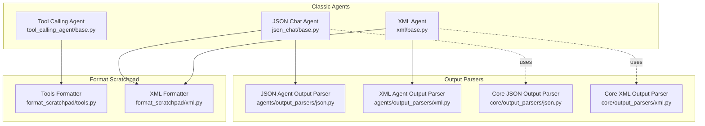
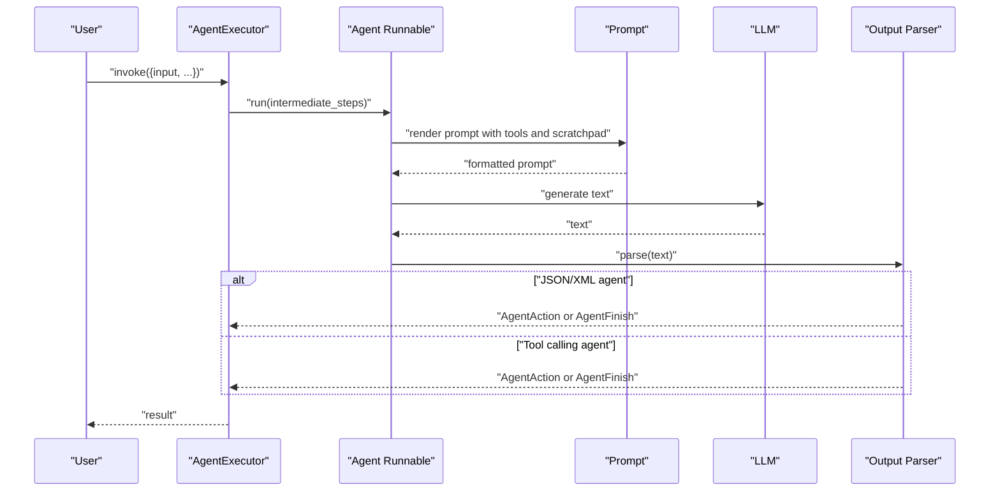
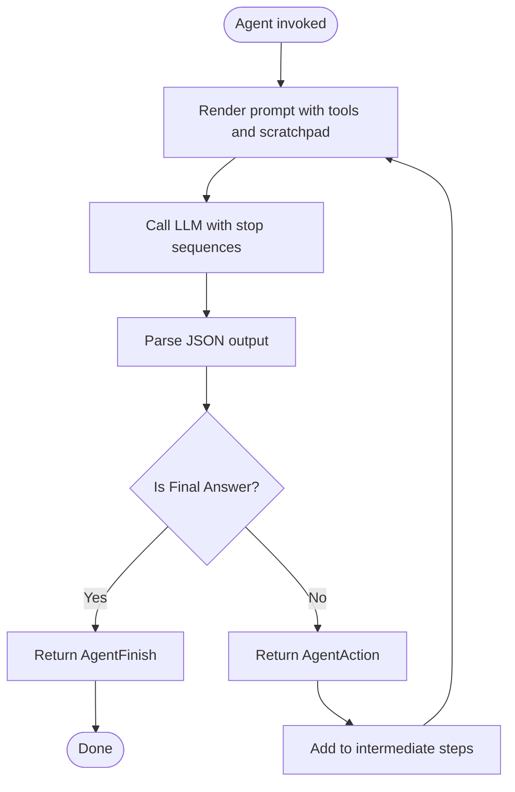
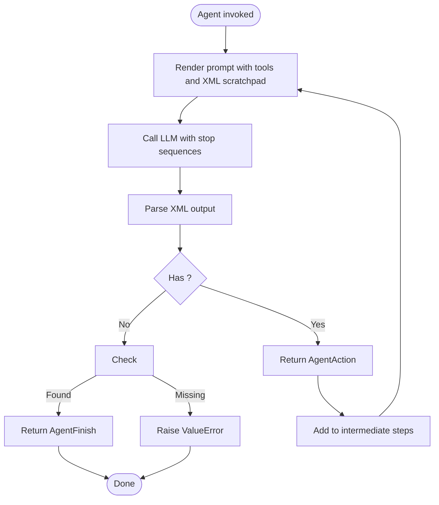
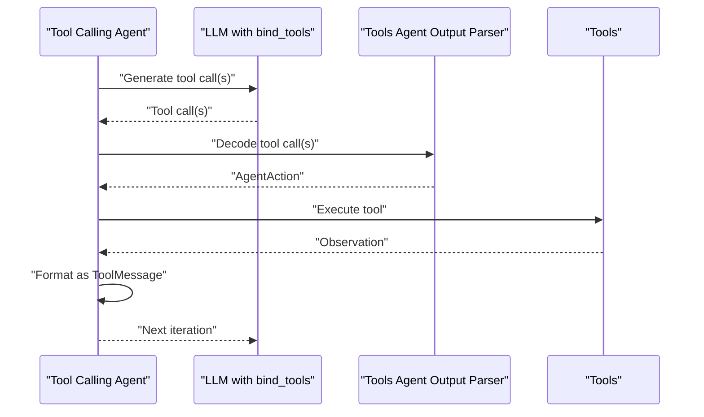
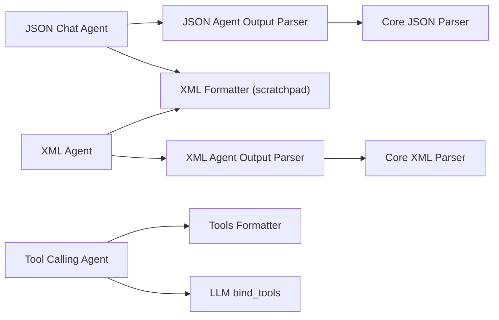

# Specialized Agent Types

<cite>
**Referenced Files in This Document**
- [agents/__init__.py](file://libs/langchain/langchain_classic/agents/__init__.py)
- [agents/agent_types.py](file://libs/langchain/langchain_classic/agents/agent_types.py)
- [agents/json_chat/base.py](file://libs/langchain/langchain_classic/agents/json_chat/base.py)
- [agents/xml/base.py](file://libs/langchain/langchain_classic/agents/xml/base.py)
- [agents/tool_calling_agent/base.py](file://libs/langchain/langchain_classic/agents/tool_calling_agent/base.py)
- [agents/format_scratchpad/tools.py](file://libs/langchain/langchain_classic/agents/format_scratchpad/tools.py)
- [agents/format_scratchpad/xml.py](file://libs/langchain/langchain_classic/agents/format_scratchpad/xml.py)
- [agents/output_parsers/json.py](file://libs/langchain/langchain_classic/agents/output_parsers/json.py)
- [agents/output_parsers/xml.py](file://libs/langchain/langchain_classic/agents/output_parsers/xml.py)
- [core/output_parsers/json.py](file://libs/core/langchain_core/output_parsers/json.py)
- [core/output_parsers/xml.py](file://libs/core/langchain_core/output_parsers/xml.py)
</cite>

## Table of Contents
1. [Introduction](#introduction)
2. [Project Structure](#project-structure)
3. [Core Components](#core-components)
4. [Architecture Overview](#architecture-overview)
5. [Detailed Component Analysis](#detailed-component-analysis)
6. [Dependency Analysis](#dependency-analysis)
7. [Performance Considerations](#performance-considerations)
8. [Troubleshooting Guide](#troubleshooting-guide)
9. [Conclusion](#conclusion)

## Introduction
This document explains specialized agent implementations in the repository, focusing on JSON chat agents, XML agents, chat agents, and tool calling agents. It details their use cases, structured output formats, parsing mechanisms, and integration patterns. It also compares chat-focused agents versus tool-centric agents, and describes how tool calling agents automate tool selection and execution.

## Project Structure
The specialized agents live under the classic agents package and integrate with core output parsers and format scratchpad utilities:
- JSON chat agent: structured JSON output with explicit action/action_input schema and a dedicated output parser.
- XML agent: structured XML output with escaping for safety and a dedicated output parser.
- Tool calling agent: uses model-native tool/function calling via bind_tools and converts tool outputs to messages.
- Shared utilities: format_scratchpad helpers encode intermediate steps into the agent’s preferred format; core output parsers handle robust decoding and streaming.

**Diagram sources**
- [agents/json_chat/base.py](file://libs/langchain/langchain_classic/agents/json_chat/base.py#L14-L196)
- [agents/xml/base.py](file://libs/langchain/langchain_classic/agents/xml/base.py#L115-L237)
- [agents/tool_calling_agent/base.py](file://libs/langchain/langchain_classic/agents/tool_calling_agent/base.py#L18-L118)
- [agents/output_parsers/json.py](file://libs/langchain/langchain_classic/agents/output_parsers/json.py#L15-L58)
- [agents/output_parsers/xml.py](file://libs/langchain/langchain_classic/agents/output_parsers/xml.py#L26-L127)
- [core/output_parsers/json.py](file://libs/core/langchain_core/output_parsers/json.py#L31-L140)
- [core/output_parsers/xml.py](file://libs/core/langchain_core/output_parsers/xml.py#L151-L301)
- [agents/format_scratchpad/tools.py](file://libs/langchain/langchain_classic/agents/format_scratchpad/tools.py#L51-L74)
- [agents/format_scratchpad/xml.py](file://libs/langchain/langchain_classic/agents/format_scratchpad/xml.py#L21-L53)

**Section sources**
- [agents/__init__.py](file://libs/langchain/langchain_classic/agents/__init__.py#L1-L165)
- [agents/agent_types.py](file://libs/langchain/langchain_classic/agents/agent_types.py#L1-L55)

## Core Components
- JSON Chat Agent: Creates a runnable pipeline that renders tools, binds stop sequences, formats scratchpad as JSON-friendly blocks, and parses JSON output into AgentAction or AgentFinish.
- XML Agent: Creates a runnable pipeline that renders tools, escapes content to avoid tag conflicts, binds stop sequences, and parses XML output into AgentAction or AgentFinish.
- Tool Calling Agent: Creates a runnable pipeline that binds tools to the model, formats intermediate steps as ToolMessages, and parses model tool calls into AgentAction or AgentFinish.
- Output Parsers: Robust decoders for JSON and XML, including streaming support and error handling.
- Format Scratchpad Utilities: Encode agent logs and observations into the agent’s preferred format (XML with minimal escaping; tool messages for tool calling).

**Section sources**
- [agents/json_chat/base.py](file://libs/langchain/langchain_classic/agents/json_chat/base.py#L14-L196)
- [agents/xml/base.py](file://libs/langchain/langchain_classic/agents/xml/base.py#L115-L237)
- [agents/tool_calling_agent/base.py](file://libs/langchain/langchain_classic/agents/tool_calling_agent/base.py#L18-L118)
- [agents/output_parsers/json.py](file://libs/langchain/langchain_classic/agents/output_parsers/json.py#L15-L58)
- [agents/output_parsers/xml.py](file://libs/langchain/langchain_classic/agents/output_parsers/xml.py#L26-L127)
- [core/output_parsers/json.py](file://libs/core/langchain_core/output_parsers/json.py#L31-L140)
- [core/output_parsers/xml.py](file://libs/core/langchain_core/output_parsers/xml.py#L151-L301)
- [agents/format_scratchpad/tools.py](file://libs/langchain/langchain_classic/agents/format_scratchpad/tools.py#L51-L74)
- [agents/format_scratchpad/xml.py](file://libs/langchain/langchain_classic/agents/format_scratchpad/xml.py#L21-L53)

## Architecture Overview
The agents share a common pattern: prompt + LLM + format scratchpad + output parser. Differences lie in:
- Output format: JSON vs XML vs model-native tool/function calls.
- Stop sequences and rendering: tailored per format.
- Parsing: JSON and XML parsers decode structured outputs; tool calling agent uses model-native tool calls.

**Diagram sources**
- [agents/json_chat/base.py](file://libs/langchain/langchain_classic/agents/json_chat/base.py#L185-L196)
- [agents/xml/base.py](file://libs/langchain/langchain_classic/agents/xml/base.py#L229-L237)
- [agents/tool_calling_agent/base.py](file://libs/langchain/langchain_classic/agents/tool_calling_agent/base.py#L110-L118)
- [agents/output_parsers/json.py](file://libs/langchain/langchain_classic/agents/output_parsers/json.py#L37-L58)
- [agents/output_parsers/xml.py](file://libs/langchain/langchain_classic/agents/output_parsers/xml.py#L69-L127)

## Detailed Component Analysis

### JSON Chat Agent
- Purpose: Use JSON to structure reasoning, tool selection, and final answers for chat models.
- Structured output format:
  - Action selection: {"action": "...", "action_input": "..."}.
  - Final answer: {"action": "Final Answer", "action_input": "..."}.
- Parsing mechanism:
  - Uses a dedicated JSON agent output parser that validates and extracts action/action_input or final answer.
  - Handles lists of actions by taking the first item and normalizes missing inputs.
- Stop sequences and rendering:
  - Optional stop tokens to reduce hallucinations.
  - Tools rendered via a renderer; scratchpad formatted as messages.
- Advantages:
  - Predictable JSON schema improves reliability for downstream systems.
  - Works well with chat models and supports streaming via core JSON parser.

**Diagram sources**
- [agents/json_chat/base.py](file://libs/langchain/langchain_classic/agents/json_chat/base.py#L14-L196)
- [agents/output_parsers/json.py](file://libs/langchain/langchain_classic/agents/output_parsers/json.py#L37-L58)

**Section sources**
- [agents/json_chat/base.py](file://libs/langchain/langchain_classic/agents/json_chat/base.py#L14-L196)
- [agents/output_parsers/json.py](file://libs/langchain/langchain_classic/agents/output_parsers/json.py#L15-L58)
- [core/output_parsers/json.py](file://libs/core/langchain_core/output_parsers/json.py#L31-L140)

### XML Agent
- Purpose: Use XML tags to structure tool invocations and final answers.
- Structured output format:
  - Tool invocation: <tool>...</tool>, <tool_input>...</tool_input>.
  - Final answer: <final_answer>...</final_answer>.
- Parsing mechanism:
  - Minimal escaping support to safely embed content that looks like tags.
  - Parser validates structure and raises clear errors for malformed XML.
- Stop sequences and rendering:
  - Optional stop tokens to constrain generation.
  - XML formatter escapes tags in tool names/inputs/observations.
- Advantages:
  - Clear separation of actions and answers via tags.
  - Safe handling of tool names/inputs containing XML characters.

**Diagram sources**
- [agents/xml/base.py](file://libs/langchain/langchain_classic/agents/xml/base.py#L115-L237)
- [agents/output_parsers/xml.py](file://libs/langchain/langchain_classic/agents/output_parsers/xml.py#L69-L127)
- [agents/format_scratchpad/xml.py](file://libs/langchain/langchain_classic/agents/format_scratchpad/xml.py#L21-L53)

**Section sources**
- [agents/xml/base.py](file://libs/langchain/langchain_classic/agents/xml/base.py#L115-L237)
- [agents/output_parsers/xml.py](file://libs/langchain/langchain_classic/agents/output_parsers/xml.py#L26-L127)
- [agents/format_scratchpad/xml.py](file://libs/langchain/langchain_classic/agents/format_scratchpad/xml.py#L21-L53)
- [core/output_parsers/xml.py](file://libs/core/langchain_core/output_parsers/xml.py#L151-L301)

### Tool Calling Agent
- Purpose: Leverage model-native tool/function calling to select and execute tools automatically.
- Structured output format:
  - Model generates tool calls; agent converts (AgentAction, observation) into ToolMessage objects.
  - Observations are serialized to JSON or stringified if needed.
- Parsing mechanism:
  - Uses model’s native tool schema; output parser decodes tool calls into AgentAction or AgentFinish.
  - Integrates with format_scratchpad tools formatter to produce ToolMessage sequences.
- Advantages:
  - Reduces prompt engineering overhead by delegating tool selection to the model.
  - Simplifies multi-step tool workflows with automatic message routing.

**Diagram sources**
- [agents/tool_calling_agent/base.py](file://libs/langchain/langchain_classic/agents/tool_calling_agent/base.py#L18-L118)
- [agents/format_scratchpad/tools.py](file://libs/langchain/langchain_classic/agents/format_scratchpad/tools.py#L51-L74)

**Section sources**
- [agents/tool_calling_agent/base.py](file://libs/langchain/langchain_classic/agents/tool_calling_agent/base.py#L18-L118)
- [agents/format_scratchpad/tools.py](file://libs/langchain/langchain_classic/agents/format_scratchpad/tools.py#L51-L74)

### Chat-Focused vs Tool-Centric Agents
- Chat-focused agents (JSON Chat, XML):
  - Emphasize structured reasoning and final answers via explicit JSON or XML blocks.
  - Suitable when you need deterministic, schema-driven outputs and want to minimize model-native tool usage.
- Tool-centric agents (Tool Calling):
  - Rely on model-native tool/function calling to automate tool selection and execution.
  - Suitable when tool availability and dynamic orchestration are priorities and you want to offload tool selection to the model.

**Section sources**
- [agents/json_chat/base.py](file://libs/langchain/langchain_classic/agents/json_chat/base.py#L14-L196)
- [agents/xml/base.py](file://libs/langchain/langchain_classic/agents/xml/base.py#L115-L237)
- [agents/tool_calling_agent/base.py](file://libs/langchain/langchain_classic/agents/tool_calling_agent/base.py#L18-L118)

### Practical Selection Guide
- Choose JSON Chat Agent when:
  - Output must be strictly JSON for downstream consumers.
  - You want explicit control over action/action_input schema and final answer blocks.
  - Chat models are used and stop sequences improve stability.
- Choose XML Agent when:
  - XML is a natural fit for your system and you need clear tag boundaries.
  - Tool names/inputs may contain XML characters; minimal escaping is supported.
- Choose Tool Calling Agent when:
  - You want the model to decide which tools to use and in what order.
  - Tool availability is dynamic and you prefer model-native tool calling.
  - You can rely on the model’s bind_tools capability and robust tool message formatting.

**Section sources**
- [agents/json_chat/base.py](file://libs/langchain/langchain_classic/agents/json_chat/base.py#L14-L196)
- [agents/xml/base.py](file://libs/langchain/langchain_classic/agents/xml/base.py#L115-L237)
- [agents/tool_calling_agent/base.py](file://libs/langchain/langchain_classic/agents/tool_calling_agent/base.py#L18-L118)

## Dependency Analysis
- Agent creators depend on:
  - Prompt templates and tools renderers.
  - Format scratchpad utilities for intermediate step encoding.
  - Output parsers for decoding model text into AgentAction/AgentFinish.
- Tool Calling Agent additionally depends on:
  - Model’s bind_tools interface.
  - Tools formatter to convert tool outputs into ToolMessage objects.

**Diagram sources**
- [agents/json_chat/base.py](file://libs/langchain/langchain_classic/agents/json_chat/base.py#L14-L196)
- [agents/xml/base.py](file://libs/langchain/langchain_classic/agents/xml/base.py#L115-L237)
- [agents/tool_calling_agent/base.py](file://libs/langchain/langchain_classic/agents/tool_calling_agent/base.py#L18-L118)
- [agents/output_parsers/json.py](file://libs/langchain/langchain_classic/agents/output_parsers/json.py#L15-L58)
- [agents/output_parsers/xml.py](file://libs/langchain/langchain_classic/agents/output_parsers/xml.py#L26-L127)
- [core/output_parsers/json.py](file://libs/core/langchain_core/output_parsers/json.py#L31-L140)
- [core/output_parsers/xml.py](file://libs/core/langchain_core/output_parsers/xml.py#L151-L301)
- [agents/format_scratchpad/tools.py](file://libs/langchain/langchain_classic/agents/format_scratchpad/tools.py#L51-L74)
- [agents/format_scratchpad/xml.py](file://libs/langchain/langchain_classic/agents/format_scratchpad/xml.py#L21-L53)

**Section sources**
- [agents/__init__.py](file://libs/langchain/langchain_classic/agents/__init__.py#L1-L165)
- [agents/agent_types.py](file://libs/langchain/langchain_classic/agents/agent_types.py#L1-L55)

## Performance Considerations
- Streaming:
  - Core JSON parser supports incremental parsing and optional diffing for streaming.
  - Core XML parser supports streaming via pull parser and yields nested elements as they complete.
- Stop sequences:
  - Both JSON and XML agents support stop tokens to reduce unnecessary generations and improve throughput.
- Tool message serialization:
  - Tool calling agent serializes observations to JSON for robustness; falls back to string conversion on failure.

**Section sources**
- [core/output_parsers/json.py](file://libs/core/langchain_core/output_parsers/json.py#L31-L140)
- [core/output_parsers/xml.py](file://libs/core/langchain_core/output_parsers/xml.py#L42-L149)
- [agents/tool_calling_agent/base.py](file://libs/langchain/langchain_classic/agents/tool_calling_agent/base.py#L18-L118)
- [agents/format_scratchpad/tools.py](file://libs/langchain/langchain_classic/agents/format_scratchpad/tools.py#L18-L48)

## Troubleshooting Guide
- JSON Agent Output Parsing:
  - Malformed JSON or missing fields cause exceptions; ensure prompts enforce strict JSON schema and stop sequences.
- XML Agent Output Parsing:
  - Minimal escaping must be enabled when using the XML formatter; otherwise, tag conflicts can occur.
  - Malformed XML raises clear errors; validate XML structure and closing tags.
- Tool Calling Agent:
  - Requires bind_tools on the LLM; otherwise, creation fails early.
  - invalid_tool_calls errors often stem from non-serializable tool outputs; ensure tool outputs are JSON-serializable or implement a safe string representation.

**Section sources**
- [agents/output_parsers/json.py](file://libs/langchain/langchain_classic/agents/output_parsers/json.py#L37-L58)
- [agents/output_parsers/xml.py](file://libs/langchain/langchain_classic/agents/output_parsers/xml.py#L69-L127)
- [agents/tool_calling_agent/base.py](file://libs/langchain/langchain_classic/agents/tool_calling_agent/base.py#L103-L108)
- [agents/format_scratchpad/xml.py](file://libs/langchain/langchain_classic/agents/format_scratchpad/xml.py#L21-L53)
- [agents/format_scratchpad/tools.py](file://libs/langchain/langchain_classic/agents/format_scratchpad/tools.py#L18-L48)

## Conclusion
- JSON Chat Agent: Best for deterministic JSON outputs and chat models with explicit action/action_input schemas.
- XML Agent: Best for systems requiring clear tag-based structure and safe handling of tool content.
- Tool Calling Agent: Best for dynamic tool orchestration where the model selects and executes tools automatically.
- Choose based on output format requirements, tool availability, and complexity: JSON/XML for explicit schemas; tool calling for automation and reduced prompt engineering.