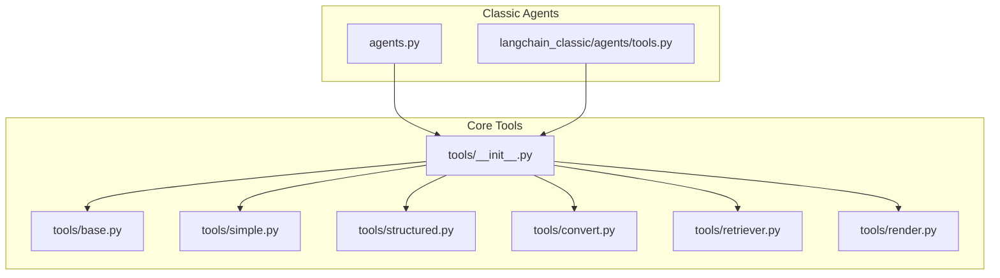
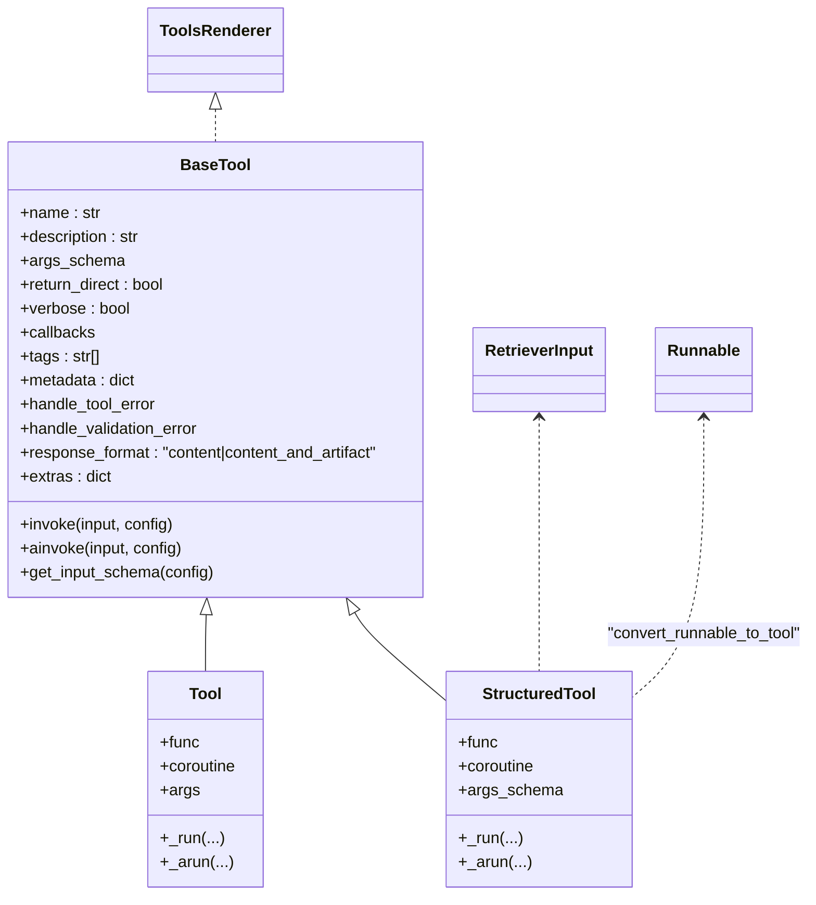
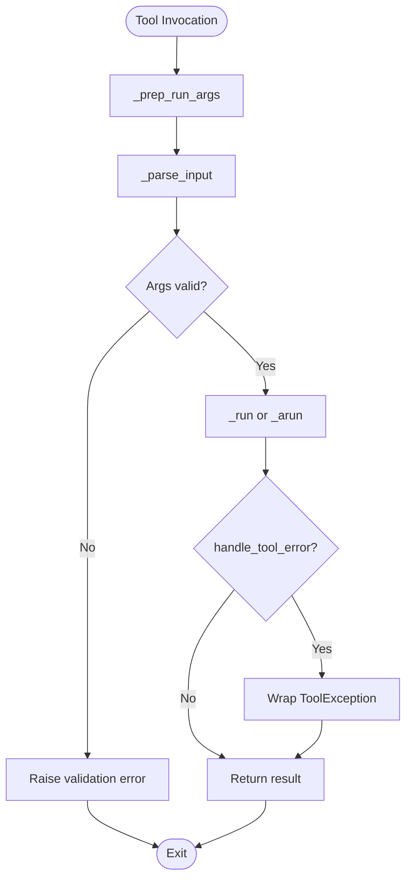
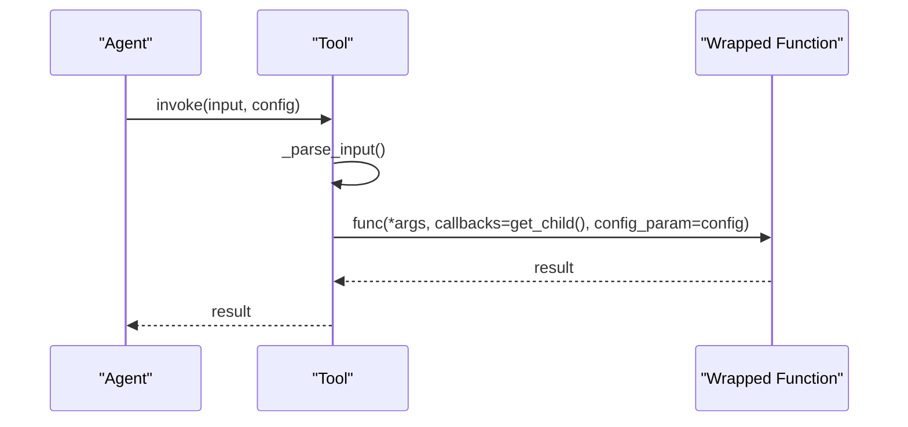
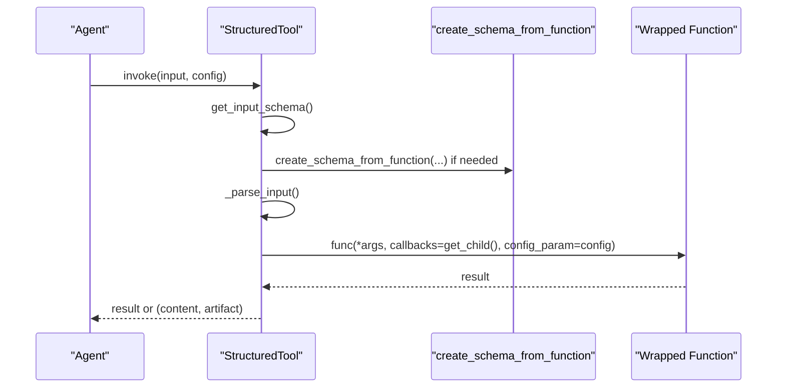
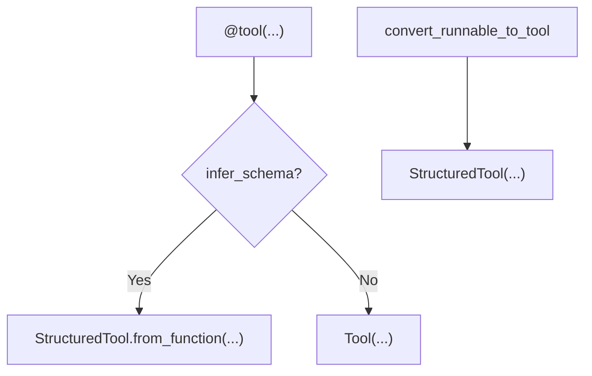
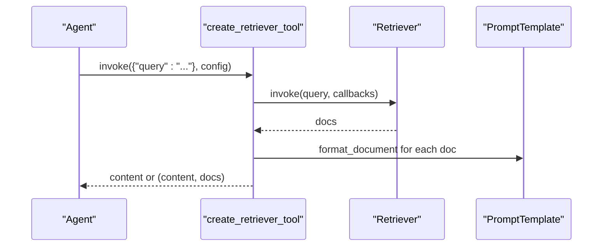
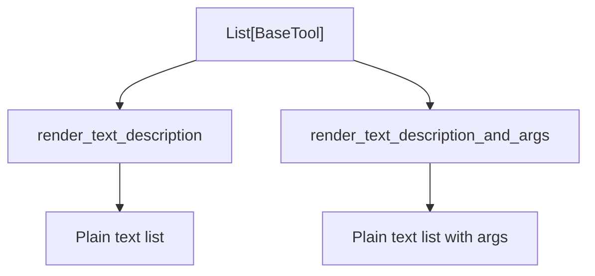
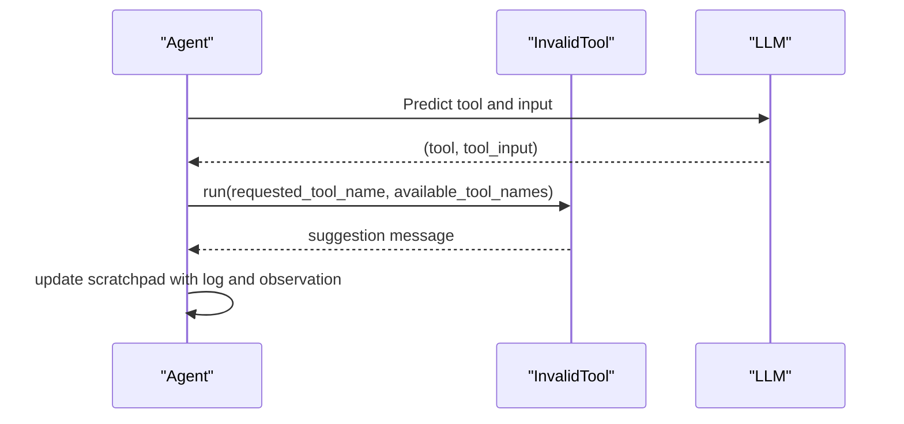
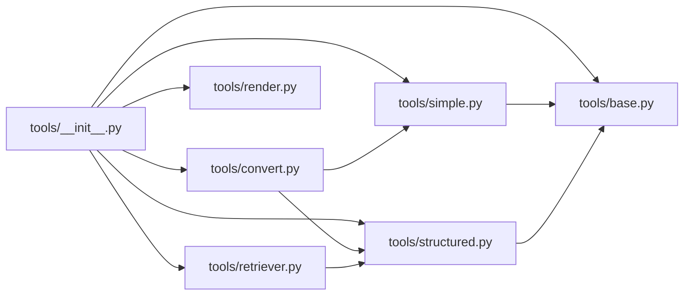

# Tool Integration and Management

<cite>
**Referenced Files in This Document**
- [tools/__init__.py](file://libs/core/langchain_core/tools/__init__.py)
- [tools/base.py](file://libs/core/langchain_core/tools/base.py)
- [tools/simple.py](file://libs/core/langchain_core/tools/simple.py)
- [tools/structured.py](file://libs/core/langchain_core/tools/structured.py)
- [tools/render.py](file://libs/core/langchain_core/tools/render.py)
- [tools/retriever.py](file://libs/core/langchain_core/tools/retriever.py)
- [tools/convert.py](file://libs/core/langchain_core/tools/convert.py)
- [agents.py](file://libs/core/langchain_core/agents.py)
- [langchain_classic/agents/tools.py](file://libs/langchain/langchain_classic/agents/tools.py)
</cite>

## Table of Contents
1. [Introduction](#introduction)
2. [Project Structure](#project-structure)
3. [Core Components](#core-components)
4. [Architecture Overview](#architecture-overview)
5. [Detailed Component Analysis](#detailed-component-analysis)
6. [Dependency Analysis](#dependency-analysis)
7. [Performance Considerations](#performance-considerations)
8. [Troubleshooting Guide](#troubleshooting-guide)
9. [Conclusion](#conclusion)
10. [Appendices](#appendices)

## Introduction
This document explains the tool integration and management system in the repository, focusing on the tool abstraction layer, registration and discovery mechanisms, loading strategies, built-in tool collections, scratchpad formatting for reasoning traces, tool selection and dynamic discovery, execution patterns, error handling, result processing, composition and multi-tool coordination, and security considerations. It synthesizes the core tool definitions and utilities from the langchain_core package and demonstrates how they integrate with classic agent implementations.

## Project Structure
The tool system is primarily implemented in the langchain_core package under the tools module. Key areas include:
- Abstraction and base tool definitions
- Built-in tool variants (simple and structured)
- Decorator and conversion utilities for turning functions and runnables into tools
- Retrieval tool wrapper
- Rendering utilities for tool descriptions
- Classic agent integration and invalid tool handling

**Diagram sources**
- [tools/__init__.py](file://libs/core/langchain_core/tools/__init__.py#L1-L96)
- [tools/base.py](file://libs/core/langchain_core/tools/base.py#L1-L1586)
- [tools/simple.py](file://libs/core/langchain_core/tools/simple.py#L1-L205)
- [tools/structured.py](file://libs/core/langchain_core/tools/structured.py#L1-L272)
- [tools/convert.py](file://libs/core/langchain_core/tools/convert.py#L1-L477)
- [tools/retriever.py](file://libs/core/langchain_core/tools/retriever.py#L1-L95)
- [tools/render.py](file://libs/core/langchain_core/tools/render.py#L1-L68)
- [agents.py](file://libs/core/langchain_core/agents.py#L1-L257)
- [langchain_classic/agents/tools.py](file://libs/langchain/langchain_classic/agents/tools.py#L1-L49)

**Section sources**
- [tools/__init__.py](file://libs/core/langchain_core/tools/__init__.py#L1-L96)
- [tools/base.py](file://libs/core/langchain_core/tools/base.py#L1-L1586)
- [tools/simple.py](file://libs/core/langchain_core/tools/simple.py#L1-L205)
- [tools/structured.py](file://libs/core/langchain_core/tools/structured.py#L1-L272)
- [tools/convert.py](file://libs/core/langchain_core/tools/convert.py#L1-L477)
- [tools/retriever.py](file://libs/core/langchain_core/tools/retriever.py#L1-L95)
- [tools/render.py](file://libs/core/langchain_core/tools/render.py#L1-L68)
- [agents.py](file://libs/core/langchain_core/agents.py#L1-L257)
- [langchain_classic/agents/tools.py](file://libs/langchain/langchain_classic/agents/tools.py#L1-L49)

## Core Components
- Tool abstraction layer: BaseTool defines the contract for all tools, including input schema handling, synchronous/asynchronous execution, and error handling hooks.
- Built-in tool variants:
  - Tool (simple): wraps a single function or coroutine, suitable for string-based inputs.
  - StructuredTool: supports structured inputs via Pydantic schemas, enabling complex argument validation and documentation.
- Decorators and converters:
  - tool decorator: converts functions/runnables to tools, inferring schemas and descriptions.
  - convert_runnable_to_tool: adapts Runnables to tools with optional schema overrides.
- Retrieval tool: create_retriever_tool wraps a retriever into a StructuredTool for agent use.
- Rendering utilities: render_text_description and render_text_description_and_args produce human-readable tool listings.
- Classic agent integration: InvalidTool provides a fallback when agents request unknown tools.

**Section sources**
- [tools/base.py](file://libs/core/langchain_core/tools/base.py#L405-L800)
- [tools/simple.py](file://libs/core/langchain_core/tools/simple.py#L31-L205)
- [tools/structured.py](file://libs/core/langchain_core/tools/structured.py#L40-L272)
- [tools/convert.py](file://libs/core/langchain_core/tools/convert.py#L76-L477)
- [tools/retriever.py](file://libs/core/langchain_core/tools/retriever.py#L31-L95)
- [tools/render.py](file://libs/core/langchain_core/tools/render.py#L13-L68)
- [langchain_classic/agents/tools.py](file://libs/langchain/langchain_classic/agents/tools.py#L11-L49)

## Architecture Overview
The tool system centers around BaseTool and its subclasses, with conversion utilities bridging functions, coroutines, and Runnables into tools. Agents consume tools via standardized interfaces and logs, while rendering utilities help present tool catalogs to LLMs.

**Diagram sources**
- [tools/base.py](file://libs/core/langchain_core/tools/base.py#L405-L800)
- [tools/simple.py](file://libs/core/langchain_core/tools/simple.py#L31-L205)
- [tools/structured.py](file://libs/core/langchain_core/tools/structured.py#L40-L272)
- [tools/render.py](file://libs/core/langchain_core/tools/render.py#L10-L10)
- [tools/retriever.py](file://libs/core/langchain_core/tools/retriever.py#L25-L39)
- [tools/convert.py](file://libs/core/langchain_core/tools/convert.py#L419-L477)

## Detailed Component Analysis

### Tool Abstraction Layer (BaseTool)
- Responsibilities:
  - Define the tool contract and lifecycle.
  - Manage input schema inference and validation.
  - Support synchronous and asynchronous execution.
  - Provide hooks for error handling and response formatting.
- Key behaviors:
  - Input parsing validates and normalizes inputs against args_schema.
  - Invoke/ainvoke route to _run/_arun with callback propagation.
  - Schema exposure for LLM tool-use prompts.

**Diagram sources**
- [tools/base.py](file://libs/core/langchain_core/tools/base.py#L635-L800)

**Section sources**
- [tools/base.py](file://libs/core/langchain_core/tools/base.py#L405-L800)

### Simple Tool (Tool)
- Purpose: wrap a single callable or coroutine for straightforward string-based operations.
- Behavior:
  - Enforces single-input semantics unless args_schema is provided.
  - Propagates callbacks and optional Runnable config parameters to wrapped functions.

**Diagram sources**
- [tools/simple.py](file://libs/core/langchain_core/tools/simple.py#L99-L155)

**Section sources**
- [tools/simple.py](file://libs/core/langchain_core/tools/simple.py#L31-L205)

### Structured Tool (StructuredTool)
- Purpose: support complex, typed inputs via Pydantic schemas.
- Behavior:
  - Infers schema from function signatures or accepts a provided args_schema.
  - Supports docstring parsing for descriptions and argument docs.
  - Handles injected arguments and response_format modes.

**Diagram sources**
- [tools/structured.py](file://libs/core/langchain_core/tools/structured.py#L74-L130)
- [tools/base.py](file://libs/core/langchain_core/tools/base.py#L289-L387)

**Section sources**
- [tools/structured.py](file://libs/core/langchain_core/tools/structured.py#L40-L272)
- [tools/base.py](file://libs/core/langchain_core/tools/base.py#L289-L387)

### Tool Decorators and Converters (tool, convert_runnable_to_tool)
- tool decorator:
  - Supports multiple call signatures and overloads.
  - Infers schemas from functions or uses provided args_schema.
  - Produces Tool or StructuredTool depending on infer_schema and signature.
- convert_runnable_to_tool:
  - Adapts Runnables to tools, preserving or overriding input schemas.

**Diagram sources**
- [tools/convert.py](file://libs/core/langchain_core/tools/convert.py#L76-L390)
- [tools/structured.py](file://libs/core/langchain_core/tools/structured.py#L132-L252)

**Section sources**
- [tools/convert.py](file://libs/core/langchain_core/tools/convert.py#L76-L477)
- [tools/structured.py](file://libs/core/langchain_core/tools/structured.py#L132-L252)

### Retrieval Tool Wrapper (create_retriever_tool)
- Purpose: adapt a retriever into a tool that returns formatted documents or documents plus content.
- Behavior:
  - Uses RetrieverInput schema for query.
  - Applies document formatting and optional artifact mode.

**Diagram sources**
- [tools/retriever.py](file://libs/core/langchain_core/tools/retriever.py#L31-L95)

**Section sources**
- [tools/retriever.py](file://libs/core/langchain_core/tools/retriever.py#L31-L95)

### Tool Rendering Utilities
- render_text_description: produces a plain-text catalog of tool names and descriptions.
- render_text_description_and_args: includes argument schemas for clarity.

**Diagram sources**
- [tools/render.py](file://libs/core/langchain_core/tools/render.py#L13-L68)

**Section sources**
- [tools/render.py](file://libs/core/langchain_core/tools/render.py#L13-L68)

### Agent Integration and Scratchpad Formatting
- Classic agent integration:
  - InvalidTool handles invalid tool names gracefully.
- Scratchpad formatting:
  - The classic agents format scratchpad entries to maintain reasoning traces and observations.
  - AgentAction and AgentFinish encapsulate action logs and final answers.

**Diagram sources**
- [langchain_classic/agents/tools.py](file://libs/langchain/langchain_classic/agents/tools.py#L11-L49)
- [agents.py](file://libs/core/langchain_core/agents.py#L44-L189)

**Section sources**
- [langchain_classic/agents/tools.py](file://libs/langchain/langchain_classic/agents/tools.py#L11-L49)
- [agents.py](file://libs/core/langchain_core/agents.py#L44-L189)

## Dependency Analysis
- Dynamic imports: tools/__init__.py lazily imports tool classes and utilities to reduce startup overhead.
- BaseTool depends on:
  - RunnableSerializable for invocation semantics.
  - Pydantic models for schema validation.
  - Callback managers for tracing.
- StructuredTool and Tool depend on BaseTool and schema inference helpers.
- Retrieval tool depends on StructuredTool and document formatting utilities.
- Converters depend on Runnable and schema creation utilities.

**Diagram sources**
- [tools/__init__.py](file://libs/core/langchain_core/tools/__init__.py#L64-L96)
- [tools/base.py](file://libs/core/langchain_core/tools/base.py#L1-L1586)
- [tools/simple.py](file://libs/core/langchain_core/tools/simple.py#L1-L205)
- [tools/structured.py](file://libs/core/langchain_core/tools/structured.py#L1-L272)
- [tools/convert.py](file://libs/core/langchain_core/tools/convert.py#L1-L477)
- [tools/retriever.py](file://libs/core/langchain_core/tools/retriever.py#L1-L95)
- [tools/render.py](file://libs/core/langchain_core/tools/render.py#L1-L68)

**Section sources**
- [tools/__init__.py](file://libs/core/langchain_core/tools/__init__.py#L64-L96)
- [tools/base.py](file://libs/core/langchain_core/tools/base.py#L1-L1586)
- [tools/structured.py](file://libs/core/langchain_core/tools/structured.py#L1-L272)
- [tools/convert.py](file://libs/core/langchain_core/tools/convert.py#L1-L477)
- [tools/retriever.py](file://libs/core/langchain_core/tools/retriever.py#L1-L95)
- [tools/render.py](file://libs/core/langchain_core/tools/render.py#L1-L68)

## Performance Considerations
- Lazy imports: tools/__init__.py defers loading of tool implementations until accessed, reducing import time.
- Schema inference: StructuredTool defers schema creation to runtime; caching or precomputing schemas can improve repeated tool creation performance.
- Async execution: Prefer coroutine when available to avoid thread pool overhead for I/O-bound tasks.
- Callback propagation: Passing callbacks efficiently reduces overhead compared to global tracing.

[No sources needed since this section provides general guidance]

## Troubleshooting Guide
- ToolException: Raised when tool execution fails; handle_tool_error controls how failures are surfaced to the agent.
- Validation errors: handle_validation_error governs how Pydantic validation errors are processed.
- Invalid tool names: InvalidTool suggests valid tool names to the agent.
- Schema mismatches: Ensure args_schema matches function signatures and docstrings when using infer_schema.

**Section sources**
- [tools/base.py](file://libs/core/langchain_core/tools/base.py#L390-L505)
- [langchain_classic/agents/tools.py](file://libs/langchain/langchain_classic/agents/tools.py#L11-L49)

## Conclusion
The tool system provides a robust, extensible foundation for agent tool integration. BaseTool unifies execution semantics, while Tool and StructuredTool serve diverse input patterns. Decorators and converters streamline tool creation from functions and Runnables. Retrieval tools and rendering utilities enhance usability. Classic agent integration and scratchpad formatting support reasoning trace maintenance. Security and sandboxing considerations should be addressed at the integration layer (e.g., restricting external API access, validating inputs, and isolating execution environments).

[No sources needed since this section summarizes without analyzing specific files]

## Appendices

### Practical Examples and Patterns
- Creating a simple tool:
  - Use the tool decorator with infer_schema enabled to auto-generate schemas from function signatures and docstrings.
  - Reference: [tools/convert.py](file://libs/core/langchain_core/tools/convert.py#L76-L390)
- Integrating an external API:
  - Wrap the API call in a function and convert it to a tool using the decorator.
  - Reference: [tools/convert.py](file://libs/core/langchain_core/tools/convert.py#L170-L257)
- Managing tool dependencies:
  - Use extras to pass provider-specific configuration to tools.
  - Reference: [tools/base.py](file://libs/core/langchain_core/tools/base.py#L515-L531)
- Tool execution patterns:
  - For I/O-bound tasks, supply a coroutine to StructuredTool or Tool to leverage async execution.
  - Reference: [tools/simple.py](file://libs/core/langchain_core/tools/simple.py#L126-L155), [tools/structured.py](file://libs/core/langchain_core/tools/structured.py#L101-L130)
- Error handling and result processing:
  - Configure handle_tool_error and response_format to control failure surfacing and artifact inclusion.
  - Reference: [tools/base.py](file://libs/core/langchain_core/tools/base.py#L499-L513)
- Tool composition and multi-tool coordination:
  - Compose tools by chaining them in agent workflows; use return_direct to short-circuit loops when appropriate.
  - Reference: [tools/base.py](file://libs/core/langchain_core/tools/base.py#L467-L472)
- Security considerations and sandboxing:
  - Restrict tool capabilities, validate inputs rigorously, and isolate external calls behind controlled interfaces.
  - Reference: [tools/base.py](file://libs/core/langchain_core/tools/base.py#L499-L513)