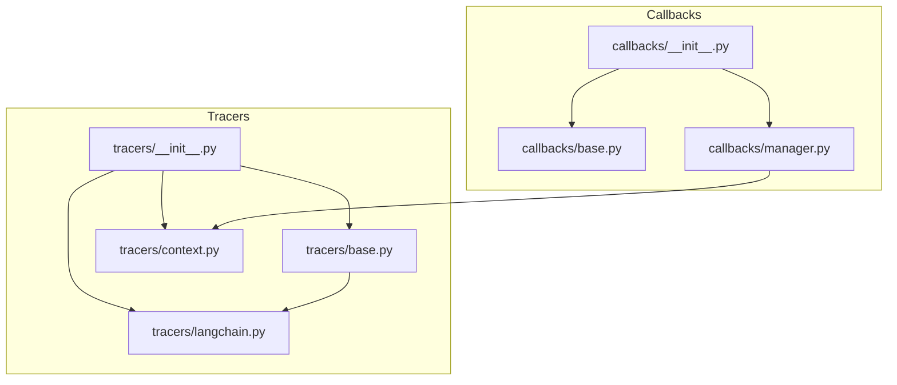
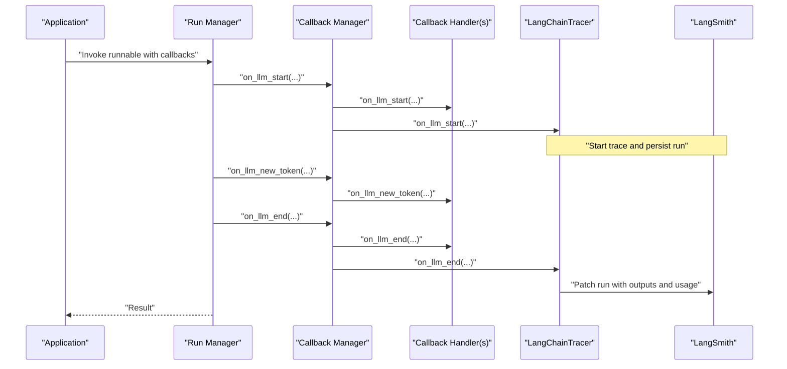
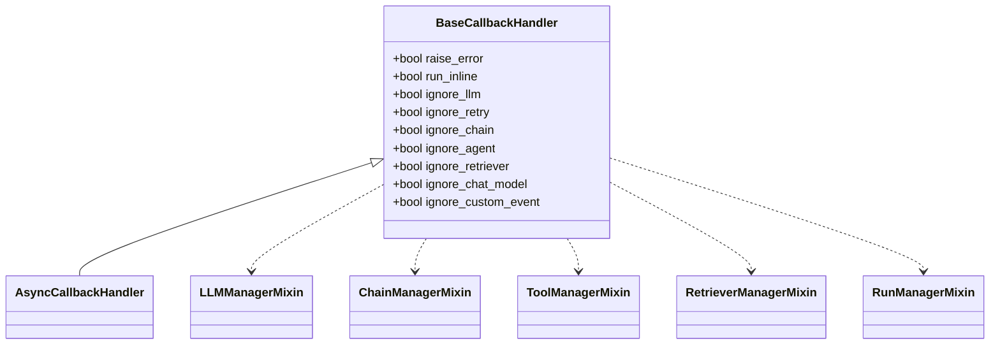
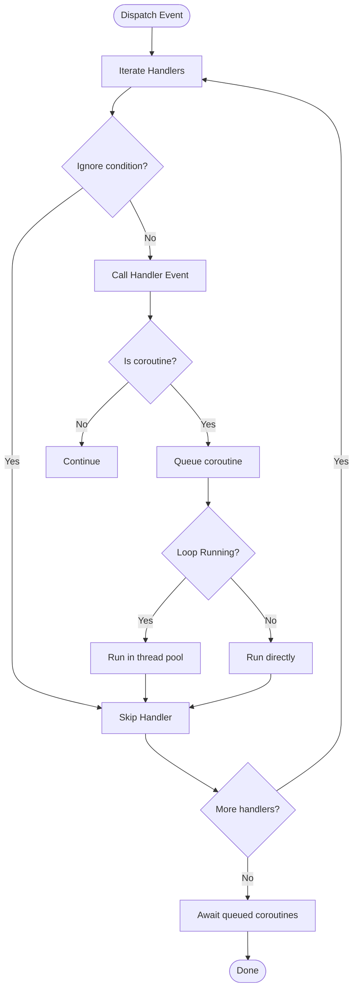
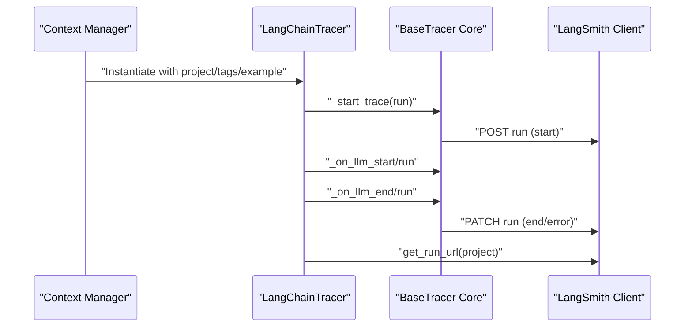
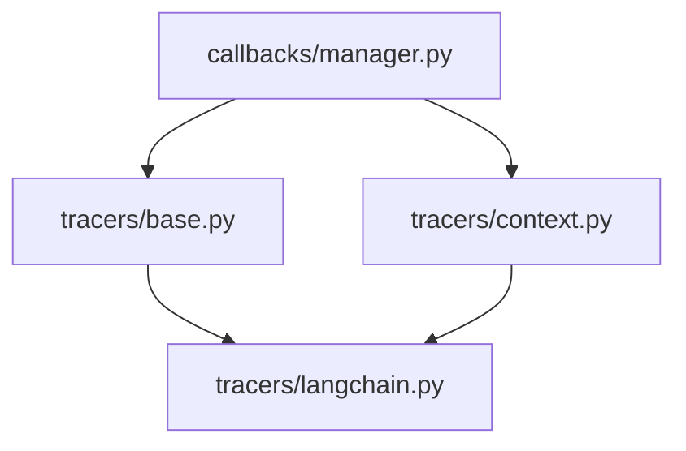

# Callbacks and Monitoring

<cite>
**Referenced Files in This Document**
- [__init__.py](file://libs/core/langchain_core/callbacks/__init__.py)
- [base.py](file://libs/core/langchain_core/callbacks/base.py)
- [manager.py](file://libs/core/langchain_core/callbacks/manager.py)
- [__init__.py](file://libs/core/langchain_core/tracers/__init__.py)
- [base.py](file://libs/core/langchain_core/tracers/base.py)
- [context.py](file://libs/core/langchain_core/tracers/context.py)
- [langchain.py](file://libs/core/langchain_core/tracers/langchain.py)
</cite>

## Table of Contents
1. [Introduction](#introduction)
2. [Project Structure](#project-structure)
3. [Core Components](#core-components)
4. [Architecture Overview](#architecture-overview)
5. [Detailed Component Analysis](#detailed-component-analysis)
6. [Dependency Analysis](#dependency-analysis)
7. [Performance Considerations](#performance-considerations)
8. [Troubleshooting Guide](#troubleshooting-guide)
9. [Conclusion](#conclusion)
10. [Appendices](#appendices)

## Introduction
This document explains LangChain’s callback and monitoring system with a focus on event-driven observation of LLM application execution. It covers the callback architecture, callback manager and event handling mechanisms, integration with LangSmith for observability and debugging, the tracer system for capturing execution traces and performance metrics, and practical guidance for building custom callbacks and integrating with monitoring platforms such as Streamlit, MLflow, Weights & Biases, and others. It also provides best practices for production monitoring, performance tuning, and debugging using callback data.

## Project Structure
The callback and monitoring subsystems are primarily implemented in two packages:
- langchain_core.callbacks: Core callback abstractions, manager, and built-in handlers.
- langchain_core.tracers: Tracer abstractions and LangSmith integration.

Key modules:
- callbacks/__init__.py: Public exports and dynamic imports for callback handlers and managers.
- callbacks/base.py: Base callback handler classes and mixin interfaces for LLM, chain, tool, retriever, and run-level events.
- callbacks/manager.py: Synchronous and asynchronous callback managers, run managers, event dispatching, and context helpers for tracing groups.
- tracers/__init__.py: Public exports for tracers and related utilities.
- tracers/base.py: Base tracer interfaces extending callback handlers and core tracer logic.
- tracers/context.py: Context management for enabling tracing v2, collecting runs, and configuring hooks.
- tracers/langchain.py: LangSmith tracer implementation that persists runs and aggregates usage metadata.

**Diagram sources**
- [__init__.py](file://libs/core/langchain_core/callbacks/__init__.py#L1-L133)
- [base.py](file://libs/core/langchain_core/callbacks/base.py#L1-L1118)
- [manager.py](file://libs/core/langchain_core/callbacks/manager.py#L1-L2688)
- [__init__.py](file://libs/core/langchain_core/tracers/__init__.py#L1-L51)
- [base.py](file://libs/core/langchain_core/tracers/base.py#L1-L919)
- [context.py](file://libs/core/langchain_core/tracers/context.py#L1-L206)
- [langchain.py](file://libs/core/langchain_core/tracers/langchain.py#L1-L378)

**Section sources**
- [__init__.py](file://libs/core/langchain_core/callbacks/__init__.py#L1-L133)
- [__init__.py](file://libs/core/langchain_core/tracers/__init__.py#L1-L51)

## Core Components
- Base callback handler and mixins: Define the contract for observing LLM, chain, tool, retriever, and run-level events. They expose lifecycle hooks such as start/end/error and streaming token events.
- Callback managers: Dispatch events to registered handlers, manage run-scoped tags/metadata, and support both synchronous and asynchronous execution.
- Tracers: Specialized callback handlers that record runs to external systems (notably LangSmith). They extend the base tracer core and implement persistence and URL retrieval.
- LangSmith integration: Context-managed tracing v2, run collection, and a tracer that posts runs and patches updates, including usage metadata aggregation.

Practical outcomes:
- Event-driven observation of LLM application execution.
- Centralized event dispatching with robust error handling and optional inline execution.
- Seamless integration with LangSmith for observability, debugging, and performance insights.

**Section sources**
- [base.py](file://libs/core/langchain_core/callbacks/base.py#L435-L800)
- [manager.py](file://libs/core/langchain_core/callbacks/manager.py#L513-L800)
- [base.py](file://libs/core/langchain_core/tracers/base.py#L33-L530)
- [langchain.py](file://libs/core/langchain_core/tracers/langchain.py#L99-L378)

## Architecture Overview
The system is event-driven. At runtime, runnable components emit events (start, end, error, token, retry, text, custom). Callback managers route these events to registered handlers. Tracers capture and persist runs to LangSmith, aggregating usage metadata and enabling URL retrieval for debugging.

**Diagram sources**
- [manager.py](file://libs/core/langchain_core/callbacks/manager.py#L513-L751)
- [base.py](file://libs/core/langchain_core/callbacks/base.py#L241-L300)
- [base.py](file://libs/core/langchain_core/tracers/base.py#L93-L212)
- [langchain.py](file://libs/core/langchain_core/tracers/langchain.py#L198-L318)

## Detailed Component Analysis

### Callback Abstractions and Mixins
- BaseCallbackHandler and AsyncCallbackHandler define the handler contract.
- LLMManagerMixin, ChainManagerMixin, ToolManagerMixin, RetrieverManagerMixin, and RunManagerMixin provide specialized hooks for each component type.
- Run-level events include on_text and on_retry, plus custom events via on_custom_event.

**Diagram sources**
- [base.py](file://libs/core/langchain_core/callbacks/base.py#L435-L485)
- [base.py](file://libs/core/langchain_core/callbacks/base.py#L61-L236)
- [base.py](file://libs/core/langchain_core/callbacks/base.py#L238-L485)

**Section sources**
- [base.py](file://libs/core/langchain_core/callbacks/base.py#L435-L800)

### Callback Manager and Event Dispatch
- Synchronous and asynchronous managers encapsulate handler lists and inheritable tags/metadata.
- Event dispatch supports both synchronous and asynchronous handlers, with safeguards against deadlocks and graceful error handling.
- Context helpers enable grouping multiple calls under a single trace and injecting tracing callbacks.

**Diagram sources**
- [manager.py](file://libs/core/langchain_core/callbacks/manager.py#L256-L366)
- [manager.py](file://libs/core/langchain_core/callbacks/manager.py#L420-L454)

**Section sources**
- [manager.py](file://libs/core/langchain_core/callbacks/manager.py#L513-L800)
- [manager.py](file://libs/core/langchain_core/callbacks/manager.py#L256-L454)

### Tracer System and LangSmith Integration
- BaseTracer extends the tracer core and BaseCallbackHandler to intercept and record runs.
- LangChainTracer persists runs to LangSmith, aggregates usage metadata from generations, and exposes a URL retrieval method for debugging.
- Context utilities enable tracing v2, run collection, and environment-aware configuration.

**Diagram sources**
- [context.py](file://libs/core/langchain_core/tracers/context.py#L39-L83)
- [base.py](file://libs/core/langchain_core/tracers/base.py#L33-L133)
- [langchain.py](file://libs/core/langchain_core/tracers/langchain.py#L198-L318)

**Section sources**
- [base.py](file://libs/core/langchain_core/tracers/base.py#L33-L530)
- [langchain.py](file://libs/core/langchain_core/tracers/langchain.py#L99-L378)
- [context.py](file://libs/core/langchain_core/tracers/context.py#L39-L159)

### Practical Examples and Patterns
- Implementing a custom callback handler:
  - Extend BaseCallbackHandler or AsyncCallbackHandler.
  - Override desired lifecycle hooks (e.g., on_llm_start, on_llm_end, on_chain_error).
  - Use raise_error to propagate exceptions or ignore_* flags to filter events.
  - Reference: [base.py](file://libs/core/langchain_core/callbacks/base.py#L435-L800)

- Setting up tracing with LangSmith:
  - Enable tracing v2 in a context manager and use get_run_url for debugging.
  - Reference: [context.py](file://libs/core/langchain_core/tracers/context.py#L39-L83), [langchain.py](file://libs/core/langchain_core/tracers/langchain.py#L208-L234)

- Grouping runs under a single trace:
  - Use trace_as_chain_group or atrace_as_chain_group to create a parent run and attach child runs.
  - Reference: [manager.py](file://libs/core/langchain_core/callbacks/manager.py#L63-L137), [manager.py](file://libs/core/langchain_core/callbacks/manager.py#L139-L216)

- Capturing and analyzing execution traces:
  - Use collect_runs to gather runs in-context for inspection.
  - Reference: [context.py](file://libs/core/langchain_core/tracers/context.py#L85-L103)

**Section sources**
- [base.py](file://libs/core/langchain_core/callbacks/base.py#L435-L800)
- [context.py](file://libs/core/langchain_core/tracers/context.py#L39-L103)
- [manager.py](file://libs/core/langchain_core/callbacks/manager.py#L63-L216)
- [langchain.py](file://libs/core/langchain_core/tracers/langchain.py#L208-L234)

## Dependency Analysis
- Callbacks depend on tracers for LangSmith integration via context utilities and tracer injection.
- Managers coordinate event dispatch and run scoping, delegating persistence to tracers.
- Tracers depend on LangSmith client utilities for posting and patching runs and for URL retrieval.

**Diagram sources**
- [manager.py](file://libs/core/langchain_core/callbacks/manager.py#L1-L100)
- [context.py](file://libs/core/langchain_core/tracers/context.py#L1-L50)
- [base.py](file://libs/core/langchain_core/tracers/base.py#L1-L60)
- [langchain.py](file://libs/core/langchain_core/tracers/langchain.py#L1-L40)

**Section sources**
- [manager.py](file://libs/core/langchain_core/callbacks/manager.py#L1-L100)
- [context.py](file://libs/core/langchain_core/tracers/context.py#L1-L50)
- [base.py](file://libs/core/langchain_core/tracers/base.py#L1-L60)
- [langchain.py](file://libs/core/langchain_core/tracers/langchain.py#L1-L40)

## Performance Considerations
- Inline vs. threaded execution:
  - run_inline handlers execute synchronously in the calling context.
  - Non-inline handlers are executed in threads or via the event loop to avoid blocking.
- Deadlock prevention:
  - Queued coroutines are executed in a dedicated thread pool when a loop is running to prevent deadlocks.
- Retry and error handling:
  - Exceptions in handlers are logged and optionally re-raised based on raise_error.
- Memory and throughput:
  - LangChainTracer defers posting for runs with deferred inputs and aggregates usage metadata to minimize payload sizes.

Best practices:
- Prefer non-blocking handlers for production workloads.
- Use raise_error judiciously; in high-throughput scenarios, swallowable errors improve resilience.
- Limit expensive operations inside on_llm_new_token and on_text for streaming scenarios.

**Section sources**
- [manager.py](file://libs/core/langchain_core/callbacks/manager.py#L256-L454)
- [langchain.py](file://libs/core/langchain_core/tracers/langchain.py#L198-L318)

## Troubleshooting Guide
- Debugging with LangSmith:
  - Use tracing_v2_enabled to capture runs and get_run_url to retrieve the run URL for inspection.
  - Reference: [context.py](file://libs/core/langchain_core/tracers/context.py#L39-L83), [langchain.py](file://libs/core/langchain_core/tracers/langchain.py#L208-L234)
- Inspecting runs in-context:
  - Use collect_runs to gather runs and inspect traced_runs after execution.
  - Reference: [context.py](file://libs/core/langchain_core/tracers/context.py#L85-L103)
- Handling missing on_chat_model_start:
  - If a handler lacks on_chat_model_start, the manager falls back to on_llm_start with stringified messages.
  - Reference: [manager.py](file://libs/core/langchain_core/callbacks/manager.py#L286-L300)
- Diagnosing callback errors:
  - Errors are logged with warnings; enable logging to capture handler exceptions.
  - Reference: [manager.py](file://libs/core/langchain_core/callbacks/manager.py#L307-L316)

**Section sources**
- [context.py](file://libs/core/langchain_core/tracers/context.py#L39-L103)
- [langchain.py](file://libs/core/langchain_core/tracers/langchain.py#L208-L234)
- [manager.py](file://libs/core/langchain_core/callbacks/manager.py#L286-L316)

## Conclusion
LangChain’s callback and monitoring system provides a robust, event-driven framework for observing and controlling LLM application execution. With flexible handler abstractions, efficient event dispatching, and seamless LangSmith integration, teams can build observability pipelines, debug issues quickly, and optimize performance. By following best practices—such as careful handler design, appropriate error propagation, and mindful use of inline execution—organizations can achieve reliable, production-grade monitoring.

## Appendices
- Monitoring platform integrations:
  - LangChain Classic includes numerous callback handlers for external platforms (e.g., MLflow, Weights & Biases, Streamlit). These live in the classic package and can be integrated alongside core callbacks by registering them in a CallbackManager.
  - Reference: [__init__.py](file://libs/core/langchain_core/callbacks/__init__.py#L49-L84)