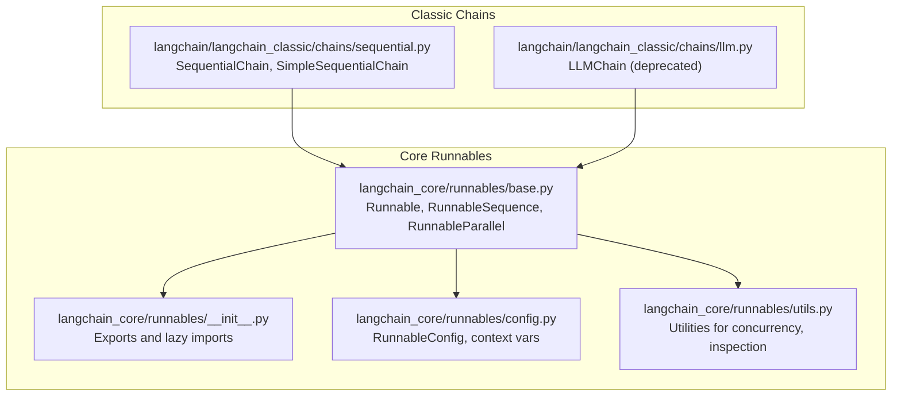
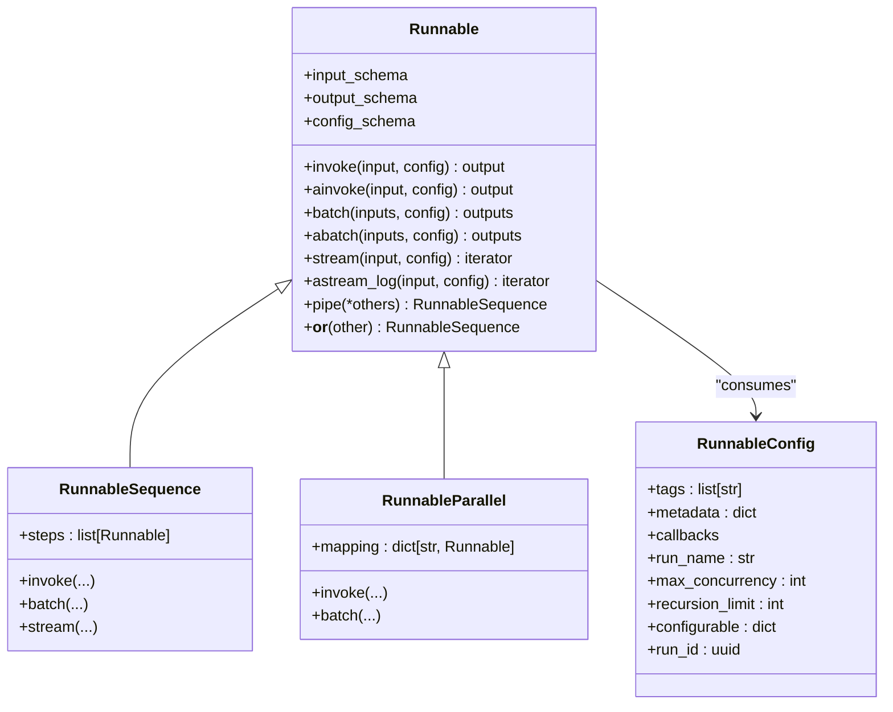
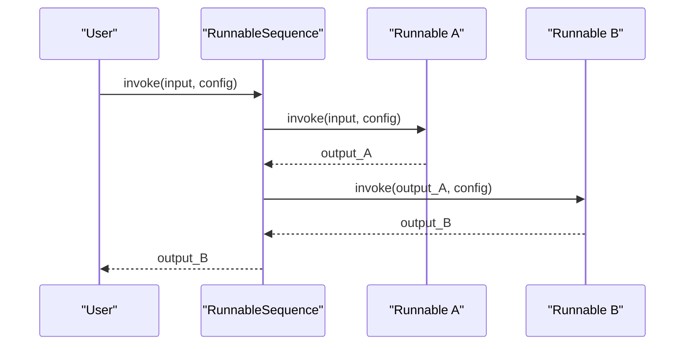
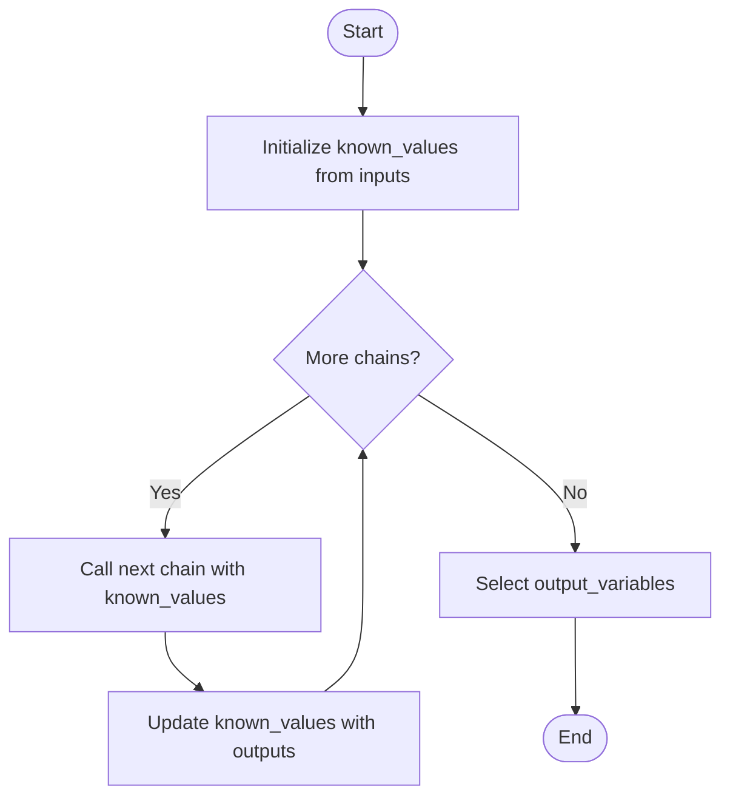
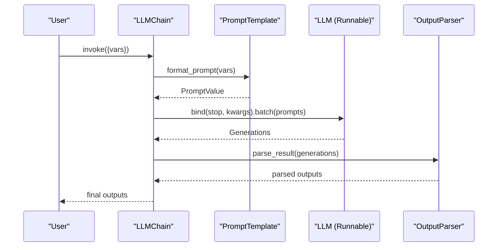
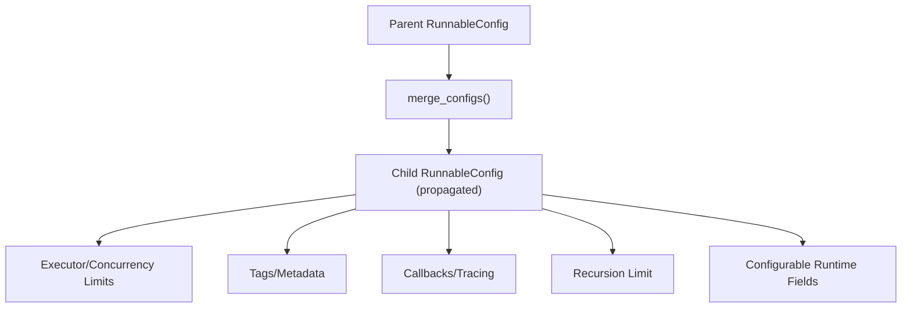
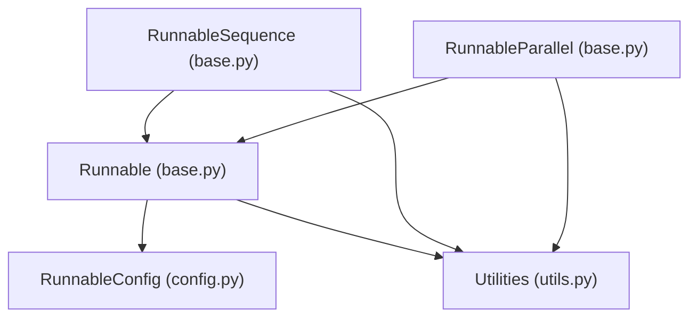

# Chain Fundamentals

<cite>
**Referenced Files in This Document**
- [base.py](file://libs/core/langchain_core/runnables/base.py)
- [__init__.py](file://libs/core/langchain_core/runnables/__init__.py)
- [config.py](file://libs/core/langchain_core/runnables/config.py)
- [utils.py](file://libs/core/langchain_core/runnables/utils.py)
- [sequential.py](file://libs/langchain/langchain_classic/chains/sequential.py)
- [llm.py](file://libs/langchain/langchain_classic/chains/llm.py)
</cite>

## Table of Contents
1. [Introduction](#introduction)
2. [Project Structure](#project-structure)
3. [Core Components](#core-components)
4. [Architecture Overview](#architecture-overview)
5. [Detailed Component Analysis](#detailed-component-analysis)
6. [Dependency Analysis](#dependency-analysis)
7. [Performance Considerations](#performance-considerations)
8. [Troubleshooting Guide](#troubleshooting-guide)
9. [Conclusion](#conclusion)

## Introduction
This document explains chain fundamentals in LangChain with a focus on the core Runnable abstraction and LCEL (LangChain Expression Language). Chains are sequences of operations that transform input through multiple steps, enabling declarative composition of LLM-powered workflows. While the modern LCEL primitives (RunnableSequence, RunnableParallel, etc.) supersede older chain abstractions, understanding both is essential for building robust, scalable applications.

## Project Structure
This documentation focuses on the core Runnable system and classic chain implementations:
- Core Runnable primitives and LCEL are defined under langchain_core/runnables.
- Classic chain implementations (sequential chains and LLMChain) live under langchain/langchain_classic/chains.

**Diagram sources**
- [base.py](file://libs/core/langchain_core/runnables/base.py#L124-L256)
- [__init__.py](file://libs/core/langchain_core/runnables/__init__.py#L1-L137)
- [config.py](file://libs/core/langchain_core/runnables/config.py#L51-L148)
- [utils.py](file://libs/core/langchain_core/runnables/utils.py#L44-L200)
- [sequential.py](file://libs/langchain/langchain_classic/chains/sequential.py#L16-L209)
- [llm.py](file://libs/langchain/langchain_classic/chains/llm.py#L45-L433)

**Section sources**
- [base.py](file://libs/core/langchain_core/runnables/base.py#L124-L256)
- [__init__.py](file://libs/core/langchain_core/runnables/__init__.py#L1-L137)

## Core Components
- Runnable: The foundational interface for all LCEL primitives. It defines synchronous/asynchronous invocation, batching, streaming, and composition operators. It also exposes input/output/config schemas and integrates with tracing and callbacks.
- RunnableSequence: A left-to-right composition of runnables where the output of one becomes the input of the next.
- RunnableParallel: Concurrent execution of multiple runnables on the same input.
- RunnableConfig: A shared configuration dictionary propagated across nested runnables, carrying tags, metadata, callbacks, run names, concurrency limits, recursion limits, and configurable runtime fields.
- Utilities: Concurrency helpers, schema inference, and introspection utilities.

Key responsibilities:
- Input/Output handling: Runnable exposes input_schema, output_schema, and config_schema for validation and documentation.
- Execution patterns: invoke/ainvoke, batch/abatch, stream/astream, astream_log.
- Composition: The | operator and pipe() create RunnableSequence; dict literals inside sequences create RunnableParallel.
- Configuration management: RunnableConfig supports merging, propagation, and context-aware execution.

Practical examples (paths only):
- Basic sequence construction and piping: [RunnableSequence usage](file://libs/core/langchain_core/runnables/base.py#L171-L188)
- Method chaining and composition: [pipe() and __or__](file://libs/core/langchain_core/runnables/base.py#L660-L707)
- Parameter binding and configurable fields: [config_schema and configurable runtime fields](file://libs/core/langchain_core/runnables/base.py#L525-L582)
- Schema inference and validation: [get_input_schema/get_output_schema](file://libs/core/langchain_core/runnables/base.py#L370-L518)

**Section sources**
- [base.py](file://libs/core/langchain_core/runnables/base.py#L124-L256)
- [base.py](file://libs/core/langchain_core/runnables/base.py#L618-L707)
- [base.py](file://libs/core/langchain_core/runnables/base.py#L370-L518)
- [base.py](file://libs/core/langchain_core/runnables/base.py#L525-L582)
- [config.py](file://libs/core/langchain_core/runnables/config.py#L51-L148)
- [utils.py](file://libs/core/langchain_core/runnables/utils.py#L44-L200)

## Architecture Overview
Runnable forms the backbone of LCEL. Chains built with RunnableSequence and RunnableParallel inherit sync, async, batch, and streaming support automatically. RunnableConfig enables cross-cutting concerns like tracing, tagging, and concurrency control.

**Diagram sources**
- [base.py](file://libs/core/langchain_core/runnables/base.py#L124-L256)
- [base.py](file://libs/core/langchain_core/runnables/base.py#L618-L707)
- [config.py](file://libs/core/langchain_core/runnables/config.py#L51-L148)

## Detailed Component Analysis

### Runnable and LCEL Composition
Runnable defines the contract and composition primitives:
- Sequential composition via | and pipe().
- Parallel composition via dict literals inside sequences.
- Schemas for input, output, and config.
- Streaming and logging support.

**Diagram sources**
- [base.py](file://libs/core/langchain_core/runnables/base.py#L171-L188)
- [base.py](file://libs/core/langchain_core/runnables/base.py#L618-L707)

**Section sources**
- [base.py](file://libs/core/langchain_core/runnables/base.py#L124-L256)
- [base.py](file://libs/core/langchain_core/runnables/base.py#L618-L707)

### Sequential Chain (Classic)
Classic sequential chains process outputs from one step into the next. They enforce input/output variable consistency and optionally return all intermediate results.

**Diagram sources**
- [sequential.py](file://libs/langchain/langchain_classic/chains/sequential.py#L92-L120)
- [sequential.py](file://libs/langchain/langchain_classic/chains/sequential.py#L164-L185)

**Section sources**
- [sequential.py](file://libs/langchain/langchain_classic/chains/sequential.py#L16-L91)
- [sequential.py](file://libs/langchain/langchain_classic/chains/sequential.py#L92-L120)
- [sequential.py](file://libs/langchain/langchain_classic/chains/sequential.py#L123-L162)
- [sequential.py](file://libs/langchain/langchain_classic/chains/sequential.py#L164-L209)

### LLMChain (Classic) and Relationship to Runnable
LLMChain is a deprecated classic chain that formats prompts and calls an LLM. Modern equivalents use RunnableSequence with prompt, LLM, and output parser.

**Diagram sources**
- [llm.py](file://libs/langchain/langchain_classic/chains/llm.py#L120-L172)
- [llm.py](file://libs/langchain/langchain_classic/chains/llm.py#L224-L272)

**Section sources**
- [llm.py](file://libs/langchain/langchain_classic/chains/llm.py#L45-L98)
- [llm.py](file://libs/langchain/langchain_classic/chains/llm.py#L120-L172)
- [llm.py](file://libs/langchain/langchain_classic/chains/llm.py#L224-L272)

### Configuration Management
RunnableConfig carries execution context across nested runnables. It supports merging, propagation via context variables, and runtime configurability.

**Diagram sources**
- [config.py](file://libs/core/langchain_core/runnables/config.py#L51-L148)
- [base.py](file://libs/core/langchain_core/runnables/base.py#L525-L582)

**Section sources**
- [config.py](file://libs/core/langchain_core/runnables/config.py#L51-L148)
- [base.py](file://libs/core/langchain_core/runnables/base.py#L525-L582)

## Dependency Analysis
Runnable composes other runnables and relies on configuration utilities and schema inference.

**Diagram sources**
- [base.py](file://libs/core/langchain_core/runnables/base.py#L124-L256)
- [config.py](file://libs/core/langchain_core/runnables/config.py#L51-L148)
- [utils.py](file://libs/core/langchain_core/runnables/utils.py#L44-L200)

**Section sources**
- [base.py](file://libs/core/langchain_core/runnables/base.py#L124-L256)
- [config.py](file://libs/core/langchain_core/runnables/config.py#L51-L148)
- [utils.py](file://libs/core/langchain_core/runnables/utils.py#L44-L200)

## Performance Considerations
- Batch execution: Runnable’s default batch implementation runs invoke in parallel using a thread pool executor. Override for specialized batching.
- Concurrency control: Use max_concurrency in RunnableConfig to cap parallelism.
- Streaming: Prefer streaming for responsive UX and incremental feedback.
- Retries and fallbacks: Compose runnables with retry policies and fallbacks for resilience.
- Schema inference: Accurate schemas improve validation and reduce runtime errors.

[No sources needed since this section provides general guidance]

## Troubleshooting Guide
- Debugging: Enable global debug mode or pass callbacks to inspect intermediate results.
- Tracing: Use tracing integrations to observe run logs and events.
- Validation: Leverage input_schema and output_schema to catch malformed inputs/outputs early.
- Error handling: Wrap chains with fallbacks and retries; propagate errors with proper callbacks.

**Section sources**
- [base.py](file://libs/core/langchain_core/runnables/base.py#L232-L254)
- [base.py](file://libs/core/langchain_core/runnables/base.py#L370-L518)

## Conclusion
Chains in LangChain are best understood through the LCEL Runnable abstraction. RunnableSequence and RunnableParallel provide declarative, composable workflows with built-in support for sync, async, batch, and streaming. Classic chains like SequentialChain and LLMChain illustrate earlier patterns; modern designs favor Runnable-based expressions. Effective configuration management, schema validation, and observability are key to building reliable, maintainable chains.