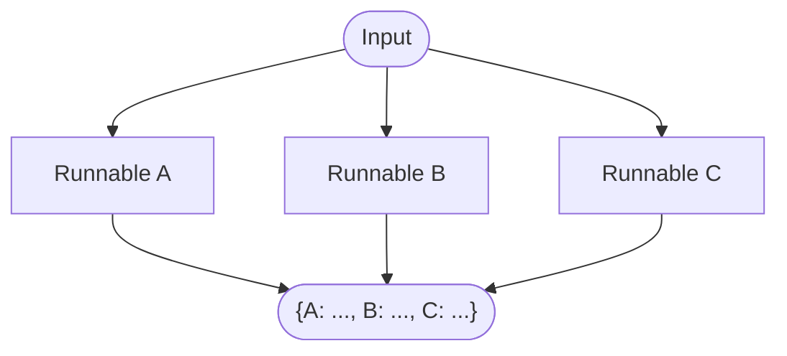

# Chains and Workflows

<cite>
**Referenced Files in This Document**
- [runnables/__init__.py](file://libs/core/langchain_core/runnables/__init__.py)
- [base.py](file://libs/core/langchain_core/runnables/base.py)
- [config.py](file://libs/core/langchain_core/runnables/config.py)
- [graph.py](file://libs/core/langchain_core/runnables/graph.py)
- [chains/__init__.py](file://libs/langchain/langchain_classic/chains/__init__.py)
- [chains/base.py](file://libs/langchain/langchain_classic/chains/base.py)
- [sequential.py](file://libs/langchain/langchain_classic/chains/sequential.py)
- [retrieval_qa/base.py](file://libs/langchain/langchain_classic/chains/retrieval_qa/base.py)
- [conversation/base.py](file://libs/langchain/langchain_classic/chains/conversation/base.py)
- [flare/base.py](file://libs/langchain/langchain_classic/chains/flare/base.py)
- [memory/buffer.py](file://libs/langchain/langchain_classic/memory/buffer.py)
- [memory/summary.py](file://libs/langchain/langchain_classic/memory/summary.py)
- [memory/vectorstore_token_buffer_memory.py](file://libs/langchain/langchain_classic/memory/vectorstore_token_buffer_memory.py)
</cite>

## Table of Contents
1. [Introduction](#introduction)
2. [Project Structure](#project-structure)
3. [Core Components](#core-components)
4. [Architecture Overview](#architecture-overview)
5. [Detailed Component Analysis](#detailed-component-analysis)
6. [Dependency Analysis](#dependency-analysis)
7. [Performance Considerations](#performance-considerations)
8. [Troubleshooting Guide](#troubleshooting-guide)
9. [Conclusion](#conclusion)
10. [Appendices](#appendices)

## Introduction
This document explains LangChain’s chain and workflow system with a focus on the LangChain Expression Language (LCEL). Chains are sequences of operations that transform inputs through multiple steps, often combining language models, retrievers, prompts, and output parsers. LCEL provides a unified, composable interface supporting synchronous, asynchronous, batch, and streaming execution. It enables building robust, production-grade workflows that are observable, configurable, and easy to debug.

## Project Structure
LangChain organizes chain logic across two layers:
- Core LCEL primitives and utilities live in langchain_core, providing the Runnable abstraction, composition operators, configuration, and graph visualization.
- Classic chain implementations live in langchain_classic, offering higher-level chain types such as RetrievalQA, Conversational chains, Sequential chains, and specialized chains like FLARE.


**Diagram sources**
- [runnables/__init__.py](file://libs/core/langchain_core/runnables/__init__.py#L1-L137)
- [config.py](file://libs/core/langchain_core/runnables/config.py#L1-L633)
- [graph.py](file://libs/core/langchain_core/runnables/graph.py#L1-L740)
- [chains/__init__.py](file://libs/langchain/langchain_classic/chains/__init__.py#L1-L97)
- [chains/base.py](file://libs/langchain/langchain_classic/chains/base.py#L1-L807)
- [sequential.py](file://libs/langchain/langchain_classic/chains/sequential.py#L1-L209)
- [retrieval_qa/base.py](file://libs/langchain/langchain_classic/chains/retrieval_qa/base.py#L1-L369)
- [conversation/base.py](file://libs/langchain/langchain_classic/chains/conversation/base.py#L1-L150)
- [flare/base.py](file://libs/langchain/langchain_classic/chains/flare/base.py#L103-L133)

**Section sources**
- [runnables/__init__.py](file://libs/core/langchain_core/runnables/__init__.py#L1-L137)
- [chains/__init__.py](file://libs/langchain/langchain_classic/chains/__init__.py#L1-L97)

## Core Components
- Runnable: The foundational unit that supports invoke/ainvoke, batch/abatch, stream/astream, and astream_log. It exposes input_schema, output_schema, and config_schema for introspection and validation.
- RunnableSequence: Composes Runnables sequentially with the | operator; supports streaming and batching.
- RunnableParallel: Runs multiple Runnables concurrently on the same input; useful for branching and fan-out.
- RunnableConfig: Centralized configuration for callbacks, tags, metadata, run names, concurrency limits, recursion limits, and configurable runtime fields.
- Graph visualization: Tools to render chain graphs as JSON, ASCII, PNG, or Mermaid for debugging and documentation.

Key capabilities:
- Sequential processing via RunnableSequence
- Parallel execution via RunnableParallel
- Streaming outputs and events
- Batch execution with optimized concurrency
- Rich observability and tracing

**Section sources**
- [base.py](file://libs/core/langchain_core/runnables/base.py#L124-L256)
- [base.py](file://libs/core/langchain_core/runnables/base.py#L2813-L3618)
- [config.py](file://libs/core/langchain_core/runnables/config.py#L51-L123)
- [graph.py](file://libs/core/langchain_core/runnables/graph.py#L252-L300)

## Architecture Overview
The LCEL architecture centers on Runnable composition. Chains are thin wrappers around Runnables, enabling:
- Declarative composition with | and {}
- Automatic support for sync, async, batch, and streaming
- Observability via callbacks and tracing
- Configurable behavior via RunnableConfig and configurable fields

```mermaid
sequenceDiagram
participant Client as "Client"
participant Seq as "RunnableSequence"
participant Par as "RunnableParallel"
participant LLM as "Runnable (LLM)"
participant Ret as "Runnable (Retriever)"
Client->>Seq : invoke(input)
Seq->>Ret : invoke(query)
Ret-->>Seq : docs
Seq->>Par : pass docs and query
Par->>LLM : invoke(prompt+docs)
LLM-->>Par : answer
Par-->>Seq : {"answer" : ...}
Seq-->>Client : final output
```

**Diagram sources**
- [base.py](file://libs/core/langchain_core/runnables/base.py#L2813-L3618)
- [retrieval_qa/base.py](file://libs/langchain/langchain_classic/chains/retrieval_qa/base.py#L266-L290)

**Section sources**
- [base.py](file://libs/core/langchain_core/runnables/base.py#L124-L256)
- [base.py](file://libs/core/langchain_core/runnables/base.py#L2813-L3618)

## Detailed Component Analysis

### Sequential Processing Patterns
Sequential chains process inputs through a linear pipeline. The classic SequentialChain enforces non-overlapping input/output keys across chained components, while SimpleSequentialChain simplifies single-input/single-output chains with optional output stripping and verbose logging.


**Diagram sources**
- [sequential.py](file://libs/langchain/langchain_classic/chains/sequential.py#L123-L209)

**Section sources**
- [sequential.py](file://libs/langchain/langchain_classic/chains/sequential.py#L16-L121)
- [sequential.py](file://libs/langchain/langchain_classic/chains/sequential.py#L123-L209)

### Parallel Execution Capabilities
RunnableParallel executes multiple Runnables concurrently on the same input, aggregating their outputs into a single dictionary. This pattern is ideal for multi-modal processing, multi-source retrieval, or multi-path transformations.



**Diagram sources**
- [base.py](file://libs/core/langchain_core/runnables/base.py#L3570-L3618)

**Section sources**
- [base.py](file://libs/core/langchain_core/runnables/base.py#L3570-L3618)

### Retrieval-Augmented Generation (RAG) and RetrievalQA
RetrievalQA chains retrieve relevant documents and combine them with a language model to answer queries. The classic BaseRetrievalQA orchestrates a combine_documents_chain with a retriever. Modern RAG is typically built using create_retrieval_chain with a retriever and a documents-processing chain.


**Diagram sources**
- [retrieval_qa/base.py](file://libs/langchain/langchain_classic/chains/retrieval_qa/base.py#L129-L206)

**Section sources**
- [retrieval_qa/base.py](file://libs/langchain/langchain_classic/chains/retrieval_qa/base.py#L40-L118)
- [retrieval_qa/base.py](file://libs/langchain/langchain_classic/chains/retrieval_qa/base.py#L218-L290)

### Conversational Chains
ConversationChain integrates memory with an LLM to maintain context across turns. While the class is deprecated in favor of RunnableWithMessageHistory, it demonstrates how memory buffers and prompts collaborate to produce contextual responses.


**Diagram sources**
- [conversation/base.py](file://libs/langchain/langchain_classic/chains/conversation/base.py#L19-L150)
- [memory/buffer.py](file://libs/langchain/langchain_classic/memory/buffer.py#L84-L140)

**Section sources**
- [conversation/base.py](file://libs/langchain/langchain_classic/chains/conversation/base.py#L19-L150)
- [memory/buffer.py](file://libs/langchain/langchain_classic/memory/buffer.py#L84-L140)
- [memory/summary.py](file://libs/langchain/langchain_classic/memory/summary.py#L157-L168)
- [memory/vectorstore_token_buffer_memory.py](file://libs/langchain/langchain_classic/memory/vectorstore_token_buffer_memory.py#L145-L166)

### Specialized Chains: FLARE
FLARE (Active Retrieval Augmented Generation) iteratively identifies low-confidence spans and expands retrieval until a confident answer is produced. It encapsulates question generation, retrieval, and response generation in a configurable loop.


**Diagram sources**
- [flare/base.py](file://libs/langchain/langchain_classic/chains/flare/base.py#L103-L133)

**Section sources**
- [flare/base.py](file://libs/langchain/langchain_classic/chains/flare/base.py#L103-L133)

### Chain Composition Techniques and LCEL
LCEL enables building complex workflows by composing Runnables with | (sequence) and {} (parallel). RunnableSequence batches and streams efficiently, while RunnableParallel fans out workloads. Both preserve streaming semantics and integrate with tracing and callbacks.


**Diagram sources**
- [base.py](file://libs/core/langchain_core/runnables/base.py#L124-L256)
- [base.py](file://libs/core/langchain_core/runnables/base.py#L2813-L3618)

**Section sources**
- [base.py](file://libs/core/langchain_core/runnables/base.py#L124-L256)
- [base.py](file://libs/core/langchain_core/runnables/base.py#L2813-L3618)

### Practical Examples and Patterns
- Building a chain: Combine a prompt, an LLM, and an output parser using RunnableSequence.
- Parameter binding: Use RunnableConfig to set tags, metadata, callbacks, and configurable runtime fields.
- Parallel branches: Use RunnableParallel to run multiple transformations concurrently.
- Streaming: Use stream or astream to emit incremental results as they are produced.
- Graph visualization: Use get_graph to export a JSON or Mermaid representation of the chain for debugging.

**Section sources**
- [base.py](file://libs/core/langchain_core/runnables/base.py#L584-L603)
- [graph.py](file://libs/core/langchain_core/runnables/graph.py#L252-L300)
- [config.py](file://libs/core/langchain_core/runnables/config.py#L51-L123)

## Dependency Analysis
The chain ecosystem exhibits clear separation of concerns:
- langchain_core provides the Runnable contract, composition operators, configuration, and graph utilities.
- langchain_classic builds upon core Runnables to offer classic chain types and memory integrations.


**Diagram sources**
- [chains/base.py](file://libs/langchain/langchain_classic/chains/base.py#L52-L106)
- [sequential.py](file://libs/langchain/langchain_classic/chains/sequential.py#L16-L27)
- [retrieval_qa/base.py](file://libs/langchain/langchain_classic/chains/retrieval_qa/base.py#L40-L54)
- [conversation/base.py](file://libs/langchain/langchain_classic/chains/conversation/base.py#L19-L24)
- [flare/base.py](file://libs/langchain/langchain_classic/chains/flare/base.py#L103-L113)
- [memory/buffer.py](file://libs/langchain/langchain_classic/memory/buffer.py#L84-L140)
- [memory/summary.py](file://libs/langchain/langchain_classic/memory/summary.py#L157-L168)
- [memory/vectorstore_token_buffer_memory.py](file://libs/langchain/langchain_classic/memory/vectorstore_token_buffer_memory.py#L145-L166)

**Section sources**
- [chains/base.py](file://libs/langchain/langchain_classic/chains/base.py#L52-L106)
- [chains/__init__.py](file://libs/langchain/langchain_classic/chains/__init__.py#L18-L97)

## Performance Considerations
- Prefer RunnableSequence and RunnableParallel for efficient batching and streaming.
- Tune max_concurrency in RunnableConfig to balance throughput and resource usage.
- Use streaming for responsive UX and early feedback.
- Leverage graph visualization to identify bottlenecks and redundant steps.
- For memory-heavy conversations, consider token-aware memory to avoid context overflow.

[No sources needed since this section provides general guidance]

## Troubleshooting Guide
- Enable tracing and callbacks to observe intermediate steps and errors.
- Use get_graph to visualize the chain and confirm expected inputs/outputs.
- Validate schemas via input_schema and output_schema to catch mismatches early.
- Inspect RunnableConfig for tags, metadata, and callbacks to diagnose runtime behavior.
- For async chains, ensure proper run_manager propagation and error handling.

**Section sources**
- [base.py](file://libs/core/langchain_core/runnables/base.py#L232-L255)
- [base.py](file://libs/core/langchain_core/runnables/base.py#L584-L603)
- [config.py](file://libs/core/langchain_core/runnables/config.py#L51-L123)

## Conclusion
LangChain’s chain and workflow system is built on LCEL’s compositional primitives. RunnableSequence and RunnableParallel enable robust, scalable pipelines with streaming and batching support. Classic chains in langchain_classic demonstrate real-world patterns like RAG, conversation, and iterative retrieval. By leveraging configuration, tracing, and graph visualization, teams can build, debug, and monitor production-grade workflows effectively.

[No sources needed since this section summarizes without analyzing specific files]

## Appendices

### When to Use Which Chain Type
- Basic chains: Use when you need a simple prompt → LLM → parser pipeline.
- Question answering chains: Use when you have a retriever and want to combine retrieved context with an LLM.
- Conversational chains: Use when maintaining dialogue history is essential; prefer RunnableWithMessageHistory for modern deployments.
- Summarization chains: Use when processing long documents via map-reduce, refine, or stuffing strategies.
- Retrieval chains: Use modern create_retrieval_chain with a retriever and a documents-processing chain for RAG.

**Section sources**
- [retrieval_qa/base.py](file://libs/langchain/langchain_classic/chains/retrieval_qa/base.py#L40-L118)
- [conversation/base.py](file://libs/langchain/langchain_classic/chains/conversation/base.py#L19-L150)
- [sequential.py](file://libs/langchain/langchain_classic/chains/sequential.py#L16-L121)
- [flare/base.py](file://libs/langchain/langchain_classic/chains/flare/base.py#L103-L133)

### Customization Tips
- Bind parameters at runtime using configurable fields and RunnableConfig.
- Wrap components with retry, caching, or fallbacks to improve resilience.
- Instrument chains with callbacks and tags for observability.
- Visualize and refactor complex chains using graph exports.

**Section sources**
- [config.py](file://libs/core/langchain_core/runnables/config.py#L51-L123)
- [graph.py](file://libs/core/langchain_core/runnables/graph.py#L252-L300)