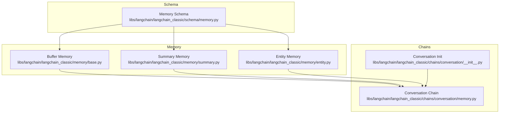
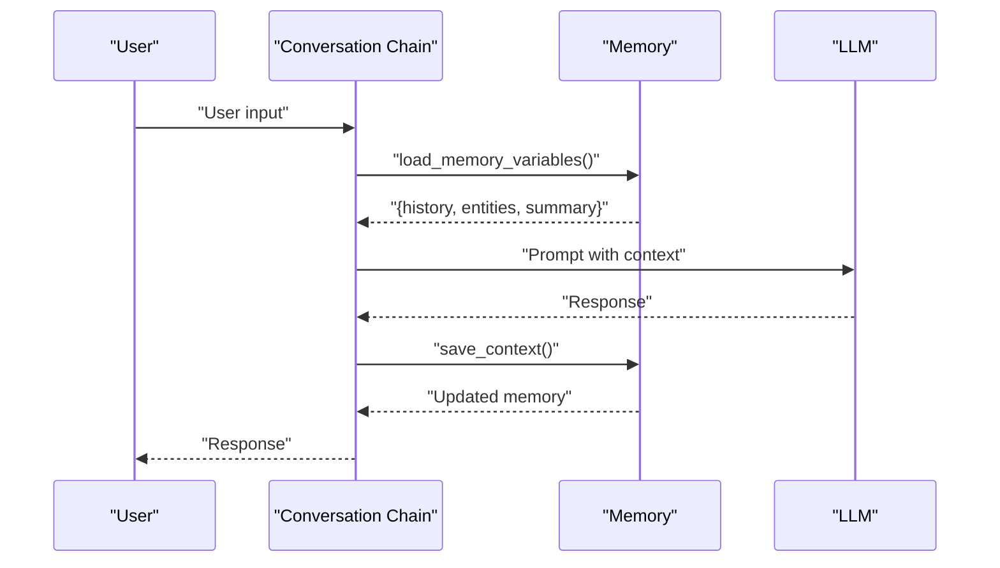
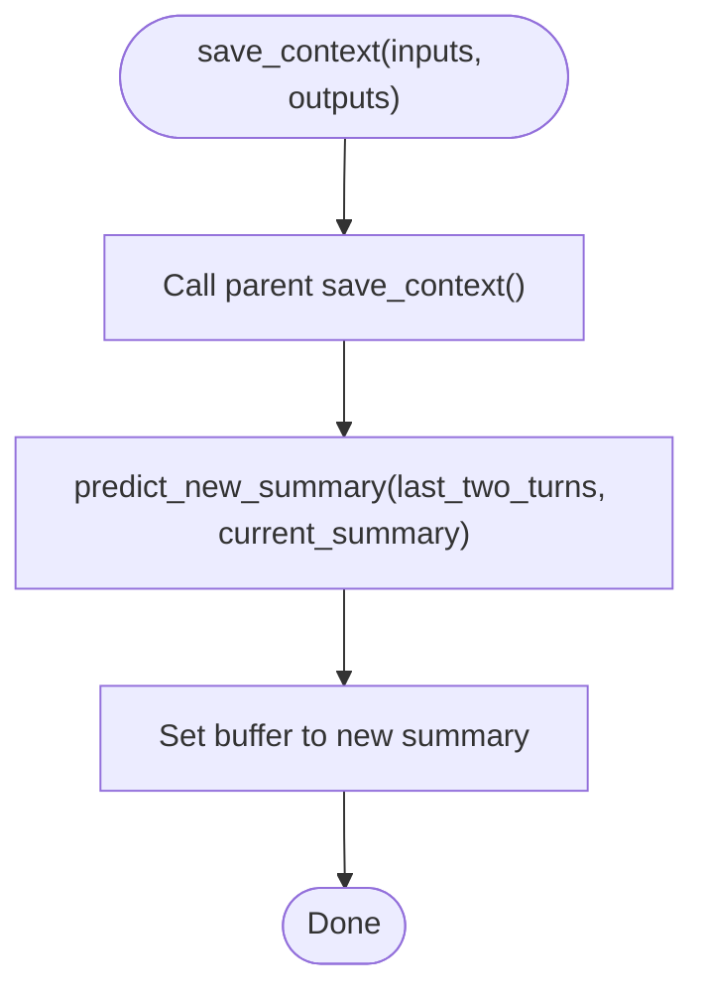
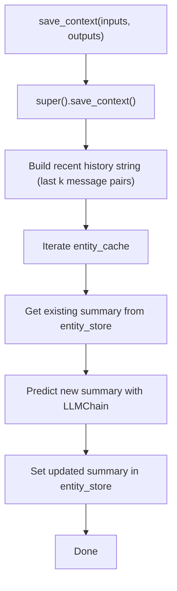
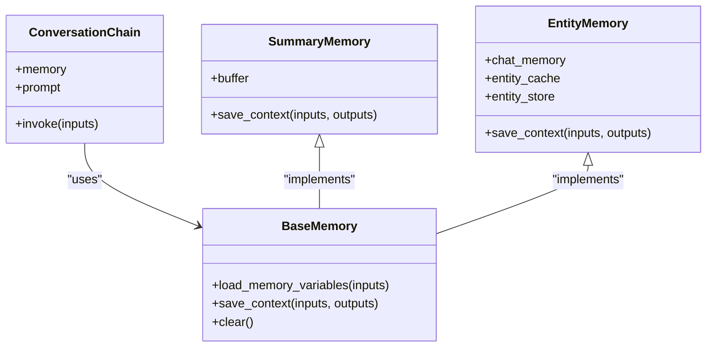
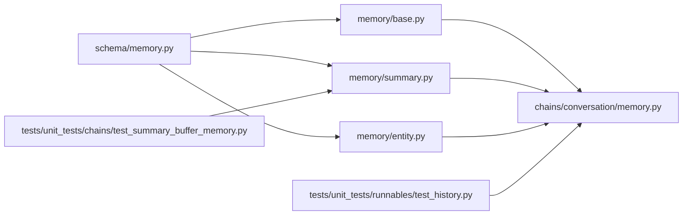

# Conversation Chains

<cite>
**Referenced Files in This Document**
- [memory/entity.py](file://libs/langchain/langchain_classic/memory/entity.py)
- [memory/summary.py](file://libs/langchain/langchain_classic/memory/summary.py)
- [chains/conversation/memory.py](file://libs/langchain/langchain_classic/chains/conversation/memory.py)
- [schema/memory.py](file://libs/langchain/langchain_classic/schema/memory.py)
- [chains/conversation/__init__.py](file://libs/langchain/langchain_classic/chains/conversation/__init__.py)
- [tests/unit_tests/chains/test_summary_buffer_memory.py](file://libs/langchain/tests/unit_tests/chains/test_summary_buffer_memory.py)
- [tests/unit_tests/runnables/test_history.py](file://libs/core/tests/unit_tests/runnables/test_history.py)
</cite>

## Table of Contents
1. [Introduction](#introduction)
2. [Project Structure](#project-structure)
3. [Core Components](#core-components)
4. [Architecture Overview](#architecture-overview)
5. [Detailed Component Analysis](#detailed-component-analysis)
6. [Dependency Analysis](#dependency-analysis)
7. [Performance Considerations](#performance-considerations)
8. [Troubleshooting Guide](#troubleshooting-guide)
9. [Conclusion](#conclusion)
10. [Appendices](#appendices)

## Introduction
This document explains how conversation chains maintain context across multiple turns and how they differ from simple QA chains. It covers memory integration (buffer memory, summary memory, and entity memory), conversation formatting, context preservation, and strategies for handling long histories. It also provides guidance on prompt engineering for personality consistency, practical examples for chatbots and customer service agents, memory management and persistence, performance optimization, customization, edge-case handling, and analytics.

## Project Structure
The conversation chain and memory capabilities live primarily under the classic LangChain package. Key areas:
- Memory implementations: buffer, summary, and entity memory
- Conversation chain wiring and memory integration
- Schema-level memory abstractions
- Tests validating memory behavior and session history handling

**Diagram sources**
- [memory/summary.py](file://libs/langchain/langchain_classic/memory/summary.py#L157-L168)
- [memory/entity.py](file://libs/langchain/langchain_classic/memory/entity.py#L484-L611)
- [chains/conversation/memory.py](file://libs/langchain/langchain_classic/chains/conversation/memory.py)
- [schema/memory.py](file://libs/langchain/langchain_classic/schema/memory.py)
- [chains/conversation/__init__.py](file://libs/langchain/langchain_classic/chains/conversation/__init__.py#L1-L1)

**Section sources**
- [chains/conversation/__init__.py](file://libs/langchain/langchain_classic/chains/conversation/__init__.py#L1-L1)

## Core Components
- Buffer memory: Stores recent turns as raw messages or formatted strings, suitable for short to medium sessions.
- Summary memory: Maintains a dynamic summary of prior turns and a small buffer of recent exchanges, ideal for longer sessions.
- Entity memory: Extracts and tracks named entities across turns, generating per-entity summaries stored separately, enabling robust cross-turn entity grounding.

Key behaviors:
- Memory variables expose keys for history and entities.
- Context saving triggers recomputation of summaries or entity updates.
- Clearing memory resets buffers and persistent entity stores.

**Section sources**
- [memory/summary.py](file://libs/langchain/langchain_classic/memory/summary.py#L157-L168)
- [memory/entity.py](file://libs/langchain/langchain_classic/memory/entity.py#L484-L611)

## Architecture Overview
Conversation chains integrate memory to preserve context across turns. The typical flow:
- Inputs arrive (user message).
- Memory loads variables (history, entities, optional summary).
- Prompt is constructed with context.
- LLM generates response.
- Memory saves context (updates summary or entity store).
- Output is returned.

**Diagram sources**
- [memory/summary.py](file://libs/langchain/langchain_classic/memory/summary.py#L157-L168)
- [memory/entity.py](file://libs/langchain/langchain_classic/memory/entity.py#L484-L611)
- [chains/conversation/memory.py](file://libs/langchain/langchain_classic/chains/conversation/memory.py)

## Detailed Component Analysis

### Buffer Memory
- Purpose: Keep recent conversation turns intact for context.
- Behavior: Exposes a buffer property and memory variables for history.
- Use cases: Short sessions, when preserving exact wording is important.

Implementation highlights:
- Access to chat memory messages via a buffer property.
- Memory variables include the history key.

**Section sources**
- [memory/entity.py](file://libs/langchain/langchain_classic/memory/entity.py#L492-L501)

### Summary Memory
- Purpose: Maintain a concise summary of prior turns plus a small recent buffer.
- Behavior: On save_context, predicts a new summary combining the last two turns with the current summary, then updates the summary buffer.

**Diagram sources**
- [memory/summary.py](file://libs/langchain/langchain_classic/memory/summary.py#L157-L168)

**Section sources**
- [memory/summary.py](file://libs/langchain/langchain_classic/memory/summary.py#L157-L168)

### Entity Memory
- Purpose: Track named entities across turns and maintain per-entity summaries.
- Behavior:
  - load_memory_variables builds a recent history window and extracts entities, returning both history and entity summaries.
  - save_context updates entity summaries in the entity store using a summarization prompt conditioned on recent history and the current input.
  - clear resets chat memory, entity cache, and entity store.

**Diagram sources**
- [memory/entity.py](file://libs/langchain/langchain_classic/memory/entity.py#L567-L606)

**Section sources**
- [memory/entity.py](file://libs/langchain/langchain_classic/memory/entity.py#L484-L611)

### Conversation Chain Integration
- The conversation chain orchestrates memory with prompt construction and response handling.
- Memory variables are exposed to the chain so prompts can include history and entities.
- The chain’s memory wiring ensures context is loaded before inference and saved after.

**Diagram sources**
- [chains/conversation/memory.py](file://libs/langchain/langchain_classic/chains/conversation/memory.py)
- [memory/summary.py](file://libs/langchain/langchain_classic/memory/summary.py#L157-L168)
- [memory/entity.py](file://libs/langchain/langchain_classic/memory/entity.py#L484-L611)

**Section sources**
- [chains/conversation/memory.py](file://libs/langchain/langchain_classic/chains/conversation/memory.py)
- [schema/memory.py](file://libs/langchain/langchain_classic/schema/memory.py)

## Dependency Analysis
- Memory implementations depend on a shared memory schema and chat memory abstraction.
- Conversation chain depends on memory implementations to supply context.
- Tests validate memory behavior and session history retrieval.

**Diagram sources**
- [schema/memory.py](file://libs/langchain/langchain_classic/schema/memory.py)
- [memory/summary.py](file://libs/langchain/langchain_classic/memory/summary.py#L157-L168)
- [memory/entity.py](file://libs/langchain/langchain_classic/memory/entity.py#L484-L611)
- [chains/conversation/memory.py](file://libs/langchain/langchain_classic/chains/conversation/memory.py)
- [tests/unit_tests/chains/test_summary_buffer_memory.py](file://libs/langchain/tests/unit_tests/chains/test_summary_buffer_memory.py#L1-L27)
- [tests/unit_tests/runnables/test_history.py](file://libs/core/tests/unit_tests/runnables/test_history.py#L38-L51)

**Section sources**
- [tests/unit_tests/chains/test_summary_buffer_memory.py](file://libs/langchain/tests/unit_tests/chains/test_summary_buffer_memory.py#L1-L27)
- [tests/unit_tests/runnables/test_history.py](file://libs/core/tests/unit_tests/runnables/test_history.py#L38-L51)

## Performance Considerations
- Prefer summary memory for long sessions to reduce context length while retaining key meaning.
- Limit the number of recent turns considered for entity extraction and summarization to bound compute.
- Use streaming responses and incremental summarization to avoid repeated full-history recomputation.
- Persist memory externally (e.g., databases or vector stores) to avoid recomputation across restarts.
- Cache entity summaries to minimize repeated LLM calls for the same entities.

[No sources needed since this section provides general guidance]

## Troubleshooting Guide
Common issues and remedies:
- Empty or stale summaries: Ensure save_context is called after each turn and that predict_new_summary receives the last two turns.
- Missing entities: Verify entity extraction prompts and that recent history windows are sufficient to detect mentions.
- Session continuity problems: Confirm session history retrieval functions return the correct session store and that memory keys match prompt variables.

Validation references:
- Summary buffer memory behavior tested for initial state and buffer-only scenarios.
- Session history retrieval validated via a simple in-memory store accessor.

**Section sources**
- [tests/unit_tests/chains/test_summary_buffer_memory.py](file://libs/langchain/tests/unit_tests/chains/test_summary_buffer_memory.py#L1-L27)
- [tests/unit_tests/runnables/test_history.py](file://libs/core/tests/unit_tests/runnables/test_history.py#L38-L51)

## Conclusion
Conversation chains extend simple QA chains by integrating memory to preserve context across turns. Buffer memory suits short sessions, summary memory balances fidelity and length for mid-sized conversations, and entity memory enables robust cross-turn entity grounding. Proper prompt engineering, memory management, and persistence strategies enable scalable, personalized, and reliable conversational experiences.

[No sources needed since this section summarizes without analyzing specific files]

## Appendices

### Prompt Engineering for Personality and Context
- Inject a persona/system message at the top of the prompt to anchor tone and style.
- Include a brief summary of the user’s goals or previous decisions when available.
- Reference entity summaries to ground references and avoid ambiguity.
- Use explicit instructions to “keep your response concise” or “be helpful” depending on the use case.

[No sources needed since this section provides general guidance]

### Examples and Use Cases
- Chatbots: Use buffer memory for friendly, fast exchanges; switch to summary memory for longer dialogues.
- Customer service agents: Combine entity memory to track customer identity and case details with summary memory for long resolution threads.
- Interactive applications: Persist memory per session ID and periodically compress long histories to keep latency low.

[No sources needed since this section provides general guidance]

### Analytics and Monitoring
- Track tokens consumed per turn and per session to estimate cost and performance.
- Log memory variable sizes (history length, summary length, entity count) to detect drift.
- Observe response quality metrics (helpfulness, relevance) correlated with memory type and window sizes.

[No sources needed since this section provides general guidance]