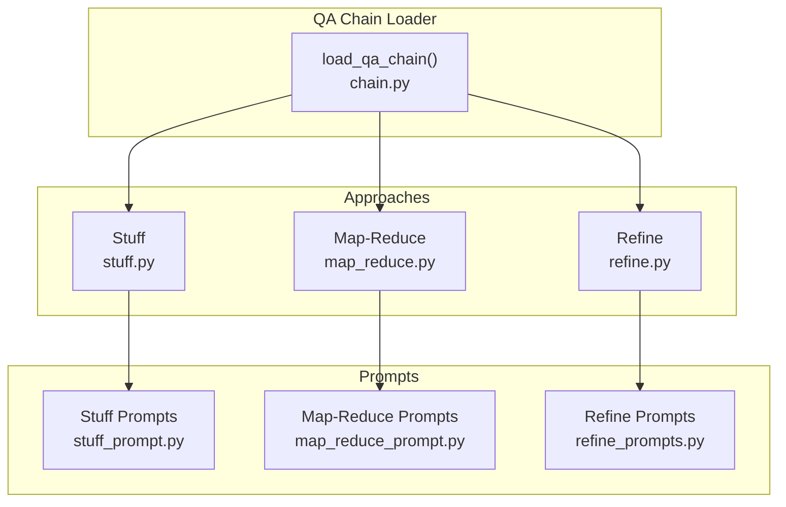
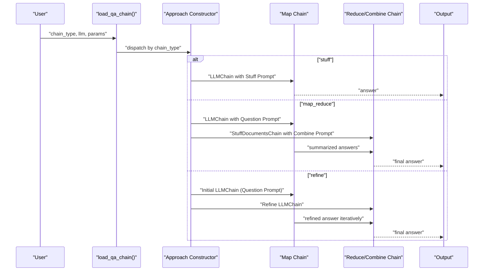
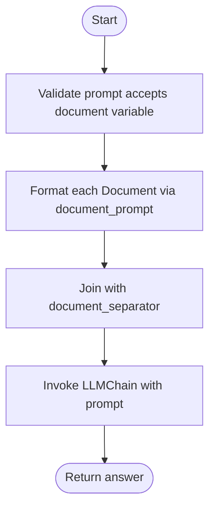
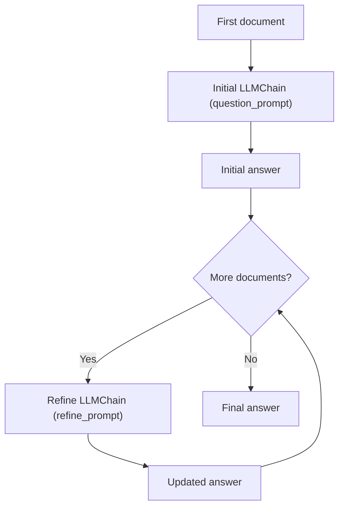
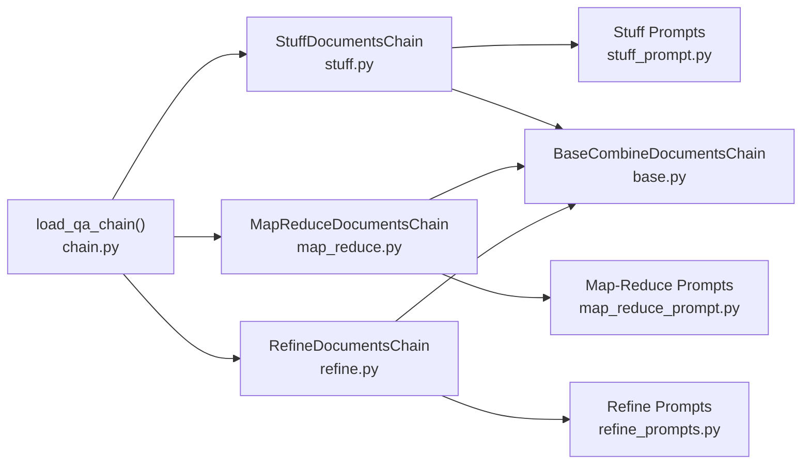

# Question Answering Chains

<cite>
**Referenced Files in This Document**
- [chain.py](file://libs/langchain/langchain_classic/chains/question_answering/chain.py)
- [__init__.py](file://libs/langchain/langchain_classic/chains/question_answering/__init__.py)
- [map_reduce_prompt.py](file://libs/langchain/langchain_classic/chains/question_answering/map_reduce_prompt.py)
- [refine_prompts.py](file://libs/langchain/langchain_classic/chains/question_answering/refine_prompts.py)
- [stuff_prompt.py](file://libs/langchain/langchain_classic/chains/question_answering/stuff_prompt.py)
- [base.py](file://libs/langchain/langchain_classic/chains/combine_documents/base.py)
- [stuff.py](file://libs/langchain/langchain_classic/chains/combine_documents/stuff.py)
- [refine.py](file://libs/langchain/langchain_classic/chains/combine_documents/refine.py)
- [map_reduce.py](file://libs/langchain/langchain_classic/chains/combine_documents/map_reduce.py)
- [base.py](file://libs/text-splitters/langchain_text_splitters/base.py)
</cite>

## Table of Contents
1. [Introduction](#introduction)
2. [Project Structure](#project-structure)
3. [Core Components](#core-components)
4. [Architecture Overview](#architecture-overview)
5. [Detailed Component Analysis](#detailed-component-analysis)
6. [Dependency Analysis](#dependency-analysis)
7. [Performance Considerations](#performance-considerations)
8. [Troubleshooting Guide](#troubleshooting-guide)
9. [Conclusion](#conclusion)
10. [Appendices](#appendices)

## Introduction
This document explains question answering (QA) chains in LangChain Classic, focusing on three primary approaches: stuff, map-reduce, and refine. It details how each approach processes documents and generates answers, documents the prompt templates used for different QA scenarios, and describes parameter configuration for chunking, overlap, and answer extraction. Practical implementation guidance is included, along with performance optimization, memory management for large documents, error handling strategies, and selection criteria for choosing among the approaches.

## Project Structure
The QA chain loading and implementation reside primarily under the question_answering package and combine_documents modules. Prompts are organized per approach and selected based on the language model type.



**Diagram sources**
- [chain.py](file://libs/langchain/langchain_classic/chains/question_answering/chain.py#L246-L284)
- [stuff.py](file://libs/langchain/langchain_classic/chains/combine_documents/stuff.py#L113-L292)
- [map_reduce.py](file://libs/langchain/langchain_classic/chains/combine_documents/map_reduce.py#L29-L295)
- [refine.py](file://libs/langchain/langchain_classic/chains/combine_documents/refine.py#L33-L230)
- [stuff_prompt.py](file://libs/langchain/langchain_classic/chains/question_answering/stuff_prompt.py#L1-L37)
- [map_reduce_prompt.py](file://libs/langchain/langchain_classic/chains/question_answering/map_reduce_prompt.py#L1-L84)
- [refine_prompts.py](file://libs/langchain/langchain_classic/chains/question_answering/refine_prompts.py#L1-L76)

**Section sources**
- [chain.py](file://libs/langchain/langchain_classic/chains/question_answering/chain.py#L1-L285)
- [__init__.py](file://libs/langchain/langchain_classic/chains/question_answering/__init__.py#L1-L10)

## Core Components
- QA Chain Loader: Provides a single entry point to load stuff, map-reduce, refine, and map-rerank chains for question answering.
- Combine Documents Chains: Base abstractions and implementations for each QA strategy.
- Prompt Templates: Predefined templates for stuff, map-reduce, and refine, with selector logic for chat vs non-chat models.

Key responsibilities:
- Load appropriate chain based on chain_type.
- Configure prompts and optional collapse/reduce LLMs.
- Manage document formatting and variable names for prompts.
- Expose token budgeting and intermediate steps for diagnostics.

**Section sources**
- [chain.py](file://libs/langchain/langchain_classic/chains/question_answering/chain.py#L73-L284)
- [base.py](file://libs/langchain/langchain_classic/chains/combine_documents/base.py#L35-L165)

## Architecture Overview
The loader delegates to approach-specific constructors that assemble:
- A map chain (for map-reduce) or initial chain (for refine).
- A reduce/combine chain (for map-reduce) or refine chain (for refine).
- Optional collapse chain for long intermediate results.
- A StuffDocumentsChain for combining reduced results.



**Diagram sources**
- [chain.py](file://libs/langchain/langchain_classic/chains/question_answering/chain.py#L102-L229)
- [map_reduce_prompt.py](file://libs/langchain/langchain_classic/chains/question_answering/map_reduce_prompt.py#L13-L83)
- [refine_prompts.py](file://libs/langchain/langchain_classic/chains/question_answering/refine_prompts.py#L11-L75)
- [stuff_prompt.py](file://libs/langchain/langchain_classic/chains/question_answering/stuff_prompt.py#L13-L36)

## Detailed Component Analysis

### Stuff Chain
- Purpose: Passes all documents into a single prompt via a document formatter and separator.
- Key parameters:
  - document_variable_name: Name of the prompt variable holding concatenated documents (defaults to "context").
  - document_prompt: Template to format individual documents.
  - document_separator: String used to join documents.
- Prompt selection: Uses a selector that chooses between plain text and chat templates depending on the LLM type.

Implementation highlights:
- Validates that the prompt accepts the configured document variable.
- Formats each document using a default or provided document prompt.
- Joins formatted documents and invokes the LLM chain.



**Diagram sources**
- [stuff.py](file://libs/langchain/langchain_classic/chains/combine_documents/stuff.py#L25-L101)
- [stuff_prompt.py](file://libs/langchain/langchain_classic/chains/question_answering/stuff_prompt.py#L13-L36)

**Section sources**
- [stuff.py](file://libs/langchain/langchain_classic/chains/combine_documents/stuff.py#L113-L292)
- [stuff_prompt.py](file://libs/langchain/langchain_classic/chains/question_answering/stuff_prompt.py#L1-L37)

### Map-Reduce Chain
- Purpose: Applies a “map” step to each document independently, then reduces the results using a “combine” step. Supports recursive reduction and optional collapse for long intermediate results.
- Key parameters:
  - question_prompt and combine_prompt: Templates for map and reduce steps.
  - combine_document_variable_name: Variable name for combined inputs in reduce step.
  - map_reduce_document_variable_name: Variable name for map inputs.
  - reduce_llm and collapse_llm: Optional alternate LLMs for reduce/collapse.
  - collapse_prompt: Optional prompt for collapsing long intermediate results.
  - token_max: Token budget for reduce step to manage recursion.
- Prompt selection: Selects between plain text and chat templates for both question and combine prompts.

Processing logic:
- Executes map step in parallel across documents.
- Converts map outputs to result documents preserving metadata.
- Reduces with StuffDocumentsChain and optional collapse chain respecting token_max.

```mermaid
sequenceDiagram
participant D as "Documents"
participant Q as "Map LLMChain"
participant S as "StuffDocumentsChain (reduce)"
participant C as "Optional Collapse Chain"
participant T as "token_max"
D->>Q : "Apply question_prompt to each doc"
Q-->>D : "Intermediate answers"
D->>S : "StuffDocumentsChain with combine_prompt"
S->>T : "Respect token_max"
alt "exceeds budget"
S->>C : "Collapse intermediate answers"
C-->>S : "Reduced set"
end
S-->>Out["Final answer"]
```

**Diagram sources**
- [map_reduce.py](file://libs/langchain/langchain_classic/chains/combine_documents/map_reduce.py#L29-L295)
- [map_reduce_prompt.py](file://libs/langchain/langchain_classic/chains/question_answering/map_reduce_prompt.py#L13-L83)

**Section sources**
- [chain.py](file://libs/langchain/langchain_classic/chains/question_answering/chain.py#L102-L183)
- [map_reduce.py](file://libs/langchain/langchain_classic/chains/combine_documents/map_reduce.py#L29-L295)
- [map_reduce_prompt.py](file://libs/langchain/langchain_classic/chains/question_answering/map_reduce_prompt.py#L1-L84)

### Refine Chain
- Purpose: Iteratively improves an answer by incorporating additional context. Starts with an initial answer and refines it with each subsequent document.
- Key parameters:
  - question_prompt and refine_prompt: Templates for initial answer and refinement.
  - document_variable_name and initial_response_name: Variable names for context and existing answer.
  - refine_llm: Optional alternate LLM for refinement.
- Prompt selection: Chooses between plain text and chat templates for both question and refine prompts.

Processing logic:
- Constructs initial inputs from the first document and predicts an initial answer.
- Iterates over remaining documents, constructing refine inputs with the current answer and the next document’s formatted content.
- Returns the final refined answer; optionally returns intermediate steps.



**Diagram sources**
- [refine.py](file://libs/langchain/langchain_classic/chains/combine_documents/refine.py#L33-L230)
- [refine_prompts.py](file://libs/langchain/langchain_classic/chains/question_answering/refine_prompts.py#L11-L75)

**Section sources**
- [chain.py](file://libs/langchain/langchain_classic/chains/question_answering/chain.py#L186-L229)
- [refine.py](file://libs/langchain/langchain_classic/chains/combine_documents/refine.py#L33-L230)
- [refine_prompts.py](file://libs/langchain/langchain_classic/chains/question_answering/refine_prompts.py#L1-L76)

### Prompt Templates and Customization
- Stuff prompts:
  - Plain text and chat variants selectable by model type.
  - Variables: context, question.
- Map-reduce prompts:
  - Question prompt: context, question.
  - Combine prompt: summaries, question.
  - Chat variants available.
- Refine prompts:
  - Question prompt: context_str, question.
  - Refine prompt: context_str, existing_answer, question.
  - Chat variants available.

Customization tips:
- Override question_prompt, combine_prompt, or refine_prompt to tailor instruction and examples.
- Use document_prompt to control how individual documents are rendered before stuffing or mapping.
- Adjust document_variable_name and combine_document_variable_name to match your prompt schema.

**Section sources**
- [stuff_prompt.py](file://libs/langchain/langchain_classic/chains/question_answering/stuff_prompt.py#L1-L37)
- [map_reduce_prompt.py](file://libs/langchain/langchain_classic/chains/question_answering/map_reduce_prompt.py#L1-L84)
- [refine_prompts.py](file://libs/langchain/langchain_classic/chains/question_answering/refine_prompts.py#L1-L76)
- [base.py](file://libs/langchain/langchain_classic/chains/combine_documents/base.py#L25-L33)

### Parameter Configuration
- Document chunking and overlap:
  - Use a text splitter to pre-chunk large documents before passing to QA chains.
  - Configure chunk_size and chunk_overlap to balance recall and context length.
- Answer extraction:
  - The chains rely on the LLM to produce natural language answers; post-process with an output parser if needed.
- Token budgeting:
  - For map-reduce, set token_max to control recursive reduction and avoid exceeding model context limits.
- Variable names:
  - Ensure document_variable_name matches the prompt’s expected input variable.

Practical guidance:
- For small contexts, stuff is simplest and fastest.
- For large documents, use map-reduce with token_max and optional collapse.
- For iterative improvement with long documents, use refine.

**Section sources**
- [chain.py](file://libs/langchain/langchain_classic/chains/question_answering/chain.py#L102-L183)
- [map_reduce.py](file://libs/langchain/langchain_classic/chains/combine_documents/map_reduce.py#L224-L290)
- [base.py](file://libs/langchain/langchain_classic/chains/combine_documents/base.py#L80-L97)
- [base.py](file://libs/text-splitters/langchain_text_splitters/base.py#L58-L66)

### Practical Examples
Note: The following are conceptual examples to illustrate configuration. Replace placeholders with your actual LLM provider and credentials.

- Stuff QA with a plain-text prompt:
  - Load a stuff chain with a custom question prompt.
  - Pass a list of Documents to the chain; ensure the prompt expects a "context" variable.
- Map-reduce QA with collapse:
  - Provide question_prompt and combine_prompt.
  - Set token_max to manage reduction; optionally supply collapse_prompt and collapse_llm for very long outputs.
- Refine QA:
  - Provide question_prompt and refine_prompt.
  - Iterate over documents; the chain will refine the answer progressively.

Implementation anchors:
- QA chain loader and approach constructors:
  - [chain.py](file://libs/langchain/langchain_classic/chains/question_answering/chain.py#L73-L284)
- StuffDocumentsChain:
  - [stuff.py](file://libs/langchain/langchain_classic/chains/combine_documents/stuff.py#L113-L292)
- MapReduceDocumentsChain:
  - [map_reduce.py](file://libs/langchain/langchain_classic/chains/combine_documents/map_reduce.py#L29-L295)
- RefineDocumentsChain:
  - [refine.py](file://libs/langchain/langchain_classic/chains/combine_documents/refine.py#L33-L230)

**Section sources**
- [chain.py](file://libs/langchain/langchain_classic/chains/question_answering/chain.py#L73-L284)
- [stuff.py](file://libs/langchain/langchain_classic/chains/combine_documents/stuff.py#L113-L292)
- [map_reduce.py](file://libs/langchain/langchain_classic/chains/combine_documents/map_reduce.py#L29-L295)
- [refine.py](file://libs/langchain/langchain_classic/chains/combine_documents/refine.py#L33-L230)

## Dependency Analysis
The loader depends on combine-document chains and prompt selectors. Each approach composes LLMChains and document combination utilities.



**Diagram sources**
- [chain.py](file://libs/langchain/langchain_classic/chains/question_answering/chain.py#L1-L30)
- [stuff.py](file://libs/langchain/langchain_classic/chains/combine_documents/stuff.py#L15-L22)
- [map_reduce.py](file://libs/langchain/langchain_classic/chains/combine_documents/map_reduce.py#L15-L17)
- [refine.py](file://libs/langchain/langchain_classic/chains/combine_documents/refine.py#L14-L17)
- [stuff_prompt.py](file://libs/langchain/langchain_classic/chains/question_answering/stuff_prompt.py#L1-L11)
- [map_reduce_prompt.py](file://libs/langchain/langchain_classic/chains/question_answering/map_reduce_prompt.py#L1-L11)
- [refine_prompts.py](file://libs/langchain/langchain_classic/chains/question_answering/refine_prompts.py#L1-L9)

**Section sources**
- [chain.py](file://libs/langchain/langchain_classic/chains/question_answering/chain.py#L1-L30)
- [base.py](file://libs/langchain/langchain_classic/chains/combine_documents/base.py#L35-L165)

## Performance Considerations
- Stuff:
  - Fastest for small to medium contexts; watch out for context length limits.
  - Use prompt_length to estimate token usage before invoking.
- Map-Reduce:
  - Parallel map step scales well; tune token_max to prevent excessive recursion.
  - Collapse step helps manage long intermediate results.
- Refine:
  - Iterative refinement is slower but can improve accuracy on long texts.
  - Consider limiting the number of documents or using chunking to reduce iteration cost.
- Chunking and overlap:
  - Increase chunk_size cautiously; increase chunk_overlap to preserve continuity across boundaries.
- Memory management:
  - Prefer map-reduce with token_max and collapse for very large inputs.
  - Stream or batch reduce steps when possible.

[No sources needed since this section provides general guidance]

## Troubleshooting Guide
Common issues and resolutions:
- Unsupported chain type:
  - Ensure chain_type is one of "stuff", "map_reduce", "refine", or "map_rerank".
- Prompt variable mismatch:
  - The prompt must accept the configured document_variable_name; otherwise, a ValueError is raised.
- Collapse configuration:
  - If collapse_llm is provided without collapse_prompt, a ValueError is raised.
- Unexpected output:
  - Verify question_prompt and refine_prompt/combine_prompt variable names align with inputs.
- Token limit exceeded:
  - Reduce chunk_size or increase chunk_overlap; adjust token_max for map-reduce.

**Section sources**
- [chain.py](file://libs/langchain/langchain_classic/chains/question_answering/chain.py#L273-L278)
- [chain.py](file://libs/langchain/langchain_classic/chains/question_answering/chain.py#L147-L154)
- [base.py](file://libs/langchain/langchain_classic/chains/combine_documents/base.py#L26-L32)

## Conclusion
LangChain Classic offers three complementary QA strategies:
- Stuff for concise, single-prompt retrieval-augmented answers.
- Map-Reduce for scalable processing of large documents with controlled token budgets.
- Refine for iterative improvement across long or complex texts.

Select the approach based on document size, desired accuracy, and performance constraints. Customize prompts and document formatting to fit your domain and integrate with chunking strategies for optimal results.

[No sources needed since this section summarizes without analyzing specific files]

## Appendices

### Choosing an Approach
- Small to medium documents with tight context limits: Stuff.
- Large documents or many chunks: Map-Reduce with token_max and optional collapse.
- Long-form texts requiring iterative refinement: Refine.
- Retrieval-augmented QA with reranking: map_rerank (see loader mapping).

**Section sources**
- [chain.py](file://libs/langchain/langchain_classic/chains/question_answering/chain.py#L267-L272)