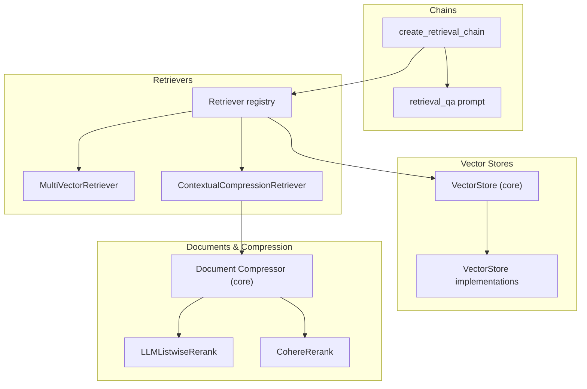
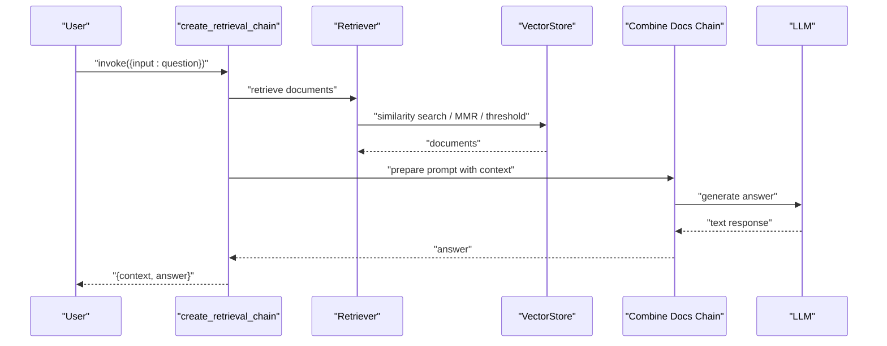
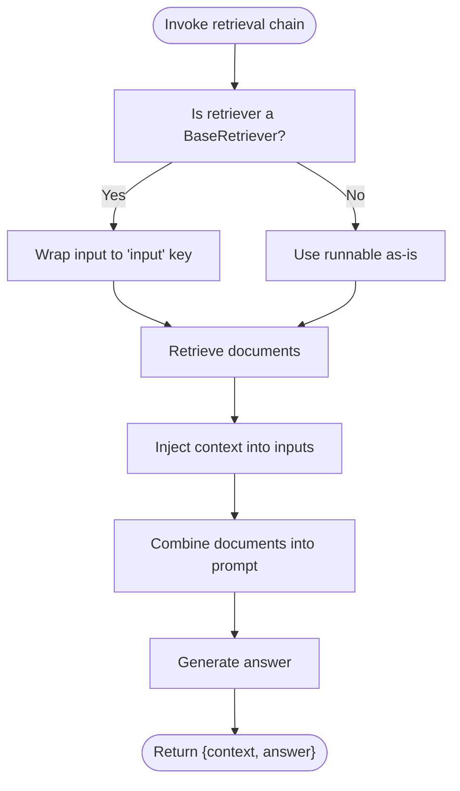
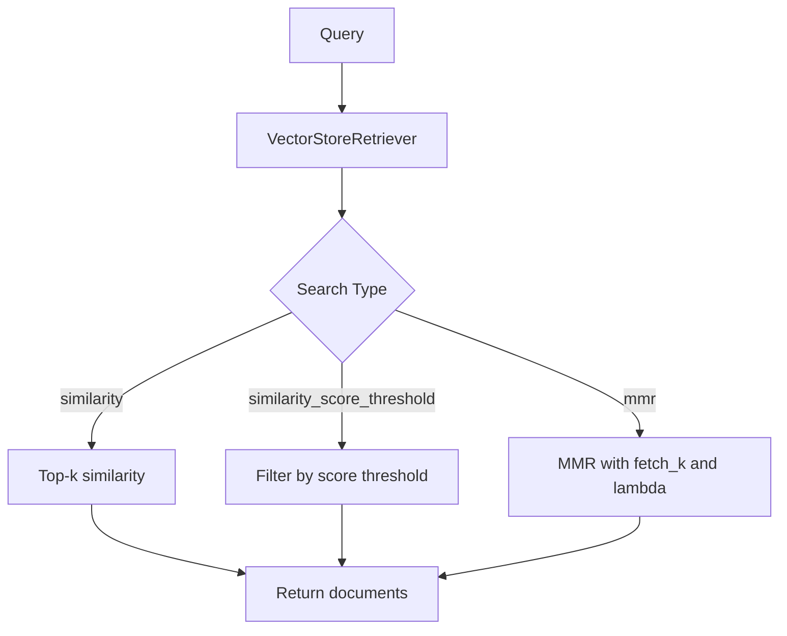
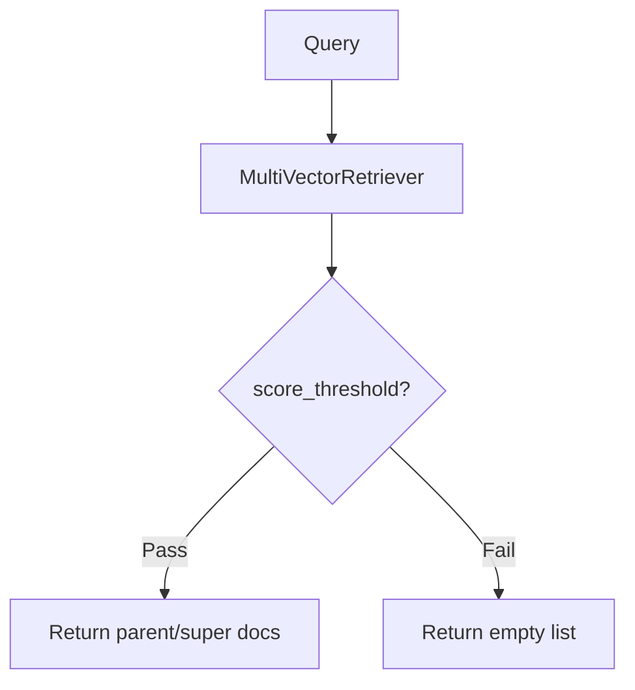
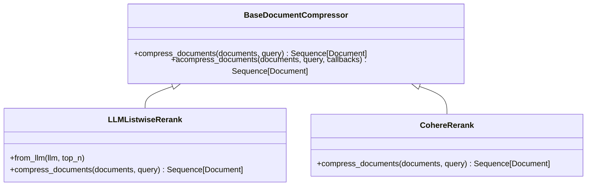
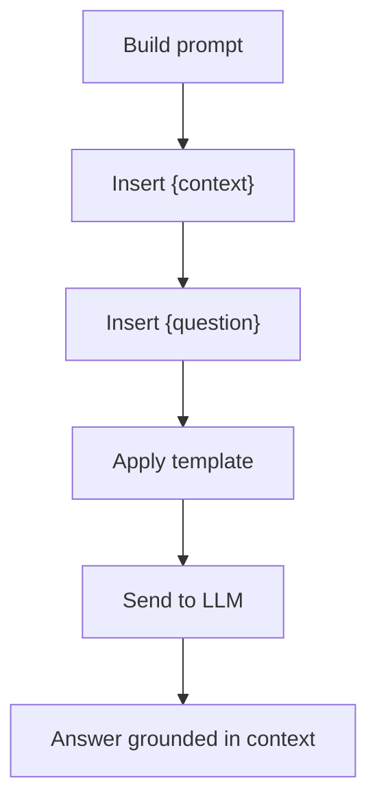
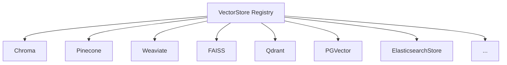
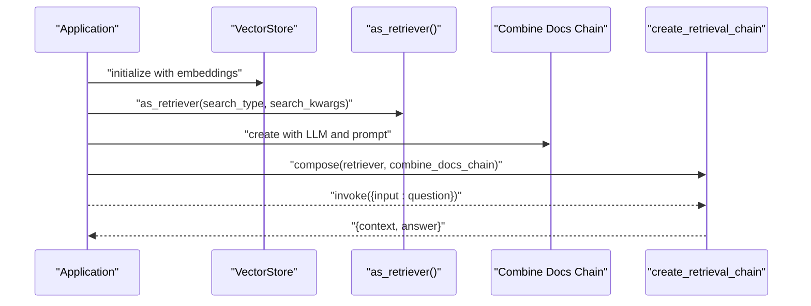
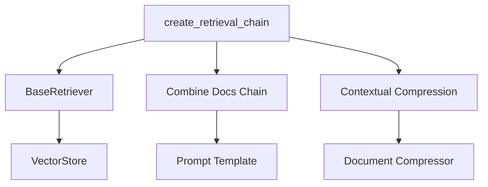

# Retrieval-QA Chains

<cite>
**Referenced Files in This Document**
- [retrieval.py](file://libs/langchain/langchain_classic/chains/retrieval.py)
- [prompt.py](file://libs/langchain/langchain_classic/chains/retrieval_qa/prompt.py)
- [vectorstores/__init__.py](file://libs/langchain/langchain_classic/vectorstores/__init__.py)
- [retrievers/__init__.py](file://libs/langchain/langchain_classic/retrievers/__init__.py)
- [base.py](file://libs/core/langchain_core/vectorstores/base.py)
- [in_memory.py](file://libs/core/langchain_core/vectorstores/in_memory.py)
- [vectorstore.py](file://libs/langchain/langchain_classic/indexes/vectorstore.py)
- [base.py](file://libs/core/langchain_core/documents/compressor.py)
- [base.py](file://libs/langchain/langchain_classic/retrievers/document_compressors/base.py)
- [listwise_rerank.py](file://libs/langchain/langchain_classic/retrievers/document_compressors/listwise_rerank.py)
- [cohere_rerank.py](file://libs/langchain/langchain_classic/retrievers/document_compressors/cohere_rerank.py)
- [chain_extract_prompt.py](file://libs/langchain/langchain_classic/retrievers/document_compressors/chain_extract_prompt.py)
- [chain_filter_prompt.py](file://libs/langchain/langchain_classic/retrievers/document_compressors/chain_filter_prompt.py)
- [multi_vector_test.py](file://libs/langchain/tests/unit_tests/retrievers/test_multi_vector.py)
- [refine_prompts.py](file://libs/langchain/langchain_classic/chains/qa_with_sources/refine_prompts.py)
</cite>

## Table of Contents
1. [Introduction](#introduction)
2. [Project Structure](#project-structure)
3. [Core Components](#core-components)
4. [Architecture Overview](#architecture-overview)
5. [Detailed Component Analysis](#detailed-component-analysis)
6. [Dependency Analysis](#dependency-analysis)
7. [Performance Considerations](#performance-considerations)
8. [Troubleshooting Guide](#troubleshooting-guide)
9. [Conclusion](#conclusion)
10. [Appendices](#appendices)

## Introduction
This document explains Retrieval-QA chains that combine vector store retrieval with question answering. It covers the Retrieval-Augmented Generation (RAG) pattern, how retrieval chains enhance Large Language Model (LLM) responses with external knowledge, and how to integrate vector stores, retrievers, and LLMs into a cohesive pipeline. It also details retrieval strategies (similarity search, multi-vector retrieval, contextual compression), prompt engineering for retrieval-augmented contexts, examples for popular vector stores, performance optimization, caching strategies, monitoring retrieval quality, and fallback mechanisms for retrieval failures.

## Project Structure
The Retrieval-QA pipeline spans several modules:
- Chains: orchestrate retrieval and document combination into an answer-generating flow.
- Vector Stores: embed and index data, expose retrievers for similarity search.
- Retrievers: specialized strategies to fetch relevant documents (e.g., multi-vector, contextual compression).
- Prompt Engineering: templates that ground LLMs in retrieved context.
- Integrations: bindings to popular vector stores and retrievers.

**Diagram sources**
- [retrieval.py](file://libs/langchain/langchain_classic/chains/retrieval.py#L12-L69)
- [prompt.py](file://libs/langchain/langchain_classic/chains/retrieval_qa/prompt.py#L1-L11)
- [vectorstores/__init__.py](file://libs/langchain/langchain_classic/vectorstores/__init__.py#L1-L246)
- [retrievers/__init__.py](file://libs/langchain/langchain_classic/retrievers/__init__.py#L1-L170)
- [base.py](file://libs/core/langchain_core/vectorstores/base.py#L964-L980)
- [base.py](file://libs/core/langchain_core/documents/compressor.py#L50-L74)
- [listwise_rerank.py](file://libs/langchain/langchain_classic/retrievers/document_compressors/listwise_rerank.py#L40-L74)
- [cohere_rerank.py](file://libs/langchain/langchain_classic/retrievers/document_compressors/cohere_rerank.py#L110-L124)

**Section sources**
- [retrieval.py](file://libs/langchain/langchain_classic/chains/retrieval.py#L12-L69)
- [vectorstores/__init__.py](file://libs/langchain/langchain_classic/vectorstores/__init__.py#L1-L246)
- [retrievers/__init__.py](file://libs/langchain/langchain_classic/retrievers/__init__.py#L1-L170)

## Core Components
- Retrieval Chain: a composable LCEL chain that retrieves documents and then combines them into an answer.
- Vector Store: an embedding-backed store that supports similarity search and exposes a retriever interface.
- Retriever Strategies: specialized retrievers for multi-vector, contextual compression, ensemble, merger, and more.
- Prompt Templates: structured prompts that instruct the LLM to answer using the retrieved context.
- Document Compression: rerankers and filters to improve relevance and reduce noise.

Key responsibilities:
- Retrieval Chain: orchestrates retrieval and document combination, returning a dictionary with context and answer keys.
- Vector Store: persists embeddings and supports similarity search, MMR, and score-threshold filtering.
- Retriever Registry: exposes a wide variety of retrievers, including multi-vector and contextual compression.
- Prompt Engineering: ensures the LLM focuses on the retrieved context and avoids hallucinations.

**Section sources**
- [retrieval.py](file://libs/langchain/langchain_classic/chains/retrieval.py#L12-L69)
- [base.py](file://libs/core/langchain_core/vectorstores/base.py#L964-L980)
- [retrievers/__init__.py](file://libs/langchain/langchain_classic/retrievers/__init__.py#L1-L170)
- [prompt.py](file://libs/langchain/langchain_classic/chains/retrieval_qa/prompt.py#L1-L11)

## Architecture Overview
The Retrieval-QA architecture integrates three pillars:
- Retrieval: fetch relevant documents from a vector store via a retriever.
- Combination: merge retrieved documents into a single prompt for the LLM.
- Generation: produce an answer grounded in the retrieved context.

**Diagram sources**
- [retrieval.py](file://libs/langchain/langchain_classic/chains/retrieval.py#L12-L69)
- [base.py](file://libs/core/langchain_core/vectorstores/base.py#L964-L980)

## Detailed Component Analysis

### Retrieval Chain Orchestration
The retrieval chain wraps a retriever and a document combination chain. It injects a context key with retrieved documents and then computes the final answer.

**Diagram sources**
- [retrieval.py](file://libs/langchain/langchain_classic/chains/retrieval.py#L12-L69)

**Section sources**
- [retrieval.py](file://libs/langchain/langchain_classic/chains/retrieval.py#L12-L69)

### Vector Store Retrieval Strategies
Vector stores support multiple search strategies:
- Similarity search: retrieve top-k most similar vectors.
- Similarity with score threshold: filter by a minimum relevance score.
- Maximal Marginal Relevance (MMR): diversify results by trading off similarity and diversity.
- Filters: restrict retrieval by metadata predicates.

**Diagram sources**
- [base.py](file://libs/core/langchain_core/vectorstores/base.py#L964-L980)
- [in_memory.py](file://libs/core/langchain_core/vectorstores/in_memory.py#L143-L159)

**Section sources**
- [base.py](file://libs/core/langchain_core/vectorstores/base.py#L964-L980)
- [in_memory.py](file://libs/core/langchain_core/vectorstores/in_memory.py#L143-L159)

### Multi-Vector Retrieval
Multi-vector retrieval enables storing composite chunks (e.g., paragraphs and sentences) while indexing at a higher level (e.g., paragraphs). It supports score-threshold filtering and is validated in unit tests.

**Diagram sources**
- [multi_vector_test.py](file://libs/langchain/tests/unit_tests/retrievers/test_multi_vector.py#L111-L134)

**Section sources**
- [multi_vector_test.py](file://libs/langchain/tests/unit_tests/retrievers/test_multi_vector.py#L111-L134)

### Contextual Compression and Reranking
Contextual compression improves relevance by reranking or filtering retrieved documents using an LLM or external reranker.

**Diagram sources**
- [base.py](file://libs/core/langchain_core/documents/compressor.py#L50-L74)
- [listwise_rerank.py](file://libs/langchain/langchain_classic/retrievers/document_compressors/listwise_rerank.py#L40-L74)
- [cohere_rerank.py](file://libs/langchain/langchain_classic/retrievers/document_compressors/cohere_rerank.py#L110-L124)

Prompt templates for extraction and filtering are provided for chain-based compression.

**Section sources**
- [base.py](file://libs/core/langchain_core/documents/compressor.py#L50-L74)
- [listwise_rerank.py](file://libs/langchain/langchain_classic/retrievers/document_compressors/listwise_rerank.py#L40-L74)
- [cohere_rerank.py](file://libs/langchain/langchain_classic/retrievers/document_compressors/cohere_rerank.py#L110-L124)
- [chain_extract_prompt.py](file://libs/langchain/langchain_classic/retrievers/document_compressors/chain_extract_prompt.py#L1-L10)
- [chain_filter_prompt.py](file://libs/langchain/langchain_classic/retrievers/document_compressors/chain_filter_prompt.py#L1-L8)

### Prompt Engineering for Retrieval-Augmented Contexts
Effective prompts guide the LLM to focus on the retrieved context and avoid fabricating answers. The RetrievalQA prompt template demonstrates a canonical structure.

**Diagram sources**
- [prompt.py](file://libs/langchain/langchain_classic/chains/retrieval_qa/prompt.py#L1-L11)

Additional refinement prompts support iterative improvement of answers with new context.

**Section sources**
- [prompt.py](file://libs/langchain/langchain_classic/chains/retrieval_qa/prompt.py#L1-L11)
- [refine_prompts.py](file://libs/langchain/langchain_classic/chains/qa_with_sources/refine_prompts.py#L1-L37)

### Integration with Popular Vector Stores
The vector store registry aggregates implementations from community packages, including Chroma, Pinecone, Weaviate, and others. These are dynamically imported and exposed under a unified namespace.

**Diagram sources**
- [vectorstores/__init__.py](file://libs/langchain/langchain_classic/vectorstores/__init__.py#L14-L86)

**Section sources**
- [vectorstores/__init__.py](file://libs/langchain/langchain_classic/vectorstores/__init__.py#L14-L86)

### Setting Up Retrieval Chains with Vector Stores
A typical setup involves:
- Creating a vector store with embeddings.
- Converting the vector store into a retriever with desired search type and kwargs.
- Building a combine-documents chain (e.g., stuffing documents into a prompt).
- Composing the retrieval chain with the retriever and the combine-documents chain.

**Diagram sources**
- [base.py](file://libs/core/langchain_core/vectorstores/base.py#L964-L980)
- [retrieval.py](file://libs/langchain/langchain_classic/chains/retrieval.py#L12-L69)

**Section sources**
- [base.py](file://libs/core/langchain_core/vectorstores/base.py#L964-L980)
- [retrieval.py](file://libs/langchain/langchain_classic/chains/retrieval.py#L12-L69)

### Handling Retrieval Failures and Fallback Mechanisms
Common failure modes:
- No relevant documents returned.
- Low-relevance results due to poor query or embeddings.
- Out-of-memory or timeout during retrieval.

Recommended fallbacks:
- Switch to a broader retriever (e.g., BM25 or TF-IDF) or adjust thresholds.
- Enable contextual compression to improve relevance.
- Add a secondary retriever (ensemble) to increase recall.
- Implement a minimal-answer fallback when no context is found.

[No sources needed since this section provides general guidance]

## Dependency Analysis
The Retrieval-QA chain depends on:
- Retrieval: BaseRetriever and VectorStore for fetching documents.
- Combination: A runnable that merges documents into a prompt for the LLM.
- Compression: Optional rerankers to improve relevance.
- Prompts: Structured templates to ground the LLM in context.

**Diagram sources**
- [retrieval.py](file://libs/langchain/langchain_classic/chains/retrieval.py#L12-L69)
- [base.py](file://libs/core/langchain_core/vectorstores/base.py#L964-L980)
- [base.py](file://libs/core/langchain_core/documents/compressor.py#L50-L74)
- [prompt.py](file://libs/langchain/langchain_classic/chains/retrieval_qa/prompt.py#L1-L11)

**Section sources**
- [retrieval.py](file://libs/langchain/langchain_classic/chains/retrieval.py#L12-L69)
- [base.py](file://libs/core/langchain_core/vectorstores/base.py#L964-L980)
- [base.py](file://libs/core/langchain_core/documents/compressor.py#L50-L74)
- [prompt.py](file://libs/langchain/langchain_classic/chains/retrieval_qa/prompt.py#L1-L11)

## Performance Considerations
- Indexing and Embedding Costs: Precompute embeddings efficiently and choose appropriate embedding dimensions.
- Retrieval Efficiency: Tune k, fetch_k, and lambda_mult for MMR; apply filters to reduce candidate sets.
- Compression Overhead: Use lightweight rerankers or early-exit strategies when latency is critical.
- Caching: Cache frequent queries and their top-k results; invalidate on data updates.
- Streaming and Chunking: Stream LLM responses and chunk long contexts to manage token limits.
- Monitoring: Track retrieval quality metrics (precision@k, mean reciprocal rank) and latency.

[No sources needed since this section provides general guidance]

## Troubleshooting Guide
- Symptom: Empty or irrelevant results.
  - Action: Lower score_threshold, switch to MMR, or enable contextual compression.
- Symptom: Slow retrieval.
  - Action: Reduce k, add filters, or move to a faster vector store backend.
- Symptom: Hallucinations despite context.
  - Action: Strengthen prompt templates and enforce “say if unknown” instructions.
- Symptom: Frequent timeouts.
  - Action: Implement retries, circuit breakers, and fallback retrievers.

**Section sources**
- [base.py](file://libs/core/langchain_core/vectorstores/base.py#L964-L980)
- [listwise_rerank.py](file://libs/langchain/langchain_classic/retrievers/document_compressors/listwise_rerank.py#L40-L74)
- [prompt.py](file://libs/langchain/langchain_classic/chains/retrieval_qa/prompt.py#L1-L11)

## Conclusion
Retrieval-QA chains provide a robust RAG framework by combining vector store retrieval with LLM-powered generation. By leveraging diverse retrieval strategies, contextual compression, and carefully engineered prompts, applications can deliver accurate, contextually grounded answers. Integrating with popular vector stores and implementing performance and reliability best practices ensures scalable, production-ready systems.

[No sources needed since this section summarizes without analyzing specific files]

## Appendices

### Quick Setup Recipes
- Similarity Search: configure retriever with similarity and k.
- Score Threshold: configure retriever with similarity_score_threshold.
- MMR: configure retriever with mmr and tune fetch_k and lambda_mult.
- Multi-Vector: use MultiVectorRetriever with parent and child stores.
- Contextual Compression: wrap retriever with ContextualCompressionRetriever and supply a compressor.

**Section sources**
- [base.py](file://libs/core/langchain_core/vectorstores/base.py#L964-L980)
- [in_memory.py](file://libs/core/langchain_core/vectorstores/in_memory.py#L143-L159)
- [multi_vector_test.py](file://libs/langchain/tests/unit_tests/retrievers/test_multi_vector.py#L111-L134)
- [base.py](file://libs/core/langchain_core/documents/compressor.py#L50-L74)

### Vector Store and Retriever Registry
Explore supported vector stores and retrievers through the centralized registry.

**Section sources**
- [vectorstores/__init__.py](file://libs/langchain/langchain_classic/vectorstores/__init__.py#L14-L86)
- [retrievers/__init__.py](file://libs/langchain/langchain_classic/retrievers/__init__.py#L1-L170)

### Indexing and Querying Helper
A convenience method to build a RetrievalQA chain directly from a vector store and LLM.

**Section sources**
- [vectorstore.py](file://libs/langchain/langchain_classic/indexes/vectorstore.py#L43-L177)