# Specialized Chains

<cite>
**Referenced Files in This Document**
- [chains/__init__.py](file://libs/langchain/langchain_classic/chains/__init__.py)
- [chains/base.py](file://libs/langchain/langchain_classic/chains/base.py)
- [chains/summarize/chain.py](file://libs/langchain/langchain_classic/chains/summarize/chain.py)
- [chains/combine_documents/__init__.py](file://libs/langchain/langchain_classic/chains/combine_documents/__init__.py)
- [chains/combine_documents/base.py](file://libs/langchain/langchain_classic/chains/combine_documents/base.py)
- [chains/combine_documents/stuff.py](file://libs/langchain/langchain_classic/chains/combine_documents/stuff.py)
- [chains/combine_documents/map_reduce.py](file://libs/langchain/langchain_classic/chains/combine_documents/map_reduce.py)
- [chains/combine_documents/refine.py](file://libs/langchain/langchain_classic/chains/combine_documents/refine.py)
- [chains/combine_documents/reduce.py](file://libs/langchain/langchain_classic/chains/combine_documents/reduce.py)
- [chains/question_answering/chain.py](file://libs/langchain/langchain_classic/chains/question_answering/chain.py)
- [chains/router/base.py](file://libs/langchain/langchain_classic/chains/router/base.py)
- [chains/router/llm_router.py](file://libs/langchain/langchain_classic/chains/router/llm_router.py)
- [chains/router/multi_prompt.py](file://libs/langchain/langchain_classic/chains/router/multi_prompt.py)
- [chains/router/multi_retrieval_qa.py](file://libs/langchain/langchain_classic/chains/router/multi_retrieval_qa.py)
- [chains/conversational_retrieval/base.py](file://libs/langchain/langchain_classic/chains/conversational_retrieval/base.py)
- [chains/conversation/base.py](file://libs/langchain/langchain_classic/chains/conversation/base.py)
- [chains/llm.py](file://libs/langchain/langchain_classic/chains/llm.py)
- [chains/sequential.py](file://libs/langchain/langchain_classic/chains/sequential.py)
- [chains/transform.py](file://libs/langchain/langchain_classic/chains/transform.py)
- [chains/api/base.py](file://libs/langchain/langchain_classic/chains/api/base.py)
- [chains/api/openapi/chain.py](file://libs/langchain/langchain_classic/chains/api/openapi/chain.py)
- [chains/api/openapi/requests_chain.py](file://libs/langchain/langchain_classic/chains/api/openapi/requests_chain.py)
- [chains/api/openapi/response_chain.py](file://libs/langchain/langchain_classic/chains/api/openapi/response_chain.py)
- [chains/llm_math/base.py](file://libs/langchain/langchain_classic/chains/llm_math/base.py)
- [chains/llm_checker/base.py](file://libs/langchain/langchain_classic/chains/llm_checker/base.py)
- [chains/llm_summarization_checker/base.py](file://libs/langchain/langchain_classic/chains/llm_summarization_checker/base.py)
- [chains/qa_generation/base.py](file://libs/langchain/langchain_classic/chains/qa_generation/base.py)
- [chains/qa_with_sources/base.py](file://libs/langchain/langchain_classic/chains/qa_with_sources/base.py)
- [chains/qa_with_sources/retrieval.py](file://libs/langchain/langchain_classic/chains/qa_with_sources/retrieval.py)
- [chains/qa_with_sources/vector_db.py](file://libs/langchain/langchain_classic/chains/qa_with_sources/vector_db.py)
- [chains/sql_database/query.py](file://libs/langchain/langchain_classic/chains/sql_database/query.py)
- [chains/graph_qa/base.py](file://libs/langchain/langchain_classic/chains/graph_qa/base.py)
- [chains/graph_qa/cypher.py](file://libs/langchain/langchain_classic/chains/graph_qa/cypher.py)
- [chains/graph_qa/sparql.py](file://libs/langchain/langchain_classic/chains/graph_qa/sparql.py)
- [chains/natbot/base.py](file://libs/langchain/langchain_classic/chains/natbot/base.py)
- [chains/natbot/crawler.py](file://libs/langchain/langchain_classic/chains/natbot/crawler.py)
- [chains/flare/base.py](file://libs/langchain/langchain_classic/chains/flare/base.py)
- [chains/ernie_functions/base.py](file://libs/langchain/langchain_classic/chains/ernie_functions/base.py)
- [chains/openai_functions/base.py](file://libs/langchain/langchain_classic/chains/openai_functions/base.py)
- [chains/openai_functions/extraction.py](file://libs/langchain/langchain_classic/chains/openai_functions/extraction.py)
- [chains/openai_functions/tagging.py](file://libs/langchain/langchain_classic/chains/openai_functions/tagging.py)
- [chains/openai_functions/qa_with_structure.py](file://libs/langchain/langchain_classic/chains/openai_functions/qa_with_structure.py)
- [chains/openai_functions/openapi.py](file://libs/langchain/langchain_classic/chains/openai_functions/openapi.py)
- [chains/openai_functions/utils.py](file://libs/langchain/langchain_classic/chains/openai_functions/utils.py)
- [chains/structured_output/base.py](file://libs/langchain/langchain_classic/chains/structured_output/base.py)
- [chains/constitutive_ai/base.py](file://libs/langchain/langchain_classic/chains/constitutional_ai/base.py)
- [chains/moderation.py](file://libs/langchain/langchain_classic/chains/moderation.py)
- [chains/history_aware_retriever.py](file://libs/langchain/langchain_classic/chains/history_aware_retriever.py)
- [chains/loading.py](file://libs/langchain/langchain_classic/chains/loading.py)
- [chains/mapreduce.py](file://libs/langchain/langchain_classic/chains/mapreduce.py)
- [chains/prompt_selector.py](file://libs/langchain/langchain_classic/chains/prompt_selector.py)
- [chains/retrieval.py](file://libs/langchain/langchain_classic/chains/retrieval.py)
- [chains/retrieval_qa/base.py](file://libs/langchain/langchain_classic/chains/retrieval_qa/base.py)
- [chains/example_generator.py](file://libs/langchain/langchain_classic/chains/example_generator.py)
- [chains/llm_requests.py](file://libs/langchain/langchain_classic/chains/llm_requests.py)
- [chains/api/news_docs.py](file://libs/langchain/langchain_classic/chains/api/news_docs.py)
- [chains/api/open_meteo_docs.py](file://libs/langchain/langchain_classic/chains/api/open_meteo_docs.py)
- [chains/api/podcast_docs.py](file://libs/langchain/langchain_classic/chains/api/podcast_docs.py)
- [chains/api/tmdb_docs.py](file://libs/langchain/langchain_classic/chains/api/tmdb_docs.py)
- [chains/api/prompt.py](file://libs/langchain/langchain_classic/chains/api/prompt.py)
- [chains/summarize/map_reduce_prompt.py](file://libs/langchain/langchain_classic/chains/summarize/map_reduce_prompt.py)
- [chains/summarize/refine_prompts.py](file://libs/langchain/langchain_classic/chains/summarize/refine_prompts.py)
- [chains/summarize/stuff_prompt.py](file://libs/langchain/langchain_classic/chains/summarize/stuff_prompt.py)
- [chains/question_answering/map_reduce_prompt.py](file://libs/langchain/langchain_classic/chains/question_answering/map_reduce_prompt.py)
- [chains/question_answering/map_rerank_prompt.py](file://libs/langchain/langchain_classic/chains/question_answering/map_rerank_prompt.py)
- [chains/question_answering/refine_prompts.py](file://libs/langchain/langchain_classic/chains/question_answering/refine_prompts.py)
- [chains/question_answering/stuff_prompt.py](file://libs/langchain/langchain_classic/chains/question_answering/stuff_prompt.py)
- [chains/qa_with_sources/map_reduce_prompt.py](file://libs/langchain/langchain_classic/chains/qa_with_sources/map_reduce_prompt.py)
- [chains/qa_with_sources/refine_prompts.py](file://libs/langchain/langchain_classic/chains/qa_with_sources/refine_prompts.py)
- [chains/qa_with_sources/stuff_prompt.py](file://libs/langchain/langchain_classic/chains/qa_with_sources/stuff_prompt.py)
</cite>

## Table of Contents
1. [Introduction](#introduction)
2. [Project Structure](#project-structure)
3. [Core Components](#core-components)
4. [Architecture Overview](#architecture-overview)
5. [Detailed Component Analysis](#detailed-component-analysis)
6. [Dependency Analysis](#dependency-analysis)
7. [Performance Considerations](#performance-considerations)
8. [Troubleshooting Guide](#troubleshooting-guide)
9. [Conclusion](#conclusion)
10. [Appendices](#appendices)

## Introduction
This document explains specialized chains beyond basic question answering and conversation. It focuses on:
- Summarization chains: stuff, map-reduce, and refine
- Combine documents chains and their role in processing collections of documents
- Specialized chains for document processing, content generation, and multi-document workflows
- Chains for API integration, data transformation, and complex business logic processing
- Examples of building custom specialized chains for domain-specific use cases
- Performance optimization, batch processing capabilities, and error handling in specialized workflows
- Extending existing specialized chains and creating new ones

## Project Structure
LangChain organizes specialized chains under a dedicated package with modular subpackages for different domains and patterns. The chains package exposes a unified import surface and delegates to specialized implementations.

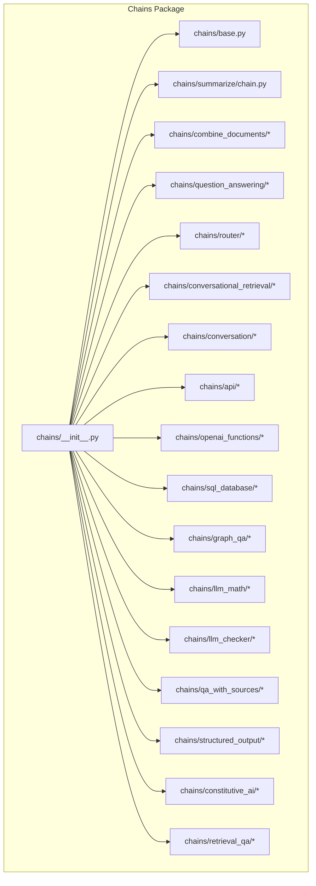

**Diagram sources**
- [chains/__init__.py](file://libs/langchain/langchain_classic/chains/__init__.py#L1-L97)
- [chains/base.py](file://libs/langchain/langchain_classic/chains/base.py#L1-L807)

**Section sources**
- [chains/__init__.py](file://libs/langchain/langchain_classic/chains/__init__.py#L1-L97)

## Core Components
- Chain base interface: Defines the contract for all chains, including input/output schemas, memory integration, callbacks, and synchronous/asynchronous invocation.
- Summarization loader: Provides factory functions to build summarization chains using stuff, map_reduce, or refine strategies.
- Combine documents family: Implements document combination primitives (stuff, map_reduce, refine, reduce) and composes them into higher-level chains.

Key responsibilities:
- Encapsulate component orchestration (LLMs, prompts, retrievers, chains)
- Provide observability via callbacks and run metadata
- Support stateful behavior via memory
- Enable composability and reusability across domains

**Section sources**
- [chains/base.py](file://libs/langchain/langchain_classic/chains/base.py#L52-L520)
- [chains/summarize/chain.py](file://libs/langchain/langchain_classic/chains/summarize/chain.py#L196-L227)
- [chains/combine_documents/__init__.py](file://libs/langchain/langchain_classic/chains/combine_documents/__init__.py#L1-L17)

## Architecture Overview
The specialized chains ecosystem follows a layered architecture:
- Base chain abstraction ensures consistent behavior across all chains
- Domain-specific chain factories construct composed chains from primitives
- Combine documents primitives enable recursive, token-aware document processing
- Router and retrieval chains integrate with external systems and databases
- API and structured-output chains connect to external APIs and enforce output schemas

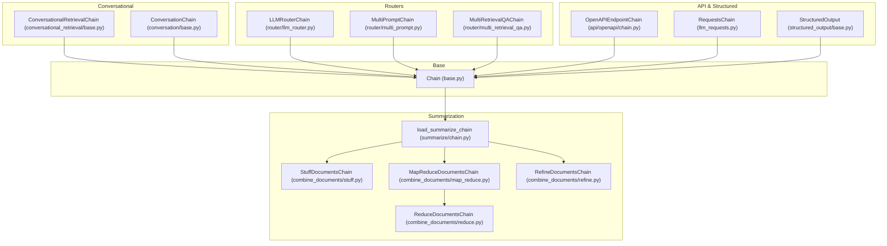

**Diagram sources**
- [chains/base.py](file://libs/langchain/langchain_classic/chains/base.py#L52-L520)
- [chains/summarize/chain.py](file://libs/langchain/langchain_classic/chains/summarize/chain.py#L196-L227)
- [chains/combine_documents/stuff.py](file://libs/langchain/langchain_classic/chains/combine_documents/stuff.py#L113-L292)
- [chains/combine_documents/map_reduce.py](file://libs/langchain/langchain_classic/chains/combine_documents/map_reduce.py#L29-L295)
- [chains/combine_documents/reduce.py](file://libs/langchain/langchain_classic/chains/combine_documents/reduce.py#L140-L390)
- [chains/combine_documents/refine.py](file://libs/langchain/langchain_classic/chains/combine_documents/refine.py#L33-L230)
- [chains/router/llm_router.py](file://libs/langchain/langchain_classic/chains/router/llm_router.py)
- [chains/router/multi_prompt.py](file://libs/langchain/langchain_classic/chains/router/multi_prompt.py)
- [chains/router/multi_retrieval_qa.py](file://libs/langchain/langchain_classic/chains/router/multi_retrieval_qa.py)
- [chains/conversational_retrieval/base.py](file://libs/langchain/langchain_classic/chains/conversational_retrieval/base.py)
- [chains/conversation/base.py](file://libs/langchain/langchain_classic/chains/conversation/base.py)
- [chains/api/openapi/chain.py](file://libs/langchain/langchain_classic/chains/api/openapi/chain.py)
- [chains/llm_requests.py](file://libs/langchain/langchain_classic/chains/llm_requests.py)
- [chains/structured_output/base.py](file://libs/langchain/langchain_classic/chains/structured_output/base.py)

## Detailed Component Analysis

### Summarization Chains
Summarization chains provide three strategies:
- Stuff: Concatenates all documents into a single prompt and passes to an LLM
- MapReduce: Applies a map step per document, then reduces summaries using a combine chain
- Refine: Iteratively refines a summary by incorporating each document

Implementation highlights:
- Factory function selects strategy and constructs appropriate chains
- Uses LLMChain and combine documents primitives
- Supports optional collapse during reduce for long intermediate results

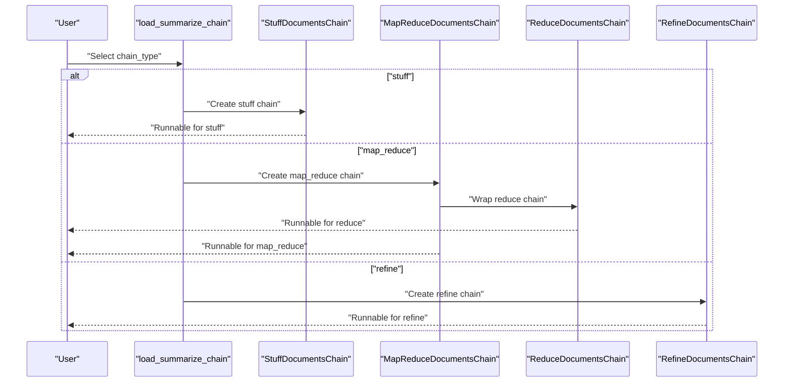

**Diagram sources**
- [chains/summarize/chain.py](file://libs/langchain/langchain_classic/chains/summarize/chain.py#L196-L227)
- [chains/combine_documents/stuff.py](file://libs/langchain/langchain_classic/chains/combine_documents/stuff.py#L113-L292)
- [chains/combine_documents/map_reduce.py](file://libs/langchain/langchain_classic/chains/combine_documents/map_reduce.py#L29-L295)
- [chains/combine_documents/reduce.py](file://libs/langchain/langchain_classic/chains/combine_documents/reduce.py#L140-L390)
- [chains/combine_documents/refine.py](file://libs/langchain/langchain_classic/chains/combine_documents/refine.py#L33-L230)

**Section sources**
- [chains/summarize/chain.py](file://libs/langchain/langchain_classic/chains/summarize/chain.py#L36-L227)
- [chains/combine_documents/stuff.py](file://libs/langchain/langchain_classic/chains/combine_documents/stuff.py#L25-L101)
- [chains/combine_documents/map_reduce.py](file://libs/langchain/langchain_classic/chains/combine_documents/map_reduce.py#L20-L96)
- [chains/combine_documents/refine.py](file://libs/langchain/langchain_classic/chains/combine_documents/refine.py#L24-L78)
- [chains/combine_documents/reduce.py](file://libs/langchain/langchain_classic/chains/combine_documents/reduce.py#L131-L202)

### Combine Documents Chains
The combine documents family provides primitives for processing document lists:
- StuffDocumentsChain: Formats and concatenates documents into a single input
- MapReduceDocumentsChain: Applies map and reduce steps with optional collapse
- ReduceDocumentsChain: Recursively collapses documents to fit token limits
- RefineDocumentsChain: Builds a refined summary iteratively

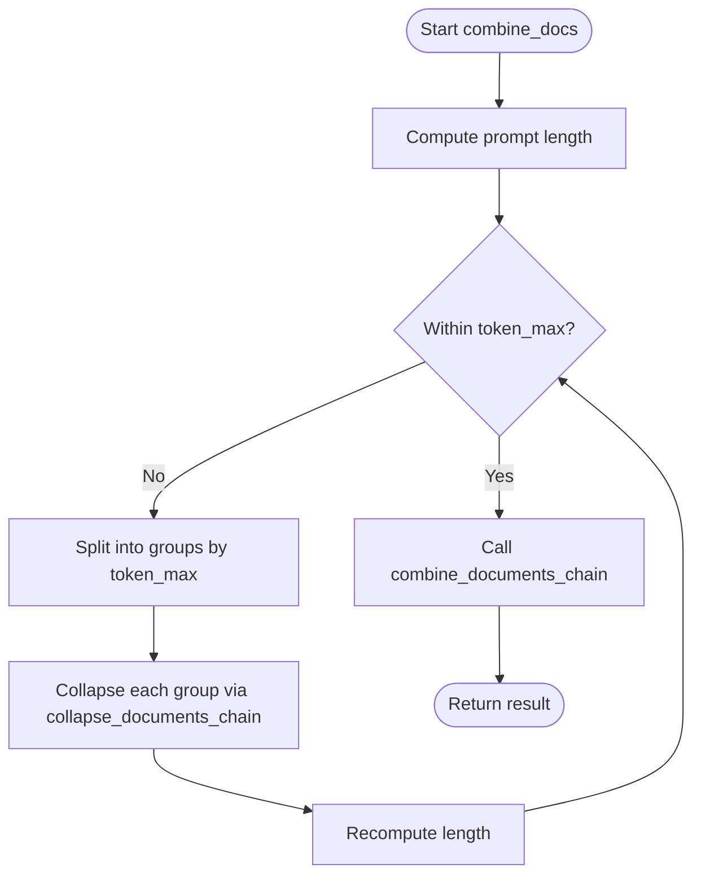

**Diagram sources**
- [chains/combine_documents/reduce.py](file://libs/langchain/langchain_classic/chains/combine_documents/reduce.py#L309-L385)

**Section sources**
- [chains/combine_documents/base.py](file://libs/langchain/langchain_classic/chains/combine_documents/base.py)
- [chains/combine_documents/stuff.py](file://libs/langchain/langchain_classic/chains/combine_documents/stuff.py#L113-L292)
- [chains/combine_documents/map_reduce.py](file://libs/langchain/langchain_classic/chains/combine_documents/map_reduce.py#L29-L295)
- [chains/combine_documents/refine.py](file://libs/langchain/langchain_classic/chains/combine_documents/refine.py#L33-L230)
- [chains/combine_documents/reduce.py](file://libs/langchain/langchain_classic/chains/combine_documents/reduce.py#L140-L390)

### Question Answering and QA-with-Sources
- Question answering chains: Provide strategies similar to summarization for QA tasks
- QA-with-sources chains: Retrieve relevant contexts and answer with citations/sources

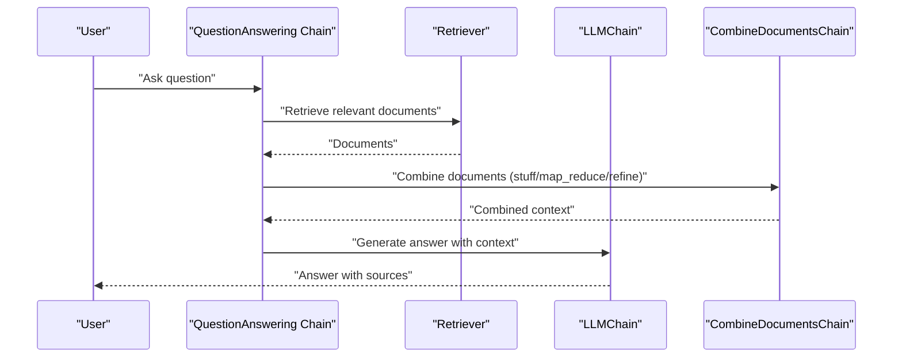

**Diagram sources**
- [chains/question_answering/chain.py](file://libs/langchain/langchain_classic/chains/question_answering/chain.py)
- [chains/qa_with_sources/retrieval.py](file://libs/langchain/langchain_classic/chains/qa_with_sources/retrieval.py)
- [chains/qa_with_sources/vector_db.py](file://libs/langchain/langchain_classic/chains/qa_with_sources/vector_db.py)

**Section sources**
- [chains/question_answering/chain.py](file://libs/langchain/langchain_classic/chains/question_answering/chain.py)
- [chains/qa_with_sources/base.py](file://libs/langchain/langchain_classic/chains/qa_with_sources/base.py)
- [chains/qa_with_sources/retrieval.py](file://libs/langchain/langchain_classic/chains/qa_with_sources/retrieval.py)
- [chains/qa_with_sources/vector_db.py](file://libs/langchain/langchain_classic/chains/qa_with_sources/vector_db.py)

### Conversational Retrieval and Memory
- Conversational retrieval chains: Integrate retrieval with conversation memory
- Conversation chains: Manage chat history and context

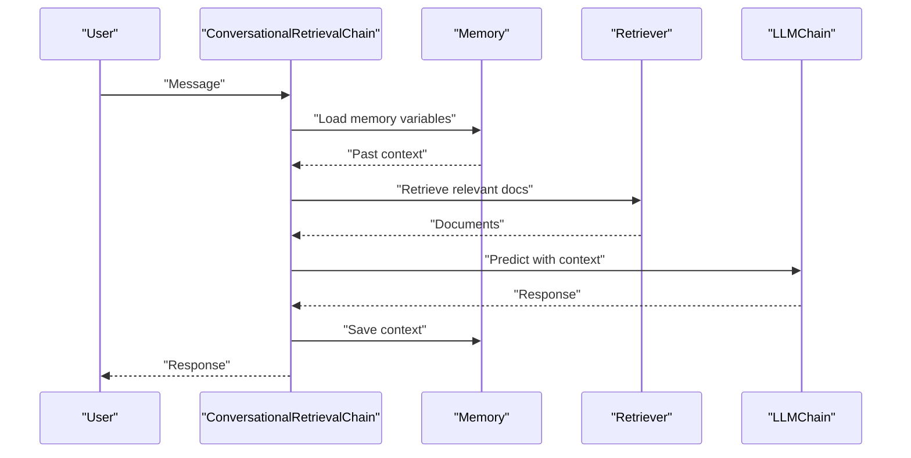

**Diagram sources**
- [chains/conversational_retrieval/base.py](file://libs/langchain/langchain_classic/chains/conversational_retrieval/base.py)
- [chains/conversation/base.py](file://libs/langchain/langchain_classic/chains/conversation/base.py)

**Section sources**
- [chains/conversational_retrieval/base.py](file://libs/langchain/langchain_classic/chains/conversational_retrieval/base.py)
- [chains/conversation/base.py](file://libs/langchain/langchain_classic/chains/conversation/base.py)

### API Integration and Data Transformation
- OpenAPI endpoint chains: Orchestrate API requests and responses
- Requests chain: Generic HTTP request chain
- Transform chain: Apply transformations to inputs/outputs
- Structured output chain: Enforce structured output schemas

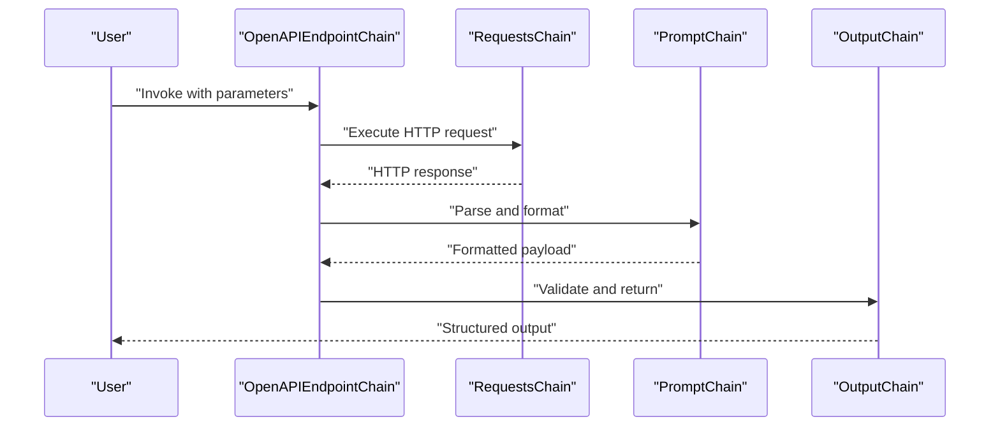

**Diagram sources**
- [chains/api/openapi/chain.py](file://libs/langchain/langchain_classic/chains/api/openapi/chain.py)
- [chains/api/openapi/requests_chain.py](file://libs/langchain/langchain_classic/chains/api/openapi/requests_chain.py)
- [chains/api/openapi/response_chain.py](file://libs/langchain/langchain_classic/chains/api/openapi/response_chain.py)
- [chains/llm_requests.py](file://libs/langchain/langchain_classic/chains/llm_requests.py)
- [chains/transform.py](file://libs/langchain/langchain_classic/chains/transform.py)
- [chains/structured_output/base.py](file://libs/langchain/langchain_classic/chains/structured_output/base.py)

**Section sources**
- [chains/api/base.py](file://libs/langchain/langchain_classic/chains/api/base.py)
- [chains/api/openapi/chain.py](file://libs/langchain/langchain_classic/chains/api/openapi/chain.py)
- [chains/api/openapi/requests_chain.py](file://libs/langchain/langchain_classic/chains/api/openapi/requests_chain.py)
- [chains/api/openapi/response_chain.py](file://libs/langchain/langchain_classic/chains/api/openapi/response_chain.py)
- [chains/llm_requests.py](file://libs/langchain/langchain_classic/chains/llm_requests.py)
- [chains/transform.py](file://libs/langchain/langchain_classic/chains/transform.py)
- [chains/structured_output/base.py](file://libs/langchain/langchain_classic/chains/structured_output/base.py)

### Specialized Chains for Content Generation and Multi-Document Workflows
- LLM math and checker chains: Validate and compute mathematical reasoning
- Summarization checker: Evaluate and improve summaries
- QA generation: Generate question-answer pairs
- FLARE: Fact-Checking and Retrieval Augmented Generation
- Constitutional AI: Enforce principles and safety checks
- Moderation: Filter content

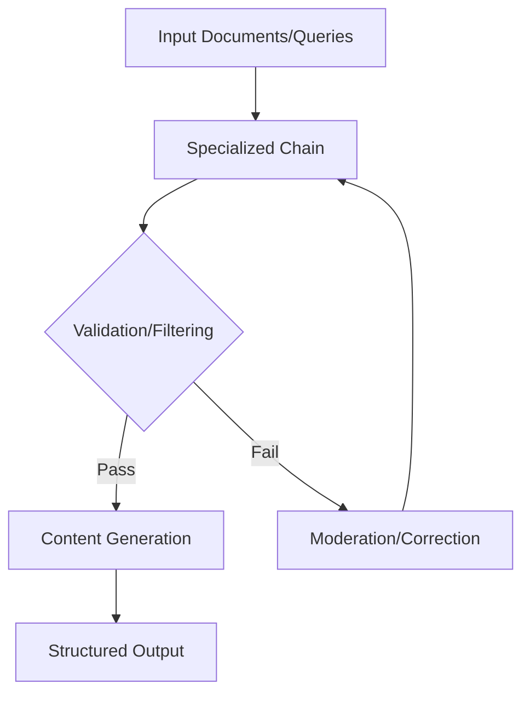

**Diagram sources**
- [chains/llm_math/base.py](file://libs/langchain/langchain_classic/chains/llm_math/base.py)
- [chains/llm_checker/base.py](file://libs/langchain/langchain_classic/chains/llm_checker/base.py)
- [chains/llm_summarization_checker/base.py](file://libs/langchain/langchain_classic/chains/llm_summarization_checker/base.py)
- [chains/qa_generation/base.py](file://libs/langchain/langchain_classic/chains/qa_generation/base.py)
- [chains/flare/base.py](file://libs/langchain/langchain_classic/chains/flare/base.py)
- [chains/constitutive_ai/base.py](file://libs/langchain/langchain_classic/chains/constitutional_ai/base.py)
- [chains/moderation.py](file://libs/langchain/langchain_classic/chains/moderation.py)

**Section sources**
- [chains/llm_math/base.py](file://libs/langchain/langchain_classic/chains/llm_math/base.py)
- [chains/llm_checker/base.py](file://libs/langchain/langchain_classic/chains/llm_checker/base.py)
- [chains/llm_summarization_checker/base.py](file://libs/langchain/langchain_classic/chains/llm_summarization_checker/base.py)
- [chains/qa_generation/base.py](file://libs/langchain/langchain_classic/chains/qa_generation/base.py)
- [chains/flare/base.py](file://libs/langchain/langchain_classic/chains/flare/base.py)
- [chains/constitutive_ai/base.py](file://libs/langchain/langchain_classic/chains/constitutional_ai/base.py)
- [chains/moderation.py](file://libs/langchain/langchain_classic/chains/moderation.py)

### Routers and Multi-Route Workflows
- LLM router: Route queries to the most suitable chain
- Multi-prompt and multi-retrieval QA: Distribute across multiple prompts/retrievers

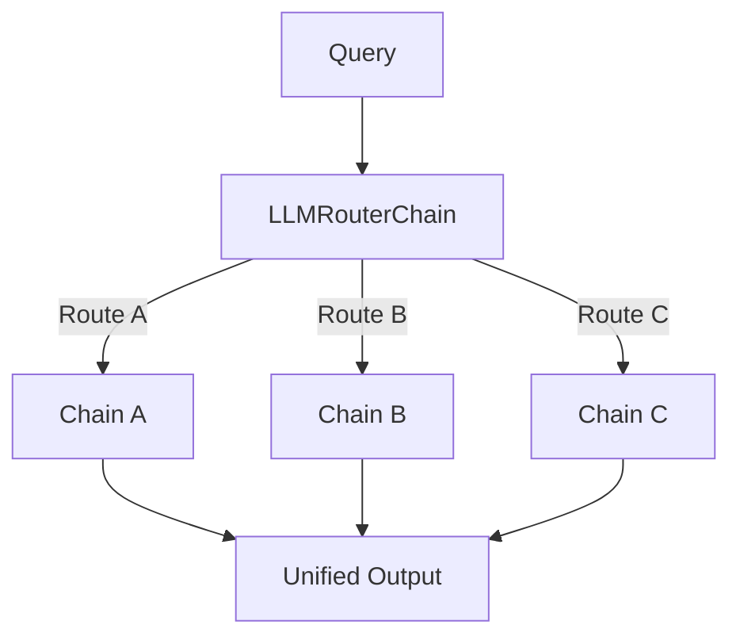

**Diagram sources**
- [chains/router/llm_router.py](file://libs/langchain/langchain_classic/chains/router/llm_router.py)
- [chains/router/multi_prompt.py](file://libs/langchain/langchain_classic/chains/router/multi_prompt.py)
- [chains/router/multi_retrieval_qa.py](file://libs/langchain/langchain_classic/chains/router/multi_retrieval_qa.py)

**Section sources**
- [chains/router/base.py](file://libs/langchain/langchain_classic/chains/router/base.py)
- [chains/router/llm_router.py](file://libs/langchain/langchain_classic/chains/router/llm_router.py)
- [chains/router/multi_prompt.py](file://libs/langchain/langchain_classic/chains/router/multi_prompt.py)
- [chains/router/multi_retrieval_qa.py](file://libs/langchain/langchain_classic/chains/router/multi_retrieval_qa.py)

### SQL, Graph, and Web Scraping Chains
- SQL database query chain: Generate and execute SQL queries
- Graph QA chains: Cypher and SPARQL over graph databases
- NATBOT: Web scraping and navigation

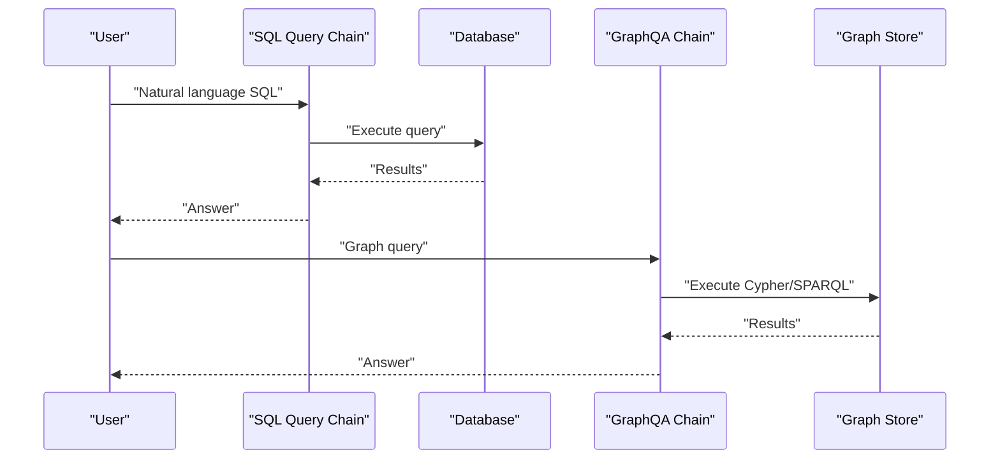

**Diagram sources**
- [chains/sql_database/query.py](file://libs/langchain/langchain_classic/chains/sql_database/query.py)
- [chains/graph_qa/base.py](file://libs/langchain/langchain_classic/chains/graph_qa/base.py)
- [chains/graph_qa/cypher.py](file://libs/langchain/langchain_classic/chains/graph_qa/cypher.py)
- [chains/graph_qa/sparql.py](file://libs/langchain/langchain_classic/chains/graph_qa/sparql.py)
- [chains/natbot/base.py](file://libs/langchain/langchain_classic/chains/natbot/base.py)
- [chains/natbot/crawler.py](file://libs/langchain/langchain_classic/chains/natbot/crawler.py)

**Section sources**
- [chains/sql_database/query.py](file://libs/langchain/langchain_classic/chains/sql_database/query.py)
- [chains/graph_qa/base.py](file://libs/langchain/langchain_classic/chains/graph_qa/base.py)
- [chains/graph_qa/cypher.py](file://libs/langchain/langchain_classic/chains/graph_qa/cypher.py)
- [chains/graph_qa/sparql.py](file://libs/langchain/langchain_classic/chains/graph_qa/sparql.py)
- [chains/natbot/base.py](file://libs/langchain/langchain_classic/chains/natbot/base.py)
- [chains/natbot/crawler.py](file://libs/langchain/langchain_classic/chains/natbot/crawler.py)

### Building Custom Specialized Chains
Guidelines:
- Extend the base Chain interface to define input/output schemas and execution logic
- Compose existing chains and primitives (combine documents, routers, retrievers)
- Integrate callbacks for observability and tracing
- Use memory for stateful behavior
- Leverage structured output parsers for predictable results

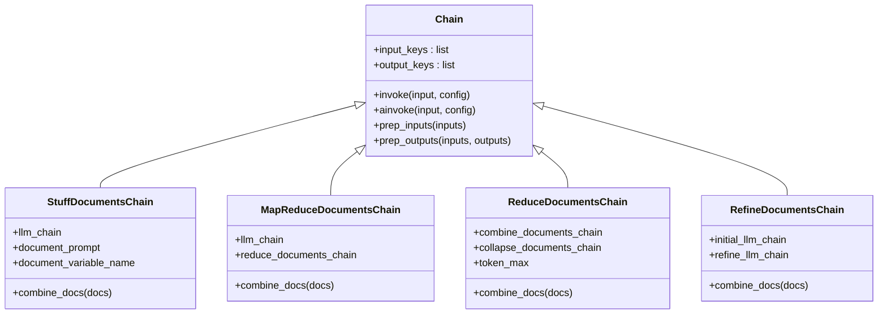

**Diagram sources**
- [chains/base.py](file://libs/langchain/langchain_classic/chains/base.py#L52-L520)
- [chains/combine_documents/stuff.py](file://libs/langchain/langchain_classic/chains/combine_documents/stuff.py#L113-L292)
- [chains/combine_documents/map_reduce.py](file://libs/langchain/langchain_classic/chains/combine_documents/map_reduce.py#L29-L295)
- [chains/combine_documents/reduce.py](file://libs/langchain/langchain_classic/chains/combine_documents/reduce.py#L140-L390)
- [chains/combine_documents/refine.py](file://libs/langchain/langchain_classic/chains/combine_documents/refine.py#L33-L230)

## Dependency Analysis
The chains package maintains a clean separation of concerns:
- Import delegation via a central registry maps chain names to implementations
- Combine documents primitives are reused across summarization and QA workflows
- Routers and retrieval chains integrate with external systems and databases
- API and structured-output chains encapsulate cross-cutting concerns

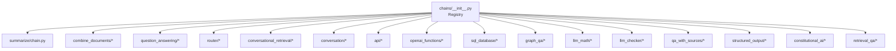

**Diagram sources**
- [chains/__init__.py](file://libs/langchain/langchain_classic/chains/__init__.py#L18-L97)

**Section sources**
- [chains/__init__.py](file://libs/langchain/langchain_classic/chains/__init__.py#L18-L97)

## Performance Considerations
- Token-aware batching: Use ReduceDocumentsChain to split long document sets and avoid exceeding context limits
- Parallel map steps: MapReduceDocumentsChain applies LLM chains in parallel over documents
- Collapsing intermediate results: Optional collapse chain reduces token usage during reduction
- Callbacks and run info: Enable profiling and monitoring of chain execution
- Asynchronous execution: Prefer ainvoke for concurrent workloads

Practical tips:
- Tune token_max to balance throughput and accuracy
- Use structured output parsers to reduce post-processing overhead
- Cache and reuse retriever results when appropriate
- Monitor callback metrics for bottlenecks

[No sources needed since this section provides general guidance]

## Troubleshooting Guide
Common issues and resolutions:
- Validation errors: Missing input keys or invalid output schemas trigger explicit errors during prep_inputs/prep_outputs
- Token overflow: ReduceDocumentsChain raises errors when a single document exceeds context length; use collapse or adjust token_max
- Callback conflicts: Using both callback_manager and callbacks is disallowed; prefer callbacks
- Deprecations: Some classes are deprecated; migrate to recommended replacements indicated by deprecation messages

Operational checks:
- Verify prompt variable names match chain expectations
- Confirm memory variables are properly loaded/saved
- Inspect run info and callback logs for detailed traces

**Section sources**
- [chains/base.py](file://libs/langchain/langchain_classic/chains/base.py#L289-L316)
- [chains/combine_documents/reduce.py](file://libs/langchain/langchain_classic/chains/combine_documents/reduce.py#L342-L345)
- [chains/base.py](file://libs/langchain/langchain_classic/chains/base.py#L245-L263)

## Conclusion
LangChain’s specialized chains provide a robust foundation for advanced workflows beyond basic QA and conversation. By composing document combination primitives, integrating routers and retrieval, and connecting to external APIs and databases, developers can build scalable, observable, and maintainable applications. The patterns outlined here enable efficient performance, reliable error handling, and extensibility for domain-specific needs.

[No sources needed since this section summarizes without analyzing specific files]

## Appendices
- Prompt templates for summarization and QA strategies are provided alongside each chain type
- Loaders and factories simplify constructing specialized chains from primitives
- History-aware retriever enables contextual retrieval in conversational settings

**Section sources**
- [chains/summarize/map_reduce_prompt.py](file://libs/langchain/langchain_classic/chains/summarize/map_reduce_prompt.py)
- [chains/summarize/refine_prompts.py](file://libs/langchain/langchain_classic/chains/summarize/refine_prompts.py)
- [chains/summarize/stuff_prompt.py](file://libs/langchain/langchain_classic/chains/summarize/stuff_prompt.py)
- [chains/question_answering/map_reduce_prompt.py](file://libs/langchain/langchain_classic/chains/question_answering/map_reduce_prompt.py)
- [chains/question_answering/map_rerank_prompt.py](file://libs/langchain/langchain_classic/chains/question_answering/map_rerank_prompt.py)
- [chains/question_answering/refine_prompts.py](file://libs/langchain/langchain_classic/chains/question_answering/refine_prompts.py)
- [chains/question_answering/stuff_prompt.py](file://libs/langchain/langchain_classic/chains/question_answering/stuff_prompt.py)
- [chains/qa_with_sources/map_reduce_prompt.py](file://libs/langchain/langchain_classic/chains/qa_with_sources/map_reduce_prompt.py)
- [chains/qa_with_sources/refine_prompts.py](file://libs/langchain/langchain_classic/chains/qa_with_sources/refine_prompts.py)
- [chains/qa_with_sources/stuff_prompt.py](file://libs/langchain/langchain_classic/chains/qa_with_sources/stuff_prompt.py)
- [chains/history_aware_retriever.py](file://libs/langchain/langchain_classic/chains/history_aware_retriever.py)
- [chains/loading.py](file://libs/langchain/langchain_classic/chains/loading.py)
- [chains/mapreduce.py](file://libs/langchain/langchain_classic/chains/mapreduce.py)
- [chains/prompt_selector.py](file://libs/langchain/langchain_classic/chains/prompt_selector.py)
- [chains/retrieval.py](file://libs/langchain/langchain_classic/chains/retrieval.py)
- [chains/retrieval_qa/base.py](file://libs/langchain/langchain_classic/chains/retrieval_qa/base.py)
- [chains/example_generator.py](file://libs/langchain/langchain_classic/chains/example_generator.py)
- [chains/llm.py](file://libs/langchain/langchain_classic/chains/llm.py)
- [chains/sequential.py](file://libs/langchain/langchain_classic/chains/sequential.py)
- [chains/transform.py](file://libs/langchain/langchain_classic/chains/transform.py)
- [chains/api/base.py](file://libs/langchain/langchain_classic/chains/api/base.py)
- [chains/api/news_docs.py](file://libs/langchain/langchain_classic/chains/api/news_docs.py)
- [chains/api/open_meteo_docs.py](file://libs/langchain/langchain_classic/chains/api/open_meteo_docs.py)
- [chains/api/podcast_docs.py](file://libs/langchain/langchain_classic/chains/api/podcast_docs.py)
- [chains/api/tmdb_docs.py](file://libs/langchain/langchain_classic/chains/api/tmdb_docs.py)
- [chains/api/prompt.py](file://libs/langchain/langchain_classic/chains/api/prompt.py)
- [chains/ernie_functions/base.py](file://libs/langchain/langchain_classic/chains/ernie_functions/base.py)
- [chains/openai_functions/base.py](file://libs/langchain/langchain_classic/chains/openai_functions/base.py)
- [chains/openai_functions/extraction.py](file://libs/langchain/langchain_classic/chains/openai_functions/extraction.py)
- [chains/openai_functions/tagging.py](file://libs/langchain/langchain_classic/chains/openai_functions/tagging.py)
- [chains/openai_functions/qa_with_structure.py](file://libs/langchain/langchain_classic/chains/openai_functions/qa_with_structure.py)
- [chains/openai_functions/openapi.py](file://libs/langchain/langchain_classic/chains/openai_functions/openapi.py)
- [chains/openai_functions/utils.py](file://libs/langchain/langchain_classic/chains/openai_functions/utils.py)
- [chains/constitutive_ai/base.py](file://libs/langchain/langchain_classic/chains/constitutional_ai/base.py)
- [chains/moderation.py](file://libs/langchain/langchain_classic/chains/moderation.py)