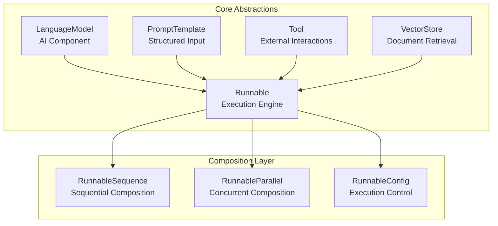
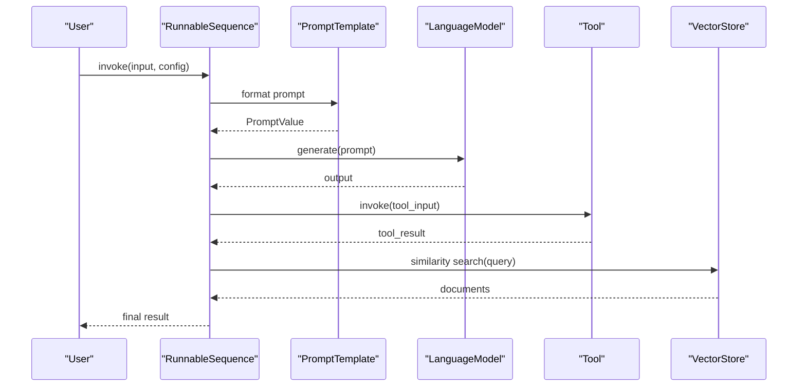
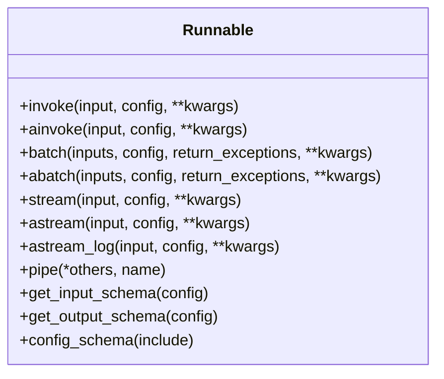
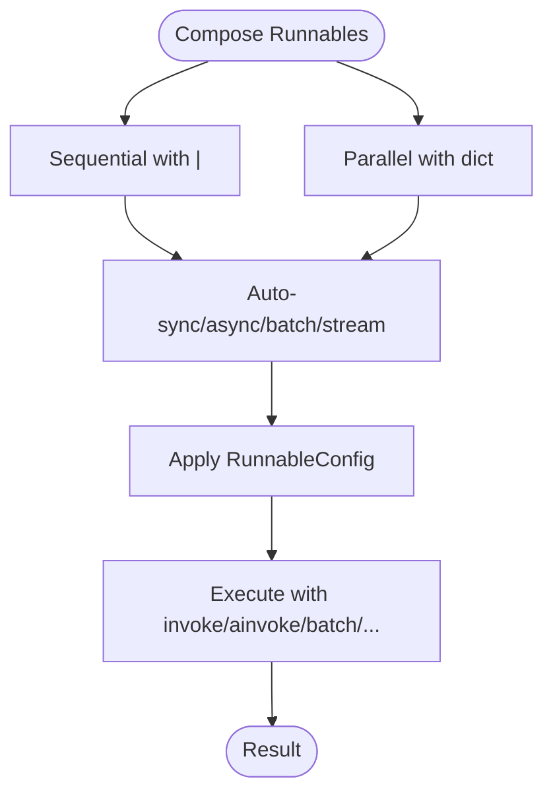
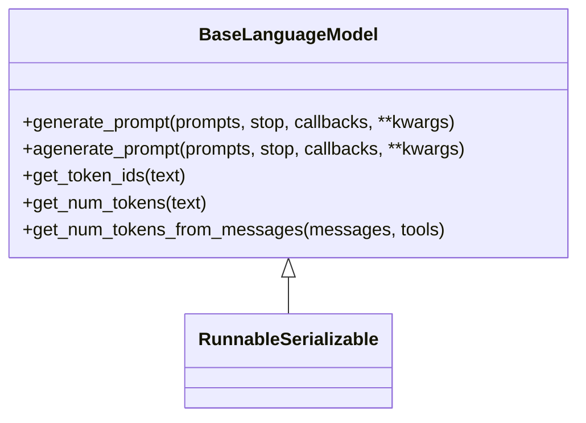
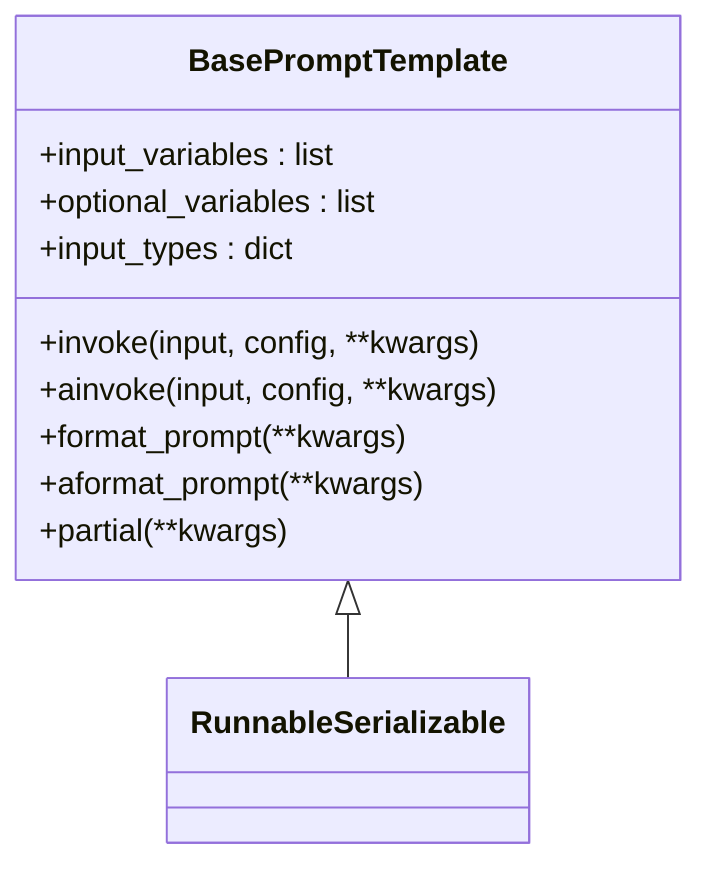
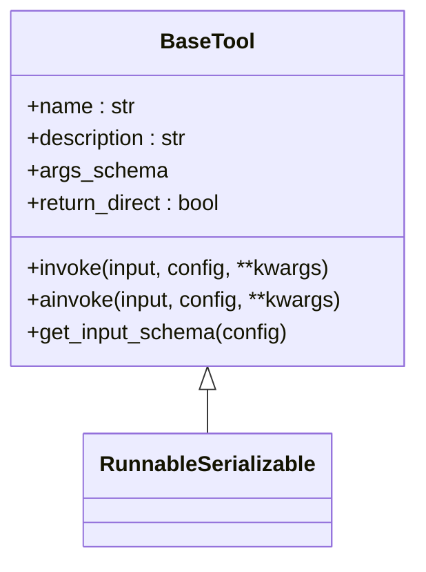
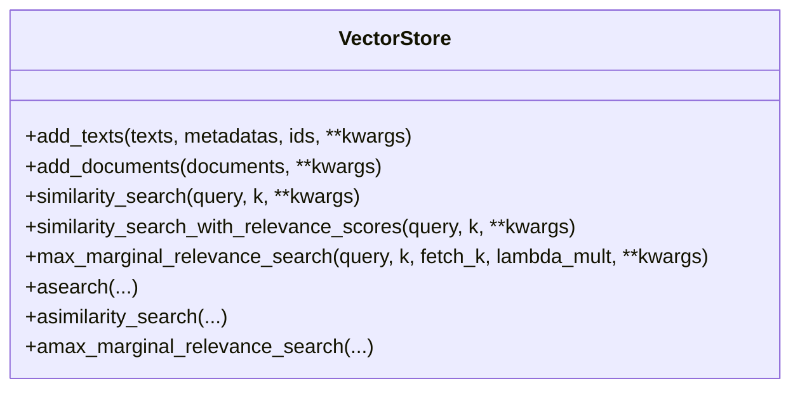
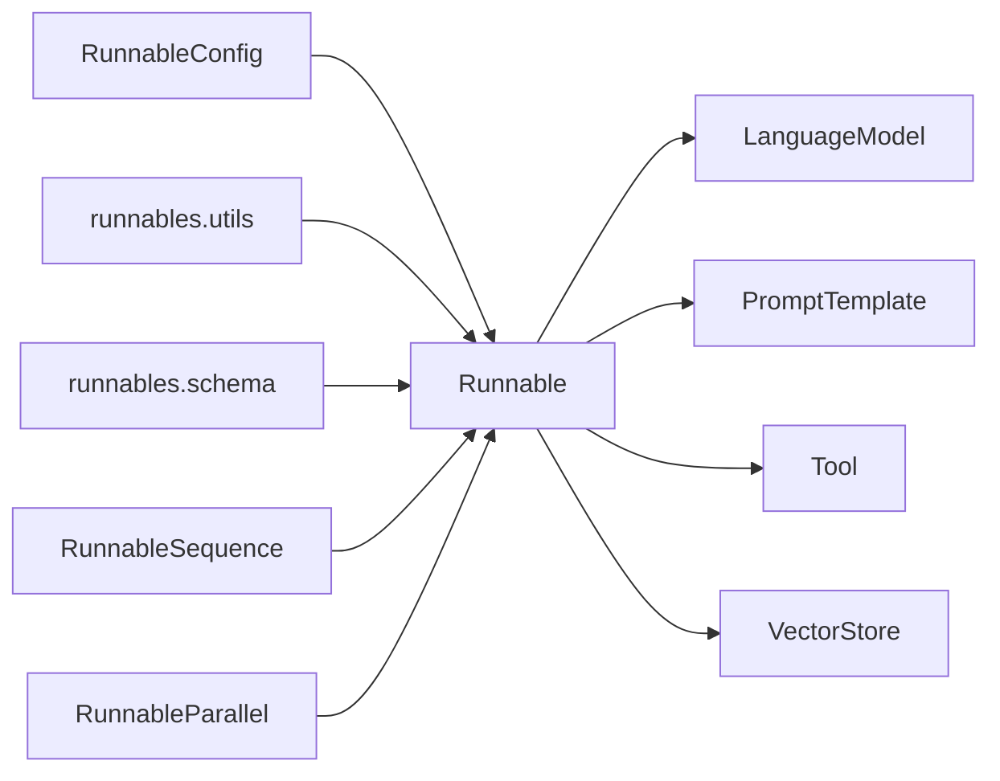

# Core Concepts

<cite>
**Referenced Files in This Document**
- [base.py](file://libs/core/langchain_core/runnables/base.py)
- [__init__.py](file://libs/core/langchain_core/runnables/__init__.py)
- [config.py](file://libs/core/langchain_core/runnables/config.py)
- [schema.py](file://libs/core/langchain_core/runnables/schema.py)
- [utils.py](file://libs/core/langchain_core/runnables/utils.py)
- [base.py](file://libs/core/langchain_core/language_models/base.py)
- [base.py](file://libs/core/langchain_core/prompts/base.py)
- [base.py](file://libs/core/langchain_core/tools/base.py)
- [base.py](file://libs/core/langchain_core/vectorstores/base.py)
</cite>

## Table of Contents
1. [Introduction](#introduction)
2. [Project Structure](#project-structure)
3. [Core Components](#core-components)
4. [Architecture Overview](#architecture-overview)
5. [Detailed Component Analysis](#detailed-component-analysis)
6. [Dependency Analysis](#dependency-analysis)
7. [Performance Considerations](#performance-considerations)
8. [Troubleshooting Guide](#troubleshooting-guide)
9. [Conclusion](#conclusion)

## Introduction
This document explains the core abstractions that underpin LangChain’s framework: Runnables as the central execution engine, Language Models as the core AI component, Prompts for structured input formatting, Tools for external interactions, and Vector Stores for document retrieval. It also covers the Runnable Expression Language (LCEL), how it enables declarative composition, the provider-agnostic architecture that lets you switch providers seamlessly, and the composability principles that make LangChain unique. Practical diagrams and example references show how these components interact and how higher-level abstractions build upon these fundamentals.

## Project Structure
LangChain’s core concepts live primarily in the langchain_core library. The Runnables module defines the central execution engine and composition primitives. Language Models, Prompts, Tools, and Vector Stores are defined as specialized Runnables or closely integrated with them. The LCEL ecosystem exposes a unified interface for building, composing, and running chains.

**Diagram sources**
- [base.py](file://libs/core/langchain_core/runnables/base.py#L124-L256)
- [__init__.py](file://libs/core/langchain_core/runnables/__init__.py#L1-L137)
- [config.py](file://libs/core/langchain_core/runnables/config.py#L51-L124)
- [base.py](file://libs/core/langchain_core/language_models/base.py#L131-L138)
- [base.py](file://libs/core/langchain_core/prompts/base.py#L39-L41)
- [base.py](file://libs/core/langchain_core/tools/base.py#L405-L411)
- [base.py](file://libs/core/langchain_core/vectorstores/base.py#L43-L44)

**Section sources**
- [base.py](file://libs/core/langchain_core/runnables/base.py#L124-L256)
- [__init__.py](file://libs/core/langchain_core/runnables/__init__.py#L1-L137)

## Core Components
- Runnable: The central abstraction representing a unit of work supporting synchronous, asynchronous, batch, and streaming execution. It defines a uniform interface for composition and introspection.
- Language Model: A specialized Runnable that generates text or structured outputs from prompts or messages.
- Prompt Template: A Runnable that formats inputs into a standardized prompt value for language models.
- Tool: A Runnable that encapsulates external actions and can be invoked by agents; it validates inputs and returns structured outputs.
- Vector Store: A specialized component for storing and retrieving embeddings; integrates with retrievers and chains for retrieval-augmented generation.

These components share a common execution model and configuration system, enabling seamless composition and provider-agnostic behavior.

**Section sources**
- [base.py](file://libs/core/langchain_core/runnables/base.py#L124-L256)
- [base.py](file://libs/core/langchain_core/language_models/base.py#L131-L138)
- [base.py](file://libs/core/langchain_core/prompts/base.py#L39-L41)
- [base.py](file://libs/core/langchain_core/tools/base.py#L405-L411)
- [base.py](file://libs/core/langchain_core/vectorstores/base.py#L43-L44)

## Architecture Overview
LangChain’s architecture is built around Runnables and LCEL. Runnables implement a common contract for invocation, batching, streaming, and logging. LCEL composes Runnables into sequences and parallel branches, preserving all capabilities. Language Models, Prompts, Tools, and Vector Stores are all Runnables or integrate tightly with the Runnable ecosystem.

**Diagram sources**
- [base.py](file://libs/core/langchain_core/runnables/base.py#L2813-L2840)
- [base.py](file://libs/core/langchain_core/prompts/base.py#L206-L255)
- [base.py](file://libs/core/langchain_core/language_models/base.py#L198-L240)
- [base.py](file://libs/core/langchain_core/tools/base.py#L635-L652)
- [base.py](file://libs/core/langchain_core/vectorstores/base.py#L293-L324)

## Detailed Component Analysis

### Runnable: The Central Execution Engine
Runnable defines the core interface and capabilities:
- Invocation: invoke/ainvoke for single inputs
- Batching: batch/abatch with parallel execution and exception handling
- Streaming: stream/astream and astream_log for incremental outputs and events
- Composition: pipe and | operators to build sequences and parallel branches
- Configuration: a rich config model for tracing, concurrency, and metadata
- Schema inference: automatic input/output schemas for validation and documentation

**Diagram sources**
- [base.py](file://libs/core/langchain_core/runnables/base.py#L822-L1200)
- [config.py](file://libs/core/langchain_core/runnables/config.py#L51-L124)

**Section sources**
- [base.py](file://libs/core/langchain_core/runnables/base.py#L124-L256)
- [base.py](file://libs/core/langchain_core/runnables/base.py#L822-L1200)
- [config.py](file://libs/core/langchain_core/runnables/config.py#L51-L124)

### Runnable Expression Language (LCEL)
LCEL is the declarative composition system built on Runnables:
- Sequential composition with | to chain Runnables
- Parallel composition with dict literals to run multiple Runnables concurrently
- Branching, routing, and fallbacks for advanced control flow
- Automatic propagation of async, batch, and streaming semantics across composed chains
- Configurable fields and alternatives for runtime customization

**Diagram sources**
- [base.py](file://libs/core/langchain_core/runnables/base.py#L618-L658)
- [base.py](file://libs/core/langchain_core/runnables/base.py#L124-L256)
- [__init__.py](file://libs/core/langchain_core/runnables/__init__.py#L63-L93)

**Section sources**
- [base.py](file://libs/core/langchain_core/runnables/base.py#L618-L658)
- [__init__.py](file://libs/core/langchain_core/runnables/__init__.py#L1-L137)

### Language Models: Provider-Agnostic AI Component
Language Models are Runnables that accept prompts or messages and return text or structured outputs. They expose:
- generate_prompt and agenerate_prompt for batched generation
- Token counting helpers and schema-based structured output support
- Provider-agnostic interfaces that enable swapping providers transparently

**Diagram sources**
- [base.py](file://libs/core/langchain_core/language_models/base.py#L131-L138)
- [base.py](file://libs/core/langchain_core/language_models/base.py#L198-L240)

**Section sources**
- [base.py](file://libs/core/langchain_core/language_models/base.py#L131-L138)
- [base.py](file://libs/core/langchain_core/language_models/base.py#L198-L240)

### Prompts: Structured Input Formatting
Prompt Templates are Runnables that:
- Validate required and optional variables
- Format inputs into StringPromptValue or ChatPromptValue
- Support partial templates and serialization
- Integrate with tracing and metadata

**Diagram sources**
- [base.py](file://libs/core/langchain_core/prompts/base.py#L39-L41)
- [base.py](file://libs/core/langchain_core/prompts/base.py#L206-L255)

**Section sources**
- [base.py](file://libs/core/langchain_core/prompts/base.py#L39-L41)
- [base.py](file://libs/core/langchain_core/prompts/base.py#L138-L157)
- [base.py](file://libs/core/langchain_core/prompts/base.py#L206-L255)

### Tools: External Interactions
Tools are Runnables that:
- Accept string, dict, or ToolCall inputs
- Validate arguments using Pydantic schemas or inferred signatures
- Support synchronous and asynchronous execution
- Return content or content-and-artifact outputs

**Diagram sources**
- [base.py](file://libs/core/langchain_core/tools/base.py#L405-L411)
- [base.py](file://libs/core/langchain_core/tools/base.py#L635-L652)

**Section sources**
- [base.py](file://libs/core/langchain_core/tools/base.py#L405-L411)
- [base.py](file://libs/core/langchain_core/tools/base.py#L635-L652)

### Vector Stores: Document Retrieval
Vector Stores provide:
- Adding and retrieving documents by embedding similarity
- Maximal marginal relevance (MMR) and threshold-based filtering
- Async variants for non-blocking operations
- Integration with retrievers and downstream chains

**Diagram sources**
- [base.py](file://libs/core/langchain_core/vectorstores/base.py#L43-L44)
- [base.py](file://libs/core/langchain_core/vectorstores/base.py#L293-L324)

**Section sources**
- [base.py](file://libs/core/langchain_core/vectorstores/base.py#L43-L44)
- [base.py](file://libs/core/langchain_core/vectorstores/base.py#L293-L324)

## Dependency Analysis
The core abstractions are loosely coupled and highly cohesive:
- Runnables depend on a shared configuration model and utilities for async, batching, and schema inference.
- Language Models, Prompts, Tools, and Vector Stores all inherit from or integrate with Runnable.
- LCEL primitives (sequences, parallels, branches) are thin wrappers that preserve capabilities across components.

**Diagram sources**
- [config.py](file://libs/core/langchain_core/runnables/config.py#L51-L124)
- [utils.py](file://libs/core/langchain_core/runnables/utils.py#L44-L46)
- [schema.py](file://libs/core/langchain_core/runnables/schema.py#L13-L189)
- [base.py](file://libs/core/langchain_core/runnables/base.py#L124-L256)

**Section sources**
- [config.py](file://libs/core/langchain_core/runnables/config.py#L51-L124)
- [utils.py](file://libs/core/langchain_core/runnables/utils.py#L44-L46)
- [schema.py](file://libs/core/langchain_core/runnables/schema.py#L13-L189)
- [base.py](file://libs/core/langchain_core/runnables/base.py#L124-L256)

## Performance Considerations
- Concurrency and batching: Use RunnableConfig.max_concurrency and built-in batch methods to parallelize IO-bound tasks.
- Streaming: Prefer streaming APIs for responsive UX and reduced latency.
- Token counting: Use model-specific tokenizers for accurate context window checks.
- Vector search tuning: Adjust k, fetch_k, and lambda_mult for MMR to balance relevance and diversity.
- Async-first design: Favor async methods and gather_with_concurrency for high-throughput scenarios.

[No sources needed since this section provides general guidance]

## Troubleshooting Guide
- Schema mismatches: Use get_input_schema/get_output_schema to diagnose expected types.
- Tracing and events: Use astream_events and standard StreamEvent payloads to inspect execution.
- Configuration propagation: Ensure configs are merged and propagated correctly across nested Runnables.
- Tool validation errors: Inspect args_schema and handle ToolException appropriately.

**Section sources**
- [base.py](file://libs/core/langchain_core/runnables/base.py#L366-L518)
- [schema.py](file://libs/core/langchain_core/runnables/schema.py#L13-L189)
- [config.py](file://libs/core/langchain_core/runnables/config.py#L357-L421)
- [base.py](file://libs/core/langchain_core/tools/base.py#L390-L398)

## Conclusion
LangChain’s core concepts—Runnables, LCEL, Language Models, Prompts, Tools, and Vector Stores—are unified by a common execution model and configuration system. This foundation enables provider-agnostic behavior, robust composability, and production-ready capabilities like async execution, batching, and streaming. Understanding these abstractions is essential for building scalable, maintainable applications that integrate AI with external systems and data.