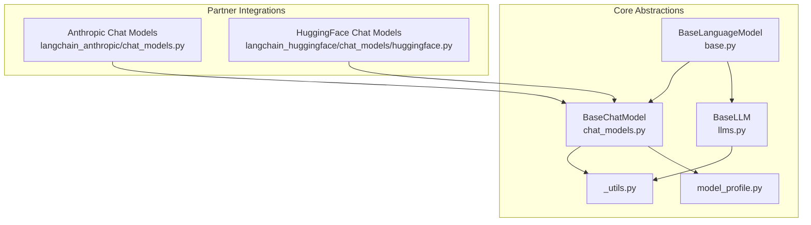
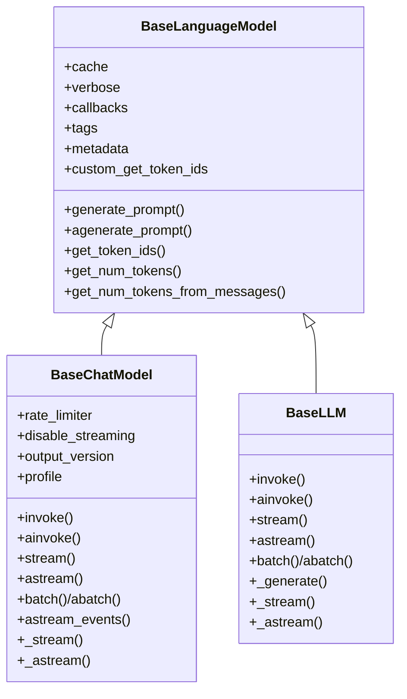
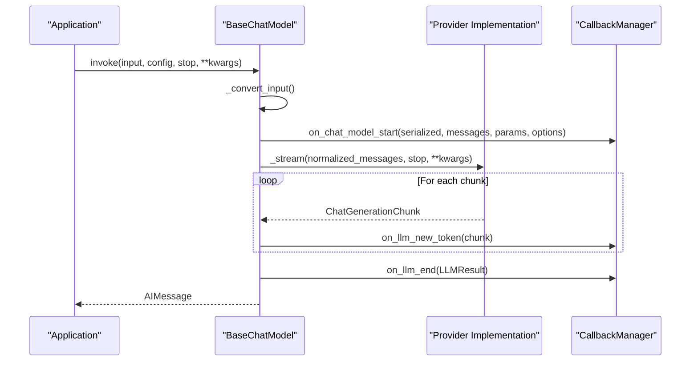
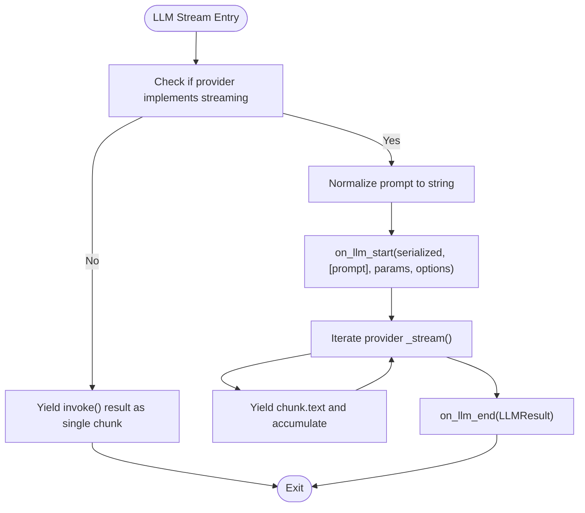
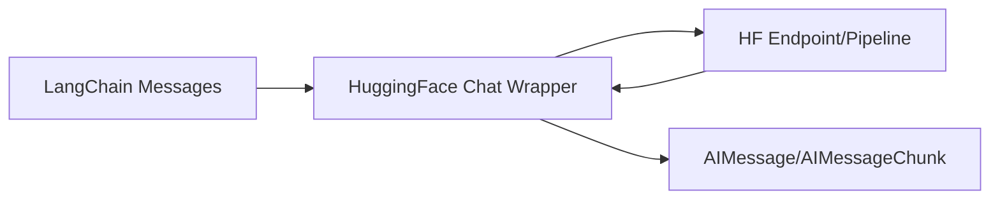
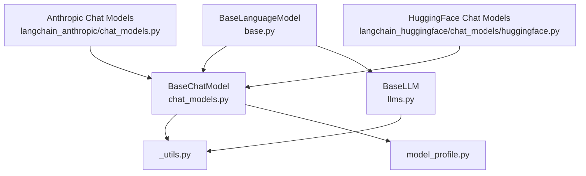

# Language Models Abstraction

<cite>
**Referenced Files in This Document**
- [base.py](file://libs/core/langchain_core/language_models/base.py)
- [chat_models.py](file://libs/core/langchain_core/language_models/chat_models.py)
- [llms.py](file://libs/core/langchain_core/language_models/llms.py)
- [__init__.py](file://libs/core/langchain_core/language_models/__init__.py)
- [_utils.py](file://libs/core/langchain_core/language_models/_utils.py)
- [model_profile.py](file://libs/core/langchain_core/language_models/model_profile.py)
- [chat_models.py](file://libs/partners/anthropic/langchain_anthropic/chat_models.py)
- [huggingface.py](file://libs/partners/huggingface/langchain_huggingface/chat_models/huggingface.py)
</cite>

## Table of Contents
1. [Introduction](#introduction)
2. [Project Structure](#project-structure)
3. [Core Components](#core-components)
4. [Architecture Overview](#architecture-overview)
5. [Detailed Component Analysis](#detailed-component-analysis)
6. [Dependency Analysis](#dependency-analysis)
7. [Performance Considerations](#performance-considerations)
8. [Troubleshooting Guide](#troubleshooting-guide)
9. [Conclusion](#conclusion)
10. [Appendices](#appendices)

## Introduction
This document explains LangChain’s language models abstraction layer with a focus on the provider-agnostic design that enables seamless switching among different model providers. It covers the BaseLanguageModel, BaseChatModel, and BaseLLM interfaces, common patterns for implementing custom models and integrating new providers, message formatting for chat models versus text completion for LLMs, configuration options, streaming support, error handling patterns, model selection strategies, performance considerations, and guidance for extending the abstraction to new model types and providers.

## Project Structure
LangChain’s core language model abstractions live under the core library and are complemented by partner integrations for providers such as Anthropic and HuggingFace. The core abstractions define the interfaces and shared behavior, while partner packages implement provider-specific logic and profiles.

**Diagram sources**
- [base.py](file://libs/core/langchain_core/language_models/base.py#L131-L366)
- [chat_models.py](file://libs/core/langchain_core/language_models/chat_models.py#L246-L800)
- [llms.py](file://libs/core/langchain_core/language_models/llms.py#L292-L800)
- [_utils.py](file://libs/core/langchain_core/language_models/_utils.py#L124-L328)
- [model_profile.py](file://libs/core/langchain_core/language_models/model_profile.py#L6-L86)
- [chat_models.py](file://libs/partners/anthropic/langchain_anthropic/chat_models.py#L1-L200)
- [huggingface.py](file://libs/partners/huggingface/langchain_huggingface/chat_models/huggingface.py#L1-L200)

**Section sources**
- [__init__.py](file://libs/core/langchain_core/language_models/__init__.py#L1-L117)

## Core Components
- BaseLanguageModel: The foundational abstract class that defines the provider-agnostic interface for language models. It standardizes caching, verbosity, callbacks, tags, metadata, token counting, and the contract for generating results from prompts. It inherits from a runnable interface to unify invocation, batching, streaming, and composition patterns.
- BaseChatModel: Specialized for chat-style interactions using sequences of messages. It provides a unified interface for invoking, streaming, and batching chat models, with robust support for tool calling, structured output, rate limiting, and tracing. It normalizes message formats and handles streaming with chunk merging and metadata propagation.
- BaseLLM: Specialized for legacy text-completion models that take a string and return a string. It exposes the same runnable interface and integrates with the same caching and tracing mechanisms, while supporting streaming and batching.

Key shared capabilities:
- Token counting and tokenization helpers
- LangSmith tracing parameters
- Caching integration
- Callback and tracing hooks
- Streaming and async streaming support
- Batch and async batch execution

**Section sources**
- [base.py](file://libs/core/langchain_core/language_models/base.py#L131-L366)
- [chat_models.py](file://libs/core/langchain_core/language_models/chat_models.py#L246-L800)
- [llms.py](file://libs/core/langchain_core/language_models/llms.py#L292-L800)

## Architecture Overview
The abstraction layer is designed around a common runnable interface and shared utilities. Providers implement provider-specific logic while adhering to the same input/output contracts and lifecycle hooks.

**Diagram sources**
- [base.py](file://libs/core/langchain_core/language_models/base.py#L131-L366)
- [chat_models.py](file://libs/core/langchain_core/language_models/chat_models.py#L246-L800)
- [llms.py](file://libs/core/langchain_core/language_models/llms.py#L292-L800)

## Detailed Component Analysis

### BaseLanguageModel
- Purpose: Defines the provider-agnostic contract for language models, including prompt-based generation, token counting, and tracing parameters.
- Key responsibilities:
  - Standardized input types via a unified prompt-like interface
  - Token counting with a fallback tokenizer and extensible custom encoder
  - Caching integration and verbosity controls
  - Callbacks and metadata propagation
  - Abstract methods for synchronous and asynchronous generation
- Important behaviors:
  - Token counting defaults to a GPT-2 tokenizer with a warning when transformers is unavailable
  - Tokenization can be overridden per-model for accuracy
  - Provides a schema-friendly input type for runnables

**Section sources**
- [base.py](file://libs/core/langchain_core/language_models/base.py#L131-L366)

### BaseChatModel
- Purpose: Provides a unified interface for chat models using message sequences.
- Key responsibilities:
  - Input conversion from strings, message lists, or prompt values to chat prompts
  - Invocation, streaming, and batching with robust error handling and metadata propagation
  - Streaming detection logic that respects provider capability, instance flags, and runtime options
  - Message normalization and content-block translation for multimodal inputs
  - Structured output and tool-calling support
  - Rate limiting and tracing integration
- Notable features:
  - Streaming fallback to non-streaming when provider does not implement streaming
  - Output versioning for content blocks
  - Profile-driven capability hints

**Diagram sources**
- [chat_models.py](file://libs/core/langchain_core/language_models/chat_models.py#L480-L734)

**Section sources**
- [chat_models.py](file://libs/core/langchain_core/language_models/chat_models.py#L246-L800)
- [_utils.py](file://libs/core/langchain_core/language_models/_utils.py#L124-L328)

### BaseLLM
- Purpose: Provides a unified interface for legacy text-completion models.
- Key responsibilities:
  - Input conversion from strings, message lists, or prompt values to string prompts
  - Invocation, streaming, and batching with chunk aggregation
  - Retry and caching utilities
  - Tracing parameters for LangSmith
- Notable features:
  - Streaming fallback to non-streaming when provider does not implement streaming
  - Batch execution with concurrency control
  - Async variants for non-streaming and streaming

**Diagram sources**
- [llms.py](file://libs/core/langchain_core/language_models/llms.py#L508-L644)

**Section sources**
- [llms.py](file://libs/core/langchain_core/language_models/llms.py#L292-L800)

### Provider Implementations and Integration Patterns
- Anthropic:
  - Inherits from BaseChatModel and implements provider-specific logic for messages, tool calling, and structured output.
  - Uses model profiles to describe capabilities and supports multimodal inputs/outputs.
- HuggingFace:
  - Provides a chat wrapper that converts LangChain messages to provider-specific dictionaries and back, handling tool calls and structured outputs.
  - Integrates with endpoint and pipeline backends.

**Diagram sources**
- [huggingface.py](file://libs/partners/huggingface/langchain_huggingface/chat_models/huggingface.py#L125-L200)
- [chat_models.py](file://libs/partners/anthropic/langchain_anthropic/chat_models.py#L1-L200)

**Section sources**
- [chat_models.py](file://libs/partners/anthropic/langchain_anthropic/chat_models.py#L1-L200)
- [huggingface.py](file://libs/partners/huggingface/langchain_huggingface/chat_models/huggingface.py#L1-L200)

## Dependency Analysis
- Core abstractions depend on:
  - Runnable interfaces for composability
  - Callback managers for tracing and streaming
  - Utilities for message normalization and content-block translation
  - Model profiles for capability hints
- Provider integrations depend on:
  - Core abstractions for behavior
  - Provider SDKs for API calls
  - Profiles for capability discovery

**Diagram sources**
- [base.py](file://libs/core/langchain_core/language_models/base.py#L131-L366)
- [chat_models.py](file://libs/core/langchain_core/language_models/chat_models.py#L246-L800)
- [llms.py](file://libs/core/langchain_core/language_models/llms.py#L292-L800)
- [_utils.py](file://libs/core/langchain_core/language_models/_utils.py#L124-L328)
- [model_profile.py](file://libs/core/langchain_core/language_models/model_profile.py#L6-L86)
- [chat_models.py](file://libs/partners/anthropic/langchain_anthropic/chat_models.py#L1-L200)
- [huggingface.py](file://libs/partners/huggingface/langchain_huggingface/chat_models/huggingface.py#L1-L200)

**Section sources**
- [__init__.py](file://libs/core/langchain_core/language_models/__init__.py#L85-L117)

## Performance Considerations
- Streaming:
  - Prefer streaming for real-time feedback and reduced latency. BaseChatModel and BaseLLM detect provider capability and gracefully fall back when unsupported.
- Batching:
  - Use batch and abatch for throughput improvements when providers support it. BaseLLM supports concurrency control via configuration.
- Caching:
  - Enable caching to reduce repeated calls. BaseLanguageModel supports global or explicit cache instances; note that caching is not supported for streaming methods.
- Token counting:
  - Override token counting with model-specific tokenizers for accurate context-window checks and cost estimation.
- Rate limiting:
  - Use the rate limiter field on BaseChatModel to smooth bursty traffic.

[No sources needed since this section provides general guidance]

## Troubleshooting Guide
- Streaming errors:
  - When streaming is not supported by a provider, the abstraction falls back to non-streaming. Inspect provider-specific flags and runtime options to ensure streaming is enabled.
- Empty streams:
  - If no generations are returned, the streaming logic raises an error. Verify provider responses and ensure proper chunk handling.
- Tracing metadata:
  - When errors occur during streaming, metadata such as status codes and response bodies are attached to AIMessage for diagnostics.
- Token counting failures:
  - If transformers is not installed, a fallback tokenizer is used with a warning. Install transformers for accurate tokenization.

**Section sources**
- [chat_models.py](file://libs/core/langchain_core/language_models/chat_models.py#L182-L225)
- [chat_models.py](file://libs/core/langchain_core/language_models/chat_models.py#L581-L603)
- [base.py](file://libs/core/langchain_core/language_models/base.py#L93-L112)

## Conclusion
LangChain’s language models abstraction layer provides a consistent, provider-agnostic interface across chat and legacy text-completion models. By leveraging shared runnables, callbacks, tracing, and utilities, developers can integrate new providers and switch between them with minimal code changes. The design supports streaming, batching, caching, and structured outputs, enabling robust and scalable applications.

[No sources needed since this section summarizes without analyzing specific files]

## Appendices

### Working with OpenAI, Anthropic, HuggingFace, and Other Providers
- OpenAI:
  - Use the dedicated OpenAI integration package to leverage chat and legacy LLM wrappers that inherit from BaseChatModel and BaseLLM.
- Anthropic:
  - Inherits from BaseChatModel and implements provider-specific message handling, tool calling, and structured output.
- HuggingFace:
  - Provides a chat wrapper that translates LangChain messages to provider-specific dictionaries and back, supporting tool calls and structured outputs.

**Section sources**
- [chat_models.py](file://libs/partners/anthropic/langchain_anthropic/chat_models.py#L1-L200)
- [huggingface.py](file://libs/partners/huggingface/langchain_huggingface/chat_models/huggingface.py#L1-L200)

### Configuration Options and Best Practices
- Common fields:
  - cache, verbose, callbacks, tags, metadata, custom_get_token_ids
- Chat-specific:
  - rate_limiter, disable_streaming, output_version, profile
- Streaming:
  - Respect provider capabilities; use disable_streaming to force non-streaming when needed
- Structured output:
  - Use provider-specific tool/schema support integrated into chat models
- Model profiles:
  - Use profiles to discover capabilities such as multimodality, tool calling, and structured output

**Section sources**
- [base.py](file://libs/core/langchain_core/language_models/base.py#L140-L167)
- [chat_models.py](file://libs/core/langchain_core/language_models/chat_models.py#L296-L354)
- [model_profile.py](file://libs/core/langchain_core/language_models/model_profile.py#L6-L86)

### Extending the Abstraction for New Model Types and Providers
- Implement a new chat model:
  - Inherit from BaseChatModel and implement _generate and optionally _stream, _agenerate, and _astream
  - Define _llm_type and optionally _identifying_params for tracing
  - Integrate with provider SDKs and normalize messages using shared utilities
- Implement a new legacy LLM:
  - Inherit from BaseLLM and implement _generate and optionally _stream, _agenerate, and _astream
  - Provide tracing parameters and integrate caching and retry utilities
- Add model profiles:
  - Contribute a registry mapping model identifiers to capabilities for discovery and selection

**Section sources**
- [chat_models.py](file://libs/core/langchain_core/language_models/chat_models.py#L246-L294)
- [llms.py](file://libs/core/langchain_core/language_models/llms.py#L292-L700)
- [model_profile.py](file://libs/core/langchain_core/language_models/model_profile.py#L6-L86)