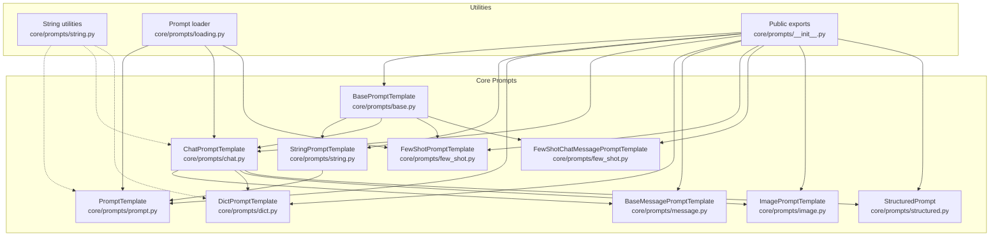
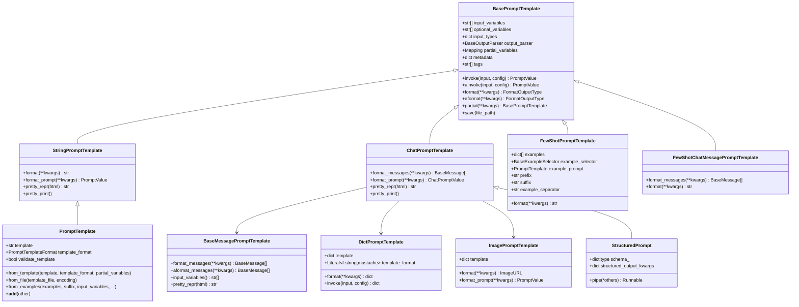
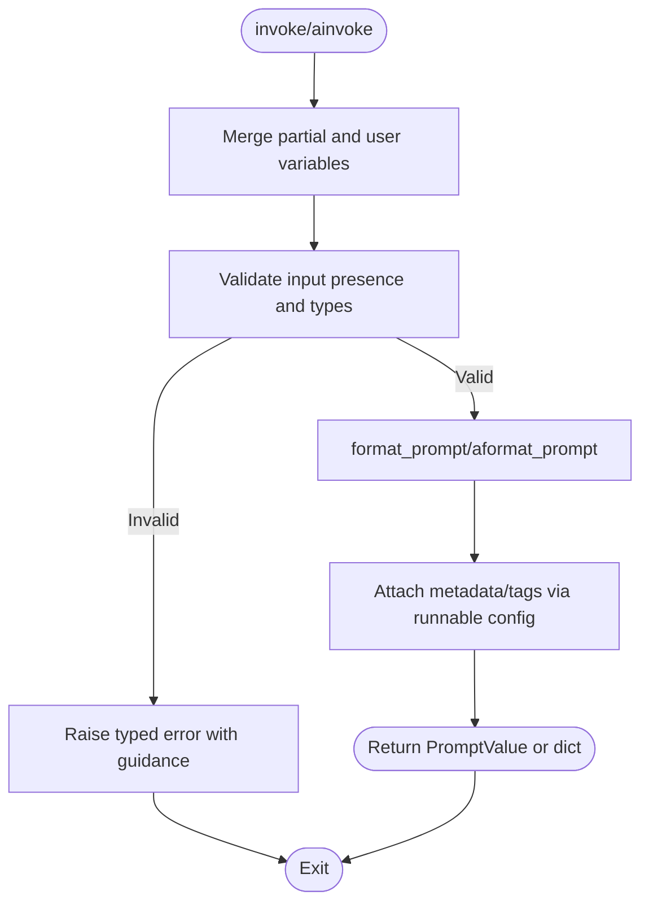
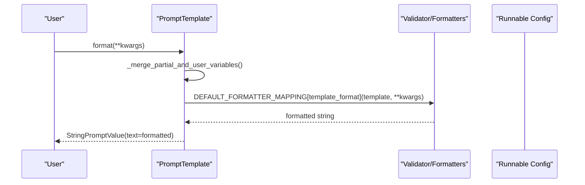
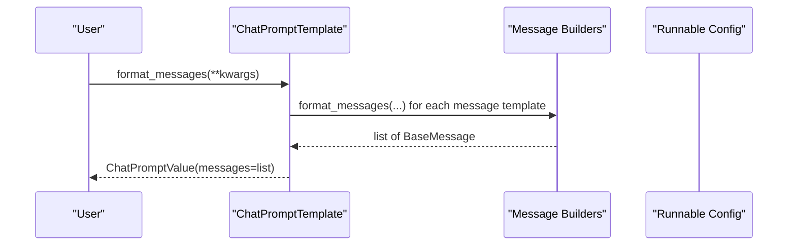
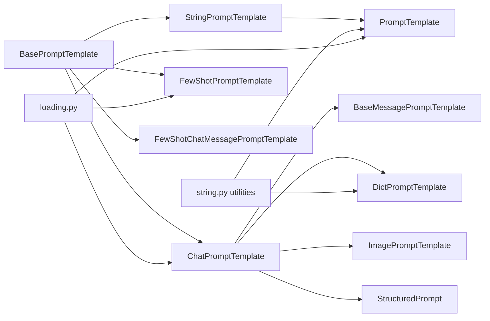

# Prompt Engineering

<cite>
**Referenced Files in This Document**
- [base.py](file://libs/core/langchain_core/prompts/base.py)
- [string.py](file://libs/core/langchain_core/prompts/string.py)
- [prompt.py](file://libs/core/langchain_core/prompts/prompt.py)
- [chat.py](file://libs/core/langchain_core/prompts/chat.py)
- [dict.py](file://libs/core/langchain_core/prompts/dict.py)
- [message.py](file://libs/core/langchain_core/prompts/message.py)
- [few_shot.py](file://libs/core/langchain_core/prompts/few_shot.py)
- [image.py](file://libs/core/langchain_core/prompts/image.py)
- [structured.py](file://libs/core/langchain_core/prompts/structured.py)
- [loading.py](file://libs/core/langchain_core/prompts/loading.py)
- [__init__.py](file://libs/core/langchain_core/prompts/__init__.py)
</cite>

## Table of Contents
1. [Introduction](#introduction)
2. [Project Structure](#project-structure)
3. [Core Components](#core-components)
4. [Architecture Overview](#architecture-overview)
5. [Detailed Component Analysis](#detailed-component-analysis)
6. [Dependency Analysis](#dependency-analysis)
7. [Performance Considerations](#performance-considerations)
8. [Troubleshooting Guide](#troubleshooting-guide)
9. [Conclusion](#conclusion)
10. [Appendices](#appendices)

## Introduction
This document explains LangChain’s prompt engineering capabilities with a focus on the BasePromptTemplate class and its role in structuring inputs for language models. It documents the primary prompt types—StringPromptTemplate, ChatPromptTemplate, and DictPromptTemplate—and covers template variable handling, formatting strategies, validation mechanisms, reusability, dynamic content, versioning, best practices, optimization, testing, prompt chaining, conditional logic, advanced formatting patterns, debugging, and iterative improvement workflows. It also clarifies the relationship between prompts and model families (chat vs. completion), and how prompts integrate with runnable chains and structured outputs.

## Project Structure
LangChain organizes prompt-related functionality under the core package. The central abstraction is BasePromptTemplate, with specialized subclasses for different input modalities and use cases. Supporting utilities include validators, formatters, and loaders for templates and prompts.

**Diagram sources**
- [base.py](file://libs/core/langchain_core/prompts/base.py#L39-L471)
- [string.py](file://libs/core/langchain_core/prompts/string.py#L309-L381)
- [prompt.py](file://libs/core/langchain_core/prompts/prompt.py#L24-L313)
- [chat.py](file://libs/core/langchain_core/prompts/chat.py#L52-L800)
- [dict.py](file://libs/core/langchain_core/prompts/dict.py#L18-L151)
- [message.py](file://libs/core/langchain_core/prompts/message.py#L16-L98)
- [few_shot.py](file://libs/core/langchain_core/prompts/few_shot.py#L120-L477)
- [image.py](file://libs/core/langchain_core/prompts/image.py#L16-L158)
- [structured.py](file://libs/core/langchain_core/prompts/structured.py#L28-L184)
- [loading.py](file://libs/core/langchain_core/prompts/loading.py#L20-L198)
- [__init__.py](file://libs/core/langchain_core/prompts/__init__.py#L44-L102)

**Section sources**
- [__init__.py](file://libs/core/langchain_core/prompts/__init__.py#L44-L102)

## Core Components
- BasePromptTemplate: The foundational abstract class that defines the contract for all prompt templates, including input validation, partial variable merging, invocation semantics, and serialization hooks. It enforces variable name restrictions, validates required inputs, and integrates with the runnable configuration system.
- StringPromptTemplate: A specialization that produces a single formatted string and is the base for PromptTemplate.
- PromptTemplate: A concrete string-based prompt supporting f-string, mustache, and (with caveats) jinja2 formatting. It supports validation, partial variables, and convenience constructors from examples or files.
- ChatPromptTemplate: A specialized template that produces a list of messages (system, human, AI, etc.), enabling chat-style prompting and multimodal content (text, images).
- DictPromptTemplate: A dictionary-based template that recursively interpolates string values using f-string or mustache, useful for structured JSON-like payloads.
- ImagePromptTemplate: A specialized template for multimodal inputs that formats image URLs safely.
- BaseMessagePromptTemplate and derived templates: Building blocks for composing message-level components inside chat templates.
- FewShotPromptTemplate and FewShotChatMessagePromptTemplate: Templates that incorporate example demonstrations, either as static lists or dynamically selected via selectors.
- StructuredPrompt: A beta template that integrates with structured output from language models by attaching a schema and structured output configuration.

**Section sources**
- [base.py](file://libs/core/langchain_core/prompts/base.py#L39-L471)
- [string.py](file://libs/core/langchain_core/prompts/string.py#L309-L381)
- [prompt.py](file://libs/core/langchain_core/prompts/prompt.py#L24-L313)
- [chat.py](file://libs/core/langchain_core/prompts/chat.py#L690-L800)
- [dict.py](file://libs/core/langchain_core/prompts/dict.py#L18-L151)
- [image.py](file://libs/core/langchain_core/prompts/image.py#L16-L158)
- [message.py](file://libs/core/langchain_core/prompts/message.py#L16-L98)
- [few_shot.py](file://libs/core/langchain_core/prompts/few_shot.py#L120-L477)
- [structured.py](file://libs/core/langchain_core/prompts/structured.py#L28-L184)

## Architecture Overview
The prompt system centers around BasePromptTemplate, which standardizes input validation, partial variable handling, and runnable invocation. Specializations encapsulate domain-specific formatting and output shapes:
- String-based prompts (StringPromptTemplate/PromptTemplate) target completion-style models.
- Chat-based prompts (ChatPromptTemplate) target chat models and produce structured message sequences.
- Dict-based prompts (DictPromptTemplate) target structured payload generation.
- Image-based prompts (ImagePromptTemplate) target multimodal models.
- Few-shot variants integrate demonstrations into prompts.
- StructuredPrompt integrates with structured output from models.

**Diagram sources**
- [base.py](file://libs/core/langchain_core/prompts/base.py#L39-L471)
- [string.py](file://libs/core/langchain_core/prompts/string.py#L309-L381)
- [prompt.py](file://libs/core/langchain_core/prompts/prompt.py#L24-L313)
- [chat.py](file://libs/core/langchain_core/prompts/chat.py#L690-L800)
- [dict.py](file://libs/core/langchain_core/prompts/dict.py#L18-L151)
- [image.py](file://libs/core/langchain_core/prompts/image.py#L16-L158)
- [message.py](file://libs/core/langchain_core/prompts/message.py#L16-L98)
- [few_shot.py](file://libs/core/langchain_core/prompts/few_shot.py#L120-L477)
- [structured.py](file://libs/core/langchain_core/prompts/structured.py#L28-L184)

## Detailed Component Analysis

### BasePromptTemplate: Core Abstraction and Invocation
- Responsibilities:
  - Enforce variable name restrictions and detect overlapping input/partial variables.
  - Build an input schema from declared input variables and types.
  - Validate runtime inputs and merge partial variables with user inputs.
  - Provide synchronous and asynchronous invocation via runnable semantics.
  - Support serialization and saving with safeguards (e.g., disallowing partial variables during save).
- Key behaviors:
  - Input validation raises clear errors with actionable hints.
  - Partial variables reduce boilerplate by pre-filling values.
  - Metadata and tags propagate through runnable configuration for tracing.

**Diagram sources**
- [base.py](file://libs/core/langchain_core/prompts/base.py#L159-L255)

**Section sources**
- [base.py](file://libs/core/langchain_core/prompts/base.py#L39-L471)

### StringPromptTemplate and PromptTemplate: String-Based Formatting
- StringPromptTemplate:
  - Produces a single string PromptValue via format.
  - Provides pretty printing and representation helpers.
- PromptTemplate:
  - Supports f-string, mustache, and jinja2 formatting.
  - Validates templates and input variables when requested.
  - Offers constructors from examples and files.
  - Allows combining templates with the + operator (same format, disjoint partial variables).
  - Integrates with output parsers and runnable schemas.

**Diagram sources**
- [prompt.py](file://libs/core/langchain_core/prompts/prompt.py#L191-L201)
- [string.py](file://libs/core/langchain_core/prompts/string.py#L208-L212)

**Section sources**
- [string.py](file://libs/core/langchain_core/prompts/string.py#L309-L381)
- [prompt.py](file://libs/core/langchain_core/prompts/prompt.py#L24-L313)

### ChatPromptTemplate: Message-Based Chaining
- Composes a sequence of messages from templates and placeholders.
- Supports MessagesPlaceholder for dynamic chat histories and optional inclusion.
- Produces ChatPromptValue with a list of BaseMessage instances.
- Integrates with structured prompts and multimodal content (text, images).

**Diagram sources**
- [chat.py](file://libs/core/langchain_core/prompts/chat.py#L744-L758)

**Section sources**
- [chat.py](file://libs/core/langchain_core/prompts/chat.py#L690-L800)

### DictPromptTemplate: Structured Payload Generation
- Recursively interpolates string values in dictionaries using f-string or mustache.
- Skips interpolation for non-string types and preserves structure.
- Useful for generating structured JSON-like inputs for downstream components.

**Section sources**
- [dict.py](file://libs/core/langchain_core/prompts/dict.py#L18-L151)

### ImagePromptTemplate: Multimodal Image Inputs
- Formats image inputs into a standardized ImageURL structure.
- Disallows loading images from file paths for security; requires URL-based inputs.
- Supports detail parameter for resolution hints.

**Section sources**
- [image.py](file://libs/core/langchain_core/prompts/image.py#L16-L158)

### FewShotPromptTemplate and FewShotChatMessagePromptTemplate: Demonstrations
- Static or dynamic examples integrated into prompts.
- Example selection via selectors for semantic similarity or other criteria.
- Chat variant composes example sequences as message lists.

**Section sources**
- [few_shot.py](file://libs/core/langchain_core/prompts/few_shot.py#L120-L477)

### StructuredPrompt: Structured Output Integration
- Beta template that attaches a schema and structured output configuration.
- Pipes into a language model’s structured output capability when available.

**Section sources**
- [structured.py](file://libs/core/langchain_core/prompts/structured.py#L28-L184)

## Dependency Analysis
- BasePromptTemplate is the core dependency for all prompt types, ensuring consistent validation, partial variable handling, and runnable integration.
- String-based formatting utilities (formatters, validators) are reused across PromptTemplate and DictPromptTemplate.
- ChatPromptTemplate depends on message templates and placeholders to construct message sequences.
- Loading utilities enable deserialization of saved prompts from JSON/YAML configurations.

**Diagram sources**
- [base.py](file://libs/core/langchain_core/prompts/base.py#L39-L471)
- [string.py](file://libs/core/langchain_core/prompts/string.py#L309-L381)
- [prompt.py](file://libs/core/langchain_core/prompts/prompt.py#L24-L313)
- [chat.py](file://libs/core/langchain_core/prompts/chat.py#L690-L800)
- [dict.py](file://libs/core/langchain_core/prompts/dict.py#L18-L151)
- [image.py](file://libs/core/langchain_core/prompts/image.py#L16-L158)
- [few_shot.py](file://libs/core/langchain_core/prompts/few_shot.py#L120-L477)
- [structured.py](file://libs/core/langchain_core/prompts/structured.py#L28-L184)
- [loading.py](file://libs/core/langchain_core/prompts/loading.py#L20-L198)

**Section sources**
- [loading.py](file://libs/core/langchain_core/prompts/loading.py#L20-L198)

## Performance Considerations
- Prefer f-string formatting for safety and performance in most cases; jinja2 adds overhead and security risks.
- Minimize repeated validations by setting validate_template appropriately and caching computed schemas.
- Use partial variables to avoid repeatedly passing the same values across invocations.
- For chat templates, reuse shared message templates and placeholders to reduce construction costs.
- When using example selectors, cache embeddings/vectorstores to avoid recomputation.

## Troubleshooting Guide
Common issues and resolutions:
- Missing or extra variables:
  - Validation raises explicit errors with suggestions to escape literal braces.
  - Use get_template_variables to inspect detected variables for f-string/mustache/jinja2.
- Restricted variable names:
  - “stop” is reserved; rename variables accordingly.
- Overlapping partial and input variables:
  - Resolve overlaps by removing duplicates from partial_variables.
- Saving prompts with partial variables:
  - Save fails when partial_variables are present; remove or resolve partials first.
- Jinja2 template loading:
  - Loading jinja2 templates from files is disabled due to security concerns; migrate to f-string or mustache.

**Section sources**
- [base.py](file://libs/core/langchain_core/prompts/base.py#L78-L104)
- [base.py](file://libs/core/langchain_core/prompts/base.py#L369-L393)
- [string.py](file://libs/core/langchain_core/prompts/string.py#L220-L251)
- [loading.py](file://libs/core/langchain_core/prompts/loading.py#L124-L133)

## Conclusion
LangChain’s prompt engineering framework provides a robust, extensible foundation for building, validating, and invoking prompts across different modalities and model families. By leveraging BasePromptTemplate and its specializations, developers can compose reusable, testable, and maintainable prompts, integrate structured outputs, and manage dynamic content effectively. Adhering to best practices around formatting, validation, and security ensures reliable and secure prompt pipelines.

## Appendices

### Best Practices for Prompt Design
- Keep templates modular and composable; use partial variables for constants.
- Validate templates early with validate_template and get_template_variables.
- Escape literal braces to avoid unintended variable substitution.
- Prefer f-string formatting for safety; reserve jinja2 for trusted contexts only.
- Use FewShot variants to demonstrate desired behavior; keep examples concise and representative.
- For chat prompts, separate system, human, and AI roles clearly; leverage MessagesPlaceholder for dynamic history.

### Optimization Techniques
- Cache embeddings/vectorstores for example selectors.
- Reuse shared message templates in ChatPromptTemplate.
- Use DictPromptTemplate for structured payloads to minimize post-processing.
- Avoid unnecessary validations in hot paths; defer to development-time checks.

### Testing Strategies
- Unit-test template rendering with representative inputs and edge cases.
- Validate error paths (missing variables, invalid formats).
- Test partial variable behavior and composition with + operator.
- Verify serialization/deserialization via load_prompt and save.

### Prompt Chaining and Conditional Logic
- Chain prompts using runnable pipes and operators; combine templates with + for string prompts.
- Use conditional logic via jinja2 (with caution) or pre-process inputs to select among templates.
- For chat, conditionally include or prune messages using placeholders and optional flags.

### Advanced Formatting Patterns
- Nested structures in DictPromptTemplate interpolate recursively; ensure only string values are templated.
- ImagePromptTemplate supports URL-based inputs with optional detail; avoid path-based inputs for security.
- StructuredPrompt integrates with model-specific structured output; ensure schema compatibility.

### Prompt Versioning and Management
- Serialize prompts to JSON/YAML using save and load_prompt for reproducibility.
- Store prompts alongside application code or in external hubs; track versions explicitly.
- Use partial variables to evolve prompts incrementally without breaking changes.