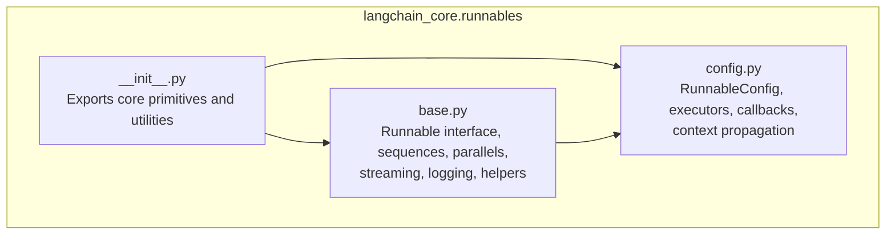
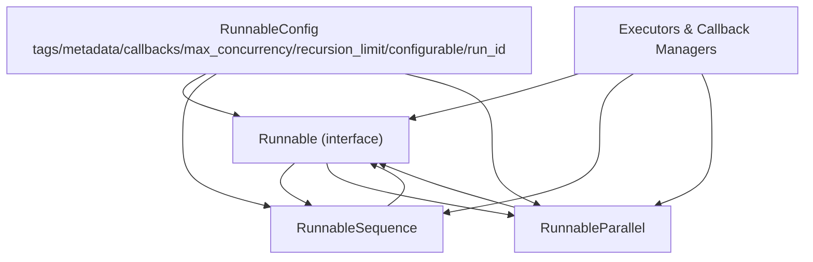
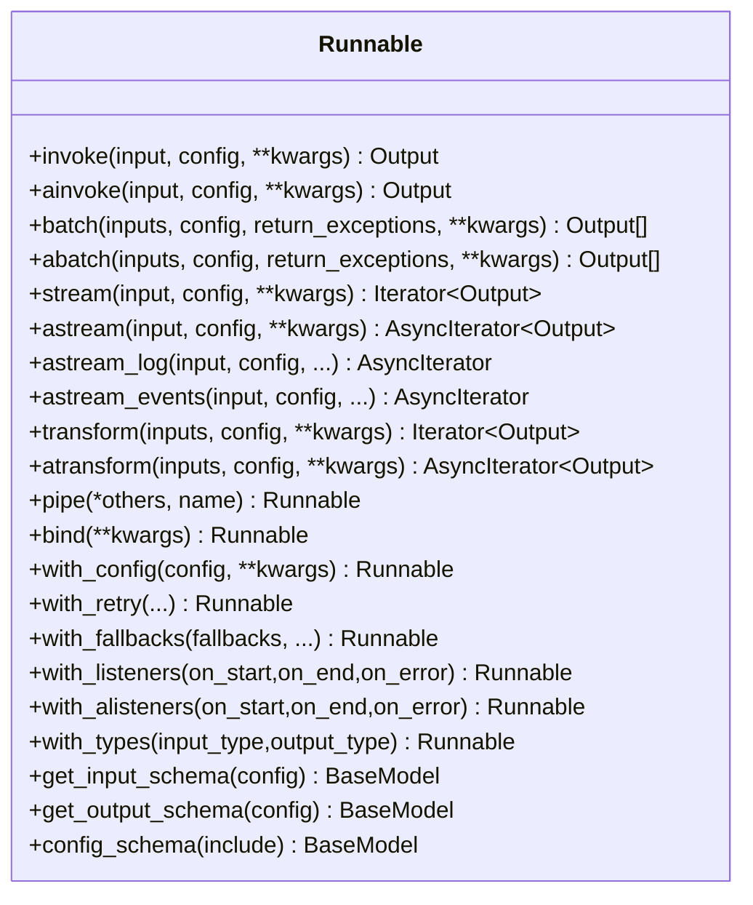
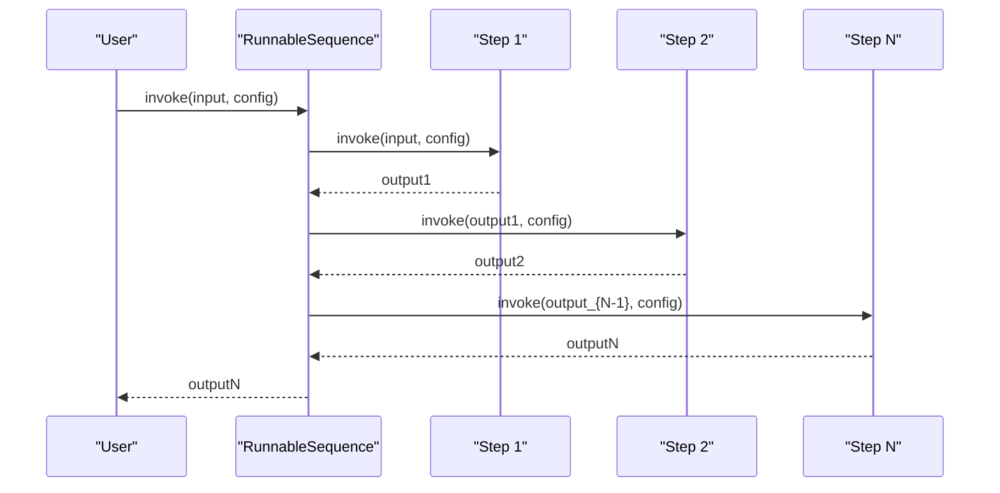
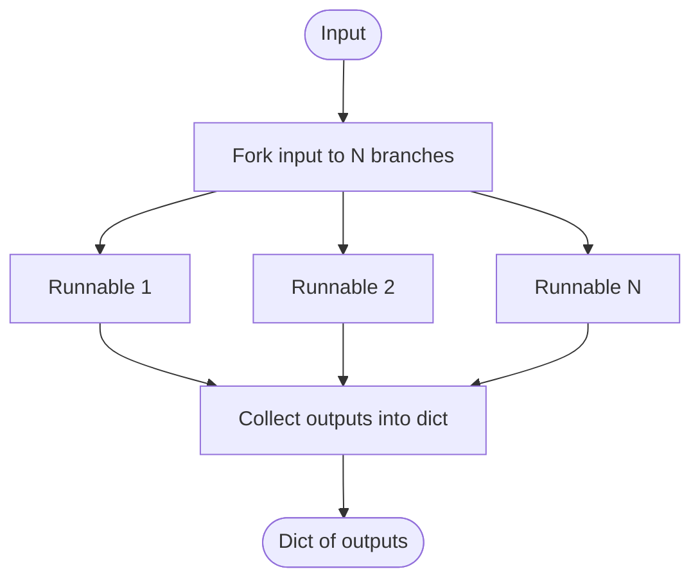
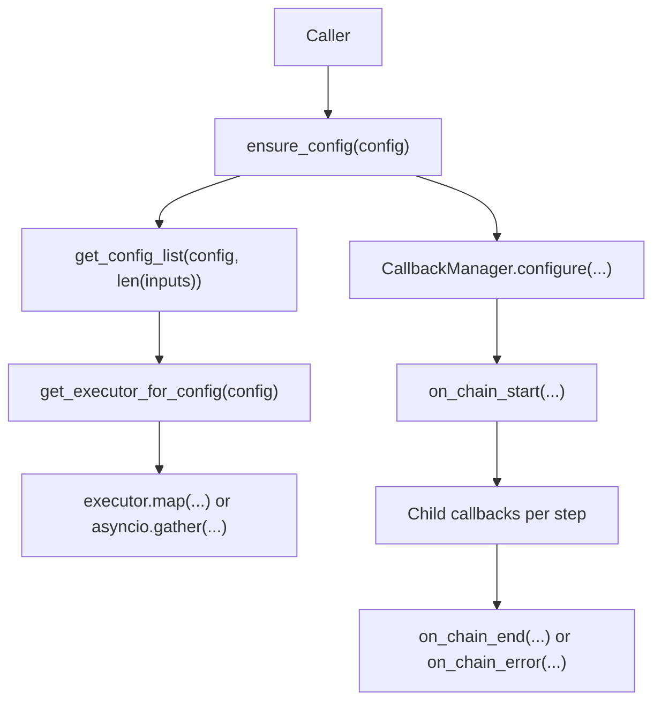
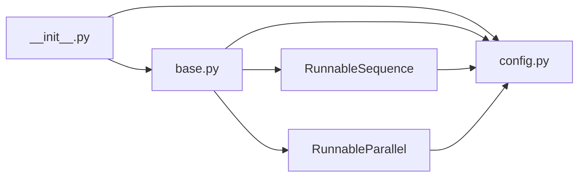

# Runnable Expression Language (LCEL)

<cite>
**Referenced Files in This Document**
- [__init__.py](file://libs/core/langchain_core/runnables/__init__.py)
- [base.py](file://libs/core/langchain_core/runnables/base.py)
- [config.py](file://libs/core/langchain_core/runnables/config.py)
</cite>

## Table of Contents
1. [Introduction](#introduction)
2. [Project Structure](#project-structure)
3. [Core Components](#core-components)
4. [Architecture Overview](#architecture-overview)
5. [Detailed Component Analysis](#detailed-component-analysis)
6. [Dependency Analysis](#dependency-analysis)
7. [Performance Considerations](#performance-considerations)
8. [Troubleshooting Guide](#troubleshooting-guide)
9. [Conclusion](#conclusion)
10. [Appendices](#appendices)

## Introduction
This document explains LangChain’s Runnable Expression Language (LCEL): a declarative paradigm for building production-grade applications powered by LLMs and other components. At its heart is the Runnable interface, which unifies invocation, batching, streaming, and composition. LCEL enables you to assemble chains with operators like | (pipe) and dict literals, and automatically supports synchronous, asynchronous, batch, and streaming execution across composed runnables.

## Project Structure
LCEL is primarily implemented in the core package under langchain_core.runnables. The module exports the core primitives and utilities, while the base.py file defines the Runnable interface and key composition classes such as RunnableSequence and RunnableParallel. Configuration and execution semantics are centralized in config.py.

**Diagram sources**
- [__init__.py](file://libs/core/langchain_core/runnables/__init__.py#L1-L137)
- [base.py](file://libs/core/langchain_core/runnables/base.py#L1-L200)
- [config.py](file://libs/core/langchain_core/runnables/config.py#L1-L120)

**Section sources**
- [__init__.py](file://libs/core/langchain_core/runnables/__init__.py#L1-L137)

## Core Components
- Runnable: The foundational interface that standardizes invoke, ainvoke, batch, abatch, stream, astream, astream_log, and astream_events. It also exposes input_schema, output_schema, config_schema, and helpers like bind, with_config, with_retry, with_fallbacks, and map.
- RunnableSequence: A composition primitive that chains runnables sequentially with | or via constructor. It preserves streaming behavior and supports optimized batch/abatch.
- RunnableParallel: A composition primitive that runs multiple runnables concurrently on the same input, returning a dict of results. It can be constructed inline using a dict literal inside a sequence.
- RunnableConfig: A TypedDict that carries execution context (tags, metadata, callbacks, run_name, max_concurrency, recursion_limit, configurable, run_id) and provides helpers to ensure, merge, and patch configs.
- Utilities: Executors, callback managers, and context propagation utilities that enable async, batching, and tracing across composed chains.

Key capabilities:
- Declarative composition with | and dict literals
- Automatic sync/async/batch/streaming support
- Rich configuration and tracing
- Streaming logs and events for observability

**Section sources**
- [base.py](file://libs/core/langchain_core/runnables/base.py#L124-L256)
- [base.py](file://libs/core/langchain_core/runnables/base.py#L821-L1271)
- [base.py](file://libs/core/langchain_core/runnables/base.py#L2813-L3560)
- [base.py](file://libs/core/langchain_core/runnables/base.py#L3561-L3600)
- [config.py](file://libs/core/langchain_core/runnables/config.py#L51-L125)

## Architecture Overview
LCEL composes runnables into deterministic, observable pipelines. Each runnable can be a simple function-like object or a complex component (e.g., LLMs, retrievers, tools). The composition operators propagate configuration, callbacks, and tracing context automatically.

**Diagram sources**
- [base.py](file://libs/core/langchain_core/runnables/base.py#L124-L256)
- [base.py](file://libs/core/langchain_core/runnables/base.py#L2813-L3560)
- [base.py](file://libs/core/langchain_core/runnables/base.py#L3561-L3600)
- [config.py](file://libs/core/langchain_core/runnables/config.py#L51-L125)

## Detailed Component Analysis

### Runnable Interface
Runnable defines the canonical contract for all LCEL components:
- Core methods: invoke, ainvoke, batch, abatch, stream, astream, astream_log, astream_events
- Schema introspection: input_schema, output_schema, config_schema
- Composition helpers: pipe, __or__, __ror__, pick, assign
- Behavior modifiers: bind, with_config, with_retry, with_fallbacks, with_listeners, with_alisteners, with_types
- Streaming and transformation: transform, atransform, plus internal helpers for streaming logs and events

**Diagram sources**
- [base.py](file://libs/core/langchain_core/runnables/base.py#L821-L1271)

**Section sources**
- [base.py](file://libs/core/langchain_core/runnables/base.py#L124-L256)
- [base.py](file://libs/core/langchain_core/runnables/base.py#L821-L1271)

### RunnableSequence
RunnableSequence chains runnables end-to-end. It:
- Supports sync/async/batch/astream
- Preserves streaming behavior across components
- Computes accurate input/output schemas for the composed pipeline
- Propagates child runs and tracing context to each step

**Diagram sources**
- [base.py](file://libs/core/langchain_core/runnables/base.py#L3127-L3200)

**Section sources**
- [base.py](file://libs/core/langchain_core/runnables/base.py#L2813-L3560)

### RunnableParallel
RunnableParallel executes multiple runnables concurrently on the same input and returns a dict of results. It is commonly constructed inline using a dict literal inside a sequence.

**Diagram sources**
- [base.py](file://libs/core/langchain_core/runnables/base.py#L3561-L3600)

**Section sources**
- [base.py](file://libs/core/langchain_core/runnables/base.py#L3561-L3600)

### Configuration and Execution Semantics
RunnableConfig centralizes execution context:
- Keys: tags, metadata, callbacks, run_name, max_concurrency, recursion_limit, configurable, run_id
- Helpers: ensure_config, get_config_list, patch_config, merge_configs
- Executors: ContextThreadPoolExecutor, get_executor_for_config, run_in_executor
- Callbacks: sync and async callback managers, tracing context propagation

**Diagram sources**
- [config.py](file://libs/core/langchain_core/runnables/config.py#L216-L266)
- [config.py](file://libs/core/langchain_core/runnables/config.py#L269-L312)
- [config.py](file://libs/core/langchain_core/runnables/config.py#L315-L354)
- [config.py](file://libs/core/langchain_core/runnables/config.py#L579-L596)
- [config.py](file://libs/core/langchain_core/runnables/config.py#L598-L632)

**Section sources**
- [config.py](file://libs/core/langchain_core/runnables/config.py#L51-L125)
- [config.py](file://libs/core/langchain_core/runnables/config.py#L216-L266)
- [config.py](file://libs/core/langchain_core/runnables/config.py#L579-L596)

## Dependency Analysis
LCEL’s design emphasizes loose coupling and strong composability:
- RunnableSequence depends on RunnableParallel for branching and on the callback system for tracing.
- RunnableParallel depends on the callback system and executors for concurrency.
- Both depend on RunnableConfig for context propagation and configuration merging.
- The module-level __init__.py dynamically imports and exposes core primitives, enabling lazy loading.

**Diagram sources**
- [__init__.py](file://libs/core/langchain_core/runnables/__init__.py#L95-L137)
- [base.py](file://libs/core/langchain_core/runnables/base.py#L1-L120)
- [config.py](file://libs/core/langchain_core/runnables/config.py#L1-L60)

**Section sources**
- [__init__.py](file://libs/core/langchain_core/runnables/__init__.py#L95-L137)
- [base.py](file://libs/core/langchain_core/runnables/base.py#L1-L120)
- [config.py](file://libs/core/langchain_core/runnables/config.py#L1-L60)

## Performance Considerations
- Prefer abatch and astream for IO-bound workloads to leverage asyncio concurrency and thread pools.
- Tune max_concurrency via RunnableConfig to balance throughput and resource usage.
- Use with_retry to improve resilience for transient failures.
- Leverage astream_log and astream_events for low-latency observability without buffering.
- For streaming-heavy pipelines, ensure components implement transform/atransform to avoid unnecessary buffering.

[No sources needed since this section provides general guidance]

## Troubleshooting Guide
Common issues and remedies:
- Incorrect input types: Use input_schema and output_schema to validate and debug expected shapes.
- Missing or misconfigured callbacks: Ensure ensure_config and patch_config are used to propagate callbacks and metadata.
- Excessive memory usage during streaming: Verify components implement transform/atransform to stream incrementally.
- Batch errors: Use return_exceptions in batch/abatch to collect partial results and diagnose failing inputs.
- Tracing gaps: Confirm callback managers are configured and tracing context is propagated using set_config_context.

**Section sources**
- [base.py](file://libs/core/langchain_core/runnables/base.py#L366-L518)
- [config.py](file://libs/core/langchain_core/runnables/config.py#L216-L266)
- [config.py](file://libs/core/langchain_core/runnables/config.py#L315-L354)

## Conclusion
LCEL provides a uniform, composable interface for building robust, observable, and scalable AI applications. By standardizing invocation, batching, streaming, and configuration, it lets you focus on logic rather than plumbing. RunnableSequence and RunnableParallel form the backbone of declarative composition, while RunnableConfig and the callback system deliver production-grade observability and control.

[No sources needed since this section summarizes without analyzing specific files]

## Appendices

### Practical Patterns and Examples
- Simple transformation: Compose a RunnableLambda with | and call invoke/ainvoke.
- Parallel transformation: Insert a dict literal inside a sequence to run multiple runnables concurrently.
- Complex workflow: Chain multiple runnables with RunnableSequence, add retries with with_retry, and instrument with astream_log.
- Real-world use case: Prompt + LLM + Output parser pipeline with streaming via astream and detailed logs via astream_log.

[No sources needed since this section provides general guidance]