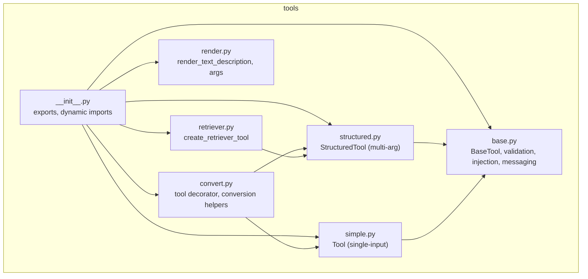
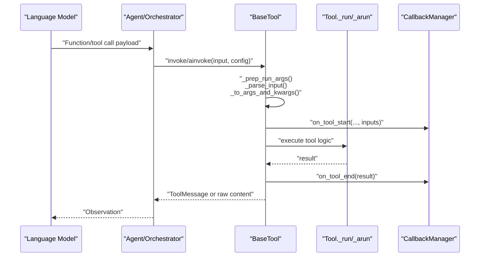
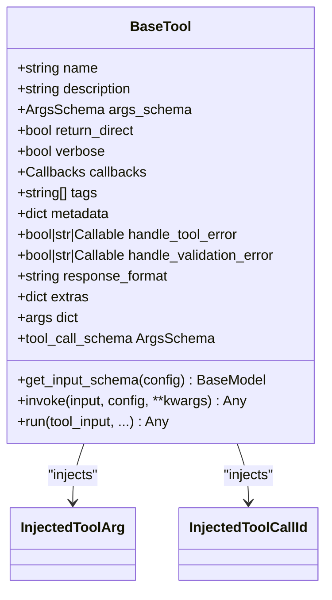
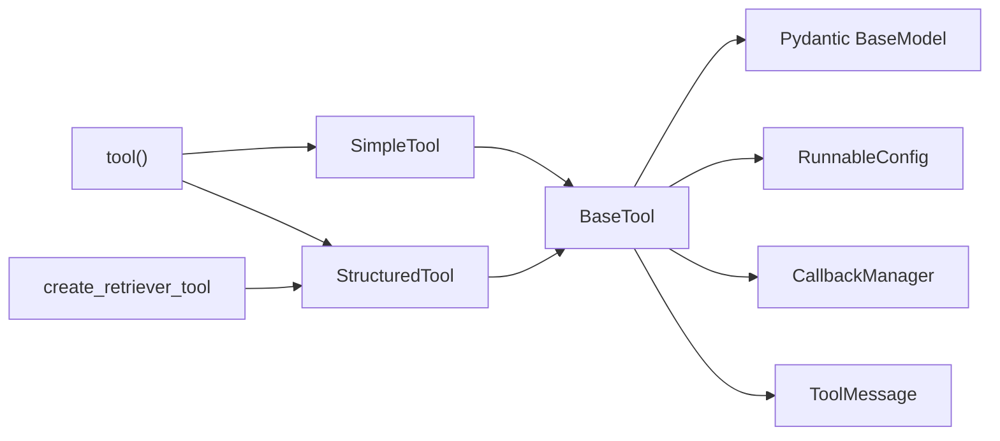

# Tools System

<cite>
**Referenced Files in This Document**
- [base.py](file://libs/core/langchain_core/tools/base.py)
- [simple.py](file://libs/core/langchain_core/tools/simple.py)
- [structured.py](file://libs/core/langchain_core/tools/structured.py)
- [convert.py](file://libs/core/langchain_core/tools/convert.py)
- [render.py](file://libs/core/langchain_core/tools/render.py)
- [retriever.py](file://libs/core/langchain_core/tools/retriever.py)
- [__init__.py](file://libs/core/langchain_core/tools/__init__.py)
- [test_tools.py](file://libs/core/tests/unit_tests/test_tools.py)
</cite>

## Table of Contents
1. [Introduction](#introduction)
2. [Project Structure](#project-structure)
3. [Core Components](#core-components)
4. [Architecture Overview](#architecture-overview)
5. [Detailed Component Analysis](#detailed-component-analysis)
6. [Dependency Analysis](#dependency-analysis)
7. [Performance Considerations](#performance-considerations)
8. [Troubleshooting Guide](#troubleshooting-guide)
9. [Conclusion](#conclusion)
10. [Appendices](#appendices)

## Introduction
This document explains LangChain’s tools system: how tools enable language models to interact with external systems, how to build and compose them safely and efficiently, and how to present them effectively to models. It covers the BaseTool abstraction, simple vs structured tools, schema-driven validation, tool calling and rendering, error handling, and practical patterns for APIs, databases, and file systems.

## Project Structure
LangChain’s tools live under the core package and are organized by responsibility:
- Base abstractions and shared utilities
- Simple and structured tool implementations
- Decorator and conversion utilities
- Rendering utilities
- Specialized tool wrappers (e.g., retriever tool)
- Public exports and dynamic imports

**Diagram sources**
- [__init__.py](file://libs/core/langchain_core/tools/__init__.py#L42-L84)
- [base.py](file://libs/core/langchain_core/tools/base.py#L405-L532)
- [simple.py](file://libs/core/langchain_core/tools/simple.py#L31-L60)
- [structured.py](file://libs/core/langchain_core/tools/structured.py#L40-L60)
- [convert.py](file://libs/core/langchain_core/tools/convert.py#L76-L100)
- [render.py](file://libs/core/langchain_core/tools/render.py#L13-L40)
- [retriever.py](file://libs/core/langchain_core/tools/retriever.py#L31-L40)

**Section sources**
- [__init__.py](file://libs/core/langchain_core/tools/__init__.py#L42-L84)

## Core Components
- BaseTool: Abstract base class defining the tool contract, input schema handling, execution lifecycle, error handling, and output formatting.
- Tool (simple): A thin wrapper around a single callable that accepts a single string-like input and optional async variant.
- StructuredTool: A tool backed by a Pydantic schema or JSON schema, supporting multiple inputs, defaults, and complex types.
- tool decorator: Converts functions or Runnables into tools, inferring schemas and handling docstring parsing.
- Rendering utilities: Produce human-readable descriptions of tools and their arguments.
- Retriever tool: A specialized StructuredTool that wraps a retriever to fetch and format documents.

Key responsibilities:
- Parameter validation and schema inference
- Tool invocation pipeline (sync/async)
- Error handling and formatting (validation errors, tool exceptions)
- Output formatting as ToolMessage or raw content
- Injected arguments (e.g., tool call ID, runtime context)

**Section sources**
- [base.py](file://libs/core/langchain_core/tools/base.py#L405-L532)
- [simple.py](file://libs/core/langchain_core/tools/simple.py#L31-L60)
- [structured.py](file://libs/core/langchain_core/tools/structured.py#L40-L60)
- [convert.py](file://libs/core/langchain_core/tools/convert.py#L76-L100)
- [render.py](file://libs/core/langchain_core/tools/render.py#L13-L40)
- [retriever.py](file://libs/core/langchain_core/tools/retriever.py#L31-L40)

## Architecture Overview
The tools system integrates with LangChain’s Runnable interface and messaging types. Tools are invoked with either a string, a dict, or a ToolCall. Validation enforces the declared schema, and outputs are normalized into ToolMessage when applicable.

**Diagram sources**
- [base.py](file://libs/core/langchain_core/tools/base.py#L1213-L1247)
- [base.py](file://libs/core/langchain_core/tools/base.py#L656-L775)
- [base.py](file://libs/core/langchain_core/tools/base.py#L877-L1003)
- [base.py](file://libs/core/langchain_core/tools/base.py#L1005-L1134)

## Detailed Component Analysis

### BaseTool: The Foundation
BaseTool defines:
- Input schema resolution (args_schema or inferred from function signature)
- Tool execution lifecycle (invoke/ainvoke, run/arun)
- Validation and error handling (validation errors, tool exceptions)
- Output formatting (ToolMessage, content/artifact)
- Injected arguments (e.g., tool call ID, runtime context)
- Tool call schema generation for model consumption

Highlights:
- args property exposes the tool’s argument schema for model prompting
- tool_call_schema excludes injected arguments intended only at runtime
- run/arun orchestrate callbacks, config propagation, and response formatting
- handle_tool_error and handle_validation_error provide flexible error policies

**Diagram sources**
- [base.py](file://libs/core/langchain_core/tools/base.py#L405-L532)
- [base.py](file://libs/core/langchain_core/tools/base.py#L1366-L1420)

**Section sources**
- [base.py](file://libs/core/langchain_core/tools/base.py#L405-L532)
- [base.py](file://libs/core/langchain_core/tools/base.py#L586-L610)
- [base.py](file://libs/core/langchain_core/tools/base.py#L877-L1003)
- [base.py](file://libs/core/langchain_core/tools/base.py#L1005-L1134)
- [base.py](file://libs/core/langchain_core/tools/base.py#L1366-L1420)

### Simple Tool: Single-Argument Convenience
Simple tools wrap a single callable that accepts a single input (commonly a string). They:
- Infer a minimal schema when none is provided
- Enforce single-input semantics and raise ToolException for multi-arg misuse
- Support async via coroutine

Usage patterns:
- Wrapping lightweight functions that take a single string argument
- Backward-compatible behavior when args_schema is omitted

**Section sources**
- [simple.py](file://libs/core/langchain_core/tools/simple.py#L31-L60)
- [simple.py](file://libs/core/langchain_core/tools/simple.py#L99-L125)
- [simple.py](file://libs/core/langchain_core/tools/simple.py#L126-L155)

### Structured Tool: Schema-Driven Power
Structured tools:
- Accept multiple arguments via a Pydantic model or JSON schema
- Infer schema from function signatures and docstrings when enabled
- Support complex types, defaults, and nested models
- Allow content_and_artifact responses for richer observations

Creation patterns:
- StructuredTool.from_function with infer_schema and parse_docstring
- Direct construction with args_schema (Pydantic model or JSON schema)
- Conversion from Runnables via convert_runnable_to_tool

**Section sources**
- [structured.py](file://libs/core/langchain_core/tools/structured.py#L40-L60)
- [structured.py](file://libs/core/langchain_core/tools/structured.py#L132-L252)
- [convert.py](file://libs/core/langchain_core/tools/convert.py#L259-L335)
- [convert.py](file://libs/core/langchain_core/tools/convert.py#L419-L477)

### Tool Decorator and Conversion
The tool decorator:
- Converts functions or Runnables into tools
- Supports args_schema override, response_format, extras, and docstring parsing
- Infers schema when infer_schema=True and validates docstrings when parse_docstring=True

Conversion utilities:
- convert_runnable_to_tool adapts arbitrary Runnables to tools
- as_tool is available on Runnables for convenience

**Section sources**
- [convert.py](file://libs/core/langchain_core/tools/convert.py#L76-L100)
- [convert.py](file://libs/core/langchain_core/tools/convert.py#L259-L335)
- [convert.py](file://libs/core/langchain_core/tools/convert.py#L419-L477)

### Tool Rendering
Rendering utilities help present tools to models:
- render_text_description: name and description
- render_text_description_and_args: name, description, and args schema

These are useful for prompt engineering and tool catalogs.

**Section sources**
- [render.py](file://libs/core/langchain_core/tools/render.py#L13-L40)

### Retriever Tool
create_retriever_tool builds a StructuredTool from a retriever:
- Accepts a query and returns concatenated document content
- Supports content_and_artifact to return both content and raw documents
- Uses document_prompt and document_separator for formatting

**Section sources**
- [retriever.py](file://libs/core/langchain_core/tools/retriever.py#L31-L95)

## Dependency Analysis
- BaseTool depends on:
  - Pydantic for schema validation and serialization
  - Runnable interfaces for configuration and executor integration
  - Callbacks for tracing and instrumentation
  - Messaging types for ToolMessage output
- SimpleTool and StructuredTool both inherit from BaseTool
- tool decorator composes StructuredTool.from_function or Tool for simple cases
- Retriever tool composes a retriever with StructuredTool

**Diagram sources**
- [base.py](file://libs/core/langchain_core/tools/base.py#L42-L68)
- [simple.py](file://libs/core/langchain_core/tools/simple.py#L19-L25)
- [structured.py](file://libs/core/langchain_core/tools/structured.py#L24-L34)
- [convert.py](file://libs/core/langchain_core/tools/convert.py#L259-L335)
- [retriever.py](file://libs/core/langchain_core/tools/retriever.py#L19-L20)

**Section sources**
- [base.py](file://libs/core/langchain_core/tools/base.py#L42-L68)
- [simple.py](file://libs/core/langchain_core/tools/simple.py#L19-L25)
- [structured.py](file://libs/core/langchain_core/tools/structured.py#L24-L34)
- [convert.py](file://libs/core/langchain_core/tools/convert.py#L259-L335)
- [retriever.py](file://libs/core/langchain_core/tools/retriever.py#L19-L20)

## Performance Considerations
- Prefer StructuredTool with precomputed args_schema to avoid runtime introspection overhead.
- Use response_format="content_and_artifact" judiciously; artifacts increase memory and serialization cost.
- Avoid heavy synchronous operations inside _run; leverage coroutine for async I/O.
- Cache frequently accessed external resources (e.g., database connections) at the tool boundary.
- Minimize large payloads in ToolMessage content; consider streaming or artifact patterns.

## Troubleshooting Guide
Common issues and resolutions:
- Validation errors: Configure handle_validation_error to return a safe message or raise a ToolException.
- Tool exceptions: Configure handle_tool_error to normalize error messages for the model.
- Injected arguments: Ensure InjectedToolArg and InjectedToolCallId are annotated correctly; missing tool_call_id triggers validation errors.
- Docstring parsing: Enable parse_docstring and fix invalid Google-style docstrings; invalid sections raise errors.
- Callback inputs: Injected args and run_manager are filtered from callback inputs to prevent leakage.

**Section sources**
- [base.py](file://libs/core/langchain_core/tools/base.py#L983-L1000)
- [base.py](file://libs/core/langchain_core/tools/base.py#L1149-L1210)
- [test_tools.py](file://libs/core/tests/unit_tests/test_tools.py#L1347-L1380)
- [test_tools.py](file://libs/core/tests/unit_tests/test_tools.py#L2423-L2458)
- [test_tools.py](file://libs/core/tests/unit_tests/test_tools.py#L2973-L3084)

## Conclusion
LangChain’s tools system provides a robust, schema-first framework for connecting language models to external systems. BaseTool centralizes validation, execution, and output formatting, while SimpleTool and StructuredTool offer complementary approaches. The tool decorator and conversion utilities streamline adoption, and rendering tools help surface capabilities to models. By following the patterns and safeguards outlined here, teams can build reliable, secure, and efficient tool integrations.

## Appendices

### A. Creating Custom Tools: Patterns and Examples
- API tools: Define a function with typed parameters; use @tool or StructuredTool.from_function with infer_schema and parse_docstring to generate a precise schema.
- Database tools: Use a Pydantic model for inputs (e.g., filters, pagination); validate early and handle connection errors via ToolException.
- File system tools: Accept path-like inputs; validate existence and permissions; return structured results or artifacts.
- Multi-tool coordination: Compose tools with agents; use return_direct for terminal tools; orchestrate tool selection via function-calling or tool-choice strategies.

**Section sources**
- [convert.py](file://libs/core/langchain_core/tools/convert.py#L76-L100)
- [structured.py](file://libs/core/langchain_core/tools/structured.py#L132-L252)
- [test_tools.py](file://libs/core/tests/unit_tests/test_tools.py#L848-L880)

### B. Tool Calling Mechanisms and Selection Strategies
- Tool calling: LLM produces a ToolCall payload; BaseTool.invoke normalizes it to a dict and validates against args_schema.
- Tool selection: Strategies include explicit tool lists, function-calling with schema, and tool-choice modes; agents can select tools based on prompts and tool descriptions.
- Multi-tool coordination: Chain tools, guard failures with error handlers, and use artifacts to propagate intermediate results.

**Section sources**
- [base.py](file://libs/core/langchain_core/tools/base.py#L1213-L1247)
- [base.py](file://libs/core/langchain_core/tools/base.py#L586-L610)
- [render.py](file://libs/core/langchain_core/tools/render.py#L13-L40)

### C. Safety, Rate Limiting, and Performance
- Safety: Validate inputs rigorously; sanitize outputs; restrict injected arguments to trusted contexts; use response_format to control content types.
- Rate limiting: Apply per-tool or global limits; back off on retries; gate expensive operations behind circuit breakers.
- Performance: Use async I/O; reuse connections; compress payloads; prefer artifact patterns for large data.

[No sources needed since this section provides general guidance]

### D. Testing, Documentation, and Integration
- Testing: Use pytest to validate schema inference, error handling, and callback filtering; test both sync and async paths.
- Documentation: Keep docstrings aligned with function signatures; use parse_docstring to populate parameter descriptions.
- Integration: Wrap third-party SDKs in tools; expose only necessary parameters; handle network timeouts and retries gracefully.

**Section sources**
- [test_tools.py](file://libs/core/tests/unit_tests/test_tools.py#L1180-L1264)
- [test_tools.py](file://libs/core/tests/unit_tests/test_tools.py#L2973-L3084)
- [convert.py](file://libs/core/langchain_core/tools/convert.py#L104-L168)