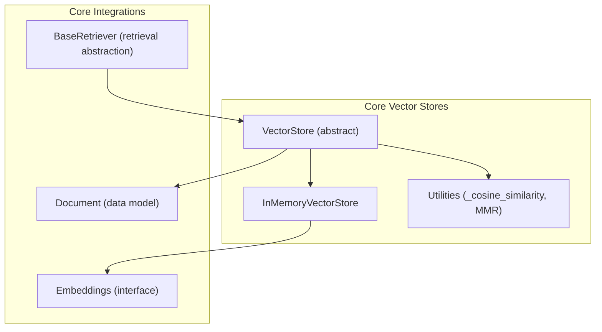
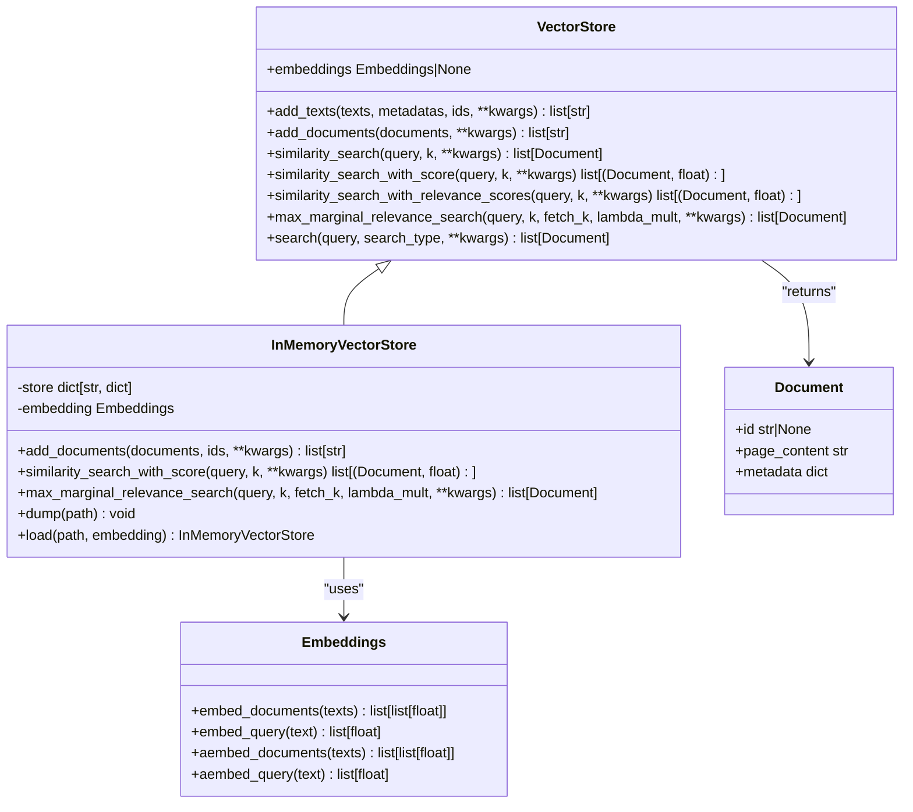
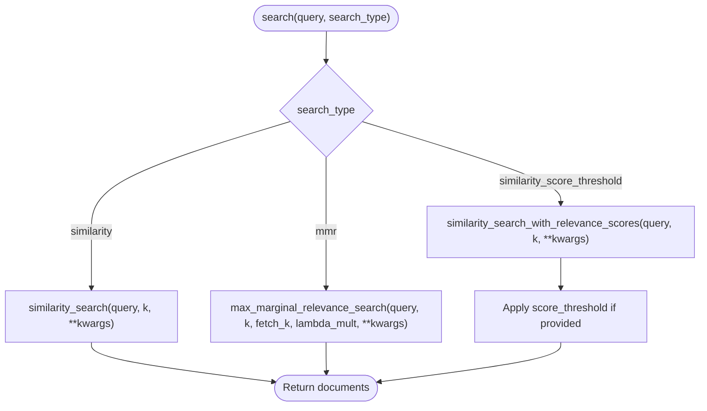
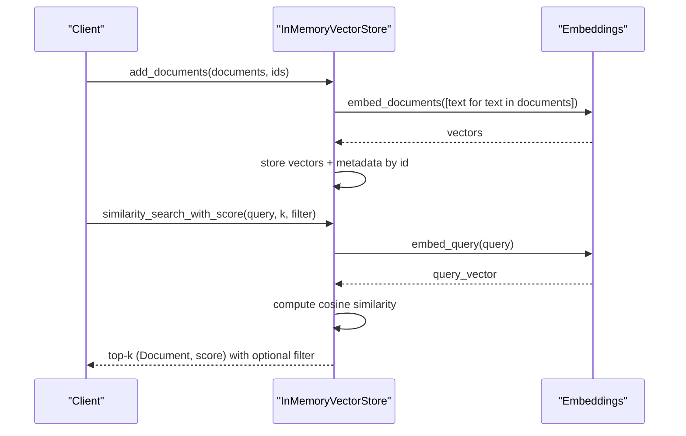
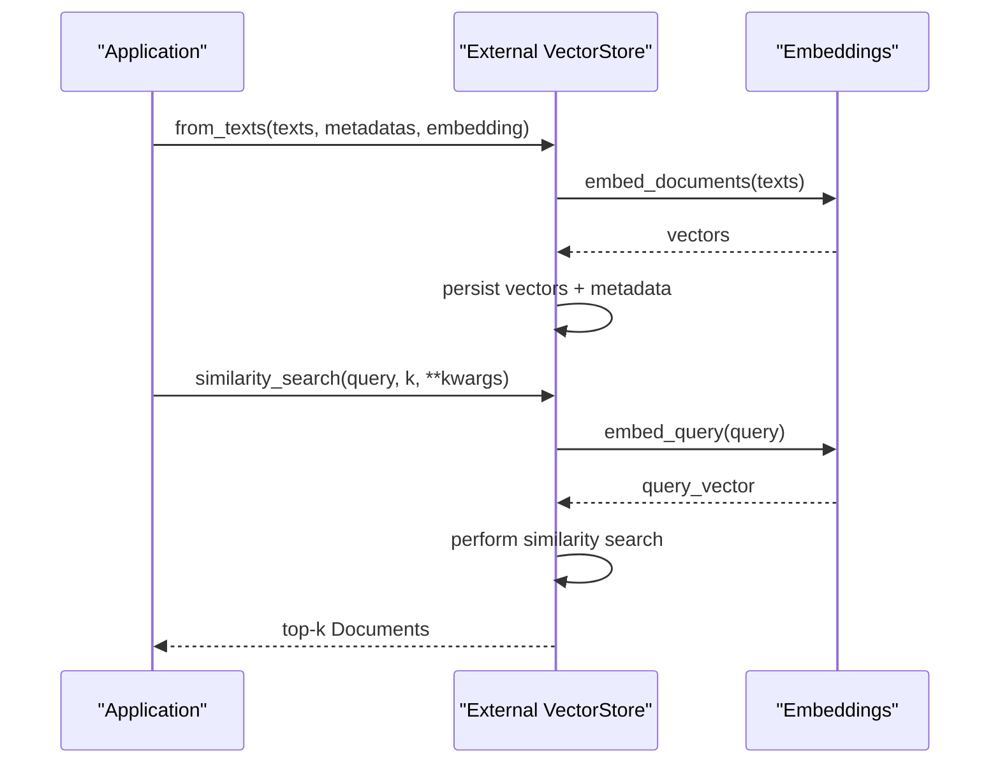
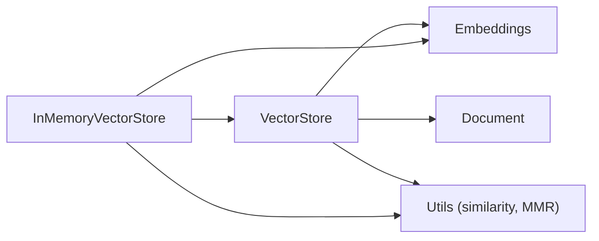

# Vector Stores Fundamentals

<cite>
**Referenced Files in This Document**
- [base.py](file://libs/core/langchain_core/vectorstores/base.py)
- [in_memory.py](file://libs/core/langchain_core/vectorstores/in_memory.py)
- [utils.py](file://libs/core/langchain_core/vectorstores/utils.py)
- [embeddings.py](file://libs/core/langchain_core/embeddings/embeddings.py)
- [base.py](file://libs/core/langchain_core/documents/base.py)
- [__init__.py](file://libs/core/langchain_core/vectorstores/__init__.py)
- [retrievers.py](file://libs/core/langchain_core/retrievers.py)
- [test_in_memory.py](file://libs/core/tests/unit_tests/vectorstores/test_in_memory.py)
- [test_vectorstore.py](file://libs/core/tests/unit_tests/vectorstores/test_vectorstore.py)
- [qdrant.py](file://libs/partners/qdrant/langchain_qdrant/qdrant.py)
- [vectorstores.py](file://libs/partners/qdrant/langchain_qdrant/vectorstores.py)
- [base.py](file://libs/text-splitters/langchain_text_splitters/base.py)
</cite>

## Table of Contents
1. [Introduction](#introduction)
2. [Project Structure](#project-structure)
3. [Core Components](#core-components)
4. [Architecture Overview](#architecture-overview)
5. [Detailed Component Analysis](#detailed-component-analysis)
6. [Dependency Analysis](#dependency-analysis)
7. [Performance Considerations](#performance-considerations)
8. [Troubleshooting Guide](#troubleshooting-guide)
9. [Conclusion](#conclusion)
10. [Appendices](#appendices)

## Introduction
This document explains LangChain’s vector stores fundamentals: the VectorStore abstract class, its role in document retrieval and similarity search, and how it integrates with embeddings providers. It covers core operations (adding documents, searching with similarity, managing metadata), relationships with embeddings, practical examples with in-memory stores, and guidance for working with external vector databases. It also includes strategies for document chunking, embedding integration, search optimization, configuration options, performance considerations, scaling patterns, selection criteria, and migration strategies.

## Project Structure
LangChain organizes vector store functionality under the core package with a clear separation between the abstract interface, an in-memory implementation, and shared utilities. The public API is lazily imported to reduce startup overhead.

**Diagram sources**
- [base.py](file://libs/core/langchain_core/vectorstores/base.py#L43-L800)
- [in_memory.py](file://libs/core/langchain_core/vectorstores/in_memory.py#L34-L547)
- [utils.py](file://libs/core/langchain_core/vectorstores/utils.py#L35-L158)
- [embeddings.py](file://libs/core/langchain_core/embeddings/embeddings.py#L8-L79)
- [base.py](file://libs/core/langchain_core/documents/base.py#L288-L348)
- [retrievers.py](file://libs/core/langchain_core/retrievers.py#L55-L200)

**Section sources**
- [__init__.py](file://libs/core/langchain_core/vectorstores/__init__.py#L18-L44)
- [base.py](file://libs/core/langchain_core/vectorstores/base.py#L43-L800)
- [in_memory.py](file://libs/core/langchain_core/vectorstores/in_memory.py#L34-L547)
- [utils.py](file://libs/core/langchain_core/vectorstores/utils.py#L35-L158)
- [embeddings.py](file://libs/core/langchain_core/embeddings/embeddings.py#L8-L79)
- [base.py](file://libs/core/langchain_core/documents/base.py#L288-L348)
- [retrievers.py](file://libs/core/langchain_core/retrievers.py#L55-L200)

## Core Components
- VectorStore (abstract): Defines the contract for storing embedded data and performing similarity search. It provides convenience methods for adding texts/documents, searching with multiple strategies (similarity, MMR, similarity with relevance scores), and utilities for relevance scoring normalization.
- InMemoryVectorStore: A concrete implementation backed by an in-memory dictionary. It embeds documents using an Embeddings provider, stores vectors with associated metadata, and supports similarity search, MMR, and persistence via dump/load.
- Utilities: Shared helpers for cosine similarity computation and maximal marginal relevance (MMR) selection.
- Embeddings: The interface that provides embed_documents and embed_query methods (sync and async).
- Document: The data model representing textual content and metadata used across vector stores.
- BaseRetriever: A higher-level abstraction for retrieving documents; vector stores often serve as its backend.

Key responsibilities:
- VectorStore: Define search semantics, relevance normalization, and async/sync bridging.
- InMemoryVectorStore: Implement embedding integration, storage, filtering, and retrieval.
- Embeddings: Provide vector representations for both queries and documents.
- Document: Standardized content and metadata container.

**Section sources**
- [base.py](file://libs/core/langchain_core/vectorstores/base.py#L43-L800)
- [in_memory.py](file://libs/core/langchain_core/vectorstores/in_memory.py#L34-L547)
- [utils.py](file://libs/core/langchain_core/vectorstores/utils.py#L35-L158)
- [embeddings.py](file://libs/core/langchain_core/embeddings/embeddings.py#L8-L79)
- [base.py](file://libs/core/langchain_core/documents/base.py#L288-L348)
- [retrievers.py](file://libs/core/langchain_core/retrievers.py#L55-L200)

## Architecture Overview
The vector store architecture centers on the VectorStore abstraction, which delegates embedding and search operations to an Embeddings provider and relies on Document objects for content and metadata. InMemoryVectorStore demonstrates a minimal implementation that embeds text, stores vectors, and performs similarity and MMR searches.

**Diagram sources**
- [base.py](file://libs/core/langchain_core/vectorstores/base.py#L43-L800)
- [in_memory.py](file://libs/core/langchain_core/vectorstores/in_memory.py#L34-L547)
- [embeddings.py](file://libs/core/langchain_core/embeddings/embeddings.py#L8-L79)
- [base.py](file://libs/core/langchain_core/documents/base.py#L288-L348)

## Detailed Component Analysis

### VectorStore Abstract Class
The abstract class defines:
- Adding data: add_texts and add_documents with automatic delegation and ID handling.
- Deleting and fetching by ID: delete, get_by_ids, and async variants.
- Searching: similarity_search, similarity_search_by_vector, and MMR variants.
- Relevance scoring: default normalization and threshold filtering.
- Delegation helpers: search dispatches to specific strategies.

Important behaviors:
- add_texts delegates to add_documents when implemented, ensuring consistent upsert semantics.
- similarity_search_with_relevance_scores normalizes distances to [0, 1] using store-specific relevance functions.
- search routes to similarity, MMR, or similarity with relevance score threshold based on search_type.

**Diagram sources**
- [base.py](file://libs/core/langchain_core/vectorstores/base.py#L293-L358)
- [base.py](file://libs/core/langchain_core/vectorstores/base.py#L506-L554)

**Section sources**
- [base.py](file://libs/core/langchain_core/vectorstores/base.py#L43-L800)

### InMemoryVectorStore
The in-memory implementation:
- Stores vectors as dictionaries keyed by IDs.
- Embeds documents using the provided Embeddings provider.
- Supports filtering via a callable filter argument during similarity search.
- Implements MMR using a dedicated utility and optional numpy acceleration.
- Provides dump/load for persistence.

Key methods:
- add_documents: embeds texts and stores vectors with metadata.
- similarity_search_with_score: computes cosine similarity against stored vectors.
- max_marginal_relevance_search: selects diverse results using MMR.
- dump/load: serialize/deserialize the store.

**Diagram sources**
- [in_memory.py](file://libs/core/langchain_core/vectorstores/in_memory.py#L188-L221)
- [in_memory.py](file://libs/core/langchain_core/vectorstores/in_memory.py#L359-L381)
- [utils.py](file://libs/core/langchain_core/vectorstores/utils.py#L35-L104)

**Section sources**
- [in_memory.py](file://libs/core/langchain_core/vectorstores/in_memory.py#L34-L547)
- [utils.py](file://libs/core/langchain_core/vectorstores/utils.py#L35-L158)

### Embeddings Provider Integration
Embeddings provide the bridge between text and vectors:
- Embeddings interface defines embed_documents and embed_query for both sync and async usage.
- InMemoryVectorStore uses embed_documents for batch inserts and embed_query for queries.
- External vector stores integrate similarly by accepting an Embeddings instance and delegating embedding responsibilities to it.

Best practices:
- Choose embeddings that align with downstream similarity metrics (e.g., cosine-normalized embeddings work well with cosine similarity).
- Consider async embedding APIs for throughput.

**Section sources**
- [embeddings.py](file://libs/core/langchain_core/embeddings/embeddings.py#L8-L79)
- [in_memory.py](file://libs/core/langchain_core/vectorstores/in_memory.py#L188-L221)

### Document Model and Metadata Management
Documents carry page_content and metadata:
- Document is the canonical content unit for vector stores.
- Metadata is preserved and returned with search results.
- IDs are optional but recommended for reliable updates and deletions.

Guidelines:
- Attach meaningful metadata for filtering and post-processing.
- Use IDs consistently across add/update cycles.

**Section sources**
- [base.py](file://libs/core/langchain_core/documents/base.py#L288-L348)

### Working with External Vector Databases
External vector stores follow the same interface contract. They typically:
- Accept an Embeddings provider.
- Manage persistent storage and indexing.
- Implement similarity and MMR search with optional filters and advanced parameters.

Examples in the ecosystem:
- Qdrant: Demonstrates collection creation, vector configuration, and distance strategy selection influencing relevance normalization.

**Diagram sources**
- [qdrant.py](file://libs/partners/qdrant/langchain_qdrant/qdrant.py#L1012-L1020)
- [vectorstores.py](file://libs/partners/qdrant/langchain_qdrant/vectorstores.py#L1753-L1943)

**Section sources**
- [qdrant.py](file://libs/partners/qdrant/langchain_qdrant/qdrant.py#L1012-L1020)
- [vectorstores.py](file://libs/partners/qdrant/langchain_qdrant/vectorstores.py#L1753-L1943)

### Retrievers and Vector Stores
Retrievers encapsulate retrieval logic and can wrap vector stores:
- BaseRetriever defines the retrieval interface and tracing parameters.
- VectorStore can be used as a retriever backend via as_retriever or similar patterns in higher-level components.

**Section sources**
- [retrievers.py](file://libs/core/langchain_core/retrievers.py#L55-L200)

## Dependency Analysis
VectorStore depends on:
- Embeddings for vectorization.
- Document for content and metadata.
- Utilities for similarity and MMR computations (in-memory).

InMemoryVectorStore additionally depends on:
- numpy for efficient similarity and MMR computations.
- Optional simsimd acceleration for cosine similarity.

**Diagram sources**
- [base.py](file://libs/core/langchain_core/vectorstores/base.py#L25-L28)
- [in_memory.py](file://libs/core/langchain_core/vectorstores/in_memory.py#L15-L24)
- [utils.py](file://libs/core/langchain_core/vectorstores/utils.py#L15-L31)

**Section sources**
- [base.py](file://libs/core/langchain_core/vectorstores/base.py#L25-L28)
- [in_memory.py](file://libs/core/langchain_core/vectorstores/in_memory.py#L15-L24)
- [utils.py](file://libs/core/langchain_core/vectorstores/utils.py#L15-L31)

## Performance Considerations
- Embedding throughput: Prefer async embedding APIs and batching to improve latency.
- Indexing and similarity:
  - Use cosine-normalized embeddings with cosine similarity for robustness.
  - Enable optional simsimd acceleration for cosine similarity when available.
  - Consider numpy-backed MMR for diversity-aware retrieval.
- Memory footprint:
  - In-memory stores are convenient but not suitable for large-scale workloads.
  - Use external vector stores with optimized indexes (e.g., HNSW, IVF) for production.
- Filtering:
  - Apply filters early to reduce candidate sets before similarity computation.
- Scoring and thresholds:
  - Use similarity_search_with_relevance_scores with score_threshold to prune low-relevance results.

[No sources needed since this section provides general guidance]

## Troubleshooting Guide
Common issues and resolutions:
- Missing numpy: MMR requires numpy; install it for diversity-based retrieval.
- NaN/Inf embeddings: Similarity utilities warn on NaN/Inf inputs; sanitize embeddings before insertion.
- ID mismatches: Ensure IDs passed to add_documents match the number of documents.
- Unimplemented methods: Some vector stores may not implement delete/get_by_ids; check store-specific capabilities.
- Relevance score normalization: If relevance scores fall outside [0, 1], verify the distance strategy and embedding normalization.

**Section sources**
- [in_memory.py](file://libs/core/langchain_core/vectorstores/in_memory.py#L435-L448)
- [utils.py](file://libs/core/langchain_core/vectorstores/utils.py#L63-L99)
- [base.py](file://libs/core/langchain_core/vectorstores/base.py#L108-L145)

## Conclusion
LangChain’s vector stores provide a consistent abstraction for embedding-driven retrieval. The VectorStore interface enables interchangeable implementations, while the in-memory store offers a practical starting point. Integrating with embeddings providers and structuring content with Documents and metadata are central to building effective retrieval systems. For production, external vector databases offer scalability and advanced indexing, while careful attention to embedding normalization, similarity metrics, and search strategies ensures optimal performance and relevance.

[No sources needed since this section summarizes without analyzing specific files]

## Appendices

### Practical Examples and Patterns
- In-memory store usage:
  - Initialize with an Embeddings provider.
  - Add documents or texts with optional IDs and metadata.
  - Perform similarity search, MMR, and filtered retrieval.
  - Persist and restore using dump/load.

- External vector store usage:
  - Initialize with Embeddings and store-specific parameters.
  - Use from_texts or add_documents to ingest data.
  - Configure collection settings (e.g., on-disk vectors, optimizer configs) for performance.

- Retrieval patterns:
  - Wrap vector stores as retrievers for chain integration.
  - Use search_type and search_kwargs to tune retrieval behavior.

**Section sources**
- [in_memory.py](file://libs/core/langchain_core/vectorstores/in_memory.py#L517-L547)
- [test_in_memory.py](file://libs/core/tests/unit_tests/vectorstores/test_in_memory.py#L19-L200)
- [qdrant.py](file://libs/partners/qdrant/langchain_qdrant/qdrant.py#L960-L1036)

### Document Chunking Strategies
Effective chunking improves retrieval quality:
- Control chunk size and overlap to balance granularity and context retention.
- Preserve separators and headers when splitting HTML or structured content.
- Keep start indices in metadata for provenance and citations.

**Section sources**
- [base.py](file://libs/text-splitters/langchain_text_splitters/base.py#L58-L66)

### Search Optimization Techniques
- Normalize embeddings to unit vectors for cosine similarity.
- Use score_threshold to filter low-relevance results.
- Tune k and fetch_k for MMR to balance diversity and relevance.
- Apply filters to narrow candidate sets before similarity computation.

**Section sources**
- [base.py](file://libs/core/langchain_core/vectorstores/base.py#L506-L554)
- [utils.py](file://libs/core/langchain_core/vectorstores/utils.py#L106-L158)

### Configuration Options and Scaling Patterns
- Embedding model and dimensionality impact similarity and storage costs.
- External vector stores expose configuration for on-disk vectors, payload, and optimizers.
- Horizontal scaling: sharding and replication factors for distributed stores.
- Vertical scaling: optimize indexing parameters and hardware resources.

**Section sources**
- [vectorstores.py](file://libs/partners/qdrant/langchain_qdrant/vectorstores.py#L1753-L1943)

### Vector Store Selection Criteria and Migration
Selection criteria:
- Data volume and performance requirements.
- Need for advanced filtering and metadata indexing.
- Cost and operational complexity.
- Existing infrastructure and integrations.

Migration strategies:
- Export from current store (dump/load or export APIs).
- Convert embeddings to match target store’s expectations.
- Rebuild indexes and validate recall and latency.
- Gradually shift traffic and monitor performance.

[No sources needed since this section provides general guidance]