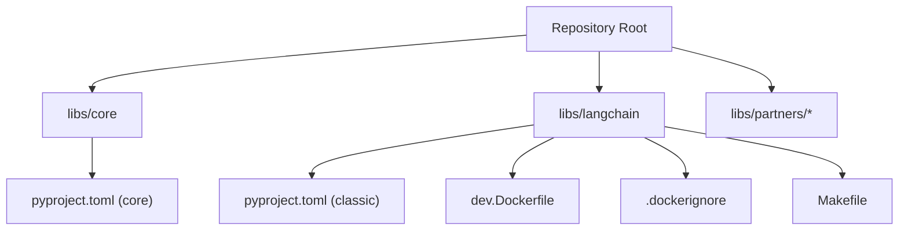
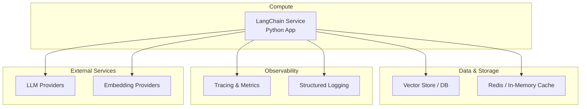
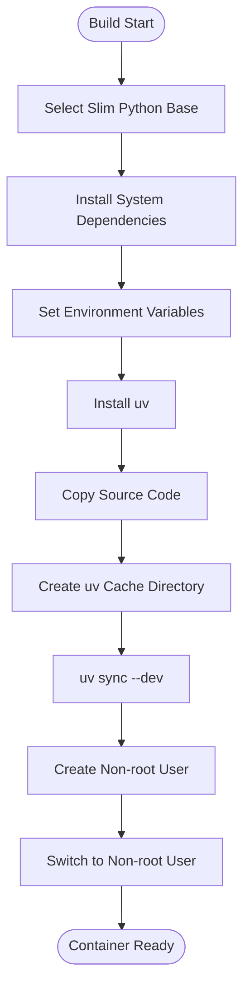
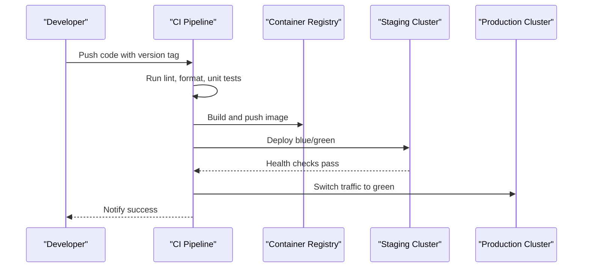
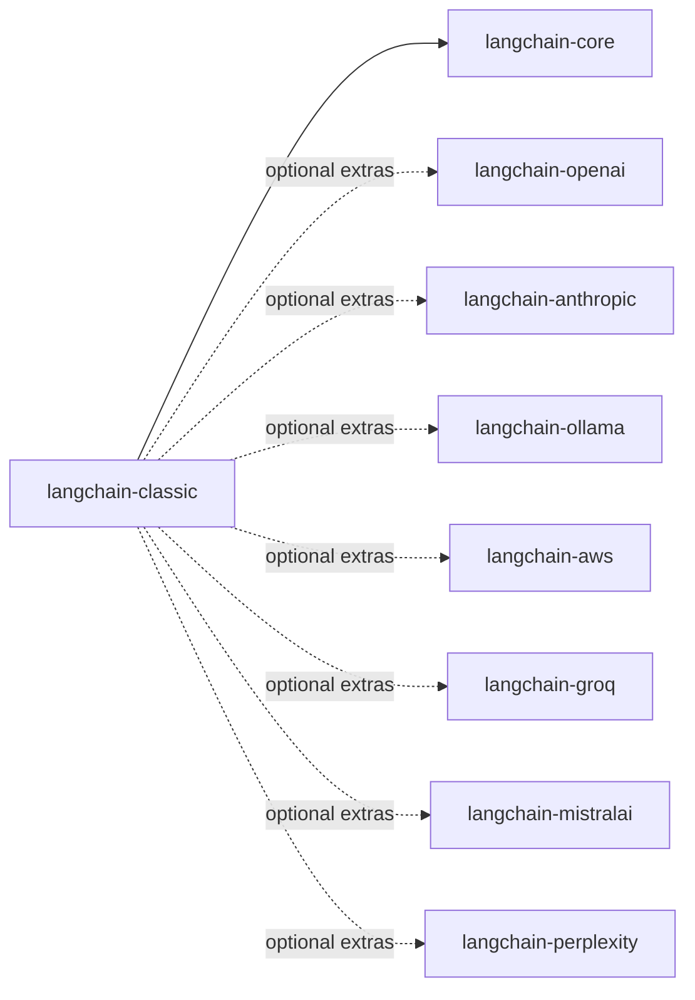

# Deployment and Production

<cite>
**Referenced Files in This Document**
- [README.md](file://README.md)
- [libs/langchain/README.md](file://libs/langchain/README.md)
- [libs/langchain/dev.Dockerfile](file://libs/langchain/dev.Dockerfile)
- [libs/langchain/.dockerignore](file://libs/langchain/.dockerignore)
- [libs/langchain/pyproject.toml](file://libs/langchain/pyproject.toml)
- [libs/core/pyproject.toml](file://libs/core/pyproject.toml)
- [libs/langchain/Makefile](file://libs/langchain/Makefile)
</cite>

## Table of Contents
1. [Introduction](#introduction)
2. [Project Structure](#project-structure)
3. [Core Components](#core-components)
4. [Architecture Overview](#architecture-overview)
5. [Detailed Component Analysis](#detailed-component-analysis)
6. [Dependency Analysis](#dependency-analysis)
7. [Performance Considerations](#performance-considerations)
8. [Troubleshooting Guide](#troubleshooting-guide)
9. [Conclusion](#conclusion)
10. [Appendices](#appendices)

## Introduction
This document provides production-focused guidance for deploying and operating LangChain applications. It consolidates containerization strategies, cloud deployment patterns, orchestration with Kubernetes, scaling and resource optimization, monitoring and observability, security best practices, CI/CD pipelines, blue-green deployments, rollback strategies, performance optimization, cost management, disaster recovery, backup strategies, and maintenance procedures. The content leverages repository artifacts such as Dockerfiles, project configurations, and Makefiles to ground recommendations in the actual project structure.

## Project Structure
LangChain is organized as a multi-package repository with a core library and optional partner integrations. The classic package depends on the core library and optional provider-specific packages. Containerization assets are present under the classic package, enabling reproducible builds and development environments.

**Diagram sources**
- [libs/langchain/pyproject.toml](file://libs/langchain/pyproject.toml#L1-L224)
- [libs/core/pyproject.toml](file://libs/core/pyproject.toml#L1-L137)
- [libs/langchain/dev.Dockerfile](file://libs/langchain/dev.Dockerfile#L1-L44)
- [libs/langchain/.dockerignore](file://libs/langchain/.dockerignore#L1-L6)
- [libs/langchain/Makefile](file://libs/langchain/Makefile#L1-L82)

Key observations:
- The classic package declares optional dependencies for various providers (e.g., OpenAI, Anthropic, Ollama, AWS).
- The core package defines shared runtime dependencies and testing/typing tooling.
- The classic package includes a development Dockerfile and a dockerignore file.

**Section sources**
- [libs/langchain/pyproject.toml](file://libs/langchain/pyproject.toml#L1-L224)
- [libs/core/pyproject.toml](file://libs/core/pyproject.toml#L1-L137)
- [libs/langchain/dev.Dockerfile](file://libs/langchain/dev.Dockerfile#L1-L44)
- [libs/langchain/.dockerignore](file://libs/langchain/.dockerignore#L1-L6)
- [libs/langchain/Makefile](file://libs/langchain/Makefile#L1-L82)

## Core Components
- LangChain Core: Provides foundational abstractions, runnables, prompts, outputs, and tracing utilities. It is a strict dependency for the classic package.
- LangChain Classic: Application-facing package that composes chains, agents, tools, and integrations. It optionally depends on provider-specific packages.
- Optional Provider Integrations: Packages such as OpenAI, Anthropic, Ollama, AWS, Groq, Mistral, Perplexity, and others are declared as extras in the classic package’s metadata.

Operational implications:
- For production, pin compatible versions of core and provider packages.
- Use optional extras to include only necessary integrations to minimize attack surface and image size.
- Centralize configuration via environment variables and secrets management.

**Section sources**
- [libs/langchain/pyproject.toml](file://libs/langchain/pyproject.toml#L14-L43)
- [libs/core/pyproject.toml](file://libs/core/pyproject.toml#L14-L23)

## Architecture Overview
The production architecture centers on a containerized service that exposes APIs for LangChain workflows, with optional persistence, caching, and observability layers.

[No sources needed since this diagram shows conceptual workflow, not actual code structure]

## Detailed Component Analysis

### Containerization Strategy
- Base Image: The development Dockerfile uses a slim Python base, installs system dependencies, and sets environment variables to optimize Python behavior in containers.
- Dependency Management: Uses uv for fast dependency resolution and installation, with a dedicated cache directory.
- Non-root User: Creates and switches to a non-root user for security.
- Build Context: The dockerignore file excludes unnecessary files and directories to reduce build size.

**Diagram sources**
- [libs/langchain/dev.Dockerfile](file://libs/langchain/dev.Dockerfile#L1-L44)
- [libs/langchain/.dockerignore](file://libs/langchain/.dockerignore#L1-L6)

Practical guidance:
- Multi-stage builds: Use a builder stage with compilers and uv, then copy only necessary artifacts into a minimal runtime stage to reduce size.
- Layer caching: Keep dependency installation steps stable; vendor lockfiles and deterministic installs improve cache hits.
- Security: Pin base images, regularly scan images, and rotate credentials. Avoid exposing secrets in layers.

**Section sources**
- [libs/langchain/dev.Dockerfile](file://libs/langchain/dev.Dockerfile#L1-L44)
- [libs/langchain/.dockerignore](file://libs/langchain/.dockerignore#L1-L6)

### Cloud Deployment Patterns
- AWS: Use ECS with Fargate for serverless compute, or EKS for Kubernetes. Store secrets in Secrets Manager or Parameter Store; use IAM roles for least privilege.
- GCP: Use Cloud Run or GKE. Store secrets in Secret Manager; apply Workload Identity for service accounts.
- Azure: Use Container Apps or AKS. Store secrets in Key Vault; use Managed Identities.

Patterns:
- Stateless services: Design LangChain services to be stateless; persist state externally (vector stores, databases).
- Regional redundancy: Deploy across multiple regions with traffic splitting.
- Health checks: Expose readiness/liveness probes aligned with application startup and warm-up.

[No sources needed since this section provides general guidance]

### Kubernetes Orchestration
- Deployments: Use rolling updates with maxUnavailable and maxSurge for controlled rollouts.
- Horizontal Pod Autoscaling (HPA): Scale on CPU/memory or custom metrics (QPS, latency).
- Resource Requests/Limits: Align with typical LLM inference patterns; provision headroom for burst.
- ConfigMaps/Secrets: Externalize configuration and credentials; mount as volumes or environment variables.
- Sidecars: Consider sidecars for logging/exporters or model caching.

[No sources needed since this section provides general guidance]

### Scaling Considerations
- Horizontal Scaling: Stateless replicas behind a load balancer; ensure idempotent operations where applicable.
- Auto-scaling Policies:
  - Target CPU/memory utilization thresholds.
  - Request rate and latency-based triggers.
  - Queue depth for batch workloads.
- Resource Optimization:
  - Right-size instances/containers based on observed concurrency and memory profiles.
  - Use connection pooling for database/vector stores.
  - Implement circuit breakers and retries with exponential backoff.

[No sources needed since this section provides general guidance]

### Monitoring and Observability
- Metrics: Track request throughput, latency (p50/p95/p99), error rates, queue length, and provider latencies.
- Structured Logging: Emit JSON logs with trace IDs; centralize with log aggregation platforms.
- Tracing: Export traces to distributed tracing backends; correlate slow paths with LLM calls.
- Dashboards: Visualize SLOs, saturation, and hotspots.
- Alerting: Alert on error spikes, latency SLO breaches, and resource exhaustion.

[No sources needed since this section provides general guidance]

### Security Best Practices
- Secret Management: Store API keys and tokens in platform-managed secret stores; inject via environment variables or mounted secrets.
- Network Security: Restrict inbound ports; enforce VPC/subnet segmentation; enable TLS termination at ingress.
- Access Controls: Principle of least privilege; use service accounts/roles; audit access.
- Supply Chain: Scan images, pin dependencies, and monitor for vulnerabilities; automate remediation.

[No sources needed since this section provides general guidance]

### CI/CD Pipelines, Blue-Green, and Rollback
- CI: Automated linting, formatting, unit tests, and integration tests using the project’s Makefile targets.
- CD: Push tagged images to a registry; deploy manifests to staging, then production.
- Blue-Green: Maintain two identical environments; switch traffic after validation.
- Rollback: Re-tag previous working image; revert routing; notify stakeholders.

**Diagram sources**
- [libs/langchain/Makefile](file://libs/langchain/Makefile#L17-L34)

**Section sources**
- [libs/langchain/Makefile](file://libs/langchain/Makefile#L1-L82)

### Performance Optimization Techniques
- Warm-up: Pre-warm embeddings and small models during container initialization.
- Caching: Cache embeddings and frequent LLM responses; invalidate on content changes.
- Streaming: Prefer streaming responses for long prompts to improve perceived latency.
- Batch Processing: Batch vector operations and embedding calls where feasible.
- Model Selection: Choose smaller models for routine tasks; reserve larger models for complex reasoning.

[No sources needed since this section provides general guidance]

### Cost Management and Resource Planning
- Compute: Right-size instances/containers; use reserved/committed instances where predictable.
- Storage: Use efficient vector indices; periodically prune stale data.
- Networking: Minimize cross-region traffic; colocate services and data.
- Billing Alerts: Monitor spend per service/provider; cap budgets.

[No sources needed since this section provides general guidance]

### Disaster Recovery, Backup Strategies, and Maintenance
- Backups: Regular snapshots of persistent volumes and managed databases; export vector indices periodically.
- DR Plan: Replicate stateful components across regions; automate failover.
- Maintenance Windows: Schedule upgrades during low-traffic periods; validate in staging first.
- Patching: Apply OS/container patches and dependency updates systematically.

[No sources needed since this section provides general guidance]

## Dependency Analysis
The classic package depends on the core package and optional provider integrations. Understanding these relationships is essential for production builds and updates.

**Diagram sources**
- [libs/langchain/pyproject.toml](file://libs/langchain/pyproject.toml#L14-L43)
- [libs/core/pyproject.toml](file://libs/core/pyproject.toml#L14-L23)

Operational implications:
- Pin compatible versions across core and provider packages.
- Limit optional extras to those in active use to reduce attack surface and image size.
- Use dependency groups for testing and linting to keep production images lean.

**Section sources**
- [libs/langchain/pyproject.toml](file://libs/langchain/pyproject.toml#L14-L43)
- [libs/core/pyproject.toml](file://libs/core/pyproject.toml#L14-L23)

## Performance Considerations
- Build performance: The project uses uv for fast dependency resolution; maintain deterministic lockfiles to speed up CI.
- Test performance: Parallelize tests with xdist and disable external sockets in CI for determinism.
- Runtime performance: Align container resource limits with observed concurrency; provision headroom for LLM bursts.

**Section sources**
- [libs/langchain/Makefile](file://libs/langchain/Makefile#L17-L34)
- [libs/langchain/pyproject.toml](file://libs/langchain/pyproject.toml#L53-L116)

## Troubleshooting Guide
- Build failures: Verify uv cache directory permissions and ensure the correct working directory is set before dependency sync.
- Test flakiness: Disable external sockets in CI and use snapshot testing to stabilize outputs.
- Lint/format errors: Use the provided Ruff and MyPy configurations; run locally before pushing.

**Section sources**
- [libs/langchain/dev.Dockerfile](file://libs/langchain/dev.Dockerfile#L27-L33)
- [libs/langchain/Makefile](file://libs/langchain/Makefile#L55-L63)
- [libs/langchain/pyproject.toml](file://libs/langchain/pyproject.toml#L125-L176)

## Conclusion
Deploying LangChain applications in production requires disciplined containerization, secure configuration management, robust observability, and scalable operational practices. By leveraging the repository’s Dockerfile and project configuration, teams can build reproducible images, manage dependencies effectively, and operate reliable, high-performance services across cloud providers and Kubernetes clusters.

## Appendices
- Additional resources and links to official documentation are available in the repository’s top-level README.

**Section sources**
- [README.md](file://README.md#L35-L39)
- [libs/langchain/README.md](file://libs/langchain/README.md#L10-L11)