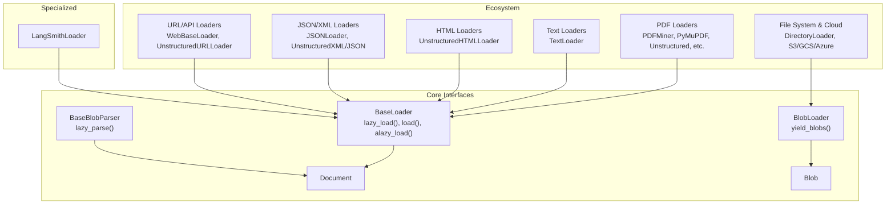
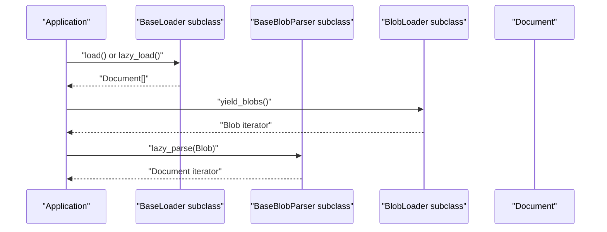
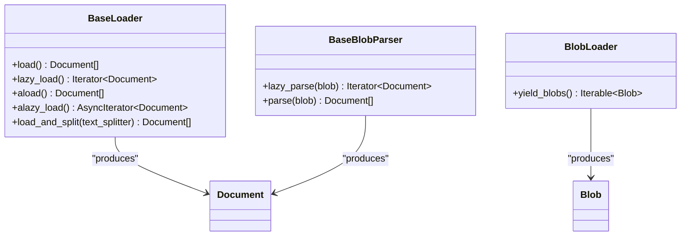
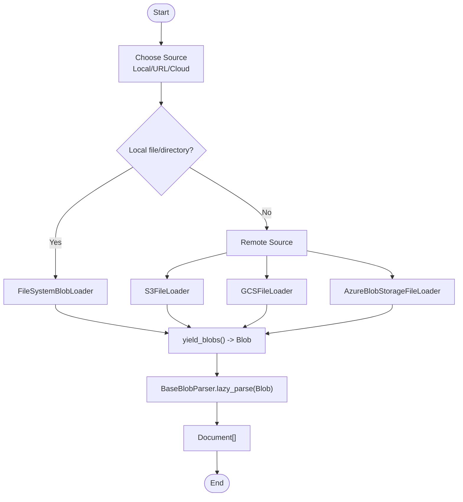
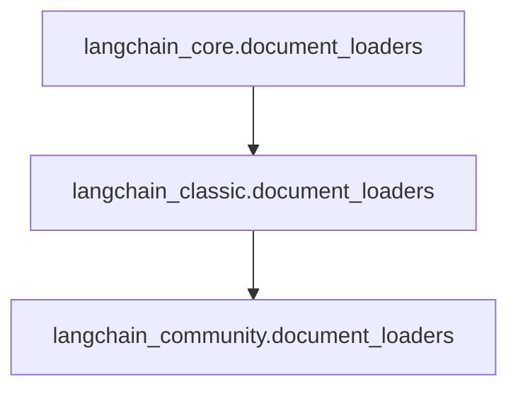
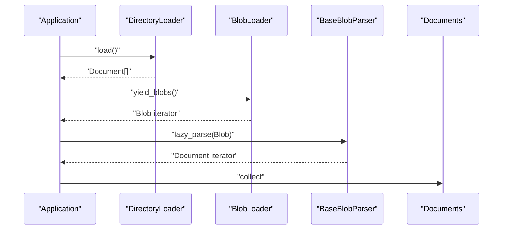

# Document Loaders

<cite>
**Referenced Files in This Document**
- [libs/core/langchain_core/document_loaders/__init__.py](file://libs/core/langchain_core/document_loaders/__init__.py)
- [libs/core/langchain_core/document_loaders/base.py](file://libs/core/langchain_core/document_loaders/base.py)
- [libs/core/langchain_core/document_loaders/blob_loaders.py](file://libs/core/langchain_core/document_loaders/blob_loaders.py)
- [libs/core/langchain_core/documents/base.py](file://libs/core/langchain_core/documents/base.py)
- [libs/core/tests/unit_tests/document_loaders/test_base.py](file://libs/core/tests/unit_tests/document_loaders/test_base.py)
- [libs/langchain/langchain_classic/document_loaders/__init__.py](file://libs/langchain/langchain_classic/document_loaders/__init__.py)
- [libs/langchain/langchain_classic/document_loaders/pdf.py](file://libs/langchain/langchain_classic/document_loaders/pdf.py)
- [libs/langchain/langchain_classic/document_loaders/text.py](file://libs/langchain/langchain_classic/document_loaders/text.py)
- [libs/langchain/langchain_classic/document_loaders/html.py](file://libs/langchain/langchain_classic/document_loaders/html.py)
- [libs/langchain/langchain_classic/document_loaders/langsmith.py](file://libs/langchain/langchain_classic/document_loaders/langsmith.py)
</cite>

## Table of Contents
1. [Introduction](#introduction)
2. [Project Structure](#project-structure)
3. [Core Components](#core-components)
4. [Architecture Overview](#architecture-overview)
5. [Detailed Component Analysis](#detailed-component-analysis)
6. [Dependency Analysis](#dependency-analysis)
7. [Performance Considerations](#performance-considerations)
8. [Troubleshooting Guide](#troubleshooting-guide)
9. [Conclusion](#conclusion)
10. [Appendices](#appendices)

## Introduction
This document explains LangChain’s document loader system, focusing on the BaseLoader and BaseBlobParser abstractions, the blob loader pattern for binary content, and the ecosystem of built-in loaders for common formats (PDF, DOCX, TXT, CSV, HTML) and specialized formats (JSON, XML, programming languages). It also covers configuration options, metadata extraction, batch processing, encoding handling, page extraction from PDFs, table parsing, header detection, and practical examples for local files, URLs, cloud storage, and APIs. Guidance on error handling, performance optimization, memory management, and parallel loading is included, along with patterns for developing custom loaders and integrating external document processing libraries.

## Project Structure
LangChain separates the core loader interfaces from the concrete implementations. The core interfaces live under langchain_core, while concrete loader implementations are primarily provided by langchain_community and exposed via langchain_classic’s dynamic import mechanism.

Key areas:
- Core loader interfaces: BaseLoader, BaseBlobParser, BlobLoader, and related re-exports
- Document representation: Blob and Document types
- Loader ecosystem: Dynamic imports for many built-in loaders (PDF, text, HTML, etc.)
- Specialized loader: LangSmithLoader

**Diagram sources**
- [libs/core/langchain_core/document_loaders/base.py](file://libs/core/langchain_core/document_loaders/base.py#L26-L115)
- [libs/core/langchain_core/document_loaders/blob_loaders.py](file://libs/core/langchain_core/document_loaders/blob_loaders.py#L19-L35)
- [libs/core/langchain_core/documents/base.py](file://libs/core/langchain_core/documents/base.py)
- [libs/langchain/langchain_classic/document_loaders/pdf.py](file://libs/langchain/langchain_classic/document_loaders/pdf.py#L1-L66)
- [libs/langchain/langchain_classic/document_loaders/text.py](file://libs/langchain/langchain_classic/document_loaders/text.py#L1-L24)
- [libs/langchain/langchain_classic/document_loaders/html.py](file://libs/langchain/langchain_classic/document_loaders/html.py#L1-L24)
- [libs/langchain/langchain_classic/document_loaders/__init__.py](file://libs/langchain/langchain_classic/document_loaders/__init__.py#L1-L200)
- [libs/langchain/langchain_classic/document_loaders/langsmith.py](file://libs/langchain/langchain_classic/document_loaders/langsmith.py)

**Section sources**
- [libs/core/langchain_core/document_loaders/__init__.py](file://libs/core/langchain_core/document_loaders/__init__.py#L1-L40)
- [libs/core/langchain_core/document_loaders/base.py](file://libs/core/langchain_core/document_loaders/base.py#L26-L115)
- [libs/core/langchain_core/document_loaders/blob_loaders.py](file://libs/core/langchain_core/document_loaders/blob_loaders.py#L19-L35)
- [libs/langchain/langchain_classic/document_loaders/__init__.py](file://libs/langchain/langchain_classic/document_loaders/__init__.py#L1-L200)

## Core Components
- BaseLoader: Defines the contract for loading documents. Provides synchronous and asynchronous lazy-loading methods, and convenience methods for eager loading and splitting.
- BaseBlobParser: Parses raw binary content (Blob) into Document objects, enabling separation of concerns between loading and parsing.
- BlobLoader: Loads raw binary content as Blobs, often used for filesystem and cloud integrations.
- Document and Blob: Core data structures representing parsed content and raw bytes respectively.

Key capabilities:
- Lazy loading to manage memory for large collections
- Asynchronous variants for IO-bound workloads
- Optional text splitting integration for chunking after load
- Composable design: BlobLoader + BaseBlobParser enables reusable parsing strategies

**Section sources**
- [libs/core/langchain_core/document_loaders/base.py](file://libs/core/langchain_core/document_loaders/base.py#L26-L115)
- [libs/core/langchain_core/document_loaders/base.py](file://libs/core/langchain_core/document_loaders/base.py#L117-L156)
- [libs/core/langchain_core/document_loaders/blob_loaders.py](file://libs/core/langchain_core/document_loaders/blob_loaders.py#L19-L35)
- [libs/core/langchain_core/documents/base.py](file://libs/core/langchain_core/documents/base.py)

## Architecture Overview
The loader architecture separates content ingestion from content parsing. BlobLoader yields raw content as Blobs, which can be consumed by BaseBlobParser implementations to produce Documents. Alternatively, concrete loaders implement BaseLoader to ingest and parse in one step. The ecosystem exposes many specialized loaders for different formats and sources.

**Diagram sources**
- [libs/core/langchain_core/document_loaders/base.py](file://libs/core/langchain_core/document_loaders/base.py#L37-L115)
- [libs/core/langchain_core/document_loaders/blob_loaders.py](file://libs/core/langchain_core/document_loaders/blob_loaders.py#L26-L35)
- [libs/core/langchain_core/document_loaders/base.py](file://libs/core/langchain_core/document_loaders/base.py#L127-L156)

## Detailed Component Analysis

### BaseLoader and BaseBlobParser
- BaseLoader offers:
  - load(): eager conversion to list
  - lazy_load(): generator for memory-efficient iteration
  - aload()/alazy_load(): async variants
  - load_and_split(): integrates optional text splitting
- BaseBlobParser offers:
  - lazy_parse(): generator-based parsing of Blob
  - parse(): eager convenience wrapper

**Diagram sources**
- [libs/core/langchain_core/document_loaders/base.py](file://libs/core/langchain_core/document_loaders/base.py#L26-L115)
- [libs/core/langchain_core/document_loaders/base.py](file://libs/core/langchain_core/document_loaders/base.py#L117-L156)
- [libs/core/langchain_core/document_loaders/blob_loaders.py](file://libs/core/langchain_core/document_loaders/blob_loaders.py#L19-L35)
- [libs/core/langchain_core/documents/base.py](file://libs/core/langchain_core/documents/base.py)

**Section sources**
- [libs/core/langchain_core/document_loaders/base.py](file://libs/core/langchain_core/document_loaders/base.py#L26-L115)
- [libs/core/langchain_core/document_loaders/base.py](file://libs/core/langchain_core/document_loaders/base.py#L117-L156)
- [libs/core/langchain_core/document_loaders/blob_loaders.py](file://libs/core/langchain_core/document_loaders/blob_loaders.py#L19-L35)

### Built-in Loaders Overview
LangChain’s loader ecosystem is extensive and dynamically imported via langchain_classic. The __all__ list enumerates many loaders for common and specialized formats. The pdf.py, text.py, and html.py modules demonstrate the dynamic import pattern used across the loader family.

Common categories:
- PDF: PDFMiner, PyMuPDF, Unstructured, AmazonTextract, Mathpix, OnlinePDF, PyPDFium2, PyPDFDirectory, PagedPDFSplitter
- Text/Plain: TextLoader
- HTML: UnstructuredHTMLLoader
- JSON/XML: JSONLoader and Unstructured variants
- Programming languages: Unstructured variants for Markdown, RST, RTF, ODT, etc.
- Batch/Directory: DirectoryLoader, S3/GCS/Azure loaders
- URLs/APIs: WebBaseLoader, UnstructuredURLLoader, Playwright/Selenium-based loaders

Practical examples (conceptual):
- Local files: TextLoader, DirectoryLoader
- URLs: WebBaseLoader, UnstructuredURLLoader
- Cloud storage: S3FileLoader, GCSFileLoader, AzureBlobStorageFileLoader
- APIs: Many community loaders integrate with third-party APIs

**Section sources**
- [libs/langchain/langchain_classic/document_loaders/__init__.py](file://libs/langchain/langchain_classic/document_loaders/__init__.py#L1-L200)
- [libs/langchain/langchain_classic/document_loaders/pdf.py](file://libs/langchain/langchain_classic/document_loaders/pdf.py#L1-L66)
- [libs/langchain/langchain_classic/document_loaders/text.py](file://libs/langchain/langchain_classic/document_loaders/text.py#L1-L24)
- [libs/langchain/langchain_classic/document_loaders/html.py](file://libs/langchain/langchain_classic/document_loaders/html.py#L1-L24)

### Blob Loader System and File System Integration
- BlobLoader defines a lazy interface to yield raw content as Blobs.
- FileSystemBlobLoader is available for file system integration.
- DirectoryLoader supports batch processing across directories.
- Cloud integrations include S3, GCS, Azure Blob Storage loaders.

**Diagram sources**
- [libs/core/langchain_core/document_loaders/blob_loaders.py](file://libs/core/langchain_core/document_loaders/blob_loaders.py#L19-L35)
- [libs/langchain/langchain_classic/document_loaders/__init__.py](file://libs/langchain/langchain_classic/document_loaders/__init__.py#L420-L478)

**Section sources**
- [libs/core/langchain_core/document_loaders/blob_loaders.py](file://libs/core/langchain_core/document_loaders/blob_loaders.py#L19-L35)
- [libs/langchain/langchain_classic/document_loaders/__init__.py](file://libs/langchain/langchain_classic/document_loaders/__init__.py#L420-L478)

### Loader Configuration Options, Metadata Extraction, and Batch Processing
- Configuration options vary by loader but commonly include encoding, headers, metadata templates, page ranges, and parser-specific settings.
- Metadata extraction is supported by many loaders; typical keys include source path, URL, timestamps, and format-specific attributes.
- Batch processing is achieved via DirectoryLoader and similar directory-based loaders to process multiple files efficiently.

[No sources needed since this section provides general guidance]

### Encoding Types, Page Extraction, Table Parsing, Header Detection
- Encoding: Specify encoding when loading text-based formats to avoid misinterpretation of special characters.
- Page extraction (PDF): Use loaders that support page ranges or iterate pages for targeted extraction.
- Table parsing and header detection: Leverage Unstructured-based loaders or dedicated parsers that expose table and header detection options.

[No sources needed since this section provides general guidance]

### Practical Examples
- Local files: Use TextLoader for plain text; DirectoryLoader for batches.
- URLs: Use WebBaseLoader or UnstructuredURLLoader for web scraping and parsing.
- Cloud storage: Use S3FileLoader, GCSFileLoader, or AzureBlobStorageFileLoader for remote files.
- APIs: Integrate with community loaders that wrap third-party APIs.

[No sources needed since this section provides general guidance]

### Error Handling
- Corrupted files: Catch loader-specific exceptions and skip or quarantine problematic items.
- Unsupported formats: Gracefully handle missing optional dependencies and provide fallbacks.
- Large files: Prefer lazy loading and streaming; apply chunking and memory limits.

[No sources needed since this section provides general guidance]

### Custom Loader Development Patterns
- Implement BaseLoader for format-specific ingestion or BaseBlobParser for raw-binary parsing.
- Compose BlobLoader + BaseBlobParser for reusable parsing strategies.
- Integrate external libraries by wrapping their APIs in a loader class and exposing the standard interface.

[No sources needed since this section provides general guidance]

## Dependency Analysis
The loader ecosystem relies on dynamic imports to expose a large number of loaders while keeping installation minimal. The core interfaces are defined in langchain_core and re-exported via langchain_core.document_loaders.__init__. Concrete implementations are provided by langchain_community and surfaced through langchain_classic.

**Diagram sources**
- [libs/core/langchain_core/document_loaders/__init__.py](file://libs/core/langchain_core/document_loaders/__init__.py#L21-L28)
- [libs/langchain/langchain_classic/document_loaders/__init__.py](file://libs/langchain/langchain_classic/document_loaders/__init__.py#L1-L200)

**Section sources**
- [libs/core/langchain_core/document_loaders/__init__.py](file://libs/core/langchain_core/document_loaders/__init__.py#L21-L28)
- [libs/langchain/langchain_classic/document_loaders/__init__.py](file://libs/langchain/langchain_classic/document_loaders/__init__.py#L1-L200)

## Performance Considerations
- Prefer lazy loading (lazy_load/alazy_load) to avoid loading entire collections into memory.
- Use asynchronous loaders for IO-bound scenarios.
- Apply chunking after load to reduce downstream memory pressure.
- Limit concurrent loads and tune worker pools for large batches.
- Stream large files and avoid buffering entire content when possible.

[No sources needed since this section provides general guidance]

## Troubleshooting Guide
- Symptom: Memory spikes during load
  - Action: Switch to lazy_load and process in batches; consider chunking.
- Symptom: Incorrect characters in text
  - Action: Explicitly set encoding for text loaders.
- Symptom: Missing optional dependencies
  - Action: Install required packages for specific loaders; use load_and_split only when langchain-text-splitters is available.
- Symptom: Slow PDF parsing
  - Action: Use lighter-weight loaders (e.g., PyMuPDF) or restrict page ranges.

**Section sources**
- [libs/core/langchain_core/document_loaders/base.py](file://libs/core/langchain_core/document_loaders/base.py#L74-L87)
- [libs/core/tests/unit_tests/document_loaders/test_base.py](file://libs/core/tests/unit_tests/document_loaders/test_base.py#L36-L59)

## Conclusion
LangChain’s document loader system provides a robust, extensible framework for ingesting diverse content types from multiple sources. By adhering to BaseLoader and BaseBlobParser contracts, developers can build efficient, composable loaders that integrate seamlessly with external libraries and support advanced features like lazy loading, asynchronous processing, and batch operations.

[No sources needed since this section summarizes without analyzing specific files]

## Appendices

### Appendix A: Example Workflows

**Diagram sources**
- [libs/core/langchain_core/document_loaders/base.py](file://libs/core/langchain_core/document_loaders/base.py#L37-L115)
- [libs/core/langchain_core/document_loaders/blob_loaders.py](file://libs/core/langchain_core/document_loaders/blob_loaders.py#L26-L35)
- [libs/core/langchain_core/document_loaders/base.py](file://libs/core/langchain_core/document_loaders/base.py#L127-L156)