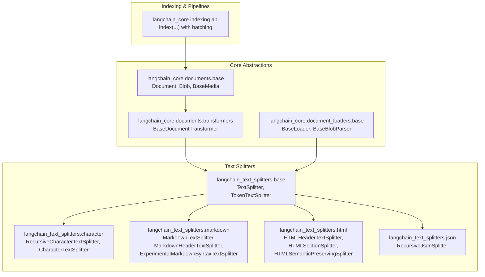
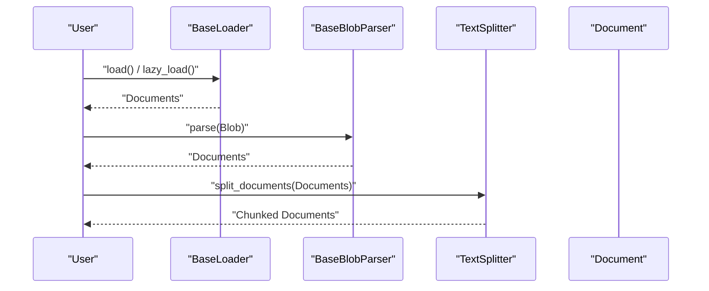
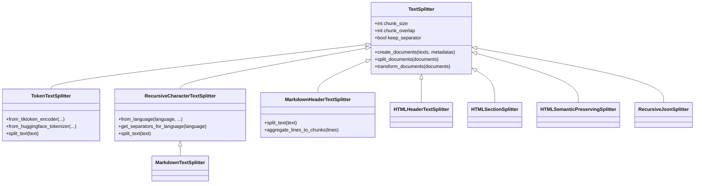
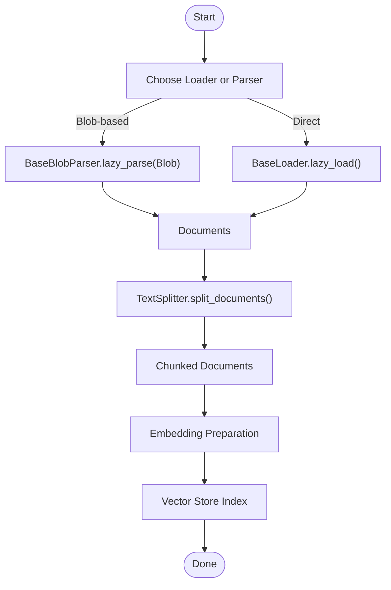
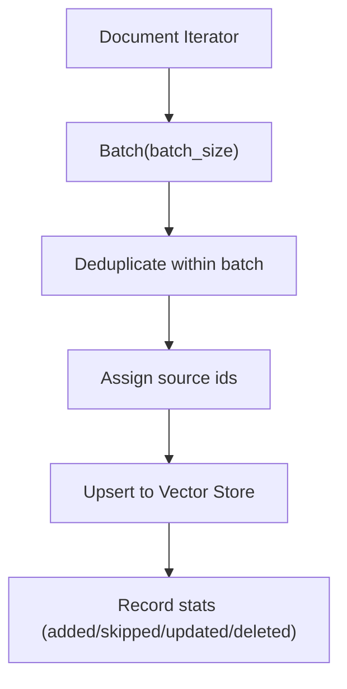
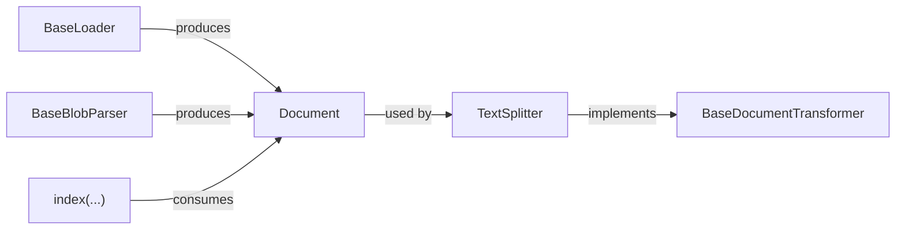

# Document Processing

<cite>
**Referenced Files in This Document**
- [base.py](file://libs/text-splitters/langchain_text_splitters/base.py)
- [character.py](file://libs/text-splitters/langchain_text_splitters/character.py)
- [markdown.py](file://libs/text-splitters/langchain_text_splitters/markdown.py)
- [html.py](file://libs/text-splitters/langchain_text_splitters/html.py)
- [json.py](file://libs/text-splitters/langchain_text_splitters/json.py)
- [base.py](file://libs/core/langchain_core/documents/base.py)
- [transformers.py](file://libs/core/langchain_core/documents/transformers.py)
- [base.py](file://libs/core/langchain_core/document_loaders/base.py)
- [__init__.py](file://libs/text-splitters/langchain_text_splitters/__init__.py)
- [__init__.py](file://libs/core/langchain_core/documents/__init__.py)
- [api.py](file://libs/core/langchain_core/indexing/api.py)
- [test_indexing.py](file://libs/core/tests/unit_tests/indexing/test_indexing.py)
</cite>

## Table of Contents
1. [Introduction](#introduction)
2. [Project Structure](#project-structure)
3. [Core Components](#core-components)
4. [Architecture Overview](#architecture-overview)
5. [Detailed Component Analysis](#detailed-component-analysis)
6. [Dependency Analysis](#dependency-analysis)
7. [Performance Considerations](#performance-considerations)
8. [Troubleshooting Guide](#troubleshooting-guide)
9. [Conclusion](#conclusion)
10. [Appendices](#appendices)

## Introduction
This document explains LangChain’s end-to-end document processing pipeline: from raw data ingestion to text splitting and embedding preparation. It covers:
- Document loader interfaces and blob parsing
- Text splitting strategies (character-based, sentence-based, token-based, and semantic-aware)
- Document transformation and metadata handling
- Batch processing and indexing for large-scale ingestion
- Practical guidance for building pipelines, configuring splitters, and integrating with vector stores
- Validation, error handling, and quality assurance

## Project Structure
LangChain organizes document processing across three primary layers:
- Core abstractions for documents and transformations
- Text splitters implementing various strategies
- Loader interfaces for ingesting diverse formats

**Diagram sources**
- [base.py](file://libs/core/langchain_core/documents/base.py#L288-L348)
- [transformers.py](file://libs/core/langchain_core/documents/transformers.py#L16-L80)
- [base.py](file://libs/core/langchain_core/document_loaders/base.py#L26-L156)
- [base.py](file://libs/text-splitters/langchain_text_splitters/base.py#L44-L296)
- [character.py](file://libs/text-splitters/langchain_text_splitters/character.py#L11-L804)
- [markdown.py](file://libs/text-splitters/langchain_text_splitters/markdown.py#L14-L482)
- [html.py](file://libs/text-splitters/langchain_text_splitters/html.py#L83-L1064)
- [json.py](file://libs/text-splitters/langchain_text_splitters/json.py#L172-L190)
- [api.py](file://libs/core/langchain_core/indexing/api.py#L454-L831)

**Section sources**
- [base.py](file://libs/core/langchain_core/documents/base.py#L1-L348)
- [transformers.py](file://libs/core/langchain_core/documents/transformers.py#L1-L80)
- [base.py](file://libs/core/langchain_core/document_loaders/base.py#L1-L156)
- [base.py](file://libs/text-splitters/langchain_text_splitters/base.py#L1-L451)
- [character.py](file://libs/text-splitters/langchain_text_splitters/character.py#L1-L804)
- [markdown.py](file://libs/text-splitters/langchain_text_splitters/markdown.py#L1-L482)
- [html.py](file://libs/text-splitters/langchain_text_splitters/html.py#L1-L1064)
- [json.py](file://libs/text-splitters/langchain_text_splitters/json.py#L172-L190)
- [api.py](file://libs/core/langchain_core/indexing/api.py#L454-L831)

## Core Components
- Document: The fundamental unit of text and metadata for retrieval.
- BaseDocumentTransformer: Interface for transforming sequences of Documents (used by splitters).
- BaseLoader and BaseBlobParser: Interfaces for loading and parsing raw data into Documents.
- TextSplitter: Base class for chunking text with configurable strategies and metadata handling.
- TokenTextSplitter: Token-aware splitting using encoders (tiktoken/Hugging Face).
- RecursiveCharacterTextSplitter: Multi-level character-based splitting with language-aware defaults.
- Markdown/HTML/JSON splitters: Format-specific strategies preserving structure and metadata.

**Section sources**
- [base.py](file://libs/core/langchain_core/documents/base.py#L288-L348)
- [transformers.py](file://libs/core/langchain_core/documents/transformers.py#L16-L80)
- [base.py](file://libs/core/langchain_core/document_loaders/base.py#L26-L156)
- [base.py](file://libs/text-splitters/langchain_text_splitters/base.py#L44-L296)
- [character.py](file://libs/text-splitters/langchain_text_splitters/character.py#L88-L158)

## Architecture Overview
The pipeline transforms raw data into chunked Documents suitable for embedding and indexing.

**Diagram sources**
- [base.py](file://libs/core/langchain_core/document_loaders/base.py#L37-L114)
- [base.py](file://libs/core/langchain_core/document_loaders/base.py#L140-L156)
- [base.py](file://libs/text-splitters/langchain_text_splitters/base.py#L131-L144)

## Detailed Component Analysis

### Text Splitter System
- TextSplitter: Validates chunk size/overlap, merges splits, and supports length functions (chars/tokens). Provides create_documents and split_documents helpers.
- TokenTextSplitter: Uses tiktoken or Hugging Face tokenizers to compute lengths and split on token boundaries.
- RecursiveCharacterTextSplitter: Recursively tries separators (e.g., newlines, spaces) to produce balanced chunks; supports language-specific defaults.
- Markdown/HTML/JSON splitters: Preserve semantic structure and metadata for hierarchical content.

**Diagram sources**
- [base.py](file://libs/text-splitters/langchain_text_splitters/base.py#L44-L296)
- [character.py](file://libs/text-splitters/langchain_text_splitters/character.py#L11-L804)
- [markdown.py](file://libs/text-splitters/langchain_text_splitters/markdown.py#L14-L482)
- [html.py](file://libs/text-splitters/langchain_text_splitters/html.py#L83-L1064)
- [json.py](file://libs/text-splitters/langchain_text_splitters/json.py#L172-L190)

**Section sources**
- [base.py](file://libs/text-splitters/langchain_text_splitters/base.py#L44-L296)
- [character.py](file://libs/text-splitters/langchain_text_splitters/character.py#L88-L158)
- [markdown.py](file://libs/text-splitters/langchain_text_splitters/markdown.py#L14-L281)
- [html.py](file://libs/text-splitters/langchain_text_splitters/html.py#L83-L1064)
- [json.py](file://libs/text-splitters/langchain_text_splitters/json.py#L172-L190)

### Document Loader System
- BaseLoader: Lazy-loading APIs (sync and async), convenience load(), and load_and_split() with default RecursiveCharacterTextSplitter.
- BaseBlobParser: Parses raw Blob data into Documents; supports lazy_parse and eager parse().
- Loader ecosystem: Extensive format support via community packages (PDF, DOCX, HTML, CSV, etc.).

**Diagram sources**
- [base.py](file://libs/core/langchain_core/document_loaders/base.py#L26-L156)
- [base.py](file://libs/core/langchain_core/documents/transformers.py#L16-L80)

**Section sources**
- [base.py](file://libs/core/langchain_core/document_loaders/base.py#L26-L156)
- [base.py](file://libs/core/langchain_core/documents/transformers.py#L16-L80)

### Document Transformation Techniques
- Metadata preservation: Splitters propagate metadata from input Documents to chunks; some splitters (HTML/Markdown) enrich metadata with headers/tags.
- Preprocessing: HTML splitter optionally preserves links/elements and normalizes text; JSON splitter converts nested structures to chunks.
- Redundancy filtering and clustering filters are available via BaseDocumentTransformer implementations.

**Section sources**
- [base.py](file://libs/text-splitters/langchain_text_splitters/base.py#L103-L144)
- [html.py](file://libs/text-splitters/langchain_text_splitters/html.py#L376-L403)
- [json.py](file://libs/text-splitters/langchain_text_splitters/json.py#L172-L190)
- [transformers.py](file://libs/core/langchain_core/documents/transformers.py#L16-L80)

### Batch Processing and Indexing
- Indexing API supports batching, within-batch deduplication, and incremental updates.
- Batching reduces memory pressure and improves throughput for large document sets.

**Diagram sources**
- [api.py](file://libs/core/langchain_core/indexing/api.py#L454-L831)

**Section sources**
- [api.py](file://libs/core/langchain_core/indexing/api.py#L454-L831)
- [test_indexing.py](file://libs/core/tests/unit_tests/indexing/test_indexing.py#L2057-L2102)

### Practical Examples and Guidance
- Building a pipeline:
  - Select a loader/parser for the target format (PDF/DOCX/HTML/CSV).
  - Convert to Documents and apply a TextSplitter suited to content type.
  - Prepare embeddings and index into a vector store.
- Configuring splitters:
  - Use language-specific separators for code/markdown.
  - Prefer token-aware splitting for LLM prompts.
  - Use HTML/Markdown splitters to preserve semantic structure and metadata.
- Integrating with vector stores:
  - Use the indexing API to batch and deduplicate.
  - Ensure metadata is preserved for downstream filtering/retrieval.

[No sources needed since this subsection provides general guidance]

## Dependency Analysis
Key relationships:
- TextSplitters depend on Document abstractions and implement BaseDocumentTransformer.
- Loaders depend on splitters for chunking and on Blob for raw data handling.
- Indexing orchestrates batching and deduplication across Documents.

**Diagram sources**
- [base.py](file://libs/core/langchain_core/documents/base.py#L288-L348)
- [transformers.py](file://libs/core/langchain_core/documents/transformers.py#L16-L80)
- [base.py](file://libs/core/langchain_core/document_loaders/base.py#L26-L156)
- [base.py](file://libs/text-splitters/langchain_text_splitters/base.py#L44-L296)
- [api.py](file://libs/core/langchain_core/indexing/api.py#L454-L831)

**Section sources**
- [__init__.py](file://libs/text-splitters/langchain_text_splitters/__init__.py#L44-L69)
- [__init__.py](file://libs/core/langchain_core/documents/__init__.py#L1-L200)

## Performance Considerations
- Prefer token-aware splitting for prompt-size constrained workflows.
- Use lazy loading and async APIs to reduce memory footprint.
- Batch indexing to minimize repeated writes and improve deduplication efficiency.
- Normalize text and strip whitespace to reduce chunk sizes without losing meaning.

[No sources needed since this section provides general guidance]

## Troubleshooting Guide
- Import errors: Some splitters require optional dependencies (e.g., BeautifulSoup, NLTK, sentence-transformers). Install extras as indicated by error messages.
- Chunk sizing: If chunks exceed model limits, adjust chunk_size or use token-aware splitting.
- Metadata loss: Ensure metadata is propagated through splitters and loaders; verify custom transformers preserve required fields.
- Deduplication: Use within-batch deduplication to avoid redundant writes; monitor counts for correctness.

**Section sources**
- [html.py](file://libs/text-splitters/langchain_text_splitters/html.py#L659-L713)
- [base.py](file://libs/text-splitters/langchain_text_splitters/base.py#L250-L281)
- [base.py](file://libs/text-splitters/langchain_text_splitters/base.py#L166-L172)
- [api.py](file://libs/core/langchain_core/indexing/api.py#L454-L831)

## Conclusion
LangChain’s document processing stack combines robust abstractions (Document, BaseLoader, BaseDocumentTransformer) with flexible, format-aware splitters. By selecting appropriate strategies, preserving metadata, and leveraging batching/indexing, teams can reliably scale ingestion and retrieval pipelines for diverse content types.

[No sources needed since this section summarizes without analyzing specific files]

## Appendices

### Appendix A: Supported Splitters Overview
- Character-based: RecursiveCharacterTextSplitter, CharacterTextSplitter
- Sentence-based: NLTKTextSplitter (requires NLTK)
- Token-based: TokenTextSplitter (tiktoken/Hugging Face)
- Semantic-aware: HTML/Markdown/JSON splitters with metadata enrichment

**Section sources**
- [__init__.py](file://libs/text-splitters/langchain_text_splitters/__init__.py#L44-L69)
- [character.py](file://libs/text-splitters/langchain_text_splitters/character.py#L88-L158)
- [markdown.py](file://libs/text-splitters/langchain_text_splitters/markdown.py#L14-L281)
- [html.py](file://libs/text-splitters/langchain_text_splitters/html.py#L83-L1064)
- [json.py](file://libs/text-splitters/langchain_text_splitters/json.py#L172-L190)