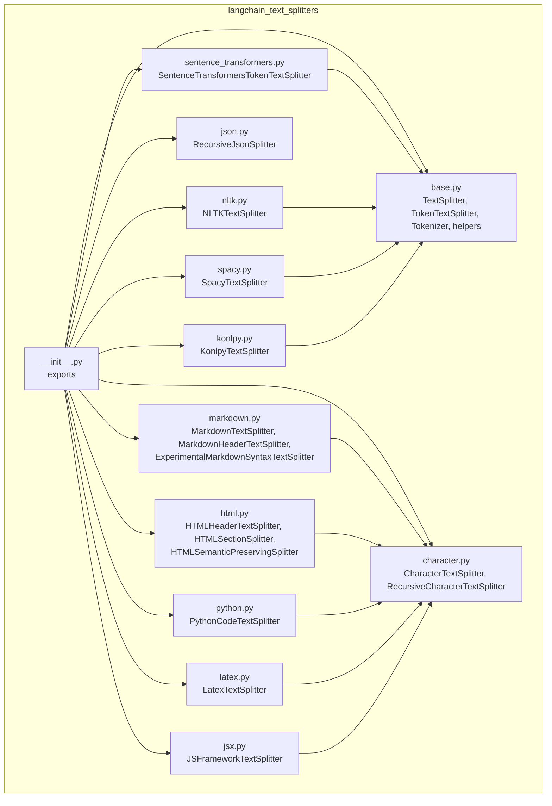
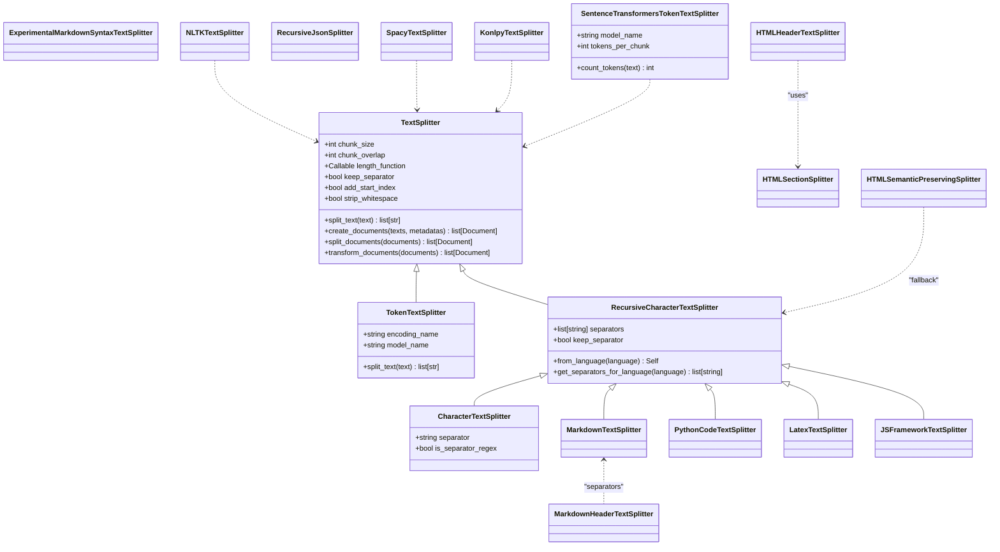
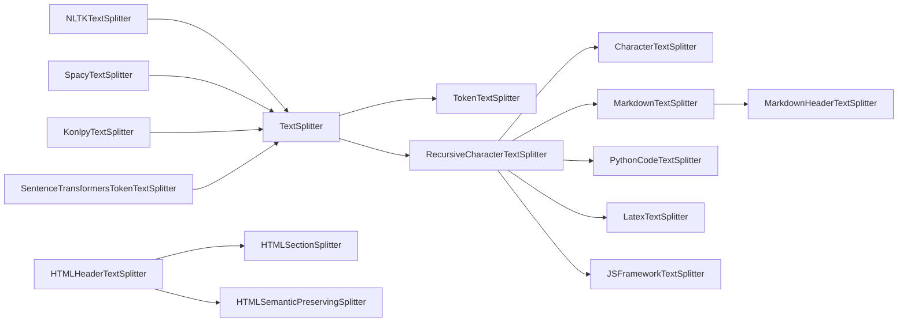

# Text Splitters

<cite>
**Referenced Files in This Document**
- [__init__.py](file://libs/text-splitters/langchain_text_splitters/__init__.py)
- [base.py](file://libs/text-splitters/langchain_text_splitters/base.py)
- [character.py](file://libs/text-splitters/langchain_text_splitters/character.py)
- [markdown.py](file://libs/text-splitters/langchain_text_splitters/markdown.py)
- [html.py](file://libs/text-splitters/langchain_text_splitters/html.py)
- [json.py](file://libs/text-splitters/langchain_text_splitters/json.py)
- [python.py](file://libs/text-splitters/langchain_text_splitters/python.py)
- [latex.py](file://libs/text-splitters/langchain_text_splitters/latex.py)
- [jsx.py](file://libs/text-splitters/langchain_text_splitters/jsx.py)
- [sentence_transformers.py](file://libs/text-splitters/langchain_text_splitters/sentence_transformers.py)
- [nltk.py](file://libs/text-splitters/langchain_text_splitters/nltk.py)
- [spacy.py](file://libs/text-splitters/langchain_text_splitters/spacy.py)
- [konlpy.py](file://libs/text-splitters/langchain_text_splitters/konlpy.py)
</cite>

## Table of Contents
1. [Introduction](#introduction)
2. [Project Structure](#project-structure)
3. [Core Components](#core-components)
4. [Architecture Overview](#architecture-overview)
5. [Detailed Component Analysis](#detailed-component-analysis)
6. [Dependency Analysis](#dependency-analysis)
7. [Performance Considerations](#performance-considerations)
8. [Troubleshooting Guide](#troubleshooting-guide)
9. [Conclusion](#conclusion)

## Introduction
This document explains LangChain’s text splitter system for preparing text data for downstream tasks such as embedding and retrieval. It covers the TextSplitter base class, the document processing pipeline, and all built-in splitters. It also compares character-based, sentence-based, and semantic approaches, and provides guidance on selecting the right splitter for different content types, optimizing chunk sizes for embeddings, and handling special formatting requirements. Advanced token-based splitters for transformer models are included, along with performance and best practice recommendations.

## Project Structure
The text splitters are organized in a modular package with a shared base and specialized implementations for various formats and frameworks.

**Diagram sources**
- [__init__.py](file://libs/text-splitters/langchain_text_splitters/__init__.py#L9-L42)
- [base.py](file://libs/text-splitters/langchain_text_splitters/base.py#L44-L451)
- [character.py](file://libs/text-splitters/langchain_text_splitters/character.py#L11-L800)
- [markdown.py](file://libs/text-splitters/langchain_text_splitters/markdown.py#L14-L482)
- [html.py](file://libs/text-splitters/langchain_text_splitters/html.py#L83-L1064)
- [json.py](file://libs/text-splitters/langchain_text_splitters/json.py#L12-L191)
- [python.py](file://libs/text-splitters/langchain_text_splitters/python.py#L11-L18)
- [latex.py](file://libs/text-splitters/langchain_text_splitters/latex.py#L11-L18)
- [jsx.py](file://libs/text-splitters/langchain_text_splitters/jsx.py#L9-L103)
- [sentence_transformers.py](file://libs/text-splitters/langchain_text_splitters/sentence_transformers.py#L20-L124)
- [nltk.py](file://libs/text-splitters/langchain_text_splitters/nltk.py#L19-L73)
- [spacy.py](file://libs/text-splitters/langchain_text_splitters/spacy.py#L26-L74)
- [konlpy.py](file://libs/text-splitters/langchain_text_splitters/konlpy.py#L19-L52)

**Section sources**
- [__init__.py](file://libs/text-splitters/langchain_text_splitters/__init__.py#L1-L70)

## Core Components
- TextSplitter: Abstract base class defining the interface for splitting text into chunks. Provides shared logic for document creation, merging, and length counting. Supports configurable chunk size, overlap, length function, separator retention, and index tracking.
- TokenTextSplitter: Token-based splitter using tiktoken; counts length in tokens and splits on token boundaries.
- Tokenizer: Lightweight dataclass encapsulating tokenizer behavior for token-based splitting.
- split_text_on_tokens: Utility that encodes text into tokens, walks the token stream with overlap, and decodes chunks.

Key behaviors:
- Validation of chunk_size and chunk_overlap.
- Length function customization for character or token-based sizing.
- Merging small splits into larger chunks respecting chunk_size and chunk_overlap.
- Optional start index injection into metadata for precise provenance.

**Section sources**
- [base.py](file://libs/text-splitters/langchain_text_splitters/base.py#L44-L296)
- [base.py](file://libs/text-splitters/langchain_text_splitters/base.py#L298-L370)
- [base.py](file://libs/text-splitters/langchain_text_splitters/base.py#L405-L451)

## Architecture Overview
The splitter ecosystem follows a layered design:
- Base abstractions in base.py define the contract and reusable utilities.
- Language-aware and format-specific splitters inherit from the base or from RecursiveCharacterTextSplitter.
- Token-based splitters (tiktoken and sentence-transformers) provide token-aware chunking.
- Specialized splitters (HTML, Markdown, JSON, JSX, NLTK/Spacy/Konlpy) target domain-specific structures.

**Diagram sources**
- [base.py](file://libs/text-splitters/langchain_text_splitters/base.py#L44-L370)
- [character.py](file://libs/text-splitters/langchain_text_splitters/character.py#L11-L800)
- [markdown.py](file://libs/text-splitters/langchain_text_splitters/markdown.py#L14-L482)
- [html.py](file://libs/text-splitters/langchain_text_splitters/html.py#L83-L1064)
- [json.py](file://libs/text-splitters/langchain_text_splitters/json.py#L12-L191)
- [python.py](file://libs/text-splitters/langchain_text_splitters/python.py#L11-L18)
- [latex.py](file://libs/text-splitters/langchain_text_splitters/latex.py#L11-L18)
- [jsx.py](file://libs/text-splitters/langchain_text_splitters/jsx.py#L9-L103)
- [sentence_transformers.py](file://libs/text-splitters/langchain_text_splitters/sentence_transformers.py#L20-L124)
- [nltk.py](file://libs/text-splitters/langchain_text_splitters/nltk.py#L19-L73)
- [spacy.py](file://libs/text-splitters/langchain_text_splitters/spacy.py#L26-L74)
- [konlpy.py](file://libs/text-splitters/langchain_text_splitters/konlpy.py#L19-L52)

## Detailed Component Analysis

### TextSplitter Base Class
- Purpose: Defines the contract for splitting text and transforming documents.
- Key parameters:
  - chunk_size: Maximum chunk size (validated > 0).
  - chunk_overlap: Overlap between consecutive chunks (validated ≥ 0 and < chunk_size).
  - length_function: Controls how chunk size is measured (default: len).
  - keep_separator: Whether to retain separators and where (“start”, “end”, or False).
  - add_start_index: Injects start position of each chunk into metadata.
  - strip_whitespace: Strips leading/trailing whitespace from merged chunks.
- Methods:
  - split_text: Implemented by subclasses.
  - create_documents: Produces Document objects with optional start_index metadata.
  - split_documents: Convenience for Document sequences.
  - transform_documents: Implements BaseDocumentTransformer interface.
  - _merge_splits: Core merging logic respecting chunk_size and chunk_overlap.
  - from_tiktoken_encoder / from_huggingface_tokenizer: Factory methods to compute length in tokens.

**Section sources**
- [base.py](file://libs/text-splitters/langchain_text_splitters/base.py#L44-L196)
- [base.py](file://libs/text-splitters/langchain_text_splitters/base.py#L196-L296)

### TokenTextSplitter
- Uses tiktoken to encode text and split on token boundaries.
- Parameters:
  - encoding_name/model_name: Selects the encoding.
  - allowed/disallowed_special: Controls special token handling.
- Behavior: Encodes text, splits into token windows with overlap, decodes chunks.

**Section sources**
- [base.py](file://libs/text-splitters/langchain_text_splitters/base.py#L298-L370)

### CharacterTextSplitter
- Splits text by a single separator (literal or regex).
- Parameters:
  - separator: Separator string or regex.
  - is_separator_regex: Treat separator as regex.
  - Inherits chunk_size/overlap/length_function/keep_separator/add_start_index/strip_whitespace.
- Behavior: Splits on separator, merges with configurable separator handling.

**Section sources**
- [character.py](file://libs/text-splitters/langchain_text_splitters/character.py#L11-L86)

### RecursiveCharacterTextSplitter
- Recursively tries multiple separators to produce chunks within size limits.
- Parameters:
  - separators: Ordered list of separators (defaults to ["\n\n", "\n", " ", ""]).
  - keep_separator: Whether to keep separators in chunks.
  - is_separator_regex: Treat separators as regex.
  - Inherits base parameters.
- Language-specific separators:
  - from_language(language): Pre-configures separators for a given Language.
  - get_separators_for_language(language): Returns format-specific separators for many languages (C/CPP, Go, Java, Kotlin, JS, TS, PHP, Proto, Python, R, RST, Ruby, Rust, Scala, Swift, Markdown, LaTeX, HTML, C#, Solidity, Cobol, Lua, Haskell, PowerShell, Visual Basic 6).

**Section sources**
- [character.py](file://libs/text-splitters/langchain_text_splitters/character.py#L88-L196)
- [character.py](file://libs/text-splitters/langchain_text_splitters/character.py#L160-L800)

### Markdown Splitters
- MarkdownTextSplitter: Inherits from RecursiveCharacterTextSplitter and uses Markdown-specific separators.
- MarkdownHeaderTextSplitter: Splits Markdown by headers, tracks header hierarchy, and aggregates content into Documents with metadata. Supports:
  - headers_to_split_on: List of (pattern, metadata_key).
  - return_each_line: Whether to return each line separately.
  - strip_headers: Whether to remove headers from chunk content.
  - custom_header_patterns: Map of custom fenced header patterns to levels.
- ExperimentalMarkdownSyntaxTextSplitter: Experimental splitter that preserves original whitespace and extracts headers, code blocks, and horizontal rules as metadata.

**Section sources**
- [markdown.py](file://libs/text-splitters/langchain_text_splitters/markdown.py#L14-L281)
- [markdown.py](file://libs/text-splitters/langchain_text_splitters/markdown.py#L298-L482)

### HTML Splitters
- HTMLHeaderTextSplitter: Parses HTML with BeautifulSoup, traverses DOM, and emits Documents with hierarchical metadata based on specified header tags. Options:
  - headers_to_split_on: List of (tag, metadata_key).
  - return_each_element: Whether to emit each element as a separate Document.
- HTMLSectionSplitter: Splits HTML into sections by headers, optionally transforms tags via XSLT, then applies RecursiveCharacterTextSplitter.
- HTMLSemanticPreservingSplitter (beta): Preserves semantic structure, converts links/images/videos/audio to Markdown-like formats, and can preserve selected elements. Supports:
  - headers_to_split_on, max_chunk_size, chunk_overlap, separators.
  - elements_to_preserve, preserve_* flags, custom_handlers.
  - stopword_removal, normalize_text, allowlist/denylist_tags, preserve_parent_metadata.

**Section sources**
- [html.py](file://libs/text-splitters/langchain_text_splitters/html.py#L83-L346)
- [html.py](file://libs/text-splitters/langchain_text_splitters/html.py#L348-L554)
- [html.py](file://libs/text-splitters/langchain_text_splitters/html.py#L556-L800)

### JSON Splitter
- RecursiveJsonSplitter: Splits nested JSON into chunks respecting max_chunk_size and min_chunk_size. Supports:
  - max_chunk_size/min_chunk_size defaults and overrides.
  - convert_lists: Convert lists to dict-based structures for better chunking.
  - split_json: Returns dicts.
  - split_text: Returns JSON strings.
  - create_documents: Wraps chunks in Documents.

**Section sources**
- [json.py](file://libs/text-splitters/langchain_text_splitters/json.py#L12-L191)

### Code-Specific Splitters
- PythonCodeTextSplitter: Uses language-aware separators for Python.
- LatexTextSplitter: Uses LaTeX-aware separators.
- JSFrameworkTextSplitter: Detects component tags in React/Vue/Svelte and augments separators with JS syntax elements.

**Section sources**
- [python.py](file://libs/text-splitters/langchain_text_splitters/python.py#L11-L18)
- [latex.py](file://libs/text-splitters/langchain_text_splitters/latex.py#L11-L18)
- [jsx.py](file://libs/text-splitters/langchain_text_splitters/jsx.py#L9-L103)

### Sentence-Based Splitters
- NLTKTextSplitter: Uses NLTK sentence segmentation. Options:
  - separator: Used when merging splits.
  - language: NLTK language setting.
  - use_span_tokenize: If True, uses span-based tokenization; requires separator="".
- SpacyTextSplitter: Uses spaCy sentence segmentation. Options:
  - separator: Merge separator.
  - pipeline: Model or “sentencizer”.
  - max_length: Increase for large inputs.
- KonlpyTextSplitter: Uses Korean KKMA sentence segmentation for Korean text.

**Section sources**
- [nltk.py](file://libs/text-splitters/langchain_text_splitters/nltk.py#L19-L73)
- [spacy.py](file://libs/text-splitters/langchain_text_splitters/spacy.py#L26-L74)
- [konlpy.py](file://libs/text-splitters/langchain_text_splitters/konlpy.py#L19-L52)

### Transformer-Based Token Splitters
- SentenceTransformersTokenTextSplitter: Uses a sentence-transformers model to split on tokens. Parameters:
  - chunk_overlap: Tokens overlapping between chunks.
  - model_name: Sentence transformer model identifier.
  - tokens_per_chunk: Optional; defaults to model max_seq_length.
  - count_tokens: Utility to count tokens in a string.

**Section sources**
- [sentence_transformers.py](file://libs/text-splitters/langchain_text_splitters/sentence_transformers.py#L20-L124)

## Dependency Analysis
- Base dependencies:
  - core documents and typing extensions.
  - Optional integrations: tiktoken, transformers, sentence-transformers, NLTK, spaCy, Konlpy, BeautifulSoup, lxml, NLTK stopwords.
- Coupling:
  - Most splitters depend on TextSplitter or RecursiveCharacterTextSplitter.
  - Markdown and HTML splitters depend on language-aware separators from RecursiveCharacterTextSplitter.
  - Token-based splitters depend on their respective tokenizers.
- Cohesion:
  - Each splitter focuses on a single domain (character, sentence, semantic, token), improving maintainability.

**Diagram sources**
- [base.py](file://libs/text-splitters/langchain_text_splitters/base.py#L44-L370)
- [character.py](file://libs/text-splitters/langchain_text_splitters/character.py#L11-L800)
- [markdown.py](file://libs/text-splitters/langchain_text_splitters/markdown.py#L14-L482)
- [html.py](file://libs/text-splitters/langchain_text_splitters/html.py#L83-L1064)
- [nltk.py](file://libs/text-splitters/langchain_text_splitters/nltk.py#L19-L73)
- [spacy.py](file://libs/text-splitters/langchain_text_splitters/spacy.py#L26-L74)
- [konlpy.py](file://libs/text-splitters/langchain_text_splitters/konlpy.py#L19-L52)
- [sentence_transformers.py](file://libs/text-splitters/langchain_text_splitters/sentence_transformers.py#L20-L124)

**Section sources**
- [__init__.py](file://libs/text-splitters/langchain_text_splitters/__init__.py#L9-L42)

## Performance Considerations
- Choose the right granularity:
  - Character-based: Fast, predictable; may cut mid-word/sentence.
  - Sentence-based: Better semantic coherence; slower due to segmentation cost.
  - Semantic/token-based: Best for embeddings; requires tokenization overhead.
- Token-aware chunking:
  - Use TokenTextSplitter or SentenceTransformersTokenTextSplitter to align chunks with model token limits.
  - For tiktoken, prefer model-specific encodings to match model behavior.
- Overlap trade-offs:
  - Larger overlap improves continuity but increases memory and compute.
- Regex-heavy splitting:
  - RecursiveCharacterTextSplitter with many regexes can be expensive; pre-select efficient separators.
- Large documents:
  - Consider HTMLSemanticPreservingSplitter to avoid excessive fragmentation while preserving structure.
- Memory:
  - Token-based splitting loads tokenizers; cache models when processing many files.
  - Prefer streaming or batched processing for very large inputs.

[No sources needed since this section provides general guidance]

## Troubleshooting Guide
Common issues and resolutions:
- Chunk size/overlap validation errors:
  - Ensure chunk_size > 0 and 0 ≤ chunk_overlap < chunk_size.
- Missing optional dependencies:
  - tiktoken, transformers, sentence-transformers, NLTK, spaCy, Konlpy, BeautifulSoup, lxml: Install as needed.
- NLTK span_tokenize separator requirement:
  - When using span-based tokenization, separator must be empty.
- HTML parsing failures:
  - Ensure BeautifulSoup and lxml are installed; HTMLSemanticPreservingSplitter requires BeautifulSoup.
- Token limit exceeded:
  - SentenceTransformersTokenTextSplitter enforces model max_seq_length; reduce tokens_per_chunk or model_name accordingly.
- Unexpected chunk boundaries:
  - Adjust separators or choose a language-specific splitter (e.g., PythonCodeTextSplitter, LatexTextSplitter).
- Metadata drift in Markdown/HTML:
  - Verify header tracking and aggregation logic; use strip_headers and return_each_line judiciously.

**Section sources**
- [base.py](file://libs/text-splitters/langchain_text_splitters/base.py#L73-L84)
- [nltk.py](file://libs/text-splitters/langchain_text_splitters/nltk.py#L46-L51)
- [sentence_transformers.py](file://libs/text-splitters/langchain_text_splitters/sentence_transformers.py#L65-L72)
- [html.py](file://libs/text-splitters/langchain_text_splitters/html.py#L246-L250)
- [html.py](file://libs/text-splitters/langchain_text_splitters/html.py#L509-L511)

## Practical Guidance and Examples

### Choosing a Splitter by Content Type
- Plain text:
  - CharacterTextSplitter with newline or paragraph separators for quick processing.
  - RecursiveCharacterTextSplitter with default separators for robustness.
- Sentences:
  - NLTKTextSplitter or SpacyTextSplitter for coherent sentence chunks.
- Structured markup:
  - Markdown: MarkdownTextSplitter or MarkdownHeaderTextSplitter for hierarchical chunks.
  - HTML: HTMLHeaderTextSplitter for header-driven sections; HTMLSemanticPreservingSplitter for semantic preservation.
- Code:
  - PythonCodeTextSplitter for Python.
  - LatexTextSplitter for LaTeX.
  - JSFrameworkTextSplitter for React/Vue/Svelte.
- Semi-structured:
  - JSON: RecursiveJsonSplitter for nested structures.
- Multilingual:
  - KonlpyTextSplitter for Korean.

### Optimizing Chunk Sizes for Embeddings
- Token-based alignment:
  - Use TokenTextSplitter or SentenceTransformersTokenTextSplitter.
  - Align chunk_size/chunk_overlap with model max token length.
- Iterative tuning:
  - Start with conservative chunk_size and increase until recall plateaus or latency grows.
- Overlap:
  - Use small overlap (e.g., 10–20%) to preserve context across boundaries.

### Handling Special Formatting
- Markdown:
  - Use MarkdownHeaderTextSplitter to preserve header metadata and aggregate content.
- HTML:
  - Use HTMLSemanticPreservingSplitter to keep semantic elements intact and convert media to Markdown-like formats.
- JSON:
  - Use RecursiveJsonSplitter with convert_lists to improve chunking of arrays.

[No sources needed since this section provides general guidance]

## Conclusion
LangChain’s text splitters provide a comprehensive toolkit for preparing diverse content types for embedding and retrieval. The base TextSplitter offers a robust foundation, while specialized splitters address domain-specific needs. For best results, select a splitter aligned with content structure and embedding model constraints, tune chunk size and overlap empirically, and leverage semantic or token-aware strategies for improved downstream performance.