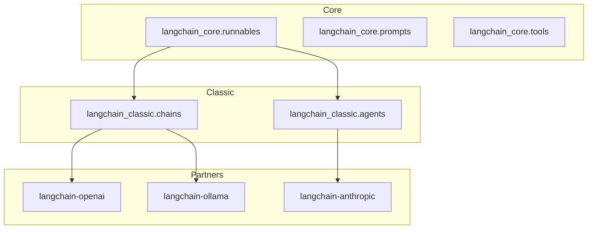
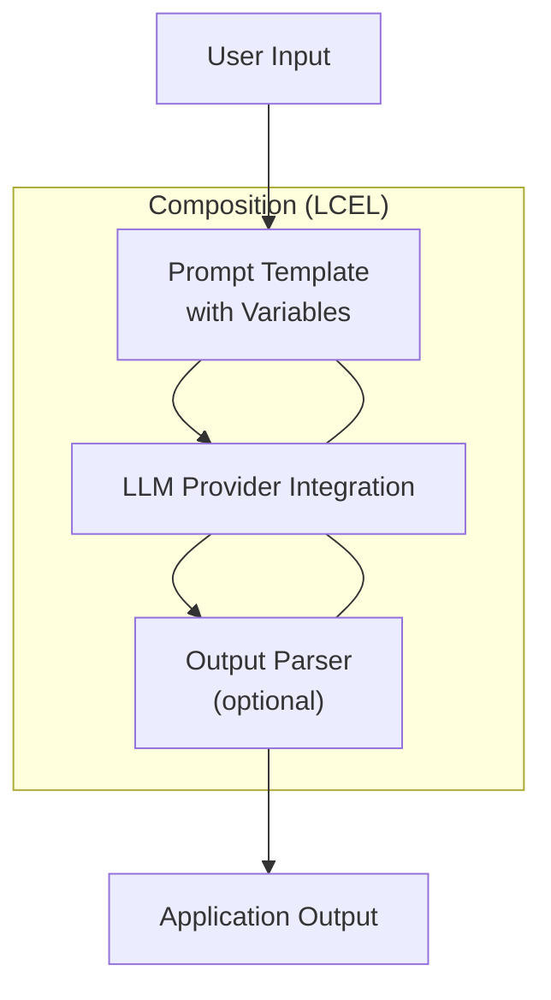
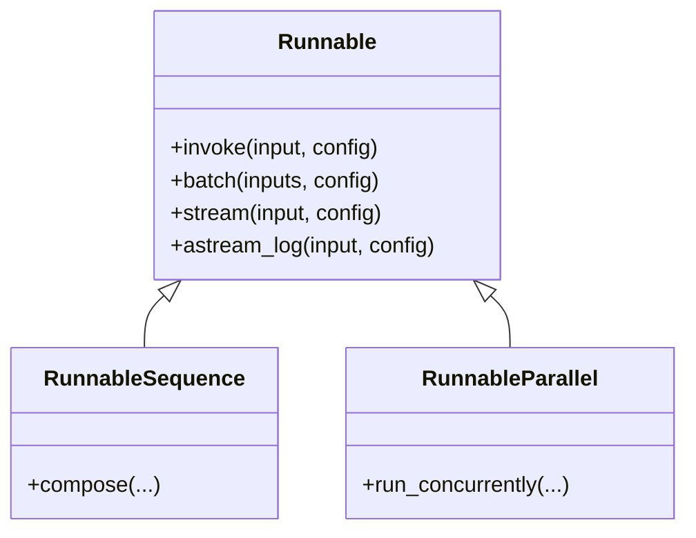
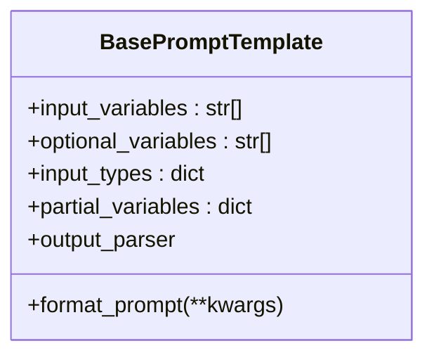
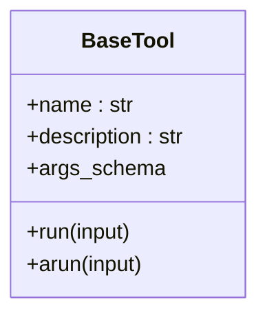
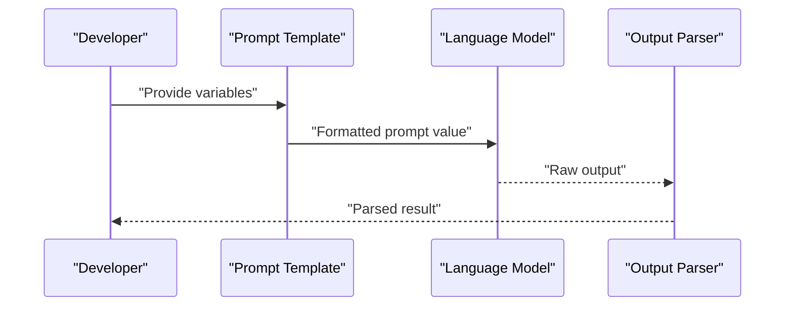
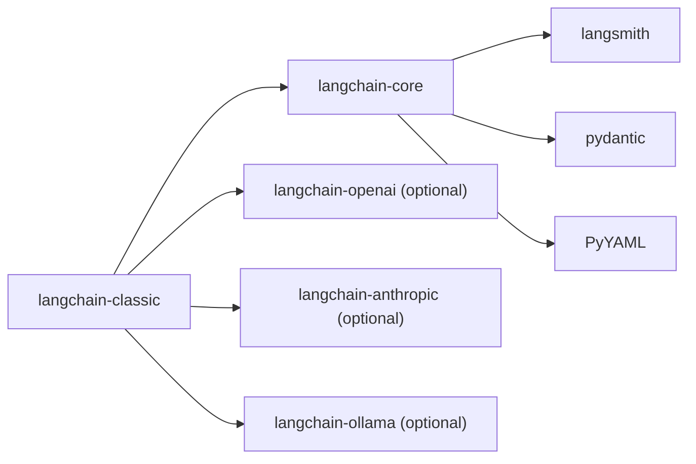

# Getting Started

<cite>
**Referenced Files in This Document**
- [README.md](file://README.md)
- [pyproject.toml](file://libs/core/pyproject.toml)
- [pyproject.toml](file://libs/langchain/pyproject.toml)
- [__init__.py](file://libs/core/langchain_core/runnables/__init__.py)
- [base.py](file://libs/core/langchain_core/runnables/base.py)
- [base.py](file://libs/core/langchain_core/prompts/base.py)
- [base.py](file://libs/core/langchain_core/tools/base.py)
- [example_generator.py](file://libs/langchain/langchain_classic/chains/example_generator.py)
- [utils.py](file://libs/core/langchain_core/utils/utils.py)
</cite>

## Table of Contents
1. [Introduction](#introduction)
2. [Project Structure](#project-structure)
3. [Core Components](#core-components)
4. [Architecture Overview](#architecture-overview)
5. [Detailed Component Analysis](#detailed-component-analysis)
6. [Dependency Analysis](#dependency-analysis)
7. [Performance Considerations](#performance-considerations)
8. [Troubleshooting Guide](#troubleshooting-guide)
9. [Conclusion](#conclusion)
10. [Appendices](#appendices)

## Introduction
LangChain is a framework for building agents and LLM-powered applications through composability. It standardizes interfaces for models, embeddings, vector stores, and more, enabling you to chain together interoperable components and third-party integrations. This makes it easier to develop reliable, scalable, and observable AI applications while keeping future-proof decisions as underlying technologies evolve.

Installation is straightforward via pip, and the ecosystem integrates with many providers and tools. For deeper agent orchestration, you can pair LangChain with complementary frameworks.

**Section sources**
- [README.md](file://README.md#L25-L29)
- [README.md](file://README.md#L46-L58)

## Project Structure
At a high level, the repository is organized into libraries:
- langchain-core: foundational abstractions and primitives (Runnables, Prompts, Tools)
- langchain-classic: higher-level components, chains, agents, integrations, and utilities
- Partners: provider-specific integrations (e.g., OpenAI, Anthropic, Ollama)
- Other libraries: text splitters, model profiles, standard tests, etc.

Key entry points for learning:
- langchain-core’s runnables define the universal invocation protocol (LCEL) and composition primitives
- langchain-classic provides ready-to-use chains and agents that compose Runnables
- pyproject.toml files define minimum Python versions and dependencies

**Section sources**
- [pyproject.toml](file://libs/core/pyproject.toml#L12-L23)
- [pyproject.toml](file://libs/langchain/pyproject.toml#L12-L23)

## Core Components
LangChain’s power comes from three pillars:
- Runnables: the universal invocation protocol supporting synchronous, asynchronous, batch, and streaming operations
- Prompts: templating and formatting logic that prepares inputs for language models
- Tools: callable units that enable agents to interact with external systems

These components are composable via LCEL (LangChain Expression Language), allowing you to build robust, production-grade programs declaratively.

**Section sources**
- [__init__.py](file://libs/core/langchain_core/runnables/__init__.py#L1-L18)
- [base.py](file://libs/core/langchain_core/runnables/base.py#L124-L200)
- [base.py](file://libs/core/langchain_core/prompts/base.py#L39-L136)
- [base.py](file://libs/core/langchain_core/tools/base.py#L1-L200)

## Architecture Overview
The typical flow for a first LLM application:
- Prepare a Prompt with placeholders and optional output parsing
- Select a Language Model provider integration
- Compose them into a chain using LCEL
- Invoke, batch, or stream as needed

**Diagram sources**
- [base.py](file://libs/core/langchain_core/prompts/base.py#L39-L136)
- [example_generator.py](file://libs/langchain/langchain_classic/chains/example_generator.py#L9-L22)

## Detailed Component Analysis

### Runnables: The Universal Invocation Protocol
Runnables encapsulate units of work that can be invoked, batched, streamed, and composed. They support:
- invoke/ainvoke: single-input transformations
- batch/abatch: efficient multi-input processing
- stream/astream: streaming outputs as they are generated
- astream_log: streaming outputs and selected intermediate results

Composition primitives include:
- RunnableSequence: sequential chaining with the pipe operator
- RunnableParallel: concurrent execution with shared input

**Diagram sources**
- [base.py](file://libs/core/langchain_core/runnables/base.py#L124-L200)

**Section sources**
- [base.py](file://libs/core/langchain_core/runnables/base.py#L124-L200)

### Prompts: Templates and Formatting
Prompts define how to format inputs for language models. The base prompt template:
- Declares required and optional variables
- Supports partial variables and output parsers
- Validates inputs and formats them into a prompt value

**Diagram sources**
- [base.py](file://libs/core/langchain_core/prompts/base.py#L39-L136)

**Section sources**
- [base.py](file://libs/core/langchain_core/prompts/base.py#L39-L136)

### Tools: Extending Agent Capabilities
Tools represent callable units that agents can use. The base tool:
- Defines a schema for arguments and descriptions
- Integrates with runnables for configuration and execution
- Supports async execution and callback management

**Diagram sources**
- [base.py](file://libs/core/langchain_core/tools/base.py#L1-L200)

**Section sources**
- [base.py](file://libs/core/langchain_core/tools/base.py#L1-L200)

### Building Your First LLM Application with LCEL
Step-by-step tutorial outline:
1. Install prerequisites
   - Python version requirement is defined in the core library’s pyproject configuration
2. Choose a provider integration
   - Optional dependencies are declared in the classic library’s pyproject (e.g., OpenAI, Anthropic, Ollama)
3. Compose a minimal chain
   - Use a prompt template, an LLM, and optionally an output parser
   - Compose them with LCEL operators
4. Execute
   - Invoke, batch, or stream depending on your needs

**Diagram sources**
- [example_generator.py](file://libs/langchain/langchain_classic/chains/example_generator.py#L9-L22)

**Section sources**
- [pyproject.toml](file://libs/core/pyproject.toml#L12-L23)
- [pyproject.toml](file://libs/langchain/pyproject.toml#L25-L43)
- [example_generator.py](file://libs/langchain/langchain_classic/chains/example_generator.py#L9-L22)

## Dependency Analysis
- Minimum Python version: both core and classic libraries require Python >= 3.10
- Core dependencies include langsmith, tenacity, jsonpatch, PyYAML, typing-extensions, packaging, pydantic, uuid-utils
- Classic adds optional provider integrations (e.g., langchain-openai, langchain-anthropic, langchain-ollama)

**Diagram sources**
- [pyproject.toml](file://libs/core/pyproject.toml#L12-L23)
- [pyproject.toml](file://libs/langchain/pyproject.toml#L12-L43)

**Section sources**
- [pyproject.toml](file://libs/core/pyproject.toml#L12-L23)
- [pyproject.toml](file://libs/langchain/pyproject.toml#L12-L43)

## Performance Considerations
- Batch operations: Use batch/abatch to process multiple inputs efficiently
- Streaming: Use stream/astream_log for responsive UX and incremental results
- Async execution: Prefer async variants for higher concurrency under load
- Retry and fallbacks: Apply retry policies and fallbacks to improve resilience

[No sources needed since this section provides general guidance]

## Troubleshooting Guide
Common setup issues and resolutions:
- Missing provider integration
  - Symptom: ImportError when importing provider-specific modules
  - Resolution: Install optional dependencies declared in the classic library’s pyproject (e.g., langchain-openai)
  - Reference: [pyproject.toml](file://libs/langchain/pyproject.toml#L25-L43)
- Import errors for core packages
  - Symptom: ImportError for langchain-core modules
  - Resolution: Ensure langchain-core is installed and compatible per its pyproject requirements
  - Reference: [pyproject.toml](file://libs/core/pyproject.toml#L12-L23)
- Version mismatch
  - Symptom: Runtime errors due to incompatible versions
  - Resolution: Align versions according to the declared ranges in pyproject.toml
  - Reference: [pyproject.toml](file://libs/core/pyproject.toml#L12-L23), [pyproject.toml](file://libs/langchain/pyproject.toml#L12-L23)
- Utility for missing imports
  - Helper: A utility raises a clear ImportError with pip install guidance when a package is not found
  - Reference: [utils.py](file://libs/core/langchain_core/utils/utils.py#L134-L143)

**Section sources**
- [pyproject.toml](file://libs/langchain/pyproject.toml#L25-L43)
- [pyproject.toml](file://libs/core/pyproject.toml#L12-L23)
- [utils.py](file://libs/core/langchain_core/utils/utils.py#L134-L143)

## Conclusion
You now have the essentials to start building LLM-powered applications with LangChain:
- Understand Runnables, Prompts, and Tools
- Compose them with LCEL for synchronous, asynchronous, batch, and streaming workflows
- Install and configure the environment using the documented dependencies
- Troubleshoot common setup issues with the included guidance

Continue by exploring provider integrations and agent patterns as you grow in complexity.

[No sources needed since this section summarizes without analyzing specific files]

## Appendices
- Installation quick reference
  - Install the core and classic libraries via pip
  - Add optional provider integrations as needed
- Next steps
  - Explore chains and agents in langchain-classic
  - Integrate with providers via partner libraries
  - Use LangSmith for observability and evaluation

[No sources needed since this section provides general guidance]