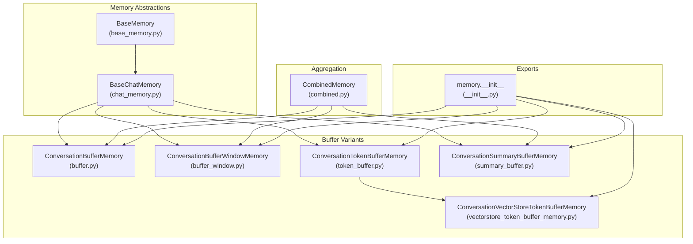
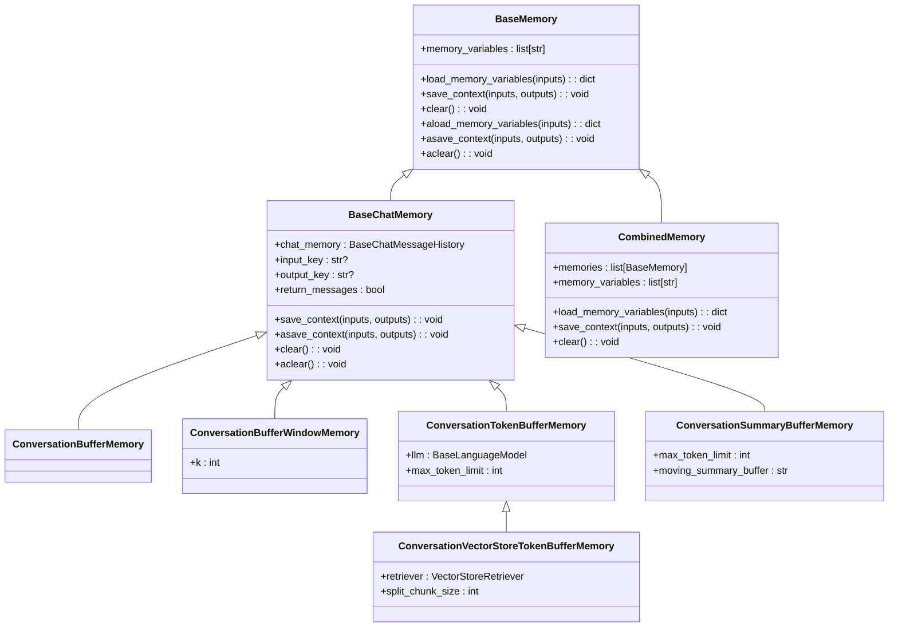
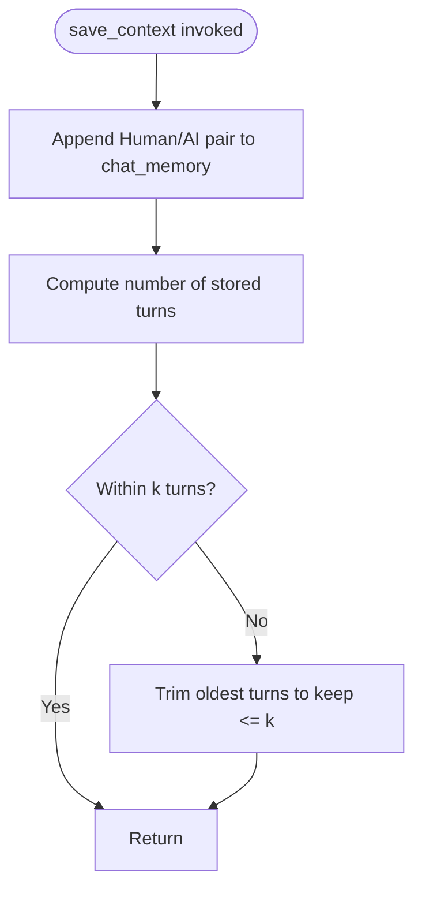
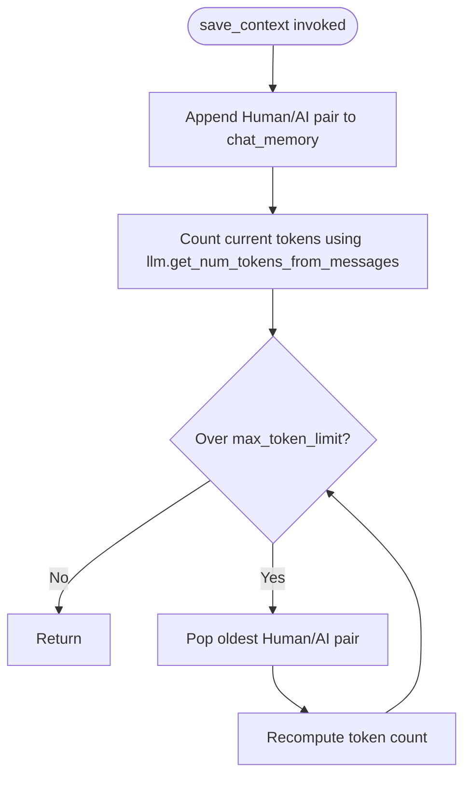
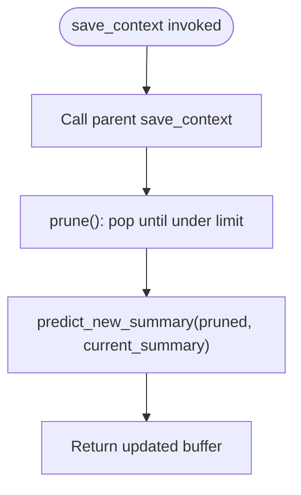
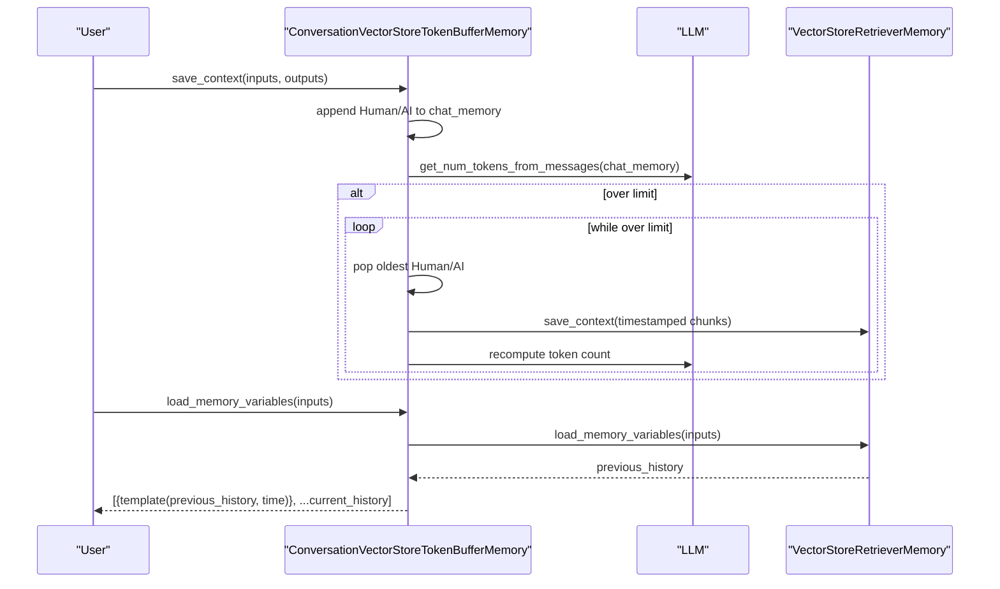
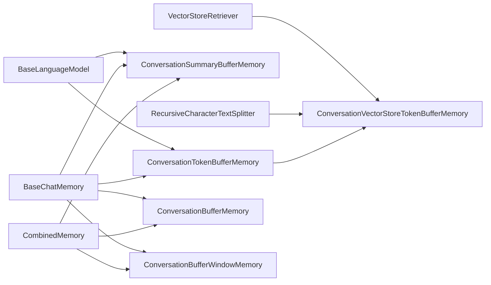

# Buffer Memory

<cite>
**Referenced Files in This Document**
- [base_memory.py](file://libs/langchain/langchain_classic/base_memory.py)
- [chat_memory.py](file://libs/langchain/langchain_classic/memory/chat_memory.py)
- [buffer.py](file://libs/langchain/langchain_classic/memory/buffer.py)
- [buffer_window.py](file://libs/langchain/langchain_classic/memory/buffer_window.py)
- [token_buffer.py](file://libs/langchain/langchain_classic/memory/token_buffer.py)
- [summary_buffer.py](file://libs/langchain/langchain_classic/memory/summary_buffer.py)
- [vectorstore_token_buffer_memory.py](file://libs/langchain/langchain_classic/memory/vectorstore_token_buffer_memory.py)
- [combined.py](file://libs/langchain/langchain_classic/memory/combined.py)
- [__init__.py](file://libs/langchain/langchain_classic/memory/__init__.py)
- [test_conversation.py](file://libs/langchain/tests/unit_tests/chains/test_conversation.py)
- [test_combined_memory.py](file://libs/langchain/tests/unit_tests/memory/test_combined_memory.py)
</cite>

## Table of Contents
1. [Introduction](#introduction)
2. [Project Structure](#project-structure)
3. [Core Components](#core-components)
4. [Architecture Overview](#architecture-overview)
5. [Detailed Component Analysis](#detailed-component-analysis)
6. [Dependency Analysis](#dependency-analysis)
7. [Performance Considerations](#performance-considerations)
8. [Troubleshooting Guide](#troubleshooting-guide)
9. [Conclusion](#conclusion)
10. [Appendices](#appendices)

## Introduction
This document explains LangChain’s buffer memory implementations for storing recent conversation history in memory. It covers three primary buffer types:
- Simple buffer memory: stores the entire conversation history.
- Window-based buffer memory: retains only the most recent fixed number of turns.
- Token-based buffer memory: enforces a token budget by pruning older messages when the limit is exceeded.

It also documents configuration options (such as memory window size and token limits), initialization and usage patterns, retrieval behavior, overflow handling, truncation strategies, performance considerations, and common use cases and limitations.

## Project Structure
The buffer memory implementations live under the classic LangChain memory module. The key files include:
- Base abstractions for memory and chat memory
- Buffer memory variants (simple, window, token, summary, vector-backed token)
- Combined memory for aggregating multiple memories
- Public exports via the memory package init

**Diagram sources**
- [base_memory.py](file://libs/langchain/langchain_classic/base_memory.py#L27-L117)
- [chat_memory.py](file://libs/langchain/langchain_classic/memory/chat_memory.py#L25-L105)
- [buffer.py](file://libs/langchain/langchain_classic/memory/buffer.py#L21-L174)
- [buffer_window.py](file://libs/langchain/langchain_classic/memory/buffer_window.py#L18-L60)
- [token_buffer.py](file://libs/langchain/langchain_classic/memory/token_buffer.py#L19-L72)
- [summary_buffer.py](file://libs/langchain/langchain_classic/memory/summary_buffer.py#L20-L149)
- [vectorstore_token_buffer_memory.py](file://libs/langchain/langchain_classic/memory/vectorstore_token_buffer_memory.py#L37-L184)
- [combined.py](file://libs/langchain/langchain_classic/memory/combined.py#L10-L86)
- [__init__.py](file://libs/langchain/langchain_classic/memory/__init__.py#L1-L127)

**Section sources**
- [__init__.py](file://libs/langchain/langchain_classic/memory/__init__.py#L1-L127)

## Core Components
- BaseMemory: Defines the memory contract for chains, including memory variables, saving context, and clearing memory. It supports synchronous and asynchronous operations.
- BaseChatMemory: Extends BaseMemory with chat-specific behavior, including input/output key resolution, message creation, and storage via chat message history.

Key buffer memory classes:
- ConversationBufferMemory: Stores the entire conversation history as either raw text or message objects.
- ConversationBufferWindowMemory: Keeps only the most recent k turns by slicing the message buffer.
- ConversationTokenBufferMemory: Enforces a token budget by pruning the oldest messages until the total token count is within the limit.
- ConversationSummaryBufferMemory: Maintains a running summary and recent messages, pruning and summarizing when exceeding the token limit.
- ConversationVectorStoreTokenBufferMemory: Similar to token-based memory but stores older pruned messages in a vector store, enabling larger effective histories.

**Section sources**
- [base_memory.py](file://libs/langchain/langchain_classic/base_memory.py#L27-L117)
- [chat_memory.py](file://libs/langchain/langchain_classic/memory/chat_memory.py#L25-L105)
- [buffer.py](file://libs/langchain/langchain_classic/memory/buffer.py#L21-L174)
- [buffer_window.py](file://libs/langchain/langchain_classic/memory/buffer_window.py#L18-L60)
- [token_buffer.py](file://libs/langchain/langchain_classic/memory/token_buffer.py#L19-L72)
- [summary_buffer.py](file://libs/langchain/langchain_classic/memory/summary_buffer.py#L20-L149)
- [vectorstore_token_buffer_memory.py](file://libs/langchain/langchain_classic/memory/vectorstore_token_buffer_memory.py#L37-L184)

## Architecture Overview
The buffer memory system is built around a shared chat message history store. Each buffer variant wraps this store and applies different policies for retention and pruning.

**Diagram sources**
- [base_memory.py](file://libs/langchain/langchain_classic/base_memory.py#L27-L117)
- [chat_memory.py](file://libs/langchain/langchain_classic/memory/chat_memory.py#L25-L105)
- [buffer.py](file://libs/langchain/langchain_classic/memory/buffer.py#L21-L174)
- [buffer_window.py](file://libs/langchain/langchain_classic/memory/buffer_window.py#L18-L60)
- [token_buffer.py](file://libs/langchain/langchain_classic/memory/token_buffer.py#L19-L72)
- [summary_buffer.py](file://libs/langchain/langchain_classic/memory/summary_buffer.py#L20-L149)
- [vectorstore_token_buffer_memory.py](file://libs/langchain/langchain_classic/memory/vectorstore_token_buffer_memory.py#L37-L184)
- [combined.py](file://libs/langchain/langchain_classic/memory/combined.py#L10-L86)

## Detailed Component Analysis

### Simple Buffer Memory
- Purpose: Store the entire conversation history without trimming.
- Retrieval: Exposes buffer as either a string or a list of messages depending on configuration.
- Behavior: No automatic pruning; suitable for short histories or when downstream prompts handle truncation.

Key characteristics:
- Uses BaseChatMemory for message storage.
- Supports both sync and async operations.
- Can be configured with human and AI prefixes and memory key.

**Section sources**
- [buffer.py](file://libs/langchain/langchain_classic/memory/buffer.py#L21-L90)
- [chat_memory.py](file://libs/langchain/langchain_classic/memory/chat_memory.py#L25-L105)

### Window-Based Buffer Memory
- Purpose: Keep only the most recent k turns.
- Truncation strategy: Slices the message list to the last k*2 messages (since each turn is a human and an AI message).
- Configuration: k controls the number of turns retained.

**Diagram sources**
- [buffer_window.py](file://libs/langchain/langchain_classic/memory/buffer_window.py#L36-L49)

**Section sources**
- [buffer_window.py](file://libs/langchain/langchain_classic/memory/buffer_window.py#L18-L60)

### Token-Based Buffer Memory
- Purpose: Enforce a token budget by pruning older messages when the current buffer exceeds max_token_limit.
- Truncation strategy: Iteratively removes the oldest message pair (human and AI) until the token count is within the limit.
- Requires: An LLM instance capable of estimating token counts from messages.

**Diagram sources**
- [token_buffer.py](file://libs/langchain/langchain_classic/memory/token_buffer.py#L61-L72)

**Section sources**
- [token_buffer.py](file://libs/langchain/langchain_classic/memory/token_buffer.py#L19-L72)

### Summary Buffer Memory
- Purpose: Combine a running summary with recent messages, enforcing a token budget.
- Truncation strategy: When over the limit, prunes the oldest messages and generates a new summary from them, prepending it to the buffer.
- Requires: A summarizer mixin and a compatible prompt with expected input variables.

**Diagram sources**
- [summary_buffer.py](file://libs/langchain/langchain_classic/memory/summary_buffer.py#L98-L124)

**Section sources**
- [summary_buffer.py](file://libs/langchain/langchain_classic/memory/summary_buffer.py#L20-L149)

### Vector Store Token Buffer Memory
- Purpose: Extend token-based memory by offloading older pruned messages to a vector store, enabling larger effective histories.
- Key features:
  - Timestamps each interaction to aid retrieval.
  - Retrieves relevant excerpts from the vector store and prepends them to the current buffer.
  - Splits long AI outputs into chunks to prevent oversized documents.
- Initialization: Accepts a retriever and optional chunk size and template for formatting previous history.

**Diagram sources**
- [vectorstore_token_buffer_memory.py](file://libs/langchain/langchain_classic/memory/vectorstore_token_buffer_memory.py#L123-L156)

**Section sources**
- [vectorstore_token_buffer_memory.py](file://libs/langchain/langchain_classic/memory/vectorstore_token_buffer_memory.py#L37-L184)

### Combined Memory
- Purpose: Aggregate multiple memory instances into one, ensuring distinct memory variables across sub-memories.
- Behavior: Delegates save_context and clear to all sub-memories; merges load_memory_variables results.

**Section sources**
- [combined.py](file://libs/langchain/langchain_classic/memory/combined.py#L10-L86)

## Dependency Analysis
- All buffer memory classes depend on BaseChatMemory for message storage and retrieval.
- ConversationTokenBufferMemory and ConversationSummaryBufferMemory rely on an LLM for token counting.
- ConversationVectorStoreTokenBufferMemory depends on a VectorStoreRetriever and a text splitter for chunking long outputs.
- CombinedMemory composes multiple BaseMemory instances and validates disjoint memory variables.

**Diagram sources**
- [chat_memory.py](file://libs/langchain/langchain_classic/memory/chat_memory.py#L25-L105)
- [token_buffer.py](file://libs/langchain/langchain_classic/memory/token_buffer.py#L19-L72)
- [summary_buffer.py](file://libs/langchain/langchain_classic/memory/summary_buffer.py#L20-L149)
- [vectorstore_token_buffer_memory.py](file://libs/langchain/langchain_classic/memory/vectorstore_token_buffer_memory.py#L37-L184)
- [combined.py](file://libs/langchain/langchain_classic/memory/combined.py#L10-L86)

**Section sources**
- [chat_memory.py](file://libs/langchain/langchain_classic/memory/chat_memory.py#L25-L105)
- [token_buffer.py](file://libs/langchain/langchain_classic/memory/token_buffer.py#L19-L72)
- [summary_buffer.py](file://libs/langchain/langchain_classic/memory/summary_buffer.py#L20-L149)
- [vectorstore_token_buffer_memory.py](file://libs/langchain/langchain_classic/memory/vectorstore_token_buffer_memory.py#L37-L184)
- [combined.py](file://libs/langchain/langchain_classic/memory/combined.py#L10-L86)

## Performance Considerations
- Token counting cost: Token-based memories compute token counts after each save; this scales linearly with the number of messages. Consider batching saves or using a more efficient tokenizer if frequent.
- Trimming overhead: Window-based memory performs slicing; token-based memory iteratively pops pairs. For very long histories, consider vector-backed storage to reduce in-memory footprint.
- Vector store retrieval: Retrieving previous history adds latency proportional to the number of retrieved documents and the retriever’s performance.
- Chunking large outputs: Splitting long AI outputs increases write volume to the vector store but improves retrieval precision.

[No sources needed since this section provides general guidance]

## Troubleshooting Guide
Common issues and resolutions:
- Unexpected prompt variables: Some memory classes validate prompt input variables. Ensure your prompt defines the expected variables.
- Duplicate memory keys across combined memories: CombinedMemory requires unique memory variables across sub-memories; adjust memory_key values to avoid conflicts.
- Input/output key ambiguity: When multiple output keys exist, specify output_key explicitly to avoid errors.
- Clearing memory: Use clear or aclear to reset buffers; verify subsequent load_memory_variables returns empty content.

**Section sources**
- [summary_buffer.py](file://libs/langchain/langchain_classic/memory/summary_buffer.py#L85-L96)
- [combined.py](file://libs/langchain/langchain_classic/memory/combined.py#L16-L47)
- [chat_memory.py](file://libs/langchain/langchain_classic/memory/chat_memory.py#L43-L72)
- [test_conversation.py](file://libs/langchain/tests/unit_tests/chains/test_conversation.py#L102-L132)
- [test_combined_memory.py](file://libs/langchain/tests/unit_tests/memory/test_combined_memory.py#L35-L45)

## Conclusion
LangChain’s buffer memory system offers flexible strategies for managing conversation history:
- Use simple buffer memory for short histories or when external truncation is preferred.
- Use window-based memory for bounded, turn-count-based retention.
- Use token-based memory for strict token budgets; consider vector-backed token memory for larger effective histories.
- Combine multiple memories when different aspects of context require separate retention policies.

[No sources needed since this section summarizes without analyzing specific files]

## Appendices

### Practical Configuration Examples
- Simple buffer memory: Configure human_prefix, ai_prefix, memory_key, and return_messages to tailor output format and variable names.
- Window-based memory: Set k to control the number of recent turns retained.
- Token-based memory: Set max_token_limit and provide an LLM with token counting capability.
- Vector-backed token memory: Provide a retriever, optionally tune split_chunk_size, and configure previous_history_template.

**Section sources**
- [buffer.py](file://libs/langchain/langchain_classic/memory/buffer.py#L21-L90)
- [buffer_window.py](file://libs/langchain/langchain_classic/memory/buffer_window.py#L18-L60)
- [token_buffer.py](file://libs/langchain/langchain_classic/memory/token_buffer.py#L19-L72)
- [vectorstore_token_buffer_memory.py](file://libs/langchain/langchain_classic/memory/vectorstore_token_buffer_memory.py#L37-L105)

### API Usage Patterns
- Initialization: Instantiate the desired memory class with appropriate parameters.
- Adding messages: Call save_context with inputs and outputs; for async, use asave_context.
- Retrieving memory: Call load_memory_variables to fetch the formatted buffer; for async, use aload_memory_variables.
- Clearing memory: Use clear or aclear to reset the buffer.

**Section sources**
- [base_memory.py](file://libs/langchain/langchain_classic/base_memory.py#L68-L117)
- [chat_memory.py](file://libs/langchain/langchain_classic/memory/chat_memory.py#L74-L105)
- [test_conversation.py](file://libs/langchain/tests/unit_tests/chains/test_conversation.py#L64-L76)