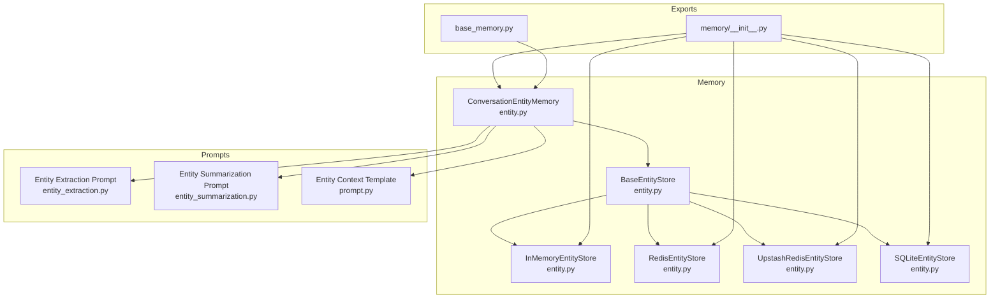
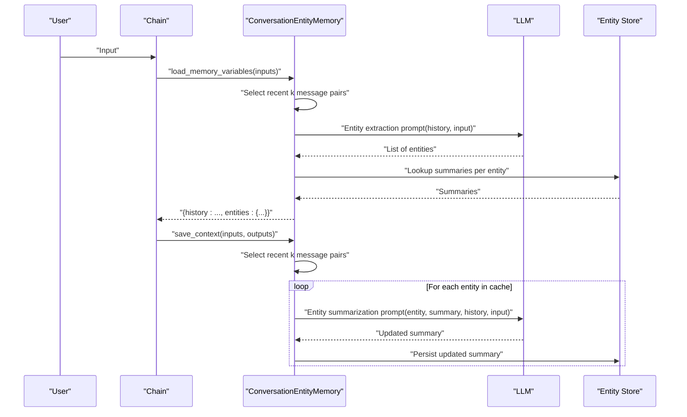
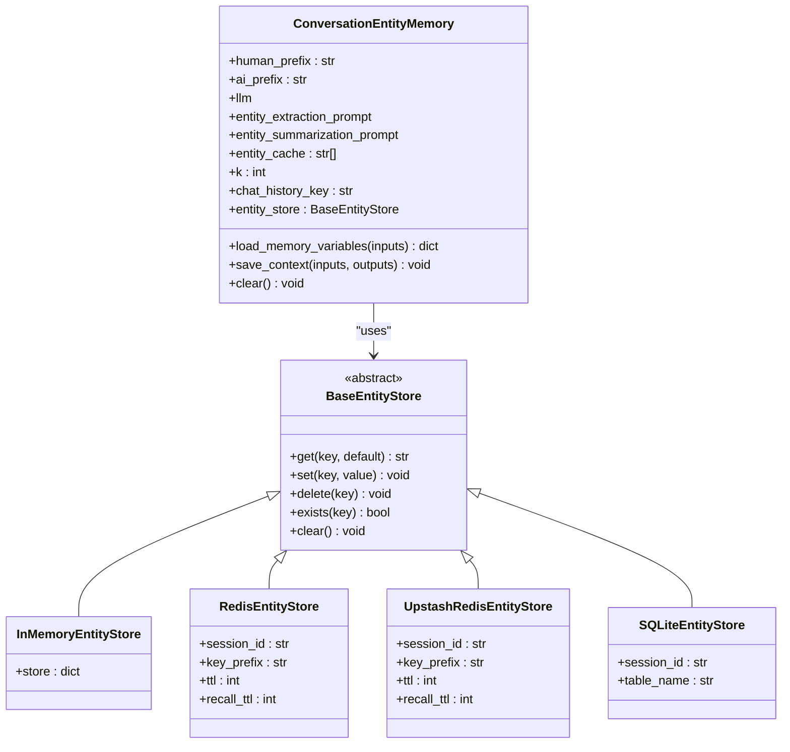
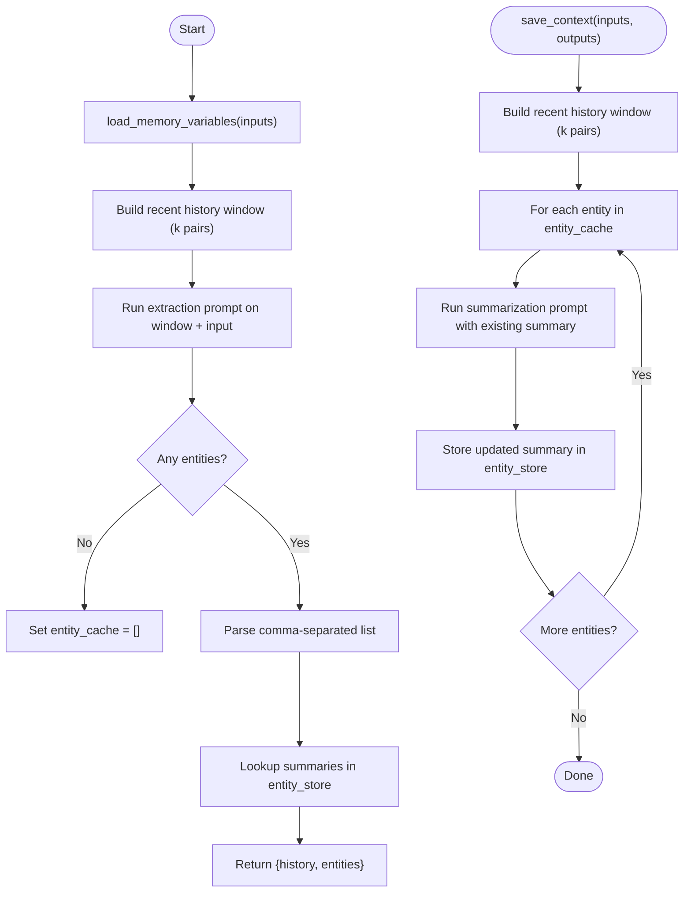
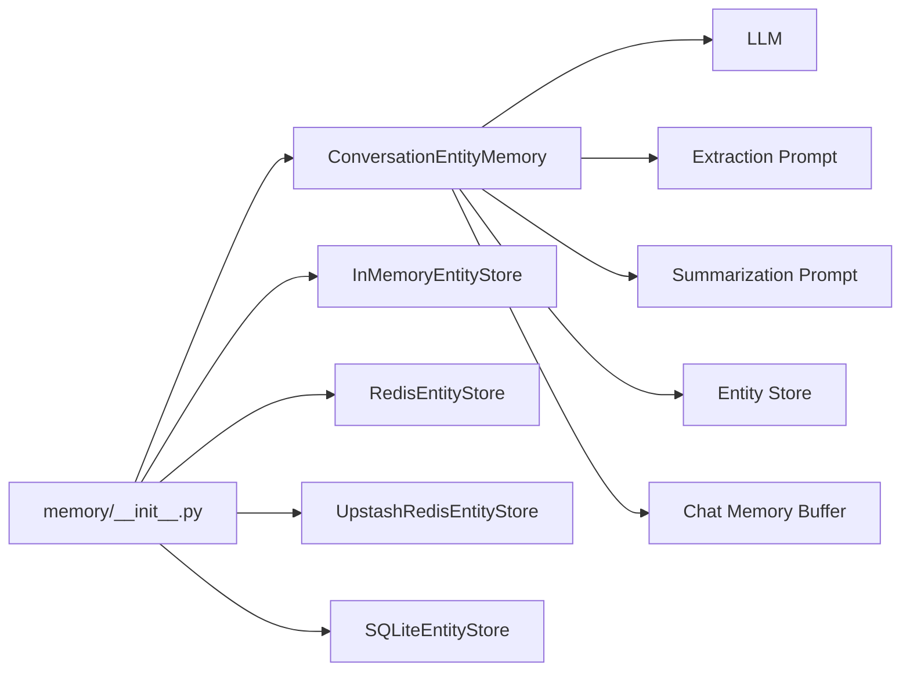

# Entity Memory

<cite>
**Referenced Files in This Document**
- [entity.py](file://libs/langchain/langchain_classic/memory/entity.py)
- [entity_extraction.py](file://libs/langchain/langchain_classic/indexes/prompts/entity_extraction.py)
- [entity_summarization.py](file://libs/langchain/langchain_classic/indexes/prompts/entity_summarization.py)
- [prompt.py](file://libs/langchain/langchain_classic/memory/prompt.py)
- [__init__.py](file://libs/langchain/langchain_classic/memory/__init__.py)
- [base_memory.py](file://libs/langchain/langchain_classic/base_memory.py)
- [test_imports.py](file://libs/langchain/tests/unit_tests/memory/test_imports.py)
</cite>

## Table of Contents
1. [Introduction](#introduction)
2. [Project Structure](#project-structure)
3. [Core Components](#core-components)
4. [Architecture Overview](#architecture-overview)
5. [Detailed Component Analysis](#detailed-component-analysis)
6. [Dependency Analysis](#dependency-analysis)
7. [Performance Considerations](#performance-considerations)
8. [Troubleshooting Guide](#troubleshooting-guide)
9. [Conclusion](#conclusion)
10. [Appendices](#appendices)

## Introduction
This document explains LangChain’s classic entity memory system that extracts, tracks, and enriches knowledge about named entities (people, places, concepts) mentioned during conversations. It covers how entity extraction and summarization prompts are used, how entity caches and stores maintain persistent summaries, and how the system integrates with chat histories. It also outlines configuration options, update policies, and practical application scenarios.

Important note: The classic entity memory implementation is marked as deprecated and scheduled for removal. Users should consult the migration guide referenced in the code comments for modern alternatives.

## Project Structure
The entity memory system lives in the classic LangChain memory module and relies on prompt templates for extraction and summarization. The key files are:
- Memory class and entity stores
- Prompt templates for entity extraction and summarization
- A conversation template that includes entity context
- Public exports and deprecation handling

**Diagram sources**
- [entity.py](file://libs/langchain/langchain_classic/memory/entity.py#L465-L612)
- [entity_extraction.py](file://libs/langchain/langchain_classic/indexes/prompts/entity_extraction.py#L1-L40)
- [entity_summarization.py](file://libs/langchain/langchain_classic/indexes/prompts/entity_summarization.py#L1-L25)
- [prompt.py](file://libs/langchain/langchain_classic/memory/prompt.py#L1-L12)
- [__init__.py](file://libs/langchain/langchain_classic/memory/__init__.py#L12-L18)
- [base_memory.py](file://libs/langchain/langchain_classic/base_memory.py#L63-L88)

**Section sources**
- [entity.py](file://libs/langchain/langchain_classic/memory/entity.py#L1-L612)
- [entity_extraction.py](file://libs/langchain/langchain_classic/indexes/prompts/entity_extraction.py#L1-L40)
- [entity_summarization.py](file://libs/langchain/langchain_classic/indexes/prompts/entity_summarization.py#L1-L25)
- [prompt.py](file://libs/langchain/langchain_classic/memory/prompt.py#L1-L12)
- [__init__.py](file://libs/langchain/langchain_classic/memory/__init__.py#L1-L127)
- [base_memory.py](file://libs/langchain/langchain_classic/base_memory.py#L63-L88)

## Core Components
- ConversationEntityMemory: Orchestrates entity extraction and summarization, manages a sliding window of recent messages, and persists summaries via pluggable entity stores.
- BaseEntityStore and concrete stores: Abstractions and implementations for storing entity summaries (in-memory, Redis, Upstash Redis, SQLite).
- Prompt templates: Templates for extracting named entities and for summarizing them incrementally.
- Memory variables and context: Exposes “entities” and “history” variables to downstream chains.

Key behaviors:
- load_memory_variables: Runs entity extraction over the recent k message pairs, builds a dictionary of entity summaries from the store, and returns both history and entities.
- save_context: Uses the cached entity names to update or create summaries in the store.
- Clearing memory: Clears chat history, entity cache, and entity store.

**Section sources**
- [entity.py](file://libs/langchain/langchain_classic/memory/entity.py#L465-L612)
- [entity_extraction.py](file://libs/langchain/langchain_classic/indexes/prompts/entity_extraction.py#L1-L40)
- [entity_summarization.py](file://libs/langchain/langchain_classic/indexes/prompts/entity_summarization.py#L1-L25)
- [prompt.py](file://libs/langchain/langchain_classic/memory/prompt.py#L1-L12)
- [base_memory.py](file://libs/langchain/langchain_classic/base_memory.py#L63-L88)

## Architecture Overview
The entity memory system integrates with a chat memory buffer and an LLM-driven pipeline to detect and summarize entities. It supports pluggable persistence backends.

**Diagram sources**
- [entity.py](file://libs/langchain/langchain_classic/memory/entity.py#L502-L606)
- [entity_extraction.py](file://libs/langchain/langchain_classic/indexes/prompts/entity_extraction.py#L37-L39)
- [entity_summarization.py](file://libs/langchain/langchain_classic/indexes/prompts/entity_summarization.py#L21-L24)
- [prompt.py](file://libs/langchain/langchain_classic/memory/prompt.py#L11-L12)

## Detailed Component Analysis

### ConversationEntityMemory
Responsibilities:
- Manage a sliding window of recent messages (controlled by k).
- Extract candidate entities from the latest input plus recent context.
- Load existing summaries for those entities from the entity store.
- Persist updated summaries after each turn.

Configuration highlights:
- llm: Language model used for extraction and summarization.
- entity_extraction_prompt and entity_summarization_prompt: Prompt templates.
- k: Number of recent message pairs considered for both extraction and summarization.
- entity_store: Pluggable store for entity summaries.
- chat_history_key: Key under which chat history is exposed.
- return_messages: Controls whether history is returned as messages or as a string.

Behavioral notes:
- load_memory_variables returns both history and a dictionary of entity names to summaries.
- save_context triggers summarization only for entities detected in the previous step.

**Section sources**
- [entity.py](file://libs/langchain/langchain_classic/memory/entity.py#L465-L612)

### Entity Stores
- BaseEntityStore: Abstract interface for get/set/delete/exists/clear.
- InMemoryEntityStore: Dictionary-backed store for local development.
- RedisEntityStore: Redis-backed store with TTL and recall TTL semantics.
- UpstashRedisEntityStore: Upstash Redis-backed store with similar TTL semantics.
- SQLiteEntityStore: SQLite-backed store with safe table creation and queries.

Operational characteristics:
- Keys are entity names; values are textual summaries.
- Redis stores support TTL and automatic TTL extension on reads.
- SQLite store validates identifiers and uses parameterized queries.

**Section sources**
- [entity.py](file://libs/langchain/langchain_classic/memory/entity.py#L38-L94)
- [entity.py](file://libs/langchain/langchain_classic/memory/entity.py#L104-L210)
- [entity.py](file://libs/langchain/langchain_classic/memory/entity.py#L219-L333)
- [entity.py](file://libs/langchain/langchain_classic/memory/entity.py#L343-L455)

### Prompt Templates
- Entity Extraction Prompt: Guides extraction of proper nouns from the last line of conversation, using recent history to resolve coreferences.
- Entity Summarization Prompt: Updates or creates a concise summary of an entity based on the last line of conversation and existing summary.

Integration:
- The extraction prompt is applied to a recent window of conversation history plus the current input.
- The summarization prompt is applied per entity in the cache, using the existing summary and the same conversation window.

**Section sources**
- [entity_extraction.py](file://libs/langchain/langchain_classic/indexes/prompts/entity_extraction.py#L1-L40)
- [entity_summarization.py](file://libs/langchain/langchain_classic/indexes/prompts/entity_summarization.py#L1-L25)

### Context Enrichment Template
- A conversation template that exposes a “Context” section populated with entity summaries. This allows downstream chains to incorporate entity knowledge into responses.

**Section sources**
- [prompt.py](file://libs/langchain/langchain_classic/memory/prompt.py#L1-L12)

### Class Relationships

**Diagram sources**
- [entity.py](file://libs/langchain/langchain_classic/memory/entity.py#L38-L94)
- [entity.py](file://libs/langchain/langchain_classic/memory/entity.py#L104-L210)
- [entity.py](file://libs/langchain/langchain_classic/memory/entity.py#L219-L333)
- [entity.py](file://libs/langchain/langchain_classic/memory/entity.py#L343-L455)
- [entity.py](file://libs/langchain/langchain_classic/memory/entity.py#L465-L612)

### Entity Detection and Summarization Flow

**Diagram sources**
- [entity.py](file://libs/langchain/langchain_classic/memory/entity.py#L502-L606)
- [entity_extraction.py](file://libs/langchain/langchain_classic/indexes/prompts/entity_extraction.py#L37-L39)
- [entity_summarization.py](file://libs/langchain/langchain_classic/indexes/prompts/entity_summarization.py#L21-L24)

## Dependency Analysis
- ConversationEntityMemory depends on:
  - A language model for extraction and summarization.
  - Prompt templates for extraction and summarization.
  - An entity store backend for persistence.
  - A chat memory buffer for recent history.
- Export surface:
  - The memory module exports ConversationEntityMemory and several entity store classes.
  - Deprecated lookups are handled centrally to maintain backward compatibility.

**Diagram sources**
- [entity.py](file://libs/langchain/langchain_classic/memory/entity.py#L465-L612)
- [__init__.py](file://libs/langchain/langchain_classic/memory/__init__.py#L12-L18)

**Section sources**
- [__init__.py](file://libs/langchain/langchain_classic/memory/__init__.py#L1-L127)
- [test_imports.py](file://libs/langchain/tests/unit_tests/memory/test_imports.py#L1-L44)

## Performance Considerations
- Sliding window size (k): Controls how much context is used for extraction and summarization. Larger k increases accuracy but also cost and latency.
- Prompt calls: Two LLM calls per turn—once for extraction, once per entity for summarization. Cost scales with number of detected entities.
- Store backends:
  - In-memory store: Fastest for single-process, ephemeral sessions.
  - Redis/Upstash: Offer persistence and TTL semantics; network latency applies.
  - SQLite: Good for embedded setups; I/O bound; ensure appropriate indexing and concurrency controls.
- Batch updates: Summarization happens per entity in the cache; batching is implicit via the loop over entity_cache.

[No sources needed since this section provides general guidance]

## Troubleshooting Guide
Common issues and remedies:
- No entities detected:
  - Verify the extraction prompt receives sufficient context and that the last line contains proper nouns.
  - Confirm that k is large enough to include relevant context.
- Summaries not updating:
  - Ensure save_context is invoked after each turn.
  - Check that entity_cache is populated by load_memory_variables.
- Persistence errors:
  - Redis/Upstash: Validate connection parameters and credentials.
  - SQLite: Confirm table name and session ID are valid identifiers and the database file is writable.
- Deprecation warnings:
  - This implementation is deprecated. Plan migration to supported memory components as indicated by the deprecation notice.

**Section sources**
- [entity.py](file://libs/langchain/langchain_classic/memory/entity.py#L30-L37)
- [entity.py](file://libs/langchain/langchain_classic/memory/entity.py#L567-L606)
- [entity.py](file://libs/langchain/langchain_classic/memory/entity.py#L104-L210)
- [entity.py](file://libs/langchain/langchain_classic/memory/entity.py#L219-L333)
- [entity.py](file://libs/langchain/langchain_classic/memory/entity.py#L343-L455)

## Conclusion
LangChain’s classic entity memory provides a robust mechanism to extract named entities from conversation history, maintain evolving summaries, and expose them to downstream chains. While deprecated, it remains instructive for understanding entity-centric memory design. For production use, migrate to supported memory components and consider integrating external knowledge bases for richer entity relationships and disambiguation.

[No sources needed since this section summarizes without analyzing specific files]

## Appendices

### Practical Application Scenarios
- Customer service:
  - Track customer identities, account numbers, and issue summaries across sessions.
  - Use Redis or Upstash for multi-session continuity.
- Knowledge management:
  - Maintain concise summaries of key concepts and entities to enrich retrieval and QA.
  - Combine with vector stores for hybrid retrieval.
- Personalized conversations:
  - Persist personal preferences and facts to tailor responses over time.
  - Use in-memory store for ephemeral demos; switch to Redis for shared sessions.

[No sources needed since this section provides general guidance]

### Configuration Options
- Model selection:
  - Configure llm to control extraction and summarization quality and cost.
- Extraction window:
  - Adjust k to balance context coverage and cost.
- Persistence:
  - Choose among InMemoryEntityStore, RedisEntityStore, UpstashRedisEntityStore, or SQLiteEntityStore.
- Prompt customization:
  - Replace default prompts with tailored templates for domain-specific entities.
- Context exposure:
  - Use the entity context template to inject entity summaries into prompts.

**Section sources**
- [entity.py](file://libs/langchain/langchain_classic/memory/entity.py#L465-L612)
- [entity_extraction.py](file://libs/langchain/langchain_classic/indexes/prompts/entity_extraction.py#L1-L40)
- [entity_summarization.py](file://libs/langchain/langchain_classic/indexes/prompts/entity_summarization.py#L1-L25)
- [prompt.py](file://libs/langchain/langchain_classic/memory/prompt.py#L1-L12)