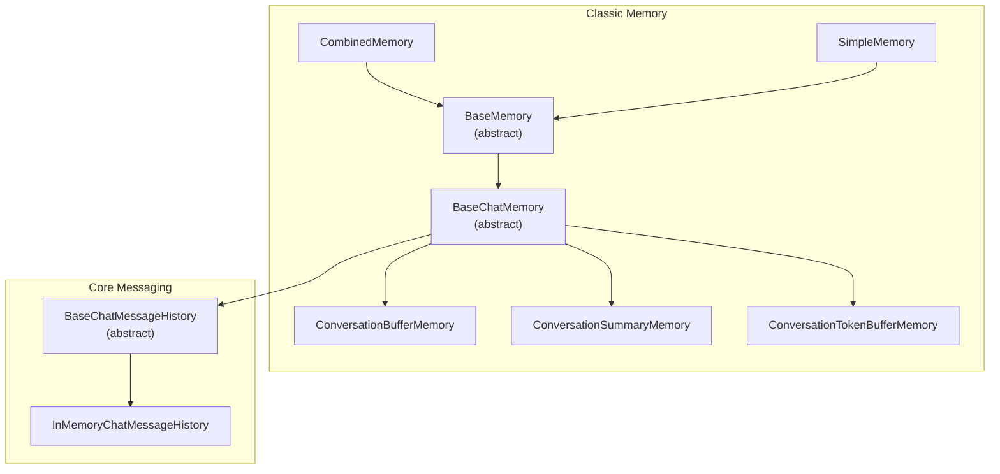
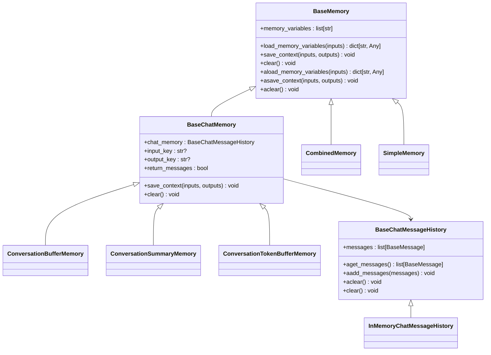
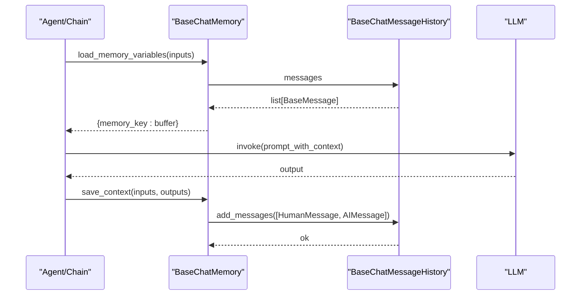
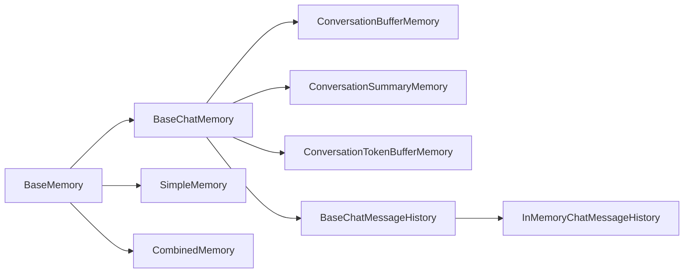

# Memory Fundamentals

<cite>
**Referenced Files in This Document**
- [base_memory.py](file://libs/langchain/langchain_classic/base_memory.py)
- [chat_memory.py](file://libs/langchain/langchain_classic/memory/chat_memory.py)
- [buffer.py](file://libs/langchain/langchain_classic/memory/buffer.py)
- [token_buffer.py](file://libs/langchain/langchain_classic/memory/token_buffer.py)
- [summary.py](file://libs/langchain/langchain_classic/memory/summary.py)
- [combined.py](file://libs/langchain/langchain_classic/memory/combined.py)
- [simple.py](file://libs/langchain/langchain_classic/memory/simple.py)
- [utils.py](file://libs/langchain/langchain_classic/memory/utils.py)
- [chat_history.py](file://libs/core/langchain_core/chat_history.py)
- [__init__.py (memory)](file://libs/langchain/langchain_classic/memory/__init__.py)
</cite>

## Table of Contents
1. [Introduction](#introduction)
2. [Project Structure](#project-structure)
3. [Core Components](#core-components)
4. [Architecture Overview](#architecture-overview)
5. [Detailed Component Analysis](#detailed-component-analysis)
6. [Dependency Analysis](#dependency-analysis)
7. [Performance Considerations](#performance-considerations)
8. [Troubleshooting Guide](#troubleshooting-guide)
9. [Conclusion](#conclusion)
10. [Appendices](#appendices)

## Introduction
This document explains the fundamentals of memory in conversational AI applications within the LangChain ecosystem. It covers how memory preserves context, manages state, and handles sessions; the memory interface architecture and base classes; common patterns across memory implementations; lifecycle management and configuration; and how memory integrates with language models and agents to maintain conversational coherence. Practical examples focus on initialization, configuration, and usage patterns, along with performance considerations and best practices for memory-efficient implementations.

## Project Structure
LangChain’s classic memory module provides foundational abstractions and several built-in memory implementations. The core memory abstractions live in the classic memory package, while the modern chat history abstractions reside in the core messaging layer. The memory module exports a wide variety of memory types and chat message history backends.

**Diagram sources**
- [base_memory.py](file://libs/langchain/langchain_classic/base_memory.py#L27-L117)
- [chat_memory.py](file://libs/langchain/langchain_classic/memory/chat_memory.py#L25-L105)
- [buffer.py](file://libs/langchain/langchain_classic/memory/buffer.py#L21-L174)
- [summary.py](file://libs/langchain/langchain_classic/memory/summary.py#L91-L169)
- [token_buffer.py](file://libs/langchain/langchain_classic/memory/token_buffer.py#L19-L72)
- [combined.py](file://libs/langchain/langchain_classic/memory/combined.py#L10-L86)
- [simple.py](file://libs/langchain/langchain_classic/memory/simple.py#L8-L31)
- [chat_history.py](file://libs/core/langchain_core/chat_history.py#L22-L247)

**Section sources**
- [__init__.py (memory)](file://libs/langchain/langchain_classic/memory/__init__.py#L1-L127)

## Core Components
- BaseMemory: Defines the core memory interface with abstract methods for memory variables, loading memory, saving context, and clearing memory. It also provides async variants delegating to sync implementations via a shared executor pattern.
- BaseChatMemory: Extends BaseMemory for chat-style interactions, integrating with chat message history and handling input/output key resolution.
- Chat Message History: Core chat history abstractions define the contract for storing and retrieving message sequences, including async variants and convenience helpers.

Key responsibilities:
- Context preservation: Storing and exposing conversation context to downstream components.
- State management: Managing mutable state such as buffers, summaries, and message lists.
- Session handling: Encapsulating per-session message history and clearing mechanisms.

**Section sources**
- [base_memory.py](file://libs/langchain/langchain_classic/base_memory.py#L27-L117)
- [chat_memory.py](file://libs/langchain/langchain_classic/memory/chat_memory.py#L25-L105)
- [chat_history.py](file://libs/core/langchain_core/chat_history.py#L22-L247)

## Architecture Overview
The memory architecture centers on a small set of abstract interfaces that implementations specialize for different strategies (buffering, summarization, token limits, combination). Chat memory implementations rely on chat history backends, which can be in-memory or backed by external stores.

**Diagram sources**
- [base_memory.py](file://libs/langchain/langchain_classic/base_memory.py#L27-L117)
- [chat_memory.py](file://libs/langchain/langchain_classic/memory/chat_memory.py#L25-L105)
- [buffer.py](file://libs/langchain/langchain_classic/memory/buffer.py#L21-L174)
- [summary.py](file://libs/langchain/langchain_classic/memory/summary.py#L91-L169)
- [token_buffer.py](file://libs/langchain/langchain_classic/memory/token_buffer.py#L19-L72)
- [combined.py](file://libs/langchain/langchain_classic/memory/combined.py#L10-L86)
- [simple.py](file://libs/langchain/langchain_classic/memory/simple.py#L8-L31)
- [chat_history.py](file://libs/core/langchain_core/chat_history.py#L22-L247)

## Detailed Component Analysis

### BaseMemory and BaseChatMemory
- BaseMemory defines the contract for memory providers:
  - memory_variables: exposes the keys that will be injected into chain inputs.
  - load_memory_variables: returns the current memory state for a given input context.
  - save_context: persists a turn’s input/output pair into memory.
  - clear/aclear: resets memory contents.
- BaseChatMemory adds chat-specific behavior:
  - Integrates with BaseChatMessageHistory for message storage.
  - Resolves input and output keys from chain inputs/outputs.
  - Supports both string and message buffer modes via return_messages.

Common patterns:
- Delegation to chat history for persistence.
- Validation of input/output keys to avoid ambiguity.
- Asynchronous wrappers around synchronous operations.

**Section sources**
- [base_memory.py](file://libs/langchain/langchain_classic/base_memory.py#L27-L117)
- [chat_memory.py](file://libs/langchain/langchain_classic/memory/chat_memory.py#L25-L105)
- [utils.py](file://libs/langchain/langchain_classic/memory/utils.py#L4-L21)

### ConversationBufferMemory
- Stores full conversation history as either a string buffer or a list of messages depending on return_messages.
- Exposes buffer views for both string and message formats.
- Uses chat memory backend for storage and retrieval.

Lifecycle:
- Initialization sets prefixes and memory key.
- load_memory_variables returns the current buffer under memory_key.
- save_context appends human and AI turns to the chat history.

**Section sources**
- [buffer.py](file://libs/langchain/langchain_classic/memory/buffer.py#L21-L89)

### ConversationSummaryMemory
- Maintains a summary of the conversation and updates it incrementally after each turn.
- Uses a summarizer mixin to produce new summaries based on recent messages and the existing summary.
- Supports returning either the summary as a system message or as plain text.

Lifecycle:
- load_memory_variables returns the current summary under memory_key.
- save_context appends the latest exchange and recomputes the summary.
- clear resets both chat history and summary.

**Section sources**
- [summary.py](file://libs/langchain/langchain_classic/memory/summary.py#L91-L169)

### ConversationTokenBufferMemory
- Enforces a token budget by pruning older messages when the total token count exceeds the configured limit.
- Leverages the language model’s token counting to compute sizes.

Lifecycle:
- save_context appends messages, then prunes from the front until the token limit is satisfied.

**Section sources**
- [token_buffer.py](file://libs/langchain/langchain_classic/memory/token_buffer.py#L19-L72)

### CombinedMemory
- Aggregates multiple memory instances and merges their outputs.
- Validates that memory variables do not overlap across sub-memories.
- Provides unified save_context and clear across all sub-memories.

Usage pattern:
- Useful for combining a summary memory with a buffer memory to balance recall and cost.

**Section sources**
- [combined.py](file://libs/langchain/langchain_classic/memory/combined.py#L10-L86)

### SimpleMemory
- Immutable memory that returns fixed key-value pairs without modification.
- Useful for injecting static context (e.g., role instructions) into prompts.

**Section sources**
- [simple.py](file://libs/langchain/langchain_classic/memory/simple.py#L8-L31)

### Chat Message History Backends
- BaseChatMessageHistory defines the contract for message storage, including async methods and convenience helpers.
- InMemoryChatMessageHistory provides a simple in-memory list-based implementation.

Integration:
- Chat memory implementations depend on a chat history backend to persist and retrieve messages.

**Section sources**
- [chat_history.py](file://libs/core/langchain_core/chat_history.py#L22-L247)

### Memory Lifecycle and Configuration
Initialization parameters commonly include:
- memory_key: the key under which memory is exposed to chains.
- input_key/output_key: explicit keys for resolving inputs/outputs when ambiguous.
- return_messages: whether to expose memory as a list of messages or a formatted string.
- human_prefix/ai_prefix: formatting markers for string buffers.
- llm: language model reference for token-aware pruning or summarization.
- max_token_limit: maximum tokens for token-buffer strategies.
- chat_memory: chat history backend instance.

Configuration options:
- Choose between string and message buffers.
- Select a summarization strategy for long sessions.
- Apply token budgets to constrain context size.
- Combine multiple memories for complementary strengths.

Practical usage patterns:
- Initialize a memory type and pass it to a chain or agent.
- Call save_context after each turn to update memory.
- Clear memory when starting a new session or resetting context.

**Section sources**
- [buffer.py](file://libs/langchain/langchain_classic/memory/buffer.py#L31-L38)
- [token_buffer.py](file://libs/langchain/langchain_classic/memory/token_buffer.py#L26-L31)
- [summary.py](file://libs/langchain/langchain_classic/memory/summary.py#L99-L101)
- [chat_memory.py](file://libs/langchain/langchain_classic/memory/chat_memory.py#L36-L42)

### Integration with Language Models and Agents
- Memory integrates with chains and agents by injecting memory variables into prompt inputs.
- For token-aware strategies, the language model is used to estimate token counts and prune history.
- For summarization strategies, a summarizer chain produces concise context suitable for the model.

Sequence of operations:
- A chain or agent invokes load_memory_variables to obtain context.
- The memory returns the appropriate buffer or summary.
- After generation, save_context persists the new input/output pair.

**Diagram sources**
- [chat_memory.py](file://libs/langchain/langchain_classic/memory/chat_memory.py#L74-L96)
- [chat_history.py](file://libs/core/langchain_core/chat_history.py#L202-L247)

## Dependency Analysis
- BaseMemory is the foundation for all memory implementations.
- BaseChatMemory depends on BaseChatMessageHistory for persistence and on utility functions for input/output key resolution.
- Specific memory implementations depend on BaseChatMemory and optionally on a language model for token-aware operations.
- CombinedMemory composes multiple BaseMemory instances and enforces disjoint variable sets.

**Diagram sources**
- [base_memory.py](file://libs/langchain/langchain_classic/base_memory.py#L27-L117)
- [chat_memory.py](file://libs/langchain/langchain_classic/memory/chat_memory.py#L25-L105)
- [buffer.py](file://libs/langchain/langchain_classic/memory/buffer.py#L21-L174)
- [summary.py](file://libs/langchain/langchain_classic/memory/summary.py#L91-L169)
- [token_buffer.py](file://libs/langchain/langchain_classic/memory/token_buffer.py#L19-L72)
- [combined.py](file://libs/langchain/langchain_classic/memory/combined.py#L10-L86)
- [chat_history.py](file://libs/core/langchain_core/chat_history.py#L22-L247)

**Section sources**
- [combined.py](file://libs/langchain/langchain_classic/memory/combined.py#L16-L47)

## Performance Considerations
- Token-aware strategies:
  - Use ConversationTokenBufferMemory to cap context size and reduce latency and cost.
  - Re-compute summaries periodically with ConversationSummaryMemory to keep context concise.
- Buffering costs:
  - Full conversation buffering grows linearly with turns; consider summarization or token limits for long sessions.
- I/O and serialization:
  - Persisting chat histories to disk or external databases introduces latency; batch additions via add_messages to minimize round-trips.
- Concurrency:
  - Async methods are provided; prefer async APIs in async environments to avoid thread contention.
- Memory footprint:
  - Prefer message buffers only when downstream components require structured messages; otherwise use string buffers to reduce overhead.

[No sources needed since this section provides general guidance]

## Troubleshooting Guide
Common issues and resolutions:
- Ambiguous output keys:
  - When multiple outputs are present, explicitly set output_key to disambiguate which value to store.
- Missing input keys:
  - If input_key is not provided, the memory resolves it automatically; ensure a single non-memory input key exists.
- Overlapping memory variables:
  - CombinedMemory validates that sub-memories do not share memory variables; adjust memory_key or avoid overlaps.
- Returning messages vs. strings:
  - ConversationStringBufferMemory requires return_messages=False; ensure return_messages aligns with intended usage.
- Clearing memory:
  - Use clear or aclear to reset state; verify that the underlying chat history backend supports clearing.

**Section sources**
- [chat_memory.py](file://libs/langchain/langchain_classic/memory/chat_memory.py#L43-L73)
- [combined.py](file://libs/langchain/langchain_classic/memory/combined.py#L16-L47)
- [buffer.py](file://libs/langchain/langchain_classic/memory/buffer.py#L120-L127)

## Conclusion
LangChain’s memory system provides a flexible, extensible foundation for preserving context in conversational AI. By composing BaseMemory abstractions with chat history backends and specialized strategies—such as buffering, summarization, and token-aware pruning—applications can maintain coherent, efficient conversations. Proper configuration of keys, memory variables, and strategies enables robust session handling and scalable performance.

[No sources needed since this section summarizes without analyzing specific files]

## Appendices

### Practical Examples (Paths)
- Initialize a buffered memory and attach to a chain:
  - [ConversationBufferMemory](file://libs/langchain/langchain_classic/memory/buffer.py#L21-L89)
- Initialize a token-buffer memory with a language model:
  - [ConversationTokenBufferMemory](file://libs/langchain/langchain_classic/memory/token_buffer.py#L19-L72)
- Initialize a summary memory:
  - [ConversationSummaryMemory](file://libs/langchain/langchain_classic/memory/summary.py#L91-L169)
- Combine multiple memories:
  - [CombinedMemory](file://libs/langchain/langchain_classic/memory/combined.py#L10-L86)
- Inject static context:
  - [SimpleMemory](file://libs/langchain/langchain_classic/memory/simple.py#L8-L31)

### Memory Interface Reference
- BaseMemory methods:
  - [memory_variables](file://libs/langchain/langchain_classic/base_memory.py#L63-L67)
  - [load_memory_variables](file://libs/langchain/langchain_classic/base_memory.py#L68-L77)
  - [save_context](file://libs/langchain/langchain_classic/base_memory.py#L90-L97)
  - [clear](file://libs/langchain/langchain_classic/base_memory.py#L110-L112)
- BaseChatMemory fields and methods:
  - [chat_memory, input_key, output_key, return_messages](file://libs/langchain/langchain_classic/memory/chat_memory.py#L36-L42)
  - [save_context](file://libs/langchain/langchain_classic/memory/chat_memory.py#L74-L96)
  - [clear](file://libs/langchain/langchain_classic/memory/chat_memory.py#L98-L104)