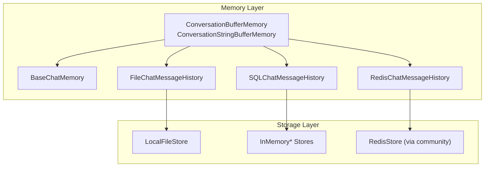
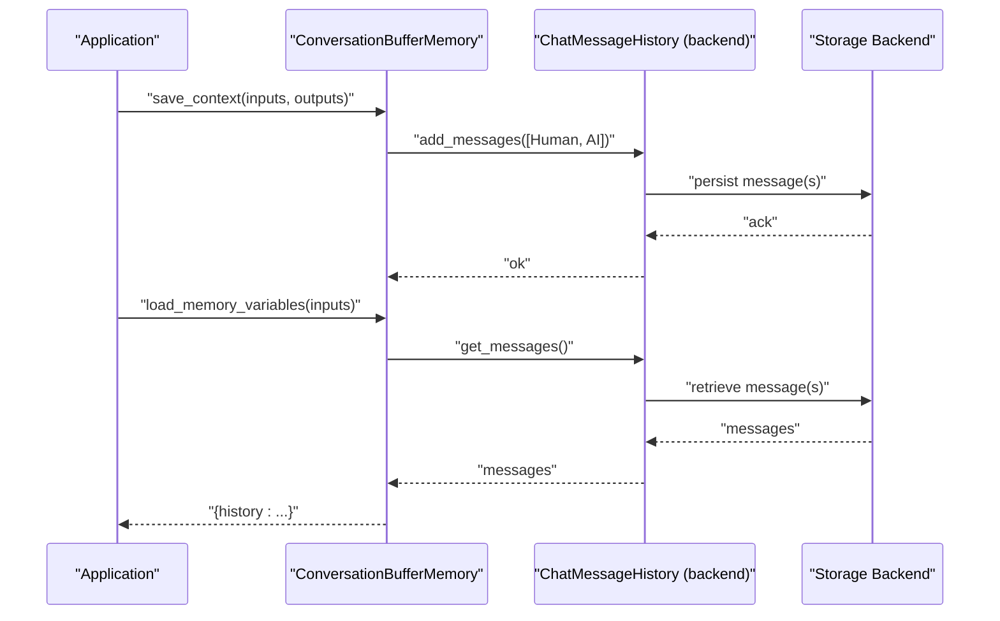
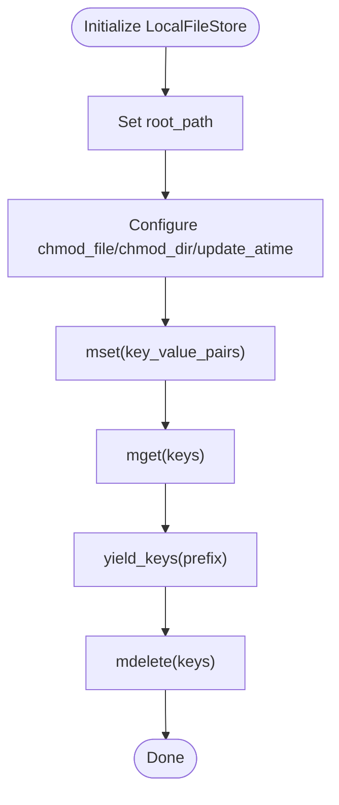
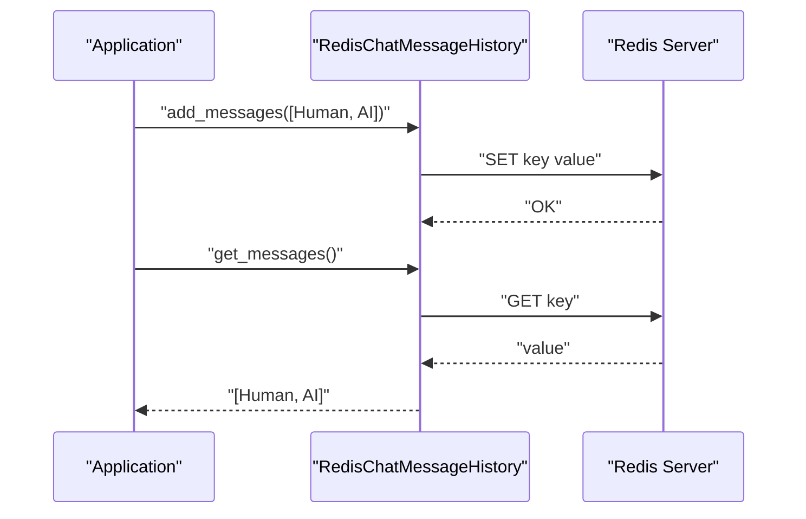
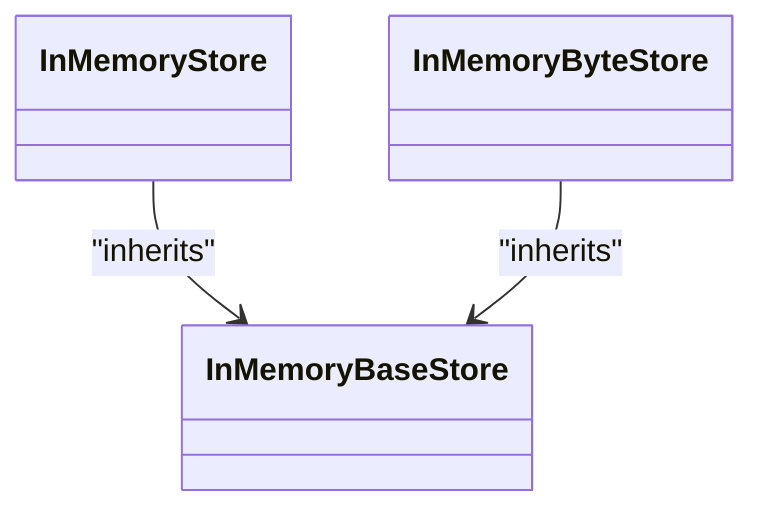
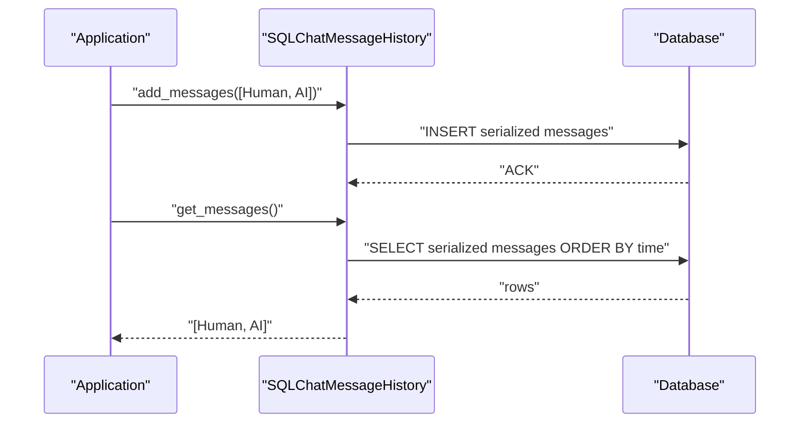
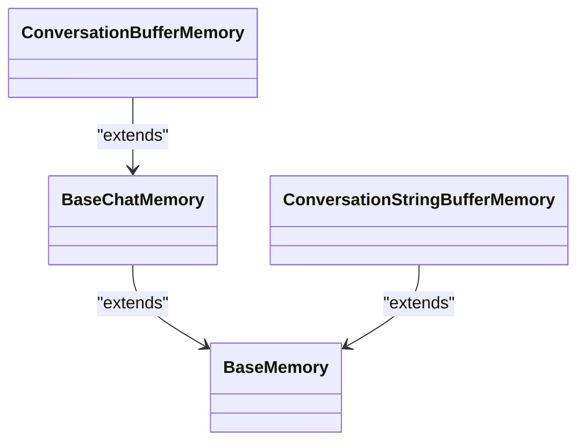
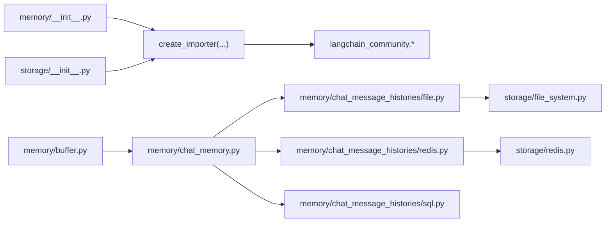

# Memory Persistence

<cite>
**Referenced Files in This Document**
- [memory/__init__.py](file://libs/langchain/langchain_classic/memory/__init__.py)
- [storage/__init__.py](file://libs/langchain/langchain_classic/storage/__init__.py)
- [storage/file_system.py](file://libs/langchain/langchain_classic/storage/file_system.py)
- [storage/in_memory.py](file://libs/langchain/langchain_classic/storage/in_memory.py)
- [storage/redis.py](file://libs/langchain/langchain_classic/storage/redis.py)
- [memory/chat_memory.py](file://libs/langchain/langchain_classic/memory/chat_memory.py)
- [memory/buffer.py](file://libs/langchain/langchain_classic/memory/buffer.py)
- [memory/chat_message_histories/file.py](file://libs/langchain/langchain_classic/memory/chat_message_histories/file.py)
- [memory/chat_message_histories/redis.py](file://libs/langchain/langchain_classic/memory/chat_message_histories/redis.py)
- [memory/chat_message_histories/sql.py](file://libs/langchain/langchain_classic/memory/chat_message_histories/sql.py)
</cite>

## Table of Contents
1. [Introduction](#introduction)
2. [Project Structure](#project-structure)
3. [Core Components](#core-components)
4. [Architecture Overview](#architecture-overview)
5. [Detailed Component Analysis](#detailed-component-analysis)
6. [Dependency Analysis](#dependency-analysis)
7. [Performance Considerations](#performance-considerations)
8. [Troubleshooting Guide](#troubleshooting-guide)
9. [Conclusion](#conclusion)
10. [Appendices](#appendices)

## Introduction
This document explains how LangChain persists conversation memories across application sessions using different storage backends. It covers available persistence options (file-based storage, Redis, in-memory storage, and database integrations), configuration options, connection parameters, serialization formats, initialization, loading, and storage operations. It also provides practical guidance for production deployments, data lifecycle management, migration strategies, backups, recovery, performance, security, and troubleshooting.

## Project Structure
LangChain’s memory persistence is implemented across two main areas:
- Memory implementations: conversation buffers, summaries, entity memory, and chat message histories backed by external stores.
- Storage layer: generic key-value and byte stores used by caches and persistence layers, including file system, Redis, and in-memory stores.

**Diagram sources**
- [memory/buffer.py](file://libs/langchain/langchain_classic/memory/buffer.py#L21-L174)
- [memory/chat_memory.py](file://libs/langchain/langchain_classic/memory/chat_memory.py#L25-L105)
- [memory/chat_message_histories/file.py](file://libs/langchain/langchain_classic/memory/chat_message_histories/file.py#L1-L26)
- [memory/chat_message_histories/redis.py](file://libs/langchain/langchain_classic/memory/chat_message_histories/redis.py#L1-L26)
- [memory/chat_message_histories/sql.py](file://libs/langchain/langchain_classic/memory/chat_message_histories/sql.py#L1-L34)
- [storage/file_system.py](file://libs/langchain/langchain_classic/storage/file_system.py#L12-L165)
- [storage/in_memory.py](file://libs/langchain/langchain_classic/storage/in_memory.py#L1-L14)
- [storage/redis.py](file://libs/langchain/langchain_classic/storage/redis.py#L1-L24)

**Section sources**
- [memory/__init__.py](file://libs/langchain/langchain_classic/memory/__init__.py#L1-L127)
- [storage/__init__.py](file://libs/langchain/langchain_classic/storage/__init__.py#L1-L58)

## Core Components
- ConversationBufferMemory and ConversationStringBufferMemory: store full conversation history in memory or as a concatenated string. These expose memory variables and can save/load context via chat message histories.
- BaseChatMemory: provides shared logic for saving context and clearing memory, delegating message persistence to a BaseChatMessageHistory implementation.
- Chat Message Histories: pluggable backends for storing conversation turns, including file, Redis, and SQL-based histories.
- Storage Layer: generic stores for key/value and byte operations, including LocalFileStore, InMemory* stores, and RedisStore (community).

Key responsibilities:
- Initialization: configure memory with appropriate chat message history backend and optional serialization settings.
- Loading: restore previous conversation turns from the chosen backend.
- Storage operations: append new turns, iterate keys/prefixes, and manage lifecycle.

**Section sources**
- [memory/buffer.py](file://libs/langchain/langchain_classic/memory/buffer.py#L21-L174)
- [memory/chat_memory.py](file://libs/langchain/langchain_classic/memory/chat_memory.py#L25-L105)
- [storage/file_system.py](file://libs/langchain/langchain_classic/storage/file_system.py#L12-L165)
- [storage/in_memory.py](file://libs/langchain/langchain_classic/storage/in_memory.py#L1-L14)
- [storage/redis.py](file://libs/langchain/langchain_classic/storage/redis.py#L1-L24)

## Architecture Overview
The memory persistence architecture separates concerns between:
- Memory models: define how to load/save context and expose memory variables.
- Chat message histories: encapsulate persistence of individual turns.
- Storage backends: provide low-level key/value or byte operations.

**Diagram sources**
- [memory/buffer.py](file://libs/langchain/langchain_classic/memory/buffer.py#L74-L88)
- [memory/chat_memory.py](file://libs/langchain/langchain_classic/memory/chat_memory.py#L74-L104)
- [storage/file_system.py](file://libs/langchain/langchain_classic/storage/file_system.py#L104-L138)

## Detailed Component Analysis

### File-Based Persistence (LocalFileStore)
- Purpose: Persist conversation turns to the local filesystem under a root path.
- Key operations: mget, mset, mdelete, yield_keys with optional access-time updates.
- Configuration:
  - root_path: absolute or relative path to the store root.
  - chmod_file/chmod_dir: file/directory permission overrides.
  - update_atime: update access time on reads to support MRU/LRU policies.
- Serialization: values are stored as raw bytes; callers handle serialization.
- Lifecycle:
  - Initialize LocalFileStore with root_path.
  - Use yield_keys(prefix) to enumerate persisted keys.
  - Use mdelete(keys) to remove stale or expired entries.

**Diagram sources**
- [storage/file_system.py](file://libs/langchain/langchain_classic/storage/file_system.py#L39-L165)

**Section sources**
- [storage/file_system.py](file://libs/langchain/langchain_classic/storage/file_system.py#L12-L165)

### Redis Persistence (RedisStore via community)
- Purpose: Persist conversation histories in Redis for distributed or scalable setups.
- Availability: RedisStore is exposed via dynamic imports from langchain_community.storage.
- Configuration:
  - Host, port, db, password, socket_timeout, connection_pool kwargs supported by typical Redis clients.
  - Optional TLS, sentinel, or cluster configurations via client parameters.
- Serialization: store raw bytes; callers handle serialization.
- Lifecycle:
  - Initialize Redis-backed chat message history with connection parameters.
  - Append new turns; retrieve messages on load; prune or expire as needed.

**Diagram sources**
- [memory/chat_message_histories/redis.py](file://libs/langchain/langchain_classic/memory/chat_message_histories/redis.py#L1-L26)

**Section sources**
- [memory/chat_message_histories/redis.py](file://libs/langchain/langchain_classic/memory/chat_message_histories/redis.py#L1-L26)
- [storage/redis.py](file://libs/langchain/langchain_classic/storage/redis.py#L1-L24)

### In-Memory Persistence (InMemory* Stores)
- Purpose: Non-persistent, fast storage primarily for testing or ephemeral sessions.
- Types: InMemoryBaseStore, InMemoryStore, InMemoryByteStore.
- Behavior: Dictionary-backed, no eviction policy, not thread-safe.
- Lifecycle: Use for temporary or unit-test scenarios; data lost on process restart.

**Diagram sources**
- [storage/in_memory.py](file://libs/langchain/langchain_classic/storage/in_memory.py#L1-L14)

**Section sources**
- [storage/in_memory.py](file://libs/langchain/langchain_classic/storage/in_memory.py#L1-L14)

### Database Integrations (SQL-based Chat History)
- Purpose: Persist conversation histories in relational databases.
- Availability: SQLChatMessageHistory and related converters are exposed via dynamic imports.
- Configuration:
  - Connection string and dialect-specific parameters.
  - Message converter controls serialization of message payloads to/from the database.
- Serialization: DefaultMessageConverter handles conversion; customize via BaseMessageConverter.
- Lifecycle:
  - Initialize SQL-backed chat message history with engine/connection and converter.
  - Retrieve messages on load; append on save.

**Diagram sources**
- [memory/chat_message_histories/sql.py](file://libs/langchain/langchain_classic/memory/chat_message_histories/sql.py#L1-L34)

**Section sources**
- [memory/chat_message_histories/sql.py](file://libs/langchain/langchain_classic/memory/chat_message_histories/sql.py#L1-L34)

### Conversation Memory Models
- ConversationBufferMemory:
  - Stores full conversation history as messages or string.
  - Exposes memory variable "history".
  - Delegates persistence to chat message history backend.
- ConversationStringBufferMemory:
  - Stores concatenated string history.
  - Enforces return_messages=False.
- BaseChatMemory:
  - Provides save_context/asave_context and clear/aclear.
  - Uses BaseChatMessageHistory for storage.

**Diagram sources**
- [memory/chat_memory.py](file://libs/langchain/langchain_classic/memory/chat_memory.py#L25-L105)
- [memory/buffer.py](file://libs/langchain/langchain_classic/memory/buffer.py#L21-L174)

**Section sources**
- [memory/chat_memory.py](file://libs/langchain/langchain_classic/memory/chat_memory.py#L25-L105)
- [memory/buffer.py](file://libs/langchain/langchain_classic/memory/buffer.py#L21-L174)

## Dependency Analysis
- Dynamic imports:
  - memory/__init__.py and storage/__init__.py rely on create_importer to lazily resolve deprecated or community-provided classes (e.g., RedisStore, FileChatMessageHistory, SQLChatMessageHistory).
- Coupling:
  - Memory models depend on BaseChatMessageHistory implementations for persistence.
  - Storage backends provide low-level operations used by higher-level stores and histories.

**Diagram sources**
- [memory/__init__.py](file://libs/langchain/langchain_classic/memory/__init__.py#L54-L86)
- [storage/__init__.py](file://libs/langchain/langchain_classic/storage/__init__.py#L17-L43)
- [memory/buffer.py](file://libs/langchain/langchain_classic/memory/buffer.py#L21-L174)
- [memory/chat_memory.py](file://libs/langchain/langchain_classic/memory/chat_memory.py#L25-L105)
- [memory/chat_message_histories/file.py](file://libs/langchain/langchain_classic/memory/chat_message_histories/file.py#L1-L26)
- [memory/chat_message_histories/redis.py](file://libs/langchain/langchain_classic/memory/chat_message_histories/redis.py#L1-L26)
- [memory/chat_message_histories/sql.py](file://libs/langchain/langchain_classic/memory/chat_message_histories/sql.py#L1-L34)
- [storage/file_system.py](file://libs/langchain/langchain_classic/storage/file_system.py#L12-L165)
- [storage/redis.py](file://libs/langchain/langchain_classic/storage/redis.py#L1-L24)

**Section sources**
- [memory/__init__.py](file://libs/langchain/langchain_classic/memory/__init__.py#L54-L86)
- [storage/__init__.py](file://libs/langchain/langchain_classic/storage/__init__.py#L17-L43)

## Performance Considerations
- File-based storage:
  - Suitable for small to medium workloads; I/O bound. Consider update_atime for access-time-based eviction policies.
  - Use mget/mset batching to reduce filesystem overhead.
- Redis:
  - Low latency; supports expiration and pub/sub for real-time updates. Tune connection pooling and timeouts.
- In-memory storage:
  - Fastest option; not suitable for persistence across restarts.
- Database storage:
  - Good for auditability and structured queries; consider indexing on timestamps and session identifiers.

[No sources needed since this section provides general guidance]

## Troubleshooting Guide
- Invalid key errors in LocalFileStore:
  - Occur when keys contain invalid characters or escape the root path. Ensure keys are relative and sanitized.
- Permission issues:
  - Set chmod_file and chmod_dir during initialization to enforce proper permissions.
- Missing community dependencies:
  - RedisStore, FileChatMessageHistory, SQLChatMessageHistory are resolved dynamically; install langchain-community to enable them.
- Serialization mismatches:
  - Ensure consistent serialization format across app instances (e.g., JSON or pickle). For SQL histories, verify the converter matches the stored schema.

**Section sources**
- [storage/file_system.py](file://libs/langchain/langchain_classic/storage/file_system.py#L74-L87)
- [memory/chat_message_histories/file.py](file://libs/langchain/langchain_classic/memory/chat_message_histories/file.py#L1-L26)
- [memory/chat_message_histories/redis.py](file://libs/langchain/langchain_classic/memory/chat_message_histories/redis.py#L1-L26)
- [memory/chat_message_histories/sql.py](file://libs/langchain/langchain_classic/memory/chat_message_histories/sql.py#L1-L34)

## Conclusion
LangChain offers flexible memory persistence through pluggable chat message histories and a generic storage layer. Choose file-based storage for simplicity, Redis for scalability, in-memory stores for ephemeral or test scenarios, and SQL for structured persistence. Proper configuration, serialization, and lifecycle management are essential for production-grade reliability.

[No sources needed since this section summarizes without analyzing specific files]

## Appendices

### Practical Implementation Patterns
- File-based persistence:
  - Initialize LocalFileStore with a dedicated root path per tenant/session.
  - Serialize messages as JSON bytes before mset; deserialize on mget.
  - Periodically prune old sessions using yield_keys(prefix) and mdelete(keys).
- Redis persistence:
  - Use Redis-backed chat message history with connection parameters.
  - Set TTL on keys to cap memory usage.
  - Monitor slow commands and tune network settings.
- Database persistence:
  - Use SQLChatMessageHistory with a configured engine and DefaultMessageConverter.
  - Add indexes on session identifiers and timestamps for efficient retrieval.
- In-memory persistence:
  - Use for unit tests or short-lived sessions; avoid for long-term persistence.

[No sources needed since this section provides general guidance]

### Data Migration Strategies
- From file to Redis:
  - Enumerate keys with LocalFileStore.yield_keys(prefix), read values, and write to Redis-backed history.
  - Validate round-trip serialization compatibility.
- From SQL to Redis:
  - Export rows from the SQL history table, serialize messages, and populate Redis keys.
- Versioning:
  - Maintain a schema version in metadata; add migrations to adapt older formats.

[No sources needed since this section provides general guidance]

### Backup and Recovery
- File-based:
  - Back up root_path periodically; consider snapshotting at session boundaries.
- Redis:
  - Enable RDB/AOF snapshots; back up snapshots regularly.
- SQL:
  - Use database-native backup tools; validate point-in-time recovery.

[No sources needed since this section provides general guidance]

### Security Considerations
- File-based:
  - Restrict filesystem permissions; avoid world-writable directories.
- Redis:
  - Enable authentication, TLS, and network segmentation.
- SQL:
  - Use encrypted connections; restrict database privileges to the application user.
- Serialization:
  - Avoid unsafe deserializers; prefer explicit JSON or protocol buffers.

[No sources needed since this section provides general guidance]