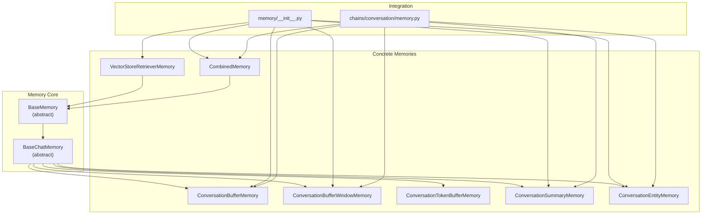
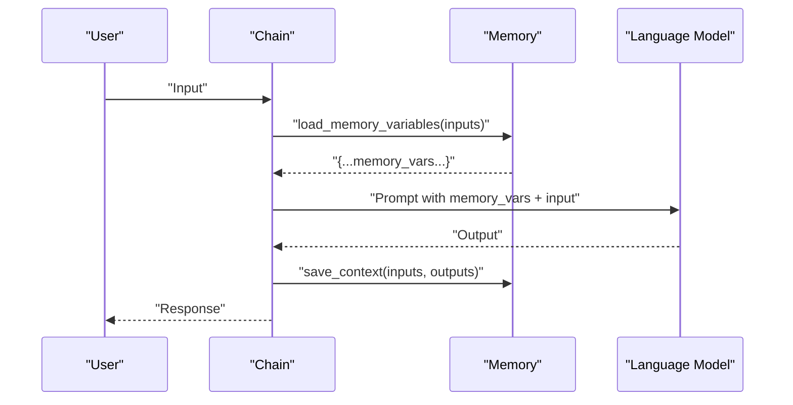
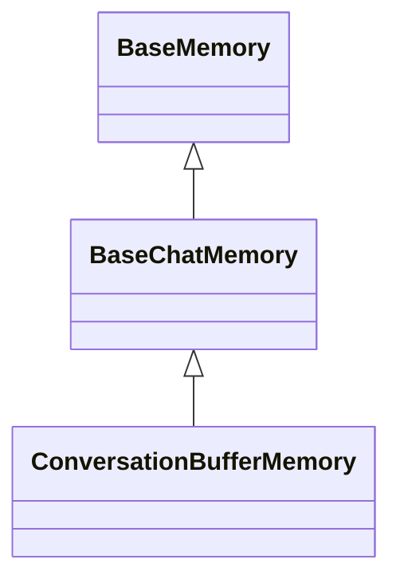
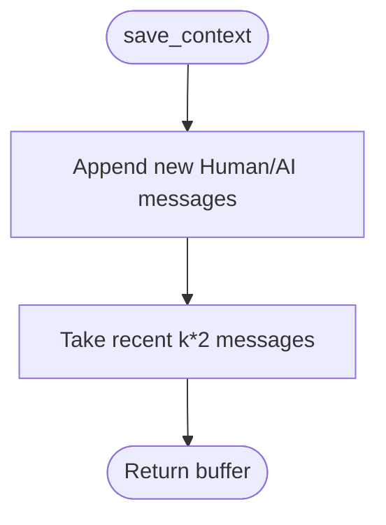
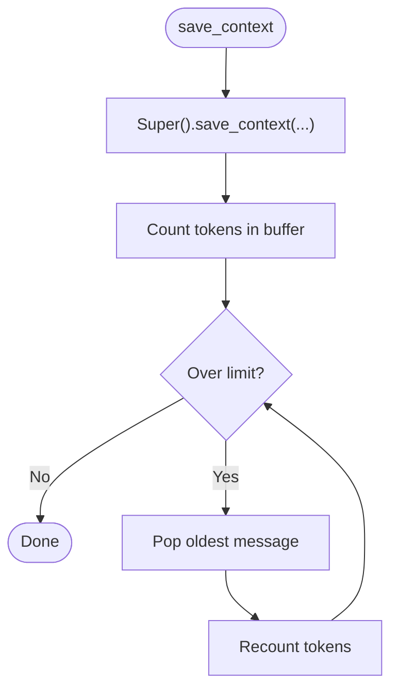
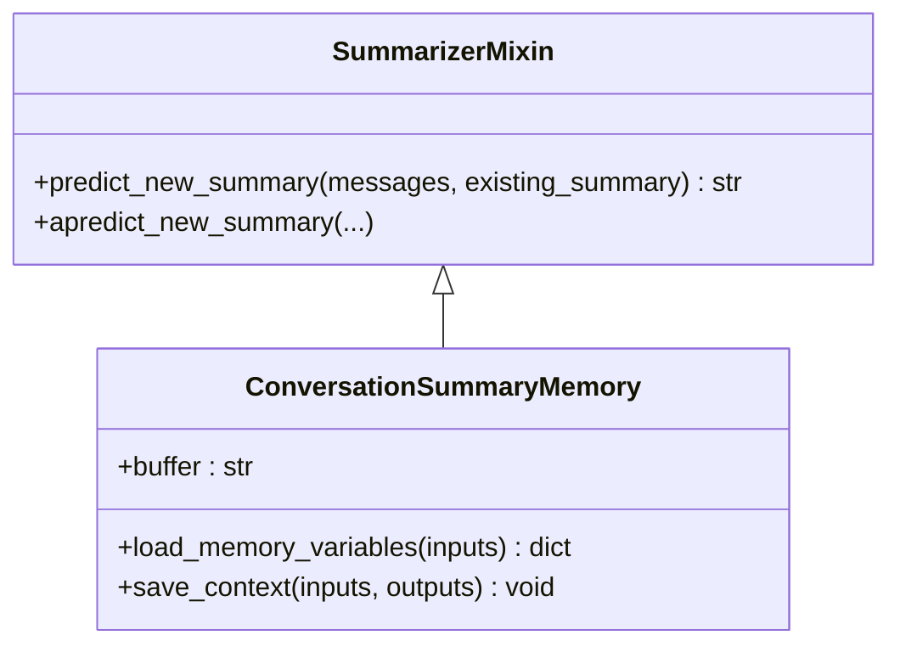
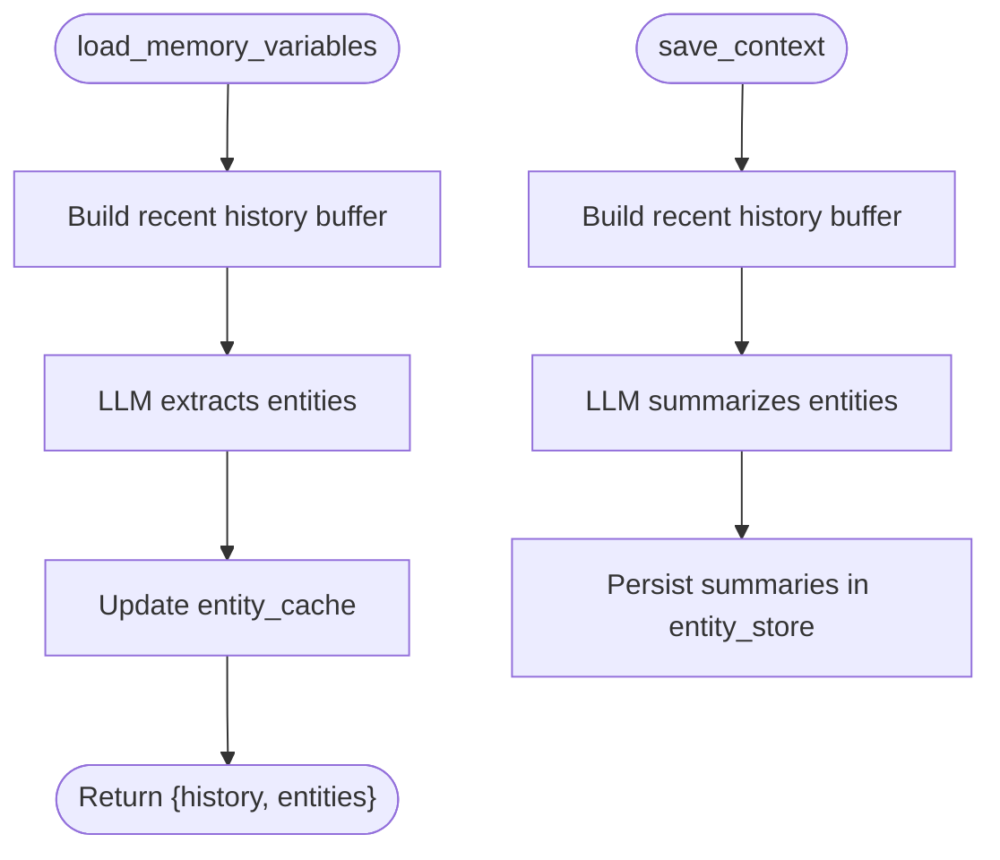
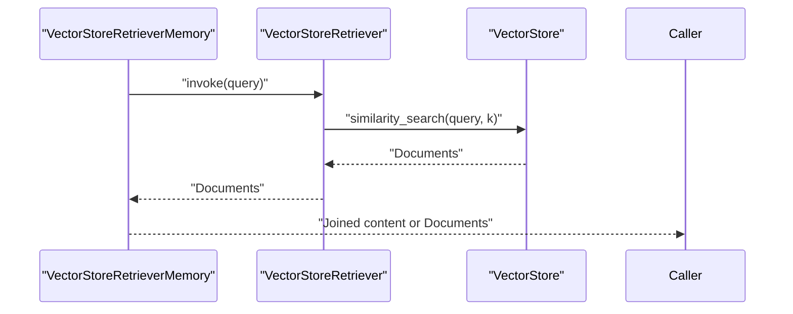
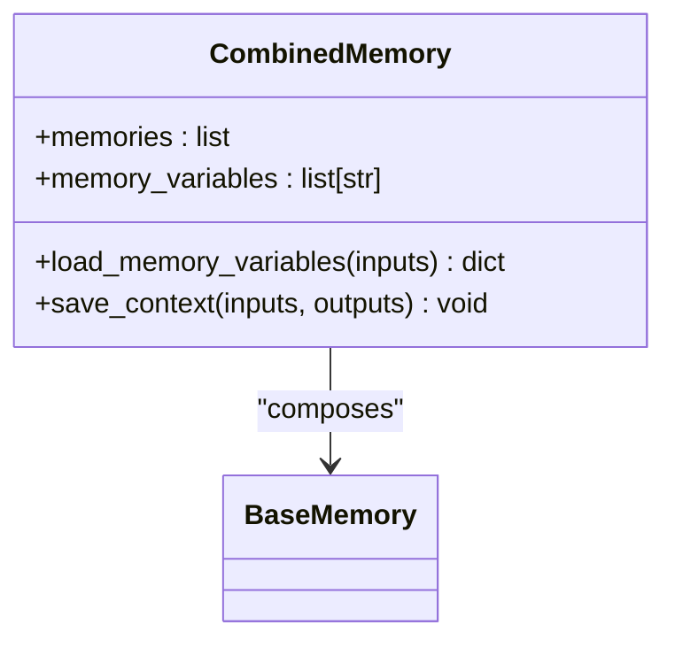
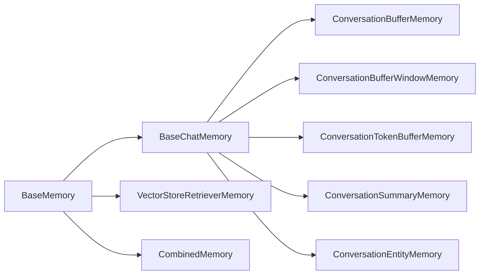

# Memory Systems

<cite>
**Referenced Files in This Document**
- [memory/__init__.py](file://libs/langchain/langchain_classic/memory/__init__.py)
- [memory/base_memory.py](file://libs/langchain/langchain_classic/base_memory.py)
- [memory/chat_memory.py](file://libs/langchain/langchain_classic/memory/chat_memory.py)
- [memory/buffer.py](file://libs/langchain/langchain_classic/memory/buffer.py)
- [memory/buffer_window.py](file://libs/langchain/langchain_classic/memory/buffer_window.py)
- [memory/token_buffer.py](file://libs/langchain/langchain_classic/memory/token_buffer.py)
- [memory/summary.py](file://libs/langchain/langchain_classic/memory/summary.py)
- [memory/entity.py](file://libs/langchain/langchain_classic/memory/entity.py)
- [memory/vectorstore.py](file://libs/langchain/langchain_classic/memory/vectorstore.py)
- [memory/combined.py](file://libs/langchain/langchain_classic/memory/combined.py)
- [memory/prompt.py](file://libs/langchain/langchain_classic/memory/prompt.py)
- [chains/conversation/memory.py](file://libs/langchain/langchain_classic/chains/conversation/memory.py)
</cite>

## Table of Contents
1. [Introduction](#introduction)
2. [Project Structure](#project-structure)
3. [Core Components](#core-components)
4. [Architecture Overview](#architecture-overview)
5. [Detailed Component Analysis](#detailed-component-analysis)
6. [Dependency Analysis](#dependency-analysis)
7. [Performance Considerations](#performance-considerations)
8. [Troubleshooting Guide](#troubleshooting-guide)
9. [Conclusion](#conclusion)
10. [Appendices](#appendices)

## Introduction
LangChain’s memory systems preserve conversational context across turns, enabling coherent and grounded responses. Memory is essential for:
- Context retention: Ensuring models have sufficient background to answer accurately.
- Scalability: Managing context size to fit within model token limits.
- Long-term understanding: Tracking entities and evolving summaries for persistent knowledge.
- Retrieval grounding: Leveraging vector-based retrieval to surface relevant past interactions.

This document explains the classic memory implementations, their configuration, persistence options, and integration with chains and agents. It also covers capacity planning, performance considerations, and debugging strategies.

## Project Structure
The memory subsystem is organized around a small set of core abstractions and several concrete memory types. The primary entry point exposes all memory classes and handles deprecations and dynamic imports.

**Diagram sources**
- [memory/__init__.py](file://libs/langchain/langchain_classic/memory/__init__.py#L1-L127)
- [memory/base_memory.py](file://libs/langchain/langchain_classic/base_memory.py#L27-L117)
- [memory/chat_memory.py](file://libs/langchain/langchain_classic/memory/chat_memory.py#L25-L105)
- [memory/buffer.py](file://libs/langchain/langchain_classic/memory/buffer.py#L21-L90)
- [memory/buffer_window.py](file://libs/langchain/langchain_classic/memory/buffer_window.py#L18-L60)
- [memory/token_buffer.py](file://libs/langchain/langchain_classic/memory/token_buffer.py#L19-L72)
- [memory/summary.py](file://libs/langchain/langchain_classic/memory/summary.py#L91-L169)
- [memory/entity.py](file://libs/langchain/langchain_classic/memory/entity.py#L465-L612)
- [memory/vectorstore.py](file://libs/langchain/langchain_classic/memory/vectorstore.py#L23-L123)
- [memory/combined.py](file://libs/langchain/langchain_classic/memory/combined.py#L10-L86)
- [chains/conversation/memory.py](file://libs/langchain/langchain_classic/chains/conversation/memory.py#L1-L46)

**Section sources**
- [memory/__init__.py](file://libs/langchain/langchain_classic/memory/__init__.py#L1-L127)
- [chains/conversation/memory.py](file://libs/langchain/langchain_classic/chains/conversation/memory.py#L1-L46)

## Core Components
- BaseMemory: Defines the contract for memory providers: memory_variables, load/save_context, and async variants. It also standardizes clearing memory.
- BaseChatMemory: Extends BaseMemory with chat-specific message handling via a chat history store, input/output key resolution, and convenience methods to add messages.

These abstractions enable consistent behavior across memory types and facilitate integration with chains and agents.

**Section sources**
- [memory/base_memory.py](file://libs/langchain/langchain_classic/base_memory.py#L27-L117)
- [memory/chat_memory.py](file://libs/langchain/langchain_classic/memory/chat_memory.py#L25-L105)

## Architecture Overview
Memory integrates with chains and agents by injecting variables into prompts and saving context after each run. The typical flow:
- Before inference: load_memory_variables returns memory-provided variables (e.g., history, entities, summary).
- During inference: the language model receives the augmented prompt with memory context.
- After inference: save_context persists the latest exchange into memory (and updates summaries/entities as needed).

**Diagram sources**
- [memory/base_memory.py](file://libs/langchain/langchain_classic/base_memory.py#L68-L108)
- [memory/chat_memory.py](file://libs/langchain/langchain_classic/memory/chat_memory.py#L74-L96)

## Detailed Component Analysis

### Buffer Memory (Recent Conversations)
- Purpose: Stores the entire conversation history (or a stringified version) without pruning.
- Key behaviors:
  - Exposes buffer as messages or string depending on return_messages.
  - Provides memory_variables and load_memory_variables to inject history.
  - Supports async variants for non-blocking operations.

**Diagram sources**
- [memory/base_memory.py](file://libs/langchain/langchain_classic/base_memory.py#L27-L117)
- [memory/chat_memory.py](file://libs/langchain/langchain_classic/memory/chat_memory.py#L25-L105)
- [memory/buffer.py](file://libs/langchain/langchain_classic/memory/buffer.py#L21-L90)

**Section sources**
- [memory/buffer.py](file://libs/langchain/langchain_classic/memory/buffer.py#L21-L90)

### Window Buffer Memory (Recent K Turns)
- Purpose: Keeps only the most recent k message pairs, dropping older entries.
- Key behaviors:
  - Uses chat_memory.messages slice [-k*2:] to constrain context.
  - Exposes buffer as messages or string.

**Diagram sources**
- [memory/buffer_window.py](file://libs/langchain/langchain_classic/memory/buffer_window.py#L18-L60)

**Section sources**
- [memory/buffer_window.py](file://libs/langchain/langchain_classic/memory/buffer_window.py#L18-L60)

### Token Buffer Memory (Token-Constrained)
- Purpose: Maintains a conversation buffer under a maximum token budget.
- Key behaviors:
  - On save_context, prunes the oldest messages until token usage is within limit.
  - Uses the language model’s token counting to enforce the cap.

**Diagram sources**
- [memory/token_buffer.py](file://libs/langchain/langchain_classic/memory/token_buffer.py#L61-L72)

**Section sources**
- [memory/token_buffer.py](file://libs/langchain/langchain_classic/memory/token_buffer.py#L19-L72)

### Summary Memory (Long-Term Context)
- Purpose: Continually summarizes conversation history and returns a compact summary.
- Key behaviors:
  - Uses a summarizer mixin to produce a new summary incrementally.
  - Returns either a system message containing the summary or the plain text summary.
  - Validates prompt input variables for the summarization template.

**Diagram sources**
- [memory/summary.py](file://libs/langchain/langchain_classic/memory/summary.py#L27-L81)
- [memory/summary.py](file://libs/langchain/langchain_classic/memory/summary.py#L91-L169)

**Section sources**
- [memory/summary.py](file://libs/langchain/langchain_classic/memory/summary.py#L91-L169)
- [memory/prompt.py](file://libs/langchain/langchain_classic/memory/prompt.py#L25-L48)

### Entity Memory (Key Information Tracking)
- Purpose: Extracts named entities from recent turns and maintains evolving summaries per entity.
- Key behaviors:
  - Extracts entities from recent history using a dedicated prompt.
  - Summarizes entities using another prompt and stores them in an entity store.
  - Supports multiple entity stores: in-memory, Redis (via Upstash or standard), and SQLite.
  - Updates entity_cache on load and persists summaries on save_context.

**Diagram sources**
- [memory/entity.py](file://libs/langchain/langchain_classic/memory/entity.py#L502-L565)
- [memory/entity.py](file://libs/langchain/langchain_classic/memory/entity.py#L567-L606)
- [memory/prompt.py](file://libs/langchain/langchain_classic/memory/prompt.py#L50-L109)

**Section sources**
- [memory/entity.py](file://libs/langchain/langchain_classic/memory/entity.py#L465-L612)
- [memory/prompt.py](file://libs/langchain/langchain_classic/memory/prompt.py#L50-L109)

### Vector Store Memory (Embedding-Based Retrieval)
- Purpose: Embeds conversation turns into a vector store and retrieves relevant segments based on the current input.
- Key behaviors:
  - Converts inputs/outputs into documents and adds them to a retriever.
  - On load, queries the retriever with the current input and returns either joined content or raw documents.
  - Supports excluding specific input keys from document content.

**Diagram sources**
- [memory/vectorstore.py](file://libs/langchain/langchain_classic/memory/vectorstore.py#L67-L85)

**Section sources**
- [memory/vectorstore.py](file://libs/langchain/langchain_classic/memory/vectorstore.py#L23-L123)

### Combined Memory (Multi-Faceted Memory)
- Purpose: Aggregates multiple memory instances into one cohesive provider.
- Key behaviors:
  - Validates uniqueness of memory variables across sub-memories.
  - Delegates load_memory_variables and save_context to each sub-memory.
  - Emits a unified set of memory variables.

**Diagram sources**
- [memory/combined.py](file://libs/langchain/langchain_classic/memory/combined.py#L10-L86)

**Section sources**
- [memory/combined.py](file://libs/langchain/langchain_classic/memory/combined.py#L10-L86)

## Dependency Analysis
- Abstractions:
  - BaseMemory defines the core interface.
  - BaseChatMemory extends BaseMemory and depends on a chat history store.
- Concrete implementations:
  - Buffer/window/token summary/entity/vectorstore derive from BaseChatMemory or BaseMemory.
  - CombinedMemory composes multiple BaseMemory instances.
- Prompts:
  - Entity and summary memories rely on prompt templates for extraction and summarization.

**Diagram sources**
- [memory/base_memory.py](file://libs/langchain/langchain_classic/base_memory.py#L27-L117)
- [memory/chat_memory.py](file://libs/langchain/langchain_classic/memory/chat_memory.py#L25-L105)
- [memory/buffer.py](file://libs/langchain/langchain_classic/memory/buffer.py#L21-L90)
- [memory/buffer_window.py](file://libs/langchain/langchain_classic/memory/buffer_window.py#L18-L60)
- [memory/token_buffer.py](file://libs/langchain/langchain_classic/memory/token_buffer.py#L19-L72)
- [memory/summary.py](file://libs/langchain/langchain_classic/memory/summary.py#L91-L169)
- [memory/entity.py](file://libs/langchain/langchain_classic/memory/entity.py#L465-L612)
- [memory/vectorstore.py](file://libs/langchain/langchain_classic/memory/vectorstore.py#L23-L123)
- [memory/combined.py](file://libs/langchain/langchain_classic/memory/combined.py#L10-L86)

**Section sources**
- [memory/__init__.py](file://libs/langchain/langchain_classic/memory/__init__.py#L6-L27)
- [chains/conversation/memory.py](file://libs/langchain/langchain_classic/chains/conversation/memory.py#L6-L14)

## Performance Considerations
- Token limits:
  - Use ConversationTokenBufferMemory to cap context size and prune old messages proactively.
- Retrieval overhead:
  - VectorStoreRetrieverMemory introduces embedding and similarity search costs; tune k and filters to balance relevance and latency.
- Entity storage:
  - Redis and SQLite entity stores add network/local disk IO; monitor latency and throughput.
- Prompt sizes:
  - Summary and entity extraction prompts increase token usage; keep prompts concise and aligned with model capabilities.
- Async operations:
  - Prefer async save/load methods to avoid blocking during I/O-bound operations.

[No sources needed since this section provides general guidance]

## Troubleshooting Guide
Common issues and remedies:
- Unexpected prompt variables in summary:
  - Ensure the summarization prompt has the expected input variables; validation enforces correct keys.
- Multiple output keys in chat memory:
  - Explicitly set output_key to disambiguate which output to store.
- Redis connectivity failures:
  - Verify credentials and network; logs capture connection errors.
- SQLite safety:
  - Table/session identifiers are validated to prevent unsafe SQL; confirm identifiers meet expectations.
- CombinedMemory variable conflicts:
  - Ensure each sub-memory exposes unique memory variables; duplicates cause validation errors.

**Section sources**
- [memory/summary.py](file://libs/langchain/langchain_classic/memory/summary.py#L144-L155)
- [memory/chat_memory.py](file://libs/langchain/langchain_classic/memory/chat_memory.py#L57-L69)
- [memory/entity.py](file://libs/langchain/langchain_classic/memory/entity.py#L134-L150)
- [memory/entity.py](file://libs/langchain/langchain_classic/memory/entity.py#L381-L385)
- [memory/combined.py](file://libs/langchain/langchain_classic/memory/combined.py#L16-L33)

## Conclusion
LangChain’s memory system offers flexible, composable strategies for preserving context:
- Buffer/window memories for recent context.
- Token-buffer memory to respect model limits.
- Summary memory for long-term, compact context.
- Entity memory for persistent knowledge about people/places/concepts.
- Vector store memory for retrieval-grounded context.
- Combined memory to orchestrate multiple strategies.

Choose the right memory type(s) for your workload, configure limits thoughtfully, and monitor performance to maintain coherent, efficient conversations.

[No sources needed since this section summarizes without analyzing specific files]

## Appendices

### Practical Examples (Implementation Guidance)
- Implementing custom memory:
  - Subclass BaseMemory or BaseChatMemory and implement memory_variables, load_memory_variables, save_context, and clear.
  - Reference the minimal example pattern in BaseMemory documentation comments.
- Configuring memory limits:
  - Set k for window buffer and max_token_limit for token buffer.
  - Adjust retriever top-k and filters for vector store memory.
- Optimizing memory usage:
  - Prefer token-buffer or window memory for long sessions.
  - Use entity memory to reduce repetition by referencing stable facts.
  - Use vector store memory for large corpora where relevance matters more than exact recency.

**Section sources**
- [memory/base_memory.py](file://libs/langchain/langchain_classic/base_memory.py#L37-L56)
- [memory/buffer_window.py](file://libs/langchain/langchain_classic/memory/buffer_window.py#L28-L29)
- [memory/token_buffer.py](file://libs/langchain/langchain_classic/memory/token_buffer.py#L30-L31)
- [memory/vectorstore.py](file://libs/langchain/langchain_classic/memory/vectorstore.py#L42-L43)