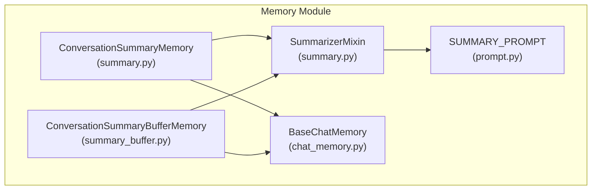
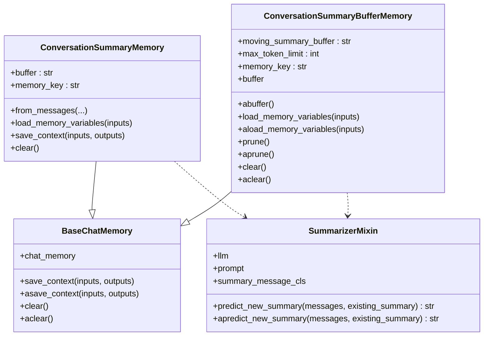
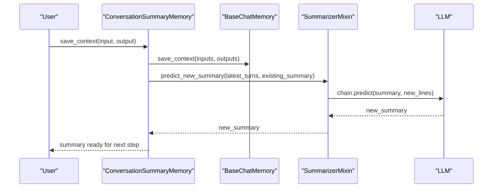
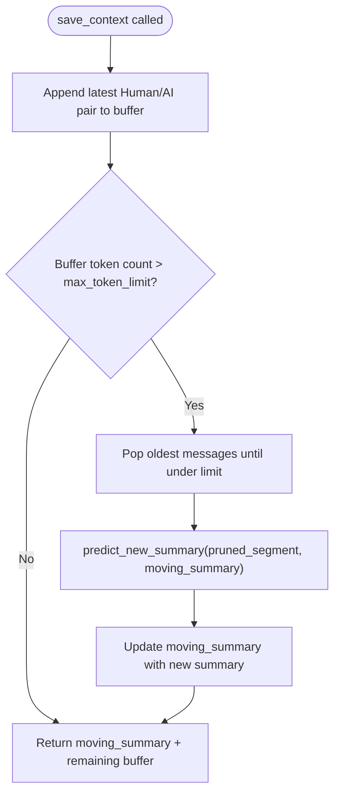
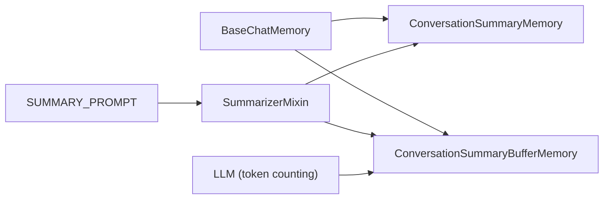

# Summary Memory

<cite>
**Referenced Files in This Document**
- [summary.py](file://libs/langchain/langchain_classic/memory/summary.py)
- [summary_buffer.py](file://libs/langchain/langchain_classic/memory/summary_buffer.py)
- [prompt.py](file://libs/langchain/langchain_classic/memory/prompt.py)
- [chat_memory.py](file://libs/langchain/langchain_classic/memory/chat_memory.py)
- [__init__.py](file://libs/langchain/langchain_classic/memory/__init__.py)
- [test_summary_buffer_memory.py](file://libs/langchain/tests/unit_tests/chains/test_summary_buffer_memory.py)
</cite>

## Table of Contents
1. [Introduction](#introduction)
2. [Project Structure](#project-structure)
3. [Core Components](#core-components)
4. [Architecture Overview](#architecture-overview)
5. [Detailed Component Analysis](#detailed-component-analysis)
6. [Dependency Analysis](#dependency-analysis)
7. [Performance Considerations](#performance-considerations)
8. [Troubleshooting Guide](#troubleshooting-guide)
9. [Conclusion](#conclusion)
10. [Appendices](#appendices)

## Introduction
This document explains LangChain’s classic summary memory implementations that maintain long-term conversational context by periodically summarizing conversation history. It covers the two primary classes:
- ConversationSummaryMemory: updates a running summary after each turn.
- ConversationSummaryBufferMemory: maintains a recent buffer plus a moving summary, pruning old turns when token limits are exceeded.

The focus is on how summarization is triggered, how the summary is updated, configuration options, initialization, and practical usage patterns. Guidance is also included on balancing summary quality versus computational cost and addressing common issues such as summary drift and context loss.

## Project Structure
The summary memory implementations live in the classic LangChain memory module and rely on shared prompt templates and chat-memory abstractions.

**Diagram sources**
- [summary.py](file://libs/langchain/langchain_classic/memory/summary.py#L27-L81)
- [summary_buffer.py](file://libs/langchain/langchain_classic/memory/summary_buffer.py#L20-L96)
- [prompt.py](file://libs/langchain/langchain_classic/memory/prompt.py#L25-L48)
- [chat_memory.py](file://libs/langchain/langchain_classic/memory/chat_memory.py#L25-L105)

**Section sources**
- [summary.py](file://libs/langchain/langchain_classic/memory/summary.py#L1-L169)
- [summary_buffer.py](file://libs/langchain/langchain_classic/memory/summary_buffer.py#L1-L149)
- [prompt.py](file://libs/langchain/langchain_classic/memory/prompt.py#L1-L165)
- [chat_memory.py](file://libs/langchain/langchain_classic/memory/chat_memory.py#L1-L105)
- [__init__.py](file://libs/langchain/langchain_classic/memory/__init__.py#L1-L127)

## Core Components
- ConversationSummaryMemory
  - Maintains a single summary string updated after each turn.
  - Uses a summarizer mixin and a fixed prompt template for progressive summarization.
  - Exposes a memory variable keyed by a configurable key.
- ConversationSummaryBufferMemory
  - Maintains a recent buffer of messages and a moving summary.
  - Prunes older messages when the token count exceeds a configured limit, then summarizes the pruned segment and appends it to the moving summary.
  - Supports both string and message-based outputs via a flag.
- SummarizerMixin
  - Encapsulates the summarization logic using an LLM chain and the standard summary prompt.
  - Provides synchronous and asynchronous prediction methods.
- BaseChatMemory
  - Provides the underlying chat history store and context saving/loading utilities.
- SUMMARY_PROMPT
  - Defines the prompt template used to progressively update the summary.

Key configuration options:
- ConversationSummaryMemory
  - llm: language model used for summarization.
  - prompt: prompt template for summarization (must accept “summary” and “new_lines”).
  - summary_message_cls: message class used to wrap the summary in memory outputs.
  - memory_key: output key for the memory variable.
- ConversationSummaryBufferMemory
  - llm: language model used for summarization.
  - prompt: prompt template for summarization (must accept “summary” and “new_lines”).
  - max_token_limit: token budget for the buffer before pruning and summarization.
  - memory_key: output key for the memory variable.
  - return_messages: whether to return messages instead of a string.

**Section sources**
- [summary.py](file://libs/langchain/langchain_classic/memory/summary.py#L91-L169)
- [summary_buffer.py](file://libs/langchain/langchain_classic/memory/summary_buffer.py#L20-L149)
- [prompt.py](file://libs/langchain/langchain_classic/memory/prompt.py#L25-L48)
- [chat_memory.py](file://libs/langchain/langchain_classic/memory/chat_memory.py#L25-L105)

## Architecture Overview
The summary memory classes inherit from BaseChatMemory and use a SummarizerMixin to integrate with an LLM chain and a standardized prompt. They manage a chat history store and decide when to trigger summarization based on usage patterns.

**Diagram sources**
- [chat_memory.py](file://libs/langchain/langchain_classic/memory/chat_memory.py#L25-L105)
- [summary.py](file://libs/langchain/langchain_classic/memory/summary.py#L27-L81)
- [summary_buffer.py](file://libs/langchain/langchain_classic/memory/summary_buffer.py#L20-L96)

## Detailed Component Analysis

### ConversationSummaryMemory
- Purpose: Maintain a single, continuously updated summary of the conversation.
- Triggers:
  - After each call to save_context, the latest two turns are summarized together with the existing summary to produce a new summary.
- Update mechanism:
  - Uses predict_new_summary with the current summary and the newly added lines.
  - The summary is returned either as a System message (when return_messages is enabled) or as a plain string.
- Initialization:
  - Can be constructed directly with an LLM and optional prompt/memory key.
  - Can be initialized from existing chat history using from_messages, which summarizes chunks of messages at a configurable step.
- Configuration:
  - llm, prompt, summary_message_cls, memory_key.
- Typical usage pattern:
  - Save context for each turn; on subsequent steps, load_memory_variables returns the latest summary.

**Diagram sources**
- [summary.py](file://libs/langchain/langchain_classic/memory/summary.py#L157-L163)
- [chat_memory.py](file://libs/langchain/langchain_classic/memory/chat_memory.py#L74-L82)
- [prompt.py](file://libs/langchain/langchain_classic/memory/prompt.py#L25-L48)

**Section sources**
- [summary.py](file://libs/langchain/langchain_classic/memory/summary.py#L91-L169)

### ConversationSummaryBufferMemory
- Purpose: Combine a recent message buffer with a moving summary to cap token usage.
- Triggers:
  - After each save_context, prune is invoked to enforce max_token_limit.
  - Pruning removes the oldest messages until the buffer fits within the limit, then summarizes the pruned segment and appends it to the moving summary.
- Update mechanism:
  - prune computes current token usage and pops messages until under budget, then calls predict_new_summary on the pruned segment and merges it into the moving summary.
  - load_memory_variables prepends the moving summary as a special message to the current buffer.
- Configuration:
  - llm, prompt, max_token_limit, memory_key, return_messages.
- Typical usage pattern:
  - Save context; when the buffer grows beyond max_token_limit, the oldest segments are summarized and moved into the moving summary, keeping the recent buffer manageable.

**Diagram sources**
- [summary_buffer.py](file://libs/langchain/langchain_classic/memory/summary_buffer.py#L112-L124)
- [prompt.py](file://libs/langchain/langchain_classic/memory/prompt.py#L25-L48)

**Section sources**
- [summary_buffer.py](file://libs/langchain/langchain_classic/memory/summary_buffer.py#L20-L149)

### SummarizerMixin
- Provides the core summarization logic using a standardized prompt and an LLM chain.
- Methods:
  - predict_new_summary: synchronously summarizes new lines against an existing summary.
  - apredict_new_summary: asynchronously performs the same operation.
- Validation:
  - Validates that the provided prompt accepts exactly “summary” and “new_lines”.

**Section sources**
- [summary.py](file://libs/langchain/langchain_classic/memory/summary.py#L27-L81)
- [prompt.py](file://libs/langchain/langchain_classic/memory/prompt.py#L25-L48)

### BaseChatMemory
- Provides the chat history store and context persistence.
- Handles saving and loading contexts, and supports async variants.
- Enables return_messages mode to output message objects instead of strings.

**Section sources**
- [chat_memory.py](file://libs/langchain/langchain_classic/memory/chat_memory.py#L25-L105)

### SUMMARY_PROMPT
- Progressive summarization prompt that takes the current summary and new lines of conversation and produces an updated summary.
- Ensures consistent input variable names for the summarizer.

**Section sources**
- [prompt.py](file://libs/langchain/langchain_classic/memory/prompt.py#L25-L48)

## Dependency Analysis
- ConversationSummaryMemory depends on:
  - BaseChatMemory for message storage and context handling.
  - SummarizerMixin for summarization logic.
  - SUMMARY_PROMPT for the prompt template.
- ConversationSummaryBufferMemory depends on:
  - BaseChatMemory for message storage.
  - SummarizerMixin for summarization logic.
  - SUMMARY_PROMPT for the prompt template.
  - LLM token counting to enforce max_token_limit during pruning.

**Diagram sources**
- [summary.py](file://libs/langchain/langchain_classic/memory/summary.py#L91-L169)
- [summary_buffer.py](file://libs/langchain/langchain_classic/memory/summary_buffer.py#L20-L149)
- [prompt.py](file://libs/langchain/langchain_classic/memory/prompt.py#L25-L48)
- [chat_memory.py](file://libs/langchain/langchain_classic/memory/chat_memory.py#L25-L105)

**Section sources**
- [summary.py](file://libs/langchain/langchain_classic/memory/summary.py#L1-L169)
- [summary_buffer.py](file://libs/langchain/langchain_classic/memory/summary_buffer.py#L1-L149)
- [prompt.py](file://libs/langchain/langchain_classic/memory/prompt.py#L1-L165)
- [chat_memory.py](file://libs/langchain/langchain_classic/memory/chat_memory.py#L1-L105)

## Performance Considerations
- Computational cost:
  - Each summarization call invokes an LLM chain; frequency and length of summaries directly impact latency and cost.
  - ConversationSummaryMemory summarizes after every turn; ConversationSummaryBufferMemory summarizes only when pruning occurs.
- Token budget:
  - ConversationSummaryBufferMemory uses max_token_limit to bound memory growth; lowering this value increases summarization frequency but reduces per-summary length.
- Model selection:
  - Using a smaller or faster model for summarization can reduce cost and latency at the expense of summary quality.
- Prompt efficiency:
  - Keeping the prompt concise and focused helps reduce token usage and speed up summarization.

[No sources needed since this section provides general guidance]

## Troubleshooting Guide
- Unexpected prompt input variables:
  - The summarizer validates that the prompt accepts exactly “summary” and “new_lines”. If mismatched, a ValueError is raised during initialization.
- Empty or missing memory:
  - When no messages are present, load_memory_variables returns an empty string or an empty message list depending on configuration.
- Asynchronous usage:
  - ConversationSummaryBufferMemory provides async counterparts for pruning and memory access; ensure you use the async APIs consistently if your application is async-native.
- Testing patterns:
  - Unit tests demonstrate expected behavior for empty buffers, buffer-only outputs, and summary-appended outputs after exceeding token limits.

**Section sources**
- [summary.py](file://libs/langchain/langchain_classic/memory/summary.py#L144-L155)
- [summary_buffer.py](file://libs/langchain/langchain_classic/memory/summary_buffer.py#L85-L96)
- [test_summary_buffer_memory.py](file://libs/langchain/tests/unit_tests/chains/test_summary_buffer_memory.py#L1-L67)

## Conclusion
LangChain’s classic summary memory implementations offer two complementary strategies for maintaining long-term context:
- ConversationSummaryMemory for continuous summarization after each turn.
- ConversationSummaryBufferMemory for bounded memory with periodic summarization during pruning.

Both rely on a standardized prompt and an LLM chain to progressively refine the summary. Proper configuration of prompts, token budgets, and model choice enables balancing quality and cost. Tests confirm expected behavior for initialization, buffering, and summary integration.

[No sources needed since this section summarizes without analyzing specific files]

## Appendices

### Practical Examples and Workflows
- Long conversations with continuous summarization:
  - Initialize ConversationSummaryMemory with an LLM and a suitable prompt.
  - On each turn, call save_context; retrieve the latest summary via load_memory_variables.
- Configuring summarization intervals:
  - ConversationSummaryMemory summarizes after every turn; adjust frequency by controlling how often save_context is called.
  - ConversationSummaryBufferMemory summarizes during pruning; tune max_token_limit to control summarization cadence.
- Optimizing summary quality:
  - Use a higher-quality model for summarization.
  - Refine SUMMARY_PROMPT to emphasize key facts or tone.
  - Consider increasing max_token_limit to allow longer recent buffers before summarization.

[No sources needed since this section provides general guidance]