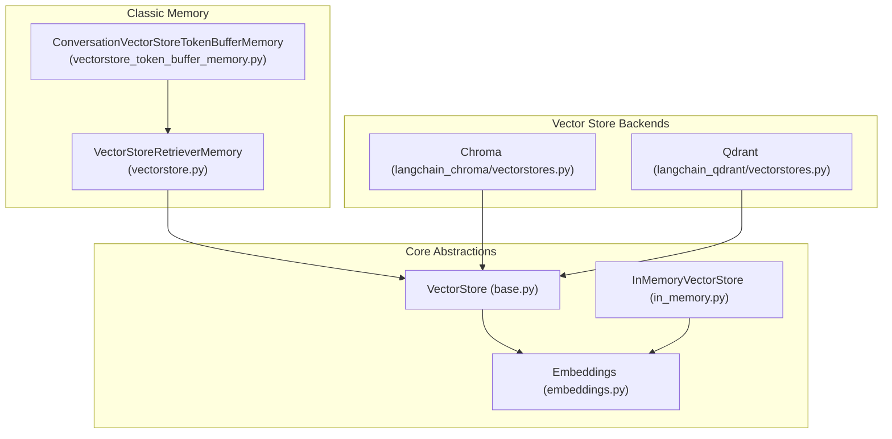
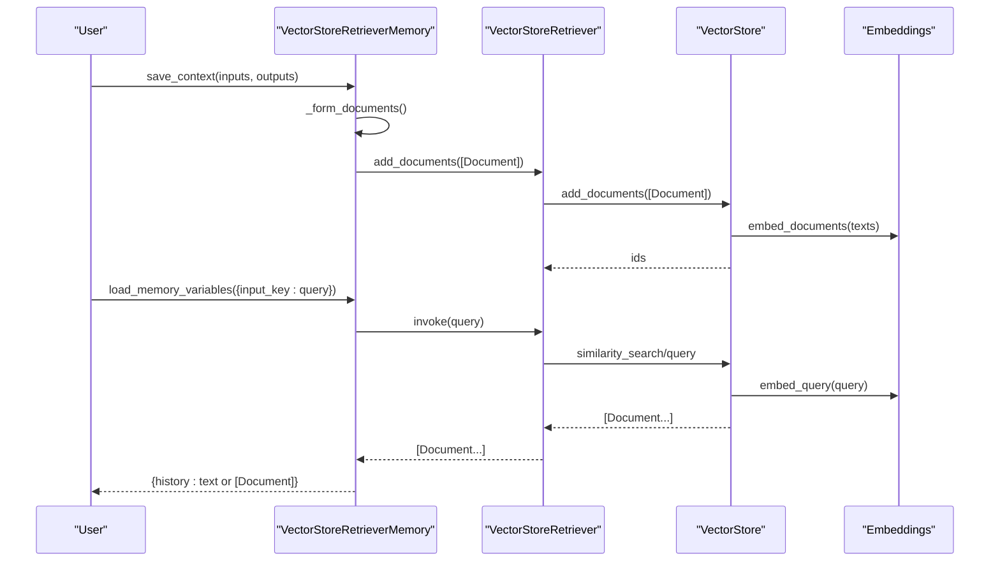
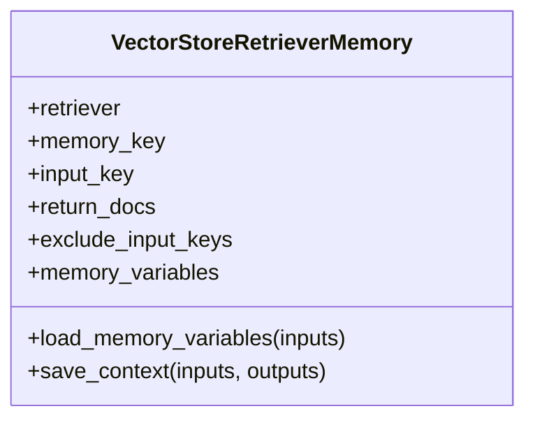
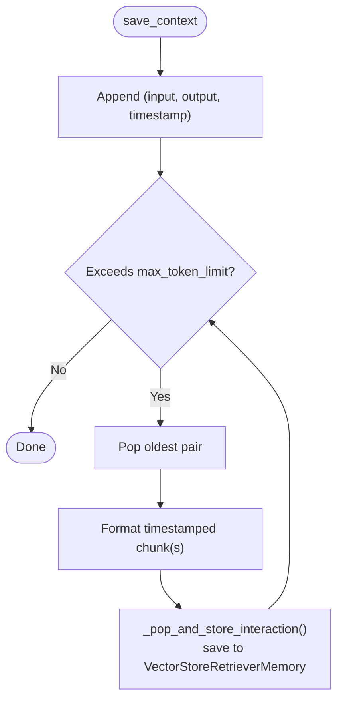
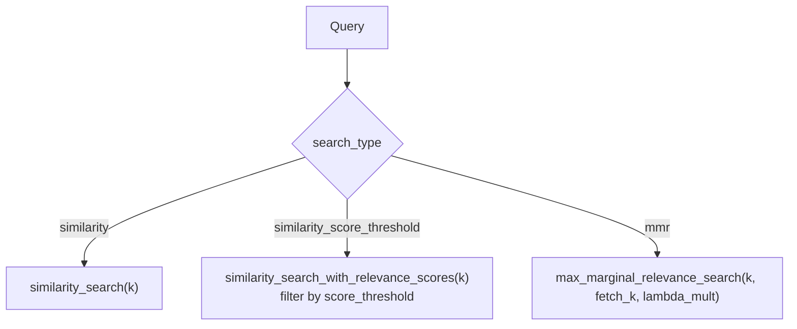
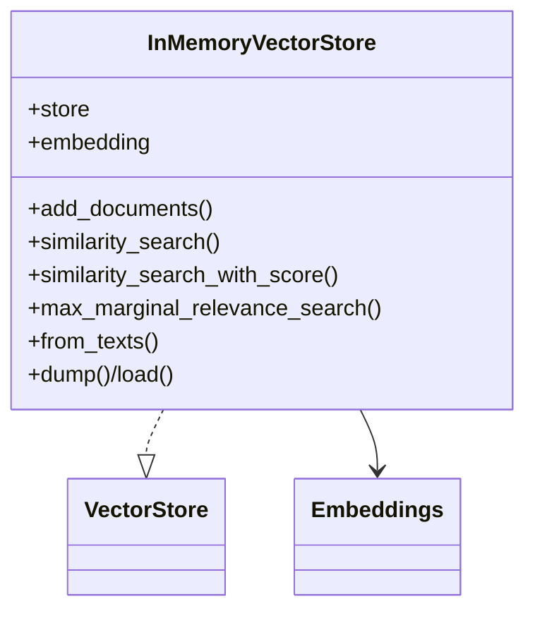

# Vector Store Memory

<cite>
**Referenced Files in This Document**
- [vectorstore.py](file://libs/langchain/langchain_classic/memory/vectorstore.py)
- [vectorstore_token_buffer_memory.py](file://libs/langchain/langchain_classic/memory/vectorstore_token_buffer_memory.py)
- [base.py](file://libs/core/langchain_core/vectorstores/base.py)
- [in_memory.py](file://libs/core/langchain_core/vectorstores/in_memory.py)
- [embeddings.py](file://libs/core/langchain_core/embeddings/embeddings.py)
- [vectorstores.py](file://libs/partners/chroma/langchain_chroma/vectorstores.py)
- [vectorstores.py](file://libs/partners/qdrant/langchain_qdrant/vectorstores.py)
- [test_search.py](file://libs/partners/qdrant/tests/integration_tests/qdrant_vector_store/test_search.py)
- [test_mmr.py](file://libs/partners/qdrant/tests/integration_tests/qdrant_vector_store/test_mmr.py)
</cite>

## Table of Contents
1. [Introduction](#introduction)
2. [Project Structure](#project-structure)
3. [Core Components](#core-components)
4. [Architecture Overview](#architecture-overview)
5. [Detailed Component Analysis](#detailed-component-analysis)
6. [Dependency Analysis](#dependency-analysis)
7. [Performance Considerations](#performance-considerations)
8. [Troubleshooting Guide](#troubleshooting-guide)
9. [Conclusion](#conclusion)
10. [Appendices](#appendices)

## Introduction
Vector store memory enables large-scale, semantically relevant retrieval of prior conversation context by storing textual turns as embedded vectors and retrieving the most similar segments during inference. This approach scales beyond fixed-length buffers and traditional keyword-based memory by leveraging embeddings and similarity search across extensive histories.

LangChain’s vector store memory integrates with:
- Embedding models via the Embeddings interface
- Vector stores via the VectorStore base class
- Retrievers to encapsulate search strategies (e.g., similarity, similarity with score threshold, maximal marginal relevance)

This document explains how vector store memory works, how to configure it with different backends and similarity parameters, and how to optimize retrieval performance. It also contrasts vector-based retrieval with simpler memory types and provides troubleshooting guidance.

## Project Structure
This documentation focuses on the classic LangChain memory implementations and core abstractions that underpin vector store memory.

**Diagram sources**
- [vectorstore.py](file://libs/langchain/langchain_classic/memory/vectorstore.py#L23-L123)
- [vectorstore_token_buffer_memory.py](file://libs/langchain/langchain_classic/memory/vectorstore_token_buffer_memory.py#L37-L184)
- [base.py](file://libs/core/langchain_core/vectorstores/base.py#L43-L800)
- [in_memory.py](file://libs/core/langchain_core/vectorstores/in_memory.py#L34-L547)
- [embeddings.py](file://libs/core/langchain_core/embeddings/embeddings.py#L8-L79)
- [vectorstores.py](file://libs/partners/chroma/langchain_chroma/vectorstores.py)
- [vectorstores.py](file://libs/partners/qdrant/langchain_qdrant/vectorstores.py)

**Section sources**
- [vectorstore.py](file://libs/langchain/langchain_classic/memory/vectorstore.py#L1-L123)
- [vectorstore_token_buffer_memory.py](file://libs/langchain/langchain_classic/memory/vectorstore_token_buffer_memory.py#L1-L184)
- [base.py](file://libs/core/langchain_core/vectorstores/base.py#L1-L800)
- [in_memory.py](file://libs/core/langchain_core/vectorstores/in_memory.py#L1-L547)
- [embeddings.py](file://libs/core/langchain_core/embeddings/embeddings.py#L1-L79)

## Core Components
- VectorStoreRetrieverMemory: A memory backed by a VectorStoreRetriever. It saves per-turn context as Documents and retrieves relevant segments using similarity search.
- ConversationVectorStoreTokenBufferMemory: A hybrid memory combining a token-buffer for recent turns and a vector store for older turns. It timestamps interactions and augments prompts with retrieved context.
- VectorStore base: Defines the interface for adding documents, performing similarity search, and MMR retrieval. Provides convenience methods for different search types and relevance scoring.
- Embeddings interface: Defines synchronous and asynchronous embedding APIs for queries and documents.
- InMemoryVectorStore: A reference implementation of VectorStore using cosine similarity and optional MMR.

Key capabilities:
- Embedding generation for new turns
- Similarity search with configurable parameters (k, score_threshold)
- Maximal marginal relevance (MMR) for diverse retrieval
- Asynchronous operations for improved throughput

**Section sources**
- [vectorstore.py](file://libs/langchain/langchain_classic/memory/vectorstore.py#L23-L123)
- [vectorstore_token_buffer_memory.py](file://libs/langchain/langchain_classic/memory/vectorstore_token_buffer_memory.py#L37-L184)
- [base.py](file://libs/core/langchain_core/vectorstores/base.py#L293-L784)
- [embeddings.py](file://libs/core/langchain_core/embeddings/embeddings.py#L8-L79)
- [in_memory.py](file://libs/core/langchain_core/vectorstores/in_memory.py#L34-L547)

## Architecture Overview
Vector store memory follows a pipeline:
- Save context: Turn inputs and outputs are formatted into a Document and added to the vector store via the retriever.
- Load memory: The incoming query is used to retrieve relevant Documents from the vector store.
- Prompt augmentation: Retrieved Documents are either joined as text or returned as Documents, optionally timestamped and templated in the token-buffer variant.

**Diagram sources**
- [vectorstore.py](file://libs/langchain/langchain_classic/memory/vectorstore.py#L67-L107)
- [base.py](file://libs/core/langchain_core/vectorstores/base.py#L293-L358)

## Detailed Component Analysis

### VectorStoreRetrieverMemory
- Purpose: Stores conversation turns as Documents in a vector store and retrieves relevant context for the current query.
- Key behaviors:
  - save_context/asave_context: Formats inputs and outputs into a single Document and adds it to the retriever.
  - load_memory_variables/aload_memory_variables: Embeds the query via the retriever and returns concatenated text or raw Documents.
  - Configuration: memory_key, input_key, return_docs, exclude_input_keys.

**Diagram sources**
- [vectorstore.py](file://libs/langchain/langchain_classic/memory/vectorstore.py#L23-L123)

**Section sources**
- [vectorstore.py](file://libs/langchain/langchain_classic/memory/vectorstore.py#L23-L123)

### ConversationVectorStoreTokenBufferMemory
- Purpose: Maintains a recent conversation buffer up to a token limit; older turns are stored in a vector store and retrieved as needed.
- Key behaviors:
  - save_context: Appends timestamped turns to the buffer and prunes when exceeding max_token_limit.
  - save_remainder: Flushes remaining buffer to the vector store.
  - load_memory_variables: Retrieves previous history from the vector store and combines it with recent messages in a templated prompt.
  - Chunking: Long AI outputs are split into chunks to avoid oversized documents.

**Diagram sources**
- [vectorstore_token_buffer_memory.py](file://libs/langchain/langchain_classic/memory/vectorstore_token_buffer_memory.py#L145-L184)

**Section sources**
- [vectorstore_token_buffer_memory.py](file://libs/langchain/langchain_classic/memory/vectorstore_token_buffer_memory.py#L37-L184)

### VectorStore Base and Similarity Search
- VectorStore defines:
  - add_texts/add_documents and async variants
  - similarity_search, similarity_search_with_score, similarity_search_with_relevance_scores
  - max_marginal_relevance_search and async variants
  - search/asearch dispatching to specific strategies
- Supported search types:
  - similarity
  - similarity_score_threshold (with optional score_threshold)
  - mmr (with k, fetch_k, lambda_mult)

**Diagram sources**
- [base.py](file://libs/core/langchain_core/vectorstores/base.py#L293-L358)
- [base.py](file://libs/core/langchain_core/vectorstores/base.py#L506-L604)
- [base.py](file://libs/core/langchain_core/vectorstores/base.py#L659-L722)

**Section sources**
- [base.py](file://libs/core/langchain_core/vectorstores/base.py#L293-L784)

### InMemoryVectorStore
- Implements VectorStore with:
  - Embedding integration via Embeddings
  - Cosine similarity for retrieval
  - Optional MMR via maximal_marginal_relevance
  - Filtering support in similarity search
  - Persistence helpers (dump/load)

**Diagram sources**
- [in_memory.py](file://libs/core/langchain_core/vectorstores/in_memory.py#L34-L547)
- [embeddings.py](file://libs/core/langchain_core/embeddings/embeddings.py#L8-L79)

**Section sources**
- [in_memory.py](file://libs/core/langchain_core/vectorstores/in_memory.py#L34-L547)

### Backend Integrations
- Chroma: Provides a VectorStore implementation compatible with the VectorStore interface. Initialize an embedding function and use as_retriever to configure search strategies.
- Qdrant: Offers a VectorStore implementation with additional features and tests validating search and MMR behavior.

Practical configuration examples:
- Chroma: Create a Chroma collection with an embedding function and build a retriever with desired search_type and search_kwargs (e.g., k, score_threshold).
- Qdrant: Use the backend’s vector store class and configure similarity or MMR retrieval similarly.

**Section sources**
- [vectorstores.py](file://libs/partners/chroma/langchain_chroma/vectorstores.py)
- [vectorstores.py](file://libs/partners/qdrant/langchain_qdrant/vectorstores.py)
- [test_search.py](file://libs/partners/qdrant/tests/integration_tests/qdrant_vector_store/test_search.py)
- [test_mmr.py](file://libs/partners/qdrant/tests/integration_tests/qdrant_vector_store/test_mmr.py)

## Dependency Analysis
Vector store memory depends on:
- Embeddings for generating query and document vectors
- VectorStore for persistence and similarity search
- Retriever for unified search invocation
- Optional text splitting for long outputs

**Diagram sources**
- [embeddings.py](file://libs/core/langchain_core/embeddings/embeddings.py#L8-L79)
- [base.py](file://libs/core/langchain_core/vectorstores/base.py#L43-L800)
- [vectorstore.py](file://libs/langchain/langchain_classic/memory/vectorstore.py#L30-L107)
- [vectorstore_token_buffer_memory.py](file://libs/langchain/langchain_classic/memory/vectorstore_token_buffer_memory.py#L107-L184)

**Section sources**
- [embeddings.py](file://libs/core/langchain_core/embeddings/embeddings.py#L8-L79)
- [base.py](file://libs/core/langchain_core/vectorstores/base.py#L43-L800)
- [vectorstore.py](file://libs/langchain/langchain_classic/memory/vectorstore.py#L30-L107)
- [vectorstore_token_buffer_memory.py](file://libs/langchain/langchain_classic/memory/vectorstore_token_buffer_memory.py#L107-L184)

## Performance Considerations
- Embedding cost: Larger embedding dimensions increase compute and storage costs. Choose models appropriate for your workload.
- Indexing and search parameters:
  - k: Controls the number of retrieved candidates. Higher k increases recall but may reduce precision and increase latency.
  - score_threshold: Filters out low-relevance results to improve quality and reduce noise.
  - fetch_k and lambda_mult (MMR): Adjust diversity vs. relevance trade-offs.
- Asynchronous operations: Prefer async add/save and search methods to overlap I/O with computation.
- Chunking long outputs: Prevents oversized documents and improves retrieval granularity.
- Backend-specific tuning: Some backends expose additional parameters (e.g., index type, metric) that impact performance and accuracy.

[No sources needed since this section provides general guidance]

## Troubleshooting Guide
Common issues and resolutions:
- No relevant documents retrieved with score_threshold:
  - Symptom: Empty or minimal context returned.
  - Resolution: Lower score_threshold or switch to similarity search to gather more candidates.
- Relevance scores outside [0, 1]:
  - Symptom: Warning about unexpected score ranges.
  - Resolution: Verify embedding normalization and backend distance metrics; adjust relevance score function if necessary.
- MMR requires numpy:
  - Symptom: ImportError when using MMR.
  - Resolution: Install numpy to enable MMR computations.
- Asynchronous fallback:
  - Behavior: Async methods fall back to executor-based wrappers if not overridden.
  - Resolution: Use backends that implement native async methods for better performance.
- Empty vector store:
  - Symptom: Retrieval yields no results.
  - Resolution: Ensure documents are added before retrieval; handle empty states gracefully in higher-level logic.

**Section sources**
- [base.py](file://libs/core/langchain_core/vectorstores/base.py#L527-L554)
- [base.py](file://libs/core/langchain_core/vectorstores/base.py#L577-L604)
- [in_memory.py](file://libs/core/langchain_core/vectorstores/in_memory.py#L435-L448)

## Conclusion
Vector store memory leverages embeddings and similarity search to scale conversation context retrieval beyond fixed-length buffers. By combining a token-aware buffer with a persistent vector store, systems can maintain both recency and long-term relevance. Proper configuration of embedding models, similarity thresholds, and retrieval parameters is essential for performance and quality. Backends like Chroma and Qdrant offer production-ready integrations, while the core abstractions ensure portability and extensibility.

[No sources needed since this section summarizes without analyzing specific files]

## Appendices

### Practical Implementation Examples
- Using Chroma with similarity_score_threshold:
  - Initialize an embedding function and Chroma collection.
  - Build a retriever with search_type “similarity_score_threshold” and set k and score_threshold.
  - Wrap in VectorStoreRetrieverMemory and use save_context/load_memory_variables.
- Using Qdrant with MMR:
  - Configure a Qdrant-backed VectorStore.
  - Set search_type “mmr” with k, fetch_k, and lambda_mult to balance relevance and diversity.
  - Validate retrieval behavior with integration tests.

**Section sources**
- [vectorstore_token_buffer_memory.py](file://libs/langchain/langchain_classic/memory/vectorstore_token_buffer_memory.py#L65-L104)
- [test_search.py](file://libs/partners/qdrant/tests/integration_tests/qdrant_vector_store/test_search.py)
- [test_mmr.py](file://libs/partners/qdrant/tests/integration_tests/qdrant_vector_store/test_mmr.py)