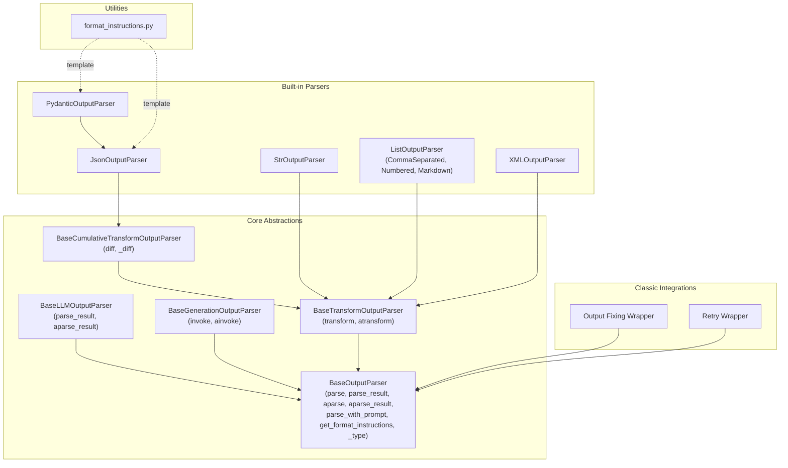
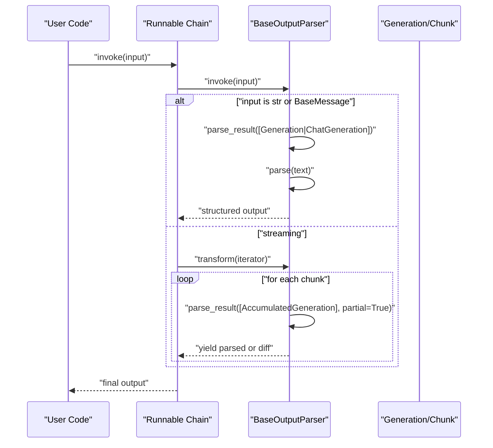
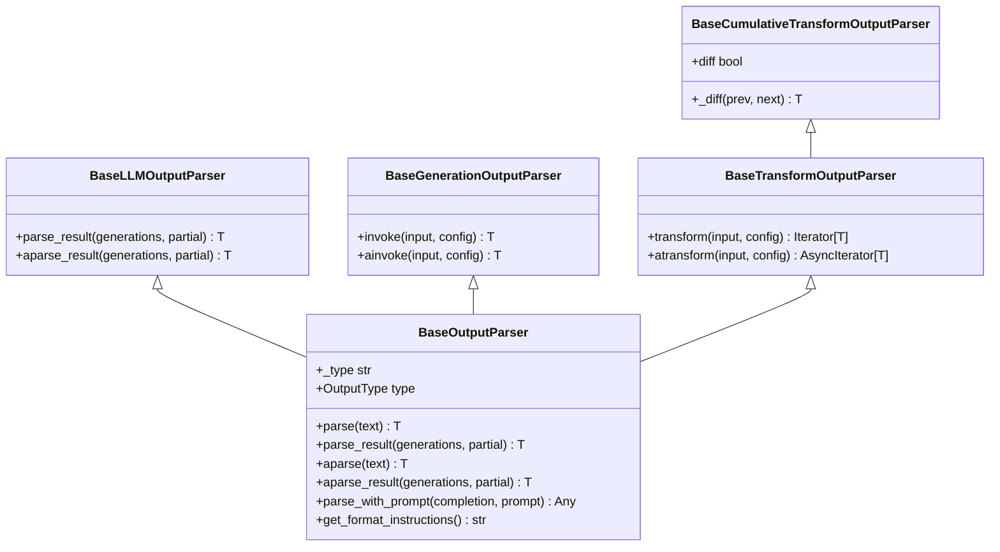
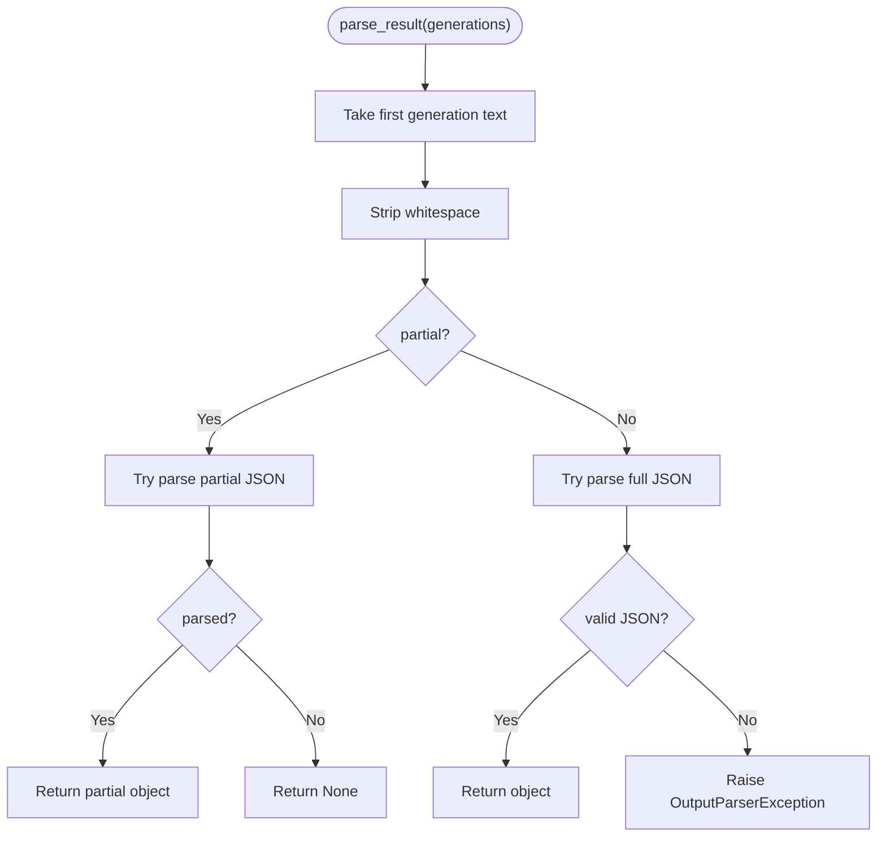
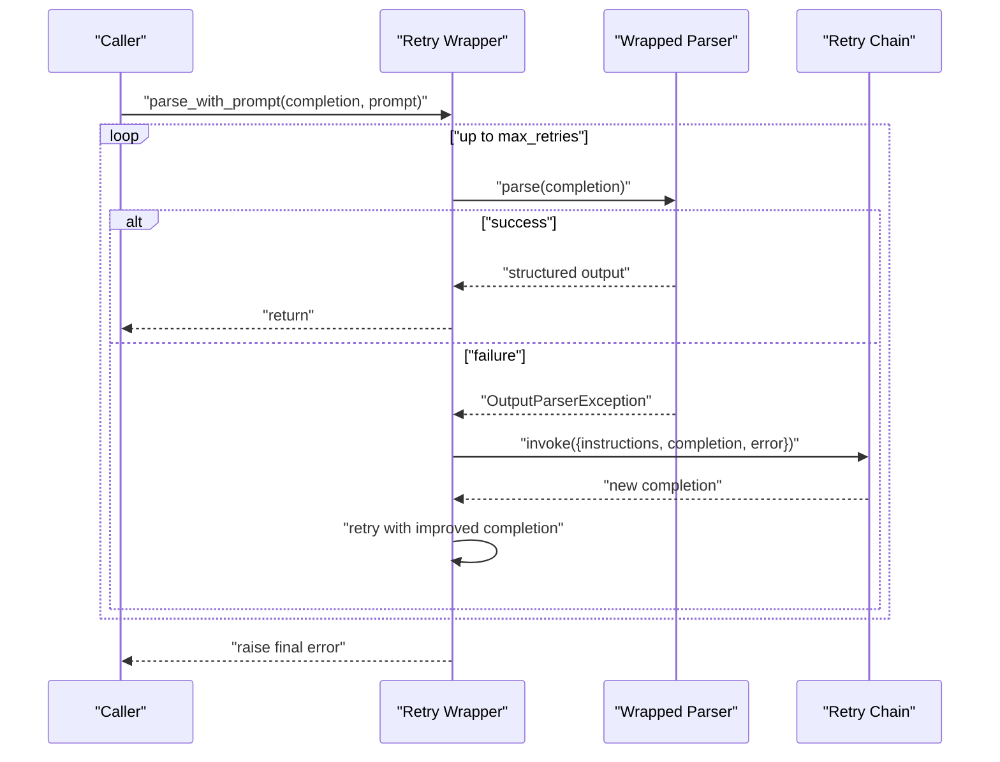
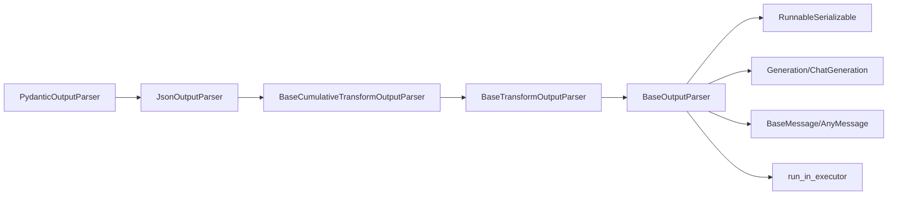

# Custom Parser Development

<cite>
**Referenced Files in This Document**
- [base.py](file://libs/core/langchain_core/output_parsers/base.py)
- [__init__.py](file://libs/core/langchain_core/output_parsers/__init__.py)
- [format_instructions.py](file://libs/core/langchain_core/output_parsers/format_instructions.py)
- [json.py](file://libs/core/langchain_core/output_parsers/json.py)
- [string.py](file://libs/core/langchain_core/output_parsers/string.py)
- [list.py](file://libs/core/langchain_core/output_parsers/list.py)
- [xml.py](file://libs/core/langchain_core/output_parsers/xml.py)
- [pydantic.py](file://libs/core/langchain_core/output_parsers/pydantic.py)
- [transform.py](file://libs/core/langchain_core/output_parsers/transform.py)
- [fix.py](file://libs/langchain/langchain_classic/output_parsers/fix.py)
- [retry.py](file://libs/langchain/langchain_classic/output_parsers/retry.py)
</cite>

## Table of Contents
1. [Introduction](#introduction)
2. [Project Structure](#project-structure)
3. [Core Components](#core-components)
4. [Architecture Overview](#architecture-overview)
5. [Detailed Component Analysis](#detailed-component-analysis)
6. [Dependency Analysis](#dependency-analysis)
7. [Performance Considerations](#performance-considerations)
8. [Troubleshooting Guide](#troubleshooting-guide)
9. [Conclusion](#conclusion)
10. [Appendices](#appendices)

## Introduction
This document explains how to develop custom output parsers in LangChain by extending the BaseOutputParser class. It covers the parser lifecycle, required and optional methods, async patterns, integration with LCEL workflows, prompt-aware parsing, validation and error handling, retry mechanisms, serialization, testing, and production best practices. Practical examples include CSV-like lists, SQL extraction framing, configuration-style key-value parsing, and API response validation.

## Project Structure
LangChain’s output parser ecosystem lives under the core package and exposes a unified interface for structured post-processing of model outputs. The primary base classes and representative implementations are organized as follows:
- Base abstractions: BaseOutputParser, BaseLLMOutputParser, BaseGenerationOutputParser
- Streaming and cumulative parsing: BaseTransformOutputParser, BaseCumulativeTransformOutputParser
- Built-in parsers: JSON, String, List variants, XML, Pydantic
- Utilities: format instructions templates
- Classic integrations: retry and fixing wrappers

**Diagram sources**
- [base.py](file://libs/core/langchain_core/output_parsers/base.py#L30-L349)
- [transform.py](file://libs/core/langchain_core/output_parsers/transform.py#L28-L176)
- [json.py](file://libs/core/langchain_core/output_parsers/json.py#L31-L140)
- [string.py](file://libs/core/langchain_core/output_parsers/string.py#L8-L64)
- [list.py](file://libs/core/langchain_core/output_parsers/list.py#L43-L250)
- [xml.py](file://libs/core/langchain_core/output_parsers/xml.py#L151-L301)
- [pydantic.py](file://libs/core/langchain_core/output_parsers/pydantic.py#L19-L140)
- [format_instructions.py](file://libs/core/langchain_core/output_parsers/format_instructions.py#L1-L17)
- [fix.py](file://libs/langchain/langchain_classic/output_parsers/fix.py#L69-L156)
- [retry.py](file://libs/langchain/langchain_classic/output_parsers/retry.py#L129-L166)

**Section sources**
- [__init__.py](file://libs/core/langchain_core/output_parsers/__init__.py#L1-L102)
- [base.py](file://libs/core/langchain_core/output_parsers/base.py#L30-L349)

## Core Components
- BaseOutputParser: Defines the contract for parsing raw text outputs into structured data. Key methods:
  - parse(text): Convert a single string to structured output
  - parse_result(generations, partial): Parse the first candidate generation
  - aparse(text), aparse_result(generations, partial): Async variants
  - parse_with_prompt(completion, prompt): Prompt-aware parsing hook
  - get_format_instructions(): Human-readable formatting guidance
  - _type: Required for serialization/deserialization
  - OutputType property: Inferred from generic type args
- BaseLLMOutputParser: Provides async-friendly delegation via run_in_executor
- BaseGenerationOutputParser: Bridges BaseOutputParser to Runnable invocation for str and BaseMessage
- BaseTransformOutputParser: Enables streaming parsing via transform()/atransform() over iterators/chunks
- BaseCumulativeTransformOutputParser: Adds partial parsing and diffing for streaming

These abstractions enable consistent integration with LCEL Runnable chains, allowing parsers to be chained, routed, retried, and serialized.

**Section sources**
- [base.py](file://libs/core/langchain_core/output_parsers/base.py#L30-L349)
- [transform.py](file://libs/core/langchain_core/output_parsers/transform.py#L28-L176)

## Architecture Overview
The parser lifecycle integrates with LCEL through Runnable interfaces. Typical flows:
- Synchronous: invoke(input) -> parse_result -> parse
- Asynchronous: ainvoke(input) -> aparse_result -> aparse
- Streaming: transform(input_iterator) -> per-chunk parse_result/partial parsing
- Prompt-aware: parse_with_prompt(completion, prompt) allows context-driven correction

**Diagram sources**
- [base.py](file://libs/core/langchain_core/output_parsers/base.py#L199-L243)
- [transform.py](file://libs/core/langchain_core/output_parsers/transform.py#L55-L96)

## Detailed Component Analysis

### BaseOutputParser Lifecycle and Methods
- parse(text): Implement to convert raw text to your target type. Raise OutputParserException for invalid formats.
- parse_result(generations, partial): Defaults to parsing the first candidate. Override if you need multi-candidate logic.
- aparse(text)/aparse_result(generations, partial): Async variants; default to thread-executor delegation.
- parse_with_prompt(completion, prompt): Optional hook to incorporate prompt context for validation or correction.
- get_format_instructions(): Provide guidance for model formatting; used by prompt formatting helpers.
- _type: Implement for serialization; otherwise serialization will raise.
- OutputType: Inferred from generic args; override if inference fails.

**Diagram sources**
- [base.py](file://libs/core/langchain_core/output_parsers/base.py#L30-L349)
- [transform.py](file://libs/core/langchain_core/output_parsers/transform.py#L28-L176)

**Section sources**
- [base.py](file://libs/core/langchain_core/output_parsers/base.py#L136-L349)

### Built-in Parsers: Patterns and Examples

#### JSON Parser
- Purpose: Robust JSON extraction and validation, supports partial parsing and diffs.
- Key behaviors:
  - parse_result/generate parse a single JSON object from the first candidate
  - get_format_instructions uses a schema template
  - Supports streaming via BaseCumulativeTransformOutputParser with partial JSON parsing
- Validation: Raises OutputParserException on malformed JSON; integrates with PydanticOutputParser for typed validation.

**Diagram sources**
- [json.py](file://libs/core/langchain_core/output_parsers/json.py#L61-L92)

**Section sources**
- [json.py](file://libs/core/langchain_core/output_parsers/json.py#L31-L140)
- [format_instructions.py](file://libs/core/langchain_core/output_parsers/format_instructions.py#L1-L17)

#### String Parser
- Purpose: Extract plain text from model outputs; simplest parser.
- Streaming: Supports incremental text chunks via transform().
- Serialization: Includes _type and namespace for serialization.

**Section sources**
- [string.py](file://libs/core/langchain_core/output_parsers/string.py#L8-L64)

#### List Parsers (CSV, Numbered, Markdown)
- Purpose: Parse various list formats into ordered arrays.
- Implementation patterns:
  - parse(text) returns list[str]
  - parse_iter(text) enables streaming tokenization for incremental yields
  - BaseTransformOutputParser accumulates chunks and yields complete items
- CSV: Uses CSV reader with fallback logic; robust against minor formatting errors.

**Section sources**
- [list.py](file://libs/core/langchain_core/output_parsers/list.py#L43-L250)

#### XML Parser
- Purpose: Parse XML into nested dictionaries with streaming support.
- Security: Optionally uses defusedxml for safe parsing; falls back to stdlib.
- Streaming: _StreamingParser accumulates chunks and yields elements as they close.
- Validation: Raises OutputParserException on malformed XML.

**Section sources**
- [xml.py](file://libs/core/langchain_core/output_parsers/xml.py#L151-L301)

#### Pydantic Parser
- Purpose: Validate and parse JSON into a typed Pydantic model.
- Integration: Extends JsonOutputParser; delegates validation to Pydantic model_validate or v1 parse_obj.
- Error mapping: Converts validation errors into OutputParserException with structured messages.

**Section sources**
- [pydantic.py](file://libs/core/langchain_core/output_parsers/pydantic.py#L19-L140)

### Prompt-Aware Parsing and Retry Mechanisms
- parse_with_prompt: BaseOutputParser provides a hook to incorporate prompt context for validation or correction. Some classic wrappers demonstrate iterative refinement using a retry chain and format instructions.
- Retry wrapper: Wraps an existing parser to re-parse on failure, optionally feeding the prompt and error back into a chain to improve the completion.

**Diagram sources**
- [base.py](file://libs/core/langchain_core/output_parsers/base.py#L311-L328)
- [fix.py](file://libs/langchain/langchain_classic/output_parsers/fix.py#L69-L109)
- [retry.py](file://libs/langchain/langchain_classic/output_parsers/retry.py#L129-L166)

**Section sources**
- [base.py](file://libs/core/langchain_core/output_parsers/base.py#L311-L328)
- [fix.py](file://libs/langchain/langchain_classic/output_parsers/fix.py#L69-L156)
- [retry.py](file://libs/langchain/langchain_classic/output_parsers/retry.py#L129-L166)

### Practical Use Cases

#### CSV-like List Extraction
- Goal: Convert “foo, bar, baz” into a list.
- Approach: Extend BaseTransformOutputParser or use CommaSeparatedListOutputParser. Implement parse() with CSV parsing and fallback logic; optionally implement parse_iter() for streaming.

**Section sources**
- [list.py](file://libs/core/langchain_core/output_parsers/list.py#L139-L186)

#### SQL Query Extraction (Framing)
- Goal: Extract a single SQL query from a potentially noisy model response.
- Approach: Implement parse() to locate fenced code blocks or fenced SQL segments, then validate minimal syntactic markers. Raise OutputParserException for ambiguous or invalid content. Optionally integrate parse_with_prompt to guide the model to return clean SQL.

**Section sources**
- [base.py](file://libs/core/langchain_core/output_parsers/base.py#L311-L328)

#### Configuration File Parsing (Key-Value)
- Goal: Parse “key=value” lines into a dict.
- Approach: Implement parse() to split lines, trim whitespace, and normalize keys. Use parse_with_prompt to enforce expected keys and formats. Consider streaming if the model emits lines incrementally.

**Section sources**
- [base.py](file://libs/core/langchain_core/output_parsers/base.py#L311-L328)
- [transform.py](file://libs/core/langchain_core/output_parsers/transform.py#L28-L96)

#### API Response Validation
- Goal: Ensure a JSON payload matches a known schema.
- Approach: Use JsonOutputParser or PydanticOutputParser. For partial streaming, enable partial=True and yield diffs. Provide get_format_instructions to constrain the model’s output.

**Section sources**
- [json.py](file://libs/core/langchain_core/output_parsers/json.py#L61-L92)
- [pydantic.py](file://libs/core/langchain_core/output_parsers/pydantic.py#L55-L91)
- [format_instructions.py](file://libs/core/langchain_core/output_parsers/format_instructions.py#L1-L17)

## Dependency Analysis
- BaseOutputParser depends on:
  - RunnableSerializable for LCEL integration
  - Generation/ChatGeneration for candidate parsing
  - BaseMessage/AnyMessage for message-based inputs
  - run_in_executor for async delegation
- Streaming parsers depend on BaseTransformOutputParser and accumulate chunks into Generation/ChatGeneration to reuse parse_result logic.
- PydanticOutputParser composes JsonOutputParser to reuse JSON parsing and diffing.

**Diagram sources**
- [base.py](file://libs/core/langchain_core/output_parsers/base.py#L17-L21)
- [transform.py](file://libs/core/langchain_core/output_parsers/transform.py#L12-L25)
- [json.py](file://libs/core/langchain_core/output_parsers/json.py#L17-L23)
- [pydantic.py](file://libs/core/langchain_core/output_parsers/pydantic.py#L10-L16)

**Section sources**
- [base.py](file://libs/core/langchain_core/output_parsers/base.py#L17-L21)
- [transform.py](file://libs/core/langchain_core/output_parsers/transform.py#L12-L25)
- [json.py](file://libs/core/langchain_core/output_parsers/json.py#L17-L23)
- [pydantic.py](file://libs/core/langchain_core/output_parsers/pydantic.py#L10-L16)

## Performance Considerations
- Prefer streaming parsers for long-running generations to reduce latency and memory pressure.
- Use partial parsing with BaseCumulativeTransformOutputParser to emit diffs rather than full intermediate structures.
- Avoid heavy synchronous work in parse(); offload to threads via aparse/aparse_result when appropriate.
- Minimize regex and repeated parsing passes; cache compiled patterns if reused.
- For JSON/XML, leverage built-in streaming parsers to avoid buffering entire outputs.

[No sources needed since this section provides general guidance]

## Troubleshooting Guide
Common issues and remedies:
- Missing _type: Serialization will fail. Implement _type in your parser subclass.
- Ambiguous output: Implement get_format_instructions to constrain model output; consider using prompt-aware parsing to guide corrections.
- Partial parsing failures: For streaming, ensure partial=True is respected and handle None returns gracefully.
- Validation errors: Catch OutputParserException and either retry with parse_with_prompt or propagate to upstream error handling.

**Section sources**
- [base.py](file://libs/core/langchain_core/output_parsers/base.py#L334-L349)
- [json.py](file://libs/core/langchain_core/output_parsers/json.py#L87-L91)
- [xml.py](file://libs/core/langchain_core/output_parsers/xml.py#L245-L250)

## Conclusion
Extending BaseOutputParser lets you build robust, LCEL-native parsers tailored to your domain. Implement parse() and parse_result(), expose get_format_instructions(), and provide _type for serialization. For streaming, use BaseTransformOutputParser or BaseCumulativeTransformOutputParser. Incorporate prompt-aware parsing and retry wrappers to improve accuracy. Validate rigorously and test both success and error paths.

[No sources needed since this section summarizes without analyzing specific files]

## Appendices

### A. Parser Lifecycle Reference
- Synchronous: invoke(input) -> parse_result -> parse
- Asynchronous: ainvoke(input) -> aparse_result -> aparse
- Streaming: transform/atransform -> per-chunk parse_result with partial=True
- Prompt-aware: parse_with_prompt(completion, prompt) for context-driven correction

**Section sources**
- [base.py](file://libs/core/langchain_core/output_parsers/base.py#L199-L308)
- [transform.py](file://libs/core/langchain_core/output_parsers/transform.py#L55-L176)

### B. Serialization Checklist
- Implement _type property returning a unique string
- Ensure OutputType is inferable or override OutputType
- Confirm get_format_instructions is implemented for user-facing guidance
- Verify the parser is included in the public API surface

**Section sources**
- [base.py](file://libs/core/langchain_core/output_parsers/base.py#L334-L349)
- [json.py](file://libs/core/langchain_core/output_parsers/json.py#L125-L127)
- [string.py](file://libs/core/langchain_core/output_parsers/string.py#L55-L58)
- [list.py](file://libs/core/langchain_core/output_parsers/list.py#L183-L185)
- [xml.py](file://libs/core/langchain_core/output_parsers/xml.py#L283-L285)
- [pydantic.py](file://libs/core/langchain_core/output_parsers/pydantic.py#L113-L115)

### C. Testing Strategies
- Unit tests: Validate parse() with typical and edge cases; assert raised exceptions for malformed inputs.
- Streaming tests: Use transform()/atransform() to simulate chunked inputs and verify incremental yields.
- Integration tests: Chain your parser with a mock model and assert end-to-end behavior.
- Retry tests: Wrap your parser with a retry chain and confirm improvement on subsequent attempts.

[No sources needed since this section provides general guidance]