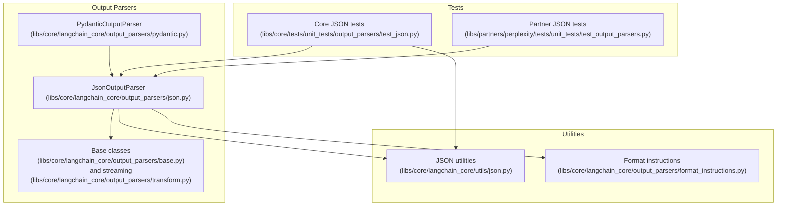
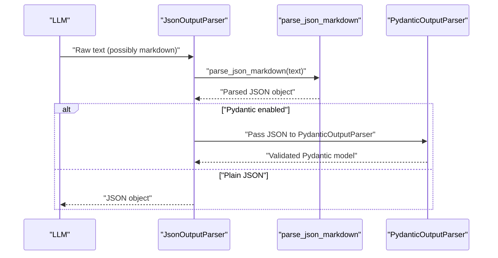
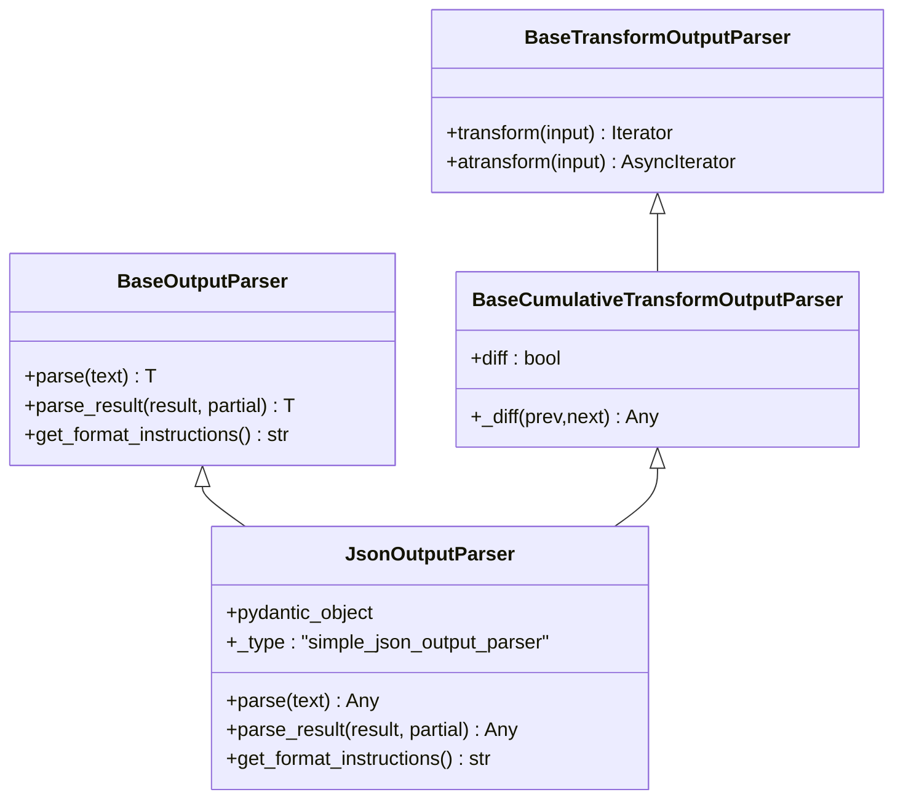
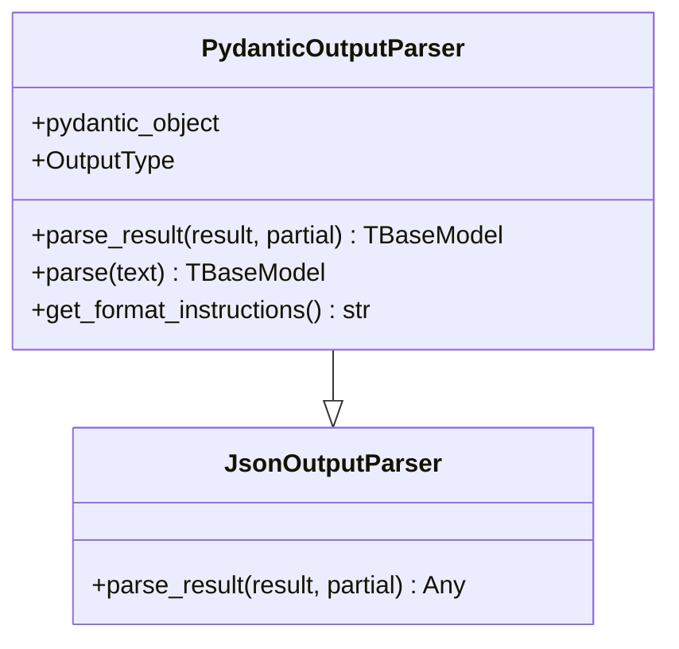
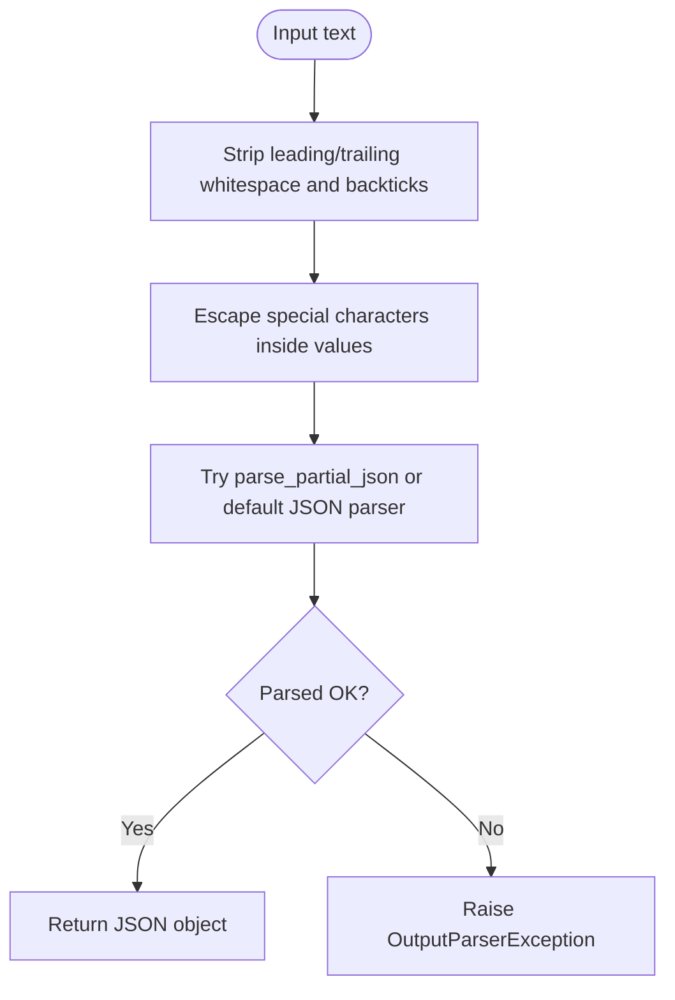
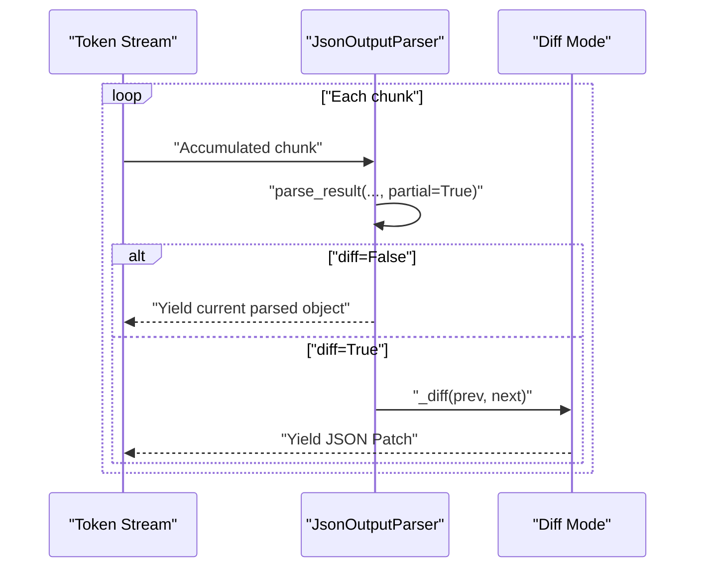
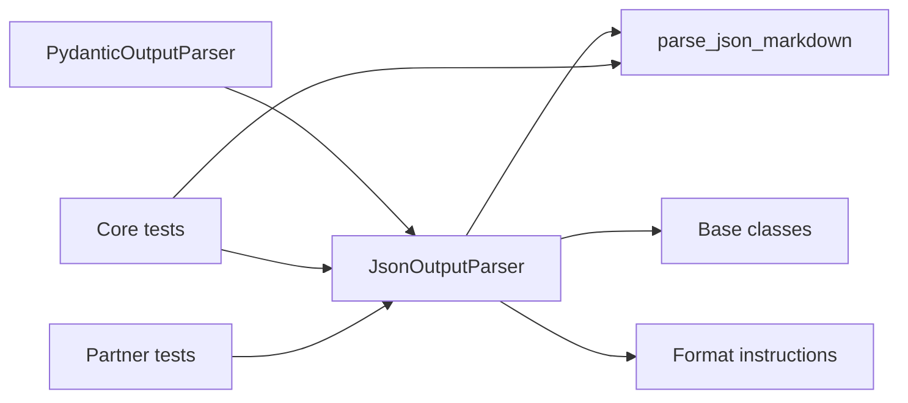

# JSON Parsing

<cite>
**Referenced Files in This Document**
- [json.py](file://libs/core/langchain_core/output_parsers/json.py)
- [base.py](file://libs/core/langchain_core/output_parsers/base.py)
- [transform.py](file://libs/core/langchain_core/output_parsers/transform.py)
- [json.py](file://libs/core/langchain_core/utils/json.py)
- [format_instructions.py](file://libs/core/langchain_core/output_parsers/format_instructions.py)
- [pydantic.py](file://libs/core/langchain_core/output_parsers/pydantic.py)
- [test_json.py](file://libs/core/tests/unit_tests/output_parsers/test_json.py)
- [test_output_parsers.py](file://libs/partners/perplexity/tests/unit_tests/test_output_parsers.py)
</cite>

## Table of Contents
1. [Introduction](#introduction)
2. [Project Structure](#project-structure)
3. [Core Components](#core-components)
4. [Architecture Overview](#architecture-overview)
5. [Detailed Component Analysis](#detailed-component-analysis)
6. [Dependency Analysis](#dependency-analysis)
7. [Performance Considerations](#performance-considerations)
8. [Troubleshooting Guide](#troubleshooting-guide)
9. [Conclusion](#conclusion)
10. [Appendices](#appendices)

## Introduction
This document explains JSON output parsing in LangChain with a focus on the JsonOutputParser class and related utilities. It covers how to extract structured JSON from language model responses, how to handle malformed JSON, and how to validate outputs using Pydantic models. It also describes configuration options such as streaming, partial parsing, and diff generation, along with practical examples for nested objects, arrays, primitives, and integration patterns in Retrieval-Augmented Generation (RAG), structured extraction, and API response processing.

## Project Structure
LangChain’s JSON parsing capability spans several modules:
- Output parsers define the contract and behavior for transforming LLM outputs into structured formats.
- Utilities provide robust JSON parsing helpers that tolerate common LLM artifacts like markdown code blocks, extra whitespace, and partial JSON.
- Tests demonstrate real-world scenarios including streaming, nested structures, and error conditions.

**Diagram sources**
- [json.py](file://libs/core/langchain_core/output_parsers/json.py#L31-L128)
- [pydantic.py](file://libs/core/langchain_core/output_parsers/pydantic.py#L19-L122)
- [base.py](file://libs/core/langchain_core/output_parsers/base.py#L30-L349)
- [transform.py](file://libs/core/langchain_core/output_parsers/transform.py#L99-L176)
- [json.py](file://libs/core/langchain_core/utils/json.py#L142-L192)
- [format_instructions.py](file://libs/core/langchain_core/output_parsers/format_instructions.py#L1-L16)
- [test_json.py](file://libs/core/tests/unit_tests/output_parsers/test_json.py#L1-L631)
- [test_output_parsers.py](file://libs/partners/perplexity/tests/unit_tests/test_output_parsers.py#L1-L356)

**Section sources**
- [json.py](file://libs/core/langchain_core/output_parsers/json.py#L31-L128)
- [base.py](file://libs/core/langchain_core/output_parsers/base.py#L30-L349)
- [transform.py](file://libs/core/langchain_core/output_parsers/transform.py#L99-L176)
- [json.py](file://libs/core/langchain_core/utils/json.py#L142-L192)
- [format_instructions.py](file://libs/core/langchain_core/output_parsers/format_instructions.py#L1-L16)
- [test_json.py](file://libs/core/tests/unit_tests/output_parsers/test_json.py#L1-L631)
- [test_output_parsers.py](file://libs/partners/perplexity/tests/unit_tests/test_output_parsers.py#L1-L356)

## Core Components
- JsonOutputParser: Parses LLM outputs into JSON, supports streaming with partial parsing and optional JSON Patch diffs.
- PydanticOutputParser: Extends JsonOutputParser to validate and construct Pydantic models from parsed JSON.
- Utility JSON functions: Robust parsing helpers for markdown-wrapped JSON, partial JSON, and escaping special characters.
- Streaming base classes: Support incremental parsing and diffing during streaming.

Key capabilities:
- Extract JSON from markdown code blocks and various whitespace contexts.
- Handle partial JSON during streaming and yield intermediate results or diffs.
- Validate against Pydantic models and produce helpful errors.
- Provide format instructions for LLMs to produce strict JSON.

**Section sources**
- [json.py](file://libs/core/langchain_core/output_parsers/json.py#L31-L128)
- [pydantic.py](file://libs/core/langchain_core/output_parsers/pydantic.py#L19-L122)
- [json.py](file://libs/core/langchain_core/utils/json.py#L142-L192)
- [transform.py](file://libs/core/langchain_core/output_parsers/transform.py#L99-L176)

## Architecture Overview
The JSON parsing pipeline integrates output parsers with utility functions and optional Pydantic validation.

**Diagram sources**
- [json.py](file://libs/core/langchain_core/output_parsers/json.py#L61-L102)
- [json.py](file://libs/core/langchain_core/utils/json.py#L142-L192)
- [pydantic.py](file://libs/core/langchain_core/output_parsers/pydantic.py#L55-L91)

## Detailed Component Analysis

### JsonOutputParser
Responsibilities:
- Parse raw LLM text into JSON.
- Support partial parsing for streaming.
- Provide format instructions for LLMs.
- Yield diffs during streaming when configured.

Implementation highlights:
- parse_result handles partial vs full parsing and raises OutputParserException on invalid JSON.
- parse delegates to parse_result for convenience.
- get_format_instructions returns strict JSON format guidance and schema when a Pydantic model is provided.
- Streaming support via BaseCumulativeTransformOutputParser parent class.

**Diagram sources**
- [base.py](file://libs/core/langchain_core/output_parsers/base.py#L136-L349)
- [transform.py](file://libs/core/langchain_core/output_parsers/transform.py#L99-L176)
- [json.py](file://libs/core/langchain_core/output_parsers/json.py#L31-L128)

**Section sources**
- [json.py](file://libs/core/langchain_core/output_parsers/json.py#L61-L128)
- [base.py](file://libs/core/langchain_core/output_parsers/base.py#L246-L349)
- [transform.py](file://libs/core/langchain_core/output_parsers/transform.py#L125-L176)

### PydanticOutputParser
Responsibilities:
- Validate JSON against a Pydantic model.
- Convert parsed JSON into typed Pydantic objects.
- Propagate helpful errors on validation failures.

Implementation highlights:
- parse_result calls JsonOutputParser.parse_result and then validates with Pydantic.
- Supports partial parsing; returns None when partial validation fails.
- get_format_instructions emits schema-based guidance.

**Diagram sources**
- [json.py](file://libs/core/langchain_core/output_parsers/json.py#L61-L102)
- [pydantic.py](file://libs/core/langchain_core/output_parsers/pydantic.py#L19-L122)

**Section sources**
- [pydantic.py](file://libs/core/langchain_core/output_parsers/pydantic.py#L19-L122)

### Utility JSON Functions
Robust parsing helpers:
- parse_json_markdown: Extracts JSON from markdown code blocks, strips backticks/newlines, escapes special characters, and parses partial JSON.
- parse_partial_json: Attempts to parse incomplete JSON by balancing brackets/braces and trimming invalid suffixes.
- parse_and_check_json_markdown: Parses JSON and ensures it is a dict and contains expected keys.

**Diagram sources**
- [json.py](file://libs/core/langchain_core/utils/json.py#L142-L192)
- [json.py](file://libs/core/langchain_core/utils/json.py#L58-L137)
- [json.py](file://libs/core/langchain_core/utils/json.py#L194-L229)

**Section sources**
- [json.py](file://libs/core/langchain_core/utils/json.py#L142-L192)
- [json.py](file://libs/core/langchain_core/utils/json.py#L58-L137)
- [json.py](file://libs/core/langchain_core/utils/json.py#L194-L229)

### Streaming and Diffing
Streaming behavior:
- BaseCumulativeTransformOutputParser accumulates chunks and yields partial results as they become valid.
- When diff=True, yields JSON Patch operations describing changes between consecutive parsed objects.

**Diagram sources**
- [transform.py](file://libs/core/langchain_core/output_parsers/transform.py#L125-L176)
- [json.py](file://libs/core/langchain_core/output_parsers/json.py#L50-L52)

**Section sources**
- [transform.py](file://libs/core/langchain_core/output_parsers/transform.py#L125-L176)
- [json.py](file://libs/core/langchain_core/output_parsers/json.py#L50-L52)

## Dependency Analysis
- JsonOutputParser depends on:
  - parse_json_markdown for robust parsing.
  - Base classes for invocation and streaming.
  - Format instructions for strict output guidance.
- PydanticOutputParser depends on JsonOutputParser and Pydantic validation.
- Tests validate parsing under diverse conditions, including streaming and markdown code blocks.

**Diagram sources**
- [json.py](file://libs/core/langchain_core/output_parsers/json.py#L61-L128)
- [json.py](file://libs/core/langchain_core/utils/json.py#L142-L192)
- [format_instructions.py](file://libs/core/langchain_core/output_parsers/format_instructions.py#L1-L16)
- [pydantic.py](file://libs/core/langchain_core/output_parsers/pydantic.py#L19-L122)
- [test_json.py](file://libs/core/tests/unit_tests/output_parsers/test_json.py#L1-L631)
- [test_output_parsers.py](file://libs/partners/perplexity/tests/unit_tests/test_output_parsers.py#L1-L356)

**Section sources**
- [json.py](file://libs/core/langchain_core/output_parsers/json.py#L61-L128)
- [json.py](file://libs/core/langchain_core/utils/json.py#L142-L192)
- [format_instructions.py](file://libs/core/langchain_core/output_parsers/format_instructions.py#L1-L16)
- [pydantic.py](file://libs/core/langchain_core/output_parsers/pydantic.py#L19-L122)
- [test_json.py](file://libs/core/tests/unit_tests/output_parsers/test_json.py#L1-L631)
- [test_output_parsers.py](file://libs/partners/perplexity/tests/unit_tests/test_output_parsers.py#L1-L356)

## Performance Considerations
- Prefer streaming with diff=False for real-time updates when latency matters; diff=True adds overhead for computing patches.
- Use partial=True only when necessary; it avoids blocking on incomplete JSON and reduces latency.
- Avoid excessive retries on invalid JSON; catch OutputParserException and apply targeted fixes.
- When integrating with Pydantic, keep schemas minimal and precise to reduce validation overhead.

[No sources needed since this section provides general guidance]

## Troubleshooting Guide
Common issues and resolutions:
- Invalid JSON or non-object top-level values:
  - Use parse_and_check_json_markdown to enforce dict and required keys.
  - Catch OutputParserException and refine prompts or post-process outputs.
- Streaming stalls or empty yields:
  - Ensure partial=True is used; otherwise, incomplete JSON will block.
  - Verify diff configuration matches desired output granularity.
- Unicode and escaped characters:
  - Utility functions handle escaping and unicode; ensure inputs are passed through parse_json_markdown.
- Integration with Pydantic:
  - On validation errors, inspect the generated OutputParserException for the offending JSON and adjust the model or prompt accordingly.

**Section sources**
- [json.py](file://libs/core/langchain_core/utils/json.py#L194-L229)
- [json.py](file://libs/core/langchain_core/output_parsers/json.py#L81-L91)
- [pydantic.py](file://libs/core/langchain_core/output_parsers/pydantic.py#L37-L43)
- [test_json.py](file://libs/core/tests/unit_tests/output_parsers/test_json.py#L546-L549)

## Conclusion
JsonOutputParser provides a robust foundation for extracting structured JSON from LLM outputs, with strong support for markdown-wrapped JSON, partial parsing, and streaming. PydanticOutputParser extends this with type-safe validation. Together with utility functions and format instructions, they enable reliable JSON parsing across diverse LLM artifacts and use cases.

[No sources needed since this section summarizes without analyzing specific files]

## Appendices

### Practical Examples and Patterns
- Basic JSON parsing from markdown code blocks:
  - Use JsonOutputParser with get_format_instructions to guide the LLM to return strict JSON.
- Nested objects and arrays:
  - The parser handles nested structures; ensure the LLM produces valid JSON.
- Primitive types:
  - Strings, numbers, booleans, and null are supported; ensure the LLM returns canonical JSON.
- Streaming with diffs:
  - Enable diff=True to receive JSON Patch operations describing incremental changes.
- Integration with Pydantic:
  - Wrap JsonOutputParser with PydanticOutputParser to validate and construct typed models.
- RAG and API response processing:
  - Use JsonOutputParser to extract structured metadata or entities; pair with PydanticOutputParser for schema enforcement.

**Section sources**
- [json.py](file://libs/core/langchain_core/output_parsers/json.py#L104-L123)
- [pydantic.py](file://libs/core/langchain_core/output_parsers/pydantic.py#L93-L111)
- [test_json.py](file://libs/core/tests/unit_tests/output_parsers/test_json.py#L193-L244)
- [test_output_parsers.py](file://libs/partners/perplexity/tests/unit_tests/test_output_parsers.py#L109-L147)