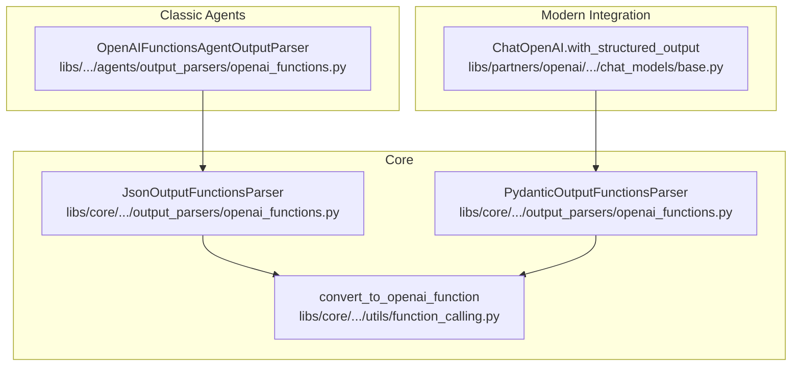
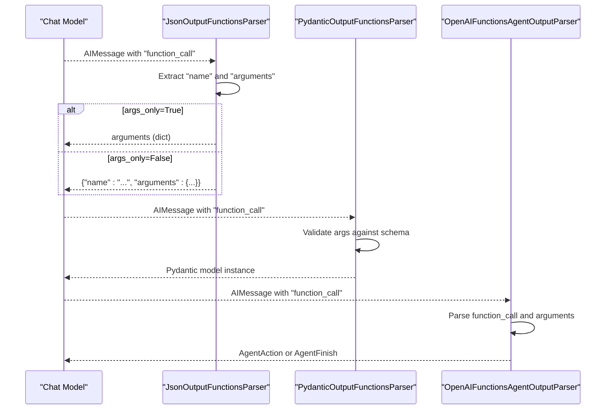
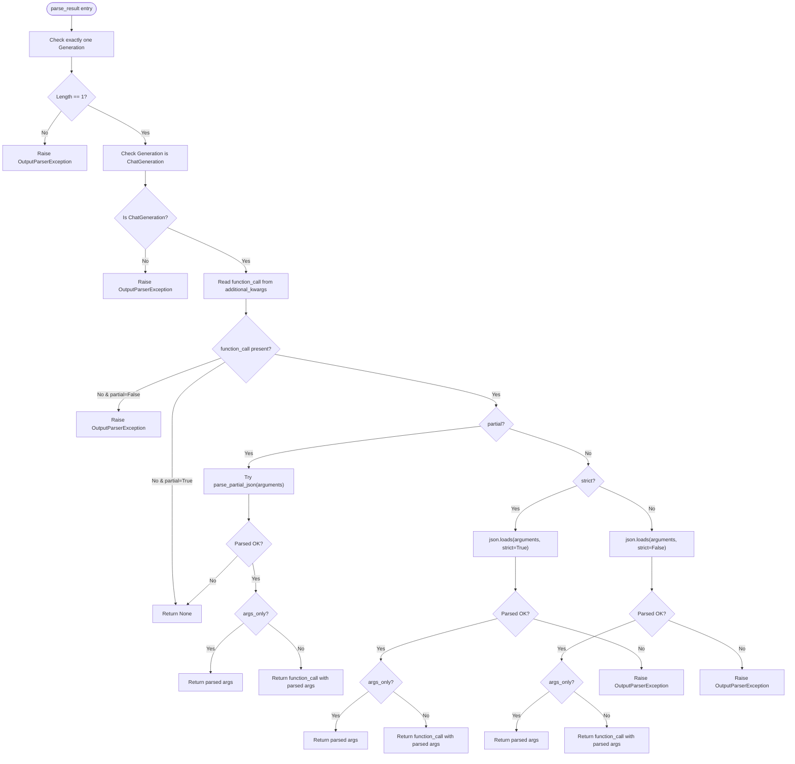
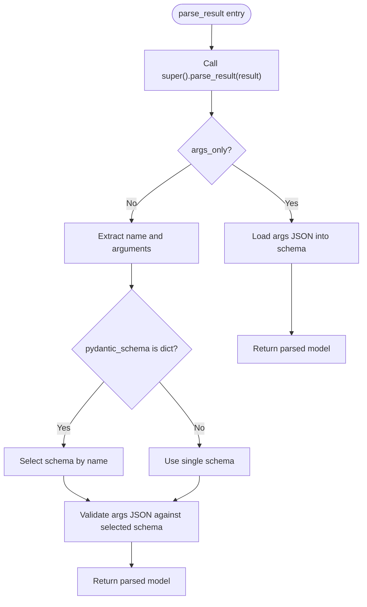
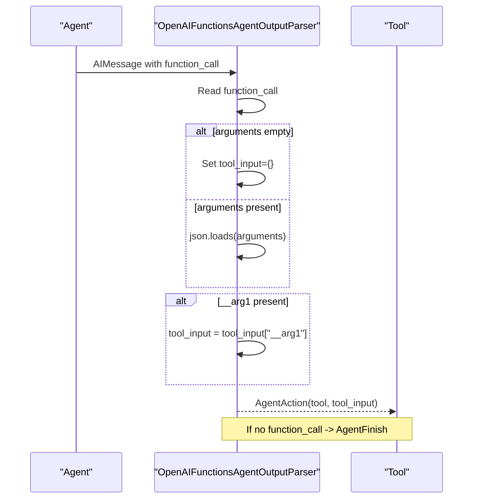
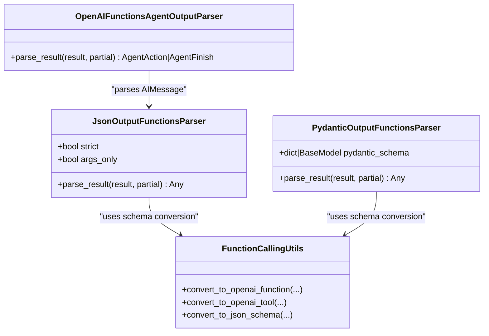
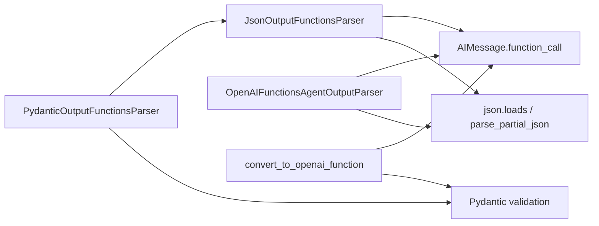

# OpenAI Function Parsing

<cite>
**Referenced Files in This Document**
- [openai_functions.py](file://libs/core/langchain_core/output_parsers/openai_functions.py)
- [function_calling.py](file://libs/core/langchain_core/utils/function_calling.py)
- [openai_functions.py](file://libs/langchain/langchain_classic/agents/output_parsers/openai_functions.py)
- [base.py](file://libs/partners/openai/langchain_openai/chat_models/base.py)
- [test_openai_functions.py](file://libs/core/tests/unit_tests/output_parsers/test_openai_functions.py)
</cite>

## Table of Contents
1. [Introduction](#introduction)
2. [Project Structure](#project-structure)
3. [Core Components](#core-components)
4. [Architecture Overview](#architecture-overview)
5. [Detailed Component Analysis](#detailed-component-analysis)
6. [Dependency Analysis](#dependency-analysis)
7. [Performance Considerations](#performance-considerations)
8. [Troubleshooting Guide](#troubleshooting-guide)
9. [Conclusion](#conclusion)

## Introduction
This document explains how LangChain parses OpenAI function calling outputs using dedicated output parsers. It focuses on the JsonOutputFunctionsParser and PydanticOutputFunctionsParser classes, detailing how they extract function names and parameters from OpenAI’s function_call responses, how they differ between required and optional function parsing, and how they integrate with agents and structured output workflows. It also covers OpenAI-specific considerations such as function definitions, tool-calling patterns, response format variations, and best practices for debugging and optimizing function schemas.

## Project Structure
LangChain’s OpenAI function parsing spans three layers:
- Core output parsers: Extract and validate function_call payloads from LLM responses.
- Utility helpers: Convert Pydantic/TypedDict/Tools into OpenAI-compatible function/tool schemas.
- Agent integrations: Parse function calls from agent messages and route to tools.
- Modern structured output: Bind schemas to ChatOpenAI with multiple methods (function_calling, json_mode, json_schema).

**Diagram sources**
- [openai_functions.py](file://libs/core/langchain_core/output_parsers/openai_functions.py#L58-L142)
- [openai_functions.py](file://libs/core/langchain_core/output_parsers/openai_functions.py#L179-L292)
- [function_calling.py](file://libs/core/langchain_core/utils/function_calling.py#L361-L480)
- [openai_functions.py](file://libs/langchain/langchain_classic/agents/output_parsers/openai_functions.py#L16-L99)
- [base.py](file://libs/partners/openai/langchain_openai/chat_models/base.py#L3032-L3200)

**Section sources**
- [openai_functions.py](file://libs/core/langchain_core/output_parsers/openai_functions.py#L1-L314)
- [function_calling.py](file://libs/core/langchain_core/utils/function_calling.py#L1-L803)
- [openai_functions.py](file://libs/langchain/langchain_classic/agents/output_parsers/openai_functions.py#L1-L99)
- [base.py](file://libs/partners/openai/langchain_openai/chat_models/base.py#L3032-L3400)

## Core Components
- JsonOutputFunctionsParser: Parses OpenAI function_call payloads into JSON. Supports args_only mode and strict/non-strict decoding. Handles partial JSON parsing when partial=True.
- PydanticOutputFunctionsParser: Validates and parses function_call arguments into Pydantic models. Supports single-schema and multi-schema modes keyed by function name.
- OpenAIFunctionsAgentOutputParser: Converts AIMessages containing function_call into AgentAction or AgentFinish for agent workflows.
- Utility converters: convert_to_openai_function and related helpers translate Pydantic/TypedDict/Callable/Tool into OpenAI function/tool definitions.

Key behaviors:
- Function name extraction: Both parsers read the function_call field from additional_kwargs on AIMessage.
- Parameter parsing: Arguments are parsed from JSON strings into dicts or Pydantic models.
- Required vs optional parsing:
  - JsonOutputFunctionsParser(args_only=True) returns only the arguments dict.
  - JsonOutputFunctionsParser(args_only=False) returns the full function_call object including name and arguments.
  - PydanticOutputFunctionsParser validates against a provided schema(s); missing function or mismatch raises errors.
- Error handling: Raises OutputParserException for malformed inputs or missing function_call.

**Section sources**
- [openai_functions.py](file://libs/core/langchain_core/output_parsers/openai_functions.py#L58-L142)
- [openai_functions.py](file://libs/core/langchain_core/output_parsers/openai_functions.py#L179-L292)
- [openai_functions.py](file://libs/langchain/langchain_classic/agents/output_parsers/openai_functions.py#L16-L99)

## Architecture Overview
The parsing pipeline integrates with OpenAI’s function calling and tool-calling APIs. At runtime, an LLM returns an AIMessage with function_call or tool_calls. Parsers extract the function name and arguments, then either return raw JSON or validate into Pydantic models. Agents consume parsed actions to execute tools.

**Diagram sources**
- [openai_functions.py](file://libs/core/langchain_core/output_parsers/openai_functions.py#L58-L142)
- [openai_functions.py](file://libs/core/langchain_core/output_parsers/openai_functions.py#L179-L292)
- [openai_functions.py](file://libs/langchain/langchain_classic/agents/output_parsers/openai_functions.py#L16-L99)

## Detailed Component Analysis

### JsonOutputFunctionsParser
Purpose:
- Extract function_call from AIMessage and return either raw arguments or the full function_call object.
- Support strict/non-strict JSON decoding and partial parsing.

Implementation highlights:
- parse_result validates ChatGeneration and reads message.additional_kwargs["function_call"].
- args_only controls whether to return only arguments or the whole function_call.
- strict toggles strict JSON decoding to allow unicode/newlines.
- partial enables incremental parsing via parse_partial_json; returns None when partial JSON is invalid.

**Diagram sources**
- [openai_functions.py](file://libs/core/langchain_core/output_parsers/openai_functions.py#L80-L141)

**Section sources**
- [openai_functions.py](file://libs/core/langchain_core/output_parsers/openai_functions.py#L58-L142)

### PydanticOutputFunctionsParser
Purpose:
- Validate function_call arguments against a Pydantic schema and return a typed model instance.
- Support single schema and multi-schema modes keyed by function name.

Implementation highlights:
- Validates schema compatibility and enforces args_only semantics.
- For args_only=True: loads arguments JSON directly into the schema.
- For args_only=False: extracts name and arguments, selects schema by function name (when multiple), and validates arguments.

**Diagram sources**
- [openai_functions.py](file://libs/core/langchain_core/output_parsers/openai_functions.py#L258-L292)

**Section sources**
- [openai_functions.py](file://libs/core/langchain_core/output_parsers/openai_functions.py#L179-L292)

### OpenAIFunctionsAgentOutputParser
Purpose:
- Parse AIMessages produced by agents using OpenAI’s function_call to produce AgentAction or AgentFinish.
- Handles empty arguments and unpacks legacy __arg1 wrapper.

Processing logic:
- Reads function_call from AIMessage.additional_kwargs.
- Parses arguments JSON; supports empty arguments (converted to {}).
- Unpacks __arg1 if present to support older tool signatures.
- Produces AgentAction with tool name and tool_input; otherwise AgentFinish with message content.

**Diagram sources**
- [openai_functions.py](file://libs/langchain/langchain_classic/agents/output_parsers/openai_functions.py#L32-L80)

**Section sources**
- [openai_functions.py](file://libs/langchain/langchain_classic/agents/output_parsers/openai_functions.py#L16-L99)

### OpenAI-Specific Considerations and Integrations
- Function definitions and tool schemas:
  - convert_to_openai_function converts Pydantic/TypedDict/Callable/Tool into OpenAI function/tool definitions.
  - Supports strict mode and normalization of JSON schema properties.
- Modern structured output:
  - ChatOpenAI.with_structured_output supports multiple methods:
    - json_schema: Structured outputs with schema enforcement.
    - function_calling: Tool-calling API with function_call responses.
    - json_mode: Free-form JSON responses requiring formatting instructions.
  - Includes include_raw to return both raw AIMessage and parsed result for debugging.

**Diagram sources**
- [openai_functions.py](file://libs/core/langchain_core/output_parsers/openai_functions.py#L58-L142)
- [openai_functions.py](file://libs/core/langchain_core/output_parsers/openai_functions.py#L179-L292)
- [openai_functions.py](file://libs/langchain/langchain_classic/agents/output_parsers/openai_functions.py#L16-L99)
- [function_calling.py](file://libs/core/langchain_core/utils/function_calling.py#L361-L480)

**Section sources**
- [function_calling.py](file://libs/core/langchain_core/utils/function_calling.py#L361-L480)
- [base.py](file://libs/partners/openai/langchain_openai/chat_models/base.py#L3032-L3200)

## Dependency Analysis
- JsonOutputFunctionsParser depends on:
  - AIMessage.additional_kwargs["function_call"] for input.
  - json.loads/parse_partial_json for decoding.
  - OutputParserException for error signaling.
- PydanticOutputFunctionsParser depends on:
  - JsonOutputFunctionsParser for argument extraction.
  - Pydantic model validation APIs.
- OpenAIFunctionsAgentOutputParser depends on:
  - AIMessage and json.loads for tool-call parsing.
- Utility converters depend on:
  - Pydantic model_json_schema/schema, TypedDict introspection, and Tool metadata.

**Diagram sources**
- [openai_functions.py](file://libs/core/langchain_core/output_parsers/openai_functions.py#L58-L142)
- [openai_functions.py](file://libs/core/langchain_core/output_parsers/openai_functions.py#L179-L292)
- [openai_functions.py](file://libs/langchain/langchain_classic/agents/output_parsers/openai_functions.py#L16-L99)
- [function_calling.py](file://libs/core/langchain_core/utils/function_calling.py#L361-L480)

**Section sources**
- [openai_functions.py](file://libs/core/langchain_core/output_parsers/openai_functions.py#L58-L142)
- [openai_functions.py](file://libs/core/langchain_core/output_parsers/openai_functions.py#L179-L292)
- [openai_functions.py](file://libs/langchain/langchain_classic/agents/output_parsers/openai_functions.py#L16-L99)
- [function_calling.py](file://libs/core/langchain_core/utils/function_calling.py#L361-L480)

## Performance Considerations
- Prefer args_only=True when you only need arguments to reduce object size and parsing overhead.
- Use strict=False for non-strict decoding to avoid unnecessary validation costs when inputs may include unicode or newlines.
- For streaming/partial parsing, leverage partial=True to incrementally parse incomplete JSON.
- When using PydanticOutputFunctionsParser, keep schemas minimal and avoid overly complex nested structures to speed validation.

## Troubleshooting Guide
Common issues and resolutions:
- Missing function_call:
  - Symptom: OutputParserException indicating inability to parse function call.
  - Cause: AIMessage lacks function_call or is not a ChatGeneration.
  - Resolution: Ensure the LLM response includes function_call and the parser is applied to ChatGeneration results.
- Malformed arguments:
  - Symptom: JSONDecodeError wrapped as OutputParserException.
  - Cause: arguments is not valid JSON or strict=True disallows certain characters.
  - Resolution: Enable partial=True for incremental parsing or set strict=False for lenient decoding.
- Empty arguments:
  - Symptom: Empty string for arguments.
  - Behavior: Parser treats as {}.
  - Resolution: Tools expecting a single string argument should use the __arg1 wrapper; the agent parser unpacks it automatically.
- Multi-function schemas:
  - Symptom: Ambiguous function name.
  - Resolution: Provide a dict mapping function names to schemas for PydanticOutputFunctionsParser.

Validation and testing references:
- Unit tests demonstrate expected behavior for strict/non-strict decoding, args_only modes, and error conditions.

**Section sources**
- [openai_functions.py](file://libs/core/langchain_core/output_parsers/openai_functions.py#L58-L142)
- [openai_functions.py](file://libs/core/langchain_core/output_parsers/openai_functions.py#L179-L292)
- [openai_functions.py](file://libs/langchain/langchain_classic/agents/output_parsers/openai_functions.py#L16-L99)
- [test_openai_functions.py](file://libs/core/tests/unit_tests/output_parsers/test_openai_functions.py#L16-L197)

## Conclusion
LangChain’s OpenAI function parsing stack provides robust, extensible mechanisms to extract and validate function_call outputs. JsonOutputFunctionsParser offers flexible JSON parsing with strictness and partial support, while PydanticOutputFunctionsParser adds strong typing and schema validation. Together with agent parsers and modern structured output bindings, they enable reliable integration with OpenAI’s function_calling and tool-calling APIs across diverse workflows.