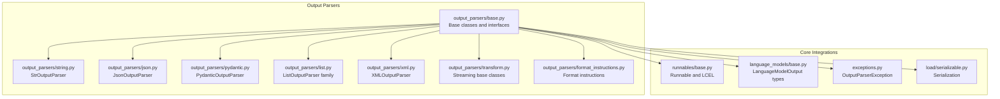
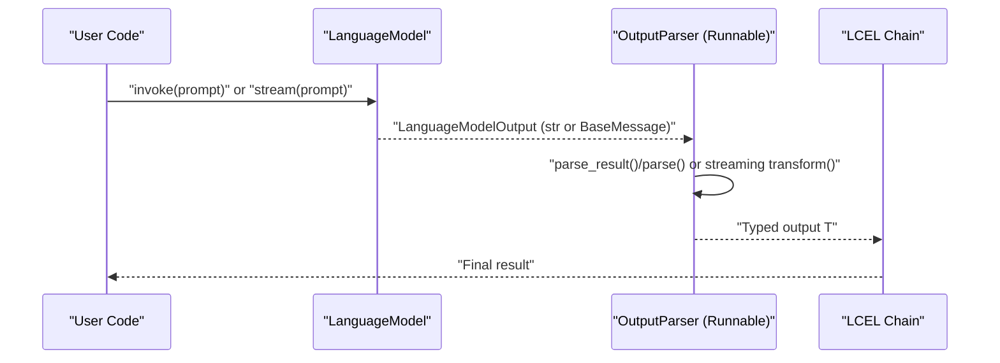
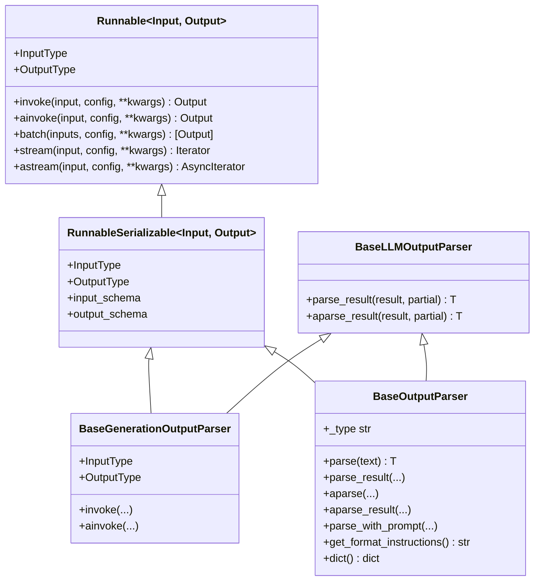
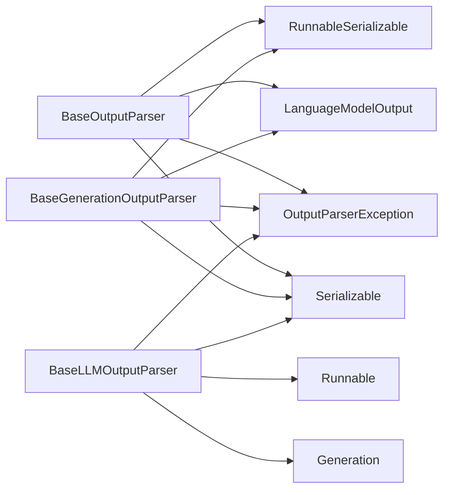

# Output Parser Fundamentals

<cite>
**Referenced Files in This Document**
- [base.py](file://libs/core/langchain_core/output_parsers/base.py)
- [base.py](file://libs/core/langchain_core/runnables/base.py)
- [base.py](file://libs/core/langchain_core/language_models/base.py)
- [__init__.py](file://libs/core/langchain_core/output_parsers/__init__.py)
- [string.py](file://libs/core/langchain_core/output_parsers/string.py)
- [json.py](file://libs/core/langchain_core/output_parsers/json.py)
- [pydantic.py](file://libs/core/langchain_core/output_parsers/pydantic.py)
- [list.py](file://libs/core/langchain_core/output_parsers/list.py)
- [xml.py](file://libs/core/langchain_core/output_parsers/xml.py)
- [transform.py](file://libs/core/langchain_core/output_parsers/transform.py)
- [format_instructions.py](file://libs/core/langchain_core/output_parsers/format_instructions.py)
- [exceptions.py](file://libs/core/langchain_core/exceptions.py)
- [serializable.py](file://libs/core/langchain_core/load/serializable.py)
</cite>

## Table of Contents
1. [Introduction](#introduction)
2. [Project Structure](#project-structure)
3. [Core Components](#core-components)
4. [Architecture Overview](#architecture-overview)
5. [Detailed Component Analysis](#detailed-component-analysis)
6. [Dependency Analysis](#dependency-analysis)
7. [Performance Considerations](#performance-considerations)
8. [Troubleshooting Guide](#troubleshooting-guide)
9. [Conclusion](#conclusion)
10. [Appendices](#appendices)

## Introduction
This document explains the fundamentals of output parsers in LangChain Core. It focuses on the BaseOutputParser abstract class and its role in structuring language model responses, the core interfaces parse(), parse_result(), and their async counterparts, and the Runnable integration that enables parsers to participate in LCEL workflows. It also covers the different parser types (BaseOutputParser, BaseGenerationOutputParser, BaseLLMOutputParser), InputType and OutputType properties, serialization mechanisms, and the _type property for parser identification. Practical examples show how to implement custom parsers, handle partial results, and integrate parsers with different LLM providers. Finally, it outlines error handling patterns, exception types, and debugging techniques for parser development.

## Project Structure
The output parser ecosystem is centered around the output_parsers package and integrates with the core Runnable framework and language model abstractions.

**Diagram sources**
- [base.py](file://libs/core/langchain_core/output_parsers/base.py#L1-L349)
- [base.py](file://libs/core/langchain_core/runnables/base.py#L124-L800)
- [base.py](file://libs/core/langchain_core/language_models/base.py#L114-L125)
- [string.py](file://libs/core/langchain_core/output_parsers/string.py#L1-L64)
- [json.py](file://libs/core/langchain_core/output_parsers/json.py#L1-L140)
- [pydantic.py](file://libs/core/langchain_core/output_parsers/pydantic.py#L1-L140)
- [list.py](file://libs/core/langchain_core/output_parsers/list.py#L1-L250)
- [xml.py](file://libs/core/langchain_core/output_parsers/xml.py#L1-L301)
- [transform.py](file://libs/core/langchain_core/output_parsers/transform.py#L1-L176)
- [format_instructions.py](file://libs/core/langchain_core/output_parsers/format_instructions.py#L1-L17)
- [exceptions.py](file://libs/core/langchain_core/exceptions.py#L1-L94)
- [serializable.py](file://libs/core/langchain_core/load/serializable.py#L88-L376)

**Section sources**
- [__init__.py](file://libs/core/langchain_core/output_parsers/__init__.py#L1-L102)
- [base.py](file://libs/core/langchain_core/output_parsers/base.py#L1-L349)
- [base.py](file://libs/core/langchain_core/runnables/base.py#L124-L800)
- [base.py](file://libs/core/langchain_core/language_models/base.py#L114-L125)

## Core Components
- BaseLLMOutputParser: Defines parse_result() for lists of Generation objects and aparse_result() for async. It is the foundational interface for LLM output parsing.
- BaseGenerationOutputParser: Extends BaseLLMOutputParser and integrates with RunnableSerializable to accept str or BaseMessage inputs, invoking parse_result under the hood.
- BaseOutputParser: The primary user-facing base class. It defines parse() for raw text, parse_result() that delegates to parse on the first Generation, and async variants. It also exposes InputType, OutputType, and serialization via _type and dict().
- Streaming and cumulative parsing: BaseTransformOutputParser and BaseCumulativeTransformOutputParser enable streaming transformations and partial-result accumulation with optional diffing.

Key responsibilities:
- Structuring model outputs into typed, validated data.
- Supporting synchronous and asynchronous invocation.
- Enabling LCEL composition via Runnable interfaces.
- Providing serialization hooks for persistence and reconstruction.

**Section sources**
- [base.py](file://libs/core/langchain_core/output_parsers/base.py#L30-L349)
- [transform.py](file://libs/core/langchain_core/output_parsers/transform.py#L28-L176)

## Architecture Overview
Output parsers participate in LCEL workflows as Runnable objects. They can be chained with language models, prompts, and other runnables, and they support batch, stream, and async execution.

**Diagram sources**
- [base.py](file://libs/core/langchain_core/output_parsers/base.py#L136-L349)
- [base.py](file://libs/core/langchain_core/runnables/base.py#L124-L256)
- [base.py](file://libs/core/langchain_core/language_models/base.py#L114-L125)

## Detailed Component Analysis

### BaseOutputParser and Related Interfaces
- parse(text: str) -> T: Parses a single string model output into a typed result. Implement this in custom parsers.
- parse_result(result: list[Generation], partial: bool = False) -> T: Delegates to parse on the first Generation; supports partial results for streaming scenarios.
- aparse(text: str) -> T and aparse_result(result, partial: bool = False) -> T: Async counterparts that delegate to sync methods via thread pool execution.
- parse_with_prompt(completion: str, prompt: PromptValue) -> Any: Optional hook to incorporate prompt context for retries or corrections.
- get_format_instructions() -> str: Provides instructions for formatting model output; raises if not implemented by concrete parser.
- _type property -> str: Required for serialization; must uniquely identify the parser type.
- dict() -> dict: Serializes the parser, injecting _type if available.

Runnable integration:
- InputType: Union of str | AnyMessage for both sync and async invoke.
- OutputType: Inferred from the generic type argument T; raises if not inferable.
- invoke/ainvoke: Accept str or BaseMessage, wrap into Generation/ChatGeneration, and call parse_result/aparse_result.

Practical example references:
- Implementing a custom boolean parser with parse() and _type is demonstrated in the docstring example of BaseOutputParser.

**Section sources**
- [base.py](file://libs/core/langchain_core/output_parsers/base.py#L136-L349)

### BaseGenerationOutputParser
- Extends BaseLLMOutputParser and RunnableSerializable.
- InputType: str | AnyMessage.
- OutputType: type[T] inferred from the generic type argument.
- invoke/ainvoke: Detects BaseMessage vs str, wraps into ChatGeneration or Generation respectively, then calls parse_result/aparse_result.

Use cases:
- When you need to accept BaseMessage inputs directly (e.g., AIMessage) and parse them into structured outputs.

**Section sources**
- [base.py](file://libs/core/langchain_core/output_parsers/base.py#L70-L135)

### BaseLLMOutputParser
- parse_result(result: list[Generation], partial: bool = False) -> T: Core parsing entry point for Generation lists.
- aparse_result(): Async variant delegating to parse_result via thread pool.

When to use:
- As a minimal interface for parsers that operate on raw Generation objects (e.g., streaming or multi-candidate outputs).

**Section sources**
- [base.py](file://libs/core/langchain_core/output_parsers/base.py#L30-L68)

### Streaming and Partial Results
- BaseTransformOutputParser: Implements transform()/atransform() to process iterators of str or BaseMessage, yielding parsed items as they become available.
- BaseCumulativeTransformOutputParser: Accumulates chunks into GenerationChunk or ChatGenerationChunk, enabling partial parsing via parse_result(..., partial=True). Optionally emits diffs via _diff(prev, next).

Use cases:
- JSON streaming with incremental parsing.
- XML streaming with pull-parser events.
- List parsing with regex-driven incremental matches.

**Section sources**
- [transform.py](file://libs/core/langchain_core/output_parsers/transform.py#L28-L176)
- [json.py](file://libs/core/langchain_core/output_parsers/json.py#L31-L140)
- [xml.py](file://libs/core/langchain_core/output_parsers/xml.py#L42-L301)
- [list.py](file://libs/core/langchain_core/output_parsers/list.py#L43-L250)

### Runnable Integration and LCEL Composition
- All parser classes inherit from RunnableSerializable[LanguageModelOutput, T] or Runnable[LanguageModelOutput, T], enabling:
  - Chaining with | operator.
  - Batch execution via batch/abatch.
  - Streaming via stream/astream and transform/atransform.
  - Schema inference via InputType/OutputType and input_schema/output_schema.
- LanguageModelOutput is str or BaseMessage, aligning with BaseLanguageModel’s output signature.

**Diagram sources**
- [base.py](file://libs/core/langchain_core/runnables/base.py#L124-L520)
- [base.py](file://libs/core/langchain_core/output_parsers/base.py#L30-L349)

**Section sources**
- [base.py](file://libs/core/langchain_core/runnables/base.py#L124-L520)
- [base.py](file://libs/core/langchain_core/language_models/base.py#L114-L125)

### Parser Types and When to Use Each
- BaseOutputParser: General-purpose parser for raw text outputs. Use when you need to parse str or BaseMessage into a typed result.
- BaseGenerationOutputParser: Use when you specifically want to accept BaseMessage inputs and parse them into structured outputs.
- BaseLLMOutputParser: Minimal interface for Generation-based parsing; useful for advanced or specialized parsing logic.

Selection criteria:
- If your chain passes str or BaseMessage to the parser, BaseOutputParser or BaseGenerationOutputParser are appropriate.
- If you need to operate directly on Generation objects (e.g., streaming chunks), BaseLLMOutputParser is suitable.

**Section sources**
- [base.py](file://libs/core/langchain_core/output_parsers/base.py#L30-L135)

### Serialization and _type Property
- _type property: Must be implemented by concrete parsers to identify the parser type during serialization.
- dict(): Calls model_dump() and injects "_type" if available, enabling reconstruction.
- is_lc_serializable()/get_lc_namespace(): Some parsers declare themselves serializable and define their namespace for deserialization.

Examples:
- StrOutputParser declares itself serializable and returns a simple _type.
- JsonOutputParser and PydanticOutputParser define their own _type identifiers.

**Section sources**
- [base.py](file://libs/core/langchain_core/output_parsers/base.py#L334-L349)
- [string.py](file://libs/core/langchain_core/output_parsers/string.py#L37-L64)
- [json.py](file://libs/core/langchain_core/output_parsers/json.py#L125-L128)
- [pydantic.py](file://libs/core/langchain_core/output_parsers/pydantic.py#L113-L116)
- [serializable.py](file://libs/core/langchain_core/load/serializable.py#L88-L376)

### Practical Examples and Patterns
- Implementing a custom output parser:
  - Subclass BaseOutputParser[T].
  - Implement parse(text: str) -> T and _type -> str.
  - Optionally override parse_with_prompt() and get_format_instructions().
  - Reference example in BaseOutputParser docstring for a boolean parser.
- Handling partial results:
  - Use BaseCumulativeTransformOutputParser to accumulate chunks and parse partial results with parse_result(..., partial=True).
  - Implement _diff(prev, next) to emit deltas if needed.
- Integrating with LLM providers:
  - For chat models, pass AIMessage or BaseMessage to parsers inheriting from BaseGenerationOutputParser.
  - For text models, pass raw strings to BaseOutputParser.
  - Combine with RunnableSequence to form LCEL chains.

References:
- Custom boolean parser example: [base.py](file://libs/core/langchain_core/output_parsers/base.py#L143-L168)
- Streaming JSON parsing: [json.py](file://libs/core/langchain_core/output_parsers/json.py#L31-L140)
- Streaming XML parsing: [xml.py](file://libs/core/langchain_core/output_parsers/xml.py#L151-L301)
- Streaming list parsing: [list.py](file://libs/core/langchain_core/output_parsers/list.py#L43-L250)

**Section sources**
- [base.py](file://libs/core/langchain_core/output_parsers/base.py#L143-L168)
- [json.py](file://libs/core/langchain_core/output_parsers/json.py#L31-L140)
- [xml.py](file://libs/core/langchain_core/output_parsers/xml.py#L151-L301)
- [list.py](file://libs/core/langchain_core/output_parsers/list.py#L43-L250)

### Format Instructions and Prompt Guidance
- get_format_instructions(): Implemented by parsers to instruct the model on the desired output format.
- JSON_FORMAT_INSTRUCTIONS: Standardized instructions template for JSON outputs.

**Section sources**
- [format_instructions.py](file://libs/core/langchain_core/output_parsers/format_instructions.py#L1-L17)
- [json.py](file://libs/core/langchain_core/output_parsers/json.py#L104-L124)
- [pydantic.py](file://libs/core/langchain_core/output_parsers/pydantic.py#L93-L112)

## Dependency Analysis
Output parsers depend on:
- Runnable and RunnableSerializable for LCEL integration.
- LanguageModelOutput types for input signatures.
- Exceptions for standardized error signaling.
- Serialization utilities for persistence.

**Diagram sources**
- [base.py](file://libs/core/langchain_core/output_parsers/base.py#L17-L21)
- [base.py](file://libs/core/langchain_core/runnables/base.py#L124-L200)
- [base.py](file://libs/core/langchain_core/language_models/base.py#L114-L125)
- [exceptions.py](file://libs/core/langchain_core/exceptions.py#L15-L65)
- [serializable.py](file://libs/core/langchain_core/load/serializable.py#L88-L132)

**Section sources**
- [base.py](file://libs/core/langchain_core/output_parsers/base.py#L17-L21)
- [base.py](file://libs/core/langchain_core/runnables/base.py#L124-L200)
- [base.py](file://libs/core/langchain_core/language_models/base.py#L114-L125)
- [exceptions.py](file://libs/core/langchain_core/exceptions.py#L15-L65)
- [serializable.py](file://libs/core/langchain_core/load/serializable.py#L88-L132)

## Performance Considerations
- Streaming parsing: Prefer BaseCumulativeTransformOutputParser for memory-efficient incremental parsing of long outputs.
- Partial results: Using partial=True reduces latency by yielding results as soon as they are valid.
- Threading: Async methods delegate to sync via run_in_executor; keep parse() lightweight to avoid blocking threads.
- Schema inference: OutputType inference relies on generic type args; ensure proper typing for accurate schema generation.

[No sources needed since this section provides general guidance]

## Troubleshooting Guide
Common issues and patterns:
- OutputParserException: Raised when parsing fails. Catch and optionally resend observation and llm_output to the model for correction.
- Missing _type: dict() requires _type to be implemented; otherwise NotImplementedError is raised.
- Uninferable OutputType: BaseOutputParser raises if OutputType cannot be inferred from the generic type argument.
- Streaming errors: For XML and JSON streaming, parse errors may occur mid-stream; handle via try/except and consider fallbacks.

Debugging tips:
- Enable LCEL tracing and logs to inspect intermediate outputs.
- Use with_retry and fallbacks to improve robustness.
- Validate format instructions and prompt templates to ensure the model adheres to expected output formats.

**Section sources**
- [exceptions.py](file://libs/core/langchain_core/exceptions.py#L15-L94)
- [base.py](file://libs/core/langchain_core/output_parsers/base.py#L334-L349)
- [xml.py](file://libs/core/langchain_core/output_parsers/xml.py#L244-L251)
- [json.py](file://libs/core/langchain_core/output_parsers/json.py#L87-L92)

## Conclusion
Output parsers in LangChain Core provide a robust, composable abstraction for transforming language model outputs into structured, typed data. By leveraging Runnable integration, they fit seamlessly into LCEL workflows, support streaming and partial results, and offer strong serialization and error-handling capabilities. Choose the appropriate base class for your use case, implement the required interfaces, and follow the provided patterns to build reliable, maintainable parsers.

[No sources needed since this section summarizes without analyzing specific files]

## Appendices

### Quick Reference: Core Methods and Properties
- BaseOutputParser
  - parse(text: str) -> T
  - parse_result(result: list[Generation], partial: bool = False) -> T
  - aparse(text: str) -> T
  - aparse_result(result, partial: bool = False) -> T
  - parse_with_prompt(completion: str, prompt: PromptValue) -> Any
  - get_format_instructions() -> str
  - _type: str
  - dict() -> dict
- BaseGenerationOutputParser
  - InputType: str | AnyMessage
  - OutputType: type[T]
  - invoke/ainvoke: Accept str or BaseMessage
- BaseLLMOutputParser
  - parse_result(result: list[Generation], partial: bool = False) -> T
  - aparse_result(result, partial: bool = False) -> T

**Section sources**
- [base.py](file://libs/core/langchain_core/output_parsers/base.py#L30-L349)