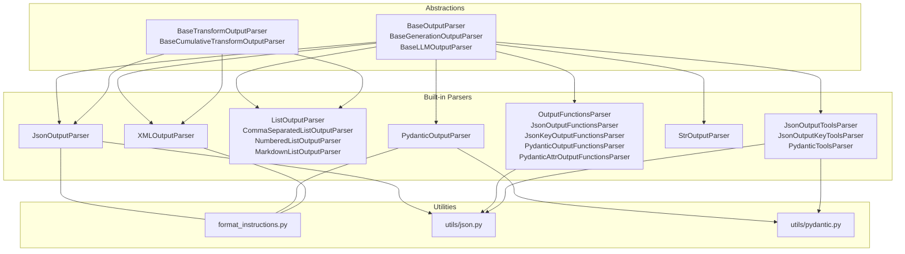
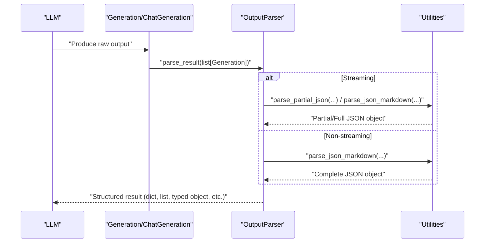
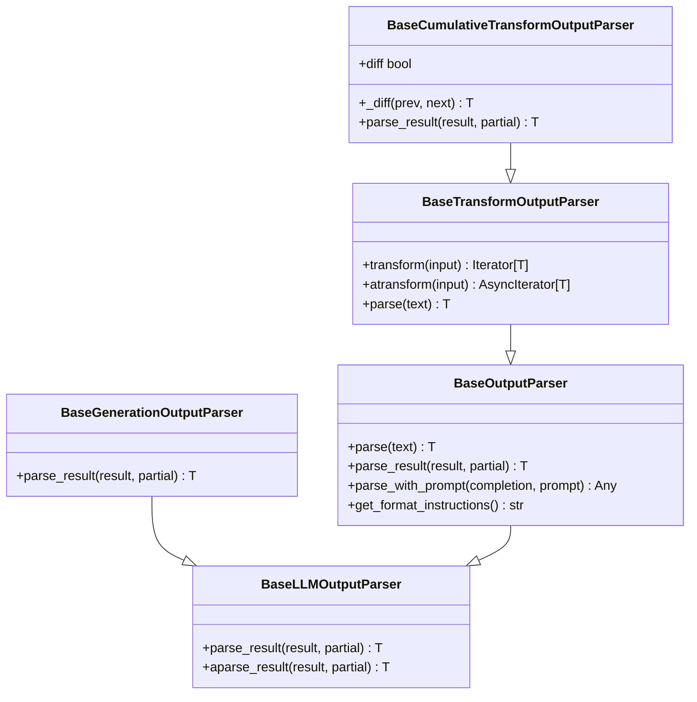
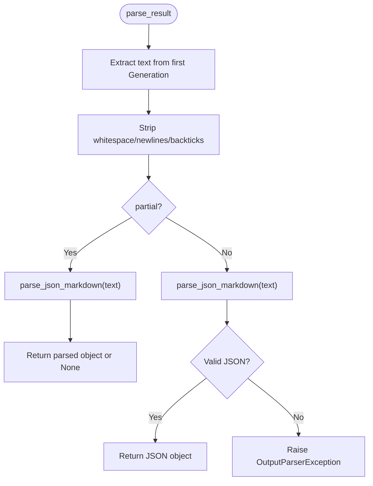
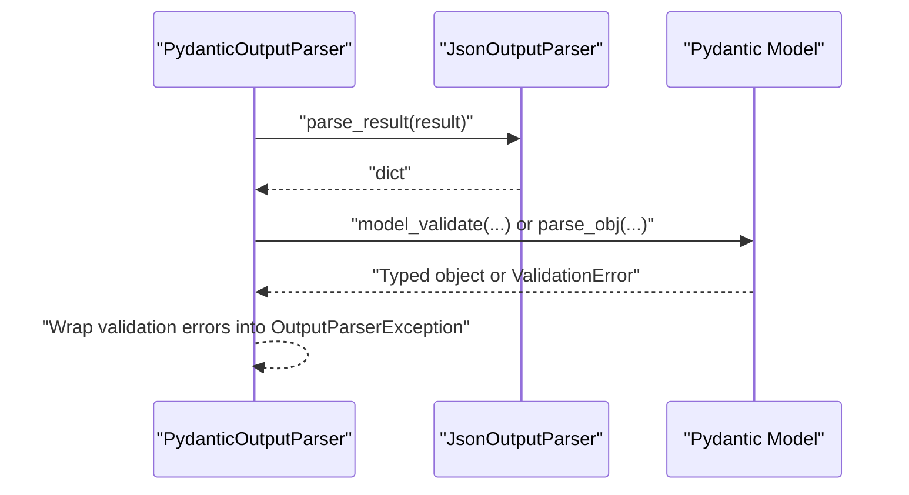
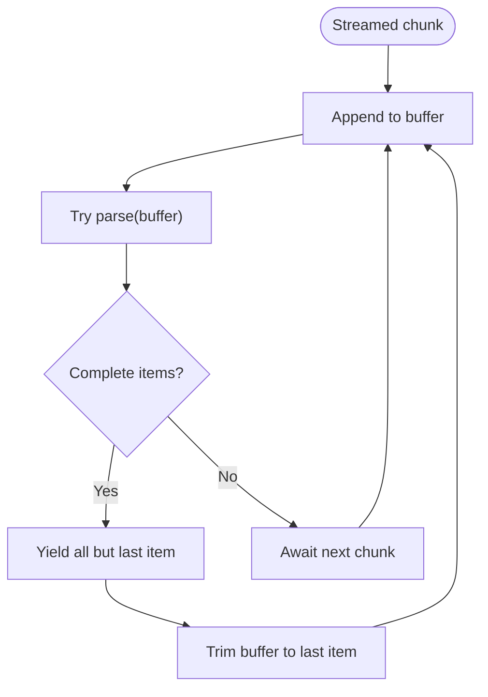
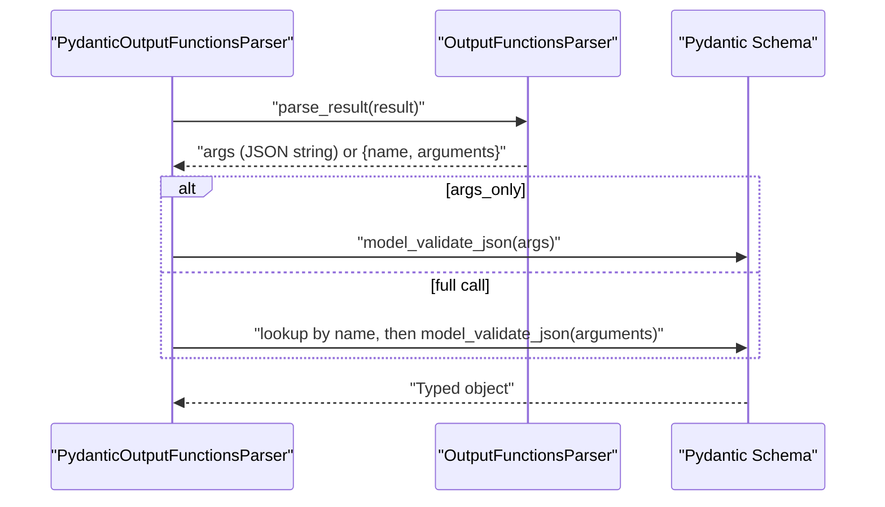
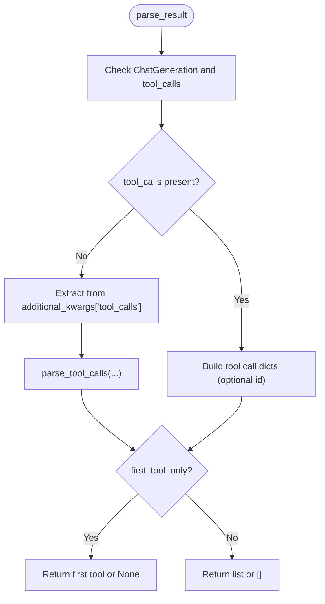
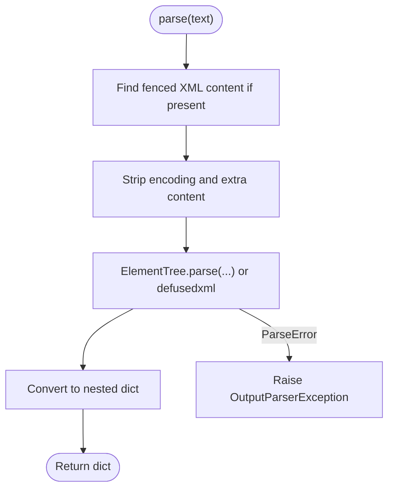
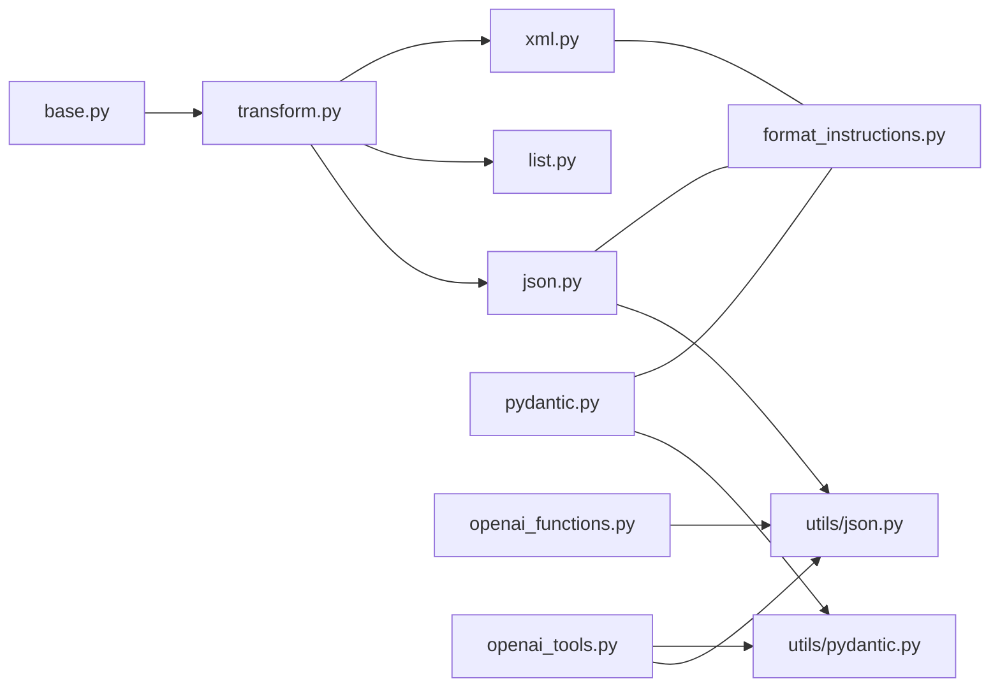

# Output Parsing

<cite>
**Referenced Files in This Document**
- [__init__.py](file://libs/core/langchain_core/output_parsers/__init__.py)
- [base.py](file://libs/core/langchain_core/output_parsers/base.py)
- [format_instructions.py](file://libs/core/langchain_core/output_parsers/format_instructions.py)
- [json.py](file://libs/core/langchain_core/output_parsers/json.py)
- [pydantic.py](file://libs/core/langchain_core/output_parsers/pydantic.py)
- [list.py](file://libs/core/langchain_core/output_parsers/list.py)
- [openai_functions.py](file://libs/core/langchain_core/output_parsers/openai_functions.py)
- [openai_tools.py](file://libs/core/langchain_core/output_parsers/openai_tools.py)
- [string.py](file://libs/core/langchain_core/output_parsers/string.py)
- [transform.py](file://libs/core/langchain_core/output_parsers/transform.py)
- [xml.py](file://libs/core/langchain_core/output_parsers/xml.py)
- [json.py](file://libs/core/langchain_core/utils/json.py)
- [pydantic.py](file://libs/core/langchain_core/utils/pydantic.py)
</cite>

## Table of Contents
1. [Introduction](#introduction)
2. [Project Structure](#project-structure)
3. [Core Components](#core-components)
4. [Architecture Overview](#architecture-overview)
5. [Detailed Component Analysis](#detailed-component-analysis)
6. [Dependency Analysis](#dependency-analysis)
7. [Performance Considerations](#performance-considerations)
8. [Troubleshooting Guide](#troubleshooting-guide)
9. [Conclusion](#conclusion)
10. [Appendices](#appendices)

## Introduction
Structured output parsing is essential for turning free-form language model responses into reliable, typed data that downstream systems can consume consistently. It ensures robustness against noisy or partially formed outputs, supports incremental processing via streaming, and integrates cleanly with strongly typed schemas (e.g., Pydantic models). This document explains the output parsing system in LangChain Core, covering the parser abstractions, built-in parsers, format specifications, validation strategies, error handling, configuration, and production best practices. It also provides guidance on choosing the right parser for your use case and extending the system with custom logic.

## Project Structure
The output parsing system lives under the core package and exposes a unified interface for transforming model outputs into structured forms. The primary modules include:
- Abstractions: base classes for synchronous and asynchronous parsing
- Streaming-aware transforms: incremental parsing for streamed tokens
- Built-in parsers: JSON, Pydantic, list variants, OpenAI function/tool parsers, XML, and string extraction
- Format instructions: standardized guidance for instructing models to produce structured outputs

**Diagram sources**
- [base.py](file://libs/core/langchain_core/output_parsers/base.py#L30-L349)
- [transform.py](file://libs/core/langchain_core/output_parsers/transform.py#L28-L176)
- [json.py](file://libs/core/langchain_core/output_parsers/json.py#L31-L140)
- [pydantic.py](file://libs/core/langchain_core/output_parsers/pydantic.py#L19-L140)
- [list.py](file://libs/core/langchain_core/output_parsers/list.py#L43-L250)
- [openai_functions.py](file://libs/core/langchain_core/output_parsers/openai_functions.py#L22-L314)
- [openai_tools.py](file://libs/core/langchain_core/output_parsers/openai_tools.py#L140-L375)
- [string.py](file://libs/core/langchain_core/output_parsers/string.py#L8-L64)
- [xml.py](file://libs/core/langchain_core/output_parsers/xml.py#L151-L301)
- [format_instructions.py](file://libs/core/langchain_core/output_parsers/format_instructions.py#L1-L17)
- [json.py](file://libs/core/langchain_core/utils/json.py#L118-L204)
- [pydantic.py](file://libs/core/langchain_core/utils/pydantic.py#L58-L109)

**Section sources**
- [__init__.py](file://libs/core/langchain_core/output_parsers/__init__.py#L1-L102)
- [base.py](file://libs/core/langchain_core/output_parsers/base.py#L30-L349)
- [transform.py](file://libs/core/langchain_core/output_parsers/transform.py#L28-L176)

## Core Components
- Base abstractions define the contract for parsing model outputs synchronously and asynchronously, including streaming-friendly transforms.
- Format instructions provide standardized guidance for instructing models to emit properly formatted outputs.
- Utilities support safe JSON parsing, including partial JSON handling and schema-based formatting.

Key responsibilities:
- BaseOutputParser: single-string input parsing with async support and optional prompt context
- BaseGenerationOutputParser: parses ChatGeneration/Generation lists, focusing on the highest-likelihood candidate
- BaseTransformOutputParser: streaming-aware parsing that yields structured results incrementally
- BaseCumulativeTransformOutputParser: streaming with cumulative parsing and optional diffing

**Section sources**
- [base.py](file://libs/core/langchain_core/output_parsers/base.py#L30-L349)
- [transform.py](file://libs/core/langchain_core/output_parsers/transform.py#L28-L176)
- [format_instructions.py](file://libs/core/langchain_core/output_parsers/format_instructions.py#L1-L17)

## Architecture Overview
The parser architecture separates concerns between:
- Input normalization: converting raw model outputs into a uniform form (Generation/ChatGeneration)
- Parsing: extracting structured data from normalized inputs
- Validation: ensuring outputs conform to schemas or expected shapes
- Streaming: incremental parsing with optional diffs for real-time feedback

**Diagram sources**
- [base.py](file://libs/core/langchain_core/output_parsers/base.py#L246-L308)
- [json.py](file://libs/core/langchain_core/output_parsers/json.py#L61-L102)
- [json.py](file://libs/core/langchain_core/utils/json.py#L142-L191)

## Detailed Component Analysis

### Base Abstractions
- BaseLLMOutputParser: defines parse_result and async aparse_result for lists of Generation candidates
- BaseGenerationOutputParser: extends the above for ChatGeneration inputs
- BaseOutputParser: adds single-string parse and parse_with_prompt for prompt-aware retries
- BaseTransformOutputParser: streaming pipeline that yields structured results per chunk
- BaseCumulativeTransformOutputParser: accumulates chunks, yields only when parsed output changes, optionally diffing

**Diagram sources**
- [base.py](file://libs/core/langchain_core/output_parsers/base.py#L30-L349)
- [transform.py](file://libs/core/langchain_core/output_parsers/transform.py#L28-L176)

**Section sources**
- [base.py](file://libs/core/langchain_core/output_parsers/base.py#L30-L349)
- [transform.py](file://libs/core/langchain_core/output_parsers/transform.py#L28-L176)

### JSON Parser
- JsonOutputParser: converts model text to JSON, supporting partial JSON during streaming and schema-based instructions
- SimpleJsonOutputParser: alias for JsonOutputParser
- Uses utilities to parse Markdown-wrapped JSON and partial JSON safely

**Diagram sources**
- [json.py](file://libs/core/langchain_core/output_parsers/json.py#L61-L102)
- [json.py](file://libs/core/langchain_core/utils/json.py#L142-L191)

**Section sources**
- [json.py](file://libs/core/langchain_core/output_parsers/json.py#L31-L140)
- [format_instructions.py](file://libs/core/langchain_core/output_parsers/format_instructions.py#L1-L17)
- [json.py](file://libs/core/langchain_core/utils/json.py#L118-L204)

### Pydantic Parser
- PydanticOutputParser: validates JSON against a Pydantic model, raising descriptive errors on mismatch
- Supports both v1 and v2 models with appropriate validation APIs
- Integrates with JSON parser’s schema instructions

**Diagram sources**
- [pydantic.py](file://libs/core/langchain_core/output_parsers/pydantic.py#L19-L140)
- [pydantic.py](file://libs/core/langchain_core/utils/pydantic.py#L58-L109)

**Section sources**
- [pydantic.py](file://libs/core/langchain_core/output_parsers/pydantic.py#L19-L140)
- [format_instructions.py](file://libs/core/langchain_core/output_parsers/format_instructions.py#L1-L17)

### List Parsers
- ListOutputParser: base for list extraction with streaming support
- CommaSeparatedListOutputParser: CSV-like parsing with fallback
- NumberedListOutputParser: finds numbered items via regex
- MarkdownListOutputParser: finds bullet/asterisk lists via regex
- Streaming: yields only complete items, buffering partials until complete

**Diagram sources**
- [list.py](file://libs/core/langchain_core/output_parsers/list.py#L72-L136)

**Section sources**
- [list.py](file://libs/core/langchain_core/output_parsers/list.py#L43-L250)

### OpenAI Functions Parsers
- OutputFunctionsParser: extracts function_call from ChatGeneration; args_only controls returning only arguments
- JsonOutputFunctionsParser: parses function_call arguments as JSON; supports partial JSON and strict decoding
- JsonKeyOutputFunctionsParser: returns a specific key from parsed JSON
- PydanticOutputFunctionsParser: validates function_call arguments against a Pydantic schema; supports single or multiple schemas
- PydanticAttrOutputFunctionsParser: returns a specific attribute of the validated Pydantic object

**Diagram sources**
- [openai_functions.py](file://libs/core/langchain_core/output_parsers/openai_functions.py#L22-L314)

**Section sources**
- [openai_functions.py](file://libs/core/langchain_core/output_parsers/openai_functions.py#L22-L314)

### OpenAI Tools Parsers
- JsonOutputToolsParser: parses tool_calls into dicts; supports partial JSON, strict decoding, and returning only the first tool
- JsonOutputKeyToolsParser: filters tool calls by type/name and returns either full tool calls or just arguments
- PydanticToolsParser: validates tool call arguments against a list of Pydantic models; handles v1/v2 models and logs max_tokens truncation hints
- Utility helpers: parse_tool_call, parse_tool_calls, make_invalid_tool_call

**Diagram sources**
- [openai_tools.py](file://libs/core/langchain_core/output_parsers/openai_tools.py#L140-L375)

**Section sources**
- [openai_tools.py](file://libs/core/langchain_core/output_parsers/openai_tools.py#L140-L375)

### String Parser
- StrOutputParser: trivial transformer that returns the input text unchanged; supports streaming and is useful for raw text downstream processing

**Section sources**
- [string.py](file://libs/core/langchain_core/output_parsers/string.py#L8-L64)

### XML Parser
- XMLOutputParser: parses XML into nested dictionaries; supports streaming via XMLPullParser and defusedxml for safety
- Provides format instructions for tag expectations and handles fenced code blocks

**Diagram sources**
- [xml.py](file://libs/core/langchain_core/output_parsers/xml.py#L206-L250)

**Section sources**
- [xml.py](file://libs/core/langchain_core/output_parsers/xml.py#L151-L301)
- [format_instructions.py](file://libs/core/langchain_core/output_parsers/format_instructions.py#L1-L17)

## Dependency Analysis
- Base classes decouple parsing logic from model output formats, enabling consistent behavior across providers
- Streaming parsers depend on incremental parsing utilities to handle partial tokens safely
- Pydantic parsers rely on schema instructions and model validation utilities
- OpenAI-specific parsers depend on message structures and additional kwargs for function/tool calls

**Diagram sources**
- [base.py](file://libs/core/langchain_core/output_parsers/base.py#L30-L349)
- [transform.py](file://libs/core/langchain_core/output_parsers/transform.py#L28-L176)
- [json.py](file://libs/core/langchain_core/output_parsers/json.py#L31-L140)
- [pydantic.py](file://libs/core/langchain_core/output_parsers/pydantic.py#L19-L140)
- [list.py](file://libs/core/langchain_core/output_parsers/list.py#L43-L250)
- [openai_functions.py](file://libs/core/langchain_core/output_parsers/openai_functions.py#L22-L314)
- [openai_tools.py](file://libs/core/langchain_core/output_parsers/openai_tools.py#L140-L375)
- [xml.py](file://libs/core/langchain_core/output_parsers/xml.py#L151-L301)
- [format_instructions.py](file://libs/core/langchain_core/output_parsers/format_instructions.py#L1-L17)
- [json.py](file://libs/core/langchain_core/utils/json.py#L118-L204)
- [pydantic.py](file://libs/core/langchain_core/utils/pydantic.py#L58-L109)

**Section sources**
- [__init__.py](file://libs/core/langchain_core/output_parsers/__init__.py#L72-L101)

## Performance Considerations
- Prefer streaming parsers for long-running generations to reduce latency and memory pressure
- Use partial JSON parsing to tolerate incomplete outputs during streaming; only yield when meaningful progress occurs
- Limit schema verbosity in instructions to reduce token overhead; keep format instructions concise
- For Pydantic parsers, validate only required fields and avoid overly broad schemas to minimize validation cost
- When using OpenAI tools/function parsers, enable first_tool_only to short-circuit parsing when applicable
- Consider defusedxml for XML parsing in production to mitigate security risks without sacrificing streaming throughput

[No sources needed since this section provides general guidance]

## Troubleshooting Guide
Common issues and remedies:
- JSON parsing failures: ensure the model follows format instructions precisely; use JsonOutputParser with partial enabled for streaming; validate fenced code blocks and extra text
- Truncated outputs causing validation errors: increase max_tokens or shorten prompts; PydanticToolsParser logs a helpful hint when stop_reason indicates truncation
- Function/tool call mismatches: verify function/tool definitions align with parser expectations; use PydanticOutputFunctionsParser or PydanticToolsParser for strong validation
- Streaming stalls: confirm the parser supports incremental parsing and that partial JSON is handled gracefully
- XML parsing errors: strip encoding headers and ensure well-formed XML; prefer defusedxml for safer parsing

**Section sources**
- [openai_tools.py](file://libs/core/langchain_core/output_parsers/openai_tools.py#L298-L303)
- [openai_functions.py](file://libs/core/langchain_core/output_parsers/openai_functions.py#L104-L141)
- [xml.py](file://libs/core/langchain_core/output_parsers/xml.py#L244-L250)

## Conclusion
LangChain’s output parsing system provides a robust, extensible foundation for transforming LLM outputs into structured, validated data. By leveraging the provided abstractions and specialized parsers, developers can implement reliable downstream processing, support streaming scenarios, and integrate seamlessly with typed schemas. Choose the parser that best fits your format and validation needs, configure streaming appropriately, and apply the best practices outlined here for resilient production deployments.

[No sources needed since this section summarizes without analyzing specific files]

## Appendices

### Choosing the Right Parser
- Use JsonOutputParser when the model returns JSON text; enable partial for streaming
- Use PydanticOutputParser when you need strongly typed objects with schema validation
- Use ListOutputParser variants for bullet/numbered/comma-separated lists
- Use OpenAI Functions/Tools parsers when integrating with OpenAI’s function/tool calling; choose Pydantic variants for schema enforcement
- Use XMLOutputParser for XML outputs; prefer defusedxml in production
- Use StrOutputParser for raw text extraction

[No sources needed since this section provides general guidance]

### Extending the Parser System
- Implement BaseOutputParser or BaseTransformOutputParser to support new formats
- Provide get_format_instructions for instructing the model
- Integrate with streaming by overriding _transform/_atransform and handling partial results
- Wrap validation errors into OutputParserException for consistent error handling

[No sources needed since this section provides general guidance]