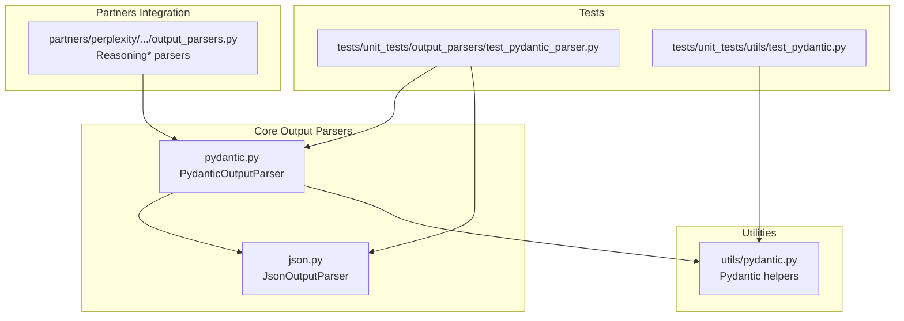
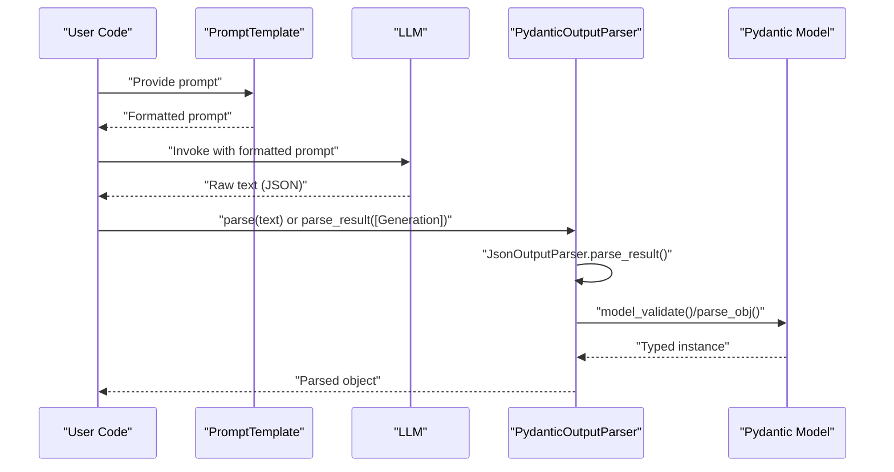
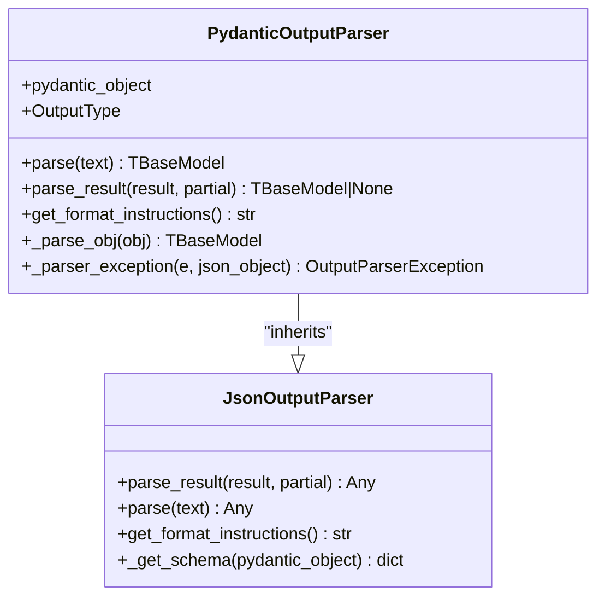
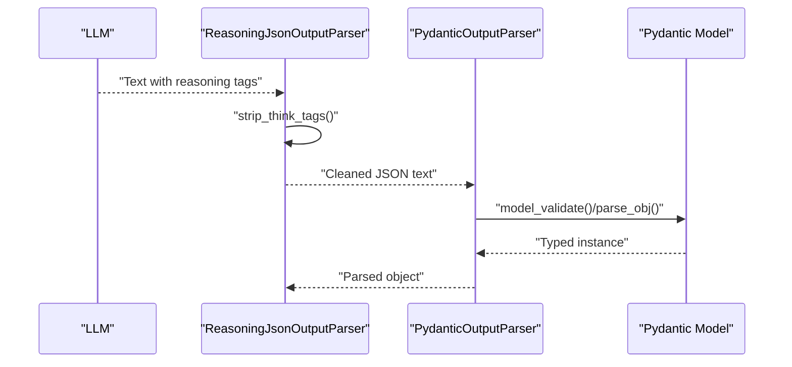
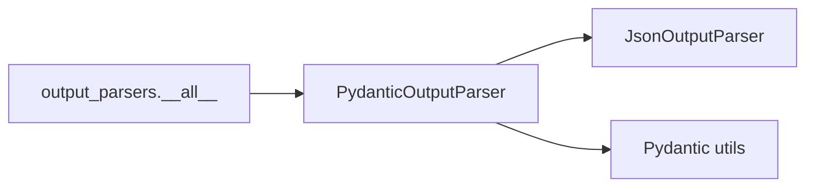

# Pydantic Parsing

<cite>
**Referenced Files in This Document**
- [pydantic.py](file://libs/core/langchain_core/output_parsers/pydantic.py)
- [json.py](file://libs/core/langchain_core/output_parsers/json.py)
- [pydantic.py](file://libs/core/langchain_core/utils/pydantic.py)
- [__init__.py](file://libs/core/langchain_core/output_parsers/__init__.py)
- [test_pydantic_parser.py](file://libs/core/tests/unit_tests/output_parsers/test_pydantic_parser.py)
- [test_pydantic.py](file://libs/core/tests/unit_tests/utils/test_pydantic.py)
- [output_parsers.py](file://libs/partners/perplexity/langchain_perplexity/output_parsers.py)
</cite>

## Table of Contents
1. [Introduction](#introduction)
2. [Project Structure](#project-structure)
3. [Core Components](#core-components)
4. [Architecture Overview](#architecture-overview)
5. [Detailed Component Analysis](#detailed-component-analysis)
6. [Dependency Analysis](#dependency-analysis)
7. [Performance Considerations](#performance-considerations)
8. [Troubleshooting Guide](#troubleshooting-guide)
9. [Conclusion](#conclusion)
10. [Appendices](#appendices)

## Introduction
This document explains Pydantic-based output parsing in LangChain with a focus on the PydanticOutputParser class. It covers how the parser integrates with Pydantic models to produce structured outputs, how the model parameter drives validation, how field-level validation and error reporting work, and how to compose the parser with prompts and LLMs. It also provides guidance on handling optional fields, nested models, custom validators, provider integration, prompt engineering, error recovery, model evolution, backward compatibility, and performance considerations.

## Project Structure
The Pydantic parsing capability is implemented in the core output parsers module and supported by utilities for Pydantic interoperability. Tests demonstrate usage patterns and validation behavior.

**Diagram sources**
- [pydantic.py](file://libs/core/langchain_core/output_parsers/pydantic.py#L1-L140)
- [json.py](file://libs/core/langchain_core/output_parsers/json.py#L1-L140)
- [pydantic.py](file://libs/core/langchain_core/utils/pydantic.py#L1-L585)
- [test_pydantic_parser.py](file://libs/core/tests/unit_tests/output_parsers/test_pydantic_parser.py#L1-L216)
- [test_pydantic.py](file://libs/core/tests/unit_tests/utils/test_pydantic.py#L1-L189)
- [output_parsers.py](file://libs/partners/perplexity/langchain_perplexity/output_parsers.py#L1-L89)

**Section sources**
- [pydantic.py](file://libs/core/langchain_core/output_parsers/pydantic.py#L1-L140)
- [json.py](file://libs/core/langchain_core/output_parsers/json.py#L1-L140)
- [pydantic.py](file://libs/core/langchain_core/utils/pydantic.py#L1-L585)
- [test_pydantic_parser.py](file://libs/core/tests/unit_tests/output_parsers/test_pydantic_parser.py#L1-L216)
- [test_pydantic.py](file://libs/core/tests/unit_tests/utils/test_pydantic.py#L1-L189)
- [output_parsers.py](file://libs/partners/perplexity/langchain_perplexity/output_parsers.py#L1-L89)

## Core Components
- PydanticOutputParser: Parses LLM outputs into strongly-typed Pydantic models, supporting both Pydantic v2 and v1. It validates JSON against the model’s schema and raises structured exceptions on failure.
- JsonOutputParser: Provides generic JSON parsing and schema generation; PydanticOutputParser inherits from it to reuse JSON parsing and format instruction generation.
- Pydantic utilities: Helpers for version detection, field introspection, subset model creation, and safe model construction.

Key responsibilities:
- Model parameter: The pydantic_object parameter defines the target schema for validation.
- Schema generation: Uses model_json_schema() or legacy schema() depending on version.
- Validation: Delegates to model_validate() (v2) or parse_obj() (v1) with robust error wrapping.
- Error handling: Converts validation failures into OutputParserException with the raw LLM output included.

**Section sources**
- [pydantic.py](file://libs/core/langchain_core/output_parsers/pydantic.py#L19-L122)
- [json.py](file://libs/core/langchain_core/output_parsers/json.py#L31-L128)
- [pydantic.py](file://libs/core/langchain_core/utils/pydantic.py#L78-L126)

## Architecture Overview
The parser sits between an LLM and downstream consumers, ensuring outputs are valid according to a Pydantic schema.

**Diagram sources**
- [pydantic.py](file://libs/core/langchain_core/output_parsers/pydantic.py#L55-L91)
- [json.py](file://libs/core/langchain_core/output_parsers/json.py#L61-L102)

## Detailed Component Analysis

### PydanticOutputParser
- Purpose: Convert raw LLM text into a typed Pydantic object using the provided model schema.
- Model parameter: pydantic_object controls the schema used for validation.
- Version handling: Supports both v2 (model_validate) and v1 (parse_obj); raises a clear exception for unsupported types.
- Validation pipeline:
  - parse_result delegates to JsonOutputParser.parse_result to extract a JSON object.
  - _parse_obj validates the dict against the model using the appropriate method per version.
  - On validation failure, _parser_exception wraps the error and attaches the raw LLM output.
- Optional parsing: parse_result supports partial=True to tolerate incomplete JSON; when partial is True and parsing fails, it returns None instead of raising.
- Format instructions: get_format_instructions generates a user-facing instruction string based on the model’s JSON schema, removing non-essential fields and preserving internationalized descriptions.

**Diagram sources**
- [pydantic.py](file://libs/core/langchain_core/output_parsers/pydantic.py#L19-L122)
- [json.py](file://libs/core/langchain_core/output_parsers/json.py#L31-L128)

**Section sources**
- [pydantic.py](file://libs/core/langchain_core/output_parsers/pydantic.py#L19-L122)

### JsonOutputParser (supporting role)
- Provides JSON extraction and partial JSON parsing for streaming scenarios.
- Supplies schema retrieval via model_json_schema() (v2) or schema() (v1).
- Generates format instructions for JSON outputs; PydanticOutputParser reuses this mechanism.

**Section sources**
- [json.py](file://libs/core/langchain_core/output_parsers/json.py#L31-L128)

### Pydantic utilities
- Version detection and compatibility helpers (e.g., is_basemodel_subclass, is_basemodel_instance).
- Subset model creation and field introspection for advanced use cases.
- Safe model construction utilities to avoid conflicts with reserved names.

**Section sources**
- [pydantic.py](file://libs/core/langchain_core/utils/pydantic.py#L78-L126)
- [pydantic.py](file://libs/core/langchain_core/utils/pydantic.py#L306-L341)
- [pydantic.py](file://libs/core/langchain_core/utils/pydantic.py#L272-L304)

### Practical examples and usage patterns
- Basic parsing and chaining with a prompt and LLM:
  - Demonstrated in tests where a PydanticOutputParser is composed into a runnable chain.
- Validation and error reporting:
  - Tests show that invalid JSON or schema violations raise OutputParserException with the raw LLM output embedded.
- Optional fields and nested models:
  - Tests exercise enums, optional fields, and literal constraints; utilities support subset models and field introspection for complex schemas.
- Prompt engineering for structured output:
  - get_format_instructions returns a schema-based instruction string suitable for inclusion in prompts.

**Section sources**
- [test_pydantic_parser.py](file://libs/core/tests/unit_tests/output_parsers/test_pydantic_parser.py#L40-L82)
- [test_pydantic_parser.py](file://libs/core/tests/unit_tests/output_parsers/test_pydantic_parser.py#L149-L166)
- [test_pydantic_parser.py](file://libs/core/tests/unit_tests/output_parsers/test_pydantic_parser.py#L191-L216)
- [test_pydantic.py](file://libs/core/tests/unit_tests/utils/test_pydantic.py#L110-L134)

### Integration with LLM providers and reasoning tags
- Provider-agnostic parsing: PydanticOutputParser relies on JsonOutputParser to extract JSON, making it compatible with any LLM that returns JSON text.
- Partner-specific wrappers: The Perplexity integration demonstrates a reusable pattern—strip reasoning tags from raw text before parsing—ensuring clean JSON for downstream validation.

**Diagram sources**
- [output_parsers.py](file://libs/partners/perplexity/langchain_perplexity/output_parsers.py#L38-L89)
- [pydantic.py](file://libs/core/langchain_core/output_parsers/pydantic.py#L25-L43)

**Section sources**
- [output_parsers.py](file://libs/partners/perplexity/langchain_perplexity/output_parsers.py#L38-L89)

### Error handling and recovery
- Validation errors: Wrapped into OutputParserException with llm_output attached for diagnostics.
- Partial parsing: When partial=True, incomplete JSON yields None instead of raising, enabling streaming-friendly workflows.
- Recovery strategies:
  - Retry with corrected prompt instructions.
  - Adjust model schema to relax constraints temporarily.
  - Use JsonOutputParser alone for initial extraction, then apply PydanticOutputParser later.

**Section sources**
- [pydantic.py](file://libs/core/langchain_core/output_parsers/pydantic.py#L37-L43)
- [pydantic.py](file://libs/core/langchain_core/output_parsers/pydantic.py#L74-L81)
- [json.py](file://libs/core/langchain_core/output_parsers/json.py#L61-L92)

### Prompt engineering for Pydantic output
- Use get_format_instructions to embed a precise JSON schema in the prompt.
- Keep instructions concise; rely on the schema to guide the model.
- Preserve non-ASCII content in descriptions; tests confirm Unicode preservation.

**Section sources**
- [pydantic.py](file://libs/core/langchain_core/output_parsers/pydantic.py#L93-L112)
- [test_pydantic_parser.py](file://libs/core/tests/unit_tests/output_parsers/test_pydantic_parser.py#L199-L216)

### Model evolution, backward compatibility, and performance
- Backward compatibility:
  - Supports both Pydantic v1 and v2 via version checks.
  - Re-exports core types for stability.
- Model evolution:
  - Add fields as optional to maintain backward compatibility.
  - Use subset models for evolving APIs while keeping older clients functional.
- Performance:
  - Prefer native structured output when supported by the LLM provider to reduce post-processing overhead.
  - Cache heavy schema computations if needed (utilities include caching for model creation).

**Section sources**
- [pydantic.py](file://libs/core/langchain_core/output_parsers/pydantic.py#L27-L35)
- [pydantic.py](file://libs/core/langchain_core/utils/pydantic.py#L411-L422)
- [pydantic.py](file://libs/core/langchain_core/utils/pydantic.py#L424-L434)

## Dependency Analysis
- PydanticOutputParser depends on JsonOutputParser for JSON extraction and on Pydantic utilities for version-aware schema handling.
- The output parsers package exposes PydanticOutputParser alongside other parsers, enabling flexible composition.

**Diagram sources**
- [pydantic.py](file://libs/core/langchain_core/output_parsers/pydantic.py#L1-L140)
- [json.py](file://libs/core/langchain_core/output_parsers/json.py#L1-L140)
- [__init__.py](file://libs/core/langchain_core/output_parsers/__init__.py#L52-L70)

**Section sources**
- [__init__.py](file://libs/core/langchain_core/output_parsers/__init__.py#L52-L70)

## Performance Considerations
- Prefer native structured output from providers when available to minimize post-processing.
- If using PydanticOutputParser, keep prompts concise and delegate schema precision to get_format_instructions.
- For streaming, use partial parsing to progressively validate partial JSON; otherwise, strict validation ensures correctness at the cost of latency.

[No sources needed since this section provides general guidance]

## Troubleshooting Guide
Common issues and resolutions:
- Validation errors: Inspect the OutputParserException message and llm_output field to identify mismatches between the model schema and the LLM’s response.
- Partial JSON: Enable partial=True to accept incomplete outputs during streaming; handle None returns gracefully.
- Non-ASCII descriptions: Ensure the prompt includes the schema generated by get_format_instructions to preserve Unicode descriptions.
- Provider-specific noise: Strip reasoning or interleaving tags before parsing, as demonstrated by the Perplexity integration.

**Section sources**
- [pydantic.py](file://libs/core/langchain_core/output_parsers/pydantic.py#L37-L43)
- [pydantic.py](file://libs/core/langchain_core/output_parsers/pydantic.py#L74-L81)
- [test_pydantic_parser.py](file://libs/core/tests/unit_tests/output_parsers/test_pydantic_parser.py#L199-L216)
- [output_parsers.py](file://libs/partners/perplexity/langchain_perplexity/output_parsers.py#L38-L89)

## Conclusion
PydanticOutputParser provides a robust bridge between LLM text outputs and strongly-typed data structures. By leveraging Pydantic’s schema validation, it enforces correctness, improves error reporting, and integrates cleanly with prompts and runnables. With support for both v1 and v2, optional parsing, and schema-driven instructions, it fits diverse production needs—from simple validations to complex nested models and evolving schemas.

[No sources needed since this section summarizes without analyzing specific files]

## Appendices

### Example workflows
- Simple parsing: Build a chain with a prompt, an LLM, and PydanticOutputParser; invoke to receive a typed object.
- Streaming with partial parsing: Use parse_result with partial=True to process incremental JSON; handle None returns until completion.
- Provider-specific preprocessing: Wrap PydanticOutputParser with a custom parser that strips provider-specific tags before validation.

**Section sources**
- [test_pydantic_parser.py](file://libs/core/tests/unit_tests/output_parsers/test_pydantic_parser.py#L40-L82)
- [output_parsers.py](file://libs/partners/perplexity/langchain_perplexity/output_parsers.py#L67-L89)