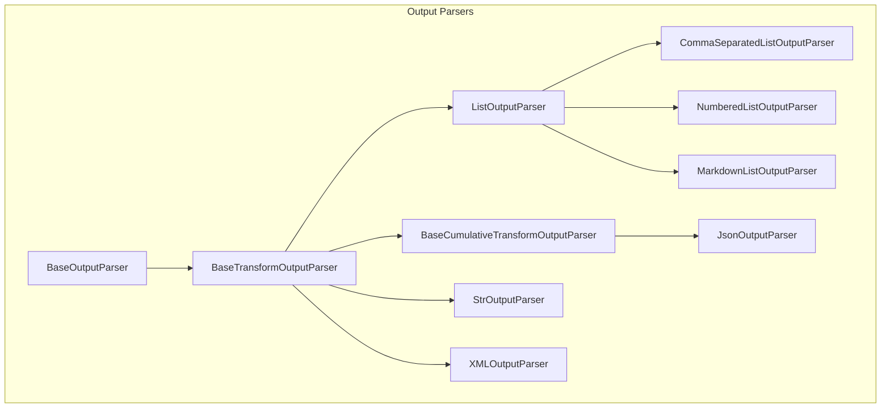
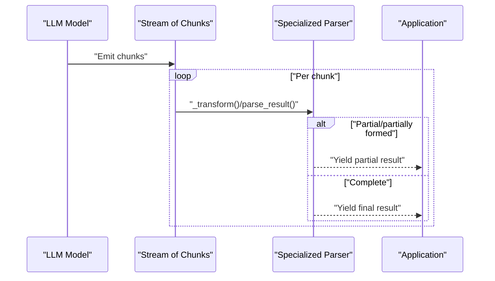
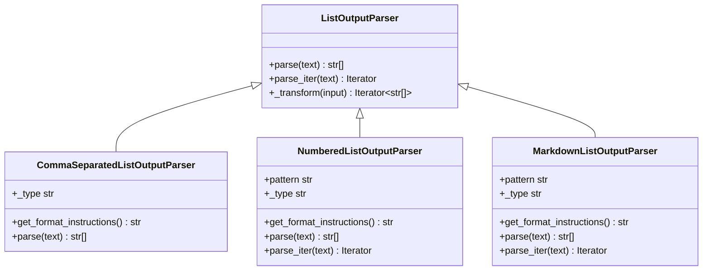
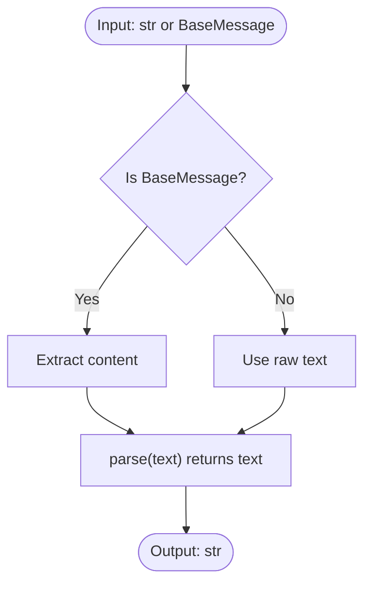
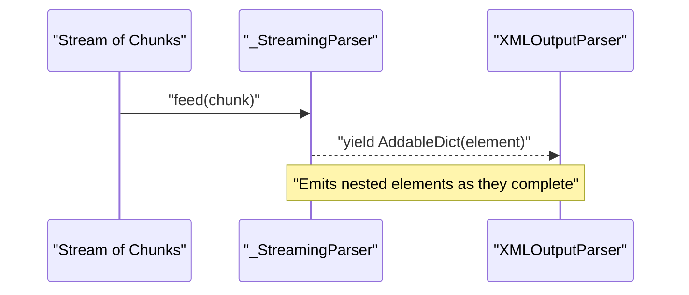
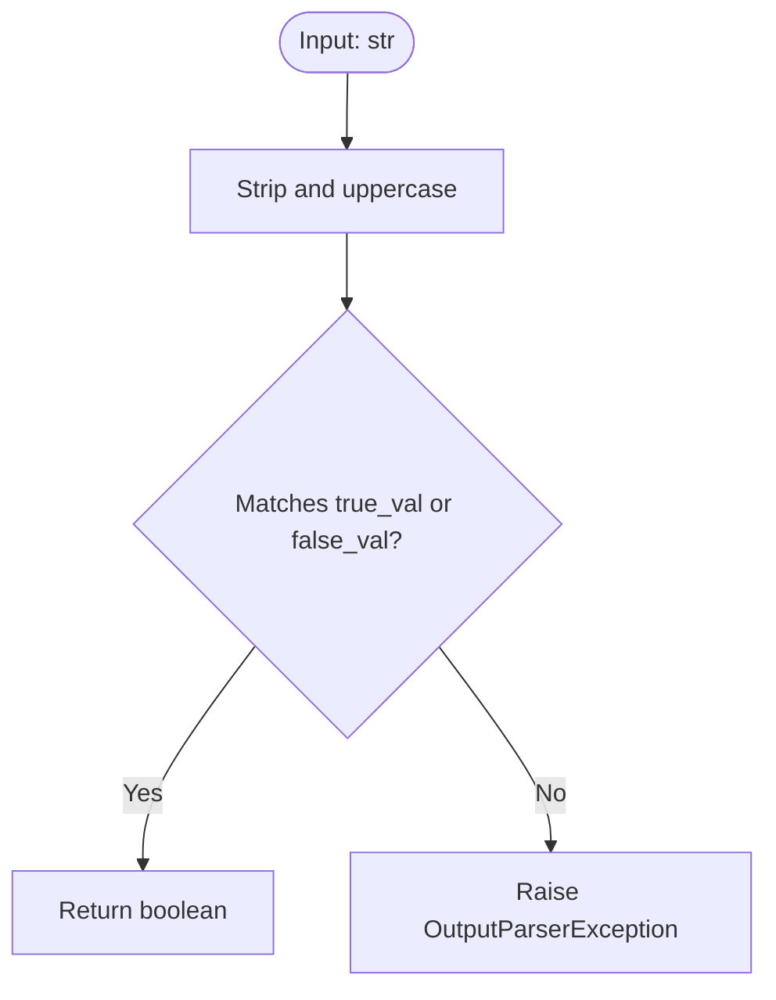
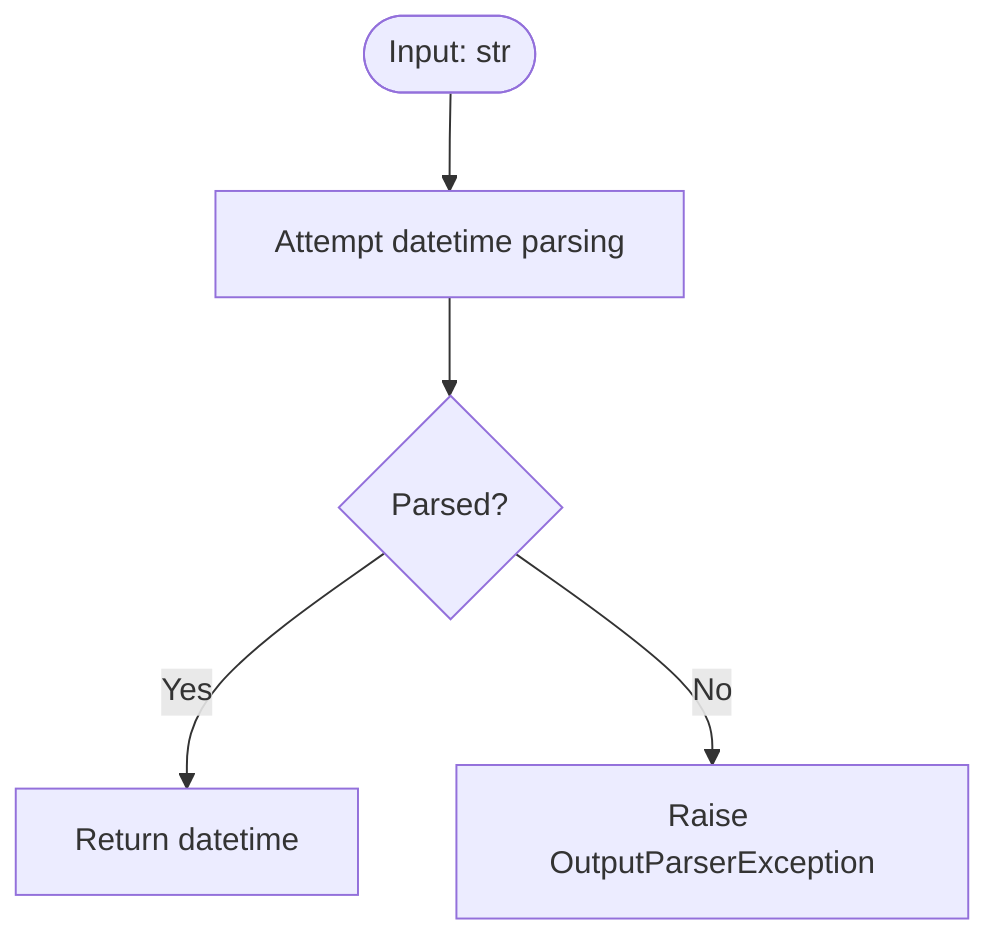
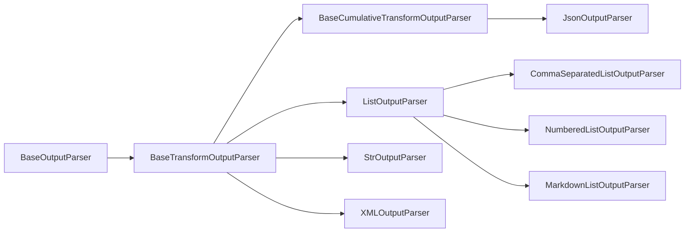

# Specialized Parsers

<cite>
**Referenced Files in This Document**
- [base.py](file://libs/core/langchain_core/output_parsers/base.py)
- [transform.py](file://libs/core/langchain_core/output_parsers/transform.py)
- [list.py](file://libs/core/langchain_core/output_parsers/list.py)
- [string.py](file://libs/core/langchain_core/output_parsers/string.py)
- [xml.py](file://libs/core/langchain_core/output_parsers/xml.py)
- [json.py](file://libs/core/langchain_core/output_parsers/json.py)
- [__init__.py](file://libs/core/langchain_core/output_parsers/__init__.py)
</cite>

## Table of Contents
1. [Introduction](#introduction)
2. [Project Structure](#project-structure)
3. [Core Components](#core-components)
4. [Architecture Overview](#architecture-overview)
5. [Detailed Component Analysis](#detailed-component-analysis)
6. [Dependency Analysis](#dependency-analysis)
7. [Performance Considerations](#performance-considerations)
8. [Troubleshooting Guide](#troubleshooting-guide)
9. [Conclusion](#conclusion)

## Introduction
This document focuses on specialized output parsers in LangChain Core that convert raw language model outputs into structured forms. It covers:
- ListOutputParser for parsing comma-separated or newline-separated lists
- StringOutputParser for plain text responses
- XMLOutputParser for XML-formatted outputs
- BooleanOutputParser for yes/no responses
- DatetimeOutputParser for date/time extraction

It explains the parse() method implementations, use cases, configuration options, error handling, validation strategies, performance characteristics, and extension guidelines. Practical examples are provided via code snippet paths to the relevant implementations.

## Project Structure
The specialized parsers live under the output_parsers package. They share a common inheritance hierarchy and rely on streaming-capable base classes for incremental processing.

**Diagram sources**
- [base.py](file://libs/core/langchain_core/output_parsers/base.py#L136-L349)
- [transform.py](file://libs/core/langchain_core/output_parsers/transform.py#L28-L176)
- [list.py](file://libs/core/langchain_core/output_parsers/list.py#L43-L250)
- [string.py](file://libs/core/langchain_core/output_parsers/string.py#L8-L64)
- [xml.py](file://libs/core/langchain_core/output_parsers/xml.py#L151-L301)
- [json.py](file://libs/core/langchain_core/output_parsers/json.py#L31-L140)

**Section sources**
- [__init__.py](file://libs/core/langchain_core/output_parsers/__init__.py#L1-L102)
- [base.py](file://libs/core/langchain_core/output_parsers/base.py#L136-L349)
- [transform.py](file://libs/core/langchain_core/output_parsers/transform.py#L28-L176)

## Core Components
- BaseOutputParser: Defines the parse(text) contract and integrates with Runnable semantics for synchronous/asynchronous invocation.
- BaseTransformOutputParser: Enables streaming transformations over iterators of chunks (strings or AIMessage-like objects).
- BaseCumulativeTransformOutputParser: Adds cumulative/partial parsing for streaming, optionally emitting diffs.

These base classes are the foundation for list, string, XML, and JSON parsers.

**Section sources**
- [base.py](file://libs/core/langchain_core/output_parsers/base.py#L136-L349)
- [transform.py](file://libs/core/langchain_core/output_parsers/transform.py#L28-L176)

## Architecture Overview
The parsers follow a layered design:
- Text or message chunks arrive as streams.
- Streaming-aware base classes accumulate or transform incrementally.
- Specialized parsers implement parse() and, where applicable, streaming helpers like parse_iter() or _transform().

**Diagram sources**
- [transform.py](file://libs/core/langchain_core/output_parsers/transform.py#L28-L176)
- [base.py](file://libs/core/langchain_core/output_parsers/base.py#L246-L308)

## Detailed Component Analysis

### ListOutputParser Family
Purpose:
- Convert raw text into structured lists using different list formats.

Key classes:
- ListOutputParser: Abstract base for list parsing with streaming support.
- CommaSeparatedListOutputParser: Parses comma-separated values with robust fallback.
- NumberedListOutputParser: Matches numbered lists with regex.
- MarkdownListOutputParser: Matches Markdown bullet lists with regex.

Implementation highlights:
- parse(): Converts raw text to a list of strings.
- parse_iter(): Optional regex iterator for streaming.
- _transform(): Accumulates chunks and yields completed list items progressively.

Common configuration options:
- None for the abstract class; subclasses expose format-specific instructions via get_format_instructions().

Edge cases and validation:
- Comma-separated parser falls back to splitting on commas if CSV parsing fails.
- Regex-based parsers rely on multiline patterns; ensure input matches expected list styles.

Practical usage examples (paths):
- Comma-separated list parsing: [parse()](file://libs/core/langchain_core/output_parsers/list.py#L164-L182)
- Numbered list parsing: [parse()](file://libs/core/langchain_core/output_parsers/list.py#L201-L210), [parse_iter()](file://libs/core/langchain_core/output_parsers/list.py#L213-L214)
- Markdown list parsing: [parse()](file://libs/core/langchain_core/output_parsers/list.py#L232-L241), [parse_iter()](file://libs/core/langchain_core/output_parsers/list.py#L244-L245)
- Streaming behavior: [_transform()](file://libs/core/langchain_core/output_parsers/list.py#L73-L136)

Integration tips:
- Use CommaSeparatedListOutputParser when you want a simple comma-delimited list.
- Use NumberedListOutputParser or MarkdownListOutputParser when the model is instructed to produce ordered or bullet lists respectively.

**Diagram sources**
- [list.py](file://libs/core/langchain_core/output_parsers/list.py#L43-L250)

**Section sources**
- [list.py](file://libs/core/langchain_core/output_parsers/list.py#L43-L250)

### StringOutputParser
Purpose:
- Extract plain text from model outputs, supporting streaming.

Key points:
- parse(): Returns the input text unchanged.
- Streaming: transform() yields chunks as they arrive.

Configuration options:
- Serialization metadata exposed via is_lc_serializable(), get_lc_namespace(), and _type.

Practical usage examples (paths):
- Basic string extraction: [parse()](file://libs/core/langchain_core/output_parsers/string.py#L61-L63)
- Streaming usage: [StrOutputParser docs and example](file://libs/core/langchain_core/output_parsers/string.py#L17-L35)

Integration tips:
- Use when downstream steps require raw strings (logging, storage, or further processing).

**Diagram sources**
- [string.py](file://libs/core/langchain_core/output_parsers/string.py#L8-L64)
- [transform.py](file://libs/core/langchain_core/output_parsers/transform.py#L28-L96)

**Section sources**
- [string.py](file://libs/core/langchain_core/output_parsers/string.py#L8-L64)

### XMLOutputParser
Purpose:
- Parse XML-formatted outputs into dictionaries, with streaming support.

Key points:
- parse(): Converts XML to a dictionary; supports extracting XML from fenced code blocks and removing encoding declarations.
- Streaming: _transform() uses a streaming parser to emit nested elements as they complete.
- Security: parser option allows choosing between defusedxml (secure) and standard xml libraries.

Configuration options:
- tags: Expected XML tags to guide formatting.
- parser: "defusedxml" or "xml".
- get_format_instructions(): Provides XML formatting guidance.

Practical usage examples (paths):
- XML parsing: [parse()](file://libs/core/langchain_core/output_parsers/xml.py#L206-L251)
- Streaming parsing: [_transform()](file://libs/core/langchain_core/output_parsers/xml.py#L253-L267)
- Streaming helper: [_StreamingParser](file://libs/core/langchain_core/output_parsers/xml.py#L42-L149)

Error handling:
- Raises OutputParserException on malformed XML.
- ImportErrors when defusedxml is requested but not installed.

**Diagram sources**
- [xml.py](file://libs/core/langchain_core/output_parsers/xml.py#L42-L149)
- [xml.py](file://libs/core/langchain_core/output_parsers/xml.py#L253-L267)

**Section sources**
- [xml.py](file://libs/core/langchain_core/output_parsers/xml.py#L151-L301)

### BooleanOutputParser
Purpose:
- Convert free-text responses into boolean values with strict validation.

Implementation highlights:
- parse(): Validates against configured true/false strings and raises OutputParserException on mismatch.
- get_format_instructions(): Provides explicit formatting guidance to the model.

Configuration options:
- true_val, false_val: Case-insensitive accepted values.
- get_format_instructions(): Guides the model to produce expected tokens.

Practical usage examples (paths):
- Implementation example in base class docs: [BooleanOutputParser example](file://libs/core/langchain_core/output_parsers/base.py#L148-L168)

Error handling:
- Raises OutputParserException when input does not match accepted values.

**Diagram sources**
- [base.py](file://libs/core/langchain_core/output_parsers/base.py#L148-L168)

**Section sources**
- [base.py](file://libs/core/langchain_core/output_parsers/base.py#L148-L168)

### DatetimeOutputParser
Purpose:
- Extract date/time values from model outputs.

Implementation highlights:
- parse(): Applies datetime parsing logic to extract temporal values.
- get_format_instructions(): Advises the model to produce ISO-like or specified formats.

Configuration options:
- Accepts timezone-aware or naive datetimes depending on parsing logic.
- get_format_instructions(): Encourages consistent, machine-readable formats.

Practical usage examples (paths):
- Implementation example in base class docs: [DatetimeOutputParser example](file://libs/core/langchain_core/output_parsers/base.py#L148-L168)

Error handling:
- Raises OutputParserException when the input cannot be parsed as a datetime.

**Diagram sources**
- [base.py](file://libs/core/langchain_core/output_parsers/base.py#L148-L168)

**Section sources**
- [base.py](file://libs/core/langchain_core/output_parsers/base.py#L148-L168)

## Dependency Analysis
Relationships among the specialized parsers and their base classes:

**Diagram sources**
- [base.py](file://libs/core/langchain_core/output_parsers/base.py#L136-L349)
- [transform.py](file://libs/core/langchain_core/output_parsers/transform.py#L28-L176)
- [list.py](file://libs/core/langchain_core/output_parsers/list.py#L43-L250)
- [string.py](file://libs/core/langchain_core/output_parsers/string.py#L8-L64)
- [xml.py](file://libs/core/langchain_core/output_parsers/xml.py#L151-L301)
- [json.py](file://libs/core/langchain_core/output_parsers/json.py#L31-L140)

**Section sources**
- [__init__.py](file://libs/core/langchain_core/output_parsers/__init__.py#L52-L90)

## Performance Considerations
- Streaming-first design:
  - BaseTransformOutputParser and BaseCumulativeTransformOutputParser minimize memory overhead by yielding results incrementally.
  - For list parsers, parse_iter() enables early emission of completed items during streaming.
- Regex-based parsers:
  - NumberedListOutputParser and MarkdownListOutputParser rely on compiled patterns; ensure patterns are efficient and anchored appropriately.
- XML parsing:
  - Using defusedxml is safer and recommended; it may introduce a small overhead compared to standard xml but prevents vulnerabilities.
  - Streaming XML parsing avoids buffering entire documents.
- JSON parsing:
  - Partial JSON parsing in BaseCumulativeTransformOutputParser reduces latency by emitting updates as keys arrive.
- Memory and CPU:
  - Prefer streaming parsers for long-running generations to reduce peak memory usage.
  - Avoid excessive re-parsing by leveraging incremental parsing and diffs where supported.

[No sources needed since this section provides general guidance]

## Troubleshooting Guide
Common issues and resolutions:
- Malformed XML:
  - Symptom: OutputParserException during parse().
  - Resolution: Ensure the model returns well-formed XML; use get_format_instructions() to guide formatting; confirm defusedxml is installed if parser="defusedxml".
  - References: [parse()](file://libs/core/langchain_core/output_parsers/xml.py#L206-L251), [get_format_instructions()](file://libs/core/langchain_core/output_parsers/xml.py#L202-L204)
- Unparsable list:
  - Symptom: Unexpected empty list or missing items.
  - Resolution: Verify list format; use NumberedListOutputParser or MarkdownListOutputParser for structured lists; ensure get_format_instructions() is followed.
  - References: [NumberedListOutputParser.parse()](file://libs/core/langchain_core/output_parsers/list.py#L201-L210), [MarkdownListOutputParser.parse()](file://libs/core/langchain_core/output_parsers/list.py#L232-L241)
- CSV parsing failure:
  - Symptom: Fallback splitting behavior for comma-separated lists.
  - Resolution: Ensure inputs adhere to CSV conventions; consider escaping or quoting.
  - References: [CommaSeparatedListOutputParser.parse()](file://libs/core/langchain_core/output_parsers/list.py#L164-L182)
- Boolean mismatch:
  - Symptom: OutputParserException indicating unexpected value.
  - Resolution: Align true_val/false_val with model instructions; use get_format_instructions() to constrain output.
  - References: [BooleanOutputParser example](file://libs/core/langchain_core/output_parsers/base.py#L148-L168)
- Datetime parsing errors:
  - Symptom: OutputParserException when parsing datetime.
  - Resolution: Provide ISO-like or clearly specified formats; use get_format_instructions() to guide the model.
  - References: [DatetimeOutputParser example](file://libs/core/langchain_core/output_parsers/base.py#L148-L168)

**Section sources**
- [xml.py](file://libs/core/langchain_core/output_parsers/xml.py#L206-L251)
- [list.py](file://libs/core/langchain_core/output_parsers/list.py#L164-L182)
- [base.py](file://libs/core/langchain_core/output_parsers/base.py#L148-L168)

## Conclusion
LangChain’s specialized output parsers provide robust, streaming-friendly mechanisms to convert raw model outputs into structured data:
- Use ListOutputParser family for list-like outputs with appropriate format guidance.
- Use StringOutputParser for plain text extraction and streaming.
- Use XMLOutputParser for XML with safety and streaming support.
- Use BooleanOutputParser and DatetimeOutputParser for constrained, validated outputs.
Choose streaming-capable parsers for latency-sensitive applications, and prefer native structured output when supported by your LLM provider. Extend existing parsers by subclassing the appropriate base class and implementing parse() and, where applicable, streaming helpers.