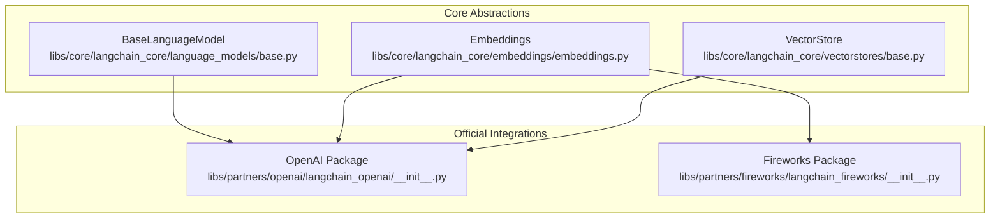
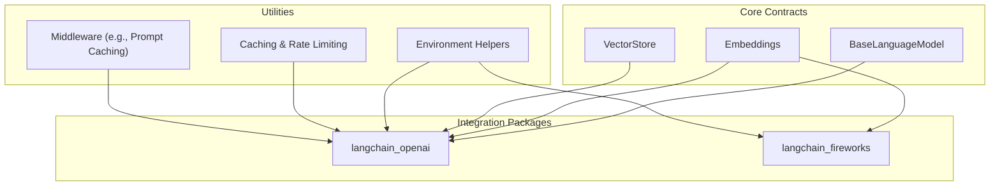
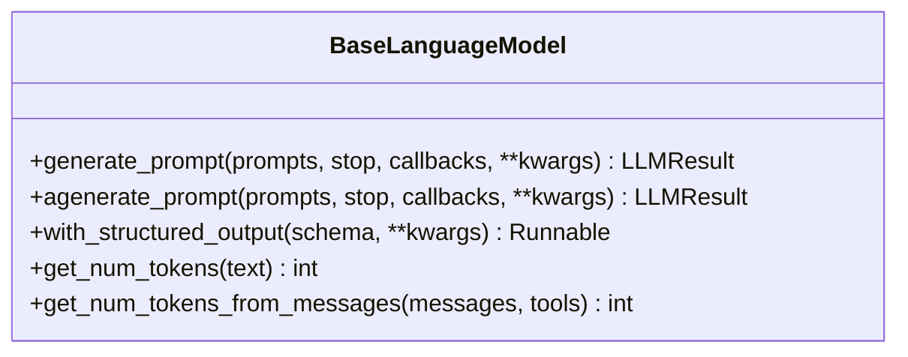
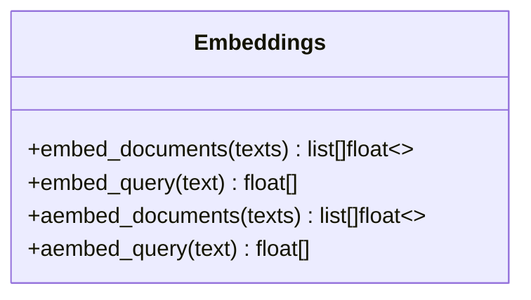
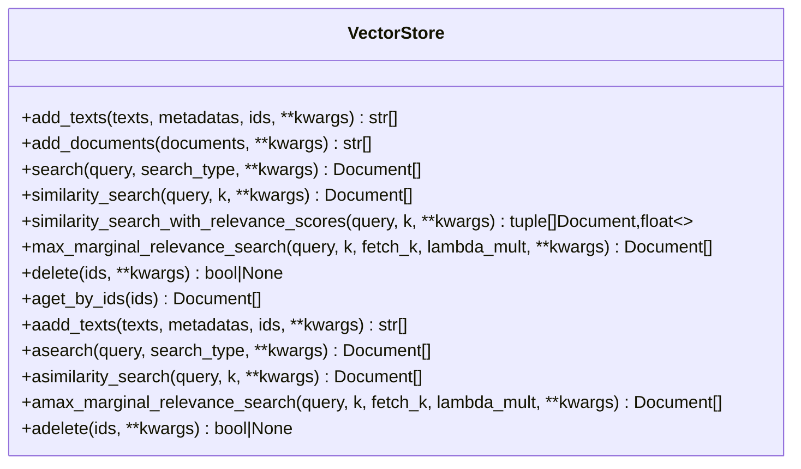
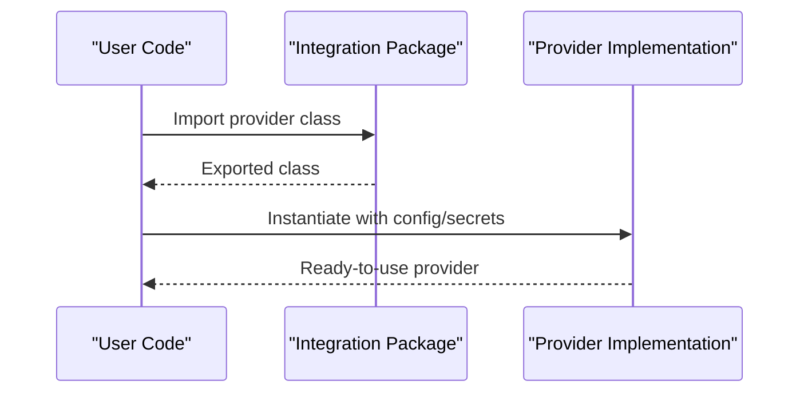
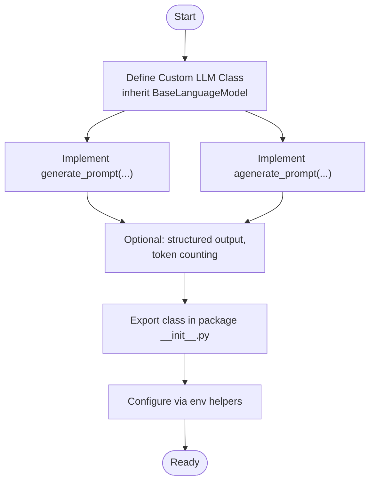
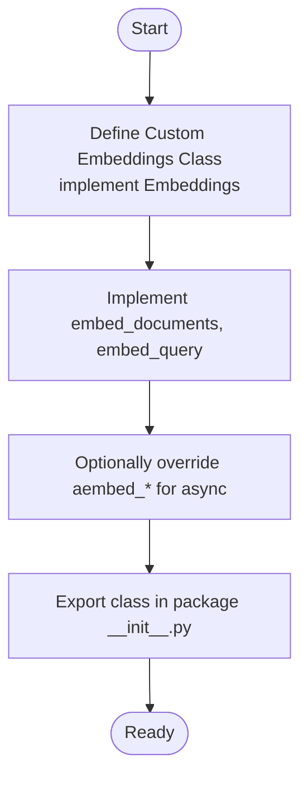
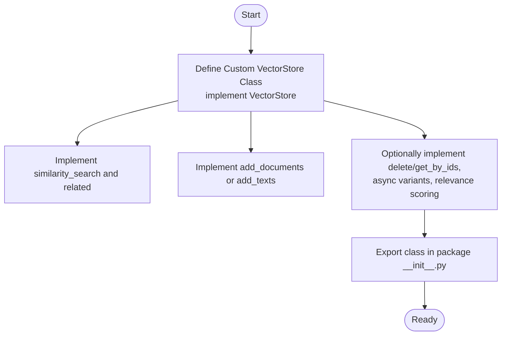
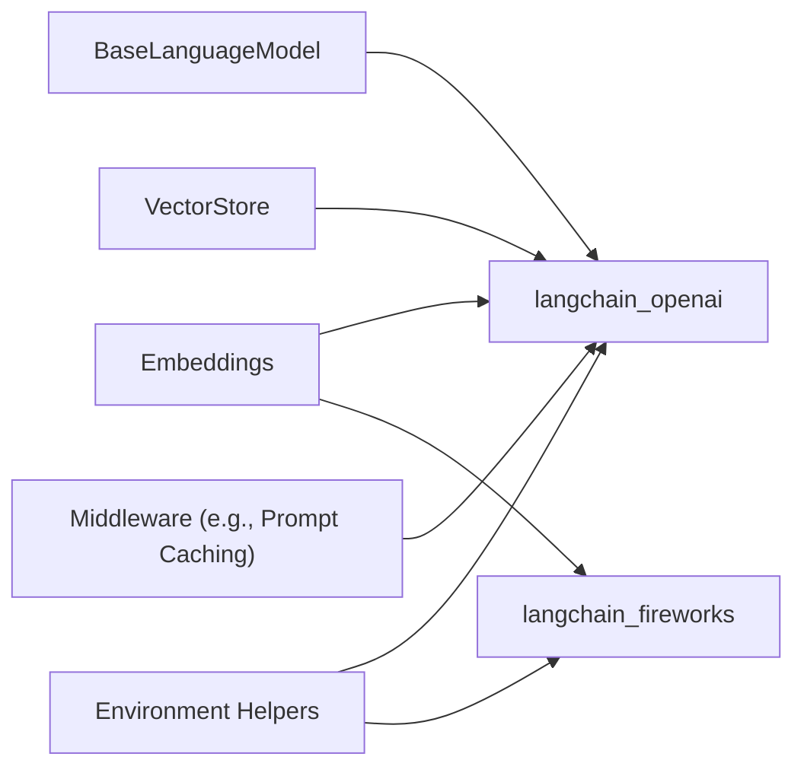

# Custom Provider Development

<cite>
**Referenced Files in This Document**
- [base.py](file://libs/core/langchain_core/language_models/base.py)
- [embeddings.py](file://libs/core/langchain_core/embeddings/embeddings.py)
- [base.py](file://libs/core/langchain_core/vectorstores/base.py)
- [__init__.py](file://libs/partners/openai/langchain_openai/__init__.py)
- [__init__.py](file://libs/partners/fireworks/langchain_fireworks/__init__.py)
- [chat_models.py](file://libs/core/langchain_core/language_models/chat_models.py)
- [env.py](file://libs/core/langchain_core/utils/env.py)
- [utils.py](file://libs/core/langchain_core/utils/utils.py)
- [prompt_caching.py](file://libs/partners/anthropic/langchain_anthropic/middleware/prompt_caching.py)
- [test_rate_limiting.py](file://libs/core/tests/unit_tests/language_models/chat_models/test_rate_limiting.py)
- [test_in_memory_rate_limiter.py](file://libs/core/tests/unit_tests/rate_limiters/test_in_memory_rate_limiter.py)
</cite>

## Table of Contents
1. [Introduction](#introduction)
2. [Project Structure](#project-structure)
3. [Core Components](#core-components)
4. [Architecture Overview](#architecture-overview)
5. [Detailed Component Analysis](#detailed-component-analysis)
6. [Dependency Analysis](#dependency-analysis)
7. [Performance Considerations](#performance-considerations)
8. [Troubleshooting Guide](#troubleshooting-guide)
9. [Conclusion](#conclusion)
10. [Appendices](#appendices)

## Introduction
This document explains how to build custom provider integrations for LangChain across three primary domains:
- Language model providers (text and chat)
- Embedding providers
- Vector store providers

It covers the provider interface contracts, required and optional methods, configuration and authentication patterns, registration mechanisms, testing strategies, performance optimization, and packaging/distribution approaches. The goal is to enable developers to implement robust, production-ready integrations for proprietary APIs or specialized services.

## Project Structure
LangChain’s core abstractions live under the core library, while official integrations are distributed as separate packages under the partners namespace. Integrations are exposed via module-level exports and often include middleware and utilities.

**Diagram sources**
- [base.py](file://libs/core/langchain_core/language_models/base.py#L131-L366)
- [embeddings.py](file://libs/core/langchain_core/embeddings/embeddings.py#L8-L79)
- [base.py](file://libs/core/langchain_core/vectorstores/base.py#L43-L800)
- [__init__.py](file://libs/partners/openai/langchain_openai/__init__.py#L1-L17)
- [__init__.py](file://libs/partners/fireworks/langchain_fireworks/__init__.py#L1-L14)

**Section sources**
- [base.py](file://libs/core/langchain_core/language_models/base.py#L1-L366)
- [embeddings.py](file://libs/core/langchain_core/embeddings/embeddings.py#L1-L79)
- [base.py](file://libs/core/langchain_core/vectorstores/base.py#L1-L800)
- [__init__.py](file://libs/partners/openai/langchain_openai/__init__.py#L1-L17)
- [__init__.py](file://libs/partners/fireworks/langchain_fireworks/__init__.py#L1-L14)

## Core Components
This section outlines the provider contracts and capabilities you must implement when building custom providers.

- Language Model Providers
  - Contract: Implement a class inheriting from the base language model abstraction and define the required generation methods.
  - Required methods:
    - Synchronous: generate_prompt(...)
    - Asynchronous: agenerate_prompt(...)
  - Optional enhancements:
    - Structured output adapter: with_structured_output(...)
    - Token counting: get_num_tokens(...) and get_num_tokens_from_messages(...)
    - Caching and rate limiting hooks (see caching and rate limiting patterns below)
  - See: [BaseLanguageModel](file://libs/core/langchain_core/language_models/base.py#L131-L366)

- Embedding Providers
  - Contract: Implement the Embeddings interface.
  - Required methods:
    - embed_documents(list[str]) -> list[list[float]]
    - embed_query(str) -> list[float]
  - Optional enhancements:
    - Async overrides aembed_documents(...) and aembed_query(...) for performance
  - See: [Embeddings](file://libs/core/langchain_core/embeddings/embeddings.py#L8-L79)

- Vector Store Providers
  - Contract: Implement the VectorStore interface.
  - Required methods:
    - similarity_search(query, k, ...) and related search variants
    - add_documents(...) and add_texts(...) (one must be implemented; the other can delegate)
    - delete(ids, ...)
  - Optional enhancements:
    - Async variants: asearch(...), aadd_documents(...), adelete(...)
    - Relevance scoring normalization via _select_relevance_score_fn()
  - See: [VectorStore](file://libs/core/langchain_core/vectorstores/base.py#L43-L800)

**Section sources**
- [base.py](file://libs/core/langchain_core/language_models/base.py#L131-L366)
- [embeddings.py](file://libs/core/langchain_core/embeddings/embeddings.py#L8-L79)
- [base.py](file://libs/core/langchain_core/vectorstores/base.py#L43-L800)

## Architecture Overview
The provider ecosystem follows a layered architecture:
- Core abstractions define the contracts for LLMs, embeddings, and vector stores.
- Official integrations (partners) implement these contracts and export public classes.
- Utilities support configuration, secrets, and middleware (e.g., caching).

**Diagram sources**
- [base.py](file://libs/core/langchain_core/language_models/base.py#L131-L366)
- [embeddings.py](file://libs/core/langchain_core/embeddings/embeddings.py#L8-L79)
- [base.py](file://libs/core/langchain_core/vectorstores/base.py#L43-L800)
- [__init__.py](file://libs/partners/openai/langchain_openai/__init__.py#L1-L17)
- [__init__.py](file://libs/partners/fireworks/langchain_fireworks/__init__.py#L1-L14)
- [env.py](file://libs/core/langchain_core/utils/env.py#L60-L86)
- [prompt_caching.py](file://libs/partners/anthropic/langchain_anthropic/middleware/prompt_caching.py#L108-L147)

## Detailed Component Analysis

### Language Model Provider Contract
- Required methods
  - generate_prompt(prompts, stop, callbacks, **kwargs) -> LLMResult
  - agenerate_prompt(prompts, stop, callbacks, **kwargs) -> LLMResult
- Optional enhancements
  - with_structured_output(schema, **kwargs) -> Runnable
  - get_num_tokens(text) and get_num_tokens_from_messages(messages, tools)
- Caching and rate limiting
  - The runtime supports caching and rate limiting around generation calls. Implementations can leverage these via the base class hooks and utilities.

**Diagram sources**
- [base.py](file://libs/core/langchain_core/language_models/base.py#L131-L366)

**Section sources**
- [base.py](file://libs/core/langchain_core/language_models/base.py#L131-L366)

### Embedding Provider Contract
- Required methods
  - embed_documents(texts) -> list[list[float]]
  - embed_query(text) -> list[float]
- Async overrides
  - aembed_documents(...) and aembed_query(...) are provided by default; override for native async performance

**Diagram sources**
- [embeddings.py](file://libs/core/langchain_core/embeddings/embeddings.py#L8-L79)

**Section sources**
- [embeddings.py](file://libs/core/langchain_core/embeddings/embeddings.py#L8-L79)

### Vector Store Provider Contract
- Required methods
  - similarity_search(query, k, ...) and related search variants
  - add_documents(documents, ...) or add_texts(texts, metadatas, ids, ...)
  - delete(ids, ...)
- Optional enhancements
  - Async variants: asearch(...), aadd_documents(...), adelete(...)
  - Relevance score normalization via _select_relevance_score_fn()

**Diagram sources**
- [base.py](file://libs/core/langchain_core/vectorstores/base.py#L43-L800)

**Section sources**
- [base.py](file://libs/core/langchain_core/vectorstores/base.py#L43-L800)

### Provider Registration and Configuration Patterns
- Registration via package exports
  - Integrations expose their classes at the package level so users can import directly from the integration package.
  - Examples:
    - [OpenAI exports](file://libs/partners/openai/langchain_openai/__init__.py#L1-L17)
    - [Fireworks exports](file://libs/partners/fireworks/langchain_fireworks/__init__.py#L1-L14)
- Configuration and secrets
  - Environment helpers provide factories for secrets and values, enabling clean configuration patterns.
  - Examples:
    - [get_from_env](file://libs/core/langchain_core/utils/env.py#L60-L86)
    - [from_env](file://libs/core/langchain_core/utils/utils.py#L368-L408)
- Authentication
  - Implement authentication in your provider class initialization (e.g., API keys, tokens) and use the environment helpers to source credentials.
  - Reference the environment utilities above for secure configuration patterns.

**Diagram sources**
- [__init__.py](file://libs/partners/openai/langchain_openai/__init__.py#L1-L17)
- [__init__.py](file://libs/partners/fireworks/langchain_fireworks/__init__.py#L1-L14)
- [env.py](file://libs/core/langchain_core/utils/env.py#L60-L86)
- [utils.py](file://libs/core/langchain_core/utils/utils.py#L368-L408)

**Section sources**
- [__init__.py](file://libs/partners/openai/langchain_openai/__init__.py#L1-L17)
- [__init__.py](file://libs/partners/fireworks/langchain_fireworks/__init__.py#L1-L14)
- [env.py](file://libs/core/langchain_core/utils/env.py#L60-L86)
- [utils.py](file://libs/core/langchain_core/utils/utils.py#L368-L408)

### Step-by-Step Example: Creating a Custom LLM Provider
- Define a class that inherits from the base language model abstraction.
- Implement generate_prompt and agenerate_prompt.
- Optionally implement structured output and token counting.
- Expose the class via your package’s __init__.py.
- Add environment-based configuration and authentication in the constructor.

**Diagram sources**
- [base.py](file://libs/core/langchain_core/language_models/base.py#L131-L366)
- [__init__.py](file://libs/partners/openai/langchain_openai/__init__.py#L1-L17)
- [env.py](file://libs/core/langchain_core/utils/env.py#L60-L86)

**Section sources**
- [base.py](file://libs/core/langchain_core/language_models/base.py#L131-L366)
- [__init__.py](file://libs/partners/openai/langchain_openai/__init__.py#L1-L17)
- [env.py](file://libs/core/langchain_core/utils/env.py#L60-L86)

### Step-by-Step Example: Creating a Custom Embedding Provider
- Define a class that implements Embeddings.
- Implement embed_documents and embed_query.
- Optionally override aembed_documents and aembed_query for native async performance.
- Export the class via your package’s __init__.py.

**Diagram sources**
- [embeddings.py](file://libs/core/langchain_core/embeddings/embeddings.py#L8-L79)
- [__init__.py](file://libs/partners/fireworks/langchain_fireworks/__init__.py#L1-L14)

**Section sources**
- [embeddings.py](file://libs/core/langchain_core/embeddings/embeddings.py#L8-L79)
- [__init__.py](file://libs/partners/fireworks/langchain_fireworks/__init__.py#L1-L14)

### Step-by-Step Example: Creating a Custom Vector Store Provider
- Define a class that implements VectorStore.
- Implement similarity_search and related methods.
- Implement add_documents or add_texts (and optionally delete, get_by_ids).
- Optionally implement async variants and relevance score normalization.
- Export the class via your package’s __init__.py.

**Diagram sources**
- [base.py](file://libs/core/langchain_core/vectorstores/base.py#L43-L800)
- [__init__.py](file://libs/partners/openai/langchain_openai/__init__.py#L1-L17)

**Section sources**
- [base.py](file://libs/core/langchain_core/vectorstores/base.py#L43-L800)
- [__init__.py](file://libs/partners/openai/langchain_openai/__init__.py#L1-L17)

## Dependency Analysis
Providers depend on core abstractions and may integrate with utilities for configuration and middleware.

**Diagram sources**
- [base.py](file://libs/core/langchain_core/language_models/base.py#L131-L366)
- [embeddings.py](file://libs/core/langchain_core/embeddings/embeddings.py#L8-L79)
- [base.py](file://libs/core/langchain_core/vectorstores/base.py#L43-L800)
- [__init__.py](file://libs/partners/openai/langchain_openai/__init__.py#L1-L17)
- [__init__.py](file://libs/partners/fireworks/langchain_fireworks/__init__.py#L1-L14)
- [env.py](file://libs/core/langchain_core/utils/env.py#L60-L86)
- [prompt_caching.py](file://libs/partners/anthropic/langchain_anthropic/middleware/prompt_caching.py#L108-L147)

**Section sources**
- [base.py](file://libs/core/langchain_core/language_models/base.py#L131-L366)
- [embeddings.py](file://libs/core/langchain_core/embeddings/embeddings.py#L8-L79)
- [base.py](file://libs/core/langchain_core/vectorstores/base.py#L43-L800)
- [__init__.py](file://libs/partners/openai/langchain_openai/__init__.py#L1-L17)
- [__init__.py](file://libs/partners/fireworks/langchain_fireworks/__init__.py#L1-L14)
- [env.py](file://libs/core/langchain_core/utils/env.py#L60-L86)
- [prompt_caching.py](file://libs/partners/anthropic/langchain_anthropic/middleware/prompt_caching.py#L108-L147)

## Performance Considerations
- Prefer native async implementations for embeddings and vector store operations to reduce thread overhead.
- Use caching and rate limiting to reduce redundant calls and respect provider quotas.
  - Caching pattern: [Caching around generation](file://libs/core/langchain_core/language_models/chat_models.py#L1262-L1300)
  - Rate limiting tests: [Rate limiting behavior](file://libs/core/tests/unit_tests/language_models/chat_models/test_rate_limiting.py#L182-L222), [Token bucket behavior](file://libs/core/tests/unit_tests/rate_limiters/test_in_memory_rate_limiter.py#L52-L72)
- Normalize relevance scores consistently in vector stores to ensure predictable retrieval quality.
- Minimize unnecessary conversions and leverage batching where supported by the provider API.

**Section sources**
- [chat_models.py](file://libs/core/langchain_core/language_models/chat_models.py#L1262-L1300)
- [test_rate_limiting.py](file://libs/core/tests/unit_tests/language_models/chat_models/test_rate_limiting.py#L182-L222)
- [test_in_memory_rate_limiter.py](file://libs/core/tests/unit_tests/rate_limiters/test_in_memory_rate_limiter.py#L52-L72)
- [base.py](file://libs/core/langchain_core/vectorstores/base.py#L403-L415)

## Troubleshooting Guide
- Authentication failures
  - Ensure environment variables are set and loaded via the environment helpers.
  - Reference: [Environment helpers](file://libs/core/langchain_core/utils/env.py#L60-L86)
- Missing required methods
  - Verify that your provider implements all required methods from the respective interface.
  - References:
    - [BaseLanguageModel](file://libs/core/langchain_core/language_models/base.py#L198-L284)
    - [Embeddings](file://libs/core/langchain_core/embeddings/embeddings.py#L36-L78)
    - [VectorStore](file://libs/core/langchain_core/vectorstores/base.py#L293-L784)
- Caching and rate limiting
  - Confirm that caching is enabled and working as expected; verify rate limiter behavior in tests.
  - References:
    - [Caching pattern](file://libs/core/langchain_core/language_models/chat_models.py#L1262-L1300)
    - [Rate limiting tests](file://libs/core/tests/unit_tests/language_models/chat_models/test_rate_limiting.py#L182-L222)
- Relevance score normalization
  - Implement a proper relevance score function in your vector store to ensure scores fall within [0, 1].

**Section sources**
- [env.py](file://libs/core/langchain_core/utils/env.py#L60-L86)
- [base.py](file://libs/core/langchain_core/language_models/base.py#L198-L284)
- [embeddings.py](file://libs/core/langchain_core/embeddings/embeddings.py#L36-L78)
- [base.py](file://libs/core/langchain_core/vectorstores/base.py#L293-L784)
- [chat_models.py](file://libs/core/langchain_core/language_models/chat_models.py#L1262-L1300)
- [test_rate_limiting.py](file://libs/core/tests/unit_tests/language_models/chat_models/test_rate_limiting.py#L182-L222)

## Conclusion
By adhering to the core provider contracts, leveraging environment-based configuration, and integrating caching and rate limiting, you can build reliable, performant custom providers for LangChain. Official integration packages demonstrate clean registration patterns and optional middleware, serving as templates for your own implementations.

## Appendices
- Packaging and distribution
  - Export your provider classes in your package’s __init__.py so users can import directly from your integration.
  - Reference: [OpenAI exports](file://libs/partners/openai/langchain_openai/__init__.py#L1-L17), [Fireworks exports](file://libs/partners/fireworks/langchain_fireworks/__init__.py#L1-L14)
- Middleware examples
  - Use middleware patterns (e.g., prompt caching) to optimize provider calls.
  - Reference: [Prompt caching middleware](file://libs/partners/anthropic/langchain_anthropic/middleware/prompt_caching.py#L108-L147)

**Section sources**
- [__init__.py](file://libs/partners/openai/langchain_openai/__init__.py#L1-L17)
- [__init__.py](file://libs/partners/fireworks/langchain_fireworks/__init__.py#L1-L14)
- [prompt_caching.py](file://libs/partners/anthropic/langchain_anthropic/middleware/prompt_caching.py#L108-L147)