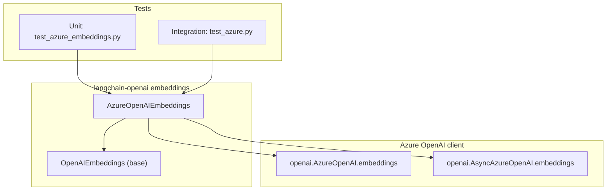
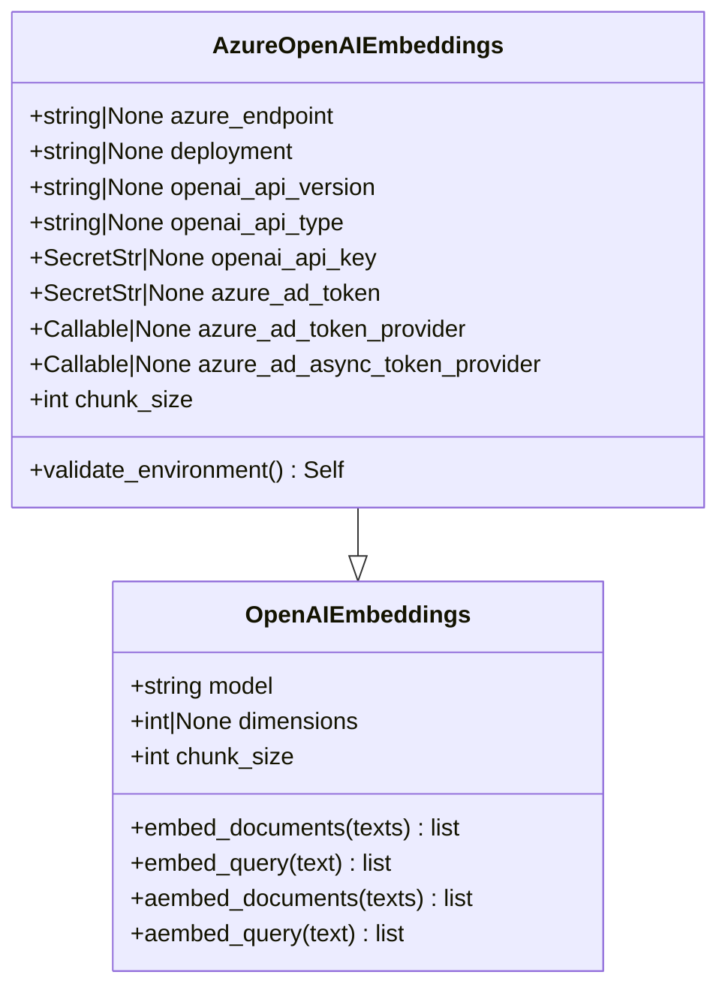
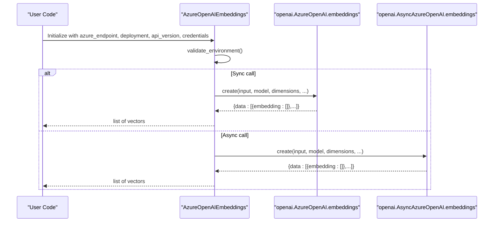
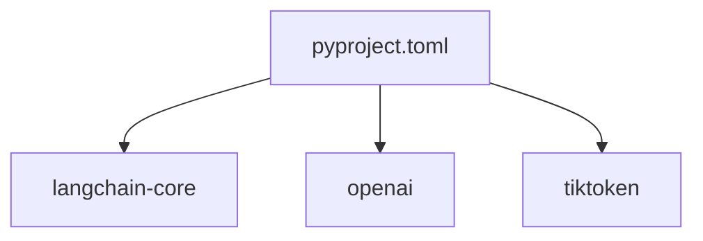

# Azure OpenAI Embeddings

<cite>
**Referenced Files in This Document**
- [azure.py](file://libs/partners/openai/langchain_openai/embeddings/azure.py)
- [base.py](file://libs/partners/openai/langchain_openai/embeddings/base.py)
- [azure.py](file://libs/partners/openai/langchain_openai/chat_models/azure.py)
- [test_azure_embeddings.py](file://libs/partners/openai/tests/unit_tests/embeddings/test_azure_embeddings.py)
- [test_azure.py](file://libs/partners/openai/tests/integration_tests/embeddings/test_azure.py)
- [__init__.py](file://libs/partners/openai/langchain_openai/embeddings/__init__.py)
- [azure_openai.py](file://libs/langchain/langchain_classic/embeddings/azure_openai.py)
- [pyproject.toml](file://libs/partners/openai/pyproject.toml)
- [README.md](file://libs/partners/openai/README.md)
</cite>

## Table of Contents
1. [Introduction](#introduction)
2. [Project Structure](#project-structure)
3. [Core Components](#core-components)
4. [Architecture Overview](#architecture-overview)
5. [Detailed Component Analysis](#detailed-component-analysis)
6. [Dependency Analysis](#dependency-analysis)
7. [Performance Considerations](#performance-considerations)
8. [Troubleshooting Guide](#troubleshooting-guide)
9. [Conclusion](#conclusion)
10. [Appendices](#appendices)

## Introduction
This document explains how Azure OpenAI embeddings are integrated in LangChain via the langchain-openai package. It covers the Azure-specific configuration (endpoint, deployment name, API version), authentication methods (API key, Azure AD token, token provider), differences from standard OpenAI embeddings, regional availability considerations, enterprise security features, practical configuration examples, and operational guidance for cost optimization and monitoring.

## Project Structure
The Azure OpenAI embeddings implementation resides in the langchain-openai package under the embeddings module. The primary class extends the generic OpenAI embeddings base and adds Azure-specific fields and client initialization logic. Unit and integration tests validate initialization and runtime behavior.

**Diagram sources**
- [azure.py](file://libs/partners/openai/langchain_openai/embeddings/azure.py#L16-L231)
- [base.py](file://libs/partners/openai/langchain_openai/embeddings/base.py#L86-L773)
- [test_azure_embeddings.py](file://libs/partners/openai/tests/unit_tests/embeddings/test_azure_embeddings.py#L1-L29)
- [test_azure.py](file://libs/partners/openai/tests/integration_tests/embeddings/test_azure.py#L1-L134)

**Section sources**
- [azure.py](file://libs/partners/openai/langchain_openai/embeddings/azure.py#L1-L231)
- [base.py](file://libs/partners/openai/langchain_openai/embeddings/base.py#L1-L773)
- [test_azure_embeddings.py](file://libs/partners/openai/tests/unit_tests/embeddings/test_azure_embeddings.py#L1-L29)
- [test_azure.py](file://libs/partners/openai/tests/integration_tests/embeddings/test_azure.py#L1-L134)

## Core Components
- AzureOpenAIEmbeddings: Azure-specific embeddings class that configures the Azure endpoint, deployment name, API version, and authentication (API key or Azure AD token/token provider). It constructs synchronous and asynchronous Azure OpenAI clients and exposes standard embedding APIs.
- OpenAIEmbeddings (base): Shared base class providing tokenization, batching, normalization, and embedding generation logic used by both standard OpenAI and Azure OpenAI embeddings.

Key Azure-specific fields and behaviors:
- azure_endpoint: Azure resource endpoint URL.
- deployment (alias azure_deployment): Deployment name used to target a specific model deployment.
- openai_api_version: Azure API version string.
- openai_api_type: Defaults to "azure".
- openai_api_key: Supports Azure API key or legacy OPENAI_API_KEY for backward compatibility.
- azure_ad_token and azure_ad_token_provider: Azure AD token and provider functions for token-based authentication.
- chunk_size: Defaults to 2048 for Azure embeddings.

**Section sources**
- [azure.py](file://libs/partners/openai/langchain_openai/embeddings/azure.py#L98-L231)
- [base.py](file://libs/partners/openai/langchain_openai/embeddings/base.py#L86-L773)

## Architecture Overview
AzureOpenAIEmbeddings composes the OpenAI embeddings base and initializes Azure-specific clients. It validates environment and configuration, constructs both sync and async clients, and delegates embedding creation to the Azure OpenAI embeddings API.

**Diagram sources**
- [base.py](file://libs/partners/openai/langchain_openai/embeddings/base.py#L86-L773)
- [azure.py](file://libs/partners/openai/langchain_openai/embeddings/azure.py#L16-L231)

## Detailed Component Analysis

### AzureOpenAIEmbeddings: Authentication and Endpoint Configuration
- Environment and field precedence:
  - azure_endpoint: Reads AZURE_OPENAI_ENDPOINT if not provided.
  - openai_api_key: Reads AZURE_OPENAI_API_KEY or OPENAI_API_KEY (legacy).
  - openai_api_version: Defaults to a specific version if not provided.
  - openai_api_type: Defaults to "azure".
- Authentication modes:
  - API key: Provided via environment variable or constructor argument.
  - Azure AD token: Provided via AZURE_OPENAI_AD_TOKEN or via token provider functions for sync and async.
- Deployment targeting:
  - deployment (alias azure_deployment) sets the base client URL to include the deployment path. When set, do not set base_url/openai_api_base.
- Client construction:
  - Synchronous client: openai.AzureOpenAI(...).embeddings
  - Asynchronous client: openai.AsyncAzureOpenAI(...).embeddings
- Validation:
  - Ensures base_url vs azure_endpoint usage is consistent.
  - Prevents conflicting base_url and deployment configurations.

**Diagram sources**
- [azure.py](file://libs/partners/openai/langchain_openai/embeddings/azure.py#L162-L226)
- [base.py](file://libs/partners/openai/langchain_openai/embeddings/base.py#L527-L773)

**Section sources**
- [azure.py](file://libs/partners/openai/langchain_openai/embeddings/azure.py#L98-L231)

### Differences from Standard OpenAI Embeddings
- Endpoint and deployment:
  - AzureOpenAIEmbeddings uses azure_endpoint and deployment to construct Azure-specific URLs.
  - Standard OpenAIEmbeddings uses base_url and model directly.
- Authentication:
  - Azure supports AZURE_OPENAI_AD_TOKEN and token provider functions.
  - Standard OpenAIEmbeddings uses OPENAI_API_KEY.
- Chunk size defaults:
  - AzureOpenAIEmbeddings defaults to 2048 per batch.
  - OpenAIEmbeddings defaults to 1000 per batch.
- Validation:
  - AzureOpenAIEmbeddings enforces correct base_url vs deployment usage.

**Section sources**
- [azure.py](file://libs/partners/openai/langchain_openai/embeddings/azure.py#L158-L207)
- [base.py](file://libs/partners/openai/langchain_openai/embeddings/base.py#L226-L227)

### Regional Availability and Enterprise Security Features
- Regional endpoints:
  - Configure azure_endpoint to point to the appropriate Azure region for your deployment.
- Enterprise security:
  - Azure AD token and token provider enable workload identity and managed identity scenarios.
  - Private endpoints can be used by pointing azure_endpoint to a private DNS alias for your Azure OpenAI resource.
- Compliance and governance:
  - Azure OpenAI integrates with Microsoft compliance offerings; configure access policies and audit logging at the Azure resource level.

[No sources needed since this section provides general guidance]

### Practical Configuration Examples
- Basic API key configuration:
  - Set AZURE_OPENAI_API_KEY and AZURE_OPENAI_ENDPOINT.
  - Provide azure_endpoint and deployment in the constructor or via environment variables.
- Azure AD token configuration:
  - Set AZURE_OPENAI_AD_TOKEN or provide azure_ad_token_provider/azure_ad_async_token_provider.
- Dimensional embeddings:
  - For supported models, set dimensions to control output dimensionality.
- Async usage:
  - Use aembed_documents/aembed_query for asynchronous embedding generation.

**Section sources**
- [azure.py](file://libs/partners/openai/langchain_openai/embeddings/azure.py#L31-L96)
- [test_azure_embeddings.py](file://libs/partners/openai/tests/unit_tests/embeddings/test_azure_embeddings.py#L7-L28)

### Validation and Error Handling
- Validation ensures:
  - Correct base_url vs deployment usage.
  - Consistent API version and endpoint configuration.
- Errors:
  - Misconfiguration raises ValueError with actionable messages.
  - Empty string handling normalizes embeddings consistently.

**Section sources**
- [azure.py](file://libs/partners/openai/langchain_openai/embeddings/azure.py#L162-L186)
- [test_azure.py](file://libs/partners/openai/tests/integration_tests/embeddings/test_azure.py#L100-L121)

### Tokenization, Batching, and Normalization
- Tokenization:
  - Uses tiktoken by default; can be disabled for non-OpenAI-compatible endpoints.
- Batching:
  - Processes inputs in chunks respecting embedding_ctx_length and configured chunk_size.
- Normalization:
  - Results are normalized to unit vectors.

**Section sources**
- [base.py](file://libs/partners/openai/langchain_openai/embeddings/base.py#L429-L597)
- [test_azure.py](file://libs/partners/openai/tests/integration_tests/embeddings/test_azure.py#L124-L133)

## Dependency Analysis
The langchain-openai package depends on:
- langchain-core for core abstractions and utilities.
- openai SDK for Azure client integration.
- tiktoken for tokenization.

**Diagram sources**
- [pyproject.toml](file://libs/partners/openai/pyproject.toml#L14-L18)

**Section sources**
- [pyproject.toml](file://libs/partners/openai/pyproject.toml#L1-L157)
- [README.md](file://libs/partners/openai/README.md#L1-L33)

## Performance Considerations
- Batch size:
  - AzureOpenAIEmbeddings defaults to 2048 per batch; adjust chunk_size if needed.
- Token limits:
  - The base class enforces a maximum token limit per request and splits long inputs safely.
- Async operations:
  - Prefer async embedding APIs for throughput in high-volume scenarios.
- Cost optimization:
  - Use dimensional embeddings where supported to reduce vector size.
  - Monitor token usage and normalize embeddings to reduce storage overhead.

[No sources needed since this section provides general guidance]

## Troubleshooting Guide
Common issues and resolutions:
- Incorrect base_url vs deployment:
  - Ensure you use azure_endpoint and deployment together, not base_url and deployment simultaneously.
- Missing credentials:
  - Verify AZURE_OPENAI_API_KEY or AZURE_OPENAI_AD_TOKEN is set appropriately.
- Empty string embeddings:
  - The system returns a cached normalized embedding for empty strings; this is expected behavior.
- Async-only token provider:
  - Provide azure_ad_async_token_provider for async calls; otherwise, provide azure_ad_token_provider.

**Section sources**
- [azure.py](file://libs/partners/openai/langchain_openai/embeddings/azure.py#L162-L226)
- [test_azure.py](file://libs/partners/openai/tests/integration_tests/embeddings/test_azure.py#L100-L121)

## Conclusion
Azure OpenAI embeddings in LangChain provide a robust, enterprise-grade solution for vector generation with Azure-specific configuration, authentication, and validation. By leveraging API keys, Azure AD tokens, and token providers, teams can integrate secure, region-aware embeddings into production systems. Proper configuration of endpoints, deployments, and batching enables efficient and cost-effective operations.

[No sources needed since this section summarizes without analyzing specific files]

## Appendices

### API Reference Highlights
- AzureOpenAIEmbeddings fields:
  - azure_endpoint, deployment, openai_api_version, openai_api_type, openai_api_key, azure_ad_token, azure_ad_token_provider, azure_ad_async_token_provider, chunk_size.
- Methods:
  - embed_documents, embed_query, aembed_documents, aembed_query.

**Section sources**
- [azure.py](file://libs/partners/openai/langchain_openai/embeddings/azure.py#L98-L231)
- [base.py](file://libs/partners/openai/langchain_openai/embeddings/base.py#L677-L773)

### Legacy Import Compatibility
- Classic LangChain compatibility shim for AzureOpenAIEmbeddings remains available for legacy imports.

**Section sources**
- [azure_openai.py](file://libs/langchain/langchain_classic/embeddings/azure_openai.py#L1-L24)