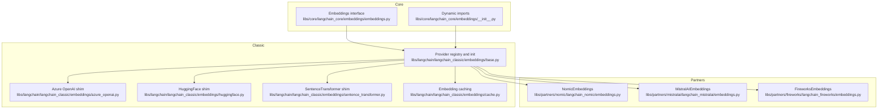
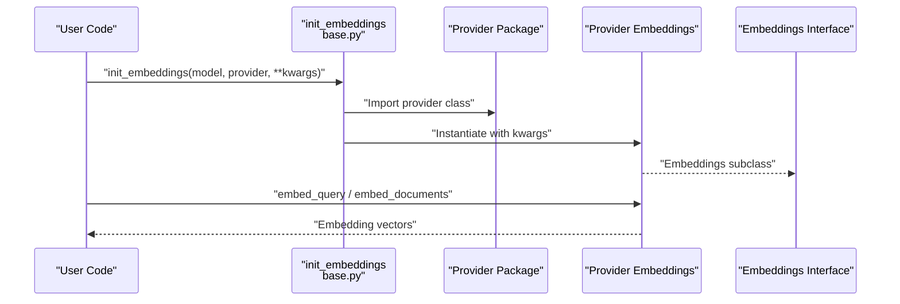
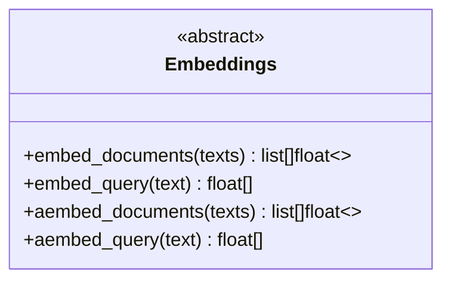
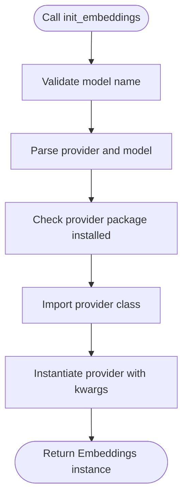
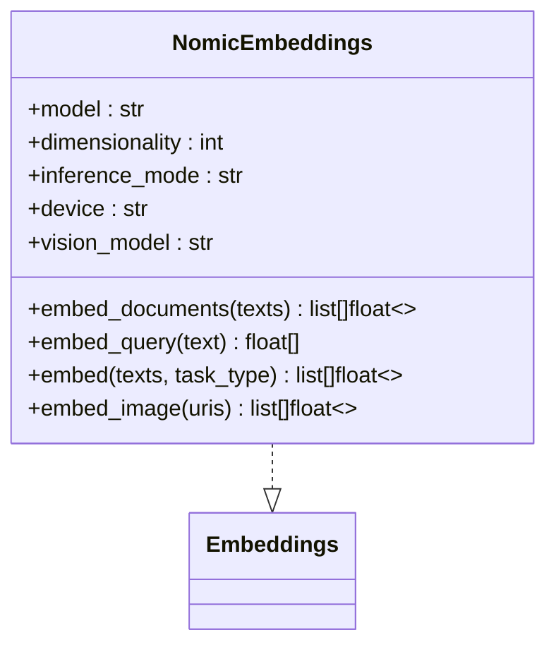
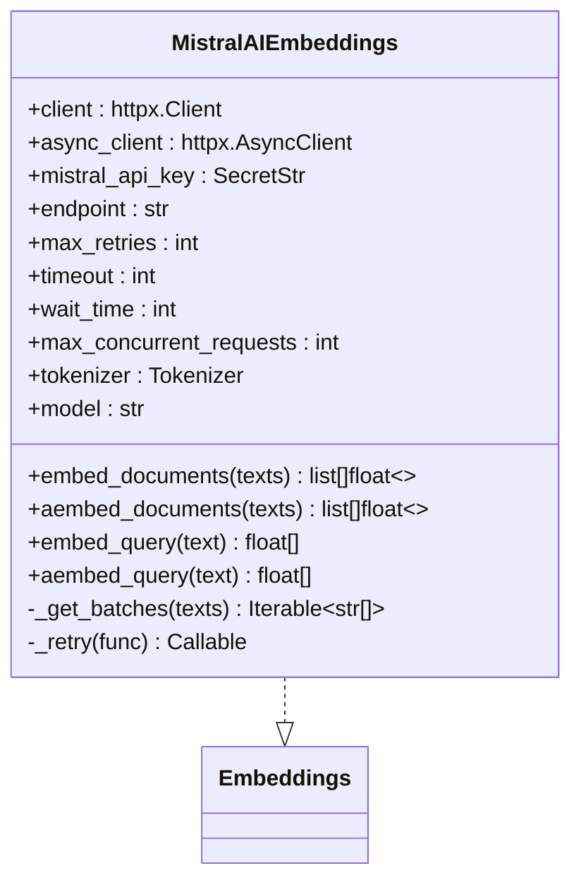
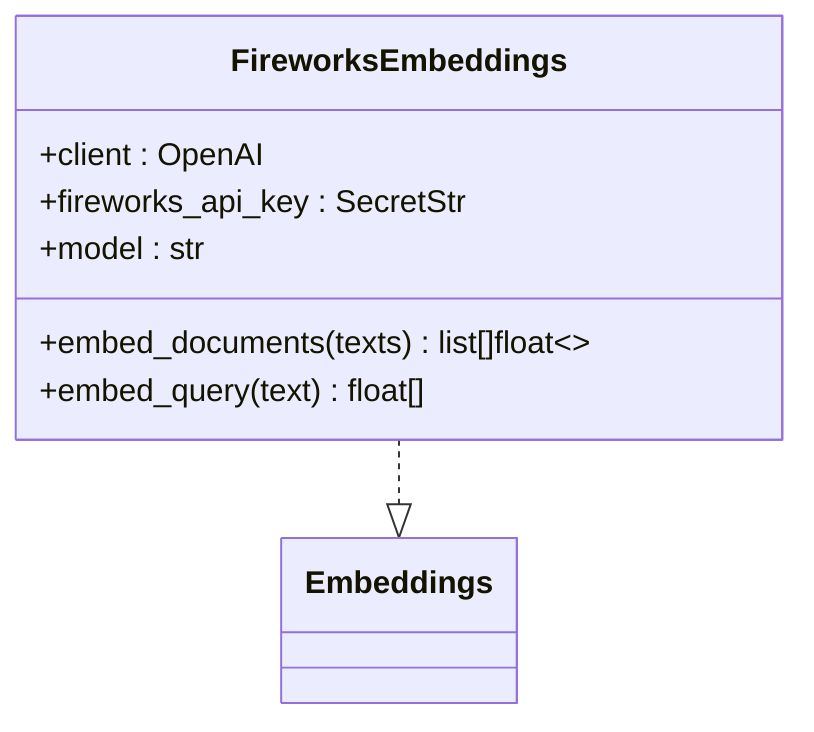

# Embedding Providers

<cite>
**Referenced Files in This Document**
- [embeddings.py](file://libs/core/langchain_core/embeddings/embeddings.py)
- [__init__.py](file://libs/core/langchain_core/embeddings/__init__.py)
- [base.py](file://libs/langchain/langchain_classic/embeddings/base.py)
- [embeddings.py](file://libs/partners/nomic/langchain_nomic/embeddings.py)
- [embeddings.py](file://libs/partners/mistralai/langchain_mistralai/embeddings.py)
- [embeddings.py](file://libs/partners/fireworks/langchain_fireworks/embeddings.py)
- [openai.py](file://libs/langchain/langchain_classic/embeddings/openai.py)
- [azure_openai.py](file://libs/langchain/langchain_classic/embeddings/azure_openai.py)
- [huggingface.py](file://libs/langchain/langchain_classic/embeddings/huggingface.py)
- [sentence_transformer.py](file://libs/langchain/langchain_classic/embeddings/sentence_transformer.py)
- [cache.py](file://libs/langchain/langchain_classic/embeddings/cache.py)
- [vectorstores/base.py](file://libs/core/langchain_core/vectorstores/base.py)
- [indexing/base.py](file://libs/core/langchain_core/indexing/base.py)
- [chains/router/embedding_router.py](file://libs/langchain/langchain_classic/chains/router/embedding_router.py)
- [document_transformers/embeddings_redundant_filter.py](file://libs/langchain/langchain_classic/document_transformers/embeddings_redundant_filter.py)
</cite>

## Table of Contents
1. [Introduction](#introduction)
2. [Project Structure](#project-structure)
3. [Core Components](#core-components)
4. [Architecture Overview](#architecture-overview)
5. [Detailed Component Analysis](#detailed-component-analysis)
6. [Dependency Analysis](#dependency-analysis)
7. [Performance Considerations](#performance-considerations)
8. [Troubleshooting Guide](#troubleshooting-guide)
9. [Conclusion](#conclusion)
10. [Appendices](#appendices)

## Introduction
This document explains how LangChain integrates embedding providers for document processing and similarity search. It covers the unified Embeddings interface, provider initialization, and concrete implementations for major providers such as OpenAI, Azure OpenAI, HuggingFace, Mistral AI, Nomic, and Fireworks. It also details configuration, authentication, batch processing, performance characteristics, and practical guidance for selecting and optimizing embeddings across use cases.

## Project Structure
LangChain organizes embedding capabilities across three layers:
- Core interface and dynamic imports
- Classic provider initialization and routing
- Partner-specific provider implementations

**Diagram sources**
- [embeddings.py](file://libs/core/langchain_core/embeddings/embeddings.py#L8-L79)
- [__init__.py](file://libs/core/langchain_core/embeddings/__init__.py#L1-L32)
- [base.py](file://libs/langchain/langchain_classic/embeddings/base.py#L1-L252)
- [azure_openai.py](file://libs/langchain/langchain_classic/embeddings/azure_openai.py)
- [huggingface.py](file://libs/langchain/langchain_classic/embeddings/huggingface.py)
- [sentence_transformer.py](file://libs/langchain/langchain_classic/embeddings/sentence_transformer.py)
- [cache.py](file://libs/langchain/langchain_classic/embeddings/cache.py)
- [embeddings.py](file://libs/partners/nomic/langchain_nomic/embeddings.py#L13-L150)
- [embeddings.py](file://libs/partners/mistralai/langchain_mistralai/embeddings.py#L40-L330)
- [embeddings.py](file://libs/partners/fireworks/langchain_fireworks/embeddings.py#L8-L108)

**Section sources**
- [embeddings.py](file://libs/core/langchain_core/embeddings/embeddings.py#L1-L79)
- [__init__.py](file://libs/core/langchain_core/embeddings/__init__.py#L1-L32)
- [base.py](file://libs/langchain/langchain_classic/embeddings/base.py#L1-L252)

## Core Components
- Embeddings interface: Defines synchronous and asynchronous methods for embedding queries and document lists. It standardizes the contract for all providers.
- Dynamic imports: Core exposes lazy-loading of Embeddings and related types.
- Provider registry and initializer: Classic layer supports a model string format and maps providers to their integration packages, validating installation and constructing the correct provider class.

Key responsibilities:
- Unified API surface for embeddings
- Provider resolution and package availability checks
- Initialization of provider-specific embedding classes

**Section sources**
- [embeddings.py](file://libs/core/langchain_core/embeddings/embeddings.py#L8-L79)
- [__init__.py](file://libs/core/langchain_core/embeddings/__init__.py#L16-L31)
- [base.py](file://libs/langchain/langchain_classic/embeddings/base.py#L117-L245)

## Architecture Overview
The embedding pipeline connects user-defined models to provider implementations, enabling batch processing and asynchronous execution where supported.

**Diagram sources**
- [base.py](file://libs/langchain/langchain_classic/embeddings/base.py#L128-L245)
- [embeddings.py](file://libs/core/langchain_core/embeddings/embeddings.py#L36-L79)

## Detailed Component Analysis

### Embeddings Interface
The core interface defines:
- Synchronous methods: embed_query and embed_documents
- Asynchronous methods: aembed_query and aembed_documents with default executor-based fallback

**Diagram sources**
- [embeddings.py](file://libs/core/langchain_core/embeddings/embeddings.py#L8-L79)

**Section sources**
- [embeddings.py](file://libs/core/langchain_core/embeddings/embeddings.py#L8-L79)

### Provider Registry and Initialization
The classic layer:
- Supports model strings like "provider:model-name"
- Validates provider against a supported list
- Checks for required integration packages
- Instantiates the correct provider class

**Diagram sources**
- [base.py](file://libs/langchain/langchain_classic/embeddings/base.py#L128-L245)

**Section sources**
- [base.py](file://libs/langchain/langchain_classic/embeddings/base.py#L8-L115)
- [base.py](file://libs/langchain/langchain_classic/embeddings/base.py#L128-L245)

### OpenAI and Azure OpenAI
- OpenAI: Classic shim delegates to community provider classes.
- Azure OpenAI: Classic shim delegates to community provider classes.

These shims enable legacy imports and maintain backward compatibility.

**Section sources**
- [openai.py](file://libs/langchain/langchain_classic/embeddings/openai.py#L1-L24)
- [azure_openai.py](file://libs/langchain/langchain_classic/embeddings/azure_openai.py)

### HuggingFace
- Classic shim delegates to community provider classes.
- Sentence Transformers: Classic shim delegates to community provider classes.

These shims support HuggingFace-hosted and self-hosted models.

**Section sources**
- [huggingface.py](file://libs/langchain/langchain_classic/embeddings/huggingface.py)
- [sentence_transformer.py](file://libs/langchain/langchain_classic/embeddings/sentence_transformer.py)

### Nomic
NomicEmbeddings supports:
- Remote, local, and dynamic inference modes
- Vision embeddings via an optional vision model
- Task-specific embedding modes (search query/document)
- Dimensionality selection for Matryoshka-style embeddings

**Diagram sources**
- [embeddings.py](file://libs/partners/nomic/langchain_nomic/embeddings.py#L13-L150)

**Section sources**
- [embeddings.py](file://libs/partners/nomic/langchain_nomic/embeddings.py#L13-L150)

### Mistral AI
MistralAIEmbeddings:
- Uses HTTP client with retry/backoff
- Token-aware batching to respect API limits
- Synchronous and asynchronous embedding methods
- Environment-based API key configuration

**Diagram sources**
- [embeddings.py](file://libs/partners/mistralai/langchain_mistralai/embeddings.py#L40-L330)

**Section sources**
- [embeddings.py](file://libs/partners/mistralai/langchain_mistralai/embeddings.py#L40-L330)

### Fireworks
FireworksEmbeddings:
- Wraps OpenAI-compatible client with custom base URL
- Supports model selection and API key via environment variable
- Provides synchronous embedding methods

**Diagram sources**
- [embeddings.py](file://libs/partners/fireworks/langchain_fireworks/embeddings.py#L8-L108)

**Section sources**
- [embeddings.py](file://libs/partners/fireworks/langchain_fireworks/embeddings.py#L8-L108)

### Caching and Redundancy Filtering
- Embedding caching: Classic layer provides a cache wrapper to reduce repeated calls.
- Redundant filter: Removes duplicate or highly similar embeddings during processing.

**Section sources**
- [cache.py](file://libs/langchain/langchain_classic/embeddings/cache.py)
- [embeddings_redundant_filter.py](file://libs/langchain/langchain_classic/document_transformers/embeddings_redundant_filter.py)

### Routing and Indexing
- Embedding router: Selects appropriate embeddings based on content or metadata.
- Indexing base: Provides foundational index operations that rely on embeddings.

**Section sources**
- [embedding_router.py](file://libs/langchain/langchain_classic/chains/router/embedding_router.py)
- [indexing/base.py](file://libs/core/langchain_core/indexing/base.py)

## Dependency Analysis
Provider selection and initialization depend on:
- Supported provider registry mapping
- Presence of integration packages
- Provider-specific configuration and authentication

**Diagram sources**
- [base.py](file://libs/langchain/langchain_classic/embeddings/base.py#L8-L26)
- [base.py](file://libs/langchain/langchain_classic/embeddings/base.py#L117-L245)

**Section sources**
- [base.py](file://libs/langchain/langchain_classic/embeddings/base.py#L8-L26)
- [base.py](file://libs/langchain/langchain_classic/embeddings/base.py#L117-L245)

## Performance Considerations
- Batch sizing and token limits:
  - Mistral AI enforces a maximum token budget per request and splits inputs accordingly.
  - Fireworks and OpenAI-based providers typically support batched requests; tune batch sizes to maximize throughput while respecting provider limits.
- Concurrency and retries:
  - Mistral AI supports configurable concurrency and retry/backoff policies.
  - Use asynchronous methods where available to overlap I/O.
- Caching:
  - Reuse cached embeddings for static documents to reduce latency and cost.
- Dimensionality:
  - Some providers support dimensionality reduction (e.g., Nomic Matryoshka models) to optimize downstream similarity search.

[No sources needed since this section provides general guidance]

## Troubleshooting Guide
Common issues and remedies:
- Missing provider package:
  - Ensure the required integration package is installed; the initializer raises import errors if missing.
- Unsupported provider or malformed model string:
  - Verify provider is in the supported list and model string format is correct.
- Authentication failures:
  - Confirm API keys are set via environment variables or constructor parameters.
- Rate limits and timeouts:
  - Adjust timeouts, retries, and concurrency settings; consider backoff strategies.
- Batch token limits:
  - For Mistral AI, ensure total tokens per batch do not exceed the provider’s limit; the implementation handles batching automatically.

**Section sources**
- [base.py](file://libs/langchain/langchain_classic/embeddings/base.py#L117-L245)
- [embeddings.py](file://libs/partners/mistralai/langchain_mistralai/embeddings.py#L158-L199)
- [embeddings.py](file://libs/partners/mistralai/langchain_mistralai/embeddings.py#L200-L222)

## Conclusion
LangChain’s embedding ecosystem unifies diverse providers behind a consistent interface, simplifying selection, configuration, and deployment. By leveraging provider-specific optimizations—such as token-aware batching, dimensionality control, and caching—you can achieve robust, scalable embeddings for a wide range of use cases.

[No sources needed since this section summarizes without analyzing specific files]

## Appendices

### Provider Selection Criteria
- Accuracy vs. speed: Larger or domain-tuned models often improve recall but increase latency and cost.
- Cost controls: Prefer smaller dimensions or quantized/self-hosted models when acceptable.
- Latency: Use caching and asynchronous APIs; minimize batch sizes to reduce tail latency.
- Deployment: Choose cloud-hosted for managed scaling or local/self-hosted for privacy and latency.

[No sources needed since this section provides general guidance]

### Practical Examples
- Choosing embeddings for semantic search:
  - Use a strong dense embedding model with moderate dimensionality.
  - Enable caching for static corpora.
- Handling failures:
  - Wrap embedding calls with retries and circuit-breaking; fall back to cached results when possible.
- Optimizing workflows:
  - Pre-tokenize and chunk to respect provider limits (e.g., Mistral AI’s token budget).
  - Use asynchronous embedding for high-throughput ingestion.

[No sources needed since this section provides general guidance]