# HuggingFace Embeddings

<cite>
**Referenced Files in This Document**
- [huggingface.py](file://libs/partners/huggingface/langchain_huggingface/embeddings/huggingface.py)
- [huggingface_endpoint.py](file://libs/partners/huggingface/langchain_huggingface/embeddings/huggingface_endpoint.py)
- [embeddings.py](file://libs/core/langchain_core/embeddings/embeddings.py)
- [__init__.py](file://libs/partners/huggingface/langchain_huggingface/embeddings/__init__.py)
- [import_utils.py](file://libs/partners/huggingface/langchain_huggingface/utils/import_utils.py)
- [README.md](file://libs/partners/huggingface/README.md)
- [test_embeddings_standard.py](file://libs/partners/huggingface/tests/integration_tests/test_embeddings_standard.py)
</cite>

## Table of Contents
1. [Introduction](#introduction)
2. [Project Structure](#project-structure)
3. [Core Components](#core-components)
4. [Architecture Overview](#architecture-overview)
5. [Detailed Component Analysis](#detailed-component-analysis)
6. [Dependency Analysis](#dependency-analysis)
7. [Performance Considerations](#performance-considerations)
8. [Troubleshooting Guide](#troubleshooting-guide)
9. [Conclusion](#conclusion)
10. [Appendices](#appendices)

## Introduction
This document explains how LangChain integrates with HuggingFace for text embeddings. It covers two primary pathways:
- Local inference using sentence-transformers models via HuggingFaceEmbeddings
- Remote inference via HuggingFace Hub endpoints via HuggingFaceEndpointEmbeddings

It details model selection, authentication, caching, offline usage, pipeline configuration, performance tuning (including GPU acceleration and memory optimization), and integration patterns with HuggingFace datasets and pipelines.

## Project Structure
The HuggingFace embeddings implementation resides in the langchain-huggingface partner package under libs/partners/huggingface. The core classes implement the Embeddings interface from langchain-core.

**Diagram sources**
- [embeddings.py](file://libs/core/langchain_core/embeddings/embeddings.py#L8-L79)
- [huggingface.py](file://libs/partners/huggingface/langchain_huggingface/embeddings/huggingface.py#L18-L173)
- [huggingface_endpoint.py](file://libs/partners/huggingface/langchain_huggingface/embeddings/huggingface_endpoint.py#L15-L173)
- [import_utils.py](file://libs/partners/huggingface/langchain_huggingface/utils/import_utils.py#L1-L115)

**Section sources**
- [huggingface.py](file://libs/partners/huggingface/langchain_huggingface/embeddings/huggingface.py#L1-L173)
- [huggingface_endpoint.py](file://libs/partners/huggingface/langchain_huggingface/embeddings/huggingface_endpoint.py#L1-L173)
- [embeddings.py](file://libs/core/langchain_core/embeddings/embeddings.py#L1-L79)
- [__init__.py](file://libs/partners/huggingface/langchain_huggingface/embeddings/__init__.py#L1-L12)
- [README.md](file://libs/partners/huggingface/README.md#L1-L33)

## Core Components
- HuggingFaceEmbeddings: Local inference using sentence-transformers. Supports model selection, device placement, batch encoding, normalization, multi-process encoding, and Intel-specific optimizations.
- HuggingFaceEndpointEmbeddings: Remote inference via HuggingFace Hub’s inference clients. Supports API token authentication, provider selection, and async operations.

Both classes implement the Embeddings interface, providing:
- embed_documents(texts): Embed a list of texts
- embed_query(text): Embed a single query
- Optional async variants aembed_documents and aembed_query

Key configuration highlights:
- Model selection: model_name for local, model/repo_id for remote
- Caching: cache_folder for local models
- Authentication: huggingfacehub_api_token or HF_TOKEN environment variable
- Encoding customization: encode_kwargs, query_encode_kwargs, model_kwargs
- Multi-processing and progress reporting for local inference

**Section sources**
- [huggingface.py](file://libs/partners/huggingface/langchain_huggingface/embeddings/huggingface.py#L18-L173)
- [huggingface_endpoint.py](file://libs/partners/huggingface/langchain_huggingface/embeddings/huggingface_endpoint.py#L15-L173)
- [embeddings.py](file://libs/core/langchain_core/embeddings/embeddings.py#L8-L79)

## Architecture Overview
The following diagram shows how LangChain’s Embeddings interface is implemented by the HuggingFace integrations and how they interact with external libraries.

**Diagram sources**
- [embeddings.py](file://libs/core/langchain_core/embeddings/embeddings.py#L8-L79)
- [huggingface.py](file://libs/partners/huggingface/langchain_huggingface/embeddings/huggingface.py#L18-L173)
- [huggingface_endpoint.py](file://libs/partners/huggingface/langchain_huggingface/embeddings/huggingface_endpoint.py#L15-L173)

## Detailed Component Analysis

### HuggingFaceEmbeddings (Local Inference)
Purpose:
- Run sentence-transformers models locally for embedding documents and queries.

Key behaviors:
- Validates sentence-transformers availability at initialization
- Supports Intel optimizations via optimum-intel and iPEX when backend is configured
- Encodes texts with optional multi-process pooling for speed
- Normalizes embeddings and converts tensors to lists
- Allows separate encode kwargs for documents vs. queries

Configuration parameters:
- model_name: Hugging Face model identifier (e.g., sentence-transformers models)
- cache_folder: Local cache directory for downloaded models
- model_kwargs: Passed to the SentenceTransformer constructor (device, revision, trust_remote_code, token, etc.)
- encode_kwargs: Passed to encode() for documents
- query_encode_kwargs: Overrides encode_kwargs for queries when provided
- multi_process: Enable multi-process encoding
- show_progress: Show progress bar during encoding

```mermaid
sequenceDiagram
participant App as "Application"
participant HF as "HuggingFaceEmbeddings"
participant ST as "SentenceTransformer"
App->>HF : embed_documents(["text1","text2"])
HF->>HF : prepare texts (replace newlines)
alt multi_process enabled
HF->>ST : start_multi_process_pool()
HF->>ST : encode_multi_process(texts, pool)
ST-->>HF : embeddings tensor
HF->>ST : stop_multi_process_pool(pool)
else single-process
HF->>ST : encode(texts, show_progress_bar, **encode_kwargs)
ST-->>HF : embeddings tensor
end
HF-->>App : embeddings as list of lists
```

**Diagram sources**
- [huggingface.py](file://libs/partners/huggingface/langchain_huggingface/embeddings/huggingface.py#L107-L143)

**Section sources**
- [huggingface.py](file://libs/partners/huggingface/langchain_huggingface/embeddings/huggingface.py#L18-L173)
- [import_utils.py](file://libs/partners/huggingface/langchain_huggingface/utils/import_utils.py#L19-L107)

### HuggingFaceEndpointEmbeddings (Remote Inference)
Purpose:
- Call HuggingFace Hub’s inference API for embeddings with optional provider routing.

Key behaviors:
- Validates presence of huggingface_hub and constructs InferenceClient and AsyncInferenceClient
- Accepts API tokens via constructor or environment variables (HF_TOKEN or HUGGINGFACEHUB_API_TOKEN)
- Supports selecting a provider (e.g., SambaNova) and restricting tasks to supported ones
- Replaces newlines in texts for performance and calls feature_extraction

Configuration parameters:
- model or repo_id: Model identifier
- task: Currently restricted to feature-extraction
- provider: Optional provider name for inference routing
- model_kwargs: Arguments passed to feature_extraction
- huggingfacehub_api_token: API token (via env var or constructor)

**Diagram sources**
- [huggingface_endpoint.py](file://libs/partners/huggingface/langchain_huggingface/embeddings/huggingface_endpoint.py#L115-L130)

**Section sources**
- [huggingface_endpoint.py](file://libs/partners/huggingface/langchain_huggingface/embeddings/huggingface_endpoint.py#L15-L173)

### Embeddings Interface (Core)
The Embeddings interface defines the contract for all embedding implementations in LangChain, including synchronous and asynchronous methods. Implementations may override async methods for performance.

**Diagram sources**
- [embeddings.py](file://libs/core/langchain_core/embeddings/embeddings.py#L36-L79)

**Section sources**
- [embeddings.py](file://libs/core/langchain_core/embeddings/embeddings.py#L8-L79)

## Dependency Analysis
- HuggingFaceEmbeddings depends on:
  - sentence-transformers for local inference
  - Optional optimum-intel and intel_extension_for_pytorch for Intel optimizations
- HuggingFaceEndpointEmbeddings depends on:
  - huggingface_hub for InferenceClient and AsyncInferenceClient
  - Environment variables for authentication (HF_TOKEN or HUGGINGFACEHUB_API_TOKEN)

**Diagram sources**
- [huggingface.py](file://libs/partners/huggingface/langchain_huggingface/embeddings/huggingface.py#L67-L99)
- [huggingface_endpoint.py](file://libs/partners/huggingface/langchain_huggingface/embeddings/huggingface_endpoint.py#L66-L113)
- [import_utils.py](file://libs/partners/huggingface/langchain_huggingface/utils/import_utils.py#L19-L107)

**Section sources**
- [huggingface.py](file://libs/partners/huggingface/langchain_huggingface/embeddings/huggingface.py#L64-L99)
- [huggingface_endpoint.py](file://libs/partners/huggingface/langchain_huggingface/embeddings/huggingface_endpoint.py#L66-L113)
- [import_utils.py](file://libs/partners/huggingface/langchain_huggingface/utils/import_utils.py#L19-L107)

## Performance Considerations
- Large models and batch sizes:
  - Use encode_kwargs to tune batch_size for throughput
  - Normalize embeddings only when needed to reduce post-processing overhead
- GPU acceleration:
  - Set device in model_kwargs (e.g., device: cuda) for local inference
  - For Intel CPUs, configure backend: ipex in model_kwargs and ensure optimum-intel and iPEX are installed and meet minimum versions
- Memory optimization:
  - Prefer smaller batch sizes if encountering OOM
  - Disable progress bars (show_progress: false) to reduce overhead
  - Use multi_process for CPU-bound workloads when multiple cores are available
- Remote inference:
  - Keep texts preprocessed (e.g., remove excessive newlines) to improve performance
  - Use async clients for concurrent requests

**Section sources**
- [huggingface.py](file://libs/partners/huggingface/langchain_huggingface/embeddings/huggingface.py#L45-L62)
- [huggingface.py](file://libs/partners/huggingface/langchain_huggingface/embeddings/huggingface.py#L76-L99)
- [huggingface_endpoint.py](file://libs/partners/huggingface/langchain_huggingface/embeddings/huggingface_endpoint.py#L125-L130)

## Troubleshooting Guide
Common issues and resolutions:
- Missing sentence-transformers:
  - Ensure sentence-transformers is installed; otherwise initialization raises an ImportError
- Missing huggingface_hub:
  - Ensure huggingface_hub is installed; otherwise initialization raises an ImportError
- Private model access:
  - Provide a token in model_kwargs or set HF_TOKEN/HUGGINGFACEHUB_API_TOKEN environment variables
- Intel optimizations not activating:
  - Verify optimum-intel and iPEX are installed and meet the minimum version requirement
- Task validation errors:
  - Only feature-extraction is supported for remote embeddings; ensure task is set accordingly

**Section sources**
- [huggingface.py](file://libs/partners/huggingface/langchain_huggingface/embeddings/huggingface.py#L67-L74)
- [huggingface_endpoint.py](file://libs/partners/huggingface/langchain_huggingface/embeddings/huggingface_endpoint.py#L107-L113)
- [huggingface_endpoint.py](file://libs/partners/huggingface/langchain_huggingface/embeddings/huggingface_endpoint.py#L98-L103)
- [import_utils.py](file://libs/partners/huggingface/langchain_huggingface/utils/import_utils.py#L76-L107)

## Conclusion
LangChain’s HuggingFace embeddings integrations provide flexible, production-ready options for both local and remote embedding workflows. HuggingFaceEmbeddings offers robust local inference with GPU and CPU optimizations, while HuggingFaceEndpointEmbeddings enables seamless access to hosted models with provider routing and async support. Proper configuration of authentication, caching, and encoding parameters ensures reliable performance across diverse deployment scenarios.

## Appendices

### Practical Examples and Usage Patterns
- Initialize HuggingFaceEmbeddings with a sentence-transformers model and device selection
- Configure cache_folder for offline/local usage
- Use model_kwargs to pass device, revision, trust_remote_code, and token for private models
- Use HuggingFaceEndpointEmbeddings for hosted inference with provider selection and async calls
- Set HF_TOKEN or HUGGINGFACEHUB_API_TOKEN for authentication

**Section sources**
- [huggingface.py](file://libs/partners/huggingface/langchain_huggingface/embeddings/huggingface.py#L38-L58)
- [huggingface_endpoint.py](file://libs/partners/huggingface/langchain_huggingface/embeddings/huggingface_endpoint.py#L56-L58)
- [README.md](file://libs/partners/huggingface/README.md#L10-L14)

### Integration with HuggingFace Datasets and Pipelines
- Datasets: Use HuggingFace datasets alongside embeddings for training, evaluation, or retrieval tasks
- Pipelines: Combine embeddings with HuggingFace pipelines for downstream NLP tasks (e.g., classification, summarization) when needed

**Section sources**
- [test_embeddings_standard.py](file://libs/partners/huggingface/tests/integration_tests/test_embeddings_standard.py#L1-L29)