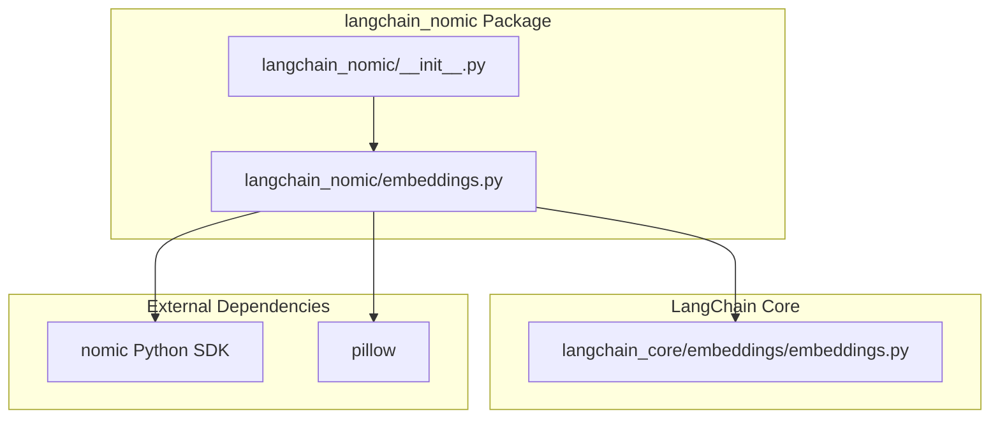
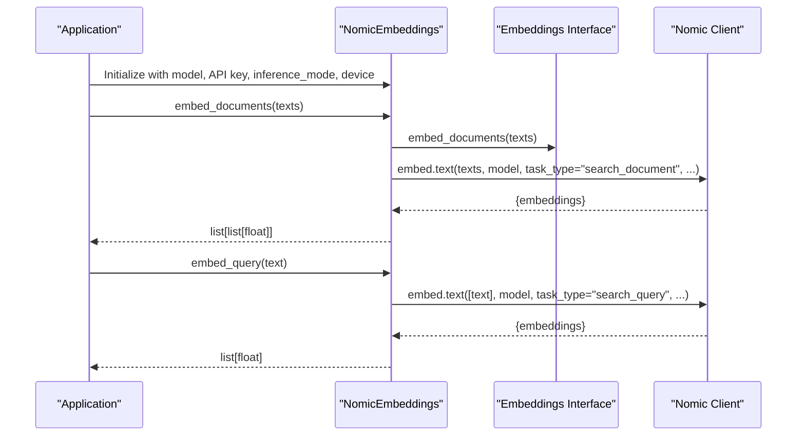
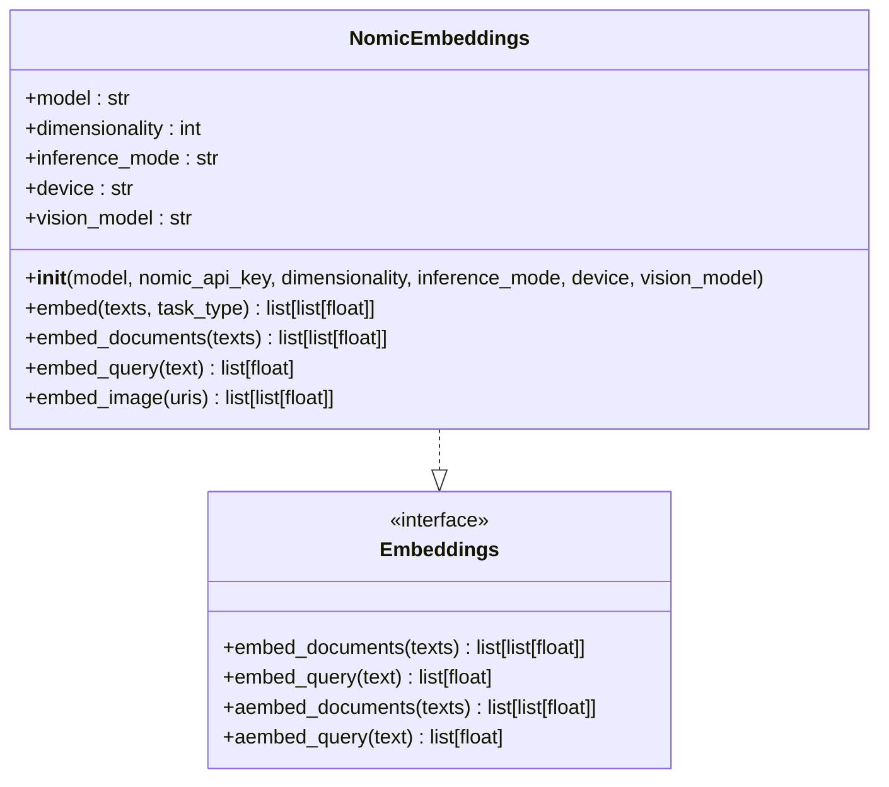
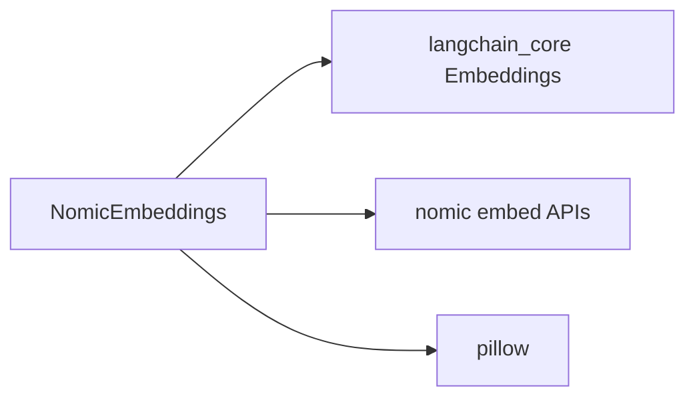

# Nomic Embeddings

<cite>
**Referenced Files in This Document**
- [embeddings.py](file://libs/partners/nomic/langchain_nomic/embeddings.py)
- [__init__.py](file://libs/partners/nomic/langchain_nomic/__init__.py)
- [pyproject.toml](file://libs/partners/nomic/pyproject.toml)
- [README.md](file://libs/partners/nomic/README.md)
- [test_embeddings.py](file://libs/partners/nomic/tests/integration_tests/test_embeddings.py)
- [test_embeddings.py](file://libs/partners/nomic/tests/unit_tests/test_embeddings.py)
- [test_standard.py](file://libs/partners/nomic/tests/unit_tests/test_standard.py)
- [embeddings.py](file://libs/core/langchain_core/embeddings/embeddings.py)
</cite>

## Table of Contents
1. [Introduction](#introduction)
2. [Project Structure](#project-structure)
3. [Core Components](#core-components)
4. [Architecture Overview](#architecture-overview)
5. [Detailed Component Analysis](#detailed-component-analysis)
6. [Dependency Analysis](#dependency-analysis)
7. [Performance Considerations](#performance-considerations)
8. [Troubleshooting Guide](#troubleshooting-guide)
9. [Conclusion](#conclusion)
10. [Appendices](#appendices)

## Introduction
This document explains how to integrate Nomic embeddings into LangChain applications. It focuses on generating high-quality embeddings optimized for semantic search and clustering, covering model capabilities, configuration, authentication, batch processing, error handling, and best practices. The integration exposes a LangChain-compatible embeddings interface and leverages the Nomic client to produce dense vector representations for text and images.

## Project Structure
The Nomic integration is implemented as a LangChain partner package. The core implementation resides in the embeddings module and is exported via the package’s public API. Tests validate basic functionality and performance characteristics.

**Diagram sources**
- [__init__.py](file://libs/partners/nomic/langchain_nomic/__init__.py#L1-L5)
- [embeddings.py](file://libs/partners/nomic/langchain_nomic/embeddings.py#L1-L150)
- [embeddings.py](file://libs/core/langchain_core/embeddings/embeddings.py#L1-L79)

**Section sources**
- [__init__.py](file://libs/partners/nomic/langchain_nomic/__init__.py#L1-L5)
- [embeddings.py](file://libs/partners/nomic/langchain_nomic/embeddings.py#L1-L150)
- [pyproject.toml](file://libs/partners/nomic/pyproject.toml#L1-L111)

## Core Components
- NomicEmbeddings: Implements the LangChain Embeddings interface and delegates to the Nomic client for text and image embeddings. Supports remote inference, optional local inference modes, and dimensionality reduction for Matryoshka-style embeddings.

Key capabilities:
- Text embeddings for documents and queries with task-type selection
- Image embeddings via an optional vision model
- Configurable inference mode (remote, local, dynamic)
- Optional API key authentication via environment variable or constructor argument
- Dimensionality control for compact embeddings

**Section sources**
- [embeddings.py](file://libs/partners/nomic/langchain_nomic/embeddings.py#L13-L150)
- [embeddings.py](file://libs/core/langchain_core/embeddings/embeddings.py#L8-L79)

## Architecture Overview
The Nomic integration adheres to LangChain’s Embeddings interface. Application code initializes NomicEmbeddings with a model name and optional configuration, then calls embed_documents or embed_query. Internally, the implementation routes to the Nomic client with appropriate parameters.

**Diagram sources**
- [embeddings.py](file://libs/partners/nomic/langchain_nomic/embeddings.py#L97-L138)
- [embeddings.py](file://libs/core/langchain_core/embeddings/embeddings.py#L36-L78)

## Detailed Component Analysis

### NomicEmbeddings Class
NomicEmbeddings implements the Embeddings interface and encapsulates:
- Authentication: logs into the Nomic client when an API key is provided
- Inference modes: remote, local, dynamic
- Dimensionality: supports Matryoshka embeddings by selecting a reduced dimension
- Vision: optional image embedding capability

**Diagram sources**
- [embeddings.py](file://libs/partners/nomic/langchain_nomic/embeddings.py#L13-L150)
- [embeddings.py](file://libs/core/langchain_core/embeddings/embeddings.py#L8-L79)

Implementation highlights:
- Constructor accepts model name, optional API key, dimensionality, inference mode, device, and vision model. If an API key is provided or present in the environment, the integration authenticates with the Nomic client.
- embed_documents maps to task type “search_document” and embed_query to “search_query”.
- embed_image uses the Nomic client’s image embedding endpoint with an optional vision model.
- Overloads define supported constructor signatures for type safety.

Usage patterns:
- Initialize once per process/session and reuse for multiple batches.
- For Matryoshka embeddings, specify dimensionality on the model that supports it.
- Choose inference_mode based on deployment constraints (remote for simplicity, local/dynamic for latency or offline needs).

**Section sources**
- [embeddings.py](file://libs/partners/nomic/langchain_nomic/embeddings.py#L56-L95)
- [embeddings.py](file://libs/partners/nomic/langchain_nomic/embeddings.py#L97-L149)

### Authentication and API Configuration
- API key precedence: pass via constructor or set the NOMIC_API_KEY environment variable. When present, the integration logs into the Nomic client during initialization.
- No explicit error handling is implemented in the integration itself; failures propagate from the underlying client.

Best practices:
- Store the API key securely and avoid hardcoding.
- Prefer environment variables for CI/CD and local development consistency.

**Section sources**
- [embeddings.py](file://libs/partners/nomic/langchain_nomic/embeddings.py#L88-L90)

### Batch Processing and Task Types
- embed_documents: Accepts a list of texts and returns a list of embeddings. Internally uses task type “search_document”.
- embed_query: Accepts a single text and returns a single embedding vector. Internally uses task type “search_query”.
- embed: Generic method allowing explicit task_type selection among “search_query”, “search_document”, “classification”, and “clustering”.

Batch tips:
- Group related texts for embed_documents to minimize overhead.
- For clustering and classification tasks, select the appropriate task_type to optimize downstream performance.

**Section sources**
- [embeddings.py](file://libs/partners/nomic/langchain_nomic/embeddings.py#L116-L138)
- [embeddings.py](file://libs/partners/nomic/langchain_nomic/embeddings.py#L97-L114)

### Image Embeddings
- embed_image: Embeds a list of image URIs using an optional vision model. Delegates to the Nomic client’s image embedding endpoint.

Considerations:
- Ensure the vision model is compatible with the provided URIs and credentials.
- Validate image accessibility and formats supported by the chosen model.

**Section sources**
- [embeddings.py](file://libs/partners/nomic/langchain_nomic/embeddings.py#L140-L149)

### Error Handling
- The integration does not implement explicit try/catch blocks around embedding calls. Errors from the Nomic client will bubble up to the caller.
- Recommended pattern: wrap initialization and embedding calls in try/except blocks and handle client-specific exceptions appropriately.

**Section sources**
- [embeddings.py](file://libs/partners/nomic/langchain_nomic/embeddings.py#L97-L149)

## Dependency Analysis
The Nomic integration depends on:
- langchain-core for the Embeddings interface
- nomic for text and image embedding endpoints
- pillow for image-related operations

**Diagram sources**
- [embeddings.py](file://libs/partners/nomic/langchain_nomic/embeddings.py#L8-L10)
- [pyproject.toml](file://libs/partners/nomic/pyproject.toml#L9-L13)

**Section sources**
- [pyproject.toml](file://libs/partners/nomic/pyproject.toml#L9-L13)

## Performance Considerations
- Initialization time: Benchmarked in the test suite to evaluate initialization overhead.
- Inference mode: remote mode is simplest; local/dynamic modes may reduce latency and enable offline operation depending on hardware and model size.
- Dimensionality: Using Matryoshka embeddings reduces vector size and can improve downstream performance for storage and similarity search.
- Batch sizing: Larger batches can improve throughput; balance with memory and latency constraints.

Practical guidance:
- Run initialization benchmarks locally to estimate startup costs.
- Profile embedding calls with realistic batch sizes and dimensionality choices.
- Consider caching frequently reused embeddings where applicable.

**Section sources**
- [test_standard.py](file://libs/partners/nomic/tests/unit_tests/test_standard.py#L9-L17)
- [embeddings.py](file://libs/partners/nomic/langchain_nomic/embeddings.py#L62-L84)
- [embeddings.py](file://libs/partners/nomic/langchain_nomic/embeddings.py#L72-L73)

## Troubleshooting Guide
Common issues and resolutions:
- Authentication failures: Verify the NOMIC_API_KEY environment variable or constructor argument. Confirm network connectivity and account validity.
- Empty or unexpected embeddings: Ensure the model name is correct and supported. For Matryoshka embeddings, confirm the model supports the requested dimensionality.
- Local inference errors: Check device compatibility and availability. Avoid unsupported platforms as indicated in the constructor documentation.
- Image embedding failures: Validate URIs and permissions. Confirm the vision model is configured and authorized.

Testing references:
- Integration tests demonstrate successful document and query embeddings and dimensionality behavior.
- Unit tests validate initialization and benchmarking hooks.

**Section sources**
- [test_embeddings.py](file://libs/partners/nomic/tests/integration_tests/test_embeddings.py#L6-L29)
- [test_embeddings.py](file://libs/partners/nomic/tests/unit_tests/test_embeddings.py#L6-L8)
- [embeddings.py](file://libs/partners/nomic/langchain_nomic/embeddings.py#L88-L90)

## Conclusion
The Nomic integration provides a straightforward, LangChain-compatible pathway to high-quality text and image embeddings. By leveraging the Embeddings interface, developers can plug Nomic models into existing pipelines for semantic search, clustering, and similarity tasks. Proper configuration of authentication, inference mode, and dimensionality enables performance and accuracy optimizations tailored to specific use cases.

## Appendices

### API Reference Summary
- NomicEmbeddings(model, nomic_api_key=None, dimensionality=None, inference_mode="remote", device=None, vision_model=None)
  - Initializes the embedding client with optional API key and configuration.
- embed_documents(texts: list[str]) -> list[list[float]]
  - Embeds a batch of documents using task type “search_document”.
- embed_query(text: str) -> list[float]
  - Embeds a single query using task type “search_query”.
- embed_image(uris: list[str]) -> list[list[float]]
  - Embeds images via the configured vision model.

**Section sources**
- [embeddings.py](file://libs/partners/nomic/langchain_nomic/embeddings.py#L56-L95)
- [embeddings.py](file://libs/partners/nomic/langchain_nomic/embeddings.py#L116-L149)

### Best Practices by Use Case
- Semantic search
  - Use embed_documents for corpus and embed_query for user queries.
  - Select task type “search_document” and “search_query” for optimal retrieval quality.
- Clustering
  - Use embed_documents with task type “clustering” for unsupervised grouping.
  - Consider Matryoshka embeddings to reduce dimensionality and improve cluster stability.
- Similarity matching
  - Normalize or scale embeddings as needed for cosine similarity.
  - Batch queries to improve throughput; tune batch size for latency targets.

[No sources needed since this section provides general guidance]