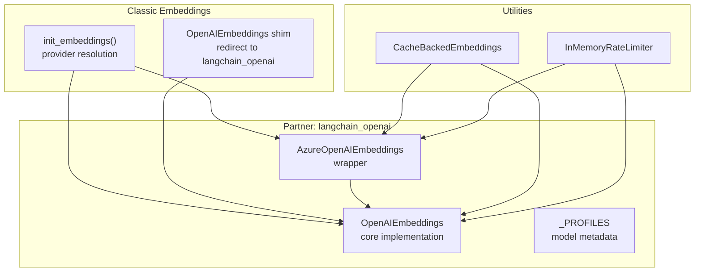
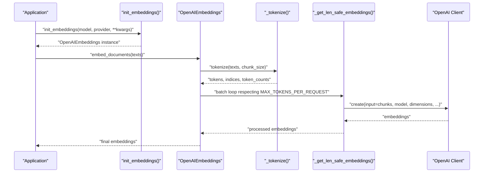
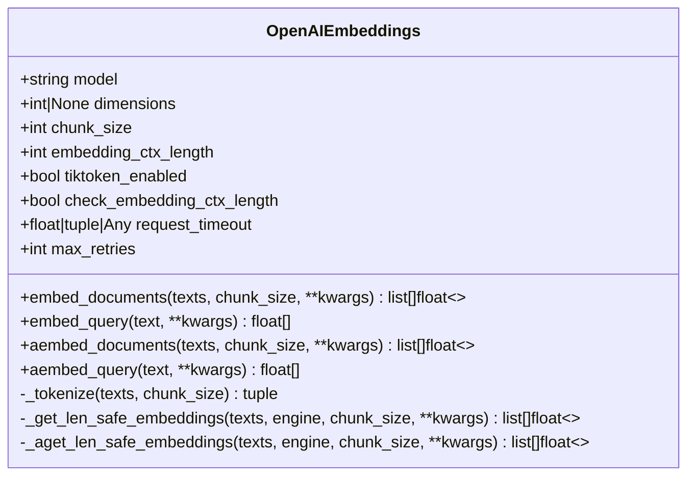
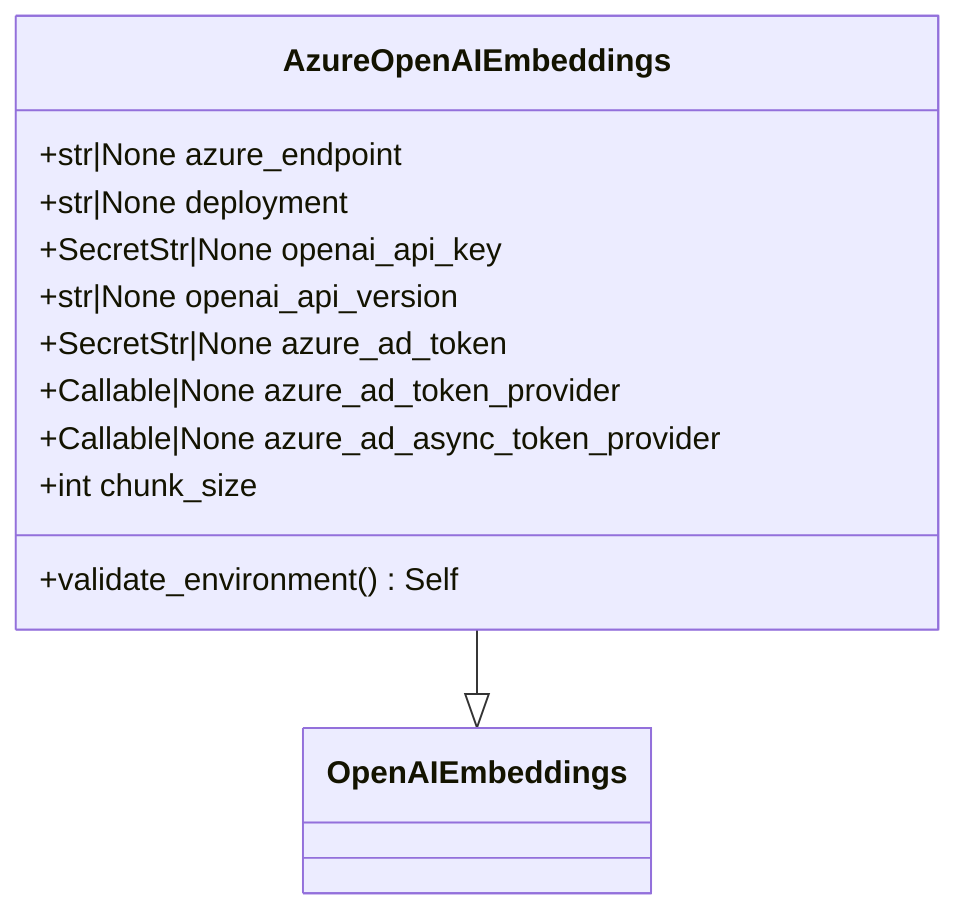
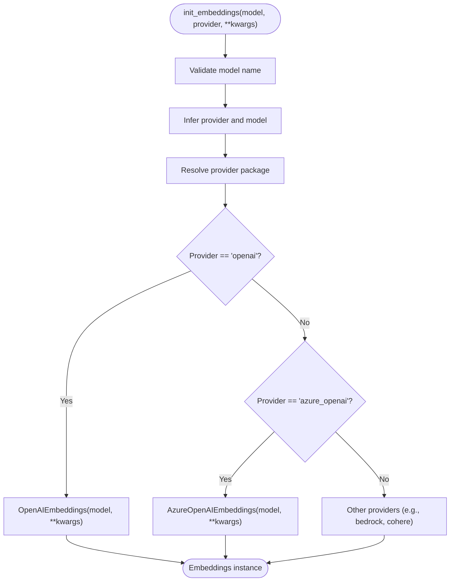
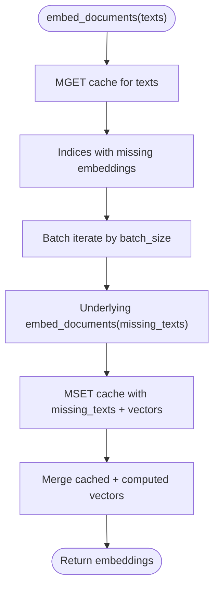
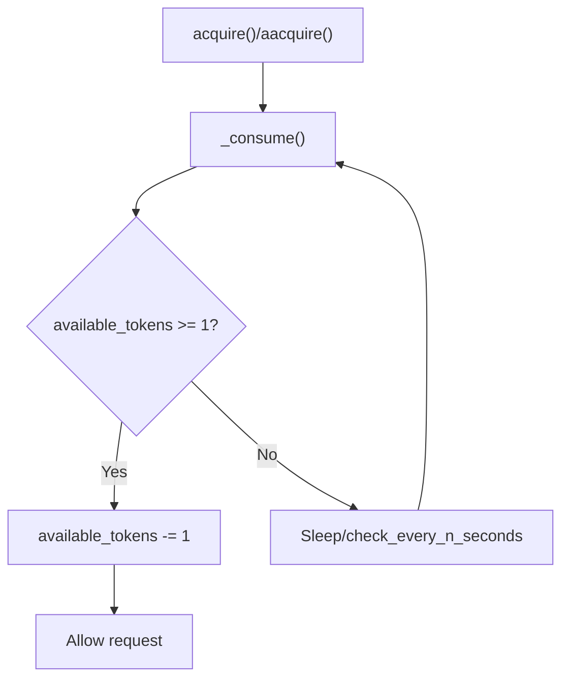
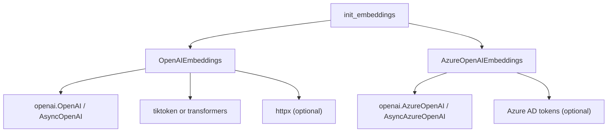

# OpenAI Embeddings

<cite>
**Referenced Files in This Document**
- [base.py](file://libs/partners/openai/langchain_openai/embeddings/base.py)
- [azure.py](file://libs/partners/openai/langchain_openai/embeddings/azure.py)
- [__init__.py](file://libs/partners/openai/langchain_openai/embeddings/__init__.py)
- [base.py](file://libs/langchain/langchain_classic/embeddings/base.py)
- [openai.py](file://libs/langchain/langchain_classic/embeddings/openai.py)
- [cache.py](file://libs/langchain/langchain_classic/embeddings/cache.py)
- [rate_limiters.py](file://libs/core/langchain_core/rate_limiters.py)
- [_profiles.py](file://libs/partners/openai/langchain_openai/data/_profiles.py)
</cite>

## Table of Contents
1. [Introduction](#introduction)
2. [Project Structure](#project-structure)
3. [Core Components](#core-components)
4. [Architecture Overview](#architecture-overview)
5. [Detailed Component Analysis](#detailed-component-analysis)
6. [Dependency Analysis](#dependency-analysis)
7. [Performance Considerations](#performance-considerations)
8. [Troubleshooting Guide](#troubleshooting-guide)
9. [Conclusion](#conclusion)

## Introduction
This document explains how OpenAI embeddings are integrated in LangChain, focusing on the OpenAIEmbeddings and AzureOpenAIEmbeddings implementations. It covers model selection (including text-embedding-3-small and text-embedding-3-large), authentication setup, configuration parameters, batching and token limits, error handling, rate limiting, caching strategies, and production best practices. It also highlights OpenAI-specific features such as custom model names, dimension control, and Azure OpenAI integration.

## Project Structure
LangChain’s OpenAI embeddings are implemented in the langchain_openai partner package and are orchestrated by the classic embeddings initializer. The key files are:
- OpenAI embeddings core implementation
- Azure OpenAI embeddings wrapper
- Classic embeddings initializer and provider resolution
- Caching and rate limiting utilities

**Diagram sources**
- [base.py](file://libs/partners/openai/langchain_openai/embeddings/base.py#L86-L773)
- [azure.py](file://libs/partners/openai/langchain_openai/embeddings/azure.py#L16-L231)
- [base.py](file://libs/langchain/langchain_classic/embeddings/base.py#L128-L245)
- [openai.py](file://libs/langchain/langchain_classic/embeddings/openai.py#L1-L24)
- [cache.py](file://libs/langchain/langchain_classic/embeddings/cache.py#L108-L371)
- [rate_limiters.py](file://libs/core/langchain_core/rate_limiters.py#L11-L257)
- [_profiles.py](file://libs/partners/openai/langchain_openai/data/_profiles.py#L37-L53)

**Section sources**
- [base.py](file://libs/partners/openai/langchain_openai/embeddings/base.py#L1-L773)
- [azure.py](file://libs/partners/openai/langchain_openai/embeddings/azure.py#L1-L231)
- [base.py](file://libs/langchain/langchain_classic/embeddings/base.py#L1-L252)
- [openai.py](file://libs/langchain/langchain_classic/embeddings/openai.py#L1-L24)
- [cache.py](file://libs/langchain/langchain_classic/embeddings/cache.py#L1-L371)
- [rate_limiters.py](file://libs/core/langchain_core/rate_limiters.py#L1-L257)
- [_profiles.py](file://libs/partners/openai/langchain_openai/data/_profiles.py#L18-L62)

## Core Components
- OpenAIEmbeddings: Implements the OpenAI embeddings client, tokenization, batching, dimension control, and async/sync invocation.
- AzureOpenAIEmbeddings: Extends OpenAIEmbeddings for Azure OpenAI deployments with endpoint, deployment, and token provider support.
- init_embeddings: Classic initializer that resolves provider and constructs the appropriate embeddings class.
- CacheBackedEmbeddings: Wraps any Embeddings to cache results in a key-value store.
- InMemoryRateLimiter: Provides time-based rate limiting suitable for controlling request frequency.

Key capabilities:
- Model selection: text-embedding-ada-002, text-embedding-3-small, text-embedding-3-large, and custom model names.
- Authentication: API key via environment variables or direct parameter; Azure supports API key or Azure AD token(s).
- Configuration: dimensions, chunk_size, embedding_ctx_length, timeouts, retries, proxies, and custom httpx clients.
- Safety: automatic tokenization and chunking, weighted averaging for long texts, and empty string normalization.

**Section sources**
- [base.py](file://libs/partners/openai/langchain_openai/embeddings/base.py#L86-L773)
- [azure.py](file://libs/partners/openai/langchain_openai/embeddings/azure.py#L16-L231)
- [base.py](file://libs/langchain/langchain_classic/embeddings/base.py#L128-L245)
- [cache.py](file://libs/langchain/langchain_classic/embeddings/cache.py#L108-L371)
- [rate_limiters.py](file://libs/core/langchain_core/rate_limiters.py#L67-L257)

## Architecture Overview
The OpenAI embeddings pipeline integrates LangChain abstractions with the OpenAI client library. It supports both sync and async flows, with robust tokenization and batching logic to respect API limits.

**Diagram sources**
- [base.py](file://libs/langchain/langchain_classic/embeddings/base.py#L128-L245)
- [base.py](file://libs/partners/openai/langchain_openai/embeddings/base.py#L429-L598)

## Detailed Component Analysis

### OpenAIEmbeddings
OpenAIEmbeddings is the primary implementation for OpenAI embeddings. It supports:
- Model selection: defaults to text-embedding-ada-002; supports text-embedding-3 variants.
- Dimensions: optional output dimensionality for text-embedding-3+ models.
- Tokenization: tiktoken-based by default; can fall back to transformers.
- Chunking and batching: respects embedding_ctx_length and a configurable chunk_size; enforces a per-request token cap.
- Weighted averaging: for long texts split into chunks, produces a normalized pooled embedding.
- Async/sync: dual clients for synchronous and asynchronous embedding calls.
- Proxies and custom clients: optional httpx clients for sync/async; proxy support via OPENAI_PROXY.
- Environment-driven configuration: OPENAI_API_KEY, OPENAI_ORG_ID, OPENAI_API_BASE, OPENAI_API_VERSION, OPENAI_PROXY.

**Diagram sources**
- [base.py](file://libs/partners/openai/langchain_openai/embeddings/base.py#L86-L773)

**Section sources**
- [base.py](file://libs/partners/openai/langchain_openai/embeddings/base.py#L86-L773)

### AzureOpenAIEmbeddings
AzureOpenAIEmbeddings extends OpenAIEmbeddings to support Azure OpenAI deployments:
- Endpoint and deployment: azure_endpoint and azure_deployment.
- Authentication: api_key, azure_ad_token, or token providers (sync/async).
- API version: openai_api_version.
- Specialized client creation and header customization for Azure.
- Validation rules to prevent conflicting base_url and deployment usage.

**Diagram sources**
- [azure.py](file://libs/partners/openai/langchain_openai/embeddings/azure.py#L16-L231)

**Section sources**
- [azure.py](file://libs/partners/openai/langchain_openai/embeddings/azure.py#L16-L231)

### Classic Embeddings Initializer
The classic initializer resolves providers and constructs the correct embeddings class:
- Supports provider strings and model names.
- Validates presence of required packages (e.g., langchain_openai).
- Creates OpenAIEmbeddings or AzureOpenAIEmbeddings based on provider.

**Diagram sources**
- [base.py](file://libs/langchain/langchain_classic/embeddings/base.py#L128-L245)

**Section sources**
- [base.py](file://libs/langchain/langchain_classic/embeddings/base.py#L128-L245)

### Caching Strategy
CacheBackedEmbeddings wraps an Embeddings instance to cache embeddings in a key-value store:
- Hashes inputs deterministically; supports multiple encoders (sha1, blake2b, sha256, sha512).
- Supports separate stores for document and query embeddings.
- Batched writes to reduce store pressure.
- Works with both sync and async embedding methods.

**Diagram sources**
- [cache.py](file://libs/langchain/langchain_classic/embeddings/cache.py#L165-L199)

**Section sources**
- [cache.py](file://libs/langchain/langchain_classic/embeddings/cache.py#L108-L371)

### Rate Limiting
InMemoryRateLimiter provides a token-bucket rate limiter suitable for controlling request frequency:
- Configurable requests_per_second, max_bucket_size, and check interval.
- Thread-safe and supports both sync and async acquisition.
- Useful for coordinating embedding calls to respect provider quotas.

**Diagram sources**
- [rate_limiters.py](file://libs/core/langchain_core/rate_limiters.py#L165-L250)

**Section sources**
- [rate_limiters.py](file://libs/core/langchain_core/rate_limiters.py#L67-L257)

## Dependency Analysis
- OpenAIEmbeddings depends on:
  - OpenAI client library for embeddings API.
  - tiktoken for tokenization (default) or transformers as an alternative.
  - Optional httpx for proxy/custom client support.
- AzureOpenAIEmbeddings depends on:
  - AzureOpenAI client library.
  - Optional Azure AD token providers.
- Classic initializer depends on:
  - Provider package availability (e.g., langchain_openai).
  - Environment variables for credentials.

**Diagram sources**
- [base.py](file://libs/partners/openai/langchain_openai/embeddings/base.py#L10-L14)
- [azure.py](file://libs/partners/openai/langchain_openai/embeddings/azure.py#L8-L13)
- [base.py](file://libs/langchain/langchain_classic/embeddings/base.py#L204-L211)

**Section sources**
- [base.py](file://libs/partners/openai/langchain_openai/embeddings/base.py#L10-L14)
- [azure.py](file://libs/partners/openai/langchain_openai/embeddings/azure.py#L8-L13)
- [base.py](file://libs/langchain/langchain_classic/embeddings/base.py#L204-L211)

## Performance Considerations
- Model selection:
  - text-embedding-ada-002: legacy, smaller dimensions.
  - text-embedding-3-small: balanced quality and cost.
  - text-embedding-3-large: higher quality, larger dimensions.
- Dimensions:
  - For text-embedding-3+ models, use the dimensions parameter to control output size.
- Chunk size and context length:
  - Tune chunk_size and embedding_ctx_length to balance throughput and memory.
- Tokenization:
  - Prefer tiktoken for OpenAI models; fallback to transformers only when necessary.
- Batching:
  - Respect MAX_TOKENS_PER_REQUEST to avoid oversized requests.
- Caching:
  - Use CacheBackedEmbeddings to avoid recomputation for repeated texts.
- Rate limiting:
  - Use InMemoryRateLimiter to smooth request bursts.
- Async:
  - Prefer async APIs for concurrent embedding workloads.

[No sources needed since this section provides general guidance]

## Troubleshooting Guide
Common issues and resolutions:
- Missing provider package:
  - Ensure langchain_openai is installed when using OpenAI embeddings.
- Invalid model format:
  - Use provider:model notation or explicitly set provider.
- Unsupported provider:
  - Verify provider is in the supported list.
- API key errors:
  - Set OPENAI_API_KEY or provide api_key; for Azure, set AZURE_OPENAI_API_KEY or equivalent.
- Proxy conflicts:
  - Do not specify both OPENAI_PROXY and custom http_client/http_async_client.
- Azure endpoint configuration:
  - Avoid mixing openai_api_base and deployment; use azure_endpoint and deployment consistently.
- Empty strings:
  - skip_empty controls whether to raise or normalize empty inputs.

**Section sources**
- [base.py](file://libs/partners/openai/langchain_openai/embeddings/base.py#L332-L410)
- [azure.py](file://libs/partners/openai/langchain_openai/embeddings/azure.py#L162-L187)
- [base.py](file://libs/langchain/langchain_classic/embeddings/base.py#L28-L114)

## Conclusion
LangChain’s OpenAI embeddings integration provides a robust, configurable, and production-ready solution for generating text embeddings. With support for multiple models, Azure OpenAI, caching, rate limiting, and flexible authentication, it enables scalable vectorization workflows. Use the documented parameters and best practices to optimize performance, reliability, and cost.