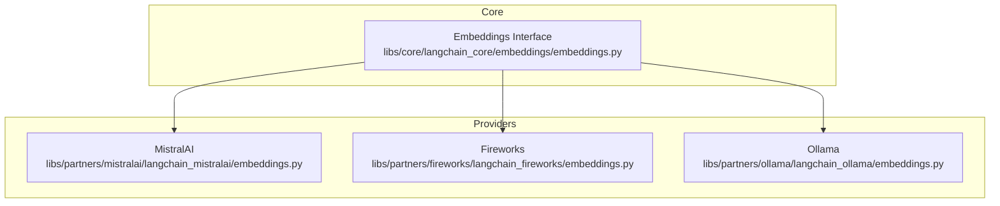
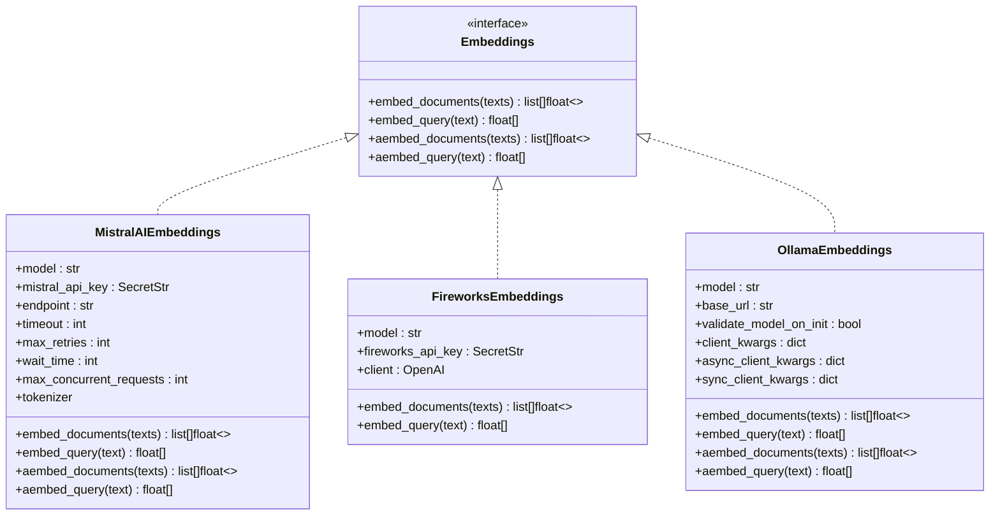
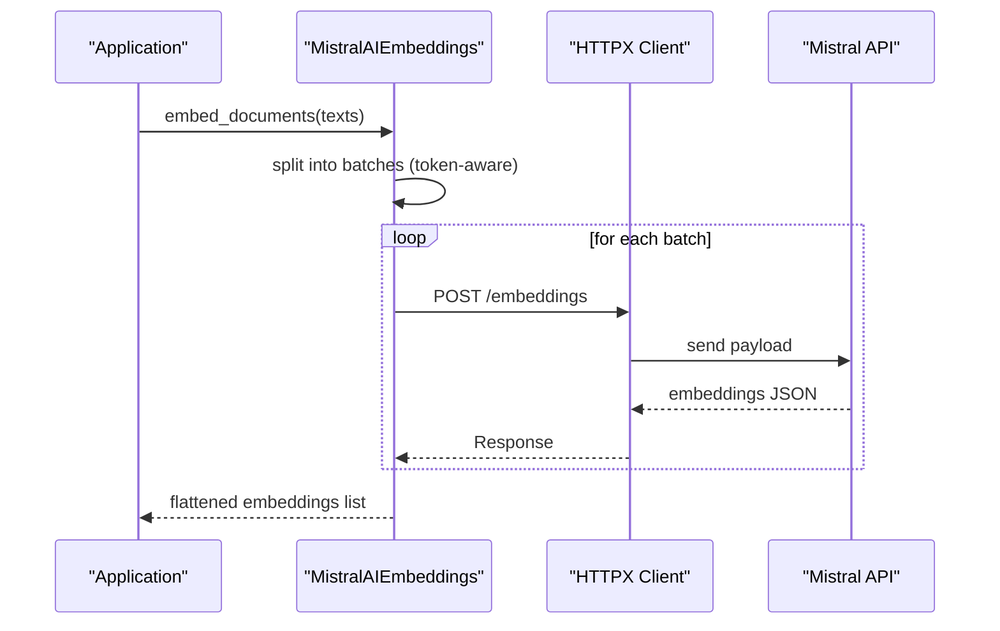
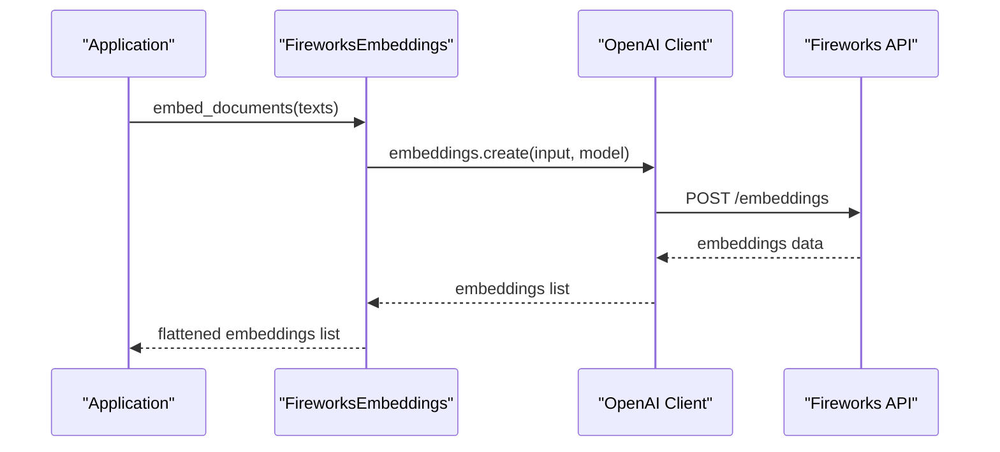
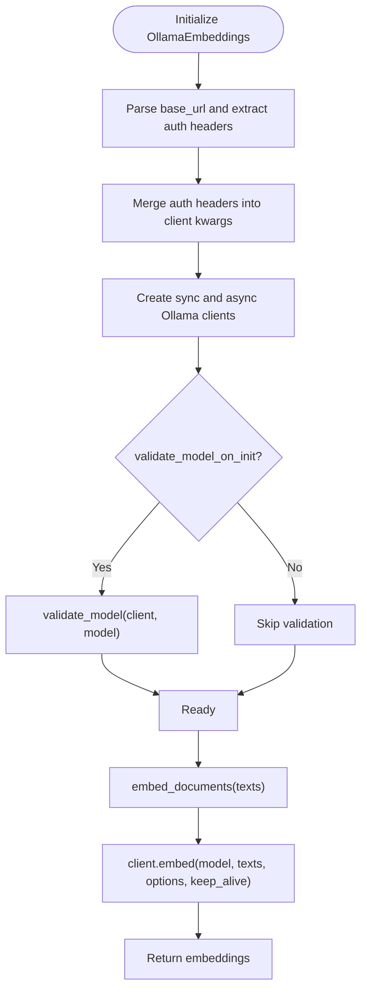
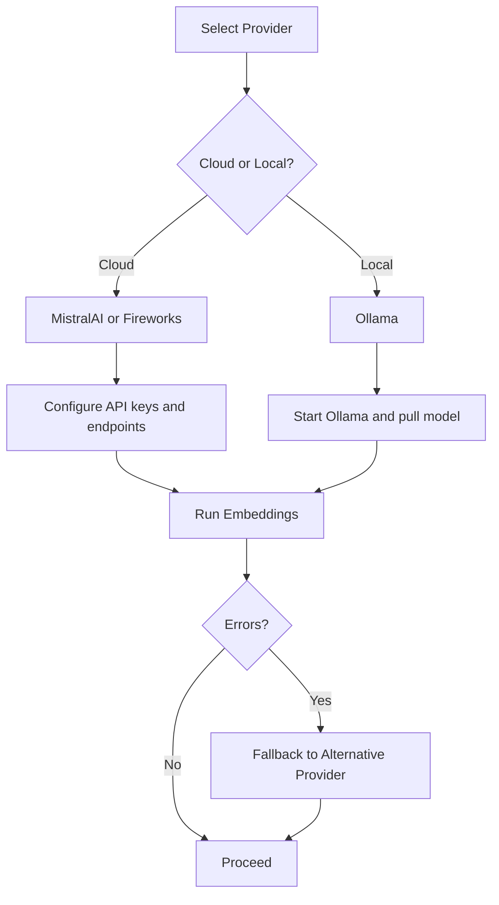
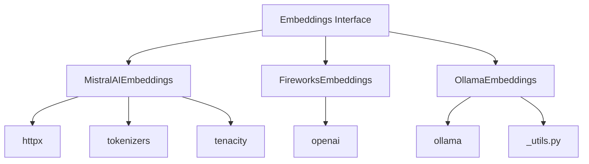

# Other Embedding Providers

<cite>
**Referenced Files in This Document**
- [embeddings.py](file://libs/core/langchain_core/embeddings/embeddings.py)
- [mistralai_embeddings.py](file://libs/partners/mistralai/langchain_mistralai/embeddings.py)
- [mistralai_init.py](file://libs/partners/mistralai/langchain_mistralai/__init__.py)
- [mistralai_unit_test.py](file://libs/partners/mistralai/tests/unit_tests/test_embeddings.py)
- [fireworks_embeddings.py](file://libs/partners/fireworks/langchain_fireworks/embeddings.py)
- [fireworks_init.py](file://libs/partners/fireworks/langchain_fireworks/__init__.py)
- [fireworks_unit_test.py](file://libs/partners/fireworks/tests/unit_tests/test_embeddings.py)
- [ollama_embeddings.py](file://libs/partners/ollama/langchain_ollama/embeddings.py)
- [ollama_init.py](file://libs/partners/ollama/langchain_ollama/__init__.py)
- [ollama_unit_test.py](file://libs/partners/ollama/tests/unit_tests/test_embeddings.py)
- [ollama_utils.py](file://libs/partners/ollama/langchain_ollama/_utils.py)
- [cohere_deprecated.py](file://libs/langchain/langchain_classic/embeddings/cohere.py)
- [azure_openai_deprecated.py](file://libs/langchain/langchain_classic/embeddings/azure_openai.py)
</cite>

## Table of Contents
1. [Introduction](#introduction)
2. [Project Structure](#project-structure)
3. [Core Components](#core-components)
4. [Architecture Overview](#architecture-overview)
5. [Detailed Component Analysis](#detailed-component-analysis)
6. [Dependency Analysis](#dependency-analysis)
7. [Performance Considerations](#performance-considerations)
8. [Troubleshooting Guide](#troubleshooting-guide)
9. [Conclusion](#conclusion)
10. [Appendices](#appendices)

## Introduction
This document provides a comprehensive guide to integrating additional embedding providers in LangChain with a focus on MistralAI, Fireworks, and Ollama. It explains each provider’s unique characteristics, model offerings, configuration requirements, authentication methods, and performance considerations. It also covers local deployment options for Ollama, cloud-native embeddings for Fireworks, and specialized models for MistralAI. Practical examples, error handling, fallback strategies, cost considerations, performance benchmarks, and migration strategies are included to help teams select and operate embedding providers effectively.

## Project Structure
LangChain organizes embedding providers as separate partner packages under libs/partners. Each provider implements the Embeddings interface defined in the core library and exposes a dedicated class for embeddings. Provider-specific configuration, authentication, and client initialization are encapsulated within each provider’s module.

**Diagram sources**
- [embeddings.py](file://libs/core/langchain_core/embeddings/embeddings.py#L8-L79)
- [mistralai_embeddings.py](file://libs/partners/mistralai/langchain_mistralai/embeddings.py#L40-L330)
- [fireworks_embeddings.py](file://libs/partners/fireworks/langchain_fireworks/embeddings.py#L8-L108)
- [ollama_embeddings.py](file://libs/partners/ollama/langchain_ollama/embeddings.py#L19-L333)

**Section sources**
- [embeddings.py](file://libs/core/langchain_core/embeddings/embeddings.py#L1-L79)
- [mistralai_embeddings.py](file://libs/partners/mistralai/langchain_mistralai/embeddings.py#L1-L330)
- [fireworks_embeddings.py](file://libs/partners/fireworks/langchain_fireworks/embeddings.py#L1-L108)
- [ollama_embeddings.py](file://libs/partners/ollama/langchain_ollama/embeddings.py#L1-L333)

## Core Components
- Embeddings interface: Defines the contract for embedding providers, including synchronous and asynchronous methods for document and query embeddings.
- Provider implementations:
  - MistralAIEmbeddings: Cloud-hosted embeddings with token-aware batching and retry logic.
  - FireworksEmbeddings: OpenAI-compatible embeddings via Fireworks inference API.
  - OllamaEmbeddings: Local embeddings served by Ollama with extensive runtime options and optional model validation.

Key implementation patterns:
- Environment-based secrets and client initialization.
- Batch processing for throughput and rate-limit compliance.
- Async-native implementations where applicable.
- Validation hooks for model availability and configuration.

**Section sources**
- [embeddings.py](file://libs/core/langchain_core/embeddings/embeddings.py#L8-L79)
- [mistralai_embeddings.py](file://libs/partners/mistralai/langchain_mistralai/embeddings.py#L40-L330)
- [fireworks_embeddings.py](file://libs/partners/fireworks/langchain_fireworks/embeddings.py#L8-L108)
- [ollama_embeddings.py](file://libs/partners/ollama/langchain_ollama/embeddings.py#L19-L333)

## Architecture Overview
The embedding providers follow a consistent pattern:
- Implement the Embeddings interface.
- Initialize a client using environment variables or explicit parameters.
- Optionally validate configuration (e.g., model presence for Ollama).
- Perform embedding operations with batching and retries where appropriate.
- Expose both sync and async APIs.

**Diagram sources**
- [embeddings.py](file://libs/core/langchain_core/embeddings/embeddings.py#L8-L79)
- [mistralai_embeddings.py](file://libs/partners/mistralai/langchain_mistralai/embeddings.py#L40-L330)
- [fireworks_embeddings.py](file://libs/partners/fireworks/langchain_fireworks/embeddings.py#L8-L108)
- [ollama_embeddings.py](file://libs/partners/ollama/langchain_ollama/embeddings.py#L19-L333)

## Detailed Component Analysis

### MistralAI Embeddings
- Purpose: Cloud-hosted embeddings via Mistral AI API.
- Model offering: Uses a dedicated embedding model identifier; default is provided.
- Authentication: Requires an API key via environment variable or constructor parameter.
- Configuration highlights:
  - Endpoint URL for API calls.
  - Timeout and retry controls.
  - Token-aware batching to respect API limits.
  - Optional tokenizer for calculating batch sizes; falls back to a dummy tokenizer if unavailable.
- Error handling:
  - Retry logic for transient failures.
  - Logging of exceptions with provider-specific context.
- Async support: Native async implementation using an async HTTP client.

**Diagram sources**
- [mistralai_embeddings.py](file://libs/partners/mistralai/langchain_mistralai/embeddings.py#L200-L271)

Practical setup steps:
- Install the provider package and set the API key environment variable.
- Instantiate the embedding class with the desired model.
- Call embed_documents or embed_query for batch or single queries.
- Use aembed_* variants for async workloads.

Provider-specific configuration:
- Key parameters: model, api_key, timeout, max_retries, wait_time, max_concurrent_requests.
- Environment variable: MISTRAL_API_KEY.

Common errors and handling:
- API key missing or invalid: caught during client initialization.
- Rate limiting or timeouts: retried according to configured policy.
- Tokenizer download failures: fallback to dummy tokenizer with a warning.

Cost and performance:
- Cost depends on provider pricing per token processed; batching reduces overhead.
- Performance benefits from token-aware batching and concurrency controls.

Migration and fallback:
- Swap model identifiers or endpoints by updating constructor parameters.
- Implement fallback to another provider by catching provider-specific exceptions and retrying with an alternative.

**Section sources**
- [mistralai_embeddings.py](file://libs/partners/mistralai/langchain_mistralai/embeddings.py#L40-L330)
- [mistralai_init.py](file://libs/partners/mistralai/langchain_mistralai/__init__.py#L1-L7)
- [mistralai_unit_test.py](file://libs/partners/mistralai/tests/unit_tests/test_embeddings.py#L1-L18)

### Fireworks Embeddings
- Purpose: OpenAI-compatible embeddings served via Fireworks inference API.
- Model offering: Uses a model identifier compatible with OpenAI embeddings API semantics.
- Authentication: Requires an API key via environment variable or constructor parameter.
- Configuration highlights:
  - Client initialized against Fireworks base URL.
  - Simple delegation to OpenAI-compatible embeddings endpoint.
- Error handling:
  - Delegates to underlying client for error propagation.
- Async support: Provided via the underlying OpenAI client.

**Diagram sources**
- [fireworks_embeddings.py](file://libs/partners/fireworks/langchain_fireworks/embeddings.py#L98-L107)

Practical setup steps:
- Install the provider package and set the API key environment variable.
- Instantiate the embedding class with the desired model.
- Call embed_documents or embed_query for batch or single queries.

Provider-specific configuration:
- Key parameters: model, api_key.
- Environment variable: FIREWORKS_API_KEY.

Common errors and handling:
- API key missing or invalid: initialization failure.
- Network or service errors: propagated from the client.

Cost and performance:
- Cost depends on provider pricing; OpenAI-compatible interface simplifies integration.
- Performance benefits from minimal overhead and direct API usage.

Migration and fallback:
- Switch models or endpoints by updating constructor parameters.
- Implement fallback by catching client exceptions and retrying with another provider.

**Section sources**
- [fireworks_embeddings.py](file://libs/partners/fireworks/langchain_fireworks/embeddings.py#L8-L108)
- [fireworks_init.py](file://libs/partners/fireworks/langchain_fireworks/__init__.py#L1-L14)
- [fireworks_unit_test.py](file://libs/partners/fireworks/tests/unit_tests/test_embeddings.py#L1-L9)

### Ollama Embeddings
- Purpose: Local embeddings served by Ollama; ideal for privacy, offline, and low-latency scenarios.
- Model offering: Any model available in the local Ollama library; model name is required.
- Authentication and connectivity:
  - Supports base_url configuration and userinfo auth in URLs.
  - Validates model availability optionally at initialization.
  - Provides extensive runtime options for model behavior and performance tuning.
- Configuration highlights:
  - Model name and base_url.
  - Runtime options (e.g., GPU allocation, thread count, context size).
  - Keep-alive duration for model persistence.
- Error handling:
  - Raises explicit errors if clients are not initialized.
  - Utility functions for parsing auth and merging headers.
- Async support: Native async implementation using async client.

**Diagram sources**
- [ollama_embeddings.py](file://libs/partners/ollama/langchain_ollama/embeddings.py#L275-L307)
- [ollama_utils.py](file://libs/partners/ollama/langchain_ollama/_utils.py)

Practical setup steps:
- Install Ollama and pull a suitable model.
- Start the Ollama service.
- Install the provider package and configure base_url if needed.
- Instantiate the embedding class with the model name and optional runtime parameters.
- Call embed_documents or embed_query for batch or single queries.

Provider-specific configuration:
- Key parameters: model, base_url, validate_model_on_init, client_kwargs, async_client_kwargs, sync_client_kwargs, and numerous runtime options (e.g., num_gpu, num_thread, temperature).
- Authentication: userinfo in base_url for local testing; avoid in production.

Common errors and handling:
- Client not initialized: explicit ValueError with guidance.
- Model not present: validation can fail early if enabled.
- Network or service errors: propagate from Ollama client.

Cost and performance:
- Cost is negligible for local deployments; performance depends on hardware and runtime options.
- Tuning options allow balancing latency and accuracy.

Migration and fallback:
- Switch models by changing the model parameter.
- Fallback to cloud providers by catching client errors and retrying with MistralAI or Fireworks.

**Section sources**
- [ollama_embeddings.py](file://libs/partners/ollama/langchain_ollama/embeddings.py#L19-L333)
- [ollama_init.py](file://libs/partners/ollama/langchain_ollama/__init__.py#L1-L43)
- [ollama_unit_test.py](file://libs/partners/ollama/tests/unit_tests/test_embeddings.py#L1-L53)
- [ollama_utils.py](file://libs/partners/ollama/langchain_ollama/_utils.py)

### Conceptual Overview
Provider selection and migration strategies:
- Choose cloud providers (MistralAI, Fireworks) for managed scalability and specialized models.
- Choose local providers (Ollama) for privacy, offline operation, and reduced latency.
- Implement fallback chains to improve resilience and availability.
- Use environment variables and configuration objects to switch providers without code changes.

[No sources needed since this diagram shows conceptual workflow, not actual code structure]

[No sources needed since this section doesn't analyze specific source files]

## Dependency Analysis
Provider packages depend on the core Embeddings interface and external clients:
- MistralAI: httpx client, tokenizers, tenacity for retries.
- Fireworks: OpenAI client pointed at Fireworks base URL.
- Ollama: ollama Python client with utilities for auth and model validation.

**Diagram sources**
- [embeddings.py](file://libs/core/langchain_core/embeddings/embeddings.py#L8-L79)
- [mistralai_embeddings.py](file://libs/partners/mistralai/langchain_mistralai/embeddings.py#L1-L21)
- [fireworks_embeddings.py](file://libs/partners/fireworks/langchain_fireworks/embeddings.py#L1-L5)
- [ollama_embeddings.py](file://libs/partners/ollama/langchain_ollama/embeddings.py#L1-L16)
- [ollama_utils.py](file://libs/partners/ollama/langchain_ollama/_utils.py)

**Section sources**
- [embeddings.py](file://libs/core/langchain_core/embeddings/embeddings.py#L1-L79)
- [mistralai_embeddings.py](file://libs/partners/mistralai/langchain_mistralai/embeddings.py#L1-L21)
- [fireworks_embeddings.py](file://libs/partners/fireworks/langchain_fireworks/embeddings.py#L1-L5)
- [ollama_embeddings.py](file://libs/partners/ollama/langchain_ollama/embeddings.py#L1-L16)
- [ollama_utils.py](file://libs/partners/ollama/langchain_ollama/_utils.py)

## Performance Considerations
- Throughput and batching:
  - MistralAI uses token-aware batching to respect API limits and improve throughput.
  - Fireworks leverages efficient OpenAI-compatible API calls.
  - Ollama supports runtime tuning for GPU and CPU utilization.
- Latency:
  - Local deployments (Ollama) can offer lower latency compared to cloud providers.
  - Cloud providers may introduce network latency and rate limiting.
- Concurrency:
  - MistralAI supports configurable concurrency and retry policies.
  - Ollama exposes options for thread counts and GPU allocation to optimize performance.
- Memory and model persistence:
  - Ollama’s keep_alive parameter influences model residency and subsequent request latency.

[No sources needed since this section provides general guidance]

## Troubleshooting Guide
Common issues and resolutions:
- Authentication failures:
  - MistralAI: ensure the API key environment variable is set or passed explicitly.
  - Fireworks: ensure the API key environment variable is set or passed explicitly.
  - Ollama: verify base_url and userinfo credentials if used; avoid userinfo in production.
- Initialization errors:
  - Ollama: if clients are not initialized, ensure Ollama is running and the model is loaded; enable validate_model_on_init to catch missing models early.
- Network and service errors:
  - MistralAI: inspect retry configuration and wait_time; monitor rate limits.
  - Fireworks: check base URL and network connectivity.
  - Ollama: verify local service availability and model readiness.
- Tokenizer issues (MistralAI):
  - If tokenizer download fails, the implementation falls back to a dummy tokenizer; consider setting a token source for proper tokenization.

**Section sources**
- [mistralai_embeddings.py](file://libs/partners/mistralai/langchain_mistralai/embeddings.py#L158-L198)
- [fireworks_embeddings.py](file://libs/partners/fireworks/langchain_fireworks/embeddings.py#L89-L96)
- [ollama_embeddings.py](file://libs/partners/ollama/langchain_ollama/embeddings.py#L275-L307)
- [ollama_unit_test.py](file://libs/partners/ollama/tests/unit_tests/test_embeddings.py#L16-L26)

## Conclusion
LangChain’s embedding providers follow a consistent, extensible pattern built on the Embeddings interface. MistralAI and Fireworks deliver managed cloud embeddings with robust retry and batching capabilities, while Ollama enables private, local embeddings with fine-grained runtime control. Teams can mix and match providers, implement fallback strategies, and tune performance and costs to meet diverse use cases.

[No sources needed since this section summarizes without analyzing specific files]

## Appendices

### Provider Selection Checklist
- Use cloud providers (MistralAI, Fireworks) when:
  - Managed scalability and specialized models are required.
  - Network latency is acceptable.
- Use local providers (Ollama) when:
  - Privacy and offline operation are priorities.
  - Low-latency and minimal operational overhead are desired.
- Consider fallback strategies to maintain availability and resilience.

### Migration Strategies
- Switch providers by updating environment variables and constructor parameters.
- Wrap embeddings calls in a provider-agnostic layer to swap implementations transparently.
- Use configuration objects to enable hot-swapping between providers without code changes.

### Deprecated Provider Notes
- Some classic community providers are exposed via deprecated import shims for backward compatibility.
- Prefer using the dedicated partner packages for current and future-proof integrations.

**Section sources**
- [cohere_deprecated.py](file://libs/langchain/langchain_classic/embeddings/cohere.py#L1-L24)
- [azure_openai_deprecated.py](file://libs/langchain/langchain_classic/embeddings/azure_openai.py#L1-L24)