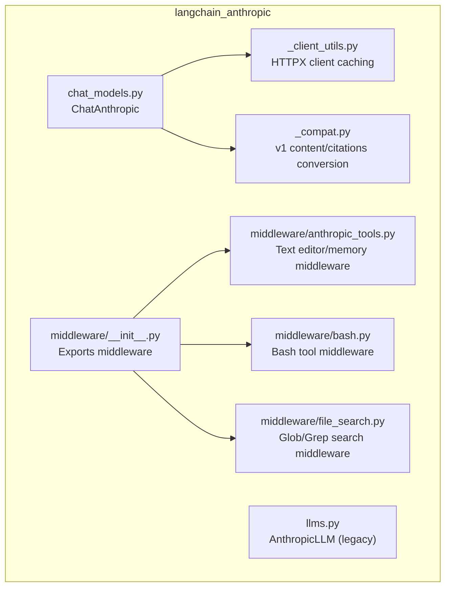
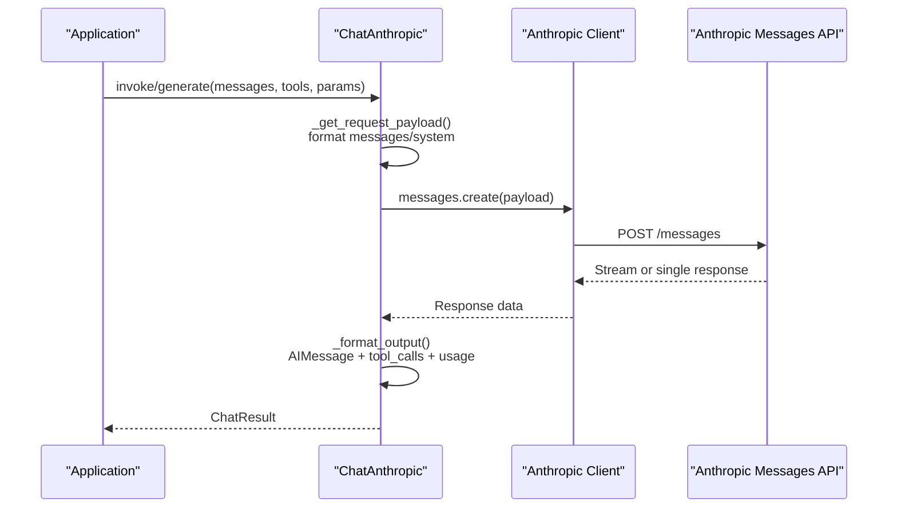
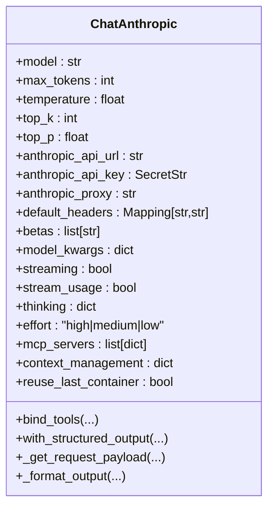
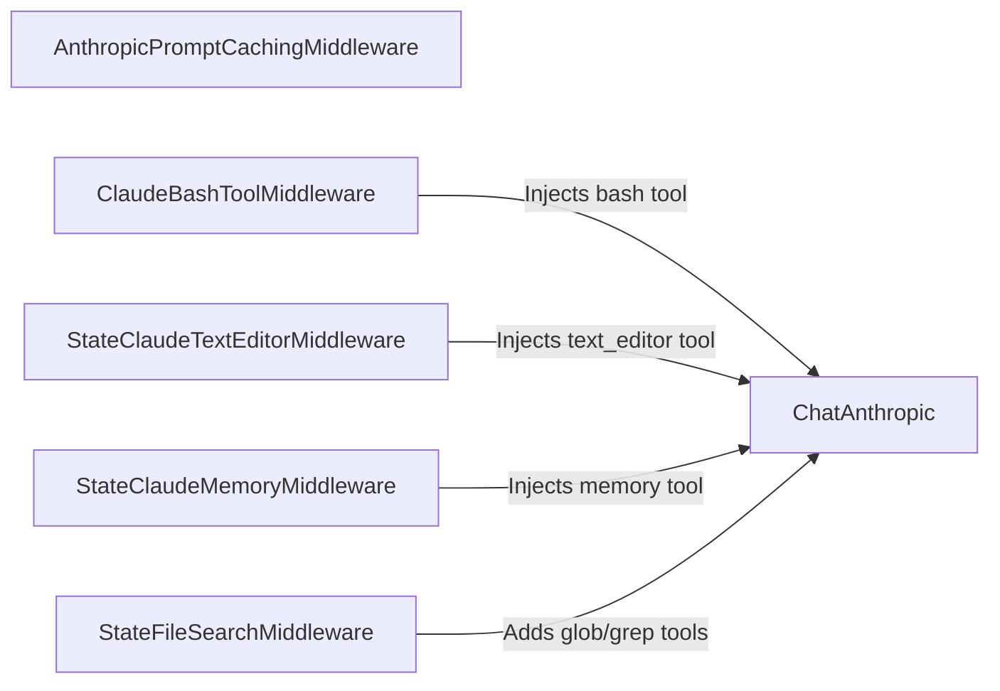
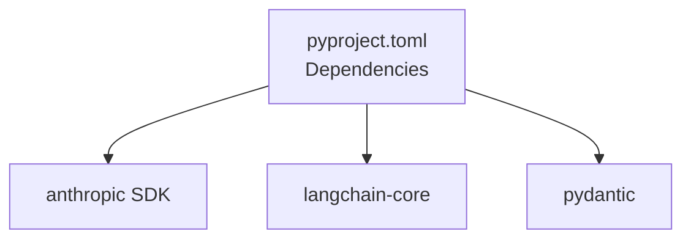

# Anthropic Integration

<cite>
**Referenced Files in This Document**
- [README.md](file://libs/partners/anthropic/README.md)
- [pyproject.toml](file://libs/partners/anthropic/pyproject.toml)
- [__init__.py](file://libs/partners/anthropic/langchain_anthropic/__init__.py)
- [_client_utils.py](file://libs/partners/anthropic/langchain_anthropic/_client_utils.py)
- [_compat.py](file://libs/partners/anthropic/langchain_anthropic/_compat.py)
- [chat_models.py](file://libs/partners/anthropic/langchain_anthropic/chat_models.py)
- [llms.py](file://libs/partners/anthropic/langchain_anthropic/llms.py)
- [middleware/__init__.py](file://libs/partners/anthropic/langchain_anthropic/middleware/__init__.py)
- [anthropic_tools.py](file://libs/partners/anthropic/langchain_anthropic/middleware/anthropic_tools.py)
- [bash.py](file://libs/partners/anthropic/langchain_anthropic/middleware/bash.py)
- [file_search.py](file://libs/partners/anthropic/langchain_anthropic/middleware/file_search.py)
</cite>

## Table of Contents
1. [Introduction](#introduction)
2. [Project Structure](#project-structure)
3. [Core Components](#core-components)
4. [Architecture Overview](#architecture-overview)
5. [Detailed Component Analysis](#detailed-component-analysis)
6. [Dependency Analysis](#dependency-analysis)
7. [Performance Considerations](#performance-considerations)
8. [Troubleshooting Guide](#troubleshooting-guide)
9. [Conclusion](#conclusion)
10. [Appendices](#appendices)

## Introduction
This document explains how to integrate Anthropic’s Claude models with LangChain using the langchain-anthropic package. It covers ChatModels and LLMs implementations, authentication, model capabilities, pricing-related considerations, Anthropic-specific features (system prompts, tool use, structured output, message formatting, safety and beta controls), middleware functionality, response parsing, and best practices. It also includes troubleshooting guidance for common integration issues.

## Project Structure
The Anthropic integration lives in the langchain-anthropic package under libs/partners/anthropic. Key areas:
- Chat and LLM wrappers for Claude
- Middleware for Anthropic tools (text editor, memory, bash, file search)
- Client utilities for HTTPX client caching
- Compatibility helpers for v1 content and citations

**Diagram sources**
- [chat_models.py](file://libs/partners/anthropic/langchain_anthropic/chat_models.py#L722-L1599)
- [llms.py](file://libs/partners/anthropic/langchain_anthropic/llms.py#L134-L434)
- [_client_utils.py](file://libs/partners/anthropic/langchain_anthropic/_client_utils.py#L48-L84)
- [_compat.py](file://libs/partners/anthropic/langchain_anthropic/_compat.py#L96-L200)
- [middleware/__init__.py](file://libs/partners/anthropic/langchain_anthropic/middleware/__init__.py#L1-L26)
- [anthropic_tools.py](file://libs/partners/anthropic/langchain_anthropic/middleware/anthropic_tools.py#L1-L800)
- [bash.py](file://libs/partners/anthropic/langchain_anthropic/middleware/bash.py#L1-L85)
- [file_search.py](file://libs/partners/anthropic/langchain_anthropic/middleware/file_search.py#L1-L355)

**Section sources**
- [README.md](file://libs/partners/anthropic/README.md#L1-L33)
- [pyproject.toml](file://libs/partners/anthropic/pyproject.toml#L1-L132)

## Core Components
- ChatAnthropic: The primary ChatModel for Claude, supporting streaming, tool use, structured output, reasoning (thinking), effort control, MCP servers, context management, and more.
- AnthropicLLM: Legacy LLM wrapper for Claude’s completion API (deprecated in favor of ChatAnthropic).
- Middleware: Specialized middleware for Anthropic tools (text editor, memory, bash, file search) and prompt caching.
- Client utilities: HTTPX client caching to reuse connections efficiently.
- Compatibility helpers: Conversion between LangChain v1 content and Anthropic-native formats, including citations.

**Section sources**
- [__init__.py](file://libs/partners/anthropic/langchain_anthropic/__init__.py#L1-L14)
- [chat_models.py](file://libs/partners/anthropic/langchain_anthropic/chat_models.py#L722-L1599)
- [llms.py](file://libs/partners/anthropic/langchain_anthropic/llms.py#L134-L434)
- [_client_utils.py](file://libs/partners/anthropic/langchain_anthropic/_client_utils.py#L48-L84)
- [_compat.py](file://libs/partners/anthropic/langchain_anthropic/_compat.py#L96-L200)

## Architecture Overview
High-level flow for ChatAnthropic:
- Input messages are converted to Anthropic’s Messages API format.
- Request payload is assembled, including tools, system prompt, structured output hints, and beta headers.
- Requests are sent via the Anthropic client (sync/async), optionally through beta endpoints.
- Responses are parsed into AIMessage, extracting text, tool_use blocks, and usage metadata.

**Diagram sources**
- [chat_models.py](file://libs/partners/anthropic/langchain_anthropic/chat_models.py#L1033-L1246)
- [chat_models.py](file://libs/partners/anthropic/langchain_anthropic/chat_models.py#L1247-L1411)
- [chat_models.py](file://libs/partners/anthropic/langchain_anthropic/chat_models.py#L1329-L1384)

## Detailed Component Analysis

### ChatAnthropic
- Purpose: LangChain ChatModel for Claude’s Messages API.
- Authentication: Reads API key from environment and supports base URL and proxy configuration.
- Streaming: Supports streaming with optional usage metadata chunks.
- Tools: Bind and enforce tool use; supports Anthropic native tools and user-defined tools via conversion.
- Structured Output: Supports both function-calling and native structured output (JSON schema) with automatic beta header injection.
- Safety and Beta Controls: Automatic beta header injection for effort, structured outputs, advanced tool use, MCP, and input examples.
- Reasoning and Effort: Optional “thinking” configuration and effort control for supported models.
- Message Formatting: Robust conversion of LangChain messages to Anthropic format, merging adjacent human/system messages, normalizing content blocks, and handling tool_use/tool_result blocks.
- Response Parsing: Converts API responses to AIMessage, extracting tool calls and usage metadata.

**Diagram sources**
- [chat_models.py](file://libs/partners/anthropic/langchain_anthropic/chat_models.py#L722-L941)
- [chat_models.py](file://libs/partners/anthropic/langchain_anthropic/chat_models.py#L1442-L1545)
- [chat_models.py](file://libs/partners/anthropic/langchain_anthropic/chat_models.py#L1546-L1599)

**Section sources**
- [chat_models.py](file://libs/partners/anthropic/langchain_anthropic/chat_models.py#L722-L1599)

### AnthropicLLM (Legacy)
- Purpose: Legacy wrapper around Claude’s completion API.
- Deprecation: Warns that ChatAnthropic should be used instead.
- Behavior: Converts legacy prompts to Messages API format and streams or returns completions.

**Section sources**
- [llms.py](file://libs/partners/anthropic/langchain_anthropic/llms.py#L134-L434)

### Middleware
- AnthropicPromptCachingMiddleware: Adds prompt caching support.
- ClaudeBashToolMiddleware: Exposes Claude’s native bash tool via middleware.
- StateClaudeTextEditorMiddleware / StateClaudeMemoryMiddleware: Provide Anthropic text editor and memory tools backed by LangGraph state.
- StateFileSearchMiddleware: Adds glob and grep search tools over state-managed files.

**Diagram sources**
- [middleware/__init__.py](file://libs/partners/anthropic/langchain_anthropic/middleware/__init__.py#L1-L26)
- [bash.py](file://libs/partners/anthropic/langchain_anthropic/middleware/bash.py#L19-L85)
- [anthropic_tools.py](file://libs/partners/anthropic/langchain_anthropic/middleware/anthropic_tools.py#L572-L655)
- [file_search.py](file://libs/partners/anthropic/langchain_anthropic/middleware/file_search.py#L87-L200)

**Section sources**
- [middleware/__init__.py](file://libs/partners/anthropic/langchain_anthropic/middleware/__init__.py#L1-L26)
- [anthropic_tools.py](file://libs/partners/anthropic/langchain_anthropic/middleware/anthropic_tools.py#L1-L800)
- [bash.py](file://libs/partners/anthropic/langchain_anthropic/middleware/bash.py#L1-L85)
- [file_search.py](file://libs/partners/anthropic/langchain_anthropic/middleware/file_search.py#L1-L355)

### Client Utilities
- Caches HTTPX clients to avoid repeated instantiation.
- Supports base URL, timeout, and proxy configuration.

**Section sources**
- [_client_utils.py](file://libs/partners/anthropic/langchain_anthropic/_client_utils.py#L48-L84)

### Compatibility Helpers
- Converts LangChain v1 content blocks and citations to Anthropic-native formats.
- Handles tool_call/tool_call_chunk translation and reasoning blocks.

**Section sources**
- [_compat.py](file://libs/partners/anthropic/langchain_anthropic/_compat.py#L96-L200)

## Dependency Analysis
External dependencies and integration points:
- anthropic SDK: Used for HTTP client and API calls.
- langchain-core: Provides base classes, message types, runnable abstractions, and output parsers.
- pydantic: Used for model validation and serialization.

**Diagram sources**
- [pyproject.toml](file://libs/partners/anthropic/pyproject.toml#L14-L18)

**Section sources**
- [pyproject.toml](file://libs/partners/anthropic/pyproject.toml#L14-L18)

## Performance Considerations
- Client reuse: HTTPX clients are cached to reduce connection overhead.
- Streaming: Enable streaming for lower latency and reduced memory footprint during long generations.
- Token limits: Use model profiles to set sensible defaults for max_output_tokens; override per invocation when needed.
- Tool use: Prefer structured output (JSON schema) for deterministic parsing when possible.
- Proxy and timeouts: Configure proxies and timeouts appropriately for your network conditions.

[No sources needed since this section provides general guidance]

## Troubleshooting Guide
Common issues and resolutions:
- Missing or invalid API key: Ensure ANTHROPIC_API_KEY is set; the client reads it automatically.
- Only system messages provided: The API requires at least one non-system message; the integration raises a warning and propagates the error.
- Tool schema mismatches: Use bind_tools with proper tool definitions; strict mode enforces schema adherence.
- Beta features: Some features require enabling specific beta headers; the integration auto-appends them when needed.
- Proxy connectivity: Configure ANTHROPIC_PROXY and base_url as needed.
- Structured output with reasoning: Forced tool-calling structured output may not be guaranteed when thinking is enabled; the integration warns and raises if tool calls are missing.

**Section sources**
- [chat_models.py](file://libs/partners/anthropic/langchain_anthropic/chat_models.py#L713-L720)
- [chat_models.py](file://libs/partners/anthropic/langchain_anthropic/chat_models.py#L1413-L1441)

## Conclusion
The langchain-anthropic package provides a robust, feature-rich integration with Claude, covering chat, tool use, structured output, middleware-driven tooling, and compatibility with LangChain’s ecosystem. By leveraging ChatAnthropic and its middleware suite, developers can implement safe, efficient, and powerful Claude-powered applications.

[No sources needed since this section summarizes without analyzing specific files]

## Appendices

### Authentication Setup
- Environment variables:
  - ANTHROPIC_API_KEY: Required for API access.
  - ANTHROPIC_API_URL or ANTHROPIC_BASE_URL: Optional base URL override.
  - ANTHROPIC_PROXY: Optional proxy for outbound requests.
- Programmatic configuration:
  - anthropic_api_key, anthropic_api_url, anthropic_proxy, default_headers can be passed to ChatAnthropic.

**Section sources**
- [chat_models.py](file://libs/partners/anthropic/langchain_anthropic/chat_models.py#L791-L821)
- [llms.py](file://libs/partners/anthropic/langchain_anthropic/llms.py#L54-L71)

### Model Capabilities and Pricing
- Pricing and model capabilities are managed by Anthropic; consult the official platform documentation for up-to-date details.
- The integration reads model profiles to set sensible defaults for max_output_tokens and can be overridden per invocation.

**Section sources**
- [chat_models.py](file://libs/partners/anthropic/langchain_anthropic/chat_models.py#L78-L91)

### Anthropic-Specific Features
- System prompts: Supported via SystemMessage; merged and normalized during message formatting.
- Tool use: Native tool descriptors and user-defined tools via convert_to_anthropic_tool; supports strict mode and parallel tool calls.
- Structured output: Function-calling and JSON schema-based structured output with automatic beta header injection.
- Reasoning and effort: Optional thinking configuration and effort control for supported models.
- Safety and beta controls: Automatic beta header injection for effort, structured outputs, advanced tool use, MCP, and input examples.
- Message formatting: Comprehensive normalization of content blocks, tool_use/tool_result handling, and citation cleanup.
- Response parsing: AIMessage with tool_calls extraction and usage metadata.

**Section sources**
- [chat_models.py](file://libs/partners/anthropic/langchain_anthropic/chat_models.py#L410-L651)
- [chat_models.py](file://libs/partners/anthropic/langchain_anthropic/chat_models.py#L1126-L1246)
- [chat_models.py](file://libs/partners/anthropic/langchain_anthropic/chat_models.py#L1329-L1384)

### Middleware Usage Examples
- Bash tool: Wrap a ClaudeBashToolMiddleware to expose the native bash tool.
- Text editor/Memory tools: Use StateClaudeTextEditorMiddleware or StateClaudeMemoryMiddleware to provide Anthropic tools backed by state.
- File search: Add StateFileSearchMiddleware to enable glob and grep over state-managed files.

**Section sources**
- [middleware/__init__.py](file://libs/partners/anthropic/langchain_anthropic/middleware/__init__.py#L1-L26)
- [bash.py](file://libs/partners/anthropic/langchain_anthropic/middleware/bash.py#L19-L85)
- [anthropic_tools.py](file://libs/partners/anthropic/langchain_anthropic/middleware/anthropic_tools.py#L572-L655)
- [file_search.py](file://libs/partners/anthropic/langchain_anthropic/middleware/file_search.py#L87-L200)

### Best Practices
- Prefer ChatAnthropic over AnthropicLLM for new integrations.
- Use structured output (JSON schema) when deterministic parsing is required.
- Enable streaming for responsive UX and to reduce peak memory usage.
- Use middleware thoughtfully; inject only the tools you need.
- Monitor beta feature usage; keep betas minimal and explicit.
- Validate tool schemas and handle tool_choice carefully to avoid ambiguity.

[No sources needed since this section provides general guidance]